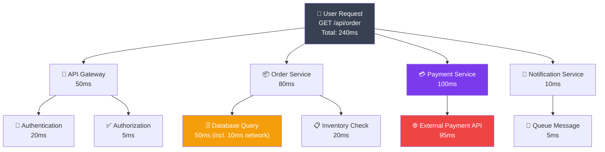

# Distributed Tracing

Socho tumhara Zomato jaisa order ek single request nahi hota — woh actually 6-7 alag microservices se hokar guzarta hai: API Gateway, Auth Service, Order Service, Inventory Service, Payment Service, Notification Service. Ab agar order place karne mein 3 second lag gaye, toh tumhe kaise pata chalega ki delay kahan hua? Payment gateway slow tha? Ya database query atki thi? Ya phir Auth service hi lucky nahi tha aaj?

Yeh exactly woh problem hai jo **Distributed Tracing** solve karta hai. Ek monolith app mein toh tum stack trace dekh ke bol sakte ho "yeh function slow hai", lekin microservices mein request ek service se doosre service mein jaati hai, network hop karti hai, aur agar tumhare paas tracing nahi hai toh tum andhere mein teer chala rahe ho.

> [!info]
> Distributed tracing ek technique hai jisse ek single request ka poora safar — start se end tak, saare services ke through — track kiya ja sakta hai. Isse tumhe pata chalta hai ki total time kahan-kahan gaya.

## Kyun zaruri hai Distributed Tracing?

Jab tumhara system sirf ek service tha, debugging simple thi — logs dekho, stack trace dekho, done. Lekin jaise hi tum microservices architecture pe gaye (jaise Swiggy ka backend — separate services for restaurants, orders, delivery, payments, notifications), ek single user request kai services ko touch karta hai.

Ab agar kisi user ne complain kiya "mera order place karne mein bahut time laga", toh tumhare paas do options hain:
1. Har service ke logs mein manually jaake dhundo (nightmare — especially jab 50+ services ho)
2. Ek trace ID follow karo jo poori request journey dikhata hai (yeh hai sahi tarika)

Distributed tracing tumhe **Trace** aur **Spans** deta hai:
- **Trace** = poori request ka end-to-end journey (jaise ek IRCTC ticket booking ka poora flow — login se leke payment confirmation tak)
- **Span** = uss trace ke andar ek individual operation (jaise "database query", "payment gateway call", "inventory check")

Har span ka apna start time, end time, aur duration hota hai. Spans ek doosre ke "parent-child" ho sakte hain — jaise "processOrder" span ke andar "fetchInventory" aur "processPayment" spans nested honge.

## Jaeger

**Jaeger** ek open-source distributed tracing system hai jo originally Uber ne banaya tha (unke apne massive microservices problem ko solve karne ke liye). Yeh saare traces ko collect, store, aur visualize karta hai ek nice UI ke through.

Socho Jaeger ko ek "CCTV control room" ki tarah — jahan tumhare poore building (microservices) ke saare cameras (traces) ki feed aa rahi hai, aur tum ek single dashboard se dekh sakte ho ki kaunsa floor (service) mein kya chal raha hai.

Jaeger ke teen main components hote hain:
- **Agent** — service ke paas locally chalta hai, spans collect karke forward karta hai
- **Collector** — agents se data leke process karta hai aur storage mein daalta hai
- **UI** — traces ko visually explore karne ke liye (waterfall diagrams, timing breakdown, etc.)

```yaml
# docker-compose.yml
services:
  jaeger:
    image: jaegertracing/all-in-one
    ports:
      - "6831:6831/udp"  # Jaeger agent
      - "16686:16686"    # UI
```

> [!tip]
> `jaegertracing/all-in-one` image local development ke liye perfect hai — ismein agent, collector, query service, aur UI sab ek hi container mein bundled hain. Production mein tum inhe separately scale karoge (especially jab traffic zyada ho, jaise Big Billion Days sale).

## Instrumentation with OpenTelemetry

**Kya hota hai instrumentation?** Iska matlab hai tumhare code mein tracing logic "inject" karna taaki har HTTP call, DB query, ya external API call automatically track ho jaaye.

**OpenTelemetry (OTel)** ek vendor-neutral standard hai jo Google, Microsoft, aur poori CNCF community ne mil ke banaya hai. Isse pehle har tracing tool (Jaeger, Zipkin, DataDog) ka apna alag SDK hota tha — matlab agar tum Jaeger se DataDog switch karna chahte the, toh tumhe poora instrumentation code rewrite karna padta tha.

OpenTelemetry isko fix karta hai — tum ek baar instrument karo apne code ko OTel SDK se, aur phir backend (Jaeger, Zipkin, Honeycomb, DataDog, jo bhi) change karna sirf ek exporter config change karne jaisa hai. Yeh bilkul waise hai jaise UPI ek common payment layer hai — chahe tum GPay use karo ya PhonePe ya Paytm, underlying protocol same hai.

```javascript
// Node.js tracing
const { NodeSDK } = require('@opentelemetry/sdk-node');
const { getNodeAutoInstrumentations } = require('@opentelemetry/auto-instrumentations-node');
const { JaegerExporter } = require('@opentelemetry/exporter-trace-jaeger');

const jaegerExporter = new JaegerExporter({
  endpoint: 'http://localhost:6831',
});

const sdk = new NodeSDK({
  traceExporter: jaegerExporter,
  instrumentations: [getNodeAutoInstrumentations()],
});

sdk.start();

// Automatic tracing of HTTP, database, etc.
```

Yahan sabse important cheez hai `getNodeAutoInstrumentations()`. Yeh function automatically HTTP requests, Express routes, database queries (Postgres, MongoDB, Redis, sab kuch), aur even external API calls ko instrument kar deta hai — tumhe manually kuch bhi wrap karne ki zaroorat nahi. Yeh basically "auto-instrumentation" ka magic hai — jaise CRED app tumhare saare transactions automatically track kar leta hai bina tumhe kuch explicitly batane ke.

> [!warning]
> `sdk.start()` ko apne application ke sabse pehle line mein call karna zaroori hai — usse pehle koi bhi require/import nahi hona chahiye jo tum trace karna chahte ho. Agar tumne Express ko pehle require kar liya aur uske baad SDK start kiya, toh auto-instrumentation kaam nahi karega kyunki OTel monkey-patching se kaam karta hai (module load hone se pehle hi hook lagana padta hai).

## Manual Spans

Auto-instrumentation bahut kuch cover kar leta hai — HTTP calls, DB queries — lekin tumhare **business logic** ke andar ke custom operations ko track karne ke liye tumhe manually spans banane padte hain.

Socho tum "processOrder" function likh rahe ho jo internally inventory check karta hai aur phir payment process karta hai. Tum chahte ho ki Jaeger UI mein yeh dikhe ki inventory check mein kitna time laga aur payment processing mein kitna — sirf "processOrder ne 240ms liya" itna kaafi nahi hai, breakdown chahiye.

```javascript
const tracer = require('@opentelemetry/api').trace.getTracer('my-app');

async function processOrder(orderId) {
  const span = tracer.startSpan('processOrder');

  try {
    // Span operations
    span.setAttribute('orderId', orderId);

    const span2 = tracer.startSpan('fetchInventory', {
      parent: span
    });
    // Fetch inventory
    span2.end();

    const span3 = tracer.startSpan('processPayment', {
      parent: span
    });
    // Process payment
    span3.end();

    return result;
  } catch (error) {
    span.recordException(error);
    throw error;
  } finally {
    span.end();
  }
}
```

Is code mein kya ho raha hai, step by step samjhte hain:

1. `tracer.startSpan('processOrder')` — ek parent span create hota hai jo poore order processing ko represent karta hai
2. `span.setAttribute('orderId', orderId)` — span ke saath metadata attach kar rahe hain, taaki jab tum Jaeger UI mein dekho toh pata chale yeh trace kis order ke liye tha (bilkul waise jaise Ola ride ID se tum poori trip track kar sakte ho)
3. `span2` aur `span3` — child spans hain jo `processOrder` ke parent span ke andar nested honge. Jaeger UI mein yeh ek waterfall diagram ki tarah dikhega, jahan tumhe exactly pata chalega ki inventory check mein kitna time gaya vs payment processing mein
4. `span.recordException(error)` — agar koi error aaya toh usko span mein record kar diya jaata hai, taaki debugging karte waqt tumhe exact span pata ho jahan failure hua
5. `finally { span.end(); }` — **yeh sabse critical line hai**. Har span ko explicitly `.end()` call karna hi padta hai, warna woh span kabhi complete nahi hoga aur Jaeger UI mein woh trace incomplete/hanging dikhega

> [!warning]
> Agar tum `span.end()` call karna bhool gaye (especially error path mein), toh tumhare traces "memory leak" ki tarah incomplete rehte hain aur production mein tumhe confusing, half-finished traces dikhenge. Hamesha `try...finally` pattern use karo taaki span end zaroor ho, chahe success ho ya failure.

## Trace Visualization

Ab jab poora system instrumented hai, toh Jaeger UI mein ek trace kuch aisa dikhega — bilkul ek waterfall/timeline ki tarah, jahan har bar ek span represent karta hai aur uski length uske duration ko show karti hai.



Is diagram ko dekh ke tum turant bol sakte ho ki **total 240ms mein se 100ms Payment Service ne khaya, aur uska bhi 95ms External Payment API call mein gaya**. Yeh matlab hai ki agar tumhe order placement ko fast karna hai, toh tumhara focus payment gateway integration pe hona chahiye — Order Service ya Notification Service optimize karne ka koi fayda nahi.

Yeh bilkul waise hai jaise IRCTC ticket booking mein agar payment page slow load ho raha hai, toh us pe blame lagana galat hoga agar actual bottleneck bank ke payment gateway mein hai — tracing tumhe exactly yeh differentiate karne mein madad karta hai.

Bina tracing ke, tumhe har service ke logs alag-alag dekhne padte, timestamps match karne padte, aur guess karna padta ki kaunsi request kis request se related hai. Tracing ke saath, ek click mein poori story dikh jaati hai.

Access at: http://localhost:16686

> [!tip]
> Jaeger UI mein tum service-wise filter kar sakte ho, slow traces (jaise >500ms wale) dhoondh sakte ho, aur error waale traces highlight kar sakte ho. Production debugging mein yeh feature bahut kaam aata hai jab tumhe pata karna ho ki "aaj subah 10 baje jo latency spike aaya woh kis service ki wajah se tha".

## Key Takeaways

- **Trace** ek single request ka poora end-to-end journey represent karta hai, saare microservices ke through
- **Span** trace ke andar ek individual operation hota hai (jaise ek DB query, ek API call) — spans parent-child relationship mein nested ho sakte hain
- **OpenTelemetry** vendor-neutral standard hai — ek baar instrument karo, backend (Jaeger, Zipkin, DataDog) kabhi bhi switch kar sakte ho
- **Jaeger** ek open-source tracing backend hai jo traces collect, store, aur visualize karta hai
- **Auto-instrumentation** (`getNodeAutoInstrumentations()`) HTTP, DB queries jaisi common cheezein automatically track kar deta hai — manual code likhne ki zaroorat nahi
- **Manual spans** business-logic-specific operations ko track karne ke liye use hote hain — hamesha `try...finally` mein `span.end()` call karo
- Tracing se tum exactly identify kar sakte ho ki distributed system mein latency/bottleneck kahan hai — bina isse debugging andhere mein teer chalane jaisa hai

Next: [Health Checks & Alerts](./06_health_checks_and_alerts.md)
