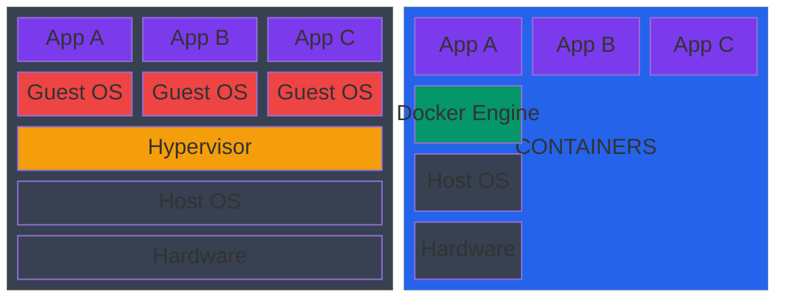
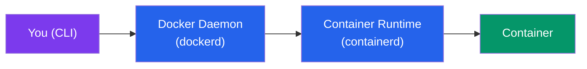

# What is Docker?

## What You'll Learn

- The problem Docker solves
- Containers vs Virtual Machines
- Core Docker concepts: image, container, registry, Dockerfile
- How Docker works under the hood

---

## The Problem Docker Solves

Every developer has experienced this:

> "It works on my machine."

Your app runs fine locally but breaks in production. Why? Different OS versions, different library versions, different environment variables, missing dependencies.

**Docker's answer**: package your app *and everything it needs* into a single unit called a **container**. That container runs identically everywhere — your laptop, a CI server, production.

---

## Containers vs Virtual Machines

Both containers and VMs provide isolation, but they do it differently.



```
┌──────────────────────────────────────────────────────────────────┐
│   VIRTUAL MACHINES                   CONTAINERS                  │
│                                                                  │
│  ┌────────┬────────┬────────┐    ┌────────┬────────┬────────┐   │
│  │ App A  │ App B  │ App C  │    │ App A  │ App B  │ App C  │   │
│  ├────────┼────────┼────────┤    ├────────┴────────┴────────┤   │
│  │Guest OS│Guest OS│Guest OS│    │      Docker Engine       │   │
│  ├────────┴────────┴────────┤    ├─────────────────────────┤    │
│  │      Hypervisor          │    │        Host OS           │   │
│  ├─────────────────────────┤     ├─────────────────────────┤    │
│  │        Host OS           │    │        Hardware          │   │
│  ├─────────────────────────┤     └─────────────────────────┘    │
│  │        Hardware          │                                    │
│  └─────────────────────────┘                                     │
└──────────────────────────────────────────────────────────────────┘
```

| | Virtual Machine | Container |
|---|---|---|
| **Includes** | Full OS (GBs) | Just your app + libs (MBs) |
| **Startup time** | Minutes | Seconds (or milliseconds) |
| **Isolation** | Full hardware isolation | Process-level isolation |
| **Resource overhead** | High | Very low |
| **Portability** | VM image is large, slow to move | Image is small, fast to push/pull |
| **Use case** | Run different OSes, strong isolation | Microservices, CI/CD, dev environments |

Containers share the **host OS kernel** — they don't boot a new OS. That's why they start so fast and use so little memory.

---

## Core Concepts

Before you run your first command, understand these five terms. Everything else builds on them.

### 1. Image

A **read-only template** that contains your application code, runtime, libraries, and configuration. Think of it as a snapshot.

```
node:20-alpine image contains:
  ├── Alpine Linux (minimal OS filesystem)
  ├── Node.js 20 runtime
  └── npm
```

Images are **built** from a `Dockerfile` and **stored** in a registry.

### 2. Container

A **running instance** of an image. You can run many containers from the same image.

```
Image (blueprint)  →  Container 1 (running instance)
                   →  Container 2 (running instance)
                   →  Container 3 (running instance)
```

Containers are **isolated** from each other and from the host. Each has its own filesystem, network, and process space.

### 3. Dockerfile

A **text file** with step-by-step instructions for building an image.

```dockerfile
FROM node:20-alpine        # start from Node.js image
WORKDIR /app               # set working directory
COPY package*.json ./      # copy package files
RUN npm install            # install dependencies
COPY . .                   # copy app source code
EXPOSE 3000                # document the port
CMD ["node", "server.js"]  # command to run
```

### 4. Registry

A **storage service** for Docker images. The default is [Docker Hub](https://hub.docker.com/).

```
Docker Hub (hub.docker.com)
  ├── nginx:latest          # official image
  ├── node:20-alpine        # official image
  ├── postgres:16           # official image
  └── yourname/myapp:v1.0   # your image
```

Private registries: AWS ECR, GitHub Container Registry, GitLab Registry.

### 5. Docker Engine

The **daemon** that runs on your machine and manages containers. Docker Desktop installs and runs this automatically.

---

## How Docker Works

When you run `docker run nginx`:

```
1. Docker looks for the nginx image locally
2. Not found → pulls it from Docker Hub
3. Creates a container from the image
4. Starts the container (isolated process)
5. Container has its own filesystem, network, processes
```



```
You (CLI)  →  Docker Daemon  →  Container Runtime (containerd)  →  Container
              (dockerd)
```

---

## What Docker Is NOT

- Not a virtual machine — no full OS inside
- Not a hypervisor
- Not just for Linux — Docker Desktop runs on Windows and Mac too
- Not magic — containers are just Linux processes with namespace and cgroup isolation

---

## Key Takeaways

- Docker packages apps and their dependencies into portable **containers**
- **Images** are blueprints; **containers** are running instances
- Containers share the host kernel → lightweight and fast
- **Dockerfiles** define how images are built
- **Docker Hub** is the default registry for storing/sharing images

---

**Next**: [Installation & Setup](./02_installation_setup.md) — get Docker running on your machine
