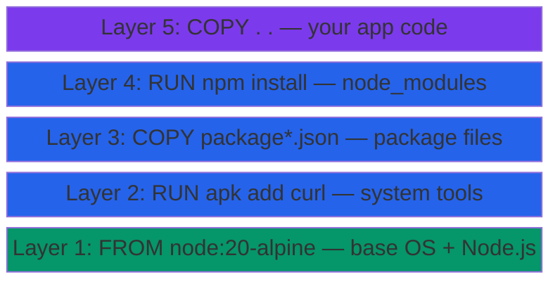
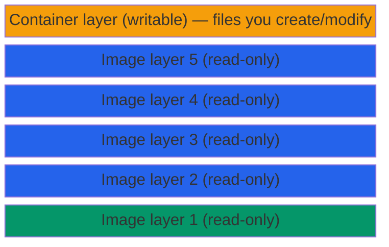

# Understanding Docker Images

## What You'll Learn

- How images are structured (layers)
- How layer caching works
- What image tags mean
- How registries work
- How to read an image ID

---

## Images are Made of Layers

A Docker image is not a single file — it's a **stack of read-only layers**. Each instruction in a Dockerfile adds a layer.



```
┌──────────────────────────────┐
│  Layer 5: COPY . .           │  ← your app code
├──────────────────────────────┤
│  Layer 4: RUN npm install    │  ← node_modules
├──────────────────────────────┤
│  Layer 3: COPY package*.json │  ← package files
├──────────────────────────────┤
│  Layer 2: RUN apk add curl   │  ← system tools
├──────────────────────────────┤
│  Layer 1: FROM node:20-alpine│  ← base OS + Node.js
└──────────────────────────────┘
```

Each layer is identified by a **SHA256 hash** of its contents.

---

## Why Layers Matter: Caching

When you rebuild an image, Docker reuses layers that haven't changed. Only layers **after** a change are rebuilt.

```
First build:
  Layer 1: FROM node:20-alpine    → pulled from Docker Hub
  Layer 2: RUN apk add curl       → executed
  Layer 3: COPY package*.json ./  → copied
  Layer 4: RUN npm install        → executed (downloads packages)
  Layer 5: COPY . .               → copied
  Total build time: 45 seconds

You change your app code (server.js) and rebuild:
  Layer 1: FROM node:20-alpine    → ✅ CACHED
  Layer 2: RUN apk add curl       → ✅ CACHED
  Layer 3: COPY package*.json ./  → ✅ CACHED
  Layer 4: RUN npm install        → ✅ CACHED
  Layer 5: COPY . .               → 🔄 REBUILT (source changed)
  Total build time: 2 seconds
```

**Cache invalidation rule**: if a layer changes, all subsequent layers are invalidated.

This is why you copy `package*.json` and `npm install` *before* copying source code — so you don't re-run npm install on every code change.

---

## Copy-on-Write: Container Layer

When you start a container from an image, Docker adds a **thin writable layer** on top:



```
┌──────────────────────────────┐
│  Container layer (writable)  │  ← files you create/modify while running
├──────────────────────────────┤
│  Image layer 5 (read-only)   │
│  Image layer 4 (read-only)   │
│  Image layer 3 (read-only)   │
│  Image layer 2 (read-only)   │
│  Image layer 1 (read-only)   │
└──────────────────────────────┘
```

- If you create a file inside a running container, it goes to the writable layer
- If you modify an image file, Docker **copies** it to the writable layer first (copy-on-write)
- When you delete the container, the writable layer is **gone**
- The image layers below are **untouched** and shared across all containers using that image

This is why two containers from the same image can run simultaneously without interfering with each other.

---

## Image Tags

Tags are human-readable names for image versions.

```
REPOSITORY          TAG          IMAGE ID        SIZE
node                20-alpine    c962028e7b28    127 MB
node                20           a8b8e5d7f3c1    1.1 GB
node                latest       a8b8e5d7f3c1    1.1 GB
postgres            16-alpine    d5f2b8e1a3c7    243 MB
postgres            16           8b3a5c9d2e1f    425 MB
postgres            latest       8b3a5c9d2e1f    425 MB
myapp               v1.0.0       f7a2d9e4b8c3    89 MB
myapp               v1.1.0       3e6c1a8d5f2b    91 MB
```

### Tag Format

```
[registry/][namespace/]repository:tag

# Examples:
nginx                          # docker.io/library/nginx:latest
nginx:1.25                     # specific version
node:20-alpine                 # Node 20 on Alpine Linux
ghcr.io/myorg/myapp:v2.0       # GitHub Container Registry
123456789.dkr.ecr.us-east-1.amazonaws.com/myapp:prod  # AWS ECR
```

### Common Tag Patterns

| Tag | Meaning |
|-----|---------|
| `latest` | Default when no tag specified. **Not recommended for production** (it can change) |
| `20` | Major version — gets minor/patch updates |
| `20.11` | Major.minor — gets patch updates only |
| `20.11.0` | Exact version — never changes |
| `20-alpine` | Node 20 on Alpine Linux (minimal, ~5MB base) |
| `20-slim` | Debian-based but stripped down |
| `lts` | Long-term support version |
| `lts-alpine` | LTS + Alpine |

**Best practice for production**: use an exact version tag like `node:20.11.0-alpine3.19`

---

## Image IDs

Every image has a unique SHA256 digest:

```bash
docker images --no-trunc
# REPOSITORY  TAG       IMAGE ID                                                                 SIZE
# nginx       latest    sha256:a72860cb95fd59e9c696c66441c64f18e66915fa26b249911e83c3854477ed9   187MB
```

The short ID shown normally (e.g., `a72860cb95fd`) is just the first 12 characters.

---

## Registries

### Docker Hub

The default registry at `hub.docker.com`.

```
hub.docker.com
├── Official images (maintained by Docker/vendors)
│   ├── nginx
│   ├── node
│   ├── postgres
│   └── python
└── Community images (user/org namespaced)
    ├── myusername/myapp
    └── myorg/backend
```

Pull without specifying a registry defaults to Docker Hub:
```bash
docker pull nginx         # same as: docker pull docker.io/library/nginx:latest
docker pull node:20       # same as: docker pull docker.io/library/node:20
```

### Other Registries

```bash
# GitHub Container Registry
docker pull ghcr.io/owner/repo:tag

# AWS ECR
docker pull 123456789.dkr.ecr.us-east-1.amazonaws.com/myapp:latest

# Self-hosted (e.g., local registry on port 5000)
docker pull localhost:5000/myapp:latest
```

---

## Inspect an Image's Layers

```bash
# See image history (each layer, its command, and size)
docker image history nginx

# IMAGE          CREATED       CREATED BY                                      SIZE
# a72860cb95fd   2 weeks ago   /bin/sh -c #(nop)  CMD ["nginx" "-g" "daemon…   0B
# <missing>      2 weeks ago   /bin/sh -c #(nop)  STOPSIGNAL SIGQUIT           0B
# <missing>      2 weeks ago   /bin/sh -c set -x     && addgroup --system …    67.5MB
# <missing>      2 weeks ago   /bin/sh -c #(nop)  ENV PKG_RELEASE=1~bookworm   0B
# ...

# Full inspect: image config, layers, entrypoint, environment
docker inspect nginx
```

---

## Key Takeaways

- Images are stacks of **read-only layers** — each Dockerfile instruction adds one
- Docker **caches layers** — unchanged layers are reused in subsequent builds
- When a container runs, a **thin writable layer** is added on top (discarded when container stops)
- **Tags** identify versions — use specific versions in production, not `latest`
- Registries store images — **Docker Hub** is the default

---

**Next**: [Managing Images](./02_managing_images.md) — pull, tag, inspect, push
