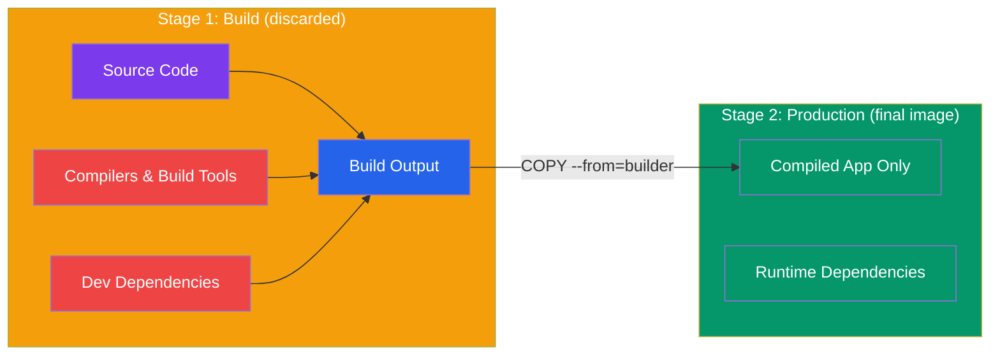

# Multi-Stage Builds

## What You'll Learn

- Why multi-stage builds exist
- How to separate build and runtime stages
- Real examples for Node.js, Go, and Python
- How to target specific stages

---

## The Problem

Many languages require build tools that aren't needed at runtime:



```
TypeScript app:
  Build needs:   Node.js + npm + TypeScript compiler + dev dependencies
  Runtime needs: Node.js + compiled JS files only

Go app:
  Build needs:   Go compiler + build tools (hundreds of MB)
  Runtime needs: Just the compiled binary (few MB)

Java app:
  Build needs:   JDK + Maven/Gradle + source code
  Runtime needs: JRE + compiled JAR only
```

Without multi-stage builds, you'd either:
1. Include all build tools in your production image (bloated, security risk)
2. Use complex CI/CD scripts to build outside Docker and copy in

Multi-stage builds solve this inside a single Dockerfile.

---

## How Multi-Stage Builds Work

```dockerfile
# Stage 1: "builder"
FROM node:20-alpine AS builder
WORKDIR /app
COPY package*.json ./
RUN npm ci                    # includes devDependencies
COPY . .
RUN npm run build             # compile TypeScript → dist/

# Stage 2: "production"
FROM node:20-alpine AS production
WORKDIR /app
COPY package*.json ./
RUN npm ci --only=production  # only runtime deps
COPY --from=builder /app/dist ./dist   # ← copy ONLY the output from stage 1
USER node
CMD ["node", "dist/server.js"]
```

The final image contains **only** what's in the `production` stage — the `builder` stage is discarded. The TypeScript compiler and all dev dependencies never make it into the production image.

```bash
docker build -t my-ts-app .
docker images my-ts-app
# REPOSITORY    TAG       SIZE
# my-ts-app     latest    89MB    ← vs ~500MB with all build tools
```

---

## Example: TypeScript Node.js App

```dockerfile
# ─── Stage 1: Build ───────────────────────────────────
FROM node:20-alpine AS builder

WORKDIR /app

COPY package*.json tsconfig.json ./
RUN npm ci                          # install dev deps (includes typescript)

COPY src/ ./src/
RUN npm run build                   # tsc: src/ → dist/

# ─── Stage 2: Production ─────────────────────────────
FROM node:20-alpine AS production

WORKDIR /app

COPY package*.json ./
RUN npm ci --only=production        # no typescript, no jest, etc.

COPY --from=builder /app/dist ./dist

USER node
EXPOSE 3000

HEALTHCHECK --interval=30s CMD wget -qO- http://localhost:3000/health || exit 1

CMD ["node", "dist/server.js"]
```

---

## Example: Go Application (Tiny Final Image)

Go compiles to a static binary — the final image can be `scratch` (literally empty):

```dockerfile
# ─── Stage 1: Build ───────────────────────────────────
FROM golang:1.22-alpine AS builder

WORKDIR /app

COPY go.mod go.sum ./
RUN go mod download

COPY . .
RUN CGO_ENABLED=0 GOOS=linux go build -o app ./cmd/server

# ─── Stage 2: Minimal runtime ─────────────────────────
FROM scratch AS production
# scratch = empty image, nothing installed

COPY --from=builder /app/app /app
COPY --from=builder /etc/ssl/certs/ca-certificates.crt /etc/ssl/certs/

EXPOSE 8080
ENTRYPOINT ["/app"]
```

Image sizes:
```
golang:1.22-alpine (builder)  ~270MB  (discarded)
Final image                   ~8MB    (just the binary!)
```

---

## Example: Python (with uv for fast installs)

```dockerfile
# ─── Stage 1: Build dependencies ──────────────────────
FROM python:3.12-slim AS builder

RUN pip install uv
WORKDIR /app

COPY requirements.txt .
RUN uv pip install --system --no-cache -r requirements.txt

# ─── Stage 2: Production ─────────────────────────────
FROM python:3.12-slim AS production

WORKDIR /app

# Copy installed packages from builder
COPY --from=builder /usr/local/lib/python3.12/site-packages /usr/local/lib/python3.12/site-packages
COPY --from=builder /usr/local/bin /usr/local/bin

COPY . .

RUN adduser --system --no-create-home appuser
USER appuser

EXPOSE 8000
CMD ["uvicorn", "main:app", "--host", "0.0.0.0", "--port", "8000"]
```

---

## Example: React Frontend (Build + Serve)

```dockerfile
# ─── Stage 1: Build React app ─────────────────────────
FROM node:20-alpine AS builder

WORKDIR /app
COPY package*.json ./
RUN npm ci
COPY . .
RUN npm run build                   # creates /app/dist/

# ─── Stage 2: Serve with Nginx ────────────────────────
FROM nginx:alpine AS production

# Replace default nginx config
COPY nginx.conf /etc/nginx/conf.d/default.conf

# Copy built static files
COPY --from=builder /app/dist /usr/share/nginx/html

EXPOSE 80
CMD ["nginx", "-g", "daemon off;"]
```

**nginx.conf**:
```nginx
server {
    listen 80;
    root /usr/share/nginx/html;
    index index.html;

    # For single-page apps — serve index.html for all routes
    location / {
        try_files $uri $uri/ /index.html;
    }
}
```

Image sizes:
```
node:20-alpine + React build tools  ~600MB  (discarded)
nginx:alpine + static files         ~25MB   ← final image
```

---

## Targeting Specific Stages

You can build and stop at any stage — useful for debugging:

```dockerfile
FROM node:20-alpine AS deps
RUN npm ci

FROM deps AS builder
RUN npm run build

FROM node:20-alpine AS production
COPY --from=builder /app/dist .
```

```bash
# Build only the 'builder' stage (run tests in CI)
docker build --target builder -t my-app:test .

# Build the final production image
docker build --target production -t my-app:prod .

# Run tests in the build stage
docker run --rm my-app:test npm test
```

---

## Caching Across Stages

Each stage caches independently. In CI, you can use `--cache-from` to reuse caches from a previously pulled image:

```bash
# Pull the previous build for cache
docker pull myapp:latest || true

# Build using previous image as cache
docker build \
  --cache-from myapp:latest \
  --target production \
  -t myapp:${GIT_SHA} \
  -t myapp:latest \
  .
```

---

## Size Comparison

| Approach | Size |
|----------|------|
| Node.js app, naive (no multi-stage) | ~1.1 GB |
| Node.js app, single stage + alpine | ~180 MB |
| Node.js + TypeScript, multi-stage | ~89 MB |
| React app, nginx serve | ~25 MB |
| Go app, scratch | ~8 MB |

---

**Next**: [Running Containers](../03_containers/01_running_containers.md) — master container lifecycle
