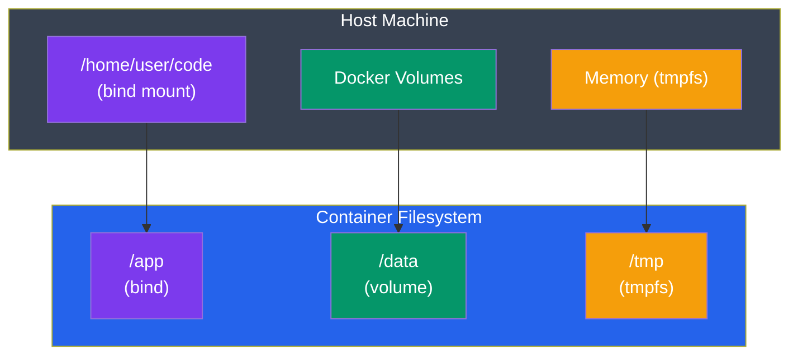

# Volumes & Storage

## What You'll Learn

- Why container storage is ephemeral
- Named volumes — Docker-managed persistent storage
- Bind mounts — mount host directories into containers
- tmpfs mounts — in-memory temporary storage
- When to use each type

---

## The Storage Problem

Containers are **ephemeral** by default. Everything written to a container's filesystem disappears when the container is removed.

```bash
# Run a container, create a file
docker run -it ubuntu bash
echo "important data" > /data/file.txt
exit   # container stops

# Start the same container again
docker start -ai <container-id>
cat /data/file.txt    # STILL THERE (container still exists)

# But if you remove it:
docker rm <container-id>
# Then run a new container — the file is gone
docker run -it ubuntu bash
cat /data/file.txt    # No such file
```

**Volumes** solve this by storing data outside the container's lifecycle.

---

## Three Types of Mounts



```
┌─────────────────────────────────────────────────────────────┐
│  Host Machine                                               │
│  ┌──────────────────┐   ┌─────────┐   ┌──────────────────┐ │
│  │  /home/user/code │   │ Docker  │   │  Memory (tmpfs)  │ │
│  │  (bind mount)    │   │ Volumes │   │                  │ │
│  └────────┬─────────┘   └────┬────┘   └────────┬─────────┘ │
│           │                  │                 │           │
│  ┌────────▼──────────────────▼─────────────────▼─────────┐ │
│  │               Container filesystem                    │ │
│  │   /app (bind)    /data (volume)   /tmp (tmpfs)        │ │
│  └───────────────────────────────────────────────────────┘ │
└─────────────────────────────────────────────────────────────┘
```

---

## Named Volumes

Docker manages the storage location (usually `/var/lib/docker/volumes/` on Linux). You reference it by name.

**Best for**: databases, persistent app data, anything you want Docker to manage.

```bash
# Create a named volume
docker volume create my-data

# List volumes
docker volume ls

# Run container with a named volume
docker run -d \
  --name my-postgres \
  -v my-data:/var/lib/postgresql/data \    # volume:container-path
  -e POSTGRES_PASSWORD=secret \
  postgres:16-alpine
```

The data in `/var/lib/postgresql/data` inside the container is now stored in the `my-data` volume.

```bash
# Remove the container
docker rm -f my-postgres

# Volume still exists!
docker volume ls     # my-data is still there

# Start a new container with the same volume — data is intact
docker run -d \
  --name postgres-v2 \
  -v my-data:/var/lib/postgresql/data \
  -e POSTGRES_PASSWORD=secret \
  postgres:16-alpine

# Connect and check — your tables are still there
docker exec -it postgres-v2 psql -U postgres
\dt    # your tables are still there
```

### Volume Commands

```bash
# Create
docker volume create my-volume

# List
docker volume ls

# Inspect (see where data is stored on host)
docker volume inspect my-volume
# "Mountpoint": "/var/lib/docker/volumes/my-volume/_data"

# Remove (must not be in use by any container)
docker volume rm my-volume

# Remove all unused volumes
docker volume prune
```

### Short Syntax (Docker Creates Volume Automatically)

```bash
# No need to create the volume first — Docker auto-creates it
docker run -d -v postgres-data:/var/lib/postgresql/data postgres:16
```

---

## Bind Mounts

Mount a specific **directory or file from your host** into the container.

**Best for**: development (live code reloading), config files, sharing files.

```bash
# -v /absolute/host/path:/container/path
docker run -v /home/user/my-app:/app my-image

# Current directory (use $(pwd) or ${PWD})
docker run -v $(pwd):/app my-image

# Windows paths (Git Bash or PowerShell)
docker run -v C:/Users/you/my-app:/app my-image
docker run -v ${PWD}:/app my-image          # PowerShell

# Read-only bind mount
docker run -v $(pwd)/config:/app/config:ro my-image
```

### Development Workflow with Bind Mount

```bash
# Mount source code into container — changes on host reflect immediately
docker run -d \
  --name dev-server \
  -v $(pwd):/app \              # mount source code
  -v /app/node_modules \        # anonymous volume: KEEP container's node_modules, don't overlay with host
  -p 3000:3000 \
  -e NODE_ENV=development \
  node:20-alpine \
  sh -c "npm install && node --watch server.js"
```

The `-v /app/node_modules` trick (anonymous volume) prevents the host's `node_modules` (or lack thereof) from overwriting the container's freshly installed one.

### Config File Bind Mount

```bash
# Mount a specific config file (read-only)
docker run -d \
  -v $(pwd)/nginx.conf:/etc/nginx/nginx.conf:ro \
  -p 80:80 \
  nginx
```

---

## Volumes vs Bind Mounts — When to Use What

| | Named Volume | Bind Mount |
|---|---|---|
| **Managed by** | Docker | You |
| **Location** | Docker manages location | You specify path |
| **Works on** | All platforms identically | Path must exist on host |
| **Best for** | Databases, persistent data | Dev (live reload), config files |
| **Performance** | Excellent on all OS | Slower on Mac/Windows (VMs) |
| **Backup** | `docker volume inspect` to find path | Just your host filesystem |
| **Share between containers** | Yes | Yes |

```bash
# Database: use named volume (Docker manages it)
docker run -v postgres-data:/var/lib/postgresql/data postgres:16

# Dev server: use bind mount (live reload from host)
docker run -v $(pwd):/app -p 3000:3000 node:20-alpine
```

---

## tmpfs Mounts

In-memory only. Data is never written to disk and disappears when the container stops.

**Best for**: sensitive data, temporary files, high-performance temp storage.

```bash
docker run --tmpfs /tmp my-image
docker run --tmpfs /run:rw,noexec,nosuid,size=65536k my-image
```

---

## Inspecting Volumes on a Container

```bash
# See mounts on a running container
docker inspect my-container --format '{{json .Mounts}}' | python -m json.tool

# Example output:
# [
#   {
#     "Type": "volume",
#     "Name": "postgres-data",
#     "Source": "/var/lib/docker/volumes/postgres-data/_data",
#     "Destination": "/var/lib/postgresql/data",
#     "Mode": "",
#     "RW": true
#   }
# ]
```

---

## Backing Up a Volume

```bash
# Backup: spin up a temporary container, tar the volume, save to host
docker run --rm \
  -v my-volume:/data \
  -v $(pwd):/backup \
  alpine \
  tar czf /backup/my-volume-backup.tar.gz -C /data .

# Restore:
docker run --rm \
  -v my-volume:/data \
  -v $(pwd):/backup \
  alpine \
  tar xzf /backup/my-volume-backup.tar.gz -C /data
```

---

## Docker Desktop: Volumes Tab

In Docker Desktop:
1. Go to **Volumes** tab
2. Click a volume to see:
   - Which containers use it
   - **Data** tab — browse the files inside the volume visually
   - Storage usage

You can also create and delete volumes from here.

---

**Next**: [Environment & Config](./04_environment_config.md) — pass configuration without hardcoding
