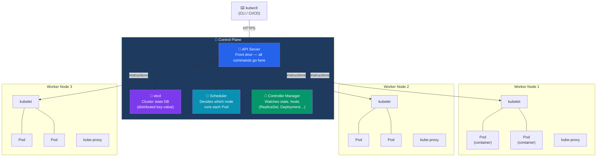

# What is Kubernetes?

## What You'll Learn

- Why Kubernetes exists and what problems it solves
- Kubernetes architecture: control plane and worker nodes
- Core Kubernetes objects (the vocabulary)
- Docker Compose vs Kubernetes

---

## Why Kubernetes?

Docker Compose is great for a single machine. But in production you need:

| Need | Docker Compose | Kubernetes |
|------|---------------|------------|
| Run on multiple machines | ❌ single host | ✅ cluster of nodes |
| Restart failed containers | ❌ manual | ✅ automatic |
| Scale based on load | ❌ manual | ✅ HorizontalPodAutoscaler |
| Zero-downtime deploys | ❌ | ✅ rolling updates |
| Self-healing | ❌ | ✅ replaces failed pods |
| Service discovery | ✅ (DNS) | ✅ (built-in DNS) |
| Load balancing | ❌ | ✅ built-in |
| Resource management | ❌ | ✅ requests & limits |
| Rollback deployments | ❌ | ✅ one command |

Kubernetes (K8s) automates deploying, scaling, and operating containerized applications.

---

## Kubernetes Architecture

A Kubernetes cluster has two types of machines:



### Control Plane Components

| Component | Role |
|-----------|------|
| **API Server** | Front door to the cluster. All `kubectl` commands go through it |
| **etcd** | Distributed key-value store that holds all cluster state |
| **Scheduler** | Decides which node a new Pod runs on |
| **Controller Manager** | Watches cluster state and makes corrections (e.g., if a pod dies, creates a new one) |

### Worker Node Components

| Component | Role |
|-----------|------|
| **kubelet** | Agent on each node. Starts/stops containers based on API server instructions |
| **kube-proxy** | Handles network rules for Services |
| **Container Runtime** | Runs containers (containerd, Docker Engine) |

---

## Core Kubernetes Objects

These are the vocabulary of Kubernetes. You'll define these as YAML files.

### Pod

The **smallest deployable unit**. A Pod wraps one or more containers that share networking and storage.

```
Pod: my-api
  └── Container: api (node:20-alpine, port 3000)
```

Pods are **ephemeral** — Kubernetes creates and destroys them. You don't manage individual pods; you manage higher-level objects.

### Deployment

Manages a set of identical Pods. Ensures N replicas are always running. Handles rolling updates.

```
Deployment: my-api (replicas: 3)
  └── ReplicaSet: my-api-7d8f9c (manages the pods)
       ├── Pod: my-api-7d8f9c-abc12
       ├── Pod: my-api-7d8f9c-def34
       └── Pod: my-api-7d8f9c-ghi56
```

### Service

Stable network endpoint for a set of Pods. Pods come and go, but the Service has a fixed name and IP.

```
Service: my-api-service (ClusterIP)
  → load balances across → Pod 1, Pod 2, Pod 3
```

### ConfigMap

Store non-sensitive configuration (environment variables, config files).

### Secret

Store sensitive data (passwords, tokens) — base64-encoded (not encrypted by default).

### Ingress

HTTP/HTTPS routing into the cluster. Maps `domain.com/api` to a Service.

### PersistentVolume / PersistentVolumeClaim

Storage that persists beyond Pod lifecycle (for databases).

### Namespace

Virtual cluster within a cluster — for organizing and isolating resources.

---

## The Desired State Model

Kubernetes uses a **declarative** model: you describe *what you want*, Kubernetes figures out *how to get there*.

```yaml
# "I want 3 replicas of my-api running"
apiVersion: apps/v1
kind: Deployment
metadata:
  name: my-api
spec:
  replicas: 3
  ...
```

Kubernetes continuously reconciles actual state with desired state:
- 3 replicas desired, only 2 running → create a new Pod
- Pod crashes → automatically replaced
- Node dies → reschedule affected Pods on other nodes

---

## Docker Compose vs Kubernetes

| | Docker Compose | Kubernetes |
|---|---|---|
| **File format** | `compose.yml` | YAML manifests (Deployment, Service, etc.) |
| **Runs on** | Single machine | Cluster of machines |
| **Network** | Automatic, service names | Services + DNS |
| **Storage** | Named volumes | PersistentVolumes |
| **Secrets** | env_file, secrets | Secrets objects |
| **Scaling** | `--scale worker=3` | `replicas: 3`, HPA |
| **Updates** | Restart container | Rolling update |
| **Health** | healthcheck | liveness/readiness probes |
| **Config** | environment, env_file | ConfigMaps, Secrets |
| **Complexity** | Low | Higher |
| **Best for** | Local dev, small deployments | Production, large scale |

---

## Local Kubernetes with Docker Desktop

For this tutorial, we use Kubernetes built into Docker Desktop — no cloud account needed.

```
Docker Desktop
└── Kubernetes (single-node cluster)
     └── All components run on your machine
          ├── Control Plane (in Docker containers)
          └── Worker Node (your machine is also the worker)
```

Enable it: **Settings → Kubernetes → Enable Kubernetes → Apply & Restart**

This gives you a real Kubernetes cluster running locally. Everything you learn here applies to production clusters.

---

**Next**: [Local Setup](./02_local_setup.md) — enable Kubernetes in Docker Desktop
