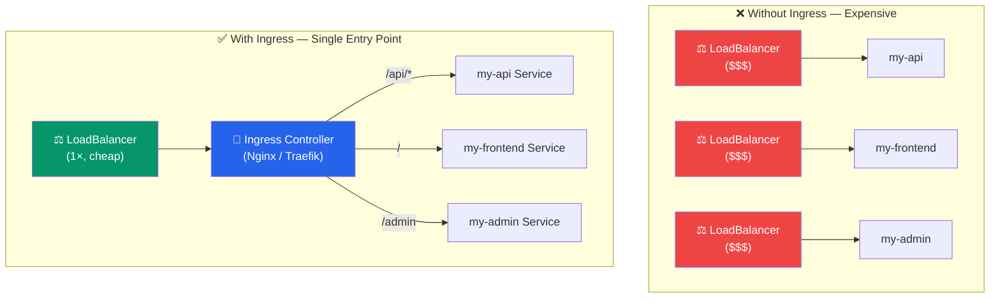

# Ingress

## What You'll Learn

- What Ingress is and why you need it
- Install Nginx Ingress Controller
- Route by path and by hostname
- TLS/HTTPS termination

---

## Why Ingress?

With just Services (NodePort/LoadBalancer), you'd need one LoadBalancer per service — expensive and hard to manage.

**Ingress** is a single entry point that routes HTTP/HTTPS traffic to multiple services based on rules:



---

## Ingress Controller

Ingress needs an **Ingress Controller** to actually handle traffic. The two most common are:

- **Nginx Ingress Controller** — most popular
- **Traefik** — also popular
- Cloud-specific: AWS ALB Ingress, GCE Ingress

### Install Nginx Ingress Controller (Docker Desktop)

```bash
kubectl apply -f https://raw.githubusercontent.com/kubernetes/ingress-nginx/controller-v1.9.4/deploy/static/provider/cloud/deploy.yaml

# Wait for it to be ready
kubectl wait --namespace ingress-nginx \
  --for=condition=ready pod \
  --selector=app.kubernetes.io/component=controller \
  --timeout=120s

# Verify
kubectl get pods -n ingress-nginx
# NAME                                        READY   STATUS    AGE
# ingress-nginx-controller-xxx                1/1     Running   1m

# On Docker Desktop, the controller gets localhost as external IP
kubectl get service -n ingress-nginx
# NAME                                 TYPE           EXTERNAL-IP   PORT(S)
# ingress-nginx-controller             LoadBalancer   localhost     80:xxx, 443:xxx
```

---

## Basic Ingress Resource

```yaml
# ingress.yaml
apiVersion: networking.k8s.io/v1
kind: Ingress
metadata:
  name: my-ingress
  annotations:
    nginx.ingress.kubernetes.io/rewrite-target: /    # strip prefix
spec:
  ingressClassName: nginx
  rules:
    - host: myapp.local                     # hostname-based routing
      http:
        paths:
          - path: /
            pathType: Prefix
            backend:
              service:
                name: my-frontend
                port:
                  number: 80
```

---

## Path-Based Routing

Route different paths to different services:

```yaml
apiVersion: networking.k8s.io/v1
kind: Ingress
metadata:
  name: app-ingress
  annotations:
    nginx.ingress.kubernetes.io/use-regex: "true"
spec:
  ingressClassName: nginx
  rules:
    - host: myapp.local
      http:
        paths:
          # API routes
          - path: /api
            pathType: Prefix
            backend:
              service:
                name: api-service
                port:
                  number: 80

          # Admin panel
          - path: /admin
            pathType: Prefix
            backend:
              service:
                name: admin-service
                port:
                  number: 80

          # Frontend catches everything else
          - path: /
            pathType: Prefix
            backend:
              service:
                name: frontend-service
                port:
                  number: 80
```

**Path types**:
- `Prefix` — matches path and all sub-paths (`/api` matches `/api/users`, `/api/posts`)
- `Exact` — exact match only (`/api` matches only `/api`, not `/api/users`)
- `ImplementationSpecific` — controller-dependent

---

## Hostname-Based Routing

Route different domains to different services:

```yaml
apiVersion: networking.k8s.io/v1
kind: Ingress
metadata:
  name: multi-host-ingress
spec:
  ingressClassName: nginx
  rules:
    - host: api.mycompany.com
      http:
        paths:
          - path: /
            pathType: Prefix
            backend:
              service:
                name: api-service
                port:
                  number: 80

    - host: www.mycompany.com
      http:
        paths:
          - path: /
            pathType: Prefix
            backend:
              service:
                name: frontend-service
                port:
                  number: 80

    - host: admin.mycompany.com
      http:
        paths:
          - path: /
            pathType: Prefix
            backend:
              service:
                name: admin-service
                port:
                  number: 80
```

---

## Local Testing with /etc/hosts

For local development, add hostnames to your hosts file:

**Windows**: `C:\Windows\System32\drivers\etc\hosts`
**Mac/Linux**: `/etc/hosts`

```
127.0.0.1  myapp.local
127.0.0.1  api.myapp.local
127.0.0.1  admin.myapp.local
```

Now `http://myapp.local` routes through Ingress to your cluster.

---

## TLS/HTTPS

```bash
# Create a self-signed certificate for local testing
openssl req -x509 -nodes -days 365 -newkey rsa:2048 \
  -keyout tls.key -out tls.crt \
  -subj "/CN=myapp.local/O=myapp"

# Create the TLS secret
kubectl create secret tls myapp-tls \
  --cert=tls.crt \
  --key=tls.key
```

```yaml
apiVersion: networking.k8s.io/v1
kind: Ingress
metadata:
  name: secure-ingress
  annotations:
    nginx.ingress.kubernetes.io/ssl-redirect: "true"
spec:
  ingressClassName: nginx
  tls:
    - hosts:
        - myapp.local
      secretName: myapp-tls     # TLS secret
  rules:
    - host: myapp.local
      http:
        paths:
          - path: /
            pathType: Prefix
            backend:
              service:
                name: frontend-service
                port:
                  number: 80
```

---

## Useful Ingress Annotations (Nginx)

```yaml
metadata:
  annotations:
    # Rewrite target (remove path prefix)
    nginx.ingress.kubernetes.io/rewrite-target: /$2

    # Rate limiting
    nginx.ingress.kubernetes.io/limit-rps: "100"

    # CORS
    nginx.ingress.kubernetes.io/enable-cors: "true"
    nginx.ingress.kubernetes.io/cors-allow-origin: "https://myapp.com"

    # Request size limit
    nginx.ingress.kubernetes.io/proxy-body-size: "10m"

    # Timeouts
    nginx.ingress.kubernetes.io/proxy-read-timeout: "60"
    nginx.ingress.kubernetes.io/proxy-send-timeout: "60"

    # Force HTTPS redirect
    nginx.ingress.kubernetes.io/ssl-redirect: "true"
```

---

## Check Ingress Status

```bash
kubectl get ingress
# NAME          CLASS   HOSTS        ADDRESS     PORTS   AGE
# app-ingress   nginx   myapp.local  localhost   80      2m

kubectl describe ingress app-ingress
# Events will show if there are configuration errors
```

---

**Next**: [Resource Management & HPA](./05_resource_management_hpa.md) — limits and auto-scaling
