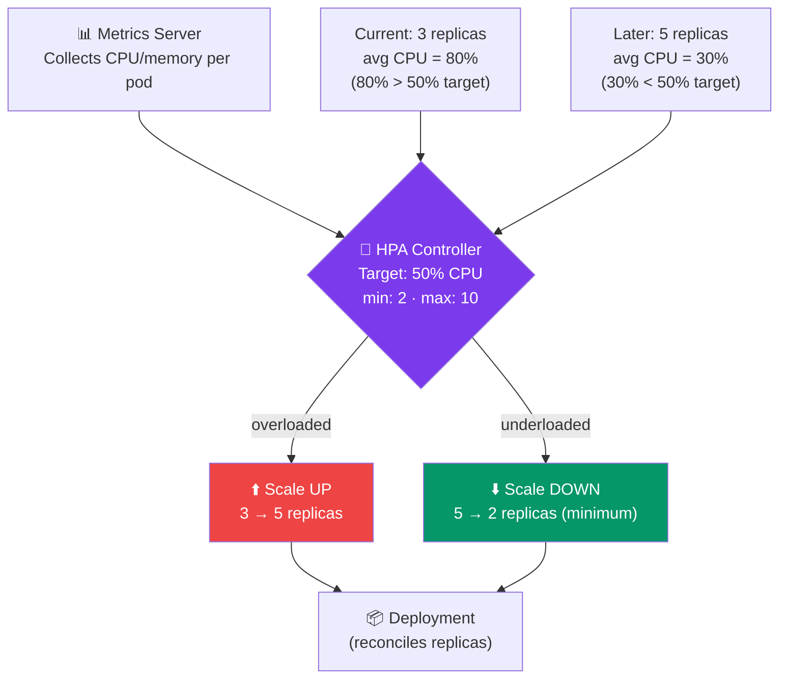

# Resource Management & Horizontal Pod Autoscaler

## What You'll Learn

- CPU and memory requests/limits
- Why limits matter
- HorizontalPodAutoscaler (HPA)
- Install Metrics Server
- Autoscaling in practice

---

## Resource Requests and Limits

```yaml
resources:
  requests:          # minimum guaranteed — used for scheduling
    memory: "128Mi"
    cpu: "100m"      # 100 millicores = 0.1 CPU core
  limits:            # maximum allowed — enforced at runtime
    memory: "256Mi"
    cpu: "500m"
```

### Requests

The **scheduler** uses requests to decide which node can run the Pod.

```
Node has: 2 CPU, 4Gi memory
Pod A requests: 500m CPU, 1Gi memory
Pod B requests: 500m CPU, 1Gi memory
Pod C requests: 500m CPU, 1Gi memory
Pod D requests: 500m CPU, 1Gi memory
→ 4 pods fit (2000m CPU, 4Gi memory)

Pod E requests: 500m CPU, 1Gi memory
→ Cannot schedule — no resources available
```

### Limits

Kubernetes **enforces** limits at runtime:
- CPU: container is **throttled** (slowed down) when it exceeds the CPU limit
- Memory: container is **OOMKilled** (killed) when it exceeds the memory limit

### CPU Units

```
1 CPU = 1000m (millicores)
0.5 CPU = 500m
0.1 CPU = 100m

# Cloud equivalents:
1 AWS vCPU = 1 CPU = 1000m
1 GCP vCPU = 1 CPU = 1000m
```

### Memory Units

```
128Mi = 128 mebibytes (MiB)
256Mi = 256 MiB
1Gi   = 1024 MiB
2Gi   = 2048 MiB
```

---

## Best Practices for Resources

```yaml
containers:
  - name: api
    # Start with requests ≈ actual usage
    # Set limits to 2-4x requests
    resources:
      requests:
        memory: "128Mi"
        cpu: "100m"
      limits:
        memory: "256Mi"    # 2x request
        cpu: "500m"        # 5x request (CPU is burstable)
```

**Rules of thumb**:
- Always set **requests** — without them, pods can be scheduled anywhere
- Always set **memory limits** — prevents memory leaks from taking down nodes
- CPU limits are optional — better to throttle than to crash
- Request/limit ratio: memory 1:2, CPU 1:5 (CPU bursts more than memory)

---

## Monitoring Actual Usage

```bash
# See current CPU and memory usage per pod
kubectl top pods

# NAME                      CPU(cores)   MEMORY(bytes)
# my-api-7d8f9c-abc12       15m          45Mi
# my-api-7d8f9c-def34       12m          43Mi
# postgres-5d8c6b-xyz99     5m           123Mi

# Per node
kubectl top nodes
```

`kubectl top` requires **Metrics Server** to be installed (see below).

---

## HorizontalPodAutoscaler (HPA)

HPA automatically adjusts the number of Pod replicas based on CPU/memory utilization.



---

## Install Metrics Server

HPA requires the Metrics Server to collect resource usage data.

```bash
# Install
kubectl apply -f https://github.com/kubernetes-sigs/metrics-server/releases/latest/download/components.yaml

# On Docker Desktop, you need to add an arg to skip TLS verification:
kubectl patch deployment metrics-server \
  -n kube-system \
  --type='json' \
  -p='[{"op":"add","path":"/spec/template/spec/containers/0/args/-","value":"--kubelet-insecure-tls"}]'

# Wait for it to be ready
kubectl rollout status deployment/metrics-server -n kube-system

# Verify
kubectl top nodes
kubectl top pods
```

---

## Create an HPA

### YAML Approach (Recommended)

```yaml
# hpa.yaml
apiVersion: autoscaling/v2
kind: HorizontalPodAutoscaler
metadata:
  name: my-api-hpa
spec:
  scaleTargetRef:
    apiVersion: apps/v1
    kind: Deployment
    name: my-api                 # which deployment to scale

  minReplicas: 2                 # never scale below 2
  maxReplicas: 10                # never scale above 10

  metrics:
    # Scale based on CPU
    - type: Resource
      resource:
        name: cpu
        target:
          type: Utilization
          averageUtilization: 50    # target 50% CPU utilization

    # Scale based on memory
    - type: Resource
      resource:
        name: memory
        target:
          type: Utilization
          averageUtilization: 70    # target 70% memory utilization
```

```bash
kubectl apply -f hpa.yaml

kubectl get hpa
# NAME          REFERENCE          TARGETS   MINPODS   MAXPODS   REPLICAS   AGE
# my-api-hpa    Deployment/my-api  25%/50%   2         10        2          1m
```

### Imperative Approach

```bash
kubectl autoscale deployment my-api \
  --cpu-percent=50 \
  --min=2 \
  --max=10
```

---

## Watching HPA in Action

```bash
# Watch HPA
kubectl get hpa -w

# Generate load (in another terminal)
kubectl run load-gen --image=busybox --rm -it --restart=Never -- \
  /bin/sh -c "while sleep 0.01; do wget -q -O- http://my-api/; done"

# In the first terminal, watch replicas increase
kubectl get hpa -w
# my-api-hpa  Deployment/my-api  95%/50%   2   10   4   1m  ← scaling up
# my-api-hpa  Deployment/my-api  75%/50%   2   10   6   2m  ← still scaling
# my-api-hpa  Deployment/my-api  45%/50%   2   10   6   3m  ← stabilized

# Stop load generator
# HPA will scale back down after 5 minutes of low usage (default cooldown)
```

---

## Scaling Behavior (Stabilization)

Default HPA behavior:
- **Scale up**: fast (30 second window)
- **Scale down**: slow (5 minute stabilization window to avoid flapping)

Customize:
```yaml
spec:
  behavior:
    scaleDown:
      stabilizationWindowSeconds: 300   # 5 minutes default
      policies:
        - type: Percent
          value: 50
          periodSeconds: 60             # remove at most 50% per minute
    scaleUp:
      stabilizationWindowSeconds: 0
      policies:
        - type: Pods
          value: 4
          periodSeconds: 60             # add at most 4 pods per minute
```

---

## Summary: Resource Management Checklist

- [ ] All containers have `requests` set
- [ ] All containers have `memory limits` set
- [ ] CPU limits set (optional but good practice)
- [ ] Requests are based on actual measured usage (`kubectl top`)
- [ ] HPA configured for stateless services
- [ ] Metrics Server installed if using HPA
- [ ] minReplicas >= 2 for high availability

---

**Next**: [Real-World Projects](../07_projects/) — put everything together
