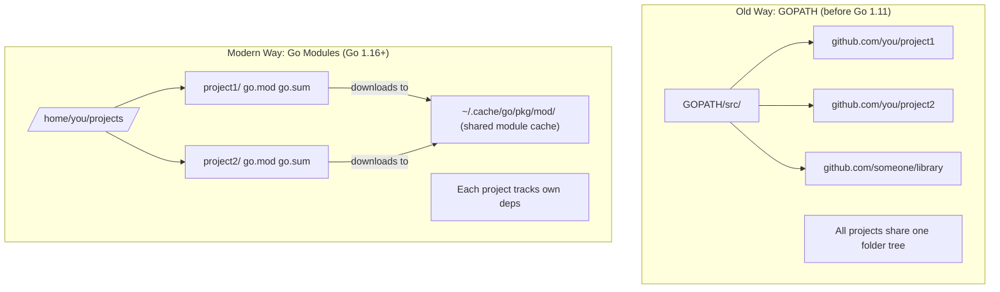
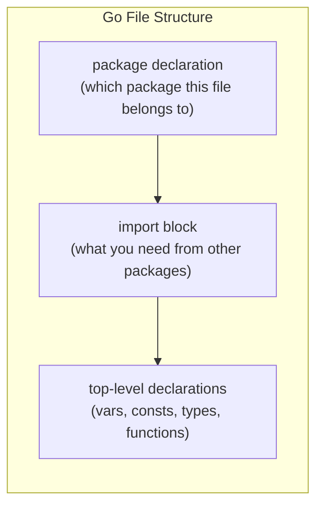
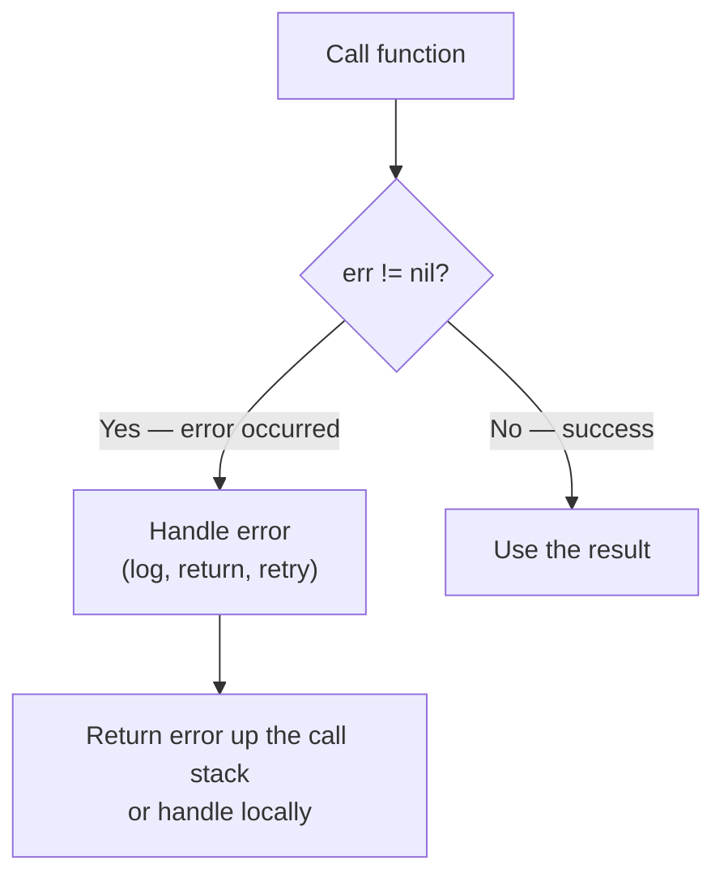

# Chapter 1: Introduction to Go + Fast Setup

> **Who this is for:** You already know at least one programming language (JavaScript, Python, Java, etc.) and want to learn Go for building backend systems. This chapter gets you from zero to a working Go environment and a solid mental model of the language.

---

## 🤔 Why Should You Care About Go?

Imagine you are running a restaurant. Python is a brilliant chef who can cook anything, but works slowly and needs an entire team of sous-chefs (libraries, interpreters, runtimes) just to open the kitchen. Java is a highly skilled chef who cooks fast, but needs 30 minutes just to put on the uniform before touching any food (JVM startup, huge runtimes). Node.js is a single chef doing everything in one burst — fast for some orders, but gets overwhelmed when ten customers shout at once.

**Go is like a chef who:**
- Arrives already dressed (compiled binary, no runtime needed)
- Works incredibly fast because they do everything themselves
- Can clone themselves on demand to handle 10,000 orders simultaneously (goroutines)
- Never loses track of an order because they write everything down explicitly (static typing, explicit errors)

Go was created at Google in 2009 by Rob Pike, Ken Thompson, and Robert Griesemer — the people who literally invented Unix and C. They were frustrated by slow compile times in C++ and the complexity of large-scale systems. Go is their answer: a language that is simple to read, fast to compile, and built for modern multi-core machines.

---

## 🏗️ The Four Pillars of Go for Backend

### 1. Compiled + Statically Typed

Think of static typing like a flight checklist. Before the plane takes off (before your code runs), every item is verified. If something is wrong, you know on the ground — not at 35,000 feet.

```
Source Code (.go files)
        ↓
   Go Compiler
        ↓
Native Machine Code (single binary)
        ↓
Run directly on any OS — no interpreter, no VM
```

In Python or JavaScript, you find type errors at runtime — when real users hit the bug. In Go, the compiler catches them before you even ship.

```go
// This fails at COMPILE TIME — not at runtime
var age int = "twenty-five" // error: cannot use "twenty-five" (type string) as type int
```

### 2. Garbage Collected (But Fast)

Memory management analogy: manual memory management (C/C++) is like cleaning your own table at a restaurant. Garbage collection (Go, Java, Python) is like having a busboy who clears plates automatically. Go's garbage collector is specifically tuned for low-latency servers — pauses are typically under 1 millisecond.

### 3. Built-in Concurrency

This is Go's superpower. Most languages bolt concurrency on as an afterthought. In Go, it is a first-class language feature. You will learn goroutines in depth in a later chapter, but understand this: Go can handle hundreds of thousands of concurrent operations with minimal memory, because goroutines are not OS threads — they are lightweight green threads managed by the Go runtime.

### 4. Fast Compile + Single Binary Deploy

Go compiles a large project in seconds. The output is a single self-contained binary. No `node_modules` folder. No Python virtualenv. No JRE installation. Copy the binary to any Linux server and run it. That is it.

```
# Deploy a Go backend to a server:
scp myapp user@server:/usr/local/bin/myapp
ssh user@server "myapp"

# That is the entire deployment. No runtime needed.
```

---

## ⚖️ Go vs Node.js vs Java vs Python for Backend

Before committing to any technology, understand the trade-offs. Here is an honest comparison:

| Feature | Go | Node.js | Java | Python |
|---|---|---|---|---|
| **Speed (raw throughput)** | Very Fast | Fast | Fast | Slow |
| **Startup Time** | ~10ms | ~100ms | ~500ms-2s | ~100ms |
| **Memory Usage** | Low | Medium | High | Medium |
| **Concurrency Model** | Goroutines (lightweight) | Event loop (single-thread) | Threads / Virtual Threads | Threads / Async (awkward) |
| **Typing** | Static | Dynamic (TypeScript optional) | Static | Dynamic (type hints optional) |
| **Learning Curve** | Low-Medium | Low | High | Very Low |
| **Ecosystem / Libraries** | Growing | Massive | Massive (mature) | Massive |
| **Deployment** | Single binary | Node.js runtime required | JRE required | Python runtime required |
| **Best For** | APIs, microservices, CLI tools, DevOps tooling | Real-time apps, rapid prototyping | Enterprise systems, complex OOP | Data science, ML, scripting |
| **Not Great For** | GUI apps, heavy computation (use C for that) | CPU-bound tasks | Quick scripts, simple CLIs | High-throughput APIs |
| **Error Handling** | Explicit (`error` return value) | Exceptions / Promises | Exceptions | Exceptions |
| **Package Manager** | Go modules (built-in) | npm / yarn | Maven / Gradle | pip |

### When to Choose Go

- You are building a high-traffic REST/gRPC API
- You need low memory footprint (microservices, containers)
- You want a single binary that deploys anywhere
- Your team values simplicity and readability over cleverness
- You are building CLI tools, DevOps tooling, or infrastructure (Kubernetes, Docker, Terraform — all written in Go)

### When NOT to Choose Go

- You need rapid prototyping with lots of existing libraries (Python wins)
- Your team is already deeply expert in Java/Spring and the project is complex OOP enterprise software
- You are building real-time collaborative apps where Node.js + WebSockets ecosystem is mature
- You need ML/AI integrations — Python has no equal there

---

## 🛠️ Installing Go

### Step 1: Download and Install

Go to [go.dev/dl](https://go.dev/dl) and download the installer for your OS.

**macOS / Linux (using official installer or homebrew):**
```bash
# Option 1: Official installer — download .pkg (macOS) or .tar.gz (Linux)
# Then follow the installer

# Option 2: Homebrew (macOS)
brew install go

# Option 3: Linux manual install
wget https://go.dev/dl/go1.22.linux-amd64.tar.gz
sudo tar -C /usr/local -xzf go1.22.linux-amd64.tar.gz
echo 'export PATH=$PATH:/usr/local/go/bin' >> ~/.bashrc
source ~/.bashrc
```

**Windows:**
Download and run the `.msi` installer from go.dev/dl. It adds Go to your PATH automatically.

### Step 2: Verify Installation

```bash
go version
# Output: go version go1.22.x linux/amd64
```

### Step 3: Configure Your Editor

The best editor for Go is VS Code with the **Go extension** (by Go team):

```bash
# Install VS Code Go extension
code --install-extension golang.go
```

The extension gives you: auto-complete, go to definition, inline error display, auto-formatting on save, and integrated test running. When you first open a `.go` file, VS Code will prompt you to install Go tools — click "Install All".

---

## 📁 GOPATH vs Go Modules — The Modern Way

This is a common confusion point. Let me clear it up with a timeline analogy.

Think of GOPATH like a shared apartment building (circa 2009-2017). Every Go project had to live inside one specific folder (`$GOPATH/src`). All dependencies lived in a shared `vendor` folder. It was rigid and hard to manage multiple projects with different dependency versions.

**Go Modules** (introduced in Go 1.11, standard since Go 1.16) is like every developer having their own house. Your project lives anywhere on your machine. Dependencies are tracked in a `go.mod` file specific to your project. You can have two projects using different versions of the same library — no conflict.



**The rule for 2024+:** Always use Go Modules. Forget GOPATH ever existed for project organization.

---

## 📦 go.mod and go.sum Explained

When you create a new Go project, the first thing you do is initialize a module:

```bash
mkdir my-backend
cd my-backend
go mod init github.com/yourname/my-backend
```

This creates a `go.mod` file:

```
module github.com/yourname/my-backend

go 1.22

require (
    github.com/gin-gonic/gin v1.9.1
    github.com/lib/pq v1.10.9
)
```

Think of `go.mod` like a `package.json` (Node) or `requirements.txt` (Python) — it declares your module name and dependencies.

The `go.sum` file is automatically generated and contains cryptographic hashes of every dependency. Think of it like a tamper-proof receipt — if anyone modifies a dependency package on the internet, Go will refuse to use it because the hash will not match. Never edit `go.sum` manually.

```bash
# Add a dependency
go get github.com/gin-gonic/gin@v1.9.1

# Remove unused dependencies
go mod tidy

# Download all dependencies (useful in CI/CD)
go mod download

# View the dependency graph
go mod graph
```

---

## 🗂️ Workspace Structure

Here is a recommended structure for a Go backend project:

```
my-backend/
├── go.mod              # Module definition
├── go.sum              # Dependency checksums (auto-generated)
├── main.go             # Entry point
├── cmd/                # CLI commands (if you have multiple binaries)
│   └── server/
│       └── main.go
├── internal/           # Private packages (cannot be imported by other modules)
│   ├── handler/        # HTTP handlers
│   ├── service/        # Business logic
│   └── repository/     # Database access
├── pkg/                # Public packages (can be imported by other modules)
│   └── utils/
├── config/             # Configuration files
└── tests/              # Integration / e2e tests
```

The `internal/` directory is enforced by the Go compiler — packages inside `internal/` cannot be imported by code outside the parent module. This is Go's way of enforcing encapsulation without complex access modifiers.

---

## 🔬 Anatomy of a Go Program

Let us write the simplest possible Go program and understand every single line:

```go
package main           // 1. Package declaration

import "fmt"           // 2. Import standard library

func main() {          // 3. Entry point
    fmt.Println("Hello, Backend!")  // 4. Print to stdout
}
```

**Line by line:**

1. **`package main`** — Every Go file belongs to a package. The `main` package is special: it tells the compiler "this is an executable program, not a library." Every executable Go program must have exactly one `main` package with one `main()` function.

2. **`import "fmt"`** — Import the `fmt` package from the standard library. Go's standard library is exceptionally rich. `fmt` handles formatted I/O (think `printf` in C or `console.log` in JS, but typed and safe).

3. **`func main()`** — The entry point. The Go runtime calls this function when your program starts. No arguments, no return value (unlike C's `int main()`).

4. **`fmt.Println(...)`** — `Println` is a function in the `fmt` package. The capital P matters — in Go, capitalized names are exported (public), lowercase names are unexported (private). This is Go's entire visibility system — no `public`, `private`, `protected` keywords.



### A More Complete Example

```go
package main

import (
    "fmt"
    "strings"
    "strconv"
)

// Constants — values known at compile time
const AppVersion = "1.0.0"

// A simple function — note: types come AFTER variable names
func greetUser(name string, age int) string {
    if age < 0 {
        return "Invalid age"
    }
    return fmt.Sprintf("Hello, %s! You are %s years old.", name, strconv.Itoa(age))
}

func main() {
    // Variable declaration — Go infers the type
    message := greetUser("Siddesh", 25)

    // fmt.Println adds a newline
    fmt.Println(message)

    // fmt.Printf for formatted output
    fmt.Printf("App version: %s\n", AppVersion)

    // strings package example
    upper := strings.ToUpper("go is amazing")
    fmt.Println(upper) // GO IS AMAZING
}
```

Run it:
```bash
go run main.go
# Hello, Siddesh! You are 25 years old.
# App version: 1.0.0
# GO IS AMAZING
```

---

## ⚙️ The Essential Go Commands

These are the commands you will use every single day:

### go run

```bash
go run main.go
# Compiles + runs immediately. For development only.
# Does NOT produce a binary file.
```

Think of `go run` like `node index.js` or `python app.py` — quick iteration during development.

### go build

```bash
go build -o myapp .
# Compiles all .go files in the current directory
# Produces a binary named 'myapp'
# This binary runs on any machine with the same OS/architecture — no Go needed

# Cross-compile for Linux from macOS/Windows:
GOOS=linux GOARCH=amd64 go build -o myapp-linux .
```

Cross-compilation is built in. One command and you have a Linux binary ready to deploy from your Mac or Windows machine.

### go fmt

```bash
go fmt ./...
# Automatically formats ALL Go files in the project
# Go has ONE official format — no debates about tabs vs spaces
# Most editors run this on save automatically
```

Go's formatter is opinionated and non-negotiable. This is a feature, not a bug. In large teams, nobody argues about formatting because the tool decides.

### go vet

```bash
go vet ./...
# Static analysis — catches common bugs the compiler misses
# Examples: wrong format verbs in Printf, unreachable code, suspicious constructs
```

Think of `go vet` as a second pass over your code looking for things that compile but are probably wrong. Always run this before committing.

### go test

```bash
go test ./...           # Run all tests
go test -v ./...        # Verbose output
go test -run TestLogin  # Run only tests matching "TestLogin"
go test -cover ./...    # Show code coverage
```

Go testing is built in — no separate testing framework needed. Any file ending in `_test.go` is a test file. Any function starting with `Test` is a test.

```go
// user_test.go
package main

import "testing"

func TestGreetUser(t *testing.T) {
    result := greetUser("Siddesh", 25)
    expected := "Hello, Siddesh! You are 25 years old."

    if result != expected {
        t.Errorf("got %q, want %q", result, expected)
    }
}
```

```bash
go test -v .
# --- PASS: TestGreetUser (0.00s)
# PASS
```

### Command Summary

| Command | What It Does | When to Use |
|---|---|---|
| `go run file.go` | Compile + run (no binary saved) | Development iteration |
| `go build -o app .` | Compile to binary | Building for deployment |
| `go fmt ./...` | Auto-format all files | Before committing (or on save) |
| `go vet ./...` | Static analysis / lint | Before committing |
| `go test ./...` | Run all tests | CI/CD, before merging |
| `go mod tidy` | Clean up unused dependencies | After adding/removing packages |
| `go get pkg@version` | Add a dependency | Adding new libraries |

---

## 🖊️ fmt Package Basics

The `fmt` package is your daily driver for output and string formatting. Here are the key functions with analogies:

```go
package main

import "fmt"

func main() {
    name := "Gopher"
    age := 5
    pi := 3.14159

    // Println — adds newline, space-separated
    fmt.Println("Hello", name, age)       // Hello Gopher 5

    // Printf — C-style format strings
    fmt.Printf("Name: %s, Age: %d, Pi: %.2f\n", name, age, pi)
    // Name: Gopher, Age: 5, Pi: 3.14

    // Sprintf — returns a formatted string (does NOT print)
    msg := fmt.Sprintf("User %s is %d years old", name, age)
    fmt.Println(msg)

    // Fprintf — writes to any io.Writer (files, network, etc.)
    // fmt.Fprintf(os.Stderr, "Error: %s\n", "something went wrong")

    // %v — default format (use this when unsure)
    type Point struct{ X, Y int }
    p := Point{1, 2}
    fmt.Printf("%v\n", p)   // {1 2}
    fmt.Printf("%+v\n", p)  // {X:1 Y:2}  — with field names
    fmt.Printf("%T\n", p)   // main.Point  — type name
}
```

**Common format verbs:**

| Verb | Meaning | Example |
|---|---|---|
| `%s` | String | `"hello"` |
| `%d` | Integer (decimal) | `42` |
| `%f` | Float | `3.14` |
| `%.2f` | Float with 2 decimal places | `3.14` |
| `%b` | Integer in binary | `101010` |
| `%v` | Default representation | works for any type |
| `%+v` | Default with field names (structs) | `{X:1 Y:2}` |
| `%T` | Type of the value | `int`, `string`, `main.User` |
| `%p` | Pointer address | `0xc000014088` |

---

## 🔗 Pointers in Go — Demystified

Pointers are one concept that trips up developers coming from JavaScript or Python. Here is the simplest possible mental model.

**Analogy:** Think of your computer's memory as a city. Every house in the city has an address. A variable is like a house — it holds a value. A pointer is like a piece of paper with an address written on it. Instead of carrying the house around, you carry a note that says where the house is.

```
Memory (the city):
Address 0x1000: value = 42   ← this is where 'x' lives
Address 0x1008: value = 0x1000  ← this is 'p', a pointer to x
```

In Go:

```go
package main

import "fmt"

func main() {
    x := 42              // x is a variable holding 42
    p := &x              // p is a pointer — & means "give me the ADDRESS of x"

    fmt.Println(x)       // 42          — the value
    fmt.Println(p)       // 0xc0000b4008 — the memory address
    fmt.Println(*p)      // 42          — * means "give me the VALUE at this address"

    *p = 100             // Change the value AT the address p points to
    fmt.Println(x)       // 100         — x changed because p pointed to x!
}
```

**Two operators — memorize these:**

| Operator | Name | Meaning | Example |
|---|---|---|---|
| `&` | Address-of | "Give me the address of this variable" | `p := &x` |
| `*` | Dereference | "Give me the value at this address" | `val := *p` |

### Why Do We Need Pointers?

In Go, when you pass a variable to a function, Go makes a copy. Changes inside the function do not affect the original. Pointers let you pass the address so the function can modify the original.

```go
package main

import "fmt"

// WITHOUT pointer — modifies a COPY, original unchanged
func doubleWrong(n int) {
    n = n * 2  // modifies the local copy
}

// WITH pointer — modifies the ORIGINAL
func doubleCorrect(n *int) {
    *n = *n * 2  // dereference, then modify
}

func main() {
    num := 10

    doubleWrong(num)
    fmt.Println(num)  // 10 — unchanged!

    doubleCorrect(&num)  // pass the address
    fmt.Println(num)  // 20 — changed!
}
```

Pointers in Go are safer than in C because:
- No pointer arithmetic (you cannot do `p + 1` to jump to the next memory address)
- No dangling pointers (garbage collector manages memory)
- The zero value of a pointer is `nil`, which is safe to check

---

## 🔄 Go vs JavaScript: Key Differences

If you are coming from JavaScript/TypeScript, here is what will feel different:

| Concept | JavaScript / TypeScript | Go |
|---|---|---|
| **Classes** | `class User { ... }` | No classes. Use `struct` + methods |
| **Inheritance** | `class Admin extends User` | No inheritance. Use composition and interfaces |
| **Error Handling** | `try { } catch (e) { }` | `result, err := someFunc()` — errors are return values |
| **Async** | `async/await`, Promises | `go func()` — goroutines (much lighter) |
| **Null** | `null`, `undefined` | `nil` (only for pointers, slices, maps, interfaces) |
| **Type System** | Optional (TypeScript adds types) | Always static, no opting out |
| **Generics** | Yes (TypeScript / JS) | Yes (since Go 1.18) |
| **Exceptions** | Yes — can throw from anywhere | No exceptions. Errors are explicit return values |
| **Package Manager** | npm, yarn, pnpm | Built-in (`go get`, `go mod`) |
| **Import Style** | `import { thing } from 'pkg'` | `import "pkg"` then `pkg.Thing` |
| **Variable Declaration** | `let x = 5` or `const x = 5` | `x := 5` (inferred) or `var x int = 5` |
| **Loops** | `for`, `while`, `forEach`, `map` | Only `for` — it does everything |
| **Truthiness** | `0`, `""`, `null` are falsy | Only `false` is false — no implicit conversion |
| **`this`** | Context-dependent, confusing | No `this`. Methods have an explicit receiver |

### Error Handling Deep Dive

This is the biggest mental shift. In Go, there are no exceptions. Functions that can fail return an `error` as the last return value. You check it immediately.

```go
// JavaScript way:
try {
    const data = JSON.parse(input)
} catch (e) {
    console.error(e)
}

// Go way:
import (
    "encoding/json"
    "fmt"
)

type User struct {
    Name string `json:"name"`
    Age  int    `json:"age"`
}

func parseUser(input []byte) (User, error) {
    var u User
    err := json.Unmarshal(input, &u)
    if err != nil {
        return User{}, fmt.Errorf("parseUser: %w", err)
    }
    return u, nil
}

func main() {
    data := []byte(`{"name":"Siddesh","age":25}`)

    user, err := parseUser(data)
    if err != nil {
        fmt.Println("Error:", err)
        return
    }

    fmt.Println("Welcome,", user.Name)
}
```

This feels verbose at first. But it means:
- Every error is handled (or explicitly ignored)
- Error paths are visible in the code
- No surprise exceptions crashing your server
- Easier to trace where errors come from



---

## 🧩 Putting It All Together — Your First Real Go File

Here is a complete Go program that ties together everything from this chapter:

```go
package main

import (
    "fmt"
    "strings"
)

// User struct — Go's version of a class (without inheritance)
type User struct {
    Name  string
    Email string
    Age   int
}

// Method on User — note the receiver (u User) before the function name
func (u User) Greet() string {
    return fmt.Sprintf("Hi, I'm %s and I'm %d years old.", u.Name, u.Age)
}

// Function that returns a value AND an error
func createUser(name, email string, age int) (User, error) {
    if strings.TrimSpace(name) == "" {
        return User{}, fmt.Errorf("name cannot be empty")
    }
    if age < 0 || age > 150 {
        return User{}, fmt.Errorf("invalid age: %d", age)
    }
    return User{Name: name, Email: email, Age: age}, nil
}

// Pointer receiver — modifies the original User
func (u *User) UpdateEmail(newEmail string) {
    u.Email = newEmail
}

func main() {
    // Create a user — always check the error
    user, err := createUser("Siddesh", "siddesh@example.com", 25)
    if err != nil {
        fmt.Println("Failed to create user:", err)
        return
    }

    // Call a method
    fmt.Println(user.Greet())

    // Modify via pointer receiver
    user.UpdateEmail("new@example.com")
    fmt.Printf("Updated email: %s\n", user.Email)

    // Pointer demo
    ptr := &user
    fmt.Printf("User lives at memory address: %p\n", ptr)
    fmt.Printf("Name via pointer: %s\n", ptr.Name) // Go auto-dereferences structs
}
```

Build and run:
```bash
go run main.go
# Hi, I'm Siddesh and I'm 25 years old.
# Updated email: new@example.com
# User lives at memory address: 0xc0000b2000
# Name via pointer: Siddesh
```

---

## 🧠 Key Takeaways

1. **Go is compiled and statically typed** — your bugs appear at compile time, not in production. The output is a single binary that runs anywhere with no runtime dependency.

2. **Go modules are the modern standard** — `go mod init`, `go.mod`, `go.sum`. Forget GOPATH for project organization. Always initialize a module first.

3. **The four essential commands for daily work:** `go run` (develop), `go build` (ship), `go fmt` (format), `go vet` (lint), `go test` (verify).

4. **Package visibility is controlled by capitalization** — `Exported` (capital) is public, `unexported` (lowercase) is private. No `public`/`private` keywords.

5. **`&` gives you the address, `*` gives you the value** — pointers in Go are safe (no arithmetic, no dangling pointers, nil is checkable).

6. **Errors are return values, not exceptions** — always check `if err != nil`. This feels verbose but makes your code dramatically more reliable and readable.

7. **No classes, no inheritance** — Go uses structs, methods, and interfaces for everything. Composition over inheritance.

8. **`fmt` package is your I/O workhorse** — `Println`, `Printf`, `Sprintf`, `Fprintf`. Learn the format verbs (`%s`, `%d`, `%v`, `%T`).

---

## 📚 What is Next

In the next chapter, we cover:
- **Go Types in Depth** — arrays, slices, maps, structs
- **Control Flow** — if/else, for loops (the only loop in Go), switch
- **Multiple Return Values** — Go's elegant way to return results and errors
- **Defer, Panic, Recover** — Go's mechanism for cleanup and the rare cases where things go truly wrong

---

*Chapter 1 of the Go Backend Learning Series*
*Last updated: June 2026*
