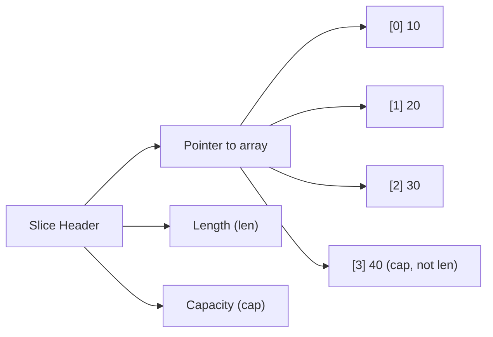
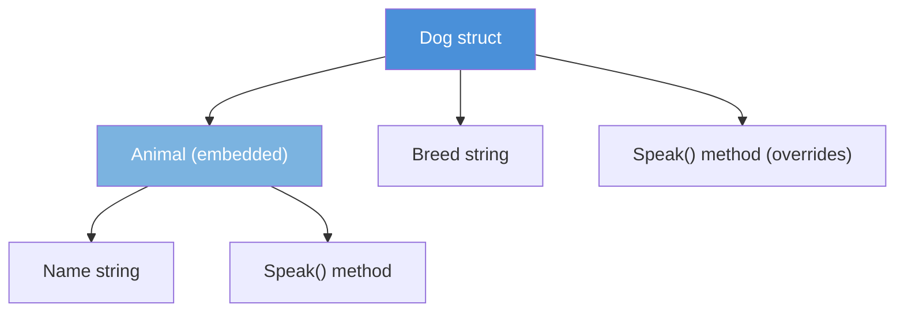
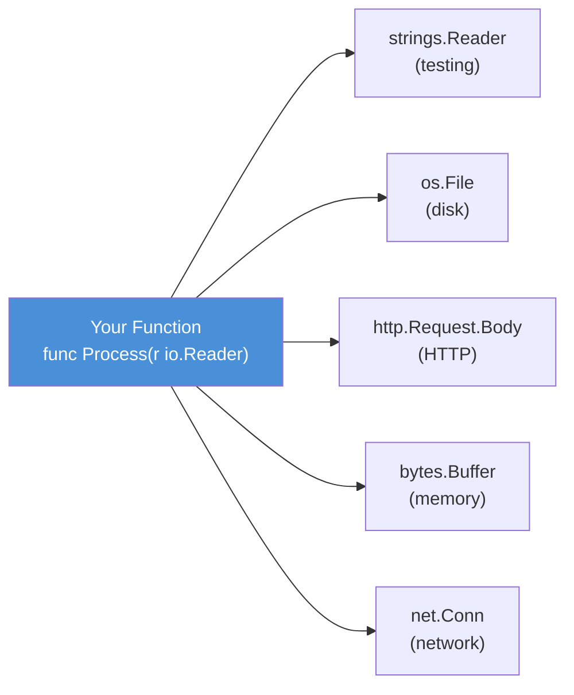
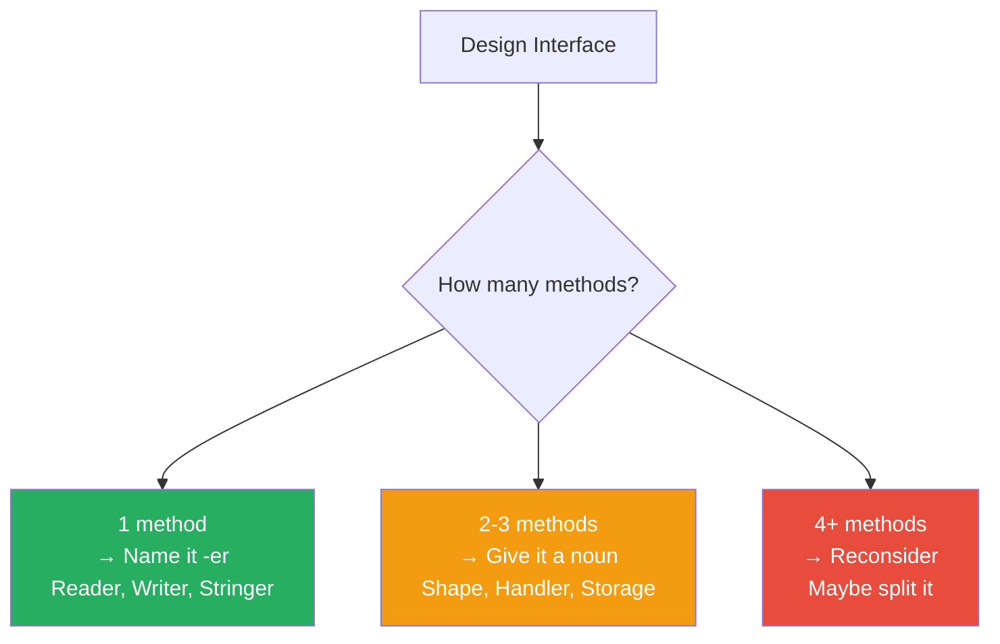

# Go Types, Structs, and Interfaces

> **Chapter 2** — The building blocks of every Go program. Master these and the rest of Go falls into place.

---

## 🧱 Why Types Matter So Much in Go

Think of a type as a **contract**. When you say a value is an `int`, you are telling Go — and every developer who reads your code — exactly what that value can hold, how much memory it takes, and what operations make sense on it.

Go is **statically typed**. Every variable has a type decided at compile time. This catches entire classes of bugs before the program ever runs.

---

## 🔢 Basic Types — The Atoms of Go

Every complex structure you build is made from these primitives. Think of them like LEGO base pieces.

### Boolean

```go
var isActive bool = true
var isLoggedIn bool   // zero value: false
```

Only two values: `true` or `false`. Used for flags, conditions, and status.

### Integers

Go gives you sized integers. Pick the right size to signal intent and save memory.

| Type    | Size    | Range                          | When to Use                  |
|---------|---------|--------------------------------|------------------------------|
| `int`   | 32/64-bit (platform) | ±2 billion / ±9 quintillion | General purpose — use this most |
| `int8`  | 8-bit   | -128 to 127                    | Tight memory constraints     |
| `int16` | 16-bit  | -32768 to 32767                | Audio samples, legacy formats |
| `int32` | 32-bit  | ±2.1 billion                   | Explicit 32-bit operations   |
| `int64` | 64-bit  | ±9.2 quintillion               | Timestamps, large counters   |
| `uint`  | 32/64-bit | 0 to max                    | When negative makes no sense |

```go
var age int = 28
var port uint16 = 8080
var unixTimestamp int64 = 1719360000
```

**Rule of thumb:** Use `int` unless you have a specific reason not to. The compiler and runtime are optimized for it.

### Floating Point

```go
var price float64 = 19.99
var ratio float32 = 0.75
```

Always prefer `float64`. It is the default for numeric literals and more precise than `float32`. Use `float32` only when interfacing with graphics APIs or other systems that require it.

### String

A string in Go is an **immutable sequence of bytes**. It is not a C-style null-terminated array. It is not mutable.

```go
var name string = "Siddesh"
greeting := "Hello, " + name  // concatenation creates a new string
length := len(name)            // number of bytes, not rune count
```

### Byte and Rune — The Two "Characters"

This is where Go gets precise. Most languages blur the line. Go does not.

**Analogy:** Imagine a book printed in two alphabets — English and Japanese. English letters are small (1 byte). Japanese characters are larger (3 bytes). If you count pages by "letters", you get wrong answers for Japanese text.

- `byte` is an alias for `uint8`. It represents **one byte** of raw data.
- `rune` is an alias for `int32`. It represents **one Unicode code point** (one logical character).

```go
var b byte = 'A'    // ASCII fits in one byte
var r rune = '界'   // Japanese character — needs 3 bytes in UTF-8

s := "Hello, 世界"
fmt.Println(len(s))           // 13 — byte count
fmt.Println(len([]rune(s)))   // 9  — character count

// Iterate by rune (correct for Unicode)
for i, ch := range s {
    fmt.Printf("index %d: %c\n", i, ch)
}
```

**When working with user-facing text, always think in runes. When working with raw bytes (network, files), think in bytes.**

---

## 🫙 Zero Values — Go's Safety Net

In many languages, uninitialized variables hold garbage. In Go, every type has a **zero value** — a safe, predictable default.

```go
var i int       // 0
var f float64   // 0.0
var b bool      // false
var s string    // ""
var p *int      // nil
```

This means you can declare a variable and use it immediately without worrying about garbage data. Go trades a tiny bit of performance (zeroing memory) for a large gain in safety.

---

## ⚡ Type Inference with `:=`

Go does not want you to repeat yourself. The `:=` operator infers the type from the right-hand side.

```go
// These are identical:
var name string = "Siddesh"
name := "Siddesh"

// Works with any expression:
count := 0          // int
ratio := 3.14       // float64
active := true      // bool
message := "hi"     // string
```

**Rules:**
- `:=` only works **inside functions**. Package-level variables need `var`.
- `:=` must declare **at least one new variable** on the left side.
- The type is fixed after declaration. You cannot reassign a different type.

---

## 📦 Arrays vs Slices — The Real Workhorse

### Arrays — Fixed Size, Rarely Used Directly

An array in Go has a **fixed length that is part of its type**. `[3]int` and `[4]int` are completely different types.

```go
var scores [3]int = [3]int{10, 20, 30}
// or shorthand:
scores := [3]int{10, 20, 30}
```

Arrays are **value types** — when you pass them to a function, Go copies the entire array. For large arrays this is expensive.

**When to use arrays:** Only when you know the size at compile time and want stack allocation. Examples: SHA-256 hash `[32]byte`, IP address `[4]byte`.

### Slices — The Go Workhorse

**Analogy:** An array is like buying a fixed-size box. A slice is like renting shelf space — you can expand it, shrink the view, and share it.

A slice is a **view into an underlying array**. It has three components:



```go
// Create with make(type, length, capacity)
scores := make([]int, 3, 5)   // len=3, cap=5, all zeros

// Create with literal
names := []string{"Alice", "Bob", "Carol"}

// Append (grows automatically if needed)
names = append(names, "Dave")

fmt.Println(len(names))  // 4
fmt.Println(cap(names))  // 6 (Go doubled the capacity)
```

**How `append` grows the slice:**

When you append beyond capacity, Go allocates a new, larger array (usually 2x), copies the old data, and returns a new slice header pointing to the new array.

```go
s := make([]int, 0, 2)
fmt.Printf("len=%d cap=%d\n", len(s), cap(s))  // len=0 cap=2

s = append(s, 1, 2)
fmt.Printf("len=%d cap=%d\n", len(s), cap(s))  // len=2 cap=2

s = append(s, 3)
fmt.Printf("len=%d cap=%d\n", len(s), cap(s))  // len=3 cap=4 — grew!
```

### Slice of Slice — Sharing the Underlying Array

```go
original := []int{1, 2, 3, 4, 5}

// Slice syntax: [low:high] — includes low, excludes high
first := original[0:3]  // [1, 2, 3] — shares memory with original
last  := original[2:5]  // [3, 4, 5] — shares memory with original

// Modifying first[0] ALSO modifies original[0]!
first[0] = 99
fmt.Println(original)  // [99, 2, 3, 4, 5]

// To get an independent copy:
safeCopy := make([]int, len(original))
copy(safeCopy, original)
```

**Key rule:** Slices share memory. If you want a truly independent slice, use `copy()`.

---

## 🗺️ Maps — Key-Value Lookup Tables

**Analogy:** A map is like a phone book. You look up a name (key) and get a phone number (value) back in constant time, regardless of how large the book is.

```go
// Always use make for maps — never use a nil map for writing
userAges := make(map[string]int)

// Insert
userAges["Alice"] = 30
userAges["Bob"] = 25

// Lookup — always use the two-value form
age, ok := userAges["Alice"]
if ok {
    fmt.Printf("Alice is %d years old\n", age)
}

// One-value form is dangerous — returns zero value if key missing
age = userAges["Carol"]  // returns 0, no error, no warning!
```

**The `ok` pattern is critical.** Zero value and missing key look identical with one-value lookup. Always use `value, ok :=` when the zero value is meaningful.

```go
// Delete a key
delete(userAges, "Bob")

// Iterate — order is random (by design)
for name, age := range userAges {
    fmt.Printf("%s: %d\n", name, age)
}

// Map literal
config := map[string]string{
    "host": "localhost",
    "port": "5432",
    "db":   "myapp",
}
```

**When NOT to use maps:**
- When you need ordered data (use a slice of structs instead)
- When keys are always sequential integers (use a slice)
- In tight loops where allocation matters (maps allocate on the heap)

---

## 🏗️ Structs — Go's Answer to Classes

Go has **no classes**. Instead, it has structs — plain data containers. Behaviour is added separately through methods. This keeps data and logic decoupled and testable.

**Analogy:** A class in Java is like a factory that bundles a blueprint (data), workers (methods), and the rules for hiring new workers (inheritance). A Go struct is just the blueprint. You hire workers (methods) separately, and instead of inheriting from parents, you embed other blueprints (composition).

```go
type User struct {
    ID        int
    Name      string
    Email     string
    IsAdmin   bool
    CreatedAt time.Time
}

// Create with named fields (preferred — order-independent, self-documenting)
u := User{
    ID:      1,
    Name:    "Siddesh",
    Email:   "siddesh@example.com",
    IsAdmin: false,
}

// Access fields
fmt.Println(u.Name)    // Siddesh
u.IsAdmin = true       // mutate directly

// Pointer to struct
up := &User{Name: "Alice"}
fmt.Println(up.Name)   // Go auto-dereferences: up.Name == (*up).Name
```

### Anonymous Structs — Quick One-Off Structures

```go
// Useful for test fixtures or JSON decoding
point := struct {
    X, Y int
}{X: 10, Y: 20}
```

---

## ⚙️ Methods — Adding Behaviour to Structs

A method is a function with a **receiver** — the struct it belongs to.

### Value Receiver vs Pointer Receiver

This is one of the most important decisions in Go.

**Analogy:**
- **Value receiver** — You hand someone a photocopy of a document. They can read it. Any changes they make stay on the copy.
- **Pointer receiver** — You hand someone the original document. Their changes affect the real document.

```go
type Rectangle struct {
    Width  float64
    Height float64
}

// Value receiver — reads, does not mutate
func (r Rectangle) Area() float64 {
    return r.Width * r.Height
}

// Value receiver — returns a new Rectangle, does not change the original
func (r Rectangle) Scale(factor float64) Rectangle {
    return Rectangle{r.Width * factor, r.Height * factor}
}

// Pointer receiver — mutates the original
func (r *Rectangle) Resize(w, h float64) {
    r.Width = w
    r.Height = h
}

rect := Rectangle{Width: 10, Height: 5}
fmt.Println(rect.Area())     // 50

rect.Resize(20, 10)          // Go auto-takes address: (&rect).Resize(20, 10)
fmt.Println(rect.Area())     // 200
```

### When to Use Which Receiver

| Situation | Use |
|-----------|-----|
| Method needs to mutate the struct | Pointer receiver `*T` |
| Struct is large (> ~64 bytes) | Pointer receiver — avoid copying |
| Method is part of an interface with pointer receivers | Pointer receiver |
| Method only reads small struct | Value receiver `T` |
| Struct is meant to be immutable | Value receiver |
| Method returns a new value (functional style) | Value receiver |

**Be consistent:** If any method on a type uses a pointer receiver, all methods should. Mixed receivers confuse interface implementation.

---

## 🧬 Struct Embedding — Composition Over Inheritance

Go does not have inheritance. It has **embedding** — a much cleaner mechanism.

**Analogy:** Instead of a Car inheriting from Vehicle (which forces a rigid hierarchy), a Car *contains* an Engine and a Chassis. It can use the Engine's methods directly without any special syntax.

```go
type Animal struct {
    Name string
}

func (a Animal) Speak() string {
    return a.Name + " makes a sound"
}

type Dog struct {
    Animal        // embedded — no field name
    Breed string
}

func (d Dog) Speak() string {
    return d.Name + " says Woof!"  // d.Name promoted from Animal
}

fido := Dog{
    Animal: Animal{Name: "Fido"},
    Breed:  "Labrador",
}

fmt.Println(fido.Speak())         // Fido says Woof! (Dog's method)
fmt.Println(fido.Animal.Speak())  // Fido makes a sound (Animal's method, explicit)
fmt.Println(fido.Name)            // Fido — promoted field
```

Fields and methods of the embedded type are **promoted** to the outer type. You access them as if they were defined on the outer type. This achieves code reuse without coupling.



---

## 🔌 Interfaces — The Most Powerful Feature in Go

An interface defines a **set of method signatures**. Any type that has those methods **automatically** implements the interface. No `implements` keyword. No explicit declaration.

**Analogy:** In many languages, a plug and socket must be designed together — the plug explicitly declares it fits this socket. In Go, if the plug's shape matches the socket's shape, it fits. No paperwork required.

```go
type Speaker interface {
    Speak() string
}

// Dog implements Speaker — it has Speak() string
// Animal implements Speaker — it has Speak() string
// No declaration needed. It just works.

func MakeNoise(s Speaker) {
    fmt.Println(s.Speak())
}

MakeNoise(fido)                     // works — Dog has Speak()
MakeNoise(Animal{Name: "Cat"})      // works — Animal has Speak()
```

This implicit implementation is what makes Go's interfaces so powerful for decoupling. You can define an interface in your package that any existing type from any other package satisfies — without touching that package.

### Building a Full Shape System

```go
package main

import (
    "fmt"
    "math"
)

// --- Interfaces ---

type Shape interface {
    Area() float64
    Perimeter() float64
}

type Describer interface {
    Describe() string
}

// A type can implement multiple interfaces
type FullShape interface {
    Shape
    Describer
}

// --- Concrete Types ---

type Circle struct {
    Radius float64
}

func (c Circle) Area() float64 {
    return math.Pi * c.Radius * c.Radius
}

func (c Circle) Perimeter() float64 {
    return 2 * math.Pi * c.Radius
}

func (c Circle) Describe() string {
    return fmt.Sprintf("Circle with radius %.2f", c.Radius)
}

type Rectangle struct {
    Width, Height float64
}

func (r Rectangle) Area() float64 {
    return r.Width * r.Height
}

func (r Rectangle) Perimeter() float64 {
    return 2 * (r.Width + r.Height)
}

func (r Rectangle) Describe() string {
    return fmt.Sprintf("Rectangle %.2f x %.2f", r.Width, r.Height)
}

type Triangle struct {
    A, B, C float64 // side lengths
}

func (t Triangle) Area() float64 {
    // Heron's formula
    s := (t.A + t.B + t.C) / 2
    return math.Sqrt(s * (s - t.A) * (s - t.B) * (s - t.C))
}

func (t Triangle) Perimeter() float64 {
    return t.A + t.B + t.C
}

func (t Triangle) Describe() string {
    return fmt.Sprintf("Triangle with sides %.2f, %.2f, %.2f", t.A, t.B, t.C)
}

// --- Functions that work with ANY Shape ---

func PrintShapeInfo(s Shape) {
    fmt.Printf("Area: %.4f, Perimeter: %.4f\n", s.Area(), s.Perimeter())
}

func TotalArea(shapes []Shape) float64 {
    total := 0.0
    for _, s := range shapes {
        total += s.Area()
    }
    return total
}

func main() {
    shapes := []Shape{
        Circle{Radius: 5},
        Rectangle{Width: 4, Height: 6},
        Triangle{A: 3, B: 4, C: 5},
    }

    for _, s := range shapes {
        // Type assertion to check if it also implements Describer
        if d, ok := s.(Describer); ok {
            fmt.Println(d.Describe())
        }
        PrintShapeInfo(s)
        fmt.Println("---")
    }

    fmt.Printf("Total area: %.4f\n", TotalArea(shapes))
}
```

---

## 🌐 The Empty Interface — Use Sparingly

`interface{}` (or its alias `any` in Go 1.18+) is an interface with **zero methods**. Every type satisfies it — just like every plug fits an "any socket".

```go
func PrintAnything(v any) {
    fmt.Println(v)
}

PrintAnything(42)
PrintAnything("hello")
PrintAnything([]int{1, 2, 3})
```

**This looks convenient. It is also a trap.**

When you use `any`, you throw away the type system. The compiler cannot help you. You must handle every type at runtime, or panic.

**When `any` is acceptable:**
- Truly heterogeneous data (e.g., a JSON unmarshaler, a logger accepting any value)
- Bridging with `encoding/json` or `fmt`
- Storing values of different types in a cache (with careful type assertions)

**When NOT to use `any`:**
- When you know the types ahead of time (use a proper interface or generics)
- In function signatures for domain logic (it makes the API unreadable)
- As a lazy substitute for designing proper types

---

## 🔍 Type Assertion — Recovering the Concrete Type

When you have an interface value, you can ask: "is this actually a `Circle`?"

```go
var s Shape = Circle{Radius: 5}

// Safe assertion — never panics
c, ok := s.(Circle)
if ok {
    fmt.Printf("It's a circle with radius %.2f\n", c.Radius)
}

// Unsafe assertion — panics if wrong type
c2 := s.(Circle)   // fine here, but panics if s is a Rectangle
```

**Always use the two-value form** (`value, ok`) unless you are 100% certain of the type and a panic is acceptable.

---

## 🔀 Type Switch — Handling Multiple Types Cleanly

When you need to handle several possible types, use a type switch instead of chained assertions.

```go
func Describe(i any) string {
    switch v := i.(type) {
    case int:
        return fmt.Sprintf("Integer: %d", v)
    case string:
        return fmt.Sprintf("String: %q (len %d)", v, len(v))
    case bool:
        return fmt.Sprintf("Boolean: %t", v)
    case []int:
        return fmt.Sprintf("Int slice with %d elements", len(v))
    case Shape:
        return fmt.Sprintf("Shape with area %.2f", v.Area())
    default:
        return fmt.Sprintf("Unknown type: %T", v)
    }
}
```

The `v` inside each case is already the concrete type — no further assertions needed.

---

## 🖨️ The Stringer Interface — Pretty Printing

`fmt.Stringer` is defined in the `fmt` package:

```go
type Stringer interface {
    String() string
}
```

If your type implements `String() string`, `fmt.Println` and friends will call it automatically.

```go
func (c Circle) String() string {
    return fmt.Sprintf("Circle(r=%.2f)", c.Radius)
}

c := Circle{Radius: 7}
fmt.Println(c)          // Circle(r=7.00) — calls String() automatically
fmt.Printf("%v\n", c)  // Circle(r=7.00)
fmt.Printf("%s\n", c)  // Circle(r=7.00)
```

This is the idiomatic way to control how your types print. Implement it for any type users will log or display.

---

## 📖 io.Reader and io.Writer — The Two Most Important Interfaces

These two interfaces are the backbone of all I/O in Go's standard library.

```go
// In package io:

type Reader interface {
    Read(p []byte) (n int, err error)
}

type Writer interface {
    Write(p []byte) (n int, err error)
}
```

**Analogy:**
- `io.Reader` is a **tap**. You give it a bucket (`[]byte`), it fills as much as it can, and tells you how much went in. Keep calling until it returns `io.EOF`.
- `io.Writer` is a **drain**. You pour bytes in (`[]byte`), it writes them somewhere, and tells you how many it accepted.

The power: **dozens of types implement these interfaces**, and every function that accepts them works with all of them interchangeably.

```go
import (
    "bytes"
    "fmt"
    "io"
    "os"
    "strings"
)

// This function works with ANY writer:
// os.File, bytes.Buffer, http.ResponseWriter, net.Conn, ...
func WriteGreeting(w io.Writer, name string) {
    fmt.Fprintf(w, "Hello, %s!\n", name)
}

// Write to stdout
WriteGreeting(os.Stdout, "Siddesh")

// Write to an in-memory buffer
var buf bytes.Buffer
WriteGreeting(&buf, "Alice")
fmt.Println(buf.String())  // Hello, Alice!

// This function works with ANY reader:
func ReadAll(r io.Reader) ([]byte, error) {
    var result []byte
    buf := make([]byte, 512)
    for {
        n, err := r.Read(buf)
        result = append(result, buf[:n]...)
        if err == io.EOF {
            return result, nil
        }
        if err != nil {
            return nil, err
        }
    }
}

// Read from a string
sr := strings.NewReader("Hello from string")
data, _ := ReadAll(sr)
fmt.Println(string(data))

// Read from a file — same function, different reader
f, _ := os.Open("somefile.txt")
defer f.Close()
data, _ = ReadAll(f)
```

**Why this matters for backend development:**



By accepting `io.Reader` instead of `*os.File`, your function becomes universally usable. This is the **interface segregation principle** in practice — accept the smallest interface you need.

### Implementing io.Reader — A Custom Type

```go
// A reader that uppercases everything it reads
type UpperReader struct {
    source io.Reader
}

func (u UpperReader) Read(p []byte) (int, error) {
    n, err := u.source.Read(p)
    for i := 0; i < n; i++ {
        if p[i] >= 'a' && p[i] <= 'z' {
            p[i] -= 32  // ASCII trick to uppercase
        }
    }
    return n, err
}

// Use it
sr := strings.NewReader("hello, world")
ur := UpperReader{source: sr}

data, _ := io.ReadAll(ur)
fmt.Println(string(data))  // HELLO, WORLD
```

Your `UpperReader` now works with any existing io-based function in the entire standard library. This composability is Go's superpower.

---

## 📐 Interface Design Rules



**The smaller the interface, the more powerful it is.** A function that accepts `io.Reader` (1 method) can be called with anything that reads. A function that accepts a 10-method interface can only be called with types that have all 10 methods.

| Interface Size | Reusability | Coupling |
|----------------|-------------|----------|
| 1 method       | Very high   | Very low |
| 2-3 methods    | High        | Low      |
| 5+ methods     | Low         | High     |
| 10+ methods    | Very low    | Very high|

---

## ⚠️ Common Pitfalls

### Nil Interface vs Nil Pointer — The Famous Go Gotcha

```go
type MyError struct{ msg string }
func (e *MyError) Error() string { return e.msg }

func getError(fail bool) error {
    var err *MyError  // typed nil pointer
    if fail {
        err = &MyError{"something failed"}
    }
    return err  // BUG: returns non-nil interface containing nil pointer!
}

e := getError(false)
if e != nil {
    fmt.Println("There was an error!")  // This prints — surprise!
}
```

An interface value is nil only when **both** the type and value are nil. A nil `*MyError` wrapped in an `error` interface is NOT nil.

**Fix:** Return `nil` directly, not a typed nil.

```go
func getError(fail bool) error {
    if fail {
        return &MyError{"something failed"}
    }
    return nil  // correct — truly nil interface
}
```

---

## 🗂️ Quick Reference — Type Decision Guide

```
Need to store a simple value?
  → bool, int, float64, string

Need an ordered collection?
  → []T (slice) — almost always
  → [N]T (array) — only when size is fixed and known at compile time

Need key-value lookup?
  → map[K]V

Need to group related data?
  → struct

Need to add behaviour to a struct?
  → methods with value or pointer receiver

Need to share code between structs?
  → embedding (not inheritance!)

Need to write a function that works with many types?
  → define an interface

Need to accept any type (with caution)?
  → any / interface{}
```

---

## 🎯 Key Takeaways

1. **Zero values are safe.** Every Go variable is initialized. No garbage data.

2. **Use `:=` for local variables.** It infers types and reduces noise. Save `var` for package-level or when zero value matters.

3. **Slices, not arrays.** Slices are the real workhorse. Always use `make` and `append`. Remember that slices share underlying memory — use `copy()` when independence matters.

4. **Always use the `ok` pattern with maps.** `v, ok := m[key]` protects you from misreading zero values as valid data.

5. **Structs are Go's classes — but simpler.** Data in structs, behaviour in methods. Composition via embedding instead of inheritance.

6. **Pointer receivers mutate. Value receivers read.** When in doubt, use pointer receivers for structs — they are cheaper for large structs and allow mutation.

7. **Interfaces are implicit.** No `implements` keyword. If your type has the methods, it satisfies the interface. This makes Go code deeply composable.

8. **Small interfaces win.** The single-method interfaces (`io.Reader`, `io.Writer`, `fmt.Stringer`) are the most reusable code in Go. Design your own interfaces small.

9. **`any` is a last resort.** When you reach for `any`, ask yourself if generics or a proper interface would serve better. Type safety is a feature, not a burden.

10. **`io.Reader` and `io.Writer` are everywhere.** Any function you write that accepts these two interfaces immediately works with files, HTTP bodies, network connections, buffers, and any future I/O source you haven't even thought of yet.

---

> **Next Chapter:** Functions, Error Handling, and Go's approach to errors as values — the pattern that makes Go services robust.
