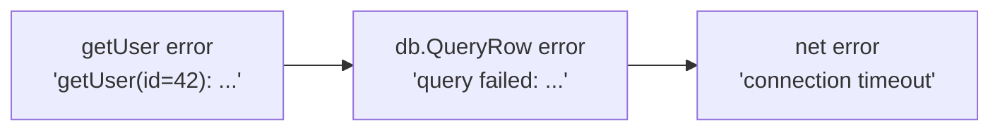
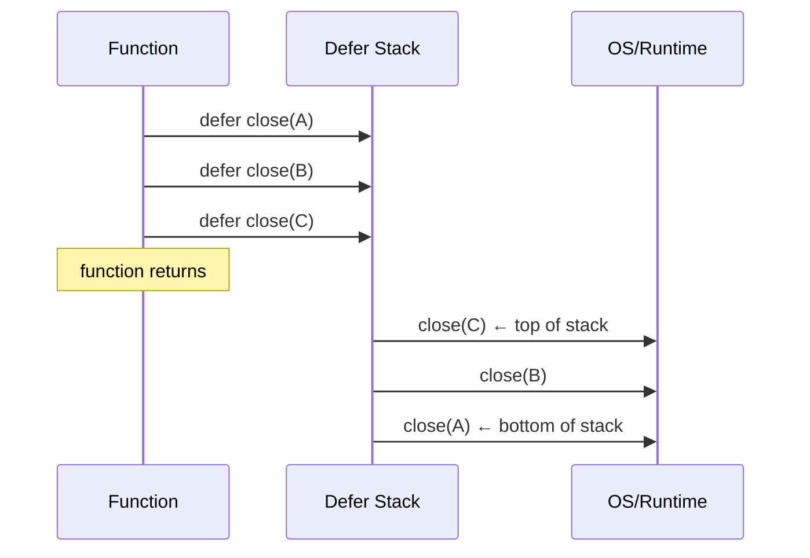
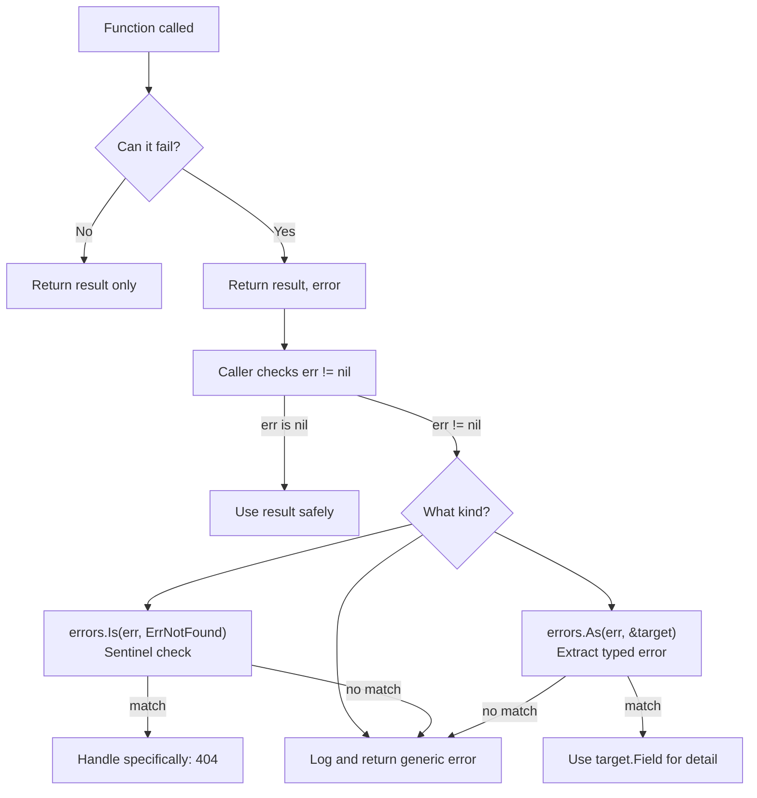

# Error Handling in Go

> "Errors are values." — Rob Pike, Go core team

---

## 🧠 The Philosophy: Errors Are Not Exceptions

Think of ordering food at a restaurant. In most languages, if something goes wrong — the dish is unavailable, the kitchen is on fire — the waiter throws the plate at you (an exception). You have to catch it or your whole evening crashes.

Go is different. The waiter walks up calmly and says: "We're out of pasta. Here's an error note. What would you like to do?" The error is a value — a normal return value — not some violent event that disrupts the flow of the program.

This is Go's core belief about errors:

- Errors are **ordinary values** passed through the program like any other value.
- The caller always decides what to do with an error.
- There is **no hidden control flow**. No mysterious stack unwinding. No surprising catches.
- If you ignore an error, you made an active choice to do so. Go makes that awkward on purpose.

This design forces you to think about what can go wrong at every step. It is verbose, but it is honest.

---

## 🔌 The `error` Interface

Before anything else, understand what an `error` is in Go. It is simply an interface:

```go
type error interface {
    Error() string
}
```

That is the whole definition. Any type that has an `Error() string` method satisfies the `error` interface and can be used as an error. Nothing more, nothing less.

Think of it like a name tag. Anyone wearing a tag that says "I can describe what went wrong" qualifies as an error.

---

## 🔄 Returning Errors: The Idiomatic Pattern

In Go, functions that can fail return two values: the result and an error.

```go
// The idiomatic Go function signature for something that can fail
func fetchUser(id int) (User, error) {
    if id <= 0 {
        return User{}, errors.New("id must be positive")
    }
    // ... actual fetching logic
    return user, nil
}
```

Rules to live by:
1. **Error is always the last return value.**
2. **On success, return `nil` for the error.**
3. **On failure, return the zero value for the result** (`""`, `0`, `nil`, empty struct).

```mermaid
flowchart TD
    A[Call fetchUser] --> B{id valid?}
    B -- No --> C[return User{}, error]
    B -- Yes --> D{DB query OK?}
    D -- No --> E[return User{}, db error]
    D -- Yes --> F[return user, nil]

    C --> G[Caller checks err != nil]
    E --> G
    F --> H[Caller uses user safely]
```

---

## 🚦 Checking Errors: Never Ignore

Imagine your smoke detector beeps and you just... turn it off without looking. That is what ignoring errors looks like.

```go
// BAD — ignoring the error is dangerous
user, _ := fetchUser(42)

// GOOD — always check
user, err := fetchUser(42)
if err != nil {
    // handle it: log, return, retry, whatever
    log.Printf("failed to fetch user: %v", err)
    return
}
// Only use 'user' here, after you know there was no error
fmt.Println(user.Name)
```

The `_` blank identifier discards the error. Go allows it, but the community considers it bad practice unless you have a very specific reason.

The `if err != nil` pattern appears so often in Go code that it becomes second nature. It is not boilerplate — it is explicit, readable error handling at every boundary.

---

## 🏗️ Creating Errors

### Simple errors with `errors.New`

```go
import "errors"

var ErrDivisionByZero = errors.New("cannot divide by zero")

func divide(a, b float64) (float64, error) {
    if b == 0 {
        return 0, ErrDivisionByZero
    }
    return a / b, nil
}
```

Use `errors.New` when your error message is static and you don't need extra context.

### Formatted errors with `fmt.Errorf`

```go
import "fmt"

func openFile(path string) error {
    // imagine this fails
    return fmt.Errorf("openFile: cannot open %q: %w", path, os.ErrNotExist)
}
```

The `%w` verb is important — it **wraps** the original error, preserving it in the error chain. More on this in a moment.

Use `fmt.Errorf` when you want to add context (function name, variable values) around another error.

### Comparison: `errors.New` vs `fmt.Errorf`

| | `errors.New` | `fmt.Errorf` |
|---|---|---|
| Dynamic message | No | Yes |
| Wraps another error | No | Yes (with `%w`) |
| Best for | Sentinel/package-level errors | Adding context to errors |
| Comparable with `==` | Yes (if package-level var) | No (new value each time) |

---

## 🏷️ Sentinel Errors

A sentinel error is a package-level variable that represents a specific, known error condition. Think of it like a specific error code at a bank — `ERR_INSUFFICIENT_FUNDS` means something specific that callers can check for.

```go
package store

import "errors"

// Sentinel errors — exported so callers can check for them
var (
    ErrNotFound   = errors.New("not found")
    ErrUnauthorized = errors.New("unauthorized")
    ErrConflict   = errors.New("conflict: resource already exists")
)

func GetOrder(id string) (Order, error) {
    order, ok := db[id]
    if !ok {
        return Order{}, ErrNotFound
    }
    return order, nil
}
```

Callers can then do specific checks:

```go
order, err := store.GetOrder("abc-123")
if err != nil {
    if errors.Is(err, store.ErrNotFound) {
        // handle not found specifically
        http.Error(w, "Order not found", 404)
        return
    }
    // handle any other error
    http.Error(w, "Internal error", 500)
    return
}
```

---

## 🔗 Error Wrapping and the Error Chain

Picture a chain of events: a database query failed because the network timed out. You want to preserve that original cause while adding your own context.

```go
func getUser(id int) (User, error) {
    row, err := db.QueryRow("SELECT * FROM users WHERE id = ?", id)
    if err != nil {
        return User{}, fmt.Errorf("getUser(id=%d): %w", id, err)
    }
    // ...
}
```

The `%w` verb wraps the original error inside the new one. This creates a chain:

```
getUser(id=42): query failed: connection timeout
         ^               ^              ^
    your context    intermediate    root cause
```



---

## 🔍 `errors.Is` — Check the Error Chain

`errors.Is` walks the entire error chain looking for a specific error value. Think of it like searching a stack of nested gift boxes — it opens each layer until it finds what it is looking for.

```go
err := getUser(42)

if errors.Is(err, sql.ErrNoRows) {
    // True even if err is "getUser(id=42): sql: no rows in result set"
    // because sql.ErrNoRows is wrapped inside
    fmt.Println("User does not exist")
}
```

Do NOT use `err == sql.ErrNoRows` for wrapped errors — that only checks the outermost layer. Always use `errors.Is` when errors might be wrapped.

---

## 🎯 `errors.As` — Extract a Specific Error Type

Sometimes you don't just want to detect an error — you want to read its fields. `errors.As` walks the chain and extracts the first error that matches the target type.

Think of it like a conveyor belt of boxes. `errors.As` reaches in and pulls out the first box of the shape you described.

```go
// Custom error type with extra fields
type QueryError struct {
    Query string
    Err   error
}

func (e *QueryError) Error() string {
    return fmt.Sprintf("query %q failed: %v", e.Query, e.Err)
}

func (e *QueryError) Unwrap() error {
    return e.Err
}

// Later, extract it:
var qErr *QueryError
if errors.As(err, &qErr) {
    fmt.Printf("Failed query was: %s\n", qErr.Query)
}
```

---

## 🛠️ Custom Error Types

When you need more than a message — like an HTTP status code, an error code, or structured data for an API — you create a custom error type.

```go
// APIError represents a structured error suitable for HTTP APIs
type APIError struct {
    Code    int    // HTTP status code
    Message string // Human-readable message
    Detail  string // Extra context for debugging
}

func (e *APIError) Error() string {
    return fmt.Sprintf("[%d] %s: %s", e.Code, e.Message, e.Detail)
}

// Constructor helpers for common cases
func NotFoundError(resource string) *APIError {
    return &APIError{
        Code:    404,
        Message: "not found",
        Detail:  fmt.Sprintf("%s does not exist", resource),
    }
}

func ValidationError(field, reason string) *APIError {
    return &APIError{
        Code:    400,
        Message: "validation failed",
        Detail:  fmt.Sprintf("field %q: %s", field, reason),
    }
}
```

---

## 🧹 `defer` — Guaranteed Cleanup

`defer` schedules a function call to run when the surrounding function returns — no matter how it returns (normally, early return, or even panic). Think of it like putting a note on the door: "Turn off the lights when you leave," and you know it will happen no matter when or how you leave.

```go
func processFile(path string) error {
    f, err := os.Open(path)
    if err != nil {
        return fmt.Errorf("processFile: %w", err)
    }
    defer f.Close() // This runs when processFile returns, guaranteed

    // do work with f...
    return nil
}
```

Without `defer`, every early return would need its own `f.Close()`. That is error-prone. `defer` centralizes cleanup.

### Defer Order: LIFO (Last In, First Out)

Multiple defers execute in reverse order — like a stack. The last deferred call runs first.

```go
func example() {
    defer fmt.Println("first defer — runs LAST")
    defer fmt.Println("second defer — runs MIDDLE")
    defer fmt.Println("third defer — runs FIRST")
}

// Output:
// third defer — runs FIRST
// second defer — runs MIDDLE
// first defer — runs LAST
```

This is by design. If you open resource A, then open resource B which depends on A, you want to close B before A. LIFO handles that naturally.



---

## 💥 `panic` and `recover`

### When to use `panic`

Panic is for things that should never happen in a correctly written program — like an impossible state, a programmer mistake, or truly unrecoverable situations.

Analogy: panic is like a fire alarm. You don't pull it because you're out of coffee. You pull it when the building is actually on fire.

```go
func mustParseConfig(path string) Config {
    config, err := parseConfig(path)
    if err != nil {
        // The program literally cannot run without a valid config.
        // Panic is acceptable here at startup.
        panic(fmt.Sprintf("fatal: cannot parse config at %s: %v", path, err))
    }
    return config
}
```

**Never use panic as a substitute for returning errors.** Panic bypasses all normal error handling, crashes goroutines, and is very hard to reason about.

### `recover` — Catching a Panic

`recover` must be called inside a `defer` function. It stops the panic and lets you handle it.

```go
func safeExecute(fn func()) (err error) {
    defer func() {
        if r := recover(); r != nil {
            err = fmt.Errorf("recovered from panic: %v", r)
        }
    }()
    fn()
    return nil
}
```

The most common legitimate use of `recover` is in HTTP server middleware — to prevent one panicking handler from crashing the entire server.

```go
func recoveryMiddleware(next http.Handler) http.Handler {
    return http.HandlerFunc(func(w http.ResponseWriter, r *http.Request) {
        defer func() {
            if rec := recover(); rec != nil {
                log.Printf("panic recovered: %v\n%s", rec, debug.Stack())
                http.Error(w, "Internal Server Error", http.StatusInternalServerError)
            }
        }()
        next.ServeHTTP(w, r)
    })
}
```

### panic vs error — When to Use Which

| Situation | Use |
|---|---|
| File not found | `error` |
| Database query failed | `error` |
| Invalid user input | `error` |
| Network timeout | `error` |
| Nil pointer dereference in logic | `panic` (programmer error) |
| Required config missing at startup | `panic` |
| Index out of bounds (that should never happen) | `panic` |
| Library exposes must-succeed API (`Must*` functions) | `panic` |

---

## 🌐 Full Example: HTTP Handler with Proper Error Handling

This is a realistic example of everything working together.

### Custom API Error Type

```go
package apierr

import (
    "encoding/json"
    "fmt"
    "net/http"
)

// APIError is a structured error for HTTP responses
type APIError struct {
    StatusCode int    `json:"-"`
    Code       string `json:"code"`
    Message    string `json:"message"`
    Detail     string `json:"detail,omitempty"`
    Err        error  `json:"-"` // underlying cause, not exposed to client
}

func (e *APIError) Error() string {
    if e.Err != nil {
        return fmt.Sprintf("[%s] %s: %v", e.Code, e.Message, e.Err)
    }
    return fmt.Sprintf("[%s] %s", e.Code, e.Message)
}

func (e *APIError) Unwrap() error {
    return e.Err
}

// Write writes the error as JSON to an http.ResponseWriter
func (e *APIError) Write(w http.ResponseWriter) {
    w.Header().Set("Content-Type", "application/json")
    w.WriteHeader(e.StatusCode)
    json.NewEncoder(w).Encode(e)
}

// Constructors
func NotFound(resource string, err error) *APIError {
    return &APIError{
        StatusCode: http.StatusNotFound,
        Code:       "NOT_FOUND",
        Message:    fmt.Sprintf("%s not found", resource),
        Err:        err,
    }
}

func BadRequest(message string, err error) *APIError {
    return &APIError{
        StatusCode: http.StatusBadRequest,
        Code:       "BAD_REQUEST",
        Message:    message,
        Err:        err,
    }
}

func Internal(err error) *APIError {
    return &APIError{
        StatusCode: http.StatusInternalServerError,
        Code:       "INTERNAL_ERROR",
        Message:    "an unexpected error occurred",
        Err:        err,
    }
}
```

### Sentinel Errors in the Store Layer

```go
package store

import (
    "errors"
    "fmt"
)

var (
    ErrNotFound = errors.New("not found")
    ErrConflict = errors.New("conflict")
)

type User struct {
    ID    string
    Name  string
    Email string
}

// In-memory store for demo purposes
var users = map[string]User{
    "u1": {ID: "u1", Name: "Alice", Email: "alice@example.com"},
}

func GetUser(id string) (User, error) {
    user, ok := users[id]
    if !ok {
        return User{}, fmt.Errorf("GetUser(id=%s): %w", id, ErrNotFound)
    }
    return user, nil
}

func CreateUser(u User) error {
    if _, exists := users[u.ID]; exists {
        return fmt.Errorf("CreateUser(id=%s): %w", u.ID, ErrConflict)
    }
    users[u.ID] = u
    return nil
}
```

### HTTP Handler Using Everything

```go
package handler

import (
    "encoding/json"
    "errors"
    "log"
    "net/http"

    "myapp/apierr"
    "myapp/store"
)

// GetUserHandler handles GET /users/{id}
func GetUserHandler(w http.ResponseWriter, r *http.Request) {
    // Extract ID from URL path
    id := r.PathValue("id") // Go 1.22+
    if id == "" {
        apierr.BadRequest("user id is required", nil).Write(w)
        return
    }

    // Call the store layer
    user, err := store.GetUser(id)
    if err != nil {
        // Walk the error chain: is this a "not found" situation?
        if errors.Is(err, store.ErrNotFound) {
            apierr.NotFound("user", err).Write(w)
            return
        }

        // Unexpected error — log it (with full detail) but send a safe message to client
        log.Printf("GetUserHandler: unexpected error: %v", err)
        apierr.Internal(err).Write(w)
        return
    }

    // Success path
    w.Header().Set("Content-Type", "application/json")
    w.WriteHeader(http.StatusOK)
    json.NewEncoder(w).Encode(user)
}

// CreateUserHandler handles POST /users
func CreateUserHandler(w http.ResponseWriter, r *http.Request) {
    defer r.Body.Close() // Always clean up the request body

    var input store.User
    if err := json.NewDecoder(r.Body).Decode(&input); err != nil {
        apierr.BadRequest("invalid JSON body", err).Write(w)
        return
    }

    // Validate
    if input.ID == "" || input.Name == "" || input.Email == "" {
        apierr.BadRequest("id, name, and email are required", nil).Write(w)
        return
    }

    if err := store.CreateUser(input); err != nil {
        if errors.Is(err, store.ErrConflict) {
            apiErr := &apierr.APIError{
                StatusCode: http.StatusConflict,
                Code:       "CONFLICT",
                Message:    "a user with this id already exists",
                Err:        err,
            }
            apiErr.Write(w)
            return
        }

        log.Printf("CreateUserHandler: unexpected error: %v", err)
        apierr.Internal(err).Write(w)
        return
    }

    w.WriteHeader(http.StatusCreated)
}
```

### Wiring It Together with the Recovery Middleware

```go
package main

import (
    "log"
    "net/http"
    "runtime/debug"

    "myapp/handler"
)

func recoveryMiddleware(next http.Handler) http.Handler {
    return http.HandlerFunc(func(w http.ResponseWriter, r *http.Request) {
        defer func() {
            if rec := recover(); rec != nil {
                log.Printf("PANIC recovered: %v\n%s", rec, debug.Stack())
                http.Error(w, `{"code":"INTERNAL_ERROR","message":"unexpected server error"}`, 500)
            }
        }()
        next.ServeHTTP(w, r)
    })
}

func main() {
    mux := http.NewServeMux()
    mux.HandleFunc("GET /users/{id}", handler.GetUserHandler)
    mux.HandleFunc("POST /users", handler.CreateUserHandler)

    server := &http.Server{
        Addr:    ":8080",
        Handler: recoveryMiddleware(mux),
    }

    log.Println("Server starting on :8080")
    if err := server.ListenAndServe(); err != nil {
        log.Fatalf("server failed: %v", err)
    }
}
```

---

## ✅ When to Use / When NOT to Use

### Returning errors

| When to use | When NOT to use |
|---|---|
| Any function that can fail for a reasonable reason | When the function truly cannot fail |
| Database calls, file I/O, network calls | Simple, pure math or string operations |
| User input validation | Internal helpers where the caller controls all inputs |

### Sentinel errors

| When to use | When NOT to use |
|---|---|
| A specific known error state that callers need to handle differently | One-off errors with no special handling |
| Public package APIs | Internal-only errors |
| Stable, well-defined failure modes | Errors with dynamic messages |

### Custom error types

| When to use | When NOT to use |
|---|---|
| You need to attach extra data (status code, field name, query text) | A simple message is enough |
| The caller needs to extract structured information | The error is for logging only |
| Building an API or library | Simple scripts or CLIs |

### `panic`

| When to use | When NOT to use |
|---|---|
| Startup failures that make running impossible | Normal failure conditions (file not found, etc.) |
| Programmer errors that should never occur | Expected edge cases |
| `Must*` convenience wrappers in packages | Anywhere you could return an error instead |
| Nil pointer in logic that indicates a real bug | As a lazy substitute for proper error handling |

### `defer`

| When to use | When NOT to use |
|---|---|
| Closing files, DB connections, network connections | Very hot paths where microseconds matter (defer has a small cost) |
| Unlocking mutexes | When you need fine-grained control over exactly when cleanup runs |
| Logging function entry/exit for debugging | When cleanup order matters and LIFO is wrong for your case |

---

## 🗺️ The Full Error Handling Flow



---

## 🔑 Key Takeaways

1. **Errors are values** — they flow through your program like any other return value. No hidden control flow, no surprises.

2. **The `error` interface is just `Error() string`** — any type with that method is an error. This simplicity is powerful.

3. **Always check `err != nil`** — ignoring errors with `_` is almost always wrong. Make the choice explicit.

4. **Use `fmt.Errorf` with `%w` to wrap errors** — this adds context while preserving the original cause in a chain.

5. **Use `errors.Is` for sentinel error checks** — it walks the chain, unlike `==` which only checks the top.

6. **Use `errors.As` to extract typed errors** — when you need to read fields from a specific error type buried in a chain.

7. **Sentinel errors** (`var ErrNotFound = errors.New(...)`) give callers a stable contract for known failure modes.

8. **Custom error types** give you structured, rich errors with extra fields — perfect for APIs.

9. **`defer` guarantees cleanup** — always use it for closing files, connections, and unlocking mutexes. Remember: LIFO order.

10. **`panic` is not for normal error flow** — use it only for truly unrecoverable situations or programmer mistakes. Use `recover` in middleware to prevent a single panic from taking down your server.

11. **Log the full error internally, send a safe message to the client** — never leak internal error details to API consumers.

---

*Next chapter: Interfaces and Composition in Go*
