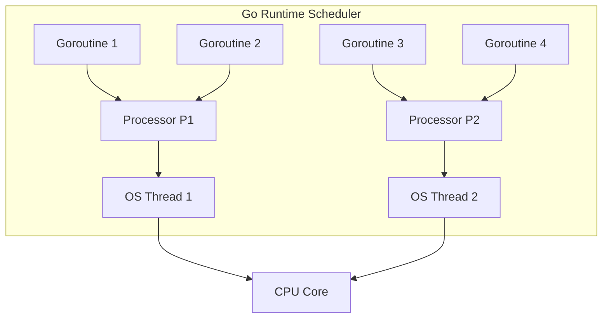
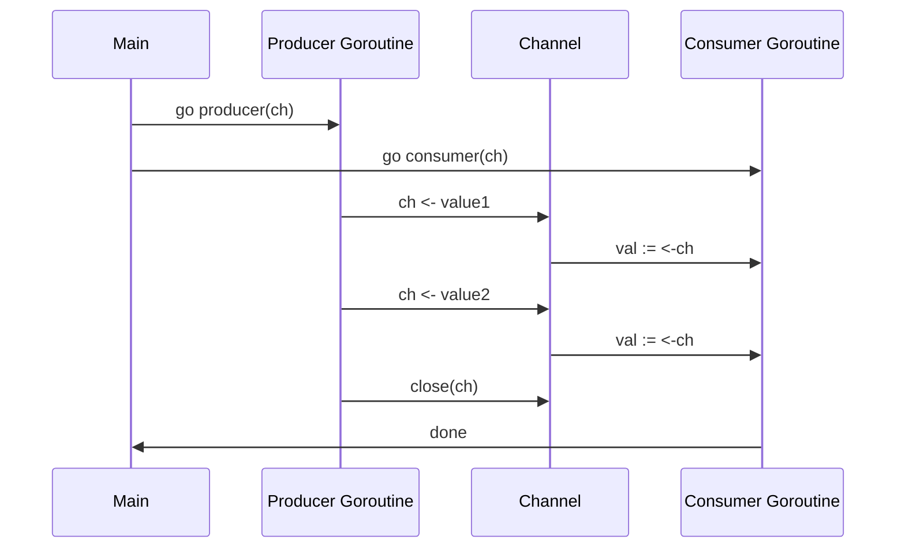
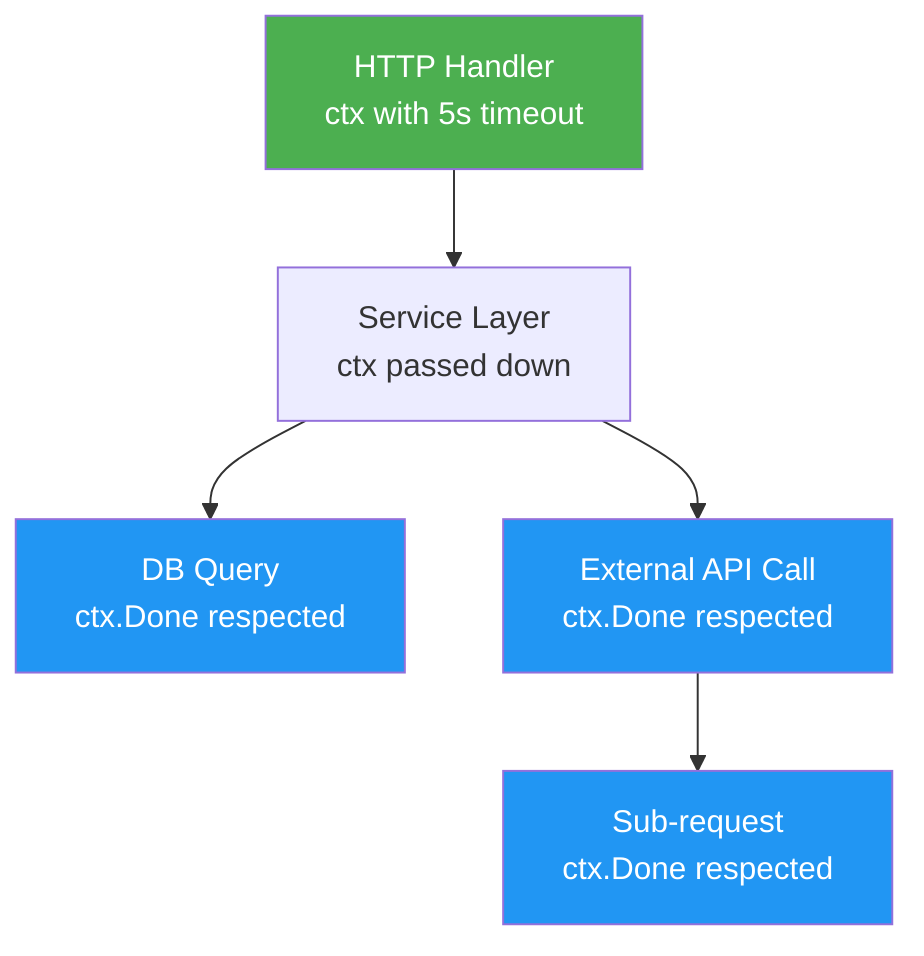
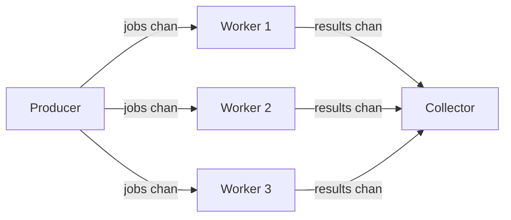

# Goroutines and Channels — Go's Superpower

> "Do not communicate by sharing memory; instead, share memory by communicating." — Rob Pike, Go co-creator

This is the sentence that separates Go from most other languages. When you finish this chapter, you will know exactly what it means — and you will never think about concurrency the same way again.

---

## 🤔 Why Concurrency Matters

Imagine a restaurant with a single waiter. Every time a customer orders, the waiter walks to the kitchen, stands there until the food is ready, then comes back. Meanwhile, every other table is waiting. That waiter is a single-threaded program — blocking on every I/O operation.

Now imagine a restaurant with 10 waiters. Each waiter takes an order and moves on. When food is ready, whoever is free picks it up. That is a concurrent program.

Modern backend services are that restaurant. A web server handling thousands of requests, a data pipeline processing millions of records, a microservice calling 5 APIs in parallel — all of these need concurrency to be fast.

Go was designed from the ground up to make concurrency simple, cheap, and safe.

---

## 🚀 Goroutines — Lightweight Threads

### The Analogy

Think of an OS thread like a delivery truck — heavy, expensive, takes up a lot of space (1 MB of stack memory), and you can only afford a few hundred of them.

A goroutine is like a bicycle courier — tiny (starts at only 2 KB of stack memory), fast to create, and you can have thousands running at the same time without breaking a sweat.

### Starting a Goroutine

Adding the keyword `go` before a function call is all it takes.

```go
package main

import (
    "fmt"
    "time"
)

func sayHello(name string) {
    fmt.Printf("Hello, %s!\n", name)
}

func main() {
    go sayHello("Alice") // runs concurrently
    go sayHello("Bob")   // runs concurrently

    // Without this sleep, main() exits before goroutines finish
    time.Sleep(100 * time.Millisecond)
}
```

### How Go Schedules Goroutines

Go has its own scheduler (the M:N scheduler). It maps many goroutines (M) onto a smaller number of OS threads (N). When a goroutine blocks on I/O, the scheduler moves another goroutine onto that thread. You get the benefit of async programming without writing async code.



### Goroutine vs OS Thread — The Numbers

| Property | OS Thread | Goroutine |
|---|---|---|
| Stack size | ~1 MB fixed | 2 KB (grows as needed) |
| Creation cost | Expensive (syscall) | Very cheap (runtime call) |
| How many you can run | Hundreds | Hundreds of thousands |
| Scheduling | OS kernel | Go runtime |
| Context switch cost | High | Very low |
| Communication | Shared memory + locks | Channels (preferred) |

---

## 📡 Channels — The Typed Pipe

### The Analogy

A channel is like a pipe between two workers on an assembly line. One worker puts a part into the pipe, the other picks it up. They don't need to share a clipboard or lock a filing cabinet — the pipe itself coordinates them.

### Creating and Using Channels

```go
package main

import "fmt"

func main() {
    // Create a channel that carries integers
    ch := make(chan int)

    // Start a goroutine that sends a value
    go func() {
        ch <- 42 // send 42 into the channel
    }()

    // Receive the value from the channel
    val := <-ch
    fmt.Println(val) // 42
}
```

A plain `make(chan int)` creates an **unbuffered** channel. Sending blocks until someone is ready to receive. Receiving blocks until someone sends. This synchronization is built in — no locks needed.

### Buffered Channels

```go
// A buffered channel with capacity 3
ch := make(chan string, 3)

ch <- "first"  // does not block — buffer has room
ch <- "second" // does not block
ch <- "third"  // does not block
// ch <- "fourth" // would block — buffer is full

fmt.Println(<-ch) // "first"
fmt.Println(<-ch) // "second"
fmt.Println(<-ch) // "third"
```

Think of a buffered channel like a mailbox. You can drop letters in without waiting for the recipient — as long as the mailbox is not full.

### Unbuffered vs Buffered — When to Use Which

| Scenario | Use |
|---|---|
| You want guaranteed handoff (sender waits for receiver) | Unbuffered |
| You want to decouple producer speed from consumer speed | Buffered |
| Sending a signal (done, quit) | Unbuffered |
| Rate limiting or batching | Buffered |
| Worker pool queue | Buffered |

---

## 🔀 Channel Direction — Typed in Function Signatures

You can restrict a channel parameter to send-only or receive-only in a function signature. This makes the code self-documenting and prevents misuse.

```go
// send-only: the function can only send into ch
func producer(ch chan<- int) {
    for i := 0; i < 5; i++ {
        ch <- i
    }
    close(ch)
}

// receive-only: the function can only receive from ch
func consumer(ch <-chan int) {
    for val := range ch {
        fmt.Println("received:", val)
    }
}

func main() {
    ch := make(chan int, 5)
    go producer(ch)
    consumer(ch)
}
```

The `range` over a channel reads values until the channel is closed. Always close a channel from the sender side, never the receiver side.

---

## 🔄 Goroutine + Channel Communication — The Full Picture



---

## ⚡ The select Statement — Switch for Channels

### The Analogy

`select` is like a call center agent monitoring multiple phone lines. Whichever line rings first gets answered. If none are ringing, the agent either waits or goes on break (default case).

```go
package main

import (
    "fmt"
    "time"
)

func main() {
    ch1 := make(chan string)
    ch2 := make(chan string)

    go func() {
        time.Sleep(1 * time.Second)
        ch1 <- "one"
    }()

    go func() {
        time.Sleep(2 * time.Second)
        ch2 <- "two"
    }()

    // Wait for whichever channel is ready first
    for i := 0; i < 2; i++ {
        select {
        case msg1 := <-ch1:
            fmt.Println("received from ch1:", msg1)
        case msg2 := <-ch2:
            fmt.Println("received from ch2:", msg2)
        }
    }
}
```

### Non-blocking Operations with select

```go
select {
case val := <-ch:
    fmt.Println("got:", val)
default:
    fmt.Println("channel not ready, moving on")
}
```

The `default` case makes `select` non-blocking. Without it, `select` blocks until at least one channel is ready.

---

## 🛑 Done Channel Pattern — Telling a Goroutine to Stop

### The Analogy

Imagine you hire a worker (goroutine) who keeps doing a task in a loop. When you want them to stop, you ring a bell (close the done channel). The worker hears the bell and exits cleanly.

```go
package main

import (
    "fmt"
    "time"
)

func worker(done <-chan struct{}) {
    for {
        select {
        case <-done:
            fmt.Println("worker: shutting down")
            return
        default:
            fmt.Println("worker: doing work...")
            time.Sleep(500 * time.Millisecond)
        }
    }
}

func main() {
    done := make(chan struct{})
    go worker(done)

    time.Sleep(2 * time.Second)
    close(done) // signal the worker to stop
    time.Sleep(100 * time.Millisecond) // give it time to exit
    fmt.Println("main: done")
}
```

`chan struct{}` uses zero memory and is the idiomatic Go signal channel. Closing it broadcasts the signal to all receivers at once — unlike sending a value, which wakes only one receiver.

---

## ⏳ WaitGroup — Wait for Multiple Goroutines

### The Analogy

A WaitGroup is like a teacher waiting for all students to hand in their exams before leaving the room. The teacher adds 1 to a counter for each student, each student calls `Done()` when finished, and the teacher calls `Wait()` to block until the counter reaches zero.

```go
package main

import (
    "fmt"
    "sync"
)

func download(url string, wg *sync.WaitGroup) {
    defer wg.Done() // decrement counter when done
    fmt.Printf("downloading: %s\n", url)
    // ... actual download logic
}

func main() {
    var wg sync.WaitGroup

    urls := []string{
        "https://example.com/file1",
        "https://example.com/file2",
        "https://example.com/file3",
    }

    for _, url := range urls {
        wg.Add(1)          // increment before starting goroutine
        go download(url, &wg)
    }

    wg.Wait() // block until all goroutines call Done()
    fmt.Println("all downloads complete")
}
```

**Critical rule:** Call `wg.Add(1)` before starting the goroutine, not inside it. If you add inside, there is a race condition where `Wait()` could return before `Add()` is called.

---

## 🔐 Mutex — Protecting Shared State

Sometimes channels are not the right tool. When multiple goroutines need to read and write a shared variable, you need a Mutex (mutual exclusion lock).

### The Analogy

A Mutex is like a single-stall bathroom. Only one person can be inside at a time. Everyone else waits outside. When the person leaves, they unlock the door for the next person.

```go
package main

import (
    "fmt"
    "sync"
)

type SafeCounter struct {
    mu    sync.Mutex
    count int
}

func (c *SafeCounter) Increment() {
    c.mu.Lock()
    defer c.mu.Unlock()
    c.count++
}

func (c *SafeCounter) Value() int {
    c.mu.Lock()
    defer c.mu.Unlock()
    return c.count
}

func main() {
    var wg sync.WaitGroup
    counter := &SafeCounter{}

    for i := 0; i < 1000; i++ {
        wg.Add(1)
        go func() {
            defer wg.Done()
            counter.Increment()
        }()
    }

    wg.Wait()
    fmt.Println("final count:", counter.Value()) // always 1000
}
```

Use `sync.RWMutex` when reads are frequent and writes are rare — it allows multiple concurrent readers but only one writer.

### sync/atomic — Lock-Free Simple Operations

For simple integer operations, `sync/atomic` is faster than a Mutex because it uses CPU-level atomic instructions.

```go
import "sync/atomic"

var count int64

// Safe increment without a Mutex
atomic.AddInt64(&count, 1)

// Safe read
val := atomic.LoadInt64(&count)
```

| Tool | Use Case |
|---|---|
| Channel | Passing data between goroutines |
| Mutex | Protecting a struct or complex shared state |
| RWMutex | Shared state with heavy reads, rare writes |
| atomic | Single integer counters and flags |

---

## 🕵️ Goroutine Leaks — The Silent Memory Drain

A goroutine leak happens when a goroutine is started but never exits. It sits in memory forever, holding resources.

### Common Cause: Blocked Channel with No Receiver

```go
// BAD — goroutine leaks if nothing reads from ch
func leak() {
    ch := make(chan int)
    go func() {
        ch <- 42 // blocks forever — no receiver
    }()
    // function returns, ch goes out of scope, goroutine is stuck
}
```

### How to Detect Leaks

Use the `runtime` package to check the number of goroutines:

```go
import "runtime"

fmt.Println("goroutines:", runtime.NumGoroutine())
```

In tests, use the `goleak` library (github.com/uber-go/goleak):

```go
func TestMyFunc(t *testing.T) {
    defer goleak.VerifyNone(t)
    // ... your test
}
```

### Prevention Rules

- Always provide a way for a goroutine to exit (done channel or context cancellation)
- Never start a goroutine in a library without giving the caller a way to stop it
- Use `defer` and cleanup functions to ensure channels are closed

---

## 🌐 context.Context — The Backbone of Go Services

### The Analogy

Imagine you send a scout (goroutine) into a forest to find water. You also send 5 sub-scouts. The main camp decides to move — they need to call back ALL scouts immediately. `context.Context` is the radio signal that every scout carries. When HQ cancels, every scout hears it.

`context.Context` carries three things:
1. **Cancellation signal** — stop what you are doing
2. **Deadline/timeout** — stop if you take too long
3. **Values** — request-scoped data (trace ID, user ID, etc.)

### context.WithCancel

```go
package main

import (
    "context"
    "fmt"
    "time"
)

func doWork(ctx context.Context, id int) {
    for {
        select {
        case <-ctx.Done():
            fmt.Printf("worker %d: cancelled — %v\n", id, ctx.Err())
            return
        default:
            fmt.Printf("worker %d: working...\n", id)
            time.Sleep(500 * time.Millisecond)
        }
    }
}

func main() {
    ctx, cancel := context.WithCancel(context.Background())

    for i := 1; i <= 3; i++ {
        go doWork(ctx, i)
    }

    time.Sleep(1500 * time.Millisecond)
    cancel() // cancel ALL workers at once
    time.Sleep(100 * time.Millisecond)
    fmt.Println("all workers stopped")
}
```

### context.WithTimeout

```go
func fetchData(ctx context.Context, url string) error {
    req, err := http.NewRequestWithContext(ctx, "GET", url, nil)
    if err != nil {
        return err
    }

    resp, err := http.DefaultClient.Do(req)
    if err != nil {
        return err // context deadline exceeded if timeout hit
    }
    defer resp.Body.Close()
    // ... process response
    return nil
}

func main() {
    // Cancel the request if it takes more than 3 seconds
    ctx, cancel := context.WithTimeout(context.Background(), 3*time.Second)
    defer cancel() // always defer cancel to free resources

    if err := fetchData(ctx, "https://slow-api.example.com/data"); err != nil {
        fmt.Println("error:", err)
    }
}
```

**Always defer cancel.** Even if the timeout fires, deferring cancel releases the resources associated with the context immediately rather than waiting for garbage collection.

### Context Propagation Through a Call Chain



The context flows down through every layer. If the original HTTP request is cancelled (user closes browser tab), `ctx.Done()` fires everywhere — the DB query, the API call, and the sub-request all stop. No wasted work.

---

## 🏗️ Full Example 1 — Concurrent HTTP Requests

```go
package main

import (
    "context"
    "fmt"
    "net/http"
    "sync"
    "time"
)

type Result struct {
    URL    string
    Status int
    Err    error
}

func fetch(ctx context.Context, url string, results chan<- Result, wg *sync.WaitGroup) {
    defer wg.Done()

    req, err := http.NewRequestWithContext(ctx, "GET", url, nil)
    if err != nil {
        results <- Result{URL: url, Err: err}
        return
    }

    resp, err := http.DefaultClient.Do(req)
    if err != nil {
        results <- Result{URL: url, Err: err}
        return
    }
    defer resp.Body.Close()

    results <- Result{URL: url, Status: resp.StatusCode}
}

func main() {
    urls := []string{
        "https://httpbin.org/get",
        "https://httpbin.org/status/404",
        "https://httpbin.org/delay/1",
    }

    ctx, cancel := context.WithTimeout(context.Background(), 5*time.Second)
    defer cancel()

    results := make(chan Result, len(urls))
    var wg sync.WaitGroup

    for _, url := range urls {
        wg.Add(1)
        go fetch(ctx, url, results, &wg)
    }

    // Close results channel when all goroutines finish
    go func() {
        wg.Wait()
        close(results)
    }()

    // Collect results
    for r := range results {
        if r.Err != nil {
            fmt.Printf("ERROR %s: %v\n", r.URL, r.Err)
        } else {
            fmt.Printf("OK    %s: %d\n", r.URL, r.Status)
        }
    }
}
```

All three requests happen in parallel. The total time is roughly equal to the slowest request, not the sum of all requests.

---

## 🏭 Full Example 2 — Producer-Consumer with Channels

```go
package main

import (
    "fmt"
    "math/rand"
    "sync"
    "time"
)

// producer generates jobs and sends them to the jobs channel
func producer(jobs chan<- int, count int) {
    defer close(jobs) // signal: no more jobs
    for i := 1; i <= count; i++ {
        fmt.Printf("producer: created job %d\n", i)
        jobs <- i
        time.Sleep(time.Duration(rand.Intn(100)) * time.Millisecond)
    }
}

// worker consumes jobs from jobs channel, sends results to results channel
func worker(id int, jobs <-chan int, results chan<- string, wg *sync.WaitGroup) {
    defer wg.Done()
    for job := range jobs {
        // Simulate work
        time.Sleep(time.Duration(rand.Intn(200)) * time.Millisecond)
        result := fmt.Sprintf("worker %d processed job %d", id, job)
        results <- result
    }
}

func main() {
    const numJobs    = 10
    const numWorkers = 3

    jobs    := make(chan int, numJobs)
    results := make(chan string, numJobs)

    // Start workers
    var wg sync.WaitGroup
    for w := 1; w <= numWorkers; w++ {
        wg.Add(1)
        go worker(w, jobs, results, &wg)
    }

    // Start producer
    go producer(jobs, numJobs)

    // Close results when all workers are done
    go func() {
        wg.Wait()
        close(results)
    }()

    // Print results as they come in
    for result := range results {
        fmt.Println(result)
    }
}
```



---

## ⏱️ Full Example 3 — Timeout with context.WithTimeout

```go
package main

import (
    "context"
    "errors"
    "fmt"
    "time"
)

// simulateSlowDB pretends to query a database
func simulateSlowDB(ctx context.Context, query string) (string, error) {
    // The DB takes 2 seconds to respond
    select {
    case <-time.After(2 * time.Second):
        return "result for: " + query, nil
    case <-ctx.Done():
        return "", fmt.Errorf("db query cancelled: %w", ctx.Err())
    }
}

func getUser(ctx context.Context, userID string) (string, error) {
    result, err := simulateSlowDB(ctx, "SELECT * FROM users WHERE id="+userID)
    if err != nil {
        return "", err
    }
    return result, nil
}

func main() {
    // Scenario 1: generous timeout — succeeds
    ctx1, cancel1 := context.WithTimeout(context.Background(), 3*time.Second)
    defer cancel1()

    result, err := getUser(ctx1, "123")
    if err != nil {
        fmt.Println("scenario 1 failed:", err)
    } else {
        fmt.Println("scenario 1 success:", result)
    }

    // Scenario 2: tight timeout — fails
    ctx2, cancel2 := context.WithTimeout(context.Background(), 1*time.Second)
    defer cancel2()

    result, err = getUser(ctx2, "456")
    if err != nil {
        if errors.Is(err, context.DeadlineExceeded) {
            fmt.Println("scenario 2: timed out waiting for DB")
        } else {
            fmt.Println("scenario 2 failed:", err)
        }
    } else {
        fmt.Println("scenario 2 success:", result)
    }
}
```

---

## ✅ When to Use / When NOT to Use

### Goroutines

| Use goroutines when... | Do NOT use goroutines when... |
|---|---|
| I/O-bound work (HTTP, DB, file) | The work is trivially fast (goroutine overhead costs more) |
| Tasks that can run in parallel | You have shared mutable state and no synchronization plan |
| Fan-out: same work on multiple inputs | You have not thought about how the goroutine will exit |
| Background tasks (cleanup, logging) | Sequencing is required and order matters strictly |

### Channels

| Use channels when... | Do NOT use channels when... |
|---|---|
| Passing ownership of data between goroutines | You just need a simple shared counter (use atomic) |
| Signaling events (done, quit, ready) | Protecting a complex struct (use Mutex) |
| Pipeline stages (producer -> transform -> consumer) | You need a broadcast to many goroutines (use sync.Cond or done channel close) |

### context.Context

| Use context when... | Do NOT use context when... |
|---|---|
| Any function that does I/O | Storing optional function parameters |
| Every HTTP handler and RPC handler | Passing business logic values (use explicit parameters) |
| Propagating deadlines down a call chain | Replacing proper error handling |

---

## 🎯 Key Takeaways

1. **Goroutines are cheap.** Start at 2 KB of stack, grow as needed. You can run hundreds of thousands. OS threads start at 1 MB and you can afford only hundreds.

2. **Channels coordinate goroutines without locks.** The channel itself is the synchronization primitive — you share data by passing it through the channel, not by sharing a memory address.

3. **Unbuffered channels provide synchronization guarantees.** The sender blocks until the receiver is ready. Buffered channels decouple them.

4. **`select` lets a goroutine wait on multiple channels at once.** The first ready case executes. A `default` case makes it non-blocking.

5. **Always give goroutines a way to exit.** Use a done channel, context cancellation, or closing the input channel. Goroutines that never exit are memory leaks.

6. **`sync.WaitGroup` waits for a group of goroutines.** Call `Add(1)` before starting the goroutine, `Done()` inside it, and `Wait()` to block until all finish.

7. **Mutex protects shared state. Channels pass data.** Use channels when transferring ownership. Use Mutex when multiple goroutines need access to the same struct.

8. **`context.Context` is mandatory in production Go.** Every function that does I/O must accept a `ctx context.Context` as its first parameter. It propagates cancellation, timeouts, and deadlines through your entire call tree automatically.

9. **Always `defer cancel()` after `context.With*`.** Even if the context times out or is cancelled externally, calling cancel frees the underlying resources immediately.

10. **Run your programs with the race detector during development.** `go run -race main.go` catches data races that are nearly impossible to find by reading code alone.

---

## 🔗 What is Next

Now that you understand how Go handles concurrency in a single process, the next chapter covers **HTTP servers in Go** — where all of these patterns come together. Every incoming HTTP request is handled in its own goroutine, contexts carry request-scoped deadlines, and channels coordinate background work. The patterns you learned here are the foundation of every Go web service ever written.
