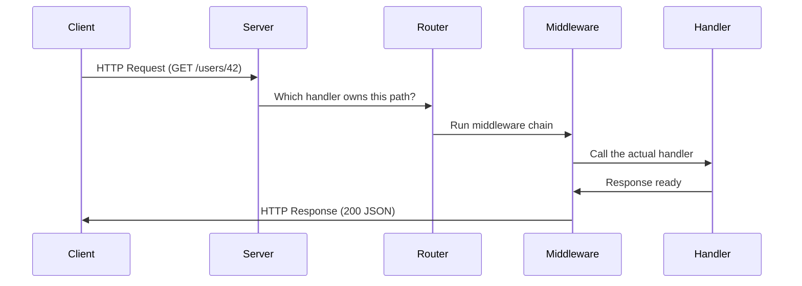
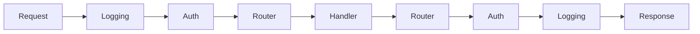
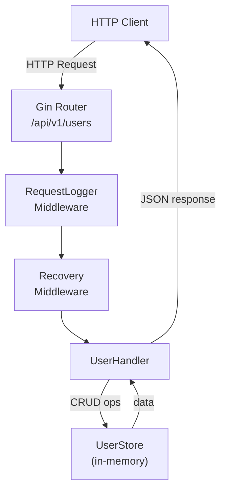

# Building HTTP Servers with Go — net/http and Gin

> **Who this is for:** You know Go basics (structs, functions, goroutines). Now you want to build real web APIs.

---

## 🗺️ Big Picture — How a Web Server Works

Before any code, picture a restaurant.

- The **server** is the restaurant building.
- The **router** is the host who directs you to the right table.
- The **handler** is the waiter who takes your order and brings food.
- **Middleware** is the security guard at the door, the coat check, and the cashier — things that happen to every customer regardless of which table they sit at.

When a browser or mobile app sends an HTTP request, Go does this:



Go gives you two ways to build this restaurant:

| Approach | Like... | Best for |
|---|---|---|
| `net/http` (stdlib) | Building furniture from raw wood | Learning, tiny services, zero dependencies |
| Gin framework | Buying IKEA furniture | Production APIs, teams, speed |

---

# PART 1 — net/http: Go's Built-in HTTP Library

## 🏗️ Your First Server in 10 Lines

Think of `http.ListenAndServe` as plugging your restaurant into the power grid — it starts listening for customers on a port.

```go
package main

import (
    "fmt"
    "net/http"
)

func main() {
    // Register a handler for the path "/"
    http.HandleFunc("/", func(w http.ResponseWriter, r *http.Request) {
        fmt.Fprintln(w, "Hello, Go server!")
    })

    // Start the server on port 8080
    // This blocks forever (or until the program crashes)
    fmt.Println("Server running on http://localhost:8080")
    err := http.ListenAndServe(":8080", nil)
    if err != nil {
        panic(err)
    }
}
```

Run it: `go run main.go`  
Test it: `curl http://localhost:8080`

**Two key types you must know:**

| Type | What it is | Real-world analogy |
|---|---|---|
| `http.ResponseWriter` | Where you write the response | The plate you put food on |
| `*http.Request` | Everything about the incoming request | The customer's order ticket |

---

## 📨 Reading What the Client Sends

### Query Parameters

Query params live in the URL after `?`. Like `GET /search?q=golang&page=2`.

```go
http.HandleFunc("/search", func(w http.ResponseWriter, r *http.Request) {
    // r.URL.Query() returns a map of all query params
    query := r.URL.Query().Get("q")    // "golang"
    page  := r.URL.Query().Get("page") // "2" (always a string!)

    fmt.Fprintf(w, "Searching for: %s, page: %s", query, page)
})
```

> Note: Query values are always strings. Convert with `strconv.Atoi()` if you need a number.

### Reading the Request Body (JSON)

When a client sends a `POST` with JSON, you need to decode it.

```go
package main

import (
    "encoding/json"
    "fmt"
    "net/http"
)

type CreateUserRequest struct {
    Name  string `json:"name"`
    Email string `json:"email"`
    Age   int    `json:"age"`
}

func createUserHandler(w http.ResponseWriter, r *http.Request) {
    // Only allow POST
    if r.Method != http.MethodPost {
        http.Error(w, "Method not allowed", http.StatusMethodNotAllowed)
        return
    }

    var req CreateUserRequest

    // json.NewDecoder reads from the request body stream
    // Decode() fills our struct from the JSON
    err := json.NewDecoder(r.Body).Decode(&req)
    if err != nil {
        http.Error(w, "Bad JSON: "+err.Error(), http.StatusBadRequest)
        return
    }

    fmt.Fprintf(w, "Created user: %s (%s), age %d", req.Name, req.Email, req.Age)
}

func main() {
    http.HandleFunc("/users", createUserHandler)
    http.ListenAndServe(":8080", nil)
}
```

Test with curl:
```bash
curl -X POST http://localhost:8080/users \
  -H "Content-Type: application/json" \
  -d '{"name":"Alice","email":"alice@example.com","age":30}'
```

---

## 📤 Writing JSON Responses

Writing a proper JSON response means three things:
1. Set the `Content-Type` header to `application/json`
2. Set the right status code
3. Encode your struct to JSON

```go
type User struct {
    ID    int    `json:"id"`
    Name  string `json:"name"`
    Email string `json:"email"`
}

func getUserHandler(w http.ResponseWriter, r *http.Request) {
    user := User{ID: 1, Name: "Alice", Email: "alice@example.com"}

    // STEP 1: Set header BEFORE writing status or body
    w.Header().Set("Content-Type", "application/json")

    // STEP 2: Set status code (200 is default, but be explicit)
    w.WriteHeader(http.StatusOK)

    // STEP 3: Encode to JSON and write to response
    json.NewEncoder(w).Encode(user)
}
```

> **Common mistake:** Calling `w.WriteHeader()` AFTER `w.Header().Set()` is wrong — headers must be set first. Once you call `WriteHeader` or write to the body, headers are locked.

---

## 🔗 Path Parameters — The stdlib Problem

Here is where vanilla `net/http` hurts. It has no built-in support for path params like `/users/42`.

If you try to register `/users/`, every URL starting with `/users/` matches, and you have to manually parse the ID yourself:

```go
http.HandleFunc("/users/", func(w http.ResponseWriter, r *http.Request) {
    // r.URL.Path might be "/users/42"
    // We strip the prefix manually
    id := strings.TrimPrefix(r.URL.Path, "/users/")

    if id == "" {
        // List all users
        fmt.Fprintln(w, "Listing all users")
        return
    }

    // Now id = "42"
    fmt.Fprintf(w, "Getting user with ID: %s", id)
})
```

This is ugly and breaks with nested paths. This is the main reason people use `gorilla/mux` or Gin.

---

## 🧱 Middleware with http.Handler

Middleware is code that wraps every request — logging, auth checks, timing. Think of it as a pipeline of functions.

The key interface is `http.Handler`:

```go
type Handler interface {
    ServeHTTP(ResponseWriter, *Request)
}
```

Middleware is just a function that takes a `Handler` and returns a `Handler`:

```go
// loggingMiddleware wraps any handler and logs each request
func loggingMiddleware(next http.Handler) http.Handler {
    // http.HandlerFunc is a helper that converts a function into an http.Handler
    return http.HandlerFunc(func(w http.ResponseWriter, r *http.Request) {
        start := time.Now()

        // Call the actual handler
        next.ServeHTTP(w, r)

        // Log AFTER the handler finishes
        fmt.Printf("[%s] %s %s — took %v\n",
            time.Now().Format("15:04:05"),
            r.Method,
            r.URL.Path,
            time.Since(start),
        )
    })
}

// authMiddleware rejects requests without a valid token
func authMiddleware(next http.Handler) http.Handler {
    return http.HandlerFunc(func(w http.ResponseWriter, r *http.Request) {
        token := r.Header.Get("Authorization")
        if token != "Bearer secret-token" {
            http.Error(w, "Unauthorized", http.StatusUnauthorized)
            return // Stop the chain — don't call next
        }
        next.ServeHTTP(w, r)
    })
}

func main() {
    mux := http.NewServeMux()
    mux.HandleFunc("/users", getUserHandler)

    // Wrap the entire mux with middleware
    // Order matters: outermost middleware runs first
    handler := loggingMiddleware(authMiddleware(mux))

    http.ListenAndServe(":8080", handler)
}
```

The middleware chain looks like this:



---

## 🗂️ http.ServeMux vs gorilla/mux

`http.ServeMux` is the default router built into Go. It's simple but limited.

| Feature | http.ServeMux | gorilla/mux |
|---|---|---|
| Basic routing | Yes | Yes |
| Path parameters (`/users/{id}`) | No | Yes |
| HTTP method matching | No | Yes |
| Regex in paths | No | Yes |
| Subrouters | No | Yes |
| Active maintenance | Yes (stdlib) | Maintenance mode (use chi instead) |
| Zero dependencies | Yes | No |

For production, prefer `chi` (lightweight, stdlib-compatible) or just use Gin.

---

# PART 2 — Gin Framework

## 🚀 Why Gin Exists

Think of `net/http` as driving a manual car with no power steering. You have full control, but it requires effort. Gin is an automatic car with GPS — you move faster and make fewer mistakes.

**Concrete reasons to choose Gin:**

| Problem with stdlib | How Gin fixes it |
|---|---|
| No path params | `c.Param("id")` |
| No built-in JSON binding | `c.ShouldBindJSON(&req)` |
| No method-based routing | `router.GET()`, `router.POST()` |
| No built-in validation | Struct tags + `binding:"required,email"` |
| Middleware is verbose | `router.Use(middleware)` |
| No route groups | `router.Group("/api/v1")` |
| Slow JSON encoding | Uses `json-iterator`, ~40x faster |

Gin is the most popular Go web framework (75k+ GitHub stars). It's used by companies like Alibaba, Docker, and Kubernetes ecosystem tools.

---

## 🎛️ gin.New() vs gin.Default()

```go
// gin.Default() = gin.New() + Logger middleware + Recovery middleware
// Use this in development and most production cases
router := gin.Default()

// gin.New() = bare metal, no default middleware
// Use when you want 100% control over what middleware runs
router := gin.New()
router.Use(gin.Logger())   // Add logger manually
router.Use(gin.Recovery()) // Add recovery manually
```

`gin.Recovery()` is critical — it catches panics so your server doesn't crash when a handler has a bug.

---

## 🌐 Your First Gin Server

```go
package main

import (
    "net/http"

    "github.com/gin-gonic/gin"
)

func main() {
    router := gin.Default()

    // GET /ping → responds with JSON
    router.GET("/ping", func(c *gin.Context) {
        c.JSON(http.StatusOK, gin.H{
            "message": "pong",
        })
    })

    // Start server on port 8080
    router.Run(":8080") // equivalent to http.ListenAndServe(":8080", router)
}
```

`gin.H` is just `map[string]any` — a shortcut for quick JSON responses.

---

## 🔑 Core Gin Methods

### Route Parameters

```go
// Path: /users/:id — the colon means "this is a variable"
router.GET("/users/:id", func(c *gin.Context) {
    id := c.Param("id") // "42" if URL is /users/42
    c.JSON(200, gin.H{"user_id": id})
})

// Wildcard: /files/*filepath — matches anything after /files/
router.GET("/files/*filepath", func(c *gin.Context) {
    path := c.Param("filepath") // "/docs/readme.txt"
    c.JSON(200, gin.H{"path": path})
})
```

### Query Parameters

```go
router.GET("/search", func(c *gin.Context) {
    // c.Query returns "" if param is missing
    q := c.Query("q")

    // c.DefaultQuery returns fallback if param is missing
    page := c.DefaultQuery("page", "1")

    c.JSON(200, gin.H{"query": q, "page": page})
})
```

### JSON Binding and Validation

This is where Gin really shines. You define a struct with rules, and Gin handles parsing AND validation:

```go
type CreateUserRequest struct {
    Name     string `json:"name"     binding:"required,min=2,max=100"`
    Email    string `json:"email"    binding:"required,email"`
    Age      int    `json:"age"      binding:"required,gte=18,lte=120"`
    Password string `json:"password" binding:"required,min=8"`
}

router.POST("/users", func(c *gin.Context) {
    var req CreateUserRequest

    // ShouldBindJSON parses body AND validates binding tags
    // Returns error if JSON is malformed OR validation fails
    if err := c.ShouldBindJSON(&req); err != nil {
        c.JSON(http.StatusBadRequest, gin.H{"error": err.Error()})
        return
    }

    // If we reach here, req is valid
    c.JSON(http.StatusCreated, gin.H{
        "message": "User created",
        "user":    req.Name,
    })
})
```

Common binding tags:

| Tag | Meaning |
|---|---|
| `required` | Field must be present and non-zero |
| `min=2` | String length or number minimum |
| `max=100` | String length or number maximum |
| `email` | Must be valid email format |
| `gte=18` | Greater than or equal to 18 |
| `lte=120` | Less than or equal to 120 |
| `oneof=admin user guest` | Must be one of these values |
| `url` | Must be a valid URL |

---

## 📦 Route Groups

Groups let you share a URL prefix and middleware across related routes. Think of it as organizing routes into departments.

```go
router := gin.Default()

// All routes under /api/v1
v1 := router.Group("/api/v1")
{
    v1.GET("/users", listUsers)
    v1.POST("/users", createUser)
    v1.GET("/users/:id", getUser)
    v1.PUT("/users/:id", updateUser)
    v1.DELETE("/users/:id", deleteUser)
}

// Admin routes with extra middleware
admin := router.Group("/admin")
admin.Use(adminAuthMiddleware()) // Only applied to /admin routes
{
    admin.GET("/stats", getStats)
    admin.DELETE("/users/:id", adminDeleteUser)
}
```

---

## 🛡️ Middleware in Gin

### Built-in Middleware

```go
router := gin.New()

// gin.Logger() logs: [GIN] 2024/01/01 - 200 | 1.234ms | GET /users
router.Use(gin.Logger())

// gin.Recovery() catches panics and returns 500 instead of crashing
router.Use(gin.Recovery())
```

### Custom Middleware

The signature is always `gin.HandlerFunc` — a function that takes `*gin.Context`.

```go
// RequestID middleware — adds a unique ID to every request
func RequestIDMiddleware() gin.HandlerFunc {
    return func(c *gin.Context) {
        // Generate a unique ID for this request
        requestID := uuid.New().String()

        // Store it in the context so handlers can read it
        c.Set("request_id", requestID)

        // Add it to the response headers
        c.Header("X-Request-ID", requestID)

        // CRITICAL: call Next() to pass control to the next middleware/handler
        c.Next()

        // Code here runs AFTER the handler finishes (like cleanup)
        fmt.Printf("Request %s completed with status %d\n",
            requestID, c.Writer.Status())
    }
}

// Auth middleware — validates JWT token
func AuthMiddleware() gin.HandlerFunc {
    return func(c *gin.Context) {
        token := c.GetHeader("Authorization")
        if token == "" {
            c.AbortWithStatusJSON(http.StatusUnauthorized, gin.H{
                "error": "Authorization header required",
            })
            return // c.Abort() stops the chain, no need to call Next()
        }

        // Validate token... (simplified here)
        userID := validateToken(token)
        if userID == 0 {
            c.AbortWithStatusJSON(http.StatusUnauthorized, gin.H{
                "error": "Invalid token",
            })
            return
        }

        // Pass userID to downstream handlers
        c.Set("user_id", userID)
        c.Next()
    }
}

// Usage
router.Use(RequestIDMiddleware())
protected := router.Group("/api")
protected.Use(AuthMiddleware())
```

### CORS Middleware

```go
// go get github.com/gin-contrib/cors
import "github.com/gin-contrib/cors"

router.Use(cors.New(cors.Config{
    AllowOrigins:     []string{"https://myapp.com", "http://localhost:3000"},
    AllowMethods:     []string{"GET", "POST", "PUT", "DELETE", "OPTIONS"},
    AllowHeaders:     []string{"Origin", "Content-Type", "Authorization"},
    ExposeHeaders:    []string{"Content-Length"},
    AllowCredentials: true,
    MaxAge:           12 * time.Hour,
}))
```

---

## 📁 File Uploads

```go
router.POST("/upload", func(c *gin.Context) {
    // Get the file from the multipart form
    // "file" must match the form field name from the client
    file, err := c.FormFile("file")
    if err != nil {
        c.JSON(http.StatusBadRequest, gin.H{"error": "No file uploaded"})
        return
    }

    // Validate file size (10 MB limit)
    if file.Size > 10<<20 {
        c.JSON(http.StatusBadRequest, gin.H{"error": "File too large (max 10MB)"})
        return
    }

    // Save the file to disk
    // Use a safe filename — never trust the client-provided name directly
    dst := filepath.Join("uploads", filepath.Base(file.Filename))
    if err := c.SaveUploadedFile(file, dst); err != nil {
        c.JSON(http.StatusInternalServerError, gin.H{"error": "Failed to save file"})
        return
    }

    c.JSON(http.StatusOK, gin.H{
        "filename": file.Filename,
        "size":     file.Size,
        "saved_to": dst,
    })
})
```

---

## 🔄 Same Endpoint: stdlib vs Gin

Let's build `GET /users/:id` in both ways so you can see the difference clearly.

### stdlib version

```go
// net/http — manual, verbose, fragile
func getUserHandler(w http.ResponseWriter, r *http.Request) {
    // Method check — stdlib doesn't do this automatically
    if r.Method != http.MethodGet {
        http.Error(w, "Method not allowed", http.StatusMethodNotAllowed)
        return
    }

    // Manual path parsing — error-prone
    parts := strings.Split(r.URL.Path, "/")
    if len(parts) < 3 || parts[2] == "" {
        http.Error(w, "Missing user ID", http.StatusBadRequest)
        return
    }
    id, err := strconv.Atoi(parts[2])
    if err != nil {
        http.Error(w, "Invalid user ID", http.StatusBadRequest)
        return
    }

    user := findUser(id) // your DB call
    if user == nil {
        http.Error(w, "User not found", http.StatusNotFound)
        return
    }

    // Manual JSON response
    w.Header().Set("Content-Type", "application/json")
    w.WriteHeader(http.StatusOK)
    json.NewEncoder(w).Encode(user)
}

// Registration also fragile — matches /users/ AND /users/anything/extra
http.HandleFunc("/users/", getUserHandler)
```

### Gin version

```go
// Gin — clean, safe, expressive
router.GET("/users/:id", func(c *gin.Context) {
    // c.Param handles parsing automatically
    idStr := c.Param("id")
    id, err := strconv.Atoi(idStr)
    if err != nil {
        c.JSON(http.StatusBadRequest, gin.H{"error": "Invalid user ID"})
        return
    }

    user := findUser(id) // your DB call
    if user == nil {
        c.JSON(http.StatusNotFound, gin.H{"error": "User not found"})
        return
    }

    c.JSON(http.StatusOK, user)
})
```

The Gin version is shorter, cleaner, and handles method matching automatically.

---

## 🏗️ Full CRUD REST API — User Resource

Here is a complete, production-style User API with Gin:

```go
package main

import (
    "net/http"
    "strconv"
    "sync"
    "time"

    "github.com/gin-gonic/gin"
)

// --- Models ---

type User struct {
    ID        int       `json:"id"`
    Name      string    `json:"name"`
    Email     string    `json:"email"`
    CreatedAt time.Time `json:"created_at"`
}

type CreateUserRequest struct {
    Name  string `json:"name"  binding:"required,min=2,max=100"`
    Email string `json:"email" binding:"required,email"`
}

type UpdateUserRequest struct {
    Name  string `json:"name"  binding:"omitempty,min=2,max=100"`
    Email string `json:"email" binding:"omitempty,email"`
}

// --- In-memory store (replace with real DB in production) ---

type UserStore struct {
    mu     sync.RWMutex
    users  map[int]User
    nextID int
}

func NewUserStore() *UserStore {
    return &UserStore{users: make(map[int]User), nextID: 1}
}

func (s *UserStore) Create(name, email string) User {
    s.mu.Lock()
    defer s.mu.Unlock()
    u := User{ID: s.nextID, Name: name, Email: email, CreatedAt: time.Now()}
    s.users[s.nextID] = u
    s.nextID++
    return u
}

func (s *UserStore) GetAll() []User {
    s.mu.RLock()
    defer s.mu.RUnlock()
    result := make([]User, 0, len(s.users))
    for _, u := range s.users {
        result = append(result, u)
    }
    return result
}

func (s *UserStore) GetByID(id int) (User, bool) {
    s.mu.RLock()
    defer s.mu.RUnlock()
    u, ok := s.users[id]
    return u, ok
}

func (s *UserStore) Update(id int, name, email string) (User, bool) {
    s.mu.Lock()
    defer s.mu.Unlock()
    u, ok := s.users[id]
    if !ok {
        return User{}, false
    }
    if name != "" {
        u.Name = name
    }
    if email != "" {
        u.Email = email
    }
    s.users[id] = u
    return u, true
}

func (s *UserStore) Delete(id int) bool {
    s.mu.Lock()
    defer s.mu.Unlock()
    if _, ok := s.users[id]; !ok {
        return false
    }
    delete(s.users, id)
    return true
}

// --- Handlers ---

type UserHandler struct {
    store *UserStore
}

// GET /api/v1/users
func (h *UserHandler) ListUsers(c *gin.Context) {
    users := h.store.GetAll()
    c.JSON(http.StatusOK, gin.H{
        "data":  users,
        "count": len(users),
    })
}

// GET /api/v1/users/:id
func (h *UserHandler) GetUser(c *gin.Context) {
    id, err := strconv.Atoi(c.Param("id"))
    if err != nil {
        c.JSON(http.StatusBadRequest, gin.H{"error": "Invalid user ID"})
        return
    }

    user, ok := h.store.GetByID(id)
    if !ok {
        c.JSON(http.StatusNotFound, gin.H{"error": "User not found"})
        return
    }

    c.JSON(http.StatusOK, gin.H{"data": user})
}

// POST /api/v1/users
func (h *UserHandler) CreateUser(c *gin.Context) {
    var req CreateUserRequest
    if err := c.ShouldBindJSON(&req); err != nil {
        c.JSON(http.StatusBadRequest, gin.H{"error": err.Error()})
        return
    }

    user := h.store.Create(req.Name, req.Email)
    c.JSON(http.StatusCreated, gin.H{
        "message": "User created successfully",
        "data":    user,
    })
}

// PUT /api/v1/users/:id
func (h *UserHandler) UpdateUser(c *gin.Context) {
    id, err := strconv.Atoi(c.Param("id"))
    if err != nil {
        c.JSON(http.StatusBadRequest, gin.H{"error": "Invalid user ID"})
        return
    }

    var req UpdateUserRequest
    if err := c.ShouldBindJSON(&req); err != nil {
        c.JSON(http.StatusBadRequest, gin.H{"error": err.Error()})
        return
    }

    user, ok := h.store.Update(id, req.Name, req.Email)
    if !ok {
        c.JSON(http.StatusNotFound, gin.H{"error": "User not found"})
        return
    }

    c.JSON(http.StatusOK, gin.H{
        "message": "User updated successfully",
        "data":    user,
    })
}

// DELETE /api/v1/users/:id
func (h *UserHandler) DeleteUser(c *gin.Context) {
    id, err := strconv.Atoi(c.Param("id"))
    if err != nil {
        c.JSON(http.StatusBadRequest, gin.H{"error": "Invalid user ID"})
        return
    }

    if !h.store.Delete(id) {
        c.JSON(http.StatusNotFound, gin.H{"error": "User not found"})
        return
    }

    c.JSON(http.StatusOK, gin.H{"message": "User deleted successfully"})
}

// --- Middleware ---

func RequestLogger() gin.HandlerFunc {
    return func(c *gin.Context) {
        start := time.Now()
        c.Next()
        duration := time.Since(start)
        c.Header("X-Response-Time", duration.String())
    }
}

// --- Main ---

func main() {
    router := gin.Default()
    router.Use(RequestLogger())

    store := NewUserStore()
    handler := &UserHandler{store: store}

    api := router.Group("/api/v1")
    {
        users := api.Group("/users")
        {
            users.GET("", handler.ListUsers)
            users.POST("", handler.CreateUser)
            users.GET("/:id", handler.GetUser)
            users.PUT("/:id", handler.UpdateUser)
            users.DELETE("/:id", handler.DeleteUser)
        }
    }

    router.Run(":8080")
}
```

Test the CRUD operations:

```bash
# Create a user
curl -X POST http://localhost:8080/api/v1/users \
  -H "Content-Type: application/json" \
  -d '{"name":"Alice","email":"alice@example.com"}'

# List all users
curl http://localhost:8080/api/v1/users

# Get one user
curl http://localhost:8080/api/v1/users/1

# Update a user
curl -X PUT http://localhost:8080/api/v1/users/1 \
  -H "Content-Type: application/json" \
  -d '{"name":"Alice Smith"}'

# Delete a user
curl -X DELETE http://localhost:8080/api/v1/users/1
```

The architecture looks like this:



---

## 🔍 When to Use / When NOT to Use

### net/http (stdlib)

**Use when:**
- You are learning Go internals — understanding stdlib makes you a better developer
- Building a tiny internal tool or CLI server with 1-2 endpoints
- Writing a library that others will use — don't force Gin on your users
- Zero external dependencies is a hard requirement (some companies have strict policies)
- You are embedding a small HTTP server into a larger application

**Do NOT use when:**
- You need path parameters without writing your own parser
- Building a REST API with 10+ routes — the verbosity will kill you
- Working in a team that needs clear, consistent patterns
- You need request validation — rolling your own is tedious and bug-prone

### Gin Framework

**Use when:**
- Building REST APIs for mobile apps, SPAs, or microservices
- You want built-in validation, binding, and decent error messages
- Your team wants consistent patterns across handlers
- You care about performance (Gin is one of the fastest Go frameworks)
- Building a production API with 5+ endpoints

**Do NOT use when:**
- Building a simple proxy or file server — `net/http` is enough
- The project bans third-party dependencies
- You need advanced features Gin doesn't support well (use Echo or Fiber instead)
- Building a GraphQL server — use `gqlgen` which works with stdlib

---

## 🆚 Framework Comparison

| | net/http | Gin | Echo | Fiber |
|---|---|---|---|---|
| Dependencies | Zero | ~5 | ~5 | ~10 |
| Path params | Manual | Yes | Yes | Yes |
| Validation | Manual | Yes (go-validator) | Yes | Yes |
| Speed (req/sec) | Baseline | ~40x faster JSON | ~35x faster | ~50x faster |
| Learning curve | Low | Low | Low | Low |
| Middleware ecosystem | Small | Large | Medium | Medium |
| stdlib compatible | Yes | Mostly | Mostly | No |
| Best for | Libs, tiny tools | Production APIs | Production APIs | High throughput |

---

## 🎯 Key Takeaways

1. **`net/http` is the foundation.** Every Go web framework is built on top of it. Learning it makes you understand what frameworks do for you.

2. **Two types rule everything.** `http.ResponseWriter` (write the response) and `*http.Request` (read the request). Everything else is helpers around these.

3. **Middleware is just a function that wraps a handler.** It runs code before and after your handler by calling `next.ServeHTTP()` (stdlib) or `c.Next()` (Gin) in the middle.

4. **Set headers before writing the body.** Once you start writing the response body, headers are locked. Always `w.Header().Set(...)` before `w.WriteHeader(...)` before `w.Write(...)`.

5. **Gin's `ShouldBindJSON` + struct tags is your best friend.** Define your schema once with binding tags and get parsing + validation for free.

6. **Route groups keep your code organized.** Group routes by version (`/api/v1`) or feature (`/users`, `/products`) and apply middleware per group.

7. **Use `c.Abort()` not `return` alone when blocking in middleware.** Without `Abort()`, Gin will still continue to the next handler after your middleware returns.

8. **Don't trust `file.Filename` for uploads.** Always use `filepath.Base()` to strip directory traversal attacks.

9. **Start with Gin for production APIs.** The productivity boost and built-in validation are worth the dependency.

10. **`gin.Recovery()` is non-negotiable in production.** Without it, one nil pointer panic takes your entire server down.

---

## 📚 Next Steps

- Add a real database: `GORM` or `sqlx` with PostgreSQL
- Add JWT authentication middleware
- Structure your project with Clean Architecture (handlers → services → repositories)
- Add OpenAPI/Swagger docs with `swaggo/swag`
- Add graceful shutdown with `os.Signal` and context cancellation
- Write handler tests using `httptest.NewRecorder()`
