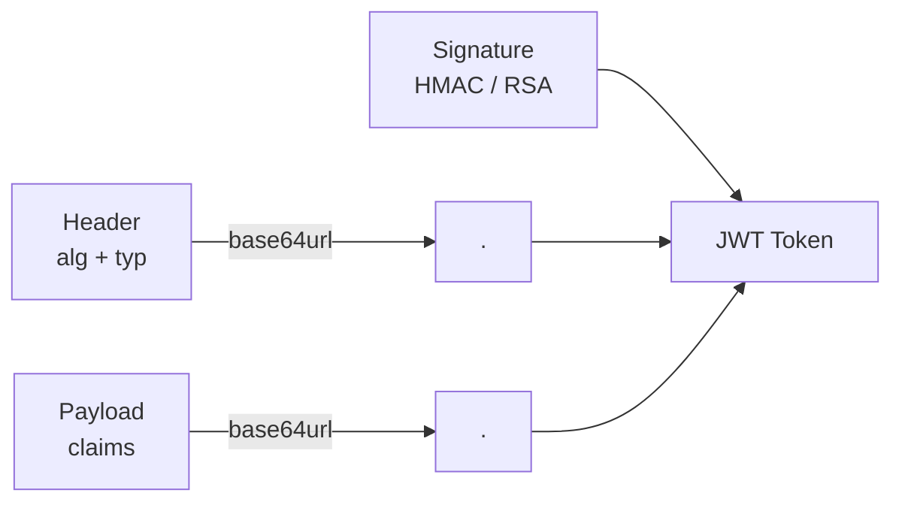
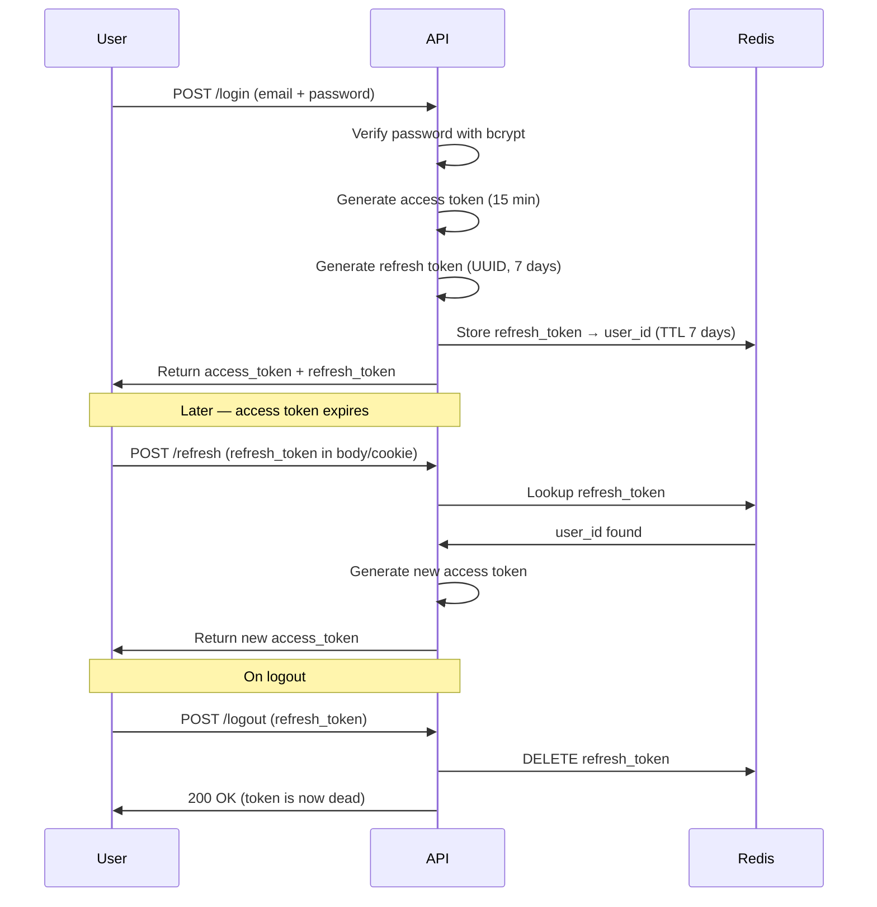
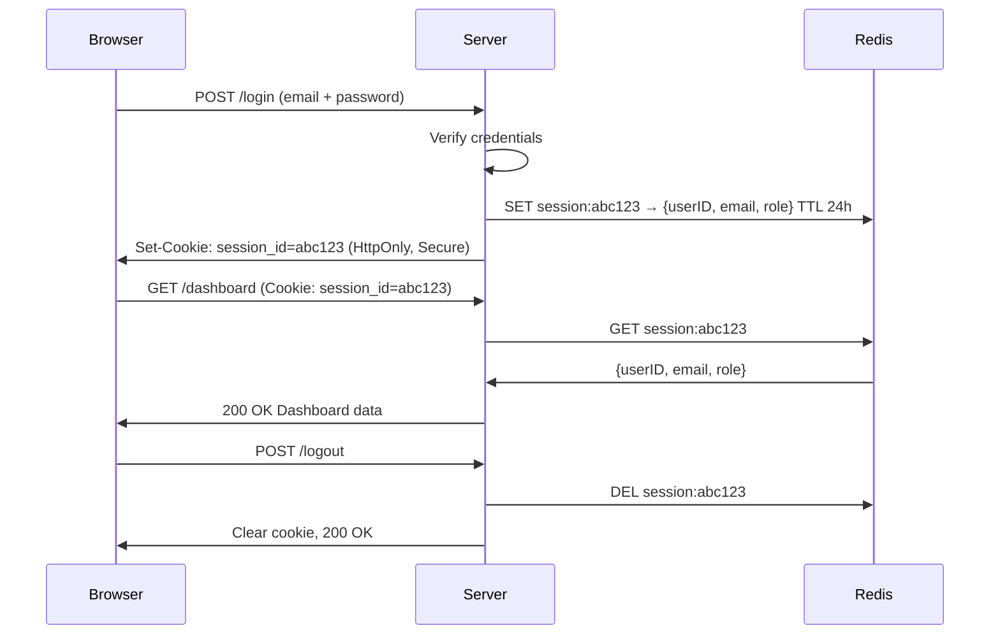
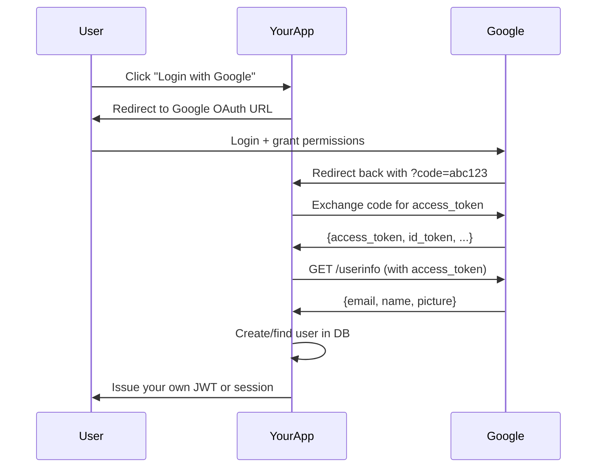

# JWT Authentication and Session Management in Go

## 🔐 Why Auth Matters (and Why It's Hard)

Imagine a bank. Every time you walk in, the teller asks for your ID. Once they verify who you are, they let you do transactions. But what if you had to show your ID for every single transaction — every time you clicked "transfer funds"? That would be slow and annoying.

Authentication in web apps has the same problem. Verifying a password against a database on every request is expensive. We need something better — a **token** or **session** that proves "I already authenticated, trust me."

This chapter covers the two main ways to solve this in Go:
1. **Stateless tokens** — JWTs (JSON Web Tokens)
2. **Stateful sessions** — Session IDs stored in Redis

We will also cover password hashing with bcrypt, refresh tokens, logout strategies, OAuth2 with Google, and API key auth.

---

## 🧩 What is a JWT?

Think of a JWT like a sealed envelope from a government office. The envelope has:
- Your name and expiry date written on the outside (visible to anyone)
- A wax seal that only the government can create (signature)
- Anyone can **read** the envelope, but they can't **fake** the seal

A JWT is three Base64-encoded parts separated by dots:

```
Header.Payload.Signature
```

### The Three Parts

**Header** — describes the token type and signing algorithm:
```json
{
  "alg": "HS256",
  "typ": "JWT"
}
```

**Payload** — the actual data (called "claims"):
```json
{
  "sub": "user123",
  "name": "Alice",
  "role": "admin",
  "exp": 1718000000,
  "iat": 1717996400
}
```

**Signature** — proves the token was not tampered with:
```
HMACSHA256(
  base64url(header) + "." + base64url(payload),
  secretKey
)
```



### HS256 vs RS256

| Feature | HS256 (Symmetric) | RS256 (Asymmetric) |
|---|---|---|
| Key type | One shared secret | Public + Private key pair |
| Who can sign | Anyone with the secret | Only the private key holder |
| Who can verify | Anyone with the secret | Anyone with the public key |
| Best for | Single service / monolith | Microservices, third-party verification |
| Risk | If secret leaks, anyone can forge tokens | Private key stays hidden, public key is shareable |

**Rule of thumb:** Use HS256 for simple apps. Use RS256 when multiple services need to verify tokens without sharing a secret.

---

## 🛠️ Generating JWTs in Go

Install the library:
```bash
go get github.com/golang-jwt/jwt/v5
go get golang.org/x/crypto/bcrypt
go get github.com/gin-gonic/gin
go get github.com/redis/go-redis/v9
```

### Standard Claims vs Custom Claims

Standard claims are pre-defined fields the JWT spec understands:
- `sub` — subject (user ID)
- `exp` — expiration time
- `iat` — issued at
- `nbf` — not before
- `iss` — issuer
- `aud` — audience

Custom claims are your own fields (role, email, permissions).

```go
// auth/claims.go
package auth

import "github.com/golang-jwt/jwt/v5"

// CustomClaims embeds standard claims and adds your own fields
type CustomClaims struct {
    UserID string `json:"user_id"`
    Email  string `json:"email"`
    Role   string `json:"role"`
    jwt.RegisteredClaims          // standard: sub, exp, iat, iss, etc.
}
```

### Generating an Access Token

```go
// auth/jwt.go
package auth

import (
    "errors"
    "time"

    "github.com/golang-jwt/jwt/v5"
)

var jwtSecret = []byte("super-secret-key-change-in-production")

// GenerateAccessToken creates a short-lived JWT (15 minutes)
func GenerateAccessToken(userID, email, role string) (string, error) {
    claims := CustomClaims{
        UserID: userID,
        Email:  email,
        Role:   role,
        RegisteredClaims: jwt.RegisteredClaims{
            Subject:   userID,
            IssuedAt:  jwt.NewNumericDate(time.Now()),
            ExpiresAt: jwt.NewNumericDate(time.Now().Add(15 * time.Minute)),
            Issuer:    "my-go-app",
        },
    }

    token := jwt.NewWithClaims(jwt.SigningMethodHS256, claims)
    return token.SignedString(jwtSecret)
}

// ValidateToken parses and validates a JWT string
func ValidateToken(tokenString string) (*CustomClaims, error) {
    token, err := jwt.ParseWithClaims(
        tokenString,
        &CustomClaims{},
        func(token *jwt.Token) (interface{}, error) {
            // Always verify the signing method matches what you expect
            if _, ok := token.Method.(*jwt.SigningMethodHMAC); !ok {
                return nil, errors.New("unexpected signing method")
            }
            return jwtSecret, nil
        },
    )

    if err != nil {
        return nil, err
    }

    claims, ok := token.Claims.(*CustomClaims)
    if !ok || !token.Valid {
        return nil, errors.New("invalid token")
    }

    return claims, nil
}
```

---

## 🔄 The Refresh Token Pattern

Think of access tokens like a day pass to a theme park — it expires at midnight. A refresh token is like the receipt you got when you bought the ticket — you can use it to get a new day pass without paying again.

**Access token** — short-lived (15 min), sent with every API request.
**Refresh token** — long-lived (7 days), stored securely, only used to get new access tokens.



### Generating Refresh Tokens

```go
// auth/refresh.go
package auth

import (
    "context"
    "fmt"
    "time"

    "github.com/google/uuid"
    "github.com/redis/go-redis/v9"
)

var redisClient *redis.Client

func InitRedis(addr string) {
    redisClient = redis.NewClient(&redis.Options{
        Addr: addr, // "localhost:6379"
    })
}

// GenerateRefreshToken creates a UUID and stores it in Redis
func GenerateRefreshToken(ctx context.Context, userID string) (string, error) {
    token := uuid.New().String()
    key := fmt.Sprintf("refresh:%s", token)

    // Store token → userID with 7-day TTL
    err := redisClient.Set(ctx, key, userID, 7*24*time.Hour).Err()
    if err != nil {
        return "", err
    }

    return token, nil
}

// ValidateRefreshToken checks if a refresh token is valid and returns the user ID
func ValidateRefreshToken(ctx context.Context, token string) (string, error) {
    key := fmt.Sprintf("refresh:%s", token)
    userID, err := redisClient.Get(ctx, key).Result()
    if err == redis.Nil {
        return "", fmt.Errorf("refresh token not found or expired")
    }
    if err != nil {
        return "", err
    }
    return userID, nil
}

// RevokeRefreshToken deletes the token from Redis (logout)
func RevokeRefreshToken(ctx context.Context, token string) error {
    key := fmt.Sprintf("refresh:%s", token)
    return redisClient.Del(ctx, key).Err()
}
```

---

## 🔒 Password Hashing with bcrypt

Never store plain passwords. Imagine someone breaks into your database — if passwords are plain text, every user account is compromised. bcrypt turns "password123" into something like `$2a$10$N9qo8...` — a one-way hash. You can't reverse it.

bcrypt also adds a **salt** (random data) automatically and has a configurable **cost** (work factor). Higher cost = slower hashing = harder for attackers to brute-force.

```go
// auth/password.go
package auth

import "golang.org/x/crypto/bcrypt"

const bcryptCost = 12 // 10 is minimum recommended; 14 is very secure but slower

// HashPassword hashes a plain-text password
func HashPassword(plain string) (string, error) {
    bytes, err := bcrypt.GenerateFromPassword([]byte(plain), bcryptCost)
    return string(bytes), err
}

// CheckPassword compares a plain password with a stored hash
// Returns nil if they match, an error otherwise
func CheckPassword(plain, hash string) error {
    return bcrypt.CompareHashAndPassword([]byte(hash), []byte(plain))
}
```

**Cost comparison:**

| Cost | Approx time per hash | Notes |
|---|---|---|
| 10 | ~100ms | Minimum recommended |
| 12 | ~400ms | Good balance |
| 14 | ~1.5s | High security, slow login |
| 16 | ~6s | Overkill for most apps |

---

## 🛡️ JWT Auth Middleware in Gin

Think of middleware like the bouncer at a club. Before you get inside (your handler), the bouncer checks your ID (JWT). If it's invalid, you're turned away.

```go
// middleware/auth.go
package middleware

import (
    "net/http"
    "strings"

    "github.com/gin-gonic/gin"
    "yourapp/auth"
)

// JWTAuthMiddleware extracts and validates the JWT from the Authorization header
func JWTAuthMiddleware() gin.HandlerFunc {
    return func(c *gin.Context) {
        authHeader := c.GetHeader("Authorization")
        if authHeader == "" {
            c.AbortWithStatusJSON(http.StatusUnauthorized, gin.H{
                "error": "Authorization header required",
            })
            return
        }

        // Expect: "Bearer <token>"
        parts := strings.SplitN(authHeader, " ", 2)
        if len(parts) != 2 || parts[0] != "Bearer" {
            c.AbortWithStatusJSON(http.StatusUnauthorized, gin.H{
                "error": "Authorization header format must be: Bearer <token>",
            })
            return
        }

        claims, err := auth.ValidateToken(parts[1])
        if err != nil {
            c.AbortWithStatusJSON(http.StatusUnauthorized, gin.H{
                "error": "Invalid or expired token",
            })
            return
        }

        // Attach claims to context for downstream handlers
        c.Set("userID", claims.UserID)
        c.Set("email", claims.Email)
        c.Set("role", claims.Role)

        c.Next()
    }
}
```

---

## 🏗️ Full Working Example: Registration + Login + Protected Route + Refresh

```go
// main.go
package main

import (
    "context"
    "net/http"
    "time"

    "github.com/gin-gonic/gin"
    "yourapp/auth"
    "yourapp/middleware"
)

// Simulated in-memory user store (use a real DB in production)
type User struct {
    ID           string
    Email        string
    PasswordHash string
    Role         string
}

var users = map[string]*User{} // email -> User

func main() {
    auth.InitRedis("localhost:6379")

    r := gin.Default()

    // Public routes
    r.POST("/register", handleRegister)
    r.POST("/login", handleLogin)
    r.POST("/refresh", handleRefresh)
    r.POST("/logout", handleLogout)

    // Protected routes — require valid JWT
    protected := r.Group("/api")
    protected.Use(middleware.JWTAuthMiddleware())
    {
        protected.GET("/me", handleMe)
        protected.GET("/dashboard", handleDashboard)
    }

    r.Run(":8080")
}

// --- Registration ---

type RegisterRequest struct {
    Email    string `json:"email" binding:"required,email"`
    Password string `json:"password" binding:"required,min=8"`
}

func handleRegister(c *gin.Context) {
    var req RegisterRequest
    if err := c.ShouldBindJSON(&req); err != nil {
        c.JSON(http.StatusBadRequest, gin.H{"error": err.Error()})
        return
    }

    if _, exists := users[req.Email]; exists {
        c.JSON(http.StatusConflict, gin.H{"error": "Email already registered"})
        return
    }

    hash, err := auth.HashPassword(req.Password)
    if err != nil {
        c.JSON(http.StatusInternalServerError, gin.H{"error": "Failed to hash password"})
        return
    }

    user := &User{
        ID:           generateID(), // uuid or DB autoincrement
        Email:        req.Email,
        PasswordHash: hash,
        Role:         "user",
    }
    users[req.Email] = user

    c.JSON(http.StatusCreated, gin.H{"message": "Registered successfully"})
}

// --- Login ---

type LoginRequest struct {
    Email    string `json:"email" binding:"required"`
    Password string `json:"password" binding:"required"`
}

func handleLogin(c *gin.Context) {
    var req LoginRequest
    if err := c.ShouldBindJSON(&req); err != nil {
        c.JSON(http.StatusBadRequest, gin.H{"error": err.Error()})
        return
    }

    user, exists := users[req.Email]
    if !exists {
        // Same error for "user not found" and "wrong password" — prevents user enumeration
        c.JSON(http.StatusUnauthorized, gin.H{"error": "Invalid credentials"})
        return
    }

    if err := auth.CheckPassword(req.Password, user.PasswordHash); err != nil {
        c.JSON(http.StatusUnauthorized, gin.H{"error": "Invalid credentials"})
        return
    }

    accessToken, err := auth.GenerateAccessToken(user.ID, user.Email, user.Role)
    if err != nil {
        c.JSON(http.StatusInternalServerError, gin.H{"error": "Token generation failed"})
        return
    }

    refreshToken, err := auth.GenerateRefreshToken(context.Background(), user.ID)
    if err != nil {
        c.JSON(http.StatusInternalServerError, gin.H{"error": "Refresh token generation failed"})
        return
    }

    // Set refresh token as HttpOnly cookie (more secure than body)
    c.SetCookie("refresh_token", refreshToken, int(7*24*time.Hour.Seconds()), "/", "", true, true)

    c.JSON(http.StatusOK, gin.H{
        "access_token": accessToken,
        "token_type":   "Bearer",
        "expires_in":   900, // 15 minutes in seconds
    })
}

// --- Refresh ---

func handleRefresh(c *gin.Context) {
    // Read from HttpOnly cookie
    refreshToken, err := c.Cookie("refresh_token")
    if err != nil {
        c.JSON(http.StatusUnauthorized, gin.H{"error": "Refresh token missing"})
        return
    }

    userID, err := auth.ValidateRefreshToken(context.Background(), refreshToken)
    if err != nil {
        c.JSON(http.StatusUnauthorized, gin.H{"error": "Invalid or expired refresh token"})
        return
    }

    // Look up user to get fresh claims
    var foundUser *User
    for _, u := range users {
        if u.ID == userID {
            foundUser = u
            break
        }
    }
    if foundUser == nil {
        c.JSON(http.StatusUnauthorized, gin.H{"error": "User not found"})
        return
    }

    newAccessToken, err := auth.GenerateAccessToken(foundUser.ID, foundUser.Email, foundUser.Role)
    if err != nil {
        c.JSON(http.StatusInternalServerError, gin.H{"error": "Token generation failed"})
        return
    }

    c.JSON(http.StatusOK, gin.H{
        "access_token": newAccessToken,
        "token_type":   "Bearer",
        "expires_in":   900,
    })
}

// --- Logout ---

func handleLogout(c *gin.Context) {
    refreshToken, err := c.Cookie("refresh_token")
    if err == nil && refreshToken != "" {
        // Revoke the refresh token in Redis
        _ = auth.RevokeRefreshToken(context.Background(), refreshToken)
    }

    // Clear the cookie
    c.SetCookie("refresh_token", "", -1, "/", "", true, true)
    c.JSON(http.StatusOK, gin.H{"message": "Logged out successfully"})
}

// --- Protected Handlers ---

func handleMe(c *gin.Context) {
    userID, _ := c.Get("userID")
    email, _ := c.Get("email")
    role, _ := c.Get("role")

    c.JSON(http.StatusOK, gin.H{
        "user_id": userID,
        "email":   email,
        "role":    role,
    })
}

func handleDashboard(c *gin.Context) {
    c.JSON(http.StatusOK, gin.H{"message": "Welcome to the dashboard!"})
}

// Simple ID generator (use uuid in production)
func generateID() string {
    return time.Now().Format("20060102150405.999999999")
}
```

---

## 🚪 Logout Strategies

Logging out with JWTs is tricky. A JWT is valid until it expires — you can't "unissue" it. There are two strategies:

### Strategy 1: Short TTL (Simple)

Set access tokens to expire in 5–15 minutes. If someone steals your token, they can only use it for a short window. Logout just clears the refresh token from Redis.

**Pros:** Simple, no extra storage needed for access tokens.
**Cons:** Stolen access tokens remain valid until they expire.

### Strategy 2: Token Blacklist (Strict)

On logout, store the JTI (JWT ID) in Redis with the same TTL as the token. Middleware checks the blacklist on every request.

```go
// Add a unique JTI to claims
claims := CustomClaims{
    RegisteredClaims: jwt.RegisteredClaims{
        ID:        uuid.New().String(), // JTI
        ExpiresAt: jwt.NewNumericDate(time.Now().Add(15 * time.Minute)),
    },
}

// On logout, blacklist the JTI
func BlacklistToken(ctx context.Context, jti string, ttl time.Duration) error {
    return redisClient.Set(ctx, "blacklist:"+jti, "1", ttl).Err()
}

// In middleware, check blacklist
func isBlacklisted(ctx context.Context, jti string) bool {
    result, _ := redisClient.Exists(ctx, "blacklist:"+jti).Result()
    return result > 0
}
```

**Pros:** Immediate token revocation.
**Cons:** Every request hits Redis — adds latency; blacklist grows over time (but expires automatically via Redis TTL).

### Comparison

| Strategy | Complexity | Revocation speed | Extra storage |
|---|---|---|---|
| Short TTL only | Low | Delayed (up to TTL) | None |
| Blacklist in Redis | Medium | Immediate | Small (per logout) |
| Stateful sessions | Medium | Immediate | Session per user |

---

## 🔑 API Key Authentication

Think of API keys like a library card. You present it to access resources. It doesn't expire like a JWT — you manage its lifecycle manually.

API keys are used for machine-to-machine communication (not user sessions).

### Secure Comparison: Timing Attack Prevention

A normal string comparison (`key1 == key2`) can leak information via timing. If the comparison short-circuits on the first mismatched byte, an attacker can measure response times to guess the key byte by byte.

`crypto/subtle.ConstantTimeCompare` always takes the same time regardless of where a mismatch occurs.

```go
// auth/apikey.go
package auth

import (
    "crypto/subtle"
    "net/http"

    "github.com/gin-gonic/gin"
)

// Stored API keys (in production, store hashed in DB or load from config)
var validAPIKeys = map[string]string{
    "svc-analytics": "ak_live_abc123xyz789secretkey",
    "svc-billing":   "ak_live_def456uvw012anotherkey",
}

// APIKeyMiddleware checks the X-API-Key header using constant-time comparison
func APIKeyMiddleware() gin.HandlerFunc {
    return func(c *gin.Context) {
        providedKey := c.GetHeader("X-API-Key")
        if providedKey == "" {
            c.AbortWithStatusJSON(http.StatusUnauthorized, gin.H{
                "error": "X-API-Key header required",
            })
            return
        }

        for service, storedKey := range validAPIKeys {
            // Constant-time comparison — prevents timing attacks
            if subtle.ConstantTimeCompare([]byte(providedKey), []byte(storedKey)) == 1 {
                c.Set("service", service)
                c.Next()
                return
            }
        }

        c.AbortWithStatusJSON(http.StatusUnauthorized, gin.H{
            "error": "Invalid API key",
        })
    }
}
```

**When to use API keys:**
- Server-to-server calls (your backend calling another service)
- CI/CD pipelines
- Third-party integrations that don't have users

**When NOT to use API keys:**
- End-user authentication (use JWT or sessions)
- Browser-based apps (keys can be stolen from JS)

---

## 🍪 Session-Based Authentication with Redis

Sessions are the "old school" way — and still great for many apps. Think of a session like a coat check at a restaurant. You hand in your coat, get a ticket number (session ID). Every time you need your coat, you show the ticket. The restaurant holds the coat (session data) in the back.



```go
// auth/session.go
package auth

import (
    "context"
    "encoding/json"
    "fmt"
    "time"

    "github.com/google/uuid"
    "github.com/redis/go-redis/v9"
)

type SessionData struct {
    UserID string `json:"user_id"`
    Email  string `json:"email"`
    Role   string `json:"role"`
}

// CreateSession generates a session ID and stores user data in Redis
func CreateSession(ctx context.Context, data SessionData) (string, error) {
    sessionID := uuid.New().String()
    key := fmt.Sprintf("session:%s", sessionID)

    encoded, err := json.Marshal(data)
    if err != nil {
        return "", err
    }

    err = redisClient.Set(ctx, key, encoded, 24*time.Hour).Err()
    if err != nil {
        return "", err
    }

    return sessionID, nil
}

// GetSession retrieves session data for a given session ID
func GetSession(ctx context.Context, sessionID string) (*SessionData, error) {
    key := fmt.Sprintf("session:%s", sessionID)
    val, err := redisClient.Get(ctx, key).Result()
    if err == redis.Nil {
        return nil, fmt.Errorf("session not found or expired")
    }
    if err != nil {
        return nil, err
    }

    var data SessionData
    if err := json.Unmarshal([]byte(val), &data); err != nil {
        return nil, err
    }

    return &data, nil
}

// DestroySession removes the session from Redis
func DestroySession(ctx context.Context, sessionID string) error {
    key := fmt.Sprintf("session:%s", sessionID)
    return redisClient.Del(ctx, key).Err()
}
```

```go
// Session middleware for Gin
func SessionMiddleware() gin.HandlerFunc {
    return func(c *gin.Context) {
        sessionID, err := c.Cookie("session_id")
        if err != nil || sessionID == "" {
            c.AbortWithStatusJSON(http.StatusUnauthorized, gin.H{
                "error": "Not authenticated",
            })
            return
        }

        data, err := auth.GetSession(c.Request.Context(), sessionID)
        if err != nil {
            c.SetCookie("session_id", "", -1, "/", "", true, true) // clear bad cookie
            c.AbortWithStatusJSON(http.StatusUnauthorized, gin.H{
                "error": "Session expired or invalid",
            })
            return
        }

        c.Set("userID", data.UserID)
        c.Set("email", data.Email)
        c.Set("role", data.Role)
        c.Next()
    }
}
```

---

## 🌐 OAuth2 with Google (Overview + Setup)

OAuth2 is like "Login with your Google account." Instead of trusting your own password system, you delegate trust to Google. Google says "yes, this person is who they claim to be" and gives you a token.



Install:
```bash
go get golang.org/x/oauth2
go get golang.org/x/oauth2/google
```

```go
// auth/oauth.go
package auth

import (
    "context"
    "encoding/json"
    "fmt"
    "io"
    "net/http"

    "golang.org/x/oauth2"
    "golang.org/x/oauth2/google"
)

var googleOAuthConfig = &oauth2.Config{
    ClientID:     "YOUR_GOOGLE_CLIENT_ID",
    ClientSecret: "YOUR_GOOGLE_CLIENT_SECRET",
    RedirectURL:  "http://localhost:8080/auth/google/callback",
    Scopes:       []string{"email", "profile"},
    Endpoint:     google.Endpoint,
}

// GetGoogleAuthURL generates the redirect URL for Google login
func GetGoogleAuthURL(state string) string {
    return googleOAuthConfig.AuthCodeURL(state, oauth2.AccessTypeOffline)
}

type GoogleUser struct {
    ID      string `json:"id"`
    Email   string `json:"email"`
    Name    string `json:"name"`
    Picture string `json:"picture"`
}

// ExchangeGoogleCode exchanges the OAuth code for user info
func ExchangeGoogleCode(ctx context.Context, code string) (*GoogleUser, error) {
    token, err := googleOAuthConfig.Exchange(ctx, code)
    if err != nil {
        return nil, fmt.Errorf("code exchange failed: %w", err)
    }

    client := googleOAuthConfig.Client(ctx, token)
    resp, err := client.Get("https://www.googleapis.com/oauth2/v2/userinfo")
    if err != nil {
        return nil, fmt.Errorf("failed to get user info: %w", err)
    }
    defer resp.Body.Close()

    if resp.StatusCode != http.StatusOK {
        return nil, fmt.Errorf("userinfo request failed: %s", resp.Status)
    }

    body, err := io.ReadAll(resp.Body)
    if err != nil {
        return nil, err
    }

    var user GoogleUser
    if err := json.Unmarshal(body, &user); err != nil {
        return nil, err
    }

    return &user, nil
}
```

```go
// Gin handlers for Google OAuth
r.GET("/auth/google", func(c *gin.Context) {
    // Use a random state to prevent CSRF (store in session/cookie in production)
    url := auth.GetGoogleAuthURL("random-state-value")
    c.Redirect(http.StatusTemporaryRedirect, url)
})

r.GET("/auth/google/callback", func(c *gin.Context) {
    code := c.Query("code")
    googleUser, err := auth.ExchangeGoogleCode(c.Request.Context(), code)
    if err != nil {
        c.JSON(http.StatusBadRequest, gin.H{"error": "OAuth failed"})
        return
    }

    // Find or create user in your DB using googleUser.Email
    // Then issue your own JWT
    accessToken, _ := auth.GenerateAccessToken(googleUser.ID, googleUser.Email, "user")
    c.JSON(http.StatusOK, gin.H{"access_token": accessToken})
})
```

---

## JWT vs Sessions: When to Use Which

| Concern | JWT (Stateless) | Sessions (Stateful) |
|---|---|---|
| Storage | No server storage | Redis / DB required |
| Scalability | Great (no shared state) | Needs shared Redis across nodes |
| Revocation | Hard (wait for expiry) | Easy (delete session) |
| Payload size | Grows with claims | Just a session ID in cookie |
| Microservices | Great (verify anywhere) | Needs shared session store |
| Mobile apps | Great | Cookies awkward on mobile |
| Security on logout | Weaker (blacklist workaround) | Immediate |

**Use JWT when:**
- Building APIs consumed by mobile or SPA clients
- Running microservices that need to verify tokens independently
- You don't need immediate token revocation

**Use sessions when:**
- Building traditional web apps with server-rendered pages
- You need instant logout / revocation
- You want simpler implementation

**Do NOT use JWT when:**
- Storing sensitive data in the payload (it's Base64, not encrypted — anyone can read it)
- You need sub-second revocation without a blacklist

---

## 🔐 Security Checklist

- Always use HTTPS in production — tokens in transit can be intercepted
- Set `HttpOnly` and `Secure` flags on cookies — prevents JavaScript access and enforces HTTPS
- Never store JWTs in `localStorage` — vulnerable to XSS attacks
- Always validate the signing algorithm in middleware — prevent algorithm confusion attacks
- Use `crypto/subtle.ConstantTimeCompare` for API key comparison
- Set short access token TTL (5–15 minutes)
- Rotate refresh tokens on each use (one-time use pattern) for high-security apps
- Hash passwords with bcrypt cost >= 12
- Never return the same error for "user not found" vs "wrong password" — prevents user enumeration

---

## 🎯 Key Takeaways

1. **JWT = Header.Payload.Signature** — the signature proves authenticity, but the payload is readable by anyone. Never put secrets in claims.

2. **HS256 vs RS256** — HS256 uses one shared secret; RS256 uses a key pair. Use RS256 for microservices.

3. **Refresh token pattern** — short-lived access tokens + long-lived refresh tokens stored in Redis. This is the industry standard.

4. **bcrypt for passwords** — always hash with cost >= 12. Use `CheckPassword` to compare — never compare plain strings.

5. **JWT middleware** — extract the `Authorization: Bearer <token>` header, validate, and attach claims to the Gin context.

6. **Logout strategies** — short TTL (simple) or token blacklist in Redis (immediate revocation). Both delete the refresh token.

7. **API keys** — use `crypto/subtle.ConstantTimeCompare` to prevent timing attacks. Only for server-to-server auth.

8. **Sessions with Redis** — generate a UUID session ID, store user data in Redis with TTL, set as HttpOnly cookie. Simple and instantly revocable.

9. **OAuth2 with Google** — delegate identity verification to Google. Still issue your own JWT/session after verification.

10. **JWT vs Sessions** — JWTs are stateless and great for APIs and mobile. Sessions are stateful and great for traditional web apps with instant logout needs.

---

## Further Reading

- [RFC 7519 - JSON Web Token](https://tools.ietf.org/html/rfc7519)
- [golang-jwt/jwt documentation](https://github.com/golang-jwt/jwt)
- [OWASP JWT Security Cheat Sheet](https://cheatsheetseries.owasp.org/cheatsheets/JSON_Web_Token_for_Java_Cheat_Sheet.html)
- [Redis Go client (go-redis)](https://github.com/redis/go-redis)
- [bcrypt package](https://pkg.go.dev/golang.org/x/crypto/bcrypt)
