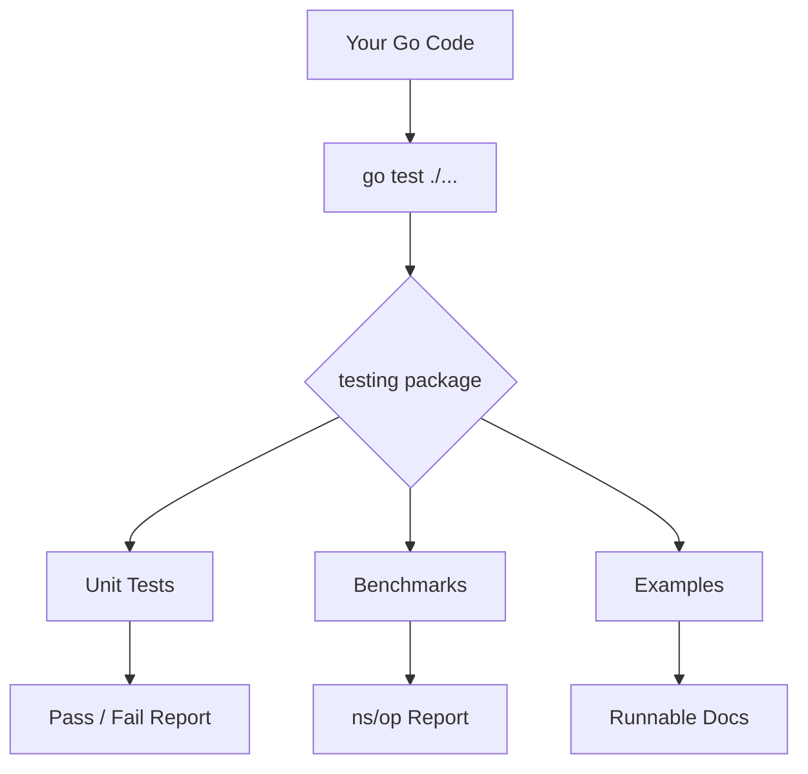
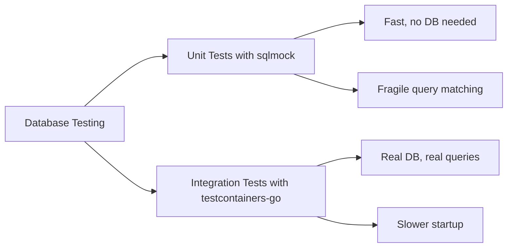
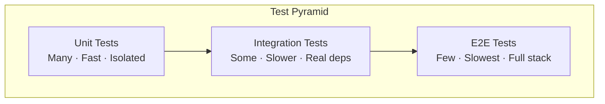
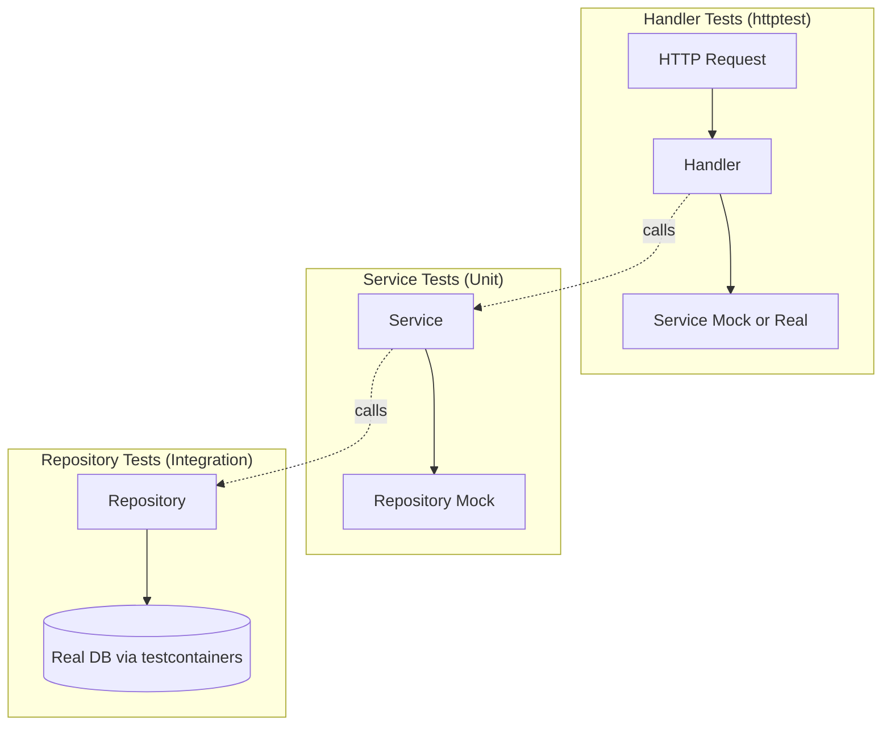

# 09 — Testing in Go

> "If it isn't tested, it's broken." — a rule every Go developer lives by.

Go was designed from day one with testing as a first-class citizen. There is no third-party test runner you must install, no configuration files to wire up. You write a function, you write its test, you run `go test`. That is it.

This chapter walks through every layer of Go testing — from a simple unit test all the way to integration tests against real databases, HTTP handler tests, data race detection, and benchmarks. Every concept comes with a real-world analogy and a full working example.

---

## 🔥 Why Go's Testing Story Is Different

Think of writing tests like building a safety net under a tightrope walker. In most languages, setting up that net requires scaffolding, ropes from five vendors, and a manual. In Go, the net is already built into the platform. You just step onto the wire.

The `testing` package ships with the standard library. The `go test` command ships with the Go toolchain. No `npm install`, no `pip install pytest`, nothing.



---

## 🔥 The `testing` Package — Your Foundation

### The Analogy

A car factory has a quality-control station at the end of every assembly line. The station does not build cars; it only checks them. `func TestXxx(t *testing.T)` is that station. It receives the car (`t`), runs checks, and reports defects.

### The Rules

1. Test files end in `_test.go`.
2. Test functions start with `Test`, followed by a capital letter.
3. They accept exactly one argument: `*testing.T`.
4. They live in the same package (or a `_test` package for black-box testing).

```go
// math_utils.go
package mathutils

func Add(a, b int) int {
    return a + b
}

func Divide(a, b float64) (float64, error) {
    if b == 0 {
        return 0, fmt.Errorf("division by zero")
    }
    return a / b, nil
}
```

```go
// math_utils_test.go
package mathutils

import (
    "testing"
)

func TestAdd(t *testing.T) {
    result := Add(2, 3)
    if result != 5 {
        t.Errorf("Add(2, 3) = %d; want 5", result)
    }
}

func TestDivide_ByZero(t *testing.T) {
    _, err := Divide(10, 0)
    if err == nil {
        t.Fatal("expected an error for division by zero, got nil")
    }
}
```

### Key `*testing.T` Methods

| Method | What It Does | Stops Test? |
|---|---|---|
| `t.Log(...)` | Print a message (only shown with `-v`) | No |
| `t.Error(...)` | Mark test as failed, continue running | No |
| `t.Errorf(...)` | Same as Error but with formatting | No |
| `t.Fatal(...)` | Mark test as failed, stop immediately | Yes |
| `t.Fatalf(...)` | Same as Fatal but with formatting | Yes |
| `t.Skip(...)` | Skip this test with a reason | Yes |
| `t.Helper()` | Mark caller as a helper (cleaner stack traces) | No |

---

## 🔥 Table-Driven Tests — The Go Way

### The Analogy

Imagine a restaurant kitchen testing a new recipe. Instead of cooking one dish and checking it, the head chef lists every ingredient variation in a spreadsheet — spicy version, vegan version, gluten-free version — and runs the same cooking process for each row. That spreadsheet is your test table.

Table-driven tests are idiomatic Go. Every senior Go developer writes them. They eliminate repetition and make it trivial to add new cases.

```go
// math_utils_test.go
package mathutils

import (
    "testing"
)

func TestAdd_TableDriven(t *testing.T) {
    tests := []struct {
        name     string
        a, b     int
        expected int
    }{
        {"positive numbers", 2, 3, 5},
        {"negative numbers", -1, -2, -3},
        {"zero values", 0, 0, 0},
        {"mixed sign", -5, 10, 5},
        {"large numbers", 1000000, 999999, 1999999},
    }

    for _, tc := range tests {
        t.Run(tc.name, func(t *testing.T) {
            result := Add(tc.a, tc.b)
            if result != tc.expected {
                t.Errorf("Add(%d, %d) = %d; want %d", tc.a, tc.b, result, tc.expected)
            }
        })
    }
}
```

---

## 🔥 `t.Run` — Subtests

`t.Run` creates a named subtest. This gives you:
- Individual pass/fail per case in the table.
- The ability to run a single case with `-run`.
- Parallel execution per subtest.

The output with `-v` looks like:

```
=== RUN   TestAdd_TableDriven
=== RUN   TestAdd_TableDriven/positive_numbers
--- PASS: TestAdd_TableDriven/positive_numbers (0.00s)
=== RUN   TestAdd_TableDriven/negative_numbers
--- PASS: TestAdd_TableDriven/negative_numbers (0.00s)
--- PASS: TestAdd_TableDriven (0.00s)
```

Run only one subtest:
```bash
go test -run TestAdd_TableDriven/positive_numbers ./...
```

---

## 🔥 `t.Parallel` — Running Tests in Parallel

### The Analogy

A hospital lab runs dozens of blood tests simultaneously instead of one at a time. Each test is independent. Running them in parallel cuts total time drastically. `t.Parallel()` does the same for your tests.

```go
func TestAdd_Parallel(t *testing.T) {
    tests := []struct {
        name     string
        a, b     int
        expected int
    }{
        {"case one", 1, 2, 3},
        {"case two", 4, 5, 9},
        {"case three", 10, 20, 30},
    }

    for _, tc := range tests {
        tc := tc // capture range variable — critical in Go < 1.22
        t.Run(tc.name, func(t *testing.T) {
            t.Parallel() // this subtest runs in parallel with siblings
            result := Add(tc.a, tc.b)
            if result != tc.expected {
                t.Errorf("got %d; want %d", result, tc.expected)
            }
        })
    }
}
```

> In Go 1.22+, the loop variable capture (`tc := tc`) is no longer needed. In earlier versions it is required to avoid a classic closure bug.

---

## 🔥 `go test` Flags You Must Know

```bash
# Run all tests recursively
go test ./...

# Verbose output (shows each test name and result)
go test -v ./...

# Run only tests matching a regex
go test -run TestAdd ./...

# Run with coverage
go test -cover ./...

# Generate an HTML coverage report
go test -coverprofile=coverage.out ./...
go tool cover -html=coverage.out

# Detect data races
go test -race ./...

# Run benchmarks
go test -bench=. ./...

# Run benchmarks with memory allocation stats
go test -bench=. -benchmem ./...

# Limit test time
go test -timeout 30s ./...
```

### Flag Cheat Sheet

| Flag | Purpose |
|---|---|
| `-v` | Verbose output |
| `-run <regex>` | Filter test names |
| `-cover` | Show coverage percentage |
| `-coverprofile=f` | Write coverage data to file |
| `-race` | Enable race detector |
| `-bench=<regex>` | Run benchmarks |
| `-benchmem` | Show memory allocations in benchmarks |
| `-count=N` | Run each test N times |
| `-timeout=D` | Fail if tests exceed duration |
| `-short` | Signal tests to skip long-running cases |

---

## 🔥 Testify — The Helper Library

The standard library is intentionally minimal. `github.com/stretchr/testify` fills the gaps without taking over.

```bash
go get github.com/stretchr/testify
```

### `assert` vs `require`

| Package | Behaviour on Failure |
|---|---|
| `assert` | Continues test execution |
| `require` | Stops test immediately (calls `t.FailNow()`) |

Use `require` when later steps depend on a prior check passing. Use `assert` when you want to collect multiple failures in one run.

```go
import (
    "testing"
    "github.com/stretchr/testify/assert"
    "github.com/stretchr/testify/require"
)

func TestDivide_WithTestify(t *testing.T) {
    result, err := Divide(10, 2)

    require.NoError(t, err)           // stop if error — nothing else makes sense
    assert.Equal(t, 5.0, result)      // check the value, continue on failure
    assert.InDelta(t, 5.0, result, 0.001) // for floating point comparisons
}

func TestDivide_ByZero_Testify(t *testing.T) {
    _, err := Divide(10, 0)
    require.Error(t, err)
    assert.Contains(t, err.Error(), "division by zero")
}
```

---

## 🔥 HTTP Handler Testing with `httptest`

### The Analogy

When testing a doorbell, you do not need a real house. You wire the button to a test buzzer and press it. `httptest.NewRecorder()` is that test buzzer — it captures what your handler writes without ever touching a real network socket.

### The Setup

```go
// handlers/user_handler.go
package handlers

import (
    "encoding/json"
    "net/http"
)

type User struct {
    ID   int    `json:"id"`
    Name string `json:"name"`
}

func GetUserHandler(w http.ResponseWriter, r *http.Request) {
    user := User{ID: 1, Name: "Alice"}
    w.Header().Set("Content-Type", "application/json")
    w.WriteHeader(http.StatusOK)
    json.NewEncoder(w).Encode(user)
}

func CreateUserHandler(w http.ResponseWriter, r *http.Request) {
    var user User
    if err := json.NewDecoder(r.Body).Decode(&user); err != nil {
        http.Error(w, "bad request", http.StatusBadRequest)
        return
    }
    user.ID = 42
    w.Header().Set("Content-Type", "application/json")
    w.WriteHeader(http.StatusCreated)
    json.NewEncoder(w).Encode(user)
}
```

```go
// handlers/user_handler_test.go
package handlers

import (
    "bytes"
    "encoding/json"
    "net/http"
    "net/http/httptest"
    "testing"

    "github.com/stretchr/testify/assert"
    "github.com/stretchr/testify/require"
)

func TestGetUserHandler(t *testing.T) {
    // Arrange
    req := httptest.NewRequest(http.MethodGet, "/users/1", nil)
    rec := httptest.NewRecorder()

    // Act
    GetUserHandler(rec, req)

    // Assert
    res := rec.Result()
    defer res.Body.Close()

    assert.Equal(t, http.StatusOK, res.StatusCode)
    assert.Equal(t, "application/json", res.Header.Get("Content-Type"))

    var user User
    require.NoError(t, json.NewDecoder(res.Body).Decode(&user))
    assert.Equal(t, 1, user.ID)
    assert.Equal(t, "Alice", user.Name)
}

func TestCreateUserHandler(t *testing.T) {
    // Arrange
    body := `{"name":"Bob"}`
    req := httptest.NewRequest(http.MethodPost, "/users", bytes.NewBufferString(body))
    req.Header.Set("Content-Type", "application/json")
    rec := httptest.NewRecorder()

    // Act
    CreateUserHandler(rec, req)

    // Assert
    res := rec.Result()
    defer res.Body.Close()

    assert.Equal(t, http.StatusCreated, res.StatusCode)

    var user User
    require.NoError(t, json.NewDecoder(res.Body).Decode(&user))
    assert.Equal(t, 42, user.ID)
    assert.Equal(t, "Bob", user.Name)
}

func TestCreateUserHandler_BadJSON(t *testing.T) {
    req := httptest.NewRequest(http.MethodPost, "/users", bytes.NewBufferString("{invalid}"))
    rec := httptest.NewRecorder()

    CreateUserHandler(rec, req)

    assert.Equal(t, http.StatusBadRequest, rec.Code)
}
```

---

## 🔥 Mocking Interfaces — The Right Way

### The Analogy

When training a pilot, you use a flight simulator, not a real airplane. The simulator behaves exactly like an airplane for the purposes of training, but it costs nothing if you crash it. Mocks are flight simulators for your dependencies.

### Define Your Interface First

```go
// repository/user_repository.go
package repository

import "context"

type User struct {
    ID    int
    Name  string
    Email string
}

//go:generate mockery --name=UserRepository --output=../mocks --outpkg=mocks
type UserRepository interface {
    GetByID(ctx context.Context, id int) (*User, error)
    Create(ctx context.Context, user *User) error
    Delete(ctx context.Context, id int) error
}
```

### Generate Mocks with Mockery

```bash
go install github.com/vektra/mockery/v2@latest
go generate ./...
```

Mockery generates a file at `mocks/UserRepository.go` with a full mock implementation. You do not write this by hand.

### The Service Layer (What You Are Actually Testing)

```go
// service/user_service.go
package service

import (
    "context"
    "fmt"

    "myapp/repository"
)

type UserService struct {
    repo repository.UserRepository
}

func NewUserService(repo repository.UserRepository) *UserService {
    return &UserService{repo: repo}
}

func (s *UserService) GetUser(ctx context.Context, id int) (*repository.User, error) {
    if id <= 0 {
        return nil, fmt.Errorf("invalid user id: %d", id)
    }
    return s.repo.GetByID(ctx, id)
}

func (s *UserService) DeleteUser(ctx context.Context, id int) error {
    _, err := s.repo.GetByID(ctx, id)
    if err != nil {
        return fmt.Errorf("user not found: %w", err)
    }
    return s.repo.Delete(ctx, id)
}
```

### Unit Test for the Service Layer (Full Example)

```go
// service/user_service_test.go
package service

import (
    "context"
    "errors"
    "testing"

    "github.com/stretchr/testify/assert"
    "github.com/stretchr/testify/mock"
    "github.com/stretchr/testify/require"

    "myapp/mocks"
    "myapp/repository"
)

func TestUserService_GetUser(t *testing.T) {
    tests := []struct {
        name        string
        userID      int
        mockSetup   func(*mocks.UserRepository)
        expected    *repository.User
        expectError bool
    }{
        {
            name:   "success",
            userID: 1,
            mockSetup: func(m *mocks.UserRepository) {
                m.On("GetByID", mock.Anything, 1).
                    Return(&repository.User{ID: 1, Name: "Alice"}, nil)
            },
            expected:    &repository.User{ID: 1, Name: "Alice"},
            expectError: false,
        },
        {
            name:   "invalid id returns error immediately",
            userID: -1,
            mockSetup: func(m *mocks.UserRepository) {
                // no calls expected — service validates before calling repo
            },
            expected:    nil,
            expectError: true,
        },
        {
            name:   "repository error propagates",
            userID: 99,
            mockSetup: func(m *mocks.UserRepository) {
                m.On("GetByID", mock.Anything, 99).
                    Return(nil, errors.New("database down"))
            },
            expected:    nil,
            expectError: true,
        },
    }

    for _, tc := range tests {
        t.Run(tc.name, func(t *testing.T) {
            mockRepo := mocks.NewUserRepository(t)
            tc.mockSetup(mockRepo)

            svc := NewUserService(mockRepo)
            result, err := svc.GetUser(context.Background(), tc.userID)

            if tc.expectError {
                require.Error(t, err)
                assert.Nil(t, result)
            } else {
                require.NoError(t, err)
                assert.Equal(t, tc.expected, result)
            }

            mockRepo.AssertExpectations(t) // verifies all expected calls were made
        })
    }
}

func TestUserService_DeleteUser_UserNotFound(t *testing.T) {
    mockRepo := mocks.NewUserRepository(t)
    mockRepo.On("GetByID", mock.Anything, 5).
        Return(nil, errors.New("not found"))

    svc := NewUserService(mockRepo)
    err := svc.DeleteUser(context.Background(), 5)

    require.Error(t, err)
    assert.Contains(t, err.Error(), "user not found")
    mockRepo.AssertExpectations(t)
}
```

---

## 🔥 Database Testing Strategies



### Strategy 1 — SQL Mock (`go-sqlmock`)

```bash
go get github.com/DATA-DOG/go-sqlmock
```

```go
// repository/user_repo_test.go
package repository

import (
    "context"
    "testing"

    "github.com/DATA-DOG/go-sqlmock"
    "github.com/stretchr/testify/assert"
    "github.com/stretchr/testify/require"
)

func TestGetUserByID_WithSQLMock(t *testing.T) {
    db, sqlMock, err := sqlmock.New()
    require.NoError(t, err)
    defer db.Close()

    rows := sqlmock.NewRows([]string{"id", "name", "email"}).
        AddRow(1, "Alice", "alice@example.com")

    sqlMock.ExpectQuery("SELECT id, name, email FROM users WHERE id = ?").
        WithArgs(1).
        WillReturnRows(rows)

    repo := NewSQLUserRepository(db)
    user, err := repo.GetByID(context.Background(), 1)

    require.NoError(t, err)
    assert.Equal(t, 1, user.ID)
    assert.Equal(t, "Alice", user.Name)
    require.NoError(t, sqlMock.ExpectationsWereMet())
}
```

### Strategy 2 — Real DB with `testcontainers-go` (Integration Test)

```bash
go get github.com/testcontainers/testcontainers-go
go get github.com/testcontainers/testcontainers-go/modules/postgres
```

```go
// repository/user_repo_integration_test.go
//go:build integration

package repository_test

import (
    "context"
    "testing"

    "github.com/testcontainers/testcontainers-go"
    "github.com/testcontainers/testcontainers-go/modules/postgres"
    "github.com/testcontainers/testcontainers-go/wait"
    "github.com/stretchr/testify/assert"
    "github.com/stretchr/testify/require"
    _ "github.com/lib/pq"
    "database/sql"
)

func TestGetUserByID_Integration(t *testing.T) {
    ctx := context.Background()

    // Spin up a real Postgres container
    pgContainer, err := postgres.RunContainer(ctx,
        testcontainers.WithImage("postgres:15"),
        postgres.WithDatabase("testdb"),
        postgres.WithUsername("testuser"),
        postgres.WithPassword("testpass"),
        testcontainers.WithWaitStrategy(
            wait.ForLog("database system is ready to accept connections").
                WithOccurrence(2),
        ),
    )
    require.NoError(t, err)
    defer pgContainer.Terminate(ctx)

    connStr, err := pgContainer.ConnectionString(ctx, "sslmode=disable")
    require.NoError(t, err)

    db, err := sql.Open("postgres", connStr)
    require.NoError(t, err)
    defer db.Close()

    // Run migrations / seed data
    _, err = db.ExecContext(ctx, `
        CREATE TABLE users (
            id SERIAL PRIMARY KEY,
            name TEXT NOT NULL,
            email TEXT NOT NULL
        );
        INSERT INTO users (name, email) VALUES ('Alice', 'alice@example.com');
    `)
    require.NoError(t, err)

    repo := NewSQLUserRepository(db)
    user, err := repo.GetByID(ctx, 1)

    require.NoError(t, err)
    assert.Equal(t, "Alice", user.Name)
}
```

Run integration tests separately:
```bash
go test -tags=integration ./...
```

### When to Use Each Strategy

| Situation | Use sqlmock | Use testcontainers |
|---|---|---|
| Unit testing query logic | Yes | No |
| Testing transaction behaviour | Possible | Better |
| Testing DB-specific features (JSON, arrays) | No | Yes |
| CI pipeline with Docker | Optional | Yes |
| Offline / no Docker available | Yes | No |
| Confident your queries are correct | No | Yes |

---

## 🔥 Unit Tests vs Integration Tests



| Property | Unit Test | Integration Test |
|---|---|---|
| Speed | Milliseconds | Seconds to minutes |
| Dependencies | Mocked | Real (DB, API, queue) |
| Feedback loop | Instant | Slower |
| Confidence | Logic only | Full flow |
| Brittleness | Low | Medium |
| Where to run | Every commit | CI pipeline |

**When to write unit tests:** Testing business logic, validation, calculations, transformations — anything that does not touch external systems.

**When to write integration tests:** Testing that your code works with a real database, a real HTTP client, or a real message queue.

---

## 🔥 Benchmarks — Measuring Performance

### The Analogy

A race car team does not just drive around and hope the car is fast. They put it on a dynamometer and measure horsepower precisely. Benchmarks are your dynamometer.

```go
// math_utils_test.go

func BenchmarkAdd(b *testing.B) {
    for i := 0; i < b.N; i++ {
        Add(100, 200)
    }
}

func BenchmarkDivide(b *testing.B) {
    for i := 0; i < b.N; i++ {
        Divide(1000.0, 3.14159)
    }
}
```

Run benchmarks:
```bash
go test -bench=. -benchmem ./...
```

Output:
```
BenchmarkAdd-8           1000000000           0.31 ns/op          0 B/op    0 allocs/op
BenchmarkDivide-8        500000000            2.1  ns/op          0 B/op    0 allocs/op
```

- `BenchmarkAdd-8` — name, `-8` means 8 CPU cores
- `1000000000` — how many times `b.N` was run
- `0.31 ns/op` — nanoseconds per operation
- `0 B/op` — bytes allocated per operation
- `0 allocs/op` — heap allocations per operation

### Resetting the Timer

If your benchmark has expensive setup, reset the timer before the loop:

```go
func BenchmarkWithSetup(b *testing.B) {
    data := generateLargeSlice() // expensive setup
    b.ResetTimer()               // start timing from here

    for i := 0; i < b.N; i++ {
        processSlice(data)
    }
}
```

---

## 🔥 The Race Detector — `go test -race`

### The Analogy

Two people simultaneously editing the same Google Doc without seeing each other's cursor. One person writes "Hello", the other deletes the same word at the same time. The document ends up corrupted. In concurrent code, this is a data race. The race detector is a supervisor who watches all cursors simultaneously and screams when two people touch the same word at the same moment.

```go
// counter.go — intentionally buggy
package counter

import "sync"

type Counter struct {
    mu    sync.Mutex
    value int
}

func (c *Counter) Increment() {
    // BUG: forgot the mutex — this is a data race
    c.value++
}

func (c *Counter) Value() int {
    return c.value
}
```

```go
// counter_test.go
package counter

import (
    "sync"
    "testing"
)

func TestCounter_Race(t *testing.T) {
    c := &Counter{}
    var wg sync.WaitGroup

    for i := 0; i < 100; i++ {
        wg.Add(1)
        go func() {
            defer wg.Done()
            c.Increment()
        }()
    }
    wg.Wait()
}
```

```bash
go test -race ./...
```

Output when a race is found:
```
==================
WARNING: DATA RACE
Write at 0x00c0000b4010 by goroutine 8:
  counter.(*Counter).Increment()
      counter.go:12 +0x3c

Previous write at 0x00c0000b4010 by goroutine 7:
  counter.(*Counter).Increment()
      counter.go:12 +0x3c
==================
```

The fix:
```go
func (c *Counter) Increment() {
    c.mu.Lock()
    defer c.mu.Unlock()
    c.value++
}
```

**Always run `go test -race` in CI.** It has a small performance cost but catches bugs that cause silent data corruption in production.

---

## 🔥 Golden Files — Testing Complex Output

### The Analogy

When printing banknotes, the mint keeps a reference print — the "golden copy". Every new print is compared to it. If they match, it passes. Golden files work the same way: you capture expected output once, save it, and every future test run compares against the saved file.

Golden files are ideal for:
- Generated code
- JSON/XML API responses
- SQL output
- HTML rendering
- Any large, complex string output

```go
// golden_test.go
package render

import (
    "os"
    "path/filepath"
    "testing"

    "github.com/stretchr/testify/assert"
    "github.com/stretchr/testify/require"
)

var update = os.Getenv("UPDATE_GOLDEN") == "true"

func TestRenderUserCard(t *testing.T) {
    user := User{ID: 1, Name: "Alice", Email: "alice@example.com"}
    got := RenderUserCard(user) // returns a JSON/HTML string

    goldenPath := filepath.Join("testdata", "user_card.golden")

    if update {
        // Run with UPDATE_GOLDEN=true to regenerate golden files
        require.NoError(t, os.MkdirAll("testdata", 0755))
        require.NoError(t, os.WriteFile(goldenPath, []byte(got), 0644))
        t.Logf("golden file updated: %s", goldenPath)
        return
    }

    expected, err := os.ReadFile(goldenPath)
    require.NoError(t, err, "golden file missing — run with UPDATE_GOLDEN=true to create it")
    assert.Equal(t, string(expected), got)
}
```

Workflow:
```bash
# First run — create the golden file
UPDATE_GOLDEN=true go test -run TestRenderUserCard ./...

# All future runs — compare against golden file
go test -run TestRenderUserCard ./...
```

---

## 🔥 Coverage Reports

```bash
# Show coverage percentage per package
go test -cover ./...

# Write detailed coverage profile
go test -coverprofile=coverage.out ./...

# View in terminal (per function)
go tool cover -func=coverage.out

# View in browser (color-coded source)
go tool cover -html=coverage.out
```

The browser view highlights:
- **Green** — covered by tests
- **Red** — not covered

### What Coverage Does Not Tell You

Coverage tells you which lines were executed, not whether they were tested correctly. 100% coverage with bad assertions is still bad testing. Aim for meaningful coverage, not 100% coverage for its own sake.

| Coverage % | Interpretation |
|---|---|
| < 50% | Large gaps — add tests for critical paths |
| 50–70% | Decent — focus on error paths and edge cases |
| 70–85% | Good — cover remaining business logic |
| > 85% | Excellent — avoid chasing trivial lines |

---

## 🔥 Full Integration Test — HTTP Handler with Mock Repository

This example ties everything together: an HTTP handler test that uses a mock repository, checks status codes, and validates the JSON response.

```go
// handlers/user_handler_integration_test.go
package handlers_test

import (
    "context"
    "encoding/json"
    "net/http"
    "net/http/httptest"
    "testing"

    "github.com/stretchr/testify/assert"
    "github.com/stretchr/testify/mock"
    "github.com/stretchr/testify/require"

    "myapp/handlers"
    "myapp/mocks"
    "myapp/repository"
    "myapp/service"
)

func TestGetUserEndpoint_Full(t *testing.T) {
    tests := []struct {
        name           string
        userID         string
        mockSetup      func(*mocks.UserRepository)
        expectedStatus int
        expectedName   string
    }{
        {
            name:   "returns user when found",
            userID: "1",
            mockSetup: func(m *mocks.UserRepository) {
                m.On("GetByID", mock.Anything, 1).
                    Return(&repository.User{ID: 1, Name: "Alice"}, nil)
            },
            expectedStatus: http.StatusOK,
            expectedName:   "Alice",
        },
        {
            name:   "returns 404 when user not found",
            userID: "999",
            mockSetup: func(m *mocks.UserRepository) {
                m.On("GetByID", mock.Anything, 999).
                    Return(nil, repository.ErrNotFound)
            },
            expectedStatus: http.StatusNotFound,
        },
        {
            name:           "returns 400 for invalid id",
            userID:         "abc",
            mockSetup:      func(m *mocks.UserRepository) {},
            expectedStatus: http.StatusBadRequest,
        },
    }

    for _, tc := range tests {
        t.Run(tc.name, func(t *testing.T) {
            mockRepo := mocks.NewUserRepository(t)
            tc.mockSetup(mockRepo)

            svc := service.NewUserService(mockRepo)
            handler := handlers.NewUserHandler(svc)

            req := httptest.NewRequest(http.MethodGet, "/users/"+tc.userID, nil)
            rec := httptest.NewRecorder()

            handler.GetUser(rec, req)

            res := rec.Result()
            defer res.Body.Close()

            assert.Equal(t, tc.expectedStatus, res.StatusCode)

            if tc.expectedName != "" {
                var user repository.User
                require.NoError(t, json.NewDecoder(res.Body).Decode(&user))
                assert.Equal(t, tc.expectedName, user.Name)
            }

            mockRepo.AssertExpectations(t)
        })
    }
}
```

---

## 🔥 Testing Architecture — How the Layers Connect



---

## 🔥 When to Use / When NOT to Use

### Unit Tests
**Use when:** Testing pure business logic, validation, transformation, calculation.
**Do not use when:** Verifying the actual SQL your ORM generates, or that your HTTP client handles timeouts correctly.

### Integration Tests
**Use when:** Verifying database queries work, checking end-to-end HTTP flows, ensuring message queue consumers behave correctly.
**Do not use when:** Running on every keystroke — they are slow. Gate them behind a build tag or run only in CI.

### Mocks
**Use when:** Your code depends on an external service that is unavailable, slow, or has side effects (sending emails, charging credit cards).
**Do not use when:** You can use a real lightweight dependency (like an in-memory SQLite or a local Redis container) — real beats fake.

### Benchmarks
**Use when:** You suspect a performance problem and need data, or you want to guard against performance regressions.
**Do not use when:** You have not profiled first. Do not optimise what you have not measured.

### Race Detector
**Use:** Always, in CI. No exceptions for concurrent code.
**Do not skip:** The performance overhead is about 5–10x, which is fine for tests.

### Golden Files
**Use when:** The output is large (hundreds of lines), complex (nested JSON), or visual (HTML templates).
**Do not use when:** The output is a simple value — just assert directly.

---

## 🔥 Key Takeaways

1. **Testing is built in.** `go test` and the `testing` package need no external installation.

2. **Table-driven tests are the Go idiom.** Use a slice of structs with `t.Run` inside. Every senior Go developer expects to see this pattern.

3. **`t.Parallel()` speeds up long test suites.** Use it inside subtests for independent cases.

4. **`assert` continues, `require` stops.** Always use `require` when the next line depends on the previous check passing.

5. **`httptest.NewRecorder` + `httptest.NewRequest` are all you need** to test HTTP handlers without a real server.

6. **Mock at the interface boundary.** Define interfaces, generate mocks with `mockery`, test your service logic without touching the database.

7. **`go test -race` is mandatory** for any code with goroutines. Run it in CI. It finds bugs that unit tests miss entirely.

8. **testcontainers-go gives you real databases in tests.** Use it for integration tests where sqlmock's query matching becomes fragile.

9. **Coverage is a tool, not a goal.** 70–85% meaningful coverage beats 100% superficial coverage.

10. **Golden files handle complex output.** Regenerate them when the output intentionally changes. Commit them to version control.

---

*Next chapter: Concurrency Patterns in Go — goroutines, channels, sync primitives, and common patterns like worker pools and fan-out.*
