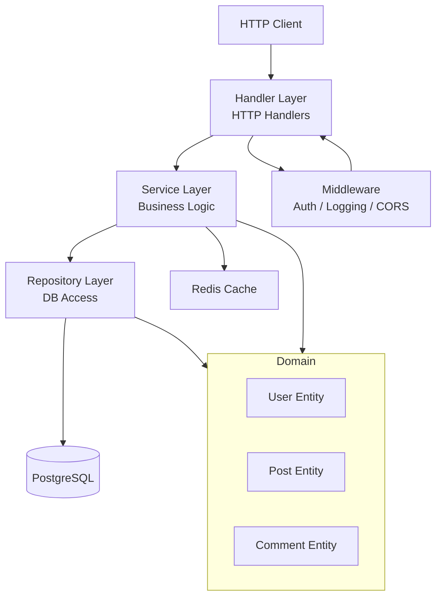
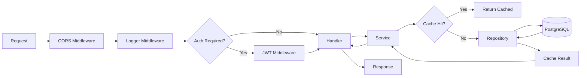
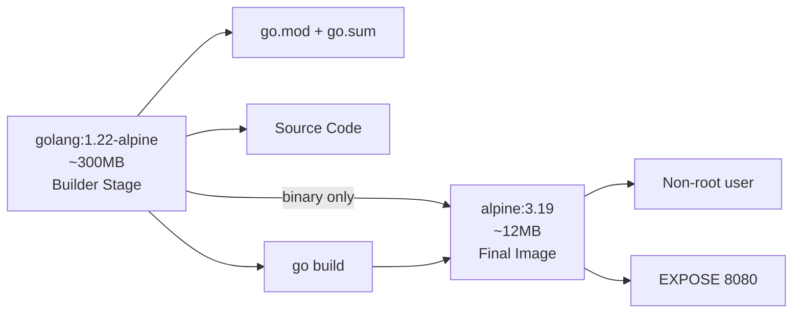
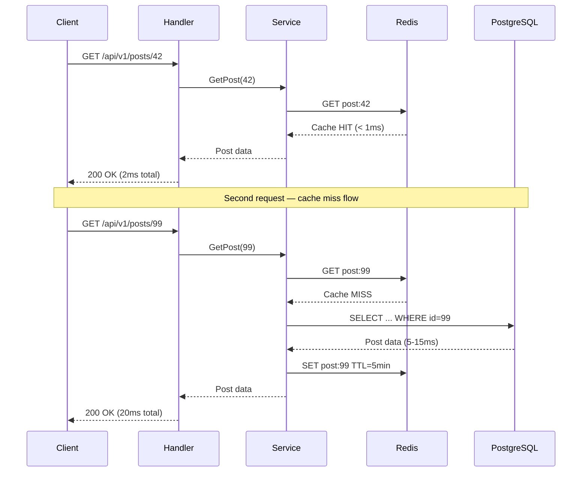

# Building a Production-Ready REST API in Go

## 🏗️ What Are We Building?

Think of this chapter as building a real restaurant. You need a kitchen (business logic), a menu (API endpoints), waiters (handlers), a pantry (database), and a refrigerator for quick access to popular items (cache). Everything works together. If one piece breaks, customers notice.

We are going to build a full **Blog Platform API** — users can register, write posts, and comment. We will use:

- **Go** for the server
- **PostgreSQL** for persistent storage
- **Redis** for caching hot data
- **JWT** for authentication
- **Docker** to package everything
- **Clean Architecture** so the codebase stays maintainable as it grows

By the end of this chapter you will have a runnable, production-grade API that you can deploy today.

---

## 🗺️ Project Architecture Overview

Real-world analogy: Think of Clean Architecture like a city. The **domain** is city hall — it holds the laws (business rules). The **repository** is the post office — it knows how to store and retrieve things. The **service** is the city council — it makes decisions using the laws. The **handler** is the front desk — it talks to citizens (HTTP clients).





---

## 📁 Project Structure

```
blog-api/
├── cmd/
│   └── api/
│       └── main.go
├── internal/
│   ├── domain/
│   │   ├── user.go
│   │   ├── post.go
│   │   └── comment.go
│   ├── repository/
│   │   ├── user_repository.go
│   │   ├── post_repository.go
│   │   └── comment_repository.go
│   ├── service/
│   │   ├── user_service.go
│   │   └── post_service.go
│   ├── handler/
│   │   ├── user_handler.go
│   │   └── post_handler.go
│   └── middleware/
│       ├── auth.go
│       ├── logger.go
│       └── cors.go
├── pkg/
│   ├── config/
│   │   └── config.go
│   ├── database/
│   │   └── postgres.go
│   ├── cache/
│   │   └── redis.go
│   └── jwt/
│       └── jwt.go
├── migrations/
│   ├── 001_create_users.sql
│   ├── 002_create_posts.sql
│   └── 003_create_comments.sql
├── .env
├── Dockerfile
└── docker-compose.yml
```

---

## 🧱 Step 1 — Domain Entities

Analogy: Entities are like the blueprints for a building. Before you build anything, you define what a "user" or "post" looks like. Everyone on your team agrees on this blueprint first.

**`internal/domain/user.go`**
```go
package domain

import "time"

// User represents a registered user in our system.
// This is pure Go — no database tags, no HTTP concerns.
type User struct {
    ID           int64     `json:"id"`
    Username     string    `json:"username"`
    Email        string    `json:"email"`
    PasswordHash string    `json:"-"` // Never send password in JSON
    CreatedAt    time.Time `json:"created_at"`
    UpdatedAt    time.Time `json:"updated_at"`
}

// UserRepository defines what operations we need on users.
// This is an interface — the actual DB code lives in /repository.
type UserRepository interface {
    Create(user *User) error
    FindByID(id int64) (*User, error)
    FindByEmail(email string) (*User, error)
    FindByUsername(username string) (*User, error)
}

// UserService defines the business operations available.
type UserService interface {
    Register(username, email, password string) (*User, error)
    Login(email, password string) (string, error) // returns JWT token
    GetProfile(id int64) (*User, error)
}
```

**`internal/domain/post.go`**
```go
package domain

import "time"

type Post struct {
    ID        int64     `json:"id"`
    UserID    int64     `json:"user_id"`
    Title     string    `json:"title"`
    Content   string    `json:"content"`
    Published bool      `json:"published"`
    CreatedAt time.Time `json:"created_at"`
    UpdatedAt time.Time `json:"updated_at"`
    Author    *User     `json:"author,omitempty"`
}

// PostFilter is used for paginated queries.
type PostFilter struct {
    Page     int
    PageSize int
    UserID   int64
}

type PostRepository interface {
    Create(post *Post) error
    FindByID(id int64) (*Post, error)
    FindAll(filter PostFilter) ([]*Post, int64, error) // posts, total count, error
    Update(post *Post) error
    Delete(id int64) error
}

type PostService interface {
    CreatePost(userID int64, title, content string) (*Post, error)
    GetPost(id int64) (*Post, error)
    ListPosts(filter PostFilter) ([]*Post, int64, error)
    UpdatePost(id, userID int64, title, content string) (*Post, error)
    DeletePost(id, userID int64) error
}
```

**`internal/domain/comment.go`**
```go
package domain

import "time"

type Comment struct {
    ID        int64     `json:"id"`
    PostID    int64     `json:"post_id"`
    UserID    int64     `json:"user_id"`
    Content   string    `json:"content"`
    CreatedAt time.Time `json:"created_at"`
    Author    *User     `json:"author,omitempty"`
}

type CommentRepository interface {
    Create(comment *Comment) error
    FindByPostID(postID int64) ([]*Comment, error)
    Delete(id, userID int64) error
}
```

---

## ⚙️ Step 2 — Configuration

Analogy: Config is like the settings panel on your phone. You don't hard-code your WiFi password into your phone's hardware. You store it somewhere that can be changed. Same idea here.

**`pkg/config/config.go`**
```go
package config

import (
    "log"
    "os"
    "strconv"
)

type Config struct {
    // Server
    Port string

    // Database
    DBHost     string
    DBPort     string
    DBUser     string
    DBPassword string
    DBName     string

    // Redis
    RedisAddr     string
    RedisPassword string

    // JWT
    JWTSecret string
    JWTExpiry int // hours

    // App
    Environment string
}

func Load() *Config {
    return &Config{
        Port:          getEnv("PORT", "8080"),
        DBHost:        getEnv("DB_HOST", "localhost"),
        DBPort:        getEnv("DB_PORT", "5432"),
        DBUser:        getEnv("DB_USER", "postgres"),
        DBPassword:    mustGetEnv("DB_PASSWORD"),
        DBName:        getEnv("DB_NAME", "blogdb"),
        RedisAddr:     getEnv("REDIS_ADDR", "localhost:6379"),
        RedisPassword: getEnv("REDIS_PASSWORD", ""),
        JWTSecret:     mustGetEnv("JWT_SECRET"),
        JWTExpiry:     getEnvAsInt("JWT_EXPIRY_HOURS", 24),
        Environment:   getEnv("ENVIRONMENT", "development"),
    }
}

func getEnv(key, fallback string) string {
    if v := os.Getenv(key); v != "" {
        return v
    }
    return fallback
}

func mustGetEnv(key string) string {
    v := os.Getenv(key)
    if v == "" {
        log.Fatalf("required environment variable %s is not set", key)
    }
    return v
}

func getEnvAsInt(key string, fallback int) int {
    if v := os.Getenv(key); v != "" {
        if i, err := strconv.Atoi(v); err == nil {
            return i
        }
    }
    return fallback
}
```

**`.env`**
```env
PORT=8080
DB_HOST=postgres
DB_PORT=5432
DB_USER=postgres
DB_PASSWORD=supersecretpassword
DB_NAME=blogdb
REDIS_ADDR=redis:6379
REDIS_PASSWORD=
JWT_SECRET=your-256-bit-secret-change-this-in-production
JWT_EXPIRY_HOURS=24
ENVIRONMENT=development
```

---

## 🗄️ Step 3 — Database Setup

Analogy: The database package is like a receptionist for a filing cabinet. You don't open the cabinet directly — you go through the receptionist who manages connections, retries, and health checks.

**`pkg/database/postgres.go`**
```go
package database

import (
    "database/sql"
    "fmt"
    "time"

    _ "github.com/lib/pq" // PostgreSQL driver
)

type DBConfig struct {
    Host     string
    Port     string
    User     string
    Password string
    Name     string
}

func NewPostgresDB(cfg DBConfig) (*sql.DB, error) {
    dsn := fmt.Sprintf(
        "host=%s port=%s user=%s password=%s dbname=%s sslmode=disable",
        cfg.Host, cfg.Port, cfg.User, cfg.Password, cfg.Name,
    )

    db, err := sql.Open("postgres", dsn)
    if err != nil {
        return nil, fmt.Errorf("failed to open database: %w", err)
    }

    // Connection pool settings — tune these for your load
    db.SetMaxOpenConns(25)
    db.SetMaxIdleConns(25)
    db.SetConnMaxLifetime(5 * time.Minute)

    // Verify the connection is actually working
    if err := db.Ping(); err != nil {
        return nil, fmt.Errorf("failed to ping database: %w", err)
    }

    return db, nil
}
```

**`pkg/cache/redis.go`**
```go
package cache

import (
    "context"
    "encoding/json"
    "fmt"
    "time"

    "github.com/redis/go-redis/v9"
)

type Cache struct {
    client *redis.Client
}

func NewRedisCache(addr, password string) (*Cache, error) {
    client := redis.NewClient(&redis.Options{
        Addr:     addr,
        Password: password,
        DB:       0,
    })

    ctx, cancel := context.WithTimeout(context.Background(), 5*time.Second)
    defer cancel()

    if err := client.Ping(ctx).Err(); err != nil {
        return nil, fmt.Errorf("failed to connect to redis: %w", err)
    }

    return &Cache{client: client}, nil
}

func (c *Cache) Set(ctx context.Context, key string, value any, ttl time.Duration) error {
    data, err := json.Marshal(value)
    if err != nil {
        return fmt.Errorf("failed to marshal cache value: %w", err)
    }
    return c.client.Set(ctx, key, data, ttl).Err()
}

func (c *Cache) Get(ctx context.Context, key string, dest any) error {
    data, err := c.client.Get(ctx, key).Bytes()
    if err != nil {
        return err // redis.Nil means cache miss
    }
    return json.Unmarshal(data, dest)
}

func (c *Cache) Delete(ctx context.Context, key string) error {
    return c.client.Del(ctx, key).Err()
}
```

---

## 🔐 Step 4 — JWT Utility

Analogy: JWT is like a concert wristband. The bouncer stamps your wrist when you pay. After that, you can go in and out without showing your ticket again. The wristband has your info baked in and expires.

**`pkg/jwt/jwt.go`**
```go
package jwt

import (
    "errors"
    "fmt"
    "time"

    "github.com/golang-jwt/jwt/v5"
)

type Claims struct {
    UserID int64  `json:"user_id"`
    Email  string `json:"email"`
    jwt.RegisteredClaims
}

type JWT struct {
    secret []byte
    expiry time.Duration
}

func New(secret string, expiryHours int) *JWT {
    return &JWT{
        secret: []byte(secret),
        expiry: time.Duration(expiryHours) * time.Hour,
    }
}

func (j *JWT) Generate(userID int64, email string) (string, error) {
    claims := Claims{
        UserID: userID,
        Email:  email,
        RegisteredClaims: jwt.RegisteredClaims{
            ExpiresAt: jwt.NewNumericDate(time.Now().Add(j.expiry)),
            IssuedAt:  jwt.NewNumericDate(time.Now()),
        },
    }

    token := jwt.NewWithClaims(jwt.SigningMethodHS256, claims)
    signed, err := token.SignedString(j.secret)
    if err != nil {
        return "", fmt.Errorf("failed to sign token: %w", err)
    }
    return signed, nil
}

func (j *JWT) Validate(tokenString string) (*Claims, error) {
    token, err := jwt.ParseWithClaims(tokenString, &Claims{}, func(token *jwt.Token) (any, error) {
        if _, ok := token.Method.(*jwt.SigningMethodHMAC); !ok {
            return nil, fmt.Errorf("unexpected signing method: %v", token.Header["alg"])
        }
        return j.secret, nil
    })

    if err != nil {
        return nil, fmt.Errorf("invalid token: %w", err)
    }

    claims, ok := token.Claims.(*Claims)
    if !ok || !token.Valid {
        return nil, errors.New("invalid token claims")
    }

    return claims, nil
}
```

---

## 🗃️ Step 5 — Database Migrations

Analogy: Migrations are like Git commits for your database schema. You never alter the database directly. You write a new migration file that describes the change. This way, every environment (dev, staging, prod) can get to the same state.

**`migrations/001_create_users.sql`**
```sql
CREATE TABLE IF NOT EXISTS users (
    id         BIGSERIAL PRIMARY KEY,
    username   VARCHAR(50)  UNIQUE NOT NULL,
    email      VARCHAR(255) UNIQUE NOT NULL,
    password_hash VARCHAR(255) NOT NULL,
    created_at TIMESTAMPTZ NOT NULL DEFAULT NOW(),
    updated_at TIMESTAMPTZ NOT NULL DEFAULT NOW()
);

CREATE INDEX idx_users_email ON users(email);
CREATE INDEX idx_users_username ON users(username);
```

**`migrations/002_create_posts.sql`**
```sql
CREATE TABLE IF NOT EXISTS posts (
    id         BIGSERIAL PRIMARY KEY,
    user_id    BIGINT NOT NULL REFERENCES users(id) ON DELETE CASCADE,
    title      VARCHAR(500) NOT NULL,
    content    TEXT NOT NULL,
    published  BOOLEAN NOT NULL DEFAULT FALSE,
    created_at TIMESTAMPTZ NOT NULL DEFAULT NOW(),
    updated_at TIMESTAMPTZ NOT NULL DEFAULT NOW()
);

CREATE INDEX idx_posts_user_id ON posts(user_id);
CREATE INDEX idx_posts_published ON posts(published);
-- Full-text search index for title
CREATE INDEX idx_posts_title ON posts USING gin(to_tsvector('english', title));
```

**`migrations/003_create_comments.sql`**
```sql
CREATE TABLE IF NOT EXISTS comments (
    id         BIGSERIAL PRIMARY KEY,
    post_id    BIGINT NOT NULL REFERENCES posts(id) ON DELETE CASCADE,
    user_id    BIGINT NOT NULL REFERENCES users(id) ON DELETE CASCADE,
    content    TEXT NOT NULL,
    created_at TIMESTAMPTZ NOT NULL DEFAULT NOW()
);

CREATE INDEX idx_comments_post_id ON comments(post_id);
```

---

## 🏪 Step 6 — Repository Layer

Analogy: The repository is like a librarian. You say "give me the post with ID 42." The librarian goes to the shelf, retrieves it, and hands it back. You never go digging through the shelves yourself.

**`internal/repository/user_repository.go`**
```go
package repository

import (
    "database/sql"
    "errors"
    "fmt"

    "blog-api/internal/domain"
)

type userRepository struct {
    db *sql.DB
}

func NewUserRepository(db *sql.DB) domain.UserRepository {
    return &userRepository{db: db}
}

func (r *userRepository) Create(user *domain.User) error {
    query := `
        INSERT INTO users (username, email, password_hash, created_at, updated_at)
        VALUES ($1, $2, $3, NOW(), NOW())
        RETURNING id, created_at, updated_at
    `
    return r.db.QueryRow(query, user.Username, user.Email, user.PasswordHash).
        Scan(&user.ID, &user.CreatedAt, &user.UpdatedAt)
}

func (r *userRepository) FindByID(id int64) (*domain.User, error) {
    user := &domain.User{}
    query := `
        SELECT id, username, email, password_hash, created_at, updated_at
        FROM users WHERE id = $1
    `
    err := r.db.QueryRow(query, id).Scan(
        &user.ID, &user.Username, &user.Email,
        &user.PasswordHash, &user.CreatedAt, &user.UpdatedAt,
    )
    if errors.Is(err, sql.ErrNoRows) {
        return nil, fmt.Errorf("user not found")
    }
    return user, err
}

func (r *userRepository) FindByEmail(email string) (*domain.User, error) {
    user := &domain.User{}
    query := `
        SELECT id, username, email, password_hash, created_at, updated_at
        FROM users WHERE email = $1
    `
    err := r.db.QueryRow(query, email).Scan(
        &user.ID, &user.Username, &user.Email,
        &user.PasswordHash, &user.CreatedAt, &user.UpdatedAt,
    )
    if errors.Is(err, sql.ErrNoRows) {
        return nil, fmt.Errorf("user not found")
    }
    return user, err
}

func (r *userRepository) FindByUsername(username string) (*domain.User, error) {
    user := &domain.User{}
    query := `SELECT id, username, email, created_at FROM users WHERE username = $1`
    err := r.db.QueryRow(query, username).Scan(
        &user.ID, &user.Username, &user.Email, &user.CreatedAt,
    )
    if errors.Is(err, sql.ErrNoRows) {
        return nil, fmt.Errorf("user not found")
    }
    return user, err
}
```

**`internal/repository/post_repository.go`**
```go
package repository

import (
    "database/sql"
    "errors"
    "fmt"

    "blog-api/internal/domain"
)

type postRepository struct {
    db *sql.DB
}

func NewPostRepository(db *sql.DB) domain.PostRepository {
    return &postRepository{db: db}
}

func (r *postRepository) Create(post *domain.Post) error {
    query := `
        INSERT INTO posts (user_id, title, content, published, created_at, updated_at)
        VALUES ($1, $2, $3, $4, NOW(), NOW())
        RETURNING id, created_at, updated_at
    `
    return r.db.QueryRow(query, post.UserID, post.Title, post.Content, post.Published).
        Scan(&post.ID, &post.CreatedAt, &post.UpdatedAt)
}

func (r *postRepository) FindByID(id int64) (*domain.Post, error) {
    post := &domain.Post{Author: &domain.User{}}
    query := `
        SELECT p.id, p.user_id, p.title, p.content, p.published, p.created_at, p.updated_at,
               u.id, u.username, u.email
        FROM posts p
        JOIN users u ON p.user_id = u.id
        WHERE p.id = $1
    `
    err := r.db.QueryRow(query, id).Scan(
        &post.ID, &post.UserID, &post.Title, &post.Content,
        &post.Published, &post.CreatedAt, &post.UpdatedAt,
        &post.Author.ID, &post.Author.Username, &post.Author.Email,
    )
    if errors.Is(err, sql.ErrNoRows) {
        return nil, fmt.Errorf("post not found")
    }
    return post, err
}

func (r *postRepository) FindAll(filter domain.PostFilter) ([]*domain.Post, int64, error) {
    offset := (filter.Page - 1) * filter.PageSize

    // Count total matching posts
    var total int64
    countQuery := `SELECT COUNT(*) FROM posts p WHERE p.published = true`
    args := []any{}
    if filter.UserID > 0 {
        countQuery += ` AND p.user_id = $1`
        args = append(args, filter.UserID)
    }
    if err := r.db.QueryRow(countQuery, args...).Scan(&total); err != nil {
        return nil, 0, err
    }

    // Fetch page of posts
    listQuery := `
        SELECT p.id, p.user_id, p.title, p.content, p.published, p.created_at, p.updated_at,
               u.id, u.username, u.email
        FROM posts p
        JOIN users u ON p.user_id = u.id
        WHERE p.published = true
    `
    listArgs := []any{}
    argIdx := 1
    if filter.UserID > 0 {
        listQuery += fmt.Sprintf(` AND p.user_id = $%d`, argIdx)
        listArgs = append(listArgs, filter.UserID)
        argIdx++
    }
    listQuery += fmt.Sprintf(` ORDER BY p.created_at DESC LIMIT $%d OFFSET $%d`, argIdx, argIdx+1)
    listArgs = append(listArgs, filter.PageSize, offset)

    rows, err := r.db.Query(listQuery, listArgs...)
    if err != nil {
        return nil, 0, err
    }
    defer rows.Close()

    var posts []*domain.Post
    for rows.Next() {
        post := &domain.Post{Author: &domain.User{}}
        if err := rows.Scan(
            &post.ID, &post.UserID, &post.Title, &post.Content,
            &post.Published, &post.CreatedAt, &post.UpdatedAt,
            &post.Author.ID, &post.Author.Username, &post.Author.Email,
        ); err != nil {
            return nil, 0, err
        }
        posts = append(posts, post)
    }

    return posts, total, rows.Err()
}

func (r *postRepository) Update(post *domain.Post) error {
    query := `
        UPDATE posts SET title = $1, content = $2, published = $3, updated_at = NOW()
        WHERE id = $4 AND user_id = $5
        RETURNING updated_at
    `
    return r.db.QueryRow(query, post.Title, post.Content, post.Published, post.ID, post.UserID).
        Scan(&post.UpdatedAt)
}

func (r *postRepository) Delete(id int64) error {
    _, err := r.db.Exec(`DELETE FROM posts WHERE id = $1`, id)
    return err
}
```

---

## 🧠 Step 7 — Service Layer (Business Logic)

Analogy: The service layer is the brain. The repository knows how to fetch data. The handler knows how to talk HTTP. The service knows what the business actually requires — password hashing, ownership checks, cache invalidation.

**`internal/service/user_service.go`**
```go
package service

import (
    "fmt"

    "blog-api/internal/domain"
    "blog-api/pkg/jwt"

    "golang.org/x/crypto/bcrypt"
)

type userService struct {
    repo domain.UserRepository
    jwt  *jwt.JWT
}

func NewUserService(repo domain.UserRepository, jwt *jwt.JWT) domain.UserService {
    return &userService{repo: repo, jwt: jwt}
}

func (s *userService) Register(username, email, password string) (*domain.User, error) {
    // Validate inputs
    if len(password) < 8 {
        return nil, fmt.Errorf("password must be at least 8 characters")
    }
    if username == "" || email == "" {
        return nil, fmt.Errorf("username and email are required")
    }

    // Hash the password — never store plaintext
    hash, err := bcrypt.GenerateFromPassword([]byte(password), bcrypt.DefaultCost)
    if err != nil {
        return nil, fmt.Errorf("failed to hash password: %w", err)
    }

    user := &domain.User{
        Username:     username,
        Email:        email,
        PasswordHash: string(hash),
    }

    if err := s.repo.Create(user); err != nil {
        return nil, fmt.Errorf("failed to create user: %w", err)
    }

    return user, nil
}

func (s *userService) Login(email, password string) (string, error) {
    user, err := s.repo.FindByEmail(email)
    if err != nil {
        // Do NOT reveal whether email exists — security best practice
        return "", fmt.Errorf("invalid email or password")
    }

    if err := bcrypt.CompareHashAndPassword([]byte(user.PasswordHash), []byte(password)); err != nil {
        return "", fmt.Errorf("invalid email or password")
    }

    token, err := s.jwt.Generate(user.ID, user.Email)
    if err != nil {
        return "", fmt.Errorf("failed to generate token: %w", err)
    }

    return token, nil
}

func (s *userService) GetProfile(id int64) (*domain.User, error) {
    return s.repo.FindByID(id)
}
```

**`internal/service/post_service.go`**
```go
package service

import (
    "context"
    "encoding/json"
    "fmt"
    "time"

    "blog-api/internal/domain"
    "blog-api/pkg/cache"

    "github.com/redis/go-redis/v9"
)

type postService struct {
    repo  domain.PostRepository
    cache *cache.Cache
}

func NewPostService(repo domain.PostRepository, cache *cache.Cache) domain.PostService {
    return &postService{repo: repo, cache: cache}
}

func (s *postService) cacheKey(id int64) string {
    return fmt.Sprintf("post:%d", id)
}

func (s *postService) CreatePost(userID int64, title, content string) (*domain.Post, error) {
    if title == "" || content == "" {
        return nil, fmt.Errorf("title and content are required")
    }

    post := &domain.Post{
        UserID:    userID,
        Title:     title,
        Content:   content,
        Published: true,
    }

    if err := s.repo.Create(post); err != nil {
        return nil, fmt.Errorf("failed to create post: %w", err)
    }

    return post, nil
}

func (s *postService) GetPost(id int64) (*domain.Post, error) {
    ctx := context.Background()

    // Try cache first
    var post domain.Post
    err := s.cache.Get(ctx, s.cacheKey(id), &post)
    if err == nil {
        return &post, nil // Cache hit
    }
    if err != redis.Nil {
        // Cache error — log it but continue to DB
        fmt.Printf("cache get error: %v\n", err)
    }

    // Cache miss — go to DB
    dbPost, err := s.repo.FindByID(id)
    if err != nil {
        return nil, err
    }

    // Store in cache for 5 minutes
    if cacheErr := s.cache.Set(ctx, s.cacheKey(id), dbPost, 5*time.Minute); cacheErr != nil {
        fmt.Printf("cache set error: %v\n", cacheErr)
    }

    return dbPost, nil
}

func (s *postService) ListPosts(filter domain.PostFilter) ([]*domain.Post, int64, error) {
    if filter.Page < 1 {
        filter.Page = 1
    }
    if filter.PageSize < 1 || filter.PageSize > 100 {
        filter.PageSize = 20
    }
    return s.repo.FindAll(filter)
}

func (s *postService) UpdatePost(id, userID int64, title, content string) (*domain.Post, error) {
    post, err := s.repo.FindByID(id)
    if err != nil {
        return nil, err
    }

    // Ownership check — only the author can edit
    if post.UserID != userID {
        return nil, fmt.Errorf("forbidden: you do not own this post")
    }

    post.Title = title
    post.Content = content

    if err := s.repo.Update(post); err != nil {
        return nil, fmt.Errorf("failed to update post: %w", err)
    }

    // Invalidate cache
    _ = s.cache.Delete(context.Background(), s.cacheKey(id))

    return post, nil
}

func (s *postService) DeletePost(id, userID int64) error {
    post, err := s.repo.FindByID(id)
    if err != nil {
        return err
    }

    if post.UserID != userID {
        return fmt.Errorf("forbidden: you do not own this post")
    }

    if err := s.repo.Delete(id); err != nil {
        return fmt.Errorf("failed to delete post: %w", err)
    }

    _ = s.cache.Delete(context.Background(), s.cacheKey(id))
    return nil
}

// ensure json import used
var _ = json.Marshal
```

---

## 🛡️ Step 8 — Middleware

**`internal/middleware/auth.go`**
```go
package middleware

import (
    "context"
    "net/http"
    "strings"

    "blog-api/pkg/jwt"
)

type contextKey string

const UserIDKey contextKey = "userID"

func Auth(jwtUtil *jwt.JWT) func(http.Handler) http.Handler {
    return func(next http.Handler) http.Handler {
        return http.HandlerFunc(func(w http.ResponseWriter, r *http.Request) {
            authHeader := r.Header.Get("Authorization")
            if authHeader == "" {
                http.Error(w, `{"error":"authorization header required"}`, http.StatusUnauthorized)
                return
            }

            parts := strings.SplitN(authHeader, " ", 2)
            if len(parts) != 2 || parts[0] != "Bearer" {
                http.Error(w, `{"error":"invalid authorization format"}`, http.StatusUnauthorized)
                return
            }

            claims, err := jwtUtil.Validate(parts[1])
            if err != nil {
                http.Error(w, `{"error":"invalid or expired token"}`, http.StatusUnauthorized)
                return
            }

            // Attach user ID to context so handlers can read it
            ctx := context.WithValue(r.Context(), UserIDKey, claims.UserID)
            next.ServeHTTP(w, r.WithContext(ctx))
        })
    }
}

// GetUserID extracts the user ID set by the Auth middleware.
func GetUserID(r *http.Request) (int64, bool) {
    id, ok := r.Context().Value(UserIDKey).(int64)
    return id, ok
}
```

**`internal/middleware/logger.go`**
```go
package middleware

import (
    "log"
    "net/http"
    "time"
)

type responseWriter struct {
    http.ResponseWriter
    statusCode int
}

func (rw *responseWriter) WriteHeader(code int) {
    rw.statusCode = code
    rw.ResponseWriter.WriteHeader(code)
}

func Logger(next http.Handler) http.Handler {
    return http.HandlerFunc(func(w http.ResponseWriter, r *http.Request) {
        start := time.Now()
        wrapped := &responseWriter{ResponseWriter: w, statusCode: http.StatusOK}

        next.ServeHTTP(wrapped, r)

        log.Printf(
            "method=%s path=%s status=%d duration=%s ip=%s",
            r.Method, r.URL.Path, wrapped.statusCode,
            time.Since(start), r.RemoteAddr,
        )
    })
}
```

---

## 🌐 Step 9 — HTTP Handlers

**`internal/handler/user_handler.go`**
```go
package handler

import (
    "encoding/json"
    "net/http"
    "strconv"

    "blog-api/internal/domain"
    "blog-api/internal/middleware"
)

type UserHandler struct {
    service domain.UserService
}

func NewUserHandler(service domain.UserService) *UserHandler {
    return &UserHandler{service: service}
}

func writeJSON(w http.ResponseWriter, status int, data any) {
    w.Header().Set("Content-Type", "application/json")
    w.WriteHeader(status)
    json.NewEncoder(w).Encode(data)
}

func writeError(w http.ResponseWriter, status int, message string) {
    writeJSON(w, status, map[string]string{"error": message})
}

func (h *UserHandler) Register(w http.ResponseWriter, r *http.Request) {
    var req struct {
        Username string `json:"username"`
        Email    string `json:"email"`
        Password string `json:"password"`
    }

    if err := json.NewDecoder(r.Body).Decode(&req); err != nil {
        writeError(w, http.StatusBadRequest, "invalid request body")
        return
    }

    user, err := h.service.Register(req.Username, req.Email, req.Password)
    if err != nil {
        writeError(w, http.StatusBadRequest, err.Error())
        return
    }

    writeJSON(w, http.StatusCreated, user)
}

func (h *UserHandler) Login(w http.ResponseWriter, r *http.Request) {
    var req struct {
        Email    string `json:"email"`
        Password string `json:"password"`
    }

    if err := json.NewDecoder(r.Body).Decode(&req); err != nil {
        writeError(w, http.StatusBadRequest, "invalid request body")
        return
    }

    token, err := h.service.Login(req.Email, req.Password)
    if err != nil {
        writeError(w, http.StatusUnauthorized, err.Error())
        return
    }

    writeJSON(w, http.StatusOK, map[string]string{"token": token})
}

func (h *UserHandler) GetProfile(w http.ResponseWriter, r *http.Request) {
    userID, ok := middleware.GetUserID(r)
    if !ok {
        writeError(w, http.StatusUnauthorized, "unauthorized")
        return
    }

    // Allow fetching other user's profiles by ID in path
    idStr := r.PathValue("id")
    if idStr != "" && idStr != "me" {
        id, err := strconv.ParseInt(idStr, 10, 64)
        if err != nil {
            writeError(w, http.StatusBadRequest, "invalid user ID")
            return
        }
        userID = id
    }

    user, err := h.service.GetProfile(userID)
    if err != nil {
        writeError(w, http.StatusNotFound, err.Error())
        return
    }

    writeJSON(w, http.StatusOK, user)
}
```

**`internal/handler/post_handler.go`**
```go
package handler

import (
    "encoding/json"
    "net/http"
    "strconv"

    "blog-api/internal/domain"
    "blog-api/internal/middleware"
)

type PostHandler struct {
    service domain.PostService
}

func NewPostHandler(service domain.PostService) *PostHandler {
    return &PostHandler{service: service}
}

func (h *PostHandler) Create(w http.ResponseWriter, r *http.Request) {
    userID, ok := middleware.GetUserID(r)
    if !ok {
        writeError(w, http.StatusUnauthorized, "unauthorized")
        return
    }

    var req struct {
        Title   string `json:"title"`
        Content string `json:"content"`
    }

    if err := json.NewDecoder(r.Body).Decode(&req); err != nil {
        writeError(w, http.StatusBadRequest, "invalid request body")
        return
    }

    post, err := h.service.CreatePost(userID, req.Title, req.Content)
    if err != nil {
        writeError(w, http.StatusBadRequest, err.Error())
        return
    }

    writeJSON(w, http.StatusCreated, post)
}

func (h *PostHandler) GetOne(w http.ResponseWriter, r *http.Request) {
    id, err := strconv.ParseInt(r.PathValue("id"), 10, 64)
    if err != nil {
        writeError(w, http.StatusBadRequest, "invalid post ID")
        return
    }

    post, err := h.service.GetPost(id)
    if err != nil {
        writeError(w, http.StatusNotFound, err.Error())
        return
    }

    writeJSON(w, http.StatusOK, post)
}

func (h *PostHandler) List(w http.ResponseWriter, r *http.Request) {
    page, _ := strconv.Atoi(r.URL.Query().Get("page"))
    pageSize, _ := strconv.Atoi(r.URL.Query().Get("page_size"))
    userID, _ := strconv.ParseInt(r.URL.Query().Get("user_id"), 10, 64)

    posts, total, err := h.service.ListPosts(domain.PostFilter{
        Page:     page,
        PageSize: pageSize,
        UserID:   userID,
    })
    if err != nil {
        writeError(w, http.StatusInternalServerError, "failed to fetch posts")
        return
    }

    writeJSON(w, http.StatusOK, map[string]any{
        "posts":     posts,
        "total":     total,
        "page":      page,
        "page_size": pageSize,
    })
}

func (h *PostHandler) Update(w http.ResponseWriter, r *http.Request) {
    userID, ok := middleware.GetUserID(r)
    if !ok {
        writeError(w, http.StatusUnauthorized, "unauthorized")
        return
    }

    id, err := strconv.ParseInt(r.PathValue("id"), 10, 64)
    if err != nil {
        writeError(w, http.StatusBadRequest, "invalid post ID")
        return
    }

    var req struct {
        Title   string `json:"title"`
        Content string `json:"content"`
    }

    if err := json.NewDecoder(r.Body).Decode(&req); err != nil {
        writeError(w, http.StatusBadRequest, "invalid request body")
        return
    }

    post, err := h.service.UpdatePost(id, userID, req.Title, req.Content)
    if err != nil {
        writeError(w, http.StatusForbidden, err.Error())
        return
    }

    writeJSON(w, http.StatusOK, post)
}

func (h *PostHandler) Delete(w http.ResponseWriter, r *http.Request) {
    userID, ok := middleware.GetUserID(r)
    if !ok {
        writeError(w, http.StatusUnauthorized, "unauthorized")
        return
    }

    id, err := strconv.ParseInt(r.PathValue("id"), 10, 64)
    if err != nil {
        writeError(w, http.StatusBadRequest, "invalid post ID")
        return
    }

    if err := h.service.DeletePost(id, userID); err != nil {
        writeError(w, http.StatusForbidden, err.Error())
        return
    }

    w.WriteHeader(http.StatusNoContent)
}
```

---

## 🚀 Step 10 — Main: Wiring Everything Together

Analogy: `main.go` is like a general contractor. They don't do the plumbing or electrical themselves. They hire the specialists and make sure everything is connected in the right order.

**`cmd/api/main.go`**
```go
package main

import (
    "context"
    "log"
    "net/http"
    "os"
    "os/signal"
    "syscall"
    "time"

    "blog-api/internal/handler"
    "blog-api/internal/middleware"
    "blog-api/internal/repository"
    "blog-api/internal/service"
    "blog-api/pkg/cache"
    "blog-api/pkg/config"
    "blog-api/pkg/database"
    jwtpkg "blog-api/pkg/jwt"
)

func main() {
    // 1. Load configuration from environment
    cfg := config.Load()

    // 2. Connect to PostgreSQL
    db, err := database.NewPostgresDB(database.DBConfig{
        Host:     cfg.DBHost,
        Port:     cfg.DBPort,
        User:     cfg.DBUser,
        Password: cfg.DBPassword,
        Name:     cfg.DBName,
    })
    if err != nil {
        log.Fatalf("failed to connect to database: %v", err)
    }
    defer db.Close()
    log.Println("connected to PostgreSQL")

    // 3. Connect to Redis
    redisCache, err := cache.NewRedisCache(cfg.RedisAddr, cfg.RedisPassword)
    if err != nil {
        log.Fatalf("failed to connect to redis: %v", err)
    }
    log.Println("connected to Redis")

    // 4. JWT utility
    jwtUtil := jwtpkg.New(cfg.JWTSecret, cfg.JWTExpiry)

    // 5. Wire up repositories
    userRepo := repository.NewUserRepository(db)
    postRepo := repository.NewPostRepository(db)

    // 6. Wire up services
    userSvc := service.NewUserService(userRepo, jwtUtil)
    postSvc := service.NewPostService(postRepo, redisCache)

    // 7. Wire up handlers
    userHandler := handler.NewUserHandler(userSvc)
    postHandler := handler.NewPostHandler(postSvc)

    // 8. Build the router (Go 1.22+ has path parameters built in)
    mux := http.NewServeMux()

    // Public routes
    mux.HandleFunc("POST /api/v1/auth/register", userHandler.Register)
    mux.HandleFunc("POST /api/v1/auth/login", userHandler.Login)
    mux.HandleFunc("GET /api/v1/posts", postHandler.List)
    mux.HandleFunc("GET /api/v1/posts/{id}", postHandler.GetOne)

    // Protected routes — wrapped with Auth middleware
    authMux := http.NewServeMux()
    authMux.HandleFunc("GET /api/v1/users/me", userHandler.GetProfile)
    authMux.HandleFunc("POST /api/v1/posts", postHandler.Create)
    authMux.HandleFunc("PUT /api/v1/posts/{id}", postHandler.Update)
    authMux.HandleFunc("DELETE /api/v1/posts/{id}", postHandler.Delete)

    // Stack middleware
    authMiddleware := middleware.Auth(jwtUtil)
    mux.Handle("/api/v1/users/", authMiddleware(authMux))
    mux.Handle("/api/v1/posts/", http.HandlerFunc(func(w http.ResponseWriter, r *http.Request) {
        // Only protect write operations
        if r.Method == "POST" || r.Method == "PUT" || r.Method == "DELETE" {
            authMiddleware(authMux).ServeHTTP(w, r)
            return
        }
        mux.ServeHTTP(w, r)
    }))

    // Apply global middleware
    handler := middleware.Logger(mux)

    // 9. Create HTTP server with timeouts
    srv := &http.Server{
        Addr:         ":" + cfg.Port,
        Handler:      handler,
        ReadTimeout:  10 * time.Second,
        WriteTimeout: 30 * time.Second,
        IdleTimeout:  60 * time.Second,
    }

    // 10. Start server in goroutine for graceful shutdown
    go func() {
        log.Printf("server starting on port %s", cfg.Port)
        if err := srv.ListenAndServe(); err != nil && err != http.ErrServerClosed {
            log.Fatalf("server error: %v", err)
        }
    }()

    // 11. Wait for OS signal (Ctrl+C or kill)
    quit := make(chan os.Signal, 1)
    signal.Notify(quit, syscall.SIGINT, syscall.SIGTERM)
    <-quit

    // 12. Graceful shutdown — finish in-flight requests
    log.Println("shutting down server...")
    ctx, cancel := context.WithTimeout(context.Background(), 30*time.Second)
    defer cancel()

    if err := srv.Shutdown(ctx); err != nil {
        log.Fatalf("server forced to shutdown: %v", err)
    }

    log.Println("server stopped cleanly")
}
```

---

## 🐳 Step 11 — Docker: Multi-Stage Build

Analogy: Multi-stage Docker builds are like cooking in a restaurant kitchen versus serving at the table. The kitchen is messy and has all the tools — knives, mixing bowls, a full oven. The plate that goes to the table is clean, minimal, and contains only what the customer needs.

**`Dockerfile`**
```dockerfile
# ─── Stage 1: Build ────────────────────────────────────────────────────────────
# Use full Go image — it has all the compiler tools
FROM golang:1.22-alpine AS builder

# Install gcc for cgo (needed by lib/pq)
RUN apk add --no-cache gcc musl-dev

WORKDIR /app

# Copy dependency files first — Docker caches this layer
# so `go mod download` only re-runs when go.mod changes
COPY go.mod go.sum ./
RUN go mod download

# Copy all source code
COPY . .

# Build a statically linked binary
RUN CGO_ENABLED=1 GOOS=linux go build \
    -ldflags="-s -w" \
    -o /app/server \
    ./cmd/api/main.go

# ─── Stage 2: Final Image ──────────────────────────────────────────────────────
# Use a minimal base image — no compiler, no shell, no bloat
FROM alpine:3.19

# Security: run as non-root user
RUN addgroup -S appgroup && adduser -S appuser -G appgroup

WORKDIR /app

# Copy only the compiled binary from the builder stage
COPY --from=builder /app/server .

# Copy migrations
COPY migrations/ ./migrations/

# Use the non-root user
USER appuser

EXPOSE 8080

# Health check
HEALTHCHECK --interval=30s --timeout=3s --start-period=5s --retries=3 \
    CMD wget -q --spider http://localhost:8080/health || exit 1

ENTRYPOINT ["./server"]
```



**Why multi-stage?**

| Approach | Image Size | Security Surface | Build Cache |
|---|---|---|---|
| Single stage (full Go) | ~800MB | Large | Good |
| Single stage (alpine) | ~300MB | Medium | Good |
| Multi-stage | ~15MB | Minimal | Excellent |
| Multi-stage + scratch | ~8MB | Near zero | Excellent |

---

## 🎼 Step 12 — Docker Compose: Orchestrating All Services

**`docker-compose.yml`**
```yaml
version: "3.9"

services:
  # ── PostgreSQL ────────────────────────────────────────────────
  postgres:
    image: postgres:16-alpine
    container_name: blog_postgres
    restart: unless-stopped
    environment:
      POSTGRES_USER: postgres
      POSTGRES_PASSWORD: supersecretpassword
      POSTGRES_DB: blogdb
    ports:
      - "5432:5432"
    volumes:
      # Named volume — data survives container restarts
      - postgres_data:/var/lib/postgresql/data
      # Run migrations automatically on first start
      - ./migrations:/docker-entrypoint-initdb.d
    healthcheck:
      test: ["CMD-SHELL", "pg_isready -U postgres -d blogdb"]
      interval: 10s
      timeout: 5s
      retries: 5

  # ── Redis ────────────────────────────────────────────────────
  redis:
    image: redis:7-alpine
    container_name: blog_redis
    restart: unless-stopped
    ports:
      - "6379:6379"
    volumes:
      - redis_data:/data
    command: redis-server --save 60 1 --loglevel warning
    healthcheck:
      test: ["CMD", "redis-cli", "ping"]
      interval: 10s
      timeout: 5s
      retries: 3

  # ── API Server ───────────────────────────────────────────────
  api:
    build:
      context: .
      dockerfile: Dockerfile
    container_name: blog_api
    restart: unless-stopped
    ports:
      - "8080:8080"
    environment:
      PORT: 8080
      DB_HOST: postgres
      DB_PORT: 5432
      DB_USER: postgres
      DB_PASSWORD: supersecretpassword
      DB_NAME: blogdb
      REDIS_ADDR: redis:6379
      REDIS_PASSWORD: ""
      JWT_SECRET: your-super-secret-jwt-key-change-this
      JWT_EXPIRY_HOURS: 24
      ENVIRONMENT: production
    # Wait for DB and Redis to be healthy before starting
    depends_on:
      postgres:
        condition: service_healthy
      redis:
        condition: service_healthy

volumes:
  postgres_data:
  redis_data:
```

---

## 📡 API Reference

| Method | Path | Auth | Description |
|---|---|---|---|
| POST | /api/v1/auth/register | No | Register new user |
| POST | /api/v1/auth/login | No | Login, get JWT |
| GET | /api/v1/users/me | Yes | Get own profile |
| GET | /api/v1/posts | No | List posts (paginated) |
| POST | /api/v1/posts | Yes | Create a post |
| GET | /api/v1/posts/:id | No | Get one post (cached) |
| PUT | /api/v1/posts/:id | Yes | Update own post |
| DELETE | /api/v1/posts/:id | Yes | Delete own post |

---

## 📊 Architecture Trade-Off Comparisons

### When to use Redis caching vs not

| Scenario | Use Redis Cache | Skip Cache |
|---|---|---|
| Popular posts read many times | Yes | No |
| User profile (changes often) | Short TTL | If rarely read |
| Write-heavy operations | No | Yes |
| Data under 1KB | Yes | Depends |
| Low-traffic dev environment | No | Yes |

### Clean Architecture vs flat structure

| | Clean Architecture | Flat Structure |
|---|---|---|
| Team size | 3+ developers | 1-2 developers |
| Project lifespan | Long (1+ years) | Short prototypes |
| Testability | Excellent (interfaces) | Hard (tight coupling) |
| Onboarding speed | Slower at first | Fast at first |
| Changing DB/cache | Easy | Painful |
| Lines of code | More initially | Less initially |

---

## 🧪 Running Locally

```bash
# Clone and enter directory
git clone https://github.com/yourname/blog-api
cd blog-api

# Start everything with one command
docker-compose up --build

# Test registration
curl -X POST http://localhost:8080/api/v1/auth/register \
  -H "Content-Type: application/json" \
  -d '{"username":"alice","email":"alice@example.com","password":"secret123"}'

# Login and grab token
TOKEN=$(curl -s -X POST http://localhost:8080/api/v1/auth/login \
  -H "Content-Type: application/json" \
  -d '{"email":"alice@example.com","password":"secret123"}' | jq -r '.token')

# Create a post
curl -X POST http://localhost:8080/api/v1/posts \
  -H "Authorization: Bearer $TOKEN" \
  -H "Content-Type: application/json" \
  -d '{"title":"Hello World","content":"My first post!"}'

# List posts (no auth needed)
curl http://localhost:8080/api/v1/posts?page=1&page_size=10
```

---

## 🔥 When to Use This Architecture

**Use this pattern when:**
- You expect the team or codebase to grow
- The service will be maintained for a year or more
- You need to swap databases or add new caching strategies later
- You want clear ownership of code across team members
- You need thorough unit testing of business logic in isolation

**Do NOT use this pattern when:**
- You are building a quick prototype or proof-of-concept
- The API will have fewer than 5 endpoints and no business logic
- You are a solo developer on a side project with a 2-week deadline
- The API is a thin CRUD layer with zero business rules

For small projects, a flat `main.go` with direct DB calls is perfectly fine. Premature architecture is its own form of technical debt.

---

## ⚡ Performance Notes



The first request to a cached post costs 2ms. Uncached costs 20ms. For a post with 10,000 reads per hour, caching saves roughly 300 seconds of DB query time per hour. At scale, this is the difference between a $20/month DB and a $500/month DB.

---

## 🔒 Security Checklist

| Practice | Implemented | Where |
|---|---|---|
| Password hashing with bcrypt | Yes | `user_service.go` |
| JWT expiry | Yes | `jwt.go` |
| Never expose password in JSON | Yes | `json:"-"` tag in domain |
| Generic login error messages | Yes | `user_service.go` |
| Non-root Docker user | Yes | `Dockerfile` |
| Server timeouts | Yes | `main.go` |
| Ownership checks before mutation | Yes | `post_service.go` |
| Environment-based secrets | Yes | `config.go` |
| SQL parameterized queries | Yes | All repositories |
| DB connection pool limits | Yes | `postgres.go` |

---

## 🧰 Go Module Setup

```bash
go mod init blog-api

go get github.com/lib/pq              # PostgreSQL driver
go get github.com/redis/go-redis/v9   # Redis client
go get github.com/golang-jwt/jwt/v5   # JWT
go get golang.org/x/crypto            # bcrypt
```

---

## 📦 Key Takeaways

1. **Clean Architecture separates concerns** — domain, repository, service, handler each have one job. Changing the database does not touch the handlers. Changing the HTTP framework does not touch the business logic.

2. **Interfaces are the key to testability** — because `UserRepository` is an interface, you can swap in a fake in-memory version for unit tests. No real database needed.

3. **Redis caching belongs in the service layer** — the handler does not know about caching. The repository does not know about caching. The service coordinates both.

4. **Multi-stage Docker builds cut image size by 95%** — your final image is 15MB instead of 800MB. It has no compiler, no shell, no attack surface.

5. **Graceful shutdown matters in production** — without it, in-flight requests get killed when you deploy. With it, the server finishes what it is doing before stopping.

6. **Never hard-code secrets** — every secret lives in environment variables, loaded at startup. The `.env` file is for local dev only and must be in `.gitignore`.

7. **Parameterized SQL queries prevent injection** — every `$1`, `$2` placeholder in the repository is a parameterized argument. The database driver handles escaping, not your code.

8. **Connection pooling is free performance** — `SetMaxOpenConns(25)` prevents your DB from being overwhelmed during traffic spikes. Without it, every goroutine opens its own connection.

9. **Start with the domain** — define your entities and interfaces first. Everything else — DB schema, HTTP routes, caching strategy — follows from the domain model.

10. **Docker Compose `depends_on` with health checks** — the API container waits for Postgres and Redis to actually be ready, not just started. This avoids startup crashes in CI and local dev.
