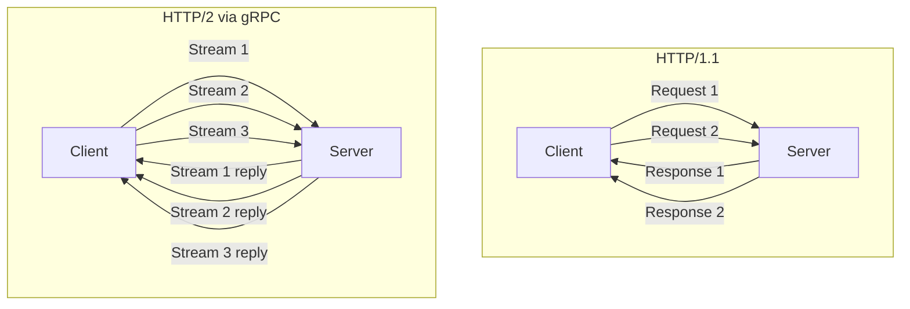
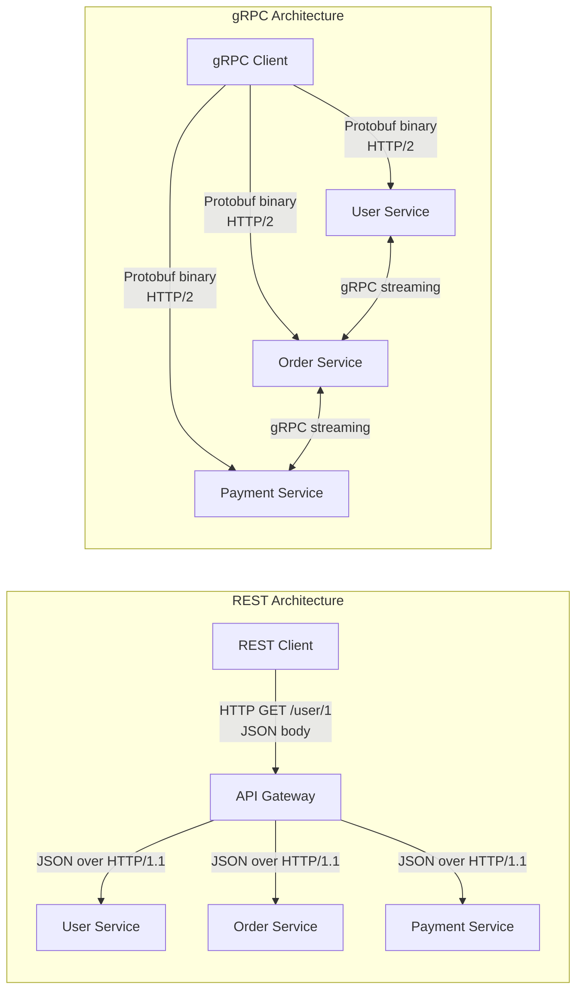
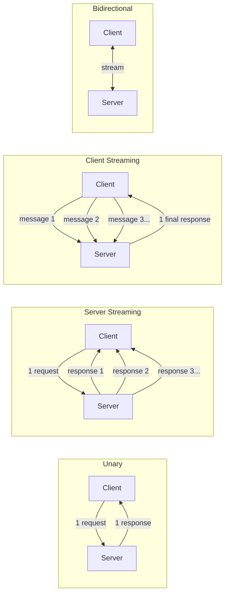
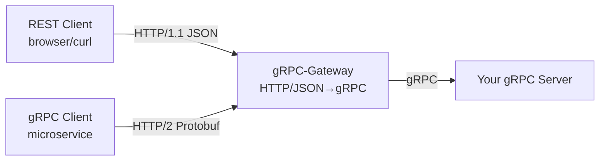

# gRPC with Go

## 🤔 What Problem Does gRPC Solve?

Imagine you are running a restaurant chain with 50 branches. Each branch needs to talk to the central kitchen to place orders. If every branch calls the kitchen using a different language — one speaks Hindi, another speaks Marathi, another uses sign language — chaos follows. You need a **common language, a strict menu format, and a fast communication channel**.

That is exactly what gRPC does for microservices. It gives every service:

- A **common language** (Protocol Buffers — strongly typed contracts)
- A **strict format** (binary, compact, fast)
- A **fast channel** (HTTP/2 — multiplexed, bidirectional)

Without gRPC, microservices often use REST+JSON. REST is like texting — human-readable but slow and loose. gRPC is like a military radio — strict protocol, compact signals, very fast.

---

## 🔥 Why gRPC for Microservices?

### The Problems with REST+JSON

| Problem | REST + JSON | gRPC + Protobuf |
|---|---|---|
| Speed | Text encoding, slower parse | Binary encoding, 5-10x faster |
| Type Safety | None — any JSON shape accepted | Strongly typed via `.proto` schema |
| Code Generation | Manual or OpenAPI tools | Built-in via `protoc` |
| Streaming | Awkward (SSE, WebSockets) | Native 4-stream types |
| Contract | Optional (OpenAPI) | Mandatory `.proto` file |
| HTTP Version | HTTP/1.1 (usually) | HTTP/2 always |

### HTTP/2 Superpowers

Think of HTTP/1.1 as a single-lane road — one car at a time. HTTP/2 is a highway with multiple lanes. The same TCP connection carries many requests and responses simultaneously.



### gRPC vs REST Architecture



---

## 🛠️ Installing the Tools

Before writing any code, you need two tools:

1. **`protoc`** — the Protocol Buffer compiler (like a translator that reads `.proto` files)
2. **`protoc-gen-go`** and **`protoc-gen-go-grpc`** — Go plugins for `protoc`

### Step 1: Install protoc

**macOS:**
```bash
brew install protobuf
```

**Linux (Ubuntu):**
```bash
apt install -y protobuf-compiler
```

**Windows:** Download from [github.com/protocolbuffers/protobuf/releases](https://github.com/protocolbuffers/protobuf/releases) and add to PATH.

Verify: `protoc --version`

### Step 2: Install Go Plugins

```bash
go install google.golang.org/protobuf/cmd/protoc-gen-go@latest
go install google.golang.org/grpc/cmd/protoc-gen-go-grpc@latest
```

Add your Go bin to PATH:
```bash
export PATH="$PATH:$(go env GOPATH)/bin"
```

### Step 3: Initialize Your Go Module

```bash
mkdir grpc-demo && cd grpc-demo
go mod init github.com/yourname/grpc-demo
go get google.golang.org/grpc
go get google.golang.org/protobuf
```

---

## 📄 Defining a .proto File

A `.proto` file is your **contract**. Like a restaurant menu — everyone reads the same menu and knows exactly what to order and what they will receive.

### Anatomy of a proto file

```proto
// proto/chat/chat.proto

syntax = "proto3";                          // Use proto3 syntax (modern standard)

package chat;                               // Namespace to avoid name collisions

option go_package = "github.com/yourname/grpc-demo/gen/chat";  // Where generated Go code goes

// A Message = a data structure (like a struct)
message ChatMessage {
  string user_id = 1;      // field name = field number (used in binary encoding, never change!)
  string room_id = 2;
  string content = 3;
  int64  timestamp = 4;
}

message JoinRequest {
  string user_id = 1;
  string room_id = 2;
}

message Empty {}

// A Service = a set of RPC methods (like an interface)
service ChatService {
  // Unary: single request, single response
  rpc JoinRoom(JoinRequest) returns (ChatMessage);

  // Server Streaming: single request, stream of responses
  rpc WatchRoom(JoinRequest) returns (stream ChatMessage);

  // Client Streaming: stream of requests, single response
  rpc SendBulkMessages(stream ChatMessage) returns (ChatMessage);

  // Bidirectional Streaming: stream both ways
  rpc Chat(stream ChatMessage) returns (stream ChatMessage);
}
```

**Key proto rules:**
- Field numbers (= 1, = 2) must never change once in production — they are the binary format
- `stream` keyword enables streaming
- `syntax = "proto3"` is the current standard
- `option go_package` tells protoc where to put generated Go files

---

## ⚙️ Generating Go Code

Run this from your project root:

```bash
protoc \
  --go_out=. \
  --go_opt=paths=source_relative \
  --go-grpc_out=. \
  --go-grpc_opt=paths=source_relative \
  proto/chat/chat.proto
```

This generates two files inside `proto/chat/`:
- `chat.pb.go` — Go structs for your messages (`ChatMessage`, `JoinRequest`, etc.)
- `chat_grpc.pb.go` — Server interface + client stub

You should commit these generated files. They are your compiled contract.

**Tip:** Add a `Makefile` target:
```makefile
generate:
	protoc --go_out=. --go_opt=paths=source_relative \
	       --go-grpc_out=. --go-grpc_opt=paths=source_relative \
	       proto/chat/chat.proto
```

---

## 🖥️ Implementing the gRPC Server

The generated code gives you an interface. Your job is to implement it — like a class implementing an interface.

Think of it this way: `protoc` draws the blueprint of a house. You build the actual house (the server struct) room by room.

```go
// server/main.go
package main

import (
    "context"
    "fmt"
    "io"
    "log"
    "net"
    "time"

    "google.golang.org/grpc"
    "google.golang.org/grpc/codes"
    "google.golang.org/grpc/status"

    pb "github.com/yourname/grpc-demo/proto/chat"
)

// chatServer holds our business logic
type chatServer struct {
    pb.UnimplementedChatServiceServer  // embed this — it future-proofs your server
    rooms map[string][]chan *pb.ChatMessage
}

func newChatServer() *chatServer {
    return &chatServer{
        rooms: make(map[string][]chan *pb.ChatMessage),
    }
}

func main() {
    // Create a TCP listener on port 50051
    lis, err := net.Listen("tcp", ":50051")
    if err != nil {
        log.Fatalf("failed to listen: %v", err)
    }

    // Create the gRPC server
    grpcServer := grpc.NewServer()

    // Register our service implementation
    pb.RegisterChatServiceServer(grpcServer, newChatServer())

    log.Println("gRPC server listening on :50051")

    // Start serving
    if err := grpcServer.Serve(lis); err != nil {
        log.Fatalf("failed to serve: %v", err)
    }
}
```

**Why `UnimplementedChatServiceServer`?**

If you add a new RPC to your proto and regenerate, the embedded struct provides a default "not implemented" response. Without it, adding a new method to the interface would break compilation of all existing server code.

---

## 📡 The 4 Types of RPC

gRPC supports four communication patterns. Think of them like conversations:



### 1. Unary RPC — One question, one answer

Like ordering food: you say what you want, you get your dish.

```go
// Server side
func (s *chatServer) JoinRoom(ctx context.Context, req *pb.JoinRequest) (*pb.ChatMessage, error) {
    if req.UserId == "" || req.RoomId == "" {
        // Use gRPC status codes instead of raw errors
        return nil, status.Errorf(codes.InvalidArgument, "user_id and room_id are required")
    }

    log.Printf("User %s joined room %s", req.UserId, req.RoomId)

    return &pb.ChatMessage{
        UserId:    "system",
        RoomId:    req.RoomId,
        Content:   fmt.Sprintf("Welcome to room %s, %s!", req.RoomId, req.UserId),
        Timestamp: time.Now().Unix(),
    }, nil
}
```

```go
// Client side
conn, err := grpc.Dial(":50051", grpc.WithInsecure())
if err != nil {
    log.Fatal(err)
}
defer conn.Close()

client := pb.NewChatServiceClient(conn)

ctx, cancel := context.WithTimeout(context.Background(), 5*time.Second)
defer cancel()

resp, err := client.JoinRoom(ctx, &pb.JoinRequest{
    UserId: "alice",
    RoomId: "general",
})
if err != nil {
    log.Fatalf("JoinRoom failed: %v", err)
}

fmt.Println("Server says:", resp.Content)
```

### 2. Server Streaming — One question, many answers

Like subscribing to live cricket score updates. You ask once, updates keep arriving.

```go
// Server side
func (s *chatServer) WatchRoom(req *pb.JoinRequest, stream pb.ChatService_WatchRoomServer) error {
    log.Printf("User %s watching room %s", req.UserId, req.RoomId)

    // Simulate streaming messages every second
    ticker := time.NewTicker(1 * time.Second)
    defer ticker.Stop()

    count := 0
    for {
        select {
        case <-stream.Context().Done():
            // Client disconnected or context cancelled
            return nil
        case t := <-ticker.C:
            count++
            msg := &pb.ChatMessage{
                UserId:    "bot",
                RoomId:    req.RoomId,
                Content:   fmt.Sprintf("Update #%d at %s", count, t.Format("15:04:05")),
                Timestamp: t.Unix(),
            }
            if err := stream.Send(msg); err != nil {
                return err  // Client disconnected
            }
            if count >= 5 {
                return nil  // Stop after 5 messages
            }
        }
    }
}
```

```go
// Client side
stream, err := client.WatchRoom(ctx, &pb.JoinRequest{
    UserId: "alice",
    RoomId: "general",
})
if err != nil {
    log.Fatal(err)
}

for {
    msg, err := stream.Recv()
    if err == io.EOF {
        break  // Server finished streaming
    }
    if err != nil {
        log.Fatalf("stream error: %v", err)
    }
    fmt.Printf("[%s] %s: %s\n", msg.RoomId, msg.UserId, msg.Content)
}
```

### 3. Client Streaming — Many messages, one final response

Like uploading a large file in chunks. You send all the pieces, server assembles and confirms.

```go
// Server side
func (s *chatServer) SendBulkMessages(stream pb.ChatService_SendBulkMessagesServer) error {
    var count int
    var lastMsg *pb.ChatMessage

    for {
        msg, err := stream.Recv()
        if err == io.EOF {
            // Client is done sending, send the summary response
            summary := &pb.ChatMessage{
                UserId:    "system",
                RoomId:    lastMsg.RoomId,
                Content:   fmt.Sprintf("Received %d messages", count),
                Timestamp: time.Now().Unix(),
            }
            return stream.SendAndClose(summary)
        }
        if err != nil {
            return err
        }

        count++
        lastMsg = msg
        log.Printf("Received message #%d: %s", count, msg.Content)
    }
}
```

```go
// Client side
bulkStream, err := client.SendBulkMessages(ctx)
if err != nil {
    log.Fatal(err)
}

messages := []string{"Hello", "World", "from", "gRPC"}
for _, m := range messages {
    if err := bulkStream.Send(&pb.ChatMessage{
        UserId:  "alice",
        RoomId:  "general",
        Content: m,
    }); err != nil {
        log.Fatalf("send error: %v", err)
    }
}

reply, err := bulkStream.CloseAndRecv()
if err != nil {
    log.Fatalf("recv error: %v", err)
}
fmt.Println("Server summary:", reply.Content)
```

### 4. Bidirectional Streaming — Full duplex conversation

Like a phone call. Both sides can talk and listen at the same time. This is the most powerful pattern.

---

## 💬 Full Example: Chat Service with Bidirectional Streaming

This is a realistic chat room implementation.

```go
// server/chat.go

// In-memory room broadcaster
type room struct {
    mu      sync.Mutex
    clients []chan *pb.ChatMessage
}

func (r *room) broadcast(msg *pb.ChatMessage) {
    r.mu.Lock()
    defer r.mu.Unlock()
    for _, ch := range r.clients {
        select {
        case ch <- msg:
        default: // skip slow clients
        }
    }
}

func (r *room) subscribe() chan *pb.ChatMessage {
    ch := make(chan *pb.ChatMessage, 10)
    r.mu.Lock()
    r.clients = append(r.clients, ch)
    r.mu.Unlock()
    return ch
}

func (r *room) unsubscribe(ch chan *pb.ChatMessage) {
    r.mu.Lock()
    defer r.mu.Unlock()
    for i, c := range r.clients {
        if c == ch {
            r.clients = append(r.clients[:i], r.clients[i+1:]...)
            close(ch)
            return
        }
    }
}

// chatServer updated with rooms map
type chatServer struct {
    pb.UnimplementedChatServiceServer
    mu    sync.Mutex
    rooms map[string]*room
}

func (s *chatServer) getRoom(roomID string) *room {
    s.mu.Lock()
    defer s.mu.Unlock()
    if _, ok := s.rooms[roomID]; !ok {
        s.rooms[roomID] = &room{}
    }
    return s.rooms[roomID]
}

// Bidirectional streaming Chat RPC
func (s *chatServer) Chat(stream pb.ChatService_ChatServer) error {
    var roomID string
    var ch chan *pb.ChatMessage

    // Goroutine to receive messages from this client and broadcast
    errCh := make(chan error, 1)
    go func() {
        for {
            msg, err := stream.Recv()
            if err == io.EOF || err != nil {
                errCh <- err
                return
            }

            // First message sets the room
            if roomID == "" {
                roomID = msg.RoomId
                r := s.getRoom(roomID)
                ch = r.subscribe()

                // Start sending goroutine now that we have the room
                go func() {
                    for incoming := range ch {
                        if err := stream.Send(incoming); err != nil {
                            return
                        }
                    }
                }()
            }

            // Broadcast to all clients in the room
            log.Printf("[%s] %s: %s", msg.RoomId, msg.UserId, msg.Content)
            s.getRoom(roomID).broadcast(msg)
        }
    }()

    // Wait for client to disconnect
    err := <-errCh

    if ch != nil {
        s.getRoom(roomID).unsubscribe(ch)
    }

    if err == io.EOF {
        return nil
    }
    return err
}
```

```go
// client/chat_client.go
func startChat(client pb.ChatServiceClient, userID, roomID string) {
    ctx, cancel := context.WithCancel(context.Background())
    defer cancel()

    stream, err := client.Chat(ctx)
    if err != nil {
        log.Fatalf("Chat stream error: %v", err)
    }

    // Goroutine to receive messages from server
    go func() {
        for {
            msg, err := stream.Recv()
            if err != nil {
                log.Printf("Receive error: %v", err)
                return
            }
            if msg.UserId != userID {  // Don't show own messages echoed back
                fmt.Printf("\r[%s]: %s\n> ", msg.UserId, msg.Content)
            }
        }
    }()

    // Read from stdin and send messages
    scanner := bufio.NewScanner(os.Stdin)
    fmt.Print("> ")
    for scanner.Scan() {
        text := scanner.Text()
        if text == "/quit" {
            stream.CloseSend()
            return
        }

        err := stream.Send(&pb.ChatMessage{
            UserId:    userID,
            RoomId:    roomID,
            Content:   text,
            Timestamp: time.Now().Unix(),
        })
        if err != nil {
            log.Printf("Send error: %v", err)
            return
        }
        fmt.Print("> ")
    }
}
```

---

## 🏷️ gRPC Metadata — Like HTTP Headers

Metadata in gRPC is like HTTP headers — key-value data attached to a request but not part of the message body. Used for auth tokens, request IDs, user info.

```go
// Client: attaching metadata
import "google.golang.org/grpc/metadata"

md := metadata.Pairs(
    "authorization", "Bearer my-secret-token",
    "x-request-id", "req-12345",
    "x-user-id", "alice",
)
ctx := metadata.NewOutgoingContext(context.Background(), md)

// Now use ctx in any RPC call
resp, err := client.JoinRoom(ctx, &pb.JoinRequest{...})
```

```go
// Server: reading metadata
func (s *chatServer) JoinRoom(ctx context.Context, req *pb.JoinRequest) (*pb.ChatMessage, error) {
    md, ok := metadata.FromIncomingContext(ctx)
    if !ok {
        return nil, status.Error(codes.Unauthenticated, "no metadata")
    }

    tokens := md.Get("authorization")
    if len(tokens) == 0 {
        return nil, status.Error(codes.Unauthenticated, "missing authorization token")
    }

    token := tokens[0]
    log.Printf("Request with token: %s", token)

    // ... rest of handler
    return &pb.ChatMessage{}, nil
}
```

```go
// Server: sending metadata back to client (like response headers)
func (s *chatServer) JoinRoom(ctx context.Context, req *pb.JoinRequest) (*pb.ChatMessage, error) {
    // Send header metadata (before first message)
    header := metadata.Pairs("x-processed-by", "server-1")
    grpc.SendHeader(ctx, header)

    // Send trailer metadata (after last message)
    trailer := metadata.Pairs("x-request-id", "resp-999")
    grpc.SetTrailer(ctx, trailer)

    return &pb.ChatMessage{}, nil
}
```

---

## 🔗 Interceptors — Like Middleware

Interceptors are gRPC's version of HTTP middleware. They wrap every RPC call. Think of airport security — every passenger (request) goes through the same checks.

### Unary Server Interceptor

```go
// Logging interceptor
func loggingInterceptor(
    ctx context.Context,
    req interface{},
    info *grpc.UnaryServerInfo,
    handler grpc.UnaryHandler,
) (interface{}, error) {
    start := time.Now()
    log.Printf("RPC started: %s", info.FullMethod)

    // Call the actual handler
    resp, err := handler(ctx, req)

    duration := time.Since(start)
    if err != nil {
        log.Printf("RPC failed: %s | duration=%s | error=%v", info.FullMethod, duration, err)
    } else {
        log.Printf("RPC success: %s | duration=%s", info.FullMethod, duration)
    }

    return resp, err
}

// Auth interceptor
func authInterceptor(
    ctx context.Context,
    req interface{},
    info *grpc.UnaryServerInfo,
    handler grpc.UnaryHandler,
) (interface{}, error) {
    // Skip auth for public methods
    publicMethods := map[string]bool{
        "/chat.ChatService/JoinRoom": true,
    }
    if publicMethods[info.FullMethod] {
        return handler(ctx, req)
    }

    md, ok := metadata.FromIncomingContext(ctx)
    if !ok {
        return nil, status.Error(codes.Unauthenticated, "no metadata provided")
    }

    tokens := md.Get("authorization")
    if len(tokens) == 0 || !isValidToken(tokens[0]) {
        return nil, status.Error(codes.Unauthenticated, "invalid token")
    }

    return handler(ctx, req)
}

func isValidToken(token string) bool {
    return token == "Bearer my-secret-token" // simplified
}

// Recovery interceptor (prevent panics from crashing the server)
func recoveryInterceptor(
    ctx context.Context,
    req interface{},
    info *grpc.UnaryServerInfo,
    handler grpc.UnaryHandler,
) (resp interface{}, err error) {
    defer func() {
        if r := recover(); r != nil {
            log.Printf("Recovered from panic in %s: %v", info.FullMethod, r)
            err = status.Errorf(codes.Internal, "internal server error")
        }
    }()
    return handler(ctx, req)
}
```

```go
// Register multiple interceptors using grpc.ChainUnaryInterceptor
grpcServer := grpc.NewServer(
    grpc.ChainUnaryInterceptor(
        recoveryInterceptor,  // outermost — catches panics first
        loggingInterceptor,
        authInterceptor,      // innermost — closest to handler
    ),
)
```

### Stream Server Interceptor

```go
func streamLoggingInterceptor(
    srv interface{},
    ss grpc.ServerStream,
    info *grpc.StreamServerInfo,
    handler grpc.StreamHandler,
) error {
    log.Printf("Stream started: %s | isClientStream=%v | isServerStream=%v",
        info.FullMethod, info.IsClientStream, info.IsServerStream)

    err := handler(srv, ss)

    log.Printf("Stream ended: %s | error=%v", info.FullMethod, err)
    return err
}

grpcServer := grpc.NewServer(
    grpc.ChainUnaryInterceptor(loggingInterceptor, authInterceptor),
    grpc.ChainStreamInterceptor(streamLoggingInterceptor),
)
```

---

## ❌ gRPC Error Codes and Status Package

gRPC has a rich set of error codes — much more expressive than HTTP status codes. Think of them like a doctor's diagnosis codes — specific and standardized.

| gRPC Code | HTTP Equivalent | When to Use |
|---|---|---|
| `codes.OK` | 200 | Success |
| `codes.InvalidArgument` | 400 | Bad input from client |
| `codes.NotFound` | 404 | Resource not found |
| `codes.AlreadyExists` | 409 | Duplicate resource |
| `codes.PermissionDenied` | 403 | No permission |
| `codes.Unauthenticated` | 401 | Not logged in |
| `codes.ResourceExhausted` | 429 | Rate limited / quota exceeded |
| `codes.Internal` | 500 | Server bug |
| `codes.Unavailable` | 503 | Server down / retry |
| `codes.DeadlineExceeded` | 504 | Timeout |
| `codes.Unimplemented` | 501 | Method not implemented |

```go
// Returning errors with details
import (
    "google.golang.org/grpc/codes"
    "google.golang.org/grpc/status"
    "google.golang.org/genproto/googleapis/rpc/errdetails"
)

func (s *chatServer) JoinRoom(ctx context.Context, req *pb.JoinRequest) (*pb.ChatMessage, error) {
    if req.UserId == "" {
        // Simple error
        return nil, status.Errorf(codes.InvalidArgument, "user_id cannot be empty")
    }

    if req.RoomId == "banned-room" {
        // Error with details
        st := status.New(codes.PermissionDenied, "room is banned")
        details, _ := st.WithDetails(&errdetails.ErrorInfo{
            Reason: "ROOM_BANNED",
            Domain: "chat.example.com",
            Metadata: map[string]string{
                "room_id": req.RoomId,
            },
        })
        return nil, details.Err()
    }

    return &pb.ChatMessage{}, nil
}

// Client: reading errors
resp, err := client.JoinRoom(ctx, req)
if err != nil {
    st, ok := status.FromError(err)
    if !ok {
        log.Fatalf("non-gRPC error: %v", err)
    }

    switch st.Code() {
    case codes.InvalidArgument:
        fmt.Println("Bad request:", st.Message())
    case codes.PermissionDenied:
        fmt.Println("Access denied:", st.Message())
        // You can also read error details
        for _, detail := range st.Details() {
            switch d := detail.(type) {
            case *errdetails.ErrorInfo:
                fmt.Printf("Error reason: %s\n", d.Reason)
            }
        }
    case codes.Unavailable:
        fmt.Println("Server unavailable, please retry")
    default:
        fmt.Printf("gRPC error %s: %s\n", st.Code(), st.Message())
    }
}
```

---

## 🌉 gRPC-Gateway — Expose gRPC as REST API

gRPC-Gateway is like a bilingual interpreter — it sits in front of your gRPC server and translates REST/JSON calls into gRPC calls. You write one service, you get two APIs.



### Step 1: Add Gateway Annotations to Proto

```proto
syntax = "proto3";

import "google/api/annotations.proto";

service ChatService {
  rpc JoinRoom(JoinRequest) returns (ChatMessage) {
    option (google.api.http) = {
      post: "/v1/rooms/join"
      body: "*"
    };
  }

  rpc WatchRoom(JoinRequest) returns (stream ChatMessage) {
    option (google.api.http) = {
      get: "/v1/rooms/{room_id}/watch"
    };
  }
}
```

### Step 2: Generate Gateway Code

```bash
go install github.com/grpc-ecosystem/grpc-gateway/v2/protoc-gen-grpc-gateway@latest

protoc \
  --go_out=. --go_opt=paths=source_relative \
  --go-grpc_out=. --go-grpc_opt=paths=source_relative \
  --grpc-gateway_out=. --grpc-gateway_opt=paths=source_relative \
  proto/chat/chat.proto
```

### Step 3: Run Both Servers

```go
func main() {
    // Start gRPC server
    go func() {
        lis, _ := net.Listen("tcp", ":50051")
        grpcServer := grpc.NewServer()
        pb.RegisterChatServiceServer(grpcServer, newChatServer())
        grpcServer.Serve(lis)
    }()

    // Start HTTP gateway on port 8080
    ctx := context.Background()
    mux := runtime.NewServeMux()
    opts := []grpc.DialOption{grpc.WithInsecure()}

    // Connect gateway to gRPC server
    pb.RegisterChatServiceHandlerFromEndpoint(ctx, mux, ":50051", opts)

    log.Println("HTTP gateway on :8080")
    http.ListenAndServe(":8080", mux)
}
```

Now REST clients can call `POST /v1/rooms/join` and gRPC clients can call the service directly — same server, zero duplication.

---

## 🔒 TLS for gRPC

TLS encrypts gRPC traffic — essential in production. Like putting your conversations in a sealed envelope instead of a postcard.

```bash
# Generate self-signed cert (for dev only)
openssl req -x509 -newkey rsa:4096 -keyout server.key -out server.crt \
  -days 365 -nodes -subj "/CN=localhost"
```

```go
// Server with TLS
import "google.golang.org/grpc/credentials"

creds, err := credentials.NewServerTLSFromFile("server.crt", "server.key")
if err != nil {
    log.Fatalf("failed to load TLS: %v", err)
}

grpcServer := grpc.NewServer(grpc.Creds(creds))
```

```go
// Client with TLS
creds, err := credentials.NewClientTLSFromFile("server.crt", "")
if err != nil {
    log.Fatalf("failed to load TLS: %v", err)
}

conn, err := grpc.Dial(":50051", grpc.WithTransportCredentials(creds))
```

For production, use proper CA-signed certificates (Let's Encrypt, or your company's internal CA). Never use `grpc.WithInsecure()` in production.

---

## 🏥 gRPC Health Checking Protocol

The health checking protocol is a standard gRPC service that load balancers, Kubernetes, and monitoring systems understand. It is like the "Are you okay?" check before routing traffic to a service.

```bash
go get google.golang.org/grpc/health
```

```go
import (
    "google.golang.org/grpc/health"
    "google.golang.org/grpc/health/grpc_health_v1"
)

func main() {
    lis, _ := net.Listen("tcp", ":50051")
    grpcServer := grpc.NewServer()

    // Register your service
    pb.RegisterChatServiceServer(grpcServer, newChatServer())

    // Register health check service
    healthServer := health.NewServer()
    grpc_health_v1.RegisterHealthServer(grpcServer, healthServer)

    // Set initial status
    healthServer.SetServingStatus("chat.ChatService", grpc_health_v1.HealthCheckResponse_SERVING)

    // If your DB goes down, you can update status:
    // healthServer.SetServingStatus("chat.ChatService", grpc_health_v1.HealthCheckResponse_NOT_SERVING)

    log.Println("Server with health check on :50051")
    grpcServer.Serve(lis)
}
```

```bash
# Test health check with grpcurl
grpcurl -plaintext localhost:50051 grpc.health.v1.Health/Check
```

```json
{
  "status": "SERVING"
}
```

Kubernetes uses this to know when to route traffic. If your service is starting up or overloaded, set `NOT_SERVING` and Kubernetes stops sending traffic until you are ready.

---

## 🤷 When to Use gRPC / When NOT to

### Use gRPC When:

- **Microservices talking to microservices** — internal service-to-service calls benefit most from speed and type safety
- **High throughput, low latency** — trading systems, gaming, real-time analytics
- **Streaming is needed** — live feeds, chat, telemetry, video streaming
- **Strong contracts matter** — teams owning different services need a clear API contract
- **Polyglot services** — Go server, Python ML client, Java payment service — all use the same `.proto`

### Do NOT Use gRPC When:

- **Public-facing browser APIs** — browsers cannot natively call gRPC (use gRPC-Gateway or REST)
- **Simple CRUD with no performance needs** — REST is simpler and has better tooling for basic apps
- **Team is unfamiliar with proto/toolchain** — the setup cost is real
- **Debugging simplicity matters** — JSON is human-readable; Protobuf is not
- **Third-party webhooks/integrations** — most external APIs expect REST+JSON

---

## 📊 Full Comparison Table

| Feature | REST + JSON | gRPC + Protobuf |
|---|---|---|
| Protocol | HTTP/1.1 | HTTP/2 |
| Payload | Text (JSON) | Binary (Protobuf) |
| Schema | Optional (OpenAPI) | Mandatory (.proto) |
| Code generation | Limited | First-class |
| Streaming | SSE / WebSocket hack | Native (4 types) |
| Browser support | Native | Needs proxy |
| Human readability | High | Low (binary) |
| Performance | Baseline | 5-10x faster |
| Learning curve | Low | Medium |
| Ecosystem maturity | Very mature | Mature (growing) |
| Error handling | HTTP status codes | Rich status + details |

---

## 🗂️ Project Structure Summary

```
grpc-demo/
├── proto/
│   └── chat/
│       ├── chat.proto           # Your contract (source of truth)
│       ├── chat.pb.go           # Generated message structs
│       └── chat_grpc.pb.go      # Generated server/client interfaces
├── server/
│   ├── main.go                  # Server entrypoint
│   └── chat.go                  # ChatService implementation
├── client/
│   └── main.go                  # Client entrypoint
├── certs/
│   ├── server.crt               # TLS certificate
│   └── server.key               # TLS private key
├── go.mod
├── go.sum
└── Makefile                     # protoc generation commands
```

---

## 🎯 Key Takeaways

1. **gRPC uses HTTP/2 + Protobuf** — this makes it significantly faster and more efficient than REST+JSON for service-to-service communication.

2. **The `.proto` file is the single source of truth** — define it carefully, never change field numbers once in production.

3. **There are 4 RPC types** — unary (most common), server streaming, client streaming, and bidirectional. Pick based on your communication pattern.

4. **Use interceptors for cross-cutting concerns** — logging, authentication, panic recovery. Never put these in your business logic handlers.

5. **Use proper gRPC status codes** — not raw Go errors. The `status` package gives you rich, expressive error handling that clients can programmatically react to.

6. **gRPC-Gateway lets you serve REST and gRPC from one codebase** — a practical solution when you need both browser clients and microservice clients.

7. **Always use TLS in production** — `grpc.WithInsecure()` is only for local development.

8. **Implement the health check protocol** — it is free and makes your service work seamlessly with Kubernetes, load balancers, and monitoring systems.

9. **`UnimplementedXxxServer` embedding is not optional** — it makes your server forward-compatible with future proto changes.

10. **Metadata is your HTTP headers equivalent** — pass request IDs, auth tokens, and user context through metadata, not through message fields.

---

*Next chapter: Advanced gRPC patterns — deadlines, retries, load balancing with service discovery, and distributed tracing with OpenTelemetry.*
