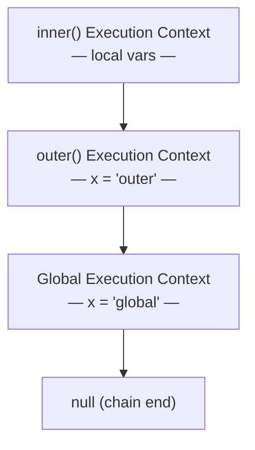
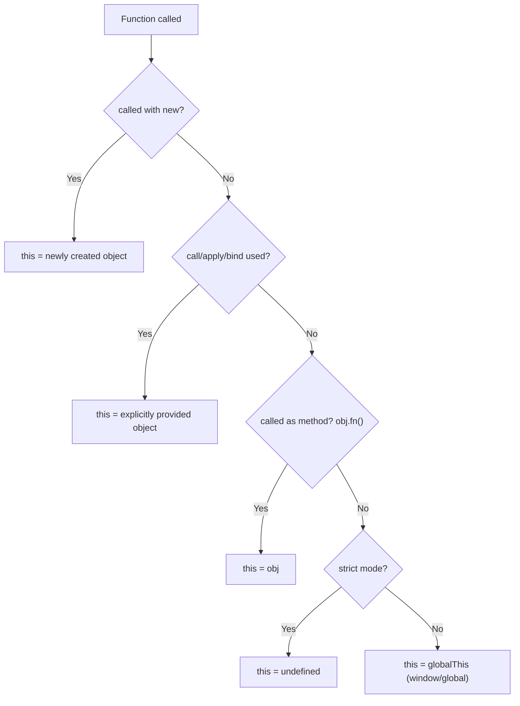
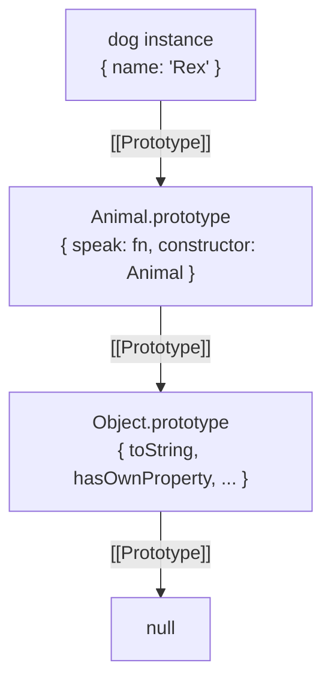
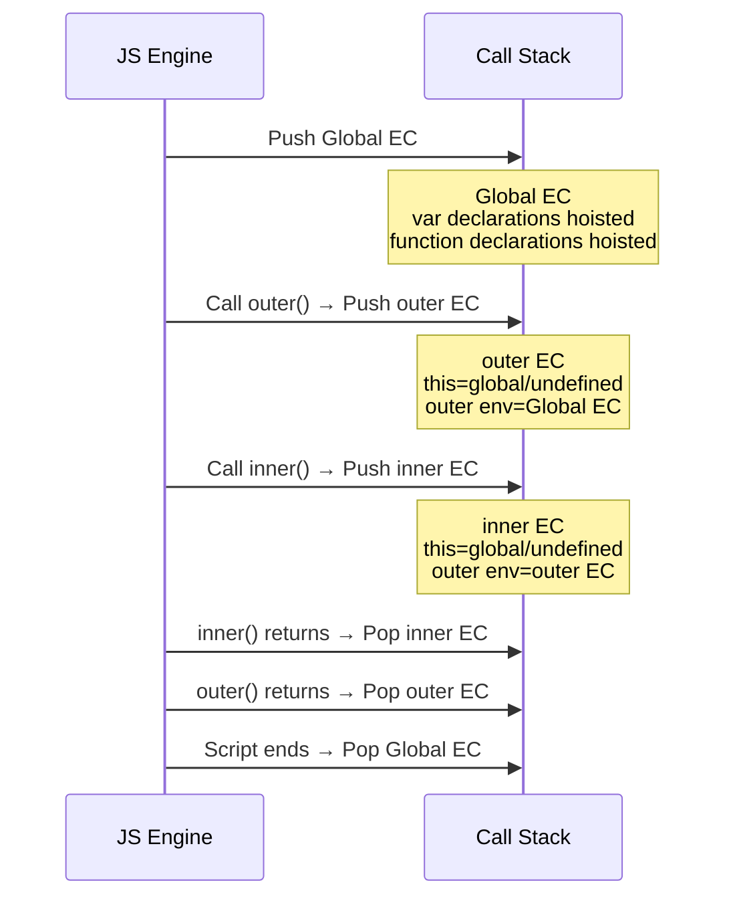

# JavaScript Core Deep Dive — Closures, Scope, This, Prototype

> Revision notes for experienced JS developers. Not a tutorial — a reference for the gotchas that bite senior devs in production.

---

## 🔥 1. Lexical Scope and the Scope Chain

### What Actually Happens at Parse Time

Scope in JS is **lexical** (also called static). The JS engine resolves variable references by walking up the scope chain determined at **definition time**, not at **call time**. This is fixed the moment the parser sees the source code — it does not change at runtime.

```js
const x = 'global';

function outer() {
  const x = 'outer';

  function inner() {
    console.log(x); // 'outer' — resolved at DEFINITION time, not call time
  }

  return inner;
}

const fn = outer();
fn(); // still logs 'outer', even though outer() has returned
```

The call stack is gone. `outer` has returned. But `inner` still holds a reference to the scope it was **created in** — that's lexical scope.

### The Scope Chain in Practice

Every execution context has a reference to its **outer (lexical) environment**. The engine walks this chain at variable lookup time:

```
inner EC → outer EC → global EC → null
```



The first match wins. Once found, the walk stops. This is why shadowing works — the inner declaration hides the outer one.

### Shadowing Gotcha

```js
let value = 100;

function process() {
  console.log(value); // ReferenceError in strict mode? No — TDZ error if let re-declared below
  let value = 200;    // This 'value' shadows outer, but TDZ applies from top of block
}
```

Here's the trap most devs fall into: **the presence of the `let value` declaration inside `process` means the entire block is in TDZ for `value` from the top — even before the declaration line**. The outer `value` is NOT accessed even though the `let` line comes later. The engine knows about the inner declaration at parse time.

---

## 🔥 2. Closures — What They Actually Are

### The Real Definition

A closure is not a special feature you opt into. Every function in JS automatically closes over its lexical environment. A closure is the **combination of a function and the variable environment it was created in**.

That environment is kept alive in memory as long as any function holding a reference to it is reachable. The GC cannot collect it.

```js
function makeCounter() {
  let count = 0; // This lives in the closure, not on the stack

  return {
    increment() { count++; },
    decrement() { count--; },
    get()       { return count; }
  };
}

const counter = makeCounter();
counter.increment();
counter.increment();
counter.get(); // 2 — count persists across calls
```

`count` is not on the call stack. It lives in the **closure scope** (the lexical environment of `makeCounter`), pinned alive because the returned object's methods reference it.

### The Classic Stale Closure Bug

This is the most common production bug caused by closures in React and async code:

```js
// React-style example
function SearchComponent() {
  const [query, setQuery] = useState('');

  // BUG: This closure captures the query value at the time the effect ran
  useEffect(() => {
    const timer = setInterval(() => {
      console.log('Searching for:', query); // stale — always logs the initial value
      fetchResults(query);
    }, 2000);

    return () => clearInterval(timer);
  }, []); // empty deps — effect runs once, query is forever stale
}
```

The fix: either add `query` to the dependency array, or use a ref to hold the mutable latest value:

```js
function SearchComponent() {
  const [query, setQuery] = useState('');
  const queryRef = useRef(query);

  useEffect(() => {
    queryRef.current = query; // always up to date
  }, [query]);

  useEffect(() => {
    const timer = setInterval(() => {
      fetchResults(queryRef.current); // reads through ref, never stale
    }, 2000);

    return () => clearInterval(timer);
  }, []); // safe now
}
```

### Closures in Loops — var vs let

The classic interview question, but it matters in real async code:

```js
// BUG: var — all callbacks share the SAME i
for (var i = 0; i < 5; i++) {
  setTimeout(() => console.log(i), 100 * i);
}
// logs: 5 5 5 5 5
// By the time callbacks fire, the loop is done and i === 5
```

```js
// FIX: let — each iteration gets its own block scope
for (let i = 0; i < 5; i++) {
  setTimeout(() => console.log(i), 100 * i);
}
// logs: 0 1 2 3 4
```

Why does `let` fix it? Under the hood, `let` in a `for` loop creates a **new binding per iteration**. It's as if the JS engine creates a fresh variable for each loop body and copies the current value into it. `var` creates one binding shared across all iterations.

Pre-ES6 fix using IIFE (you'll see this in legacy code):

```js
for (var i = 0; i < 5; i++) {
  (function(j) {
    setTimeout(() => console.log(j), 100 * j);
  })(i);
}
```

### Memoization via Closure

Real production memoize — not the toy version:

```js
function memoize(fn, { maxSize = 500, ttl = 0 } = {}) {
  const cache = new Map(); // closure over cache

  return function memoized(...args) {
    const key = JSON.stringify(args); // naive key — OK for primitives

    if (cache.has(key)) {
      const entry = cache.get(key);
      if (!ttl || Date.now() - entry.timestamp < ttl) {
        return entry.value;
      }
      cache.delete(key); // expired
    }

    if (cache.size >= maxSize) {
      // Evict oldest (Map preserves insertion order)
      const firstKey = cache.keys().next().value;
      cache.delete(firstKey);
    }

    const value = fn.apply(this, args);
    cache.set(key, { value, timestamp: Date.now() });
    return value;
  };
}

// Usage
const expensiveCalc = memoize(
  (userId, dateRange) => db.query(userId, dateRange),
  { maxSize: 200, ttl: 60_000 }
);
```

### Module Pattern via Closure

Before ES modules, this was THE pattern for encapsulation:

```js
const UserService = (() => {
  // Private state — inaccessible from outside
  const _users = new Map();
  let _lastSyncTime = null;

  // Private helper
  function _validate(user) {
    return user.id && user.email;
  }

  // Public API
  return {
    add(user) {
      if (!_validate(user)) throw new Error('Invalid user');
      _users.set(user.id, user);
    },

    get(id) {
      return _users.get(id);
    },

    get size() {
      return _users.size;
    },

    sync() {
      _lastSyncTime = Date.now();
      // ...
    }
  };
})();

// _users is completely private — no way to access it from outside
UserService.add({ id: 1, email: 'a@b.com' });
```

---

## 🔥 3. Hoisting — The Full Mental Model

### What the Engine Actually Does

Hoisting is not "moving code to the top." It's a consequence of JS parsing in two phases:

1. **Parse/Compile phase** — the engine scans the code, registers identifiers in the current scope (creates bindings in the environment record)
2. **Execution phase** — code runs top to bottom

| Declaration Type | What gets hoisted | Initial value |
|---|---|---|
| `var` | Declaration only | `undefined` |
| `function` declaration | Entire function | Full function object |
| `let` / `const` | Declaration | Uninitialized (TDZ) |
| `class` | Declaration | Uninitialized (TDZ) |

```js
console.log(a); // undefined — var declaration hoisted, init not
console.log(b); // ReferenceError: Cannot access 'b' before initialization (TDZ)
console.log(greet()); // "hello" — entire function body hoisted

var a = 1;
let b = 2;
function greet() { return 'hello'; }
```

### Temporal Dead Zone (TDZ) — The Gotcha

TDZ is the period between the binding being created (at scope entry) and the declaration being reached in code execution. Any access during TDZ throws `ReferenceError`.

```js
{
  // TDZ starts for 'x' here — the binding exists but is uninitialized
  typeof x; // ReferenceError! (typeof is NOT safe for TDZ variables)
  let x = 10; // TDZ ends here
}
```

Here's the trap most devs fall into: `typeof` is usually safe for undeclared variables (returns `'undefined'`). But it is **NOT safe** for TDZ variables — it throws. This burns devs who use `typeof x === 'undefined'` as a guard in blocks with `let`/`const`.

### Function Declaration vs Expression Hoisting

```js
// Function declaration — fully hoisted
callMe(); // works fine

function callMe() {
  console.log('called');
}

// Function expression — only var hoisted, not the function
callThem(); // TypeError: callThem is not a function

var callThem = function() {
  console.log('called');
};
```

In the expression case, `callThem` exists (hoisted as `undefined`), but you're trying to call `undefined()`.

### Class Hoisting — TDZ Applies

```js
const obj = new MyClass(); // ReferenceError — TDZ

class MyClass {
  constructor() { this.x = 1; }
}
```

Classes are NOT function declarations — they don't get full hoisting. Same TDZ rules as `let`/`const`.

---

## 🔥 4. `this` Binding — The 4 Rules in Priority Order

This is where senior devs still get caught. The value of `this` is determined by **how a function is called**, not where it's defined (unless it's an arrow function, which has no `this` of its own).

### Priority Order (highest to lowest)

```
1. new binding
2. Explicit binding (call / apply / bind)
3. Implicit binding (method call — obj.fn())
4. Default binding (standalone call — strict: undefined, sloppy: globalThis)
```



### Rule 1: new Binding

```js
function Person(name) {
  // When called with new:
  // 1. A new object is created: {}
  // 2. Object's [[Prototype]] is set to Person.prototype
  // 3. 'this' is bound to the new object
  // 4. If constructor returns nothing (or non-object), 'this' is returned
  this.name = name;
}

const p = new Person('Alice');
// p.name === 'Alice'
```

### Rule 2: Explicit Binding

```js
function greet(greeting, punctuation) {
  return `${greeting}, ${this.name}${punctuation}`;
}

const user = { name: 'Bob' };

greet.call(user, 'Hello', '!');        // immediate call, args spread
greet.apply(user, ['Hello', '!']);     // immediate call, args array
const bound = greet.bind(user, 'Hi'); // returns new function, args partially applied
bound('.');                            // 'Hi, Bob.'
```

`bind` returns a **new function** with `this` permanently bound. That bound function ignores `call`/`apply`/`bind` on it later — the binding is locked (except for `new`, which wins over `bind`).

### Rule 3: Implicit Binding

```js
const obj = {
  name: 'Charlie',
  greet() {
    console.log(this.name); // 'Charlie' — this === obj
  }
};

obj.greet(); // implicit binding — context is obj
```

### Rule 4: Default Binding

```js
function show() {
  console.log(this); // global in sloppy, undefined in strict
}

show(); // no object, no new, no explicit — default binding applies
```

### Arrow Functions — No `this`

Arrow functions do not have their own `this`. They capture `this` from their **lexical enclosing scope at definition time**. They are not a fourth rule — they opt out of the `this` system entirely.

```js
const obj = {
  name: 'Dave',
  regularFn: function() {
    console.log(this.name); // 'Dave'
  },
  arrowFn: () => {
    console.log(this.name); // undefined — 'this' is global/undefined, not obj
  }
};

obj.regularFn(); // 'Dave'
obj.arrowFn();   // undefined
```

Here's the trap most devs fall into: **using an arrow function as an object method**. Arrow functions grab `this` from where the object literal is written, which is usually the global scope or a module scope — not the object itself.

### Common `this` Loss Bugs

**Bug 1: Extracting a method**

```js
class ApiClient {
  constructor(baseUrl) {
    this.baseUrl = baseUrl;
  }
  fetch(path) {
    return globalThis.fetch(this.baseUrl + path); // 'this' is the instance
  }
}

const client = new ApiClient('https://api.example.com');
const { fetch } = client; // method extracted — loses 'this'
fetch('/users'); // TypeError: Cannot read properties of undefined (reading 'baseUrl')
```

Fix options:

```js
// Option 1: bind in constructor
constructor(baseUrl) {
  this.baseUrl = baseUrl;
  this.fetch = this.fetch.bind(this);
}

// Option 2: class field arrow function (most modern)
fetch = (path) => {
  return globalThis.fetch(this.baseUrl + path); // lexical 'this' from class instance
};

// Option 3: bind at extraction point
const fetch = client.fetch.bind(client);
```

**Bug 2: setTimeout / setInterval**

```js
class Timer {
  constructor() {
    this.count = 0;
  }

  start() {
    // BUG: setTimeout callback loses 'this'
    setTimeout(function() {
      this.count++; // TypeError — 'this' is global or undefined
    }, 1000);

    // FIX 1: Arrow function (lexical this)
    setTimeout(() => {
      this.count++; // 'this' correctly refers to Timer instance
    }, 1000);

    // FIX 2: Bind
    setTimeout(function() {
      this.count++;
    }.bind(this), 1000);
  }
}
```

**Bug 3: Event handlers in classes**

```js
class Button {
  constructor(el) {
    this.count = 0;
    el.addEventListener('click', this.handleClick); // BUG: 'this' will be the DOM element
  }

  handleClick() {
    this.count++; // 'this' is the button element, not Button instance
  }
}

// Fix: class field arrow
class Button {
  count = 0;

  constructor(el) {
    el.addEventListener('click', this.handleClick); // now safe
  }

  handleClick = () => {
    this.count++; // lexical 'this' — always the class instance
  };
}
```

### When NOT to use Arrow Functions

| Use arrow functions | Avoid arrow functions |
|---|---|
| Callbacks that need lexical `this` | Object methods (need dynamic `this`) |
| Array methods (`.map`, `.filter`) | Prototype methods |
| Promise chains | Constructor functions |
| React event handlers (class components) | Functions using `arguments` object |
| setTimeout/setInterval callbacks | Generator functions |

---

## 🔥 5. Prototype Chain — How Property Lookup Actually Works

### `__proto__` vs `prototype` — The Confusion Cleared

| Property | Lives on | Points to |
|---|---|---|
| `prototype` | Function objects only | Object that will become `[[Prototype]]` of instances |
| `__proto__` | Every object | The actual `[[Prototype]]` of this object |
| `Object.getPrototypeOf(obj)` | — | The proper way to read `[[Prototype]]` |

```js
function Animal(name) {
  this.name = name;
}

Animal.prototype.speak = function() {
  return `${this.name} makes a noise.`;
};

const dog = new Animal('Rex');

// dog.__proto__ === Animal.prototype  → true
// Animal.prototype.constructor === Animal  → true
// dog.constructor === Animal  → true (via prototype chain)

Object.getPrototypeOf(dog) === Animal.prototype; // true (prefer this over __proto__)
```

### The Prototype Chain Walk



Property lookup walks this chain:
1. Check `dog` own properties — found? return it.
2. Walk to `dog.__proto__` (Animal.prototype) — found? return it.
3. Walk to `Animal.prototype.__proto__` (Object.prototype) — found? return it.
4. Reach `null` — return `undefined`.

### Shadowing on the Prototype Chain

```js
const base = { x: 1 };
const child = Object.create(base);

console.log(child.x); // 1 — from prototype
child.x = 99;          // creates OWN property on child, shadows base.x
console.log(child.x); // 99 — own property
console.log(base.x);  // 1 — prototype unchanged
```

Here's the trap most devs fall into with **mutation** vs **assignment**:

```js
const base = { tags: ['a', 'b'] };
const child = Object.create(base);

// Mutation — modifies the SHARED prototype array
child.tags.push('c');
console.log(base.tags); // ['a', 'b', 'c'] — base polluted!

// Assignment — creates own property, doesn't touch prototype
child.tags = [...child.tags, 'd'];
```

### `hasOwnProperty` — Why You Still Need It

`for...in` iterates **all enumerable properties**, including inherited ones:

```js
const parent = { inherited: true };
const obj = Object.create(parent);
obj.own = true;

for (const key in obj) {
  console.log(key); // 'own', then 'inherited'
}

// Safe pattern:
for (const key in obj) {
  if (Object.prototype.hasOwnProperty.call(obj, key)) {
    // only own properties
  }
}

// Modern — no prototype chain concern:
Object.keys(obj);      // ['own'] — own enumerable only
Object.entries(obj);   // [['own', true]]
```

Use `Object.prototype.hasOwnProperty.call(obj, key)` not `obj.hasOwnProperty(key)` — because `obj` might have `hasOwnProperty` shadowed, or be created with `Object.create(null)` (no prototype at all).

### `instanceof` Internals

`instanceof` checks if `Constructor.prototype` appears anywhere in the object's prototype chain:

```js
function A() {}
function B() {}
B.prototype = Object.create(A.prototype); // B extends A

const b = new B();
b instanceof B; // true — B.prototype is in chain
b instanceof A; // true — A.prototype is in chain
b instanceof Object; // true — Object.prototype is in chain
```

Here's the trap most devs fall into: `instanceof` checks the **current** `Constructor.prototype`, not what it was when the object was created. If you reassign `Constructor.prototype`, old instances break:

```js
function MyClass() {}
const obj = new MyClass();

MyClass.prototype = {}; // reassigned!

obj instanceof MyClass; // false — new prototype not in obj's chain
```

### `Object.create()` — The Explicit Prototype Pattern

```js
// Clean inheritance without constructor functions
const vehicleProto = {
  start() { return `${this.model} started`; },
  stop()  { return `${this.model} stopped`; }
};

function createVehicle(model, year) {
  const vehicle = Object.create(vehicleProto);
  vehicle.model = model;
  vehicle.year = year;
  return vehicle;
}

const car = createVehicle('Tesla', 2024);
car.start(); // 'Tesla started'
Object.getPrototypeOf(car) === vehicleProto; // true

// Object.create(null) — object with NO prototype (useful for pure hash maps)
const cache = Object.create(null);
cache.toString; // undefined — no Object.prototype methods
// Safe to use as key/value store without hasOwnProperty concerns
```

### ES6 Class — Syntactic Sugar

`class` is syntax sugar over prototypal inheritance. The underlying mechanism is identical:

```js
class Animal {
  constructor(name) {
    this.name = name;
  }
  speak() {
    return `${this.name} makes a noise.`;
  }
}

class Dog extends Animal {
  speak() {
    return `${this.name} barks.`;
  }
}

// Equivalent to:
// Dog.prototype.__proto__ === Animal.prototype  → true
// Object.getPrototypeOf(Dog) === Animal  → true (constructor inheritance)
```

`super` in a method calls the parent prototype's method. `super` in a constructor is required before accessing `this` — because the parent constructor creates the object that `this` refers to.

---

## 🔥 6. Execution Context and the Call Stack

### What an Execution Context Contains

Every time a function is called (or global code runs), the JS engine creates an **Execution Context (EC)**:

```
Execution Context = {
  Variable Environment: { var declarations, function declarations },
  Lexical Environment:  { let/const bindings, outer ref },
  this binding:         (determined by call type),
}
```



### Call Stack in Action

```js
function c() {
  console.trace(); // prints current call stack
  throw new Error('trace here');
}

function b() { c(); }
function a() { b(); }

a();
// Error stack: c → b → a → (global)
```

The call stack is synchronous and single-threaded. When it's empty, the event loop picks the next task from the queue.

### How the Engine Handles `this` in EC Creation

The `this` value is set when the EC is created, before any code in the function runs. This is why you can't change `this` mid-function:

```js
function whoAmI() {
  this; // already determined — you can't change it here
}
```

---

## 🔥 7. var vs let vs const — The Deep Differences

### Scoping Rules

| | `var` | `let` | `const` |
|---|---|---|---|
| Scope | Function or global | Block | Block |
| Hoisted | Yes (as `undefined`) | Yes (TDZ) | Yes (TDZ) |
| Re-declarable | Yes | No | No |
| Re-assignable | Yes | Yes | No (binding) |
| Global property | Yes (`window.x`) | No | No |

`const` prevents re-assignment of the **binding**, not mutation of the **value**:

```js
const arr = [1, 2, 3];
arr.push(4);    // fine — mutating the object, not the binding
arr = [1, 2];   // TypeError — re-assigning the binding

const obj = { x: 1 };
obj.x = 2;      // fine
obj = {};        // TypeError
```

For true immutability: `Object.freeze()` (shallow) or a deep freeze utility.

### The Loop Closure Bug — Full Analysis

```js
// With var — one shared binding
const fns = [];
for (var i = 0; i < 3; i++) {
  fns.push(() => i); // all capture the SAME i variable
}
fns.map(f => f()); // [3, 3, 3]

// With let — per-iteration binding
const fns2 = [];
for (let i = 0; i < 3; i++) {
  fns2.push(() => i); // each captures its OWN i
}
fns2.map(f => f()); // [0, 1, 2]
```

The spec mandates that `let`-declared loop variables create a new binding per iteration. The engine copies the current value into a fresh variable each time and gives the loop body access to that fresh variable. The next iteration gets its own fresh copy, incremented from the previous.

### `var` in Async Code — Production Danger

```js
// This is a real bug pattern in API handlers
async function processItems(items) {
  for (var i = 0; i < items.length; i++) {
    await someAsyncOp(items[i]);
    // After await, i is the SAME var — if anything mutates it between ticks, you get bugs
    // Also: setTimeout inside here would capture the final i
  }
}

// Safe version
async function processItems(items) {
  for (let i = 0; i < items.length; i++) {
    await someAsyncOp(items[i]); // each iteration has its own i binding
  }

  // Or even better for most cases:
  for (const item of items) {
    await someAsyncOp(item);
  }
}
```

### When to Use What

| Situation | Use |
|---|---|
| Will never be reassigned | `const` (default choice) |
| Will be reassigned (loop counter, state) | `let` |
| Legacy code / function-scoped intentionally | `var` (avoid in new code) |
| Loop variable that needs closure | `let` always |
| Destructured values you won't reassign | `const` |

---

## 🔥 8. Production Patterns — Putting It All Together

### Robust Memoize with WeakMap for Object Args

```js
// WeakMap allows GC of keys when they're no longer referenced
function memoizeWeak(fn) {
  const primitiveCache = new Map();
  const objectCache = new WeakMap();

  return function(...args) {
    // Separate handling for object vs primitive args
    const hasObjectArg = args.some(a => a !== null && typeof a === 'object');

    if (hasObjectArg && args.length === 1) {
      if (objectCache.has(args[0])) return objectCache.get(args[0]);
      const result = fn.apply(this, args);
      objectCache.set(args[0], result);
      return result;
    }

    const key = JSON.stringify(args);
    if (primitiveCache.has(key)) return primitiveCache.get(key);
    const result = fn.apply(this, args);
    primitiveCache.set(key, result);
    return result;
  };
}
```

### EventEmitter Using Closure + Module Pattern

```js
function createEventEmitter() {
  const listeners = new Map(); // private via closure

  return {
    on(event, handler) {
      if (!listeners.has(event)) listeners.set(event, new Set());
      listeners.get(event).add(handler);
      return () => this.off(event, handler); // returns unsubscribe fn
    },

    off(event, handler) {
      listeners.get(event)?.delete(handler);
    },

    emit(event, ...args) {
      listeners.get(event)?.forEach(handler => {
        try {
          handler(...args);
        } catch (err) {
          console.error(`Handler error for event "${event}":`, err);
        }
      });
    },

    once(event, handler) {
      const wrapper = (...args) => {
        handler(...args);
        this.off(event, wrapper);
      };
      return this.on(event, wrapper);
    }
  };
}

const emitter = createEventEmitter();
const unsub = emitter.on('data', payload => console.log(payload));
emitter.emit('data', { id: 1 }); // logs { id: 1 }
unsub(); // clean removal
```

### Prototype-Based Plugin System

```js
// Base class with extensible prototype
class DataProcessor {
  constructor(data) {
    this.data = data;
    this._plugins = [];
  }

  use(plugin) {
    this._plugins.push(plugin);
    // Mix plugin methods onto prototype dynamically
    Object.assign(DataProcessor.prototype, plugin.methods || {});
    return this; // chainable
  }

  process() {
    return this._plugins.reduce(
      (result, plugin) => plugin.transform ? plugin.transform(result) : result,
      this.data
    );
  }
}

const filterPlugin = {
  methods: {
    filter(predicate) {
      this.data = this.data.filter(predicate);
      return this;
    }
  },
  transform: data => data
};

const processor = new DataProcessor([1, 2, 3, 4, 5]);
processor.use(filterPlugin).filter(x => x > 2);
```

---

## 🔥 Quick Reference — Interview-Ready Answers

**Q: What is a closure?**
A function bundled with its lexical environment. The outer scope's variables remain accessible (and alive in memory) even after the outer function has returned, because the inner function holds a reference to that environment.

**Q: Why does `let` fix the loop closure bug?**
`let` creates a new binding per iteration. Each loop body gets its own isolated copy of the variable. With `var`, there's one shared binding across all iterations.

**Q: What are the four `this` binding rules in priority order?**
`new` > explicit (`call`/`apply`/`bind`) > implicit (method call) > default (global/undefined). Arrow functions have no `this` — they inherit lexically.

**Q: What's the TDZ?**
The Temporal Dead Zone is the period between a `let`/`const` variable being registered in scope (at block entry) and its declaration being executed. Any access during TDZ throws a `ReferenceError`. Unlike `var`, the binding exists but is uninitialized.

**Q: What's the difference between `__proto__` and `prototype`?**
`prototype` is a property on constructor functions — it's the object that becomes the `[[Prototype]]` of instances created with `new`. `__proto__` is the actual `[[Prototype]]` link on every object instance. Use `Object.getPrototypeOf()` in production code instead of accessing `__proto__` directly.

**Q: How does `instanceof` work?**
It checks if `Constructor.prototype` appears anywhere in the target object's prototype chain. It does NOT check the constructor function — only the prototype object reference.

---

*Last updated: 2026-06-26 | Target: Senior JS engineers*
