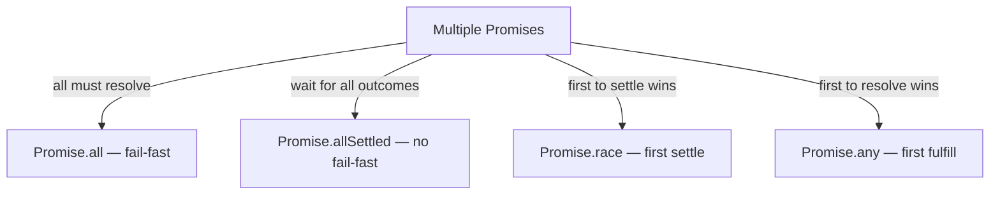
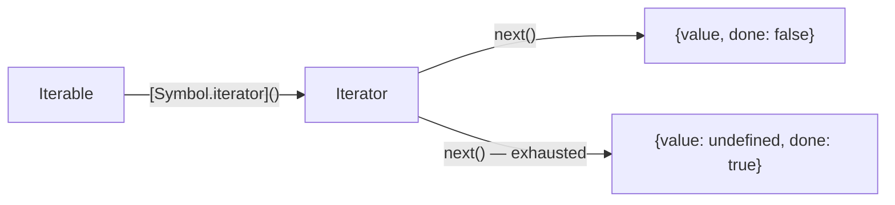

# Modern JavaScript — ES6 to ES2024
### Revision Notes for Experienced JS Developers

> Assumes you already know JS. This is about the WHY, the GOTCHAS, and the production edge cases that bite you when you least expect it.

---

## Table of Contents

1. [Destructuring](#1-destructuring)
2. [Spread / Rest](#2-spread--rest)
3. [Template Literals & Tagged Templates](#3-template-literals--tagged-templates)
4. [Arrow Functions](#4-arrow-functions)
5. [Modules](#5-modules)
6. [Optional Chaining & Nullish Coalescing](#6-optional-chaining--nullish-coalescing)
7. [Logical Assignment Operators](#7-logical-assignment-operators)
8. [Promise Combinators](#8-promise-combinators)
9. [Proxy and Reflect](#9-proxy-and-reflect)
10. [WeakMap and WeakSet](#10-weakmap-and-weakset)
11. [Symbol](#11-symbol)
12. [Generators and Iterators](#12-generators-and-iterators)
13. [Array Methods — ES2022–2023](#13-array-methods--es20222023)
14. [Object.fromEntries & structuredClone](#14-objectfromentries--structuredclone)

---

## 1. 🔥 Destructuring

### The Mental Model

Destructuring is pattern matching against a data shape. The left side is a template; the right side is the source. JS walks both simultaneously and binds variables.

```js
// Array: position matters
const [first, , third] = [1, 2, 3];

// Object: key name matters, position irrelevant
const { name, age } = { age: 30, name: 'Alice' };
```

### Renaming on Destructure

```js
// Rename 'name' to 'userName' — the colon here is NOT a ternary
const { name: userName, role: userRole = 'viewer' } = user;

// Combining rename + default
const { config: { timeout: reqTimeout = 5000 } = {} } = options;
```

### Default Values

Default values only trigger on `undefined` — NOT `null`, `0`, `''`, or `false`.

```js
const { retries = 3 } = { retries: null };
console.log(retries); // null — default did NOT kick in

const { retries: r = 3 } = { retries: undefined };
console.log(r); // 3 — default kicked in
```

**Here's the trap most devs fall into:** Treating `null` like `undefined` in defaults. API responses often send `null` for missing fields. Your destructuring default won't save you.

```js
// Real scenario: API returns { timeout: null }
function createClient({ timeout = 5000 } = {}) {
  // timeout is null here, NOT 5000!
  // The connection will hang forever
}

// Fix: use nullish coalescing after destructuring
function createClient({ timeout = undefined } = {}) {
  const actualTimeout = timeout ?? 5000; // now null falls through to 5000
}
```

### Nested Destructuring

```js
const {
  data: {
    user: {
      address: { city, zip = '00000' }
    }
  },
  meta: { requestId }
} = apiResponse;
```

**Gotcha:** If any intermediate value is `undefined`, you get a TypeError, not a graceful fallback.

```js
// If apiResponse.data is undefined → TypeError: Cannot destructure property 'user' of undefined
// Fix: provide defaults at each level
const {
  data: {
    user: {
      address: { city = 'Unknown' } = {}
    } = {}
  } = {},
} = apiResponse ?? {};
```

### Function Parameter Destructuring

The cleanest pattern for option bags:

```js
// Named params with defaults, rename for internal clarity
function sendEmail({
  to,
  from: sender = 'noreply@app.com',
  subject = '(No Subject)',
  body: content = '',
  attachments = [],
  priority: p = 'normal',
} = {}) {
  // The `= {}` at the end means you can call sendEmail() with no args
}
```

### Swap Without Temp Variable

```js
let a = 1, b = 2;
[a, b] = [b, a]; // clean swap using array destructuring
```

### Destructuring in Loops

```js
const users = [{ id: 1, name: 'Alice' }, { id: 2, name: 'Bob' }];

for (const { id, name } of users) {
  console.log(`${id}: ${name}`);
}

// With Object.entries
for (const [key, value] of Object.entries(config)) {
  // key and value are already strings from Object.entries
}
```

### When to Use / When NOT to Use

| Use destructuring | Skip it |
|---|---|
| Function parameters (option bags) | When you only need one property |
| Extracting 3+ properties | When clarity matters more than brevity |
| Swapping variables | Deeply nested paths with no intermediate defaults |
| Loop variable binding | When null-safety is complex (just use optional chaining) |

---

## 2. 🌊 Spread / Rest

### Spread: Shallow Copy — One Level Deep, Full Stop

This is the #1 spread gotcha in production:

```js
const original = {
  user: { name: 'Alice', prefs: { theme: 'dark' } },
  tokens: [1, 2, 3]
};

const copy = { ...original };
copy.user.prefs.theme = 'light'; // MUTATES original.user.prefs.theme!
copy.tokens.push(4);             // MUTATES original.tokens!

// spread only copies the top-level reference for nested objects/arrays
// copy.user === original.user → true (same reference)
```

**Here's the trap most devs fall into:** Using spread for "deep copy" before passing to an async function. The async function mutates the nested data while you think you have an isolated copy.

```js
// Fix for shallow: structuredClone (ES2022)
const deepCopy = structuredClone(original);

// Fix for plain data: JSON round-trip (but loses Dates, undefined, functions)
const jsonCopy = JSON.parse(JSON.stringify(original));
```

### Object Merging — Last Write Wins

```js
const defaults = { timeout: 3000, retries: 3, verbose: false };
const userConfig = { timeout: 5000, debug: true };

// Correct: user config wins because it's last
const config = { ...defaults, ...userConfig };
// { timeout: 5000, retries: 3, verbose: false, debug: true }

// Wrong order: defaults silently overwrite user config
const broken = { ...userConfig, ...defaults }; // timeout is 3000 again
```

### Spread in Arrays

```js
// Cloning
const arr = [1, 2, 3];
const clone = [...arr];

// Concatenating (more readable than concat)
const combined = [...arr1, ...arr2, ...arr3];

// Converting iterables
const setToArray = [...new Set([1, 2, 2, 3])]; // [1, 2, 3]
const mapEntries = [...map.entries()];
const str = [..."hello"]; // ['h','e','l','l','o']

// Inserting in the middle
const withInserted = [...arr.slice(0, idx), newItem, ...arr.slice(idx)];
```

### Rest Parameters — Variadic Functions

```js
// Rest must be last — all remaining args collapse into an array
function log(level, timestamp, ...messages) {
  // messages is always an array, even if empty
  messages.forEach(msg => console.log(`[${level}] ${timestamp}: ${msg}`));
}

// Unlike arguments object:
// - Rest is a real Array (has map, filter, etc.)
// - arguments includes ALL params; rest only captures the remainder
// - Arrow functions have no 'arguments' at all — use rest
```

**Gotcha:** `arguments` is not available in arrow functions. If you're wrapping a variadic function with an arrow, you must use rest.

```js
const wrapper = (...args) => originalFn(...args); // correct
const broken = () => originalFn(...arguments);     // ReferenceError in module scope
```

### Spread vs Object.assign

| | `{...obj}` | `Object.assign({}, obj)` |
|---|---|---|
| Copies own enumerable properties | Yes | Yes |
| Copies non-enumerable | No | No |
| Copies inherited | No | No |
| Triggers setters | No | Yes |
| Return value | New object literal | Target object (mutated) |
| Getters become values | Yes | Yes |

`Object.assign` triggers setters on the target, spread does not. Relevant when the target is a reactive object (Vue, MobX).

---

## 3. 🏷️ Template Literals & Tagged Templates

### Beyond String Interpolation

Tagged templates are a function call with special syntax. The tag function receives the string parts and values separately — this is how styled-components, graphql-tag, and SQL builders work.

```js
function tag(strings, ...values) {
  // strings: array of static string parts (always values.length + 1)
  // values: array of interpolated expressions
  return strings.reduce((acc, str, i) => {
    return acc + str + (values[i] !== undefined ? values[i] : '');
  }, '');
}

const name = 'World';
tag`Hello ${name}!`;
// strings: ['Hello ', '!']
// values:  ['World']
```

### How styled-components Works

```js
// Simplified styled-components internals
function css(strings, ...interpolations) {
  return (props) =>
    strings.reduce((acc, str, i) => {
      const interp = interpolations[i];
      // If the interpolation is a function, call it with props
      const resolved = typeof interp === 'function' ? interp(props) : interp ?? '';
      return acc + str + resolved;
    }, '');
}

const Button = styled.button`
  background: ${props => props.primary ? '#007bff' : '#6c757d'};
  padding: ${props => props.size === 'lg' ? '12px 24px' : '8px 16px'};
  border-radius: 4px;
`;
```

### Safe SQL Query Builder

Tagged templates prevent SQL injection by separating literals from values:

```js
function sql(strings, ...values) {
  const query = strings.reduce((acc, str, i) => {
    return acc + str + (i < values.length ? `$${i + 1}` : '');
  }, '');
  return { query, params: values };
}

const userId = userInput; // potentially dangerous
const { query, params } = sql`
  SELECT * FROM users
  WHERE id = ${userId}
  AND active = ${true}
`;
// query: "SELECT * FROM users WHERE id = $1 AND active = $2"
// params: [userInput, true]
// params are passed separately to the DB driver — injection-safe
```

### String.raw

```js
// String.raw is a built-in tag — returns the raw string with escape sequences unprocessed
const path = String.raw`C:\Users\name\Documents`; // no need to escape backslashes
const regex = String.raw`\d+\.\d+`; // useful for regex strings
```

### Multiline Gotcha

```js
// Template literals preserve ALL whitespace including leading indentation
const html = `
  <div>
    <p>Hello</p>
  </div>
`;
// The string starts with \n and has 2 spaces of indent on each line
// Fix: dedent library, or trim + manual alignment
```

---

## 4. ➡️ Arrow Functions

### The Core Difference: Lexical `this`

Arrow functions do not have their own `this`. They capture it from the enclosing lexical scope at definition time, not call time.

```js
class Timer {
  constructor() {
    this.seconds = 0;
  }

  start() {
    // Regular function: 'this' is undefined (strict mode) or window
    setInterval(function() { this.seconds++; }, 1000); // BROKEN

    // Arrow function: 'this' is the Timer instance
    setInterval(() => { this.seconds++; }, 1000); // CORRECT
  }
}
```

### When NOT to Use Arrow Functions

**1. Object methods (when you need `this` to be the object)**

```js
const counter = {
  count: 0,
  // Arrow: 'this' is the outer scope (module/window), not counter
  increment: () => { this.count++; }, // BROKEN

  // Regular function: 'this' is counter when called as counter.increment()
  increment() { this.count++; }, // CORRECT
};
```

**2. Prototype methods**

```js
function Person(name) { this.name = name; }

// 'this' inside arrow refers to the scope where Person is defined, not the instance
Person.prototype.greet = () => `Hi, I'm ${this.name}`; // BROKEN — this.name is undefined

Person.prototype.greet = function() { return `Hi, I'm ${this.name}`; }; // CORRECT
```

**3. Constructors (this is a syntax error)**

```js
const Foo = () => {}; // Arrow functions cannot be called with 'new'
new Foo(); // TypeError: Foo is not a constructor
```

**4. Event handlers when you need `this` to refer to the element**

```js
button.addEventListener('click', () => {
  this.classList.add('active'); // 'this' is NOT the button — it's lexical scope
});

button.addEventListener('click', function() {
  this.classList.add('active'); // 'this' IS the button — correct
});
```

**5. Dynamic methods (generators)**

```js
// Arrow functions cannot be generator functions
const gen = *() => {}; // SyntaxError
```

### No `arguments` Object

```js
function regular() {
  console.log(arguments); // Works — Arguments object
}

const arrow = () => {
  console.log(arguments); // ReferenceError in module scope
                          // In non-strict: captures enclosing function's arguments
};

// Fix: use rest parameters
const arrow2 = (...args) => console.log(args);
```

### Arrow Functions and Implicit Return

```js
// Return an object literal — MUST wrap in parens
// Without parens, {} is parsed as a block, not an object
const toObj = key => ({ [key]: true });   // correct
const broken = key => { [key]: true };    // returns undefined

// Multi-line implicit return — not possible. Use explicit return
const compute = (x) => {
  const intermediate = x * 2;
  return intermediate + 1;
};
```

---

## 5. 📦 Modules

### Named vs Default Exports

| | Named | Default |
|---|---|---|
| Syntax | `export const foo = ...` | `export default ...` |
| Import syntax | `import { foo } from '...'` | `import anything from '...'` |
| Multiple per file | Yes | One max |
| Tree-shakeable | Yes (easier) | Harder for bundlers |
| Renaming | At import site: `{ foo as bar }` | Natural (any name at import) |

**Here's the trap most devs fall into:** Mixing default and named exports causes confusion when the default export is re-exported through a barrel file.

```js
// utils/index.js (barrel)
export { default as formatDate } from './formatDate';
export { default as parseDate } from './parseDate';
export * from './validators'; // re-export all named exports

// Usage: import { formatDate, isEmail } from './utils';
```

### Dynamic Import — Code Splitting

```js
// Static import: always loaded, parsed, executed at module load time
import HeavyChart from './HeavyChart';

// Dynamic import: returns a Promise, can be lazy-loaded
async function loadChart() {
  const { default: HeavyChart, ChartUtils } = await import('./HeavyChart');
  return new HeavyChart(ChartUtils.defaults);
}

// React-style code splitting
const HeavyChart = React.lazy(() => import('./HeavyChart'));
```

**When to use dynamic import:**
- Route-based code splitting
- Feature flags (only load analytics if user consents)
- Heavy libraries (monaco-editor, pdf.js, chart libraries)
- Polyfills based on browser detection

### import.meta

```js
// import.meta is module-specific metadata
console.log(import.meta.url);     // file:///path/to/module.js (Node) or full URL (browser)
console.log(import.meta.env);     // Vite/bundler-injected env vars
console.log(import.meta.resolve('./data.json')); // resolve relative URL

// In Node.js — replicate __dirname behavior
import { fileURLToPath } from 'url';
import { dirname, join } from 'path';
const __dirname = dirname(fileURLToPath(import.meta.url));
const dataPath = join(__dirname, 'data.json');
```

### Circular Dependencies

```mermaid
graph TD
    A[moduleA.js] -->|imports from| B[moduleB.js]
    B -->|imports from| A
    A -->|at load time: exports = {}| B
    B -->|uses A's export → undefined| C[Runtime bug]
```

```js
// moduleA.js
import { greet } from './moduleB.js';
export const name = 'Alice';
export function sayHi() { return greet(name); }

// moduleB.js
import { name } from './moduleA.js';
// When moduleB is first evaluated, moduleA hasn't finished — name is undefined!
export function greet(who = name) { return `Hello, ${who}`; }
```

**Fix strategies:**
1. Extract shared code to a third module
2. Use lazy evaluation — wrap in functions so the binding is resolved at call time, not at load time
3. Use dynamic `import()` inside the function body

### Top-Level Await (ES2022)

```js
// Only works in ESM modules, not CommonJS
const config = await fetch('/api/config').then(r => r.json());
export const API_BASE = config.apiBase;

// This blocks the entire module from loading until the await resolves
// Use carefully — it can significantly delay startup
```

---

## 6. 🔍 Optional Chaining & Nullish Coalescing

### Optional Chaining (?.)

Short-circuits the ENTIRE chain at the first `null`/`undefined`. Returns `undefined` for the whole expression.

```js
const city = user?.address?.city;          // property access
const len = arr?.length;                    // still works on non-nullish arrays
const result = obj?.method?.();             // optional method call
const item = arr?.[index];                 // optional computed access
const name = map?.get('key');              // works with Map methods too
```

**Short-circuit: everything after `?.` is skipped**

```js
const user = null;
const result = user?.profile.getName(); // Does NOT throw — getName never called
// result === undefined

// But:
let sideEffect = 0;
user?.doSomething(sideEffect++); // sideEffect is still 0 — the ++ never ran
```

**Here's the trap most devs fall into:** Using `?.` thinking it prevents all errors, but it only guards against `null`/`undefined` on the LEFT side.

```js
const config = { timeout: null };
const ms = config?.timeout.toFixed(2); // TypeError! config exists, timeout is null
// config?.timeout returns null, then null.toFixed() throws

// Correct:
const ms = config?.timeout?.toFixed(2); // undefined — fully safe
```

### Nullish Coalescing (??)

Returns the right side only if the left side is `null` or `undefined`. Does NOT trigger for `0`, `''`, `false`.

```js
// The problem with || (logical OR)
const port = userConfig.port || 3000;
// If userConfig.port is 0 (valid port!), you get 3000 — WRONG

const port = userConfig.port ?? 3000;
// 0 is kept because 0 is not null/undefined — CORRECT

// Comparison
const val = someVal || 'default';   // 0, '', false all fall through to 'default'
const val = someVal ?? 'default';   // ONLY null/undefined fall through
```

### Optional Chaining + Nullish Coalescing Together

```js
// The power combo: safe traversal with a meaningful fallback
const displayName = user?.profile?.displayName ?? user?.email ?? 'Anonymous';

// Real API response handling
const limit = response?.pagination?.perPage ?? 20;
const items = response?.data?.items ?? [];
```

### Optional Method Calls

```js
// Is the method defined AND callable?
const result = obj.optionalMethod?.();

// Practical: feature detection
const clipText = navigator.clipboard?.writeText?.('copied!');

// Event emitter optional emit
this.onSuccess?.({ data, timestamp: Date.now() });
```

---

## 7. ⚡ Logical Assignment Operators

These combine a logical operator with assignment. They are SHORT-CIRCUIT — the right side only evaluates if needed.

### ||= (Logical OR Assignment)

Assigns only if the left side is FALSY (`null`, `undefined`, `0`, `''`, `false`, `NaN`).

```js
// Long form: if (!x) x = defaultValue;
// Old idiom: x = x || defaultValue;

user.role ||= 'viewer';  // assigns 'viewer' only if user.role is falsy

// Common use: lazy initialization
cache[key] ||= expensiveCompute(key);
```

**Gotcha:** `0` and `''` are falsy — they will be overwritten. Use `??=` if those are valid values.

### ??= (Nullish Coalescing Assignment)

Assigns only if the left side is `null` or `undefined`.

```js
// Only assigns if truly absent
config.timeout ??= 5000; // 0 is kept, null/undefined gets 5000

// Ideal for: default values where 0 and '' are valid
obj.retries ??= 3;
obj.prefix ??= '';
```

### &&= (Logical AND Assignment)

Assigns only if the left side is TRUTHY. Useful for updating a value that might not exist.

```js
// Long form: if (x) x = transform(x);

// Update only if user object exists
user &&= { ...user, lastSeen: Date.now() };

// Normalize a value only if it's set
config.endpoint &&= config.endpoint.replace(/\/$/, ''); // strip trailing slash
```

### Decision Table

| Operator | Assigns when left side is... | Use case |
|---|---|---|
| `\|\|=` | Falsy | Defaults where 0/'' should also be replaced |
| `??=` | null or undefined | Defaults where 0/'' are valid values |
| `&&=` | Truthy | Transform/update an optional value |

---

## 8. 🎭 Promise Combinators

### The Four Combinators



### Promise.all — Fail Fast

```js
// If ANY promise rejects, the whole thing rejects immediately
// Other pending promises are NOT cancelled (no cancellation in Promise API)
const [user, posts, comments] = await Promise.all([
  fetchUser(id),
  fetchPosts(id),
  fetchComments(id),
]);

// Real pattern: parallel fetch with error mapping
const results = await Promise.all(
  userIds.map(id =>
    fetchUser(id).catch(err => ({ error: err.message, id })) // prevent fail-fast per item
  )
);
```

**Here's the trap most devs fall into:** Sequentially awaiting independent async calls.

```js
// SLOW — sequential, each waits for the previous (total: sum of all times)
const user = await fetchUser();
const prefs = await fetchPrefs();
const perms = await fetchPermissions();

// FAST — parallel (total: max of all times)
const [user, prefs, perms] = await Promise.all([
  fetchUser(), fetchPrefs(), fetchPermissions()
]);
```

### Promise.allSettled — Always Resolves

```js
// Never rejects — gives you { status: 'fulfilled', value } or { status: 'rejected', reason }
const results = await Promise.allSettled([
  fetch('/api/a'),
  fetch('/api/b'),
  fetch('/api/c'),
]);

const successes = results
  .filter(r => r.status === 'fulfilled')
  .map(r => r.value);

const failures = results
  .filter(r => r.status === 'rejected')
  .map(r => r.reason);

// Perfect for: batch operations where partial success is acceptable
//   - Sending notifications to multiple users
//   - Syncing to multiple services
//   - Validating a list of items
```

### Promise.race — First to Settle

```js
// First promise to settle (resolve OR reject) wins
// Use case: timeout implementation
function withTimeout(promise, ms) {
  const timeout = new Promise((_, reject) =>
    setTimeout(() => reject(new Error(`Timed out after ${ms}ms`)), ms)
  );
  return Promise.race([promise, timeout]);
}

const data = await withTimeout(fetchLargeDataset(), 5000);
```

**Gotcha:** If the rejection wins, the other promise still runs to completion in the background. There's no built-in cancellation.

### Promise.any — First to Fulfill (ES2021)

```js
// Resolves with the first FULFILLED promise
// Only rejects if ALL promises reject (AggregateError)
// Ignores individual rejections

// Use case: redundant sources, take whichever responds first
const data = await Promise.any([
  fetchFromPrimaryServer(),
  fetchFromSecondaryServer(),
  fetchFromCDN(),
]);

// Error handling
try {
  const result = await Promise.any([p1, p2, p3]);
} catch (err) {
  // err is AggregateError with err.errors array
  console.log(err.errors); // [error1, error2, error3]
}
```

### Comparison Table

| Combinator | Resolves when | Rejects when | Result type |
|---|---|---|---|
| `Promise.all` | ALL fulfill | ANY rejects | Array of values |
| `Promise.allSettled` | ALL settle | Never | Array of `{status, value/reason}` |
| `Promise.race` | FIRST settles | FIRST rejects | Single value |
| `Promise.any` | FIRST fulfills | ALL reject | Single value |

---

## 9. 🪄 Proxy and Reflect

### The Mental Model

Proxy wraps an object and intercepts fundamental operations (get, set, delete, call, construct). Reflect provides the default behavior for each trap.

```js
const handler = {
  get(target, prop, receiver) {
    console.log(`GET: ${String(prop)}`);
    return Reflect.get(target, prop, receiver); // default behavior
  },
  set(target, prop, value, receiver) {
    console.log(`SET: ${String(prop)} = ${value}`);
    return Reflect.set(target, prop, value, receiver);
  }
};

const proxy = new Proxy({}, handler);
```

### How Vue 3 Reactivity Works

```js
// Simplified Vue 3 reactive() implementation
function reactive(target) {
  return new Proxy(target, {
    get(target, key, receiver) {
      // Track: record that the current effect depends on this key
      track(target, key);
      const value = Reflect.get(target, key, receiver);
      // Deep reactivity: wrap nested objects lazily
      if (typeof value === 'object' && value !== null) {
        return reactive(value);
      }
      return value;
    },
    set(target, key, value, receiver) {
      const result = Reflect.set(target, key, value, receiver);
      // Trigger: re-run all effects that depend on this key
      trigger(target, key);
      return result;
    }
  });
}
```

**Why Reflect instead of direct target access?**

```js
// Without Reflect — breaks inheritance and getter chains
get(target, prop) {
  return target[prop]; // wrong 'receiver' for inherited getters
}

// With Reflect — correct receiver propagation
get(target, prop, receiver) {
  return Reflect.get(target, prop, receiver); // handles inherited getters correctly
}
```

### Validation Proxy

```js
function createValidatedModel(schema) {
  return new Proxy({}, {
    set(target, prop, value) {
      const validator = schema[prop];
      if (validator && !validator(value)) {
        throw new TypeError(`Invalid value for ${prop}: ${value}`);
      }
      return Reflect.set(target, prop, value);
    },
    get(target, prop) {
      if (!(prop in target) && prop in schema) {
        return undefined; // known field, just not set yet
      }
      return Reflect.get(target, prop);
    }
  });
}

const user = createValidatedModel({
  age: v => Number.isInteger(v) && v >= 0 && v <= 150,
  email: v => /^[^@]+@[^@]+\.[^@]+$/.test(v),
});

user.age = 25;    // OK
user.age = -1;    // TypeError: Invalid value for age: -1
```

### Proxy Gotchas

1. **No transparent identity** — `proxy === target` is `false`. Strict equality checks fail across proxy/target boundary.
2. **Not cloneable** — `structuredClone(proxy)` clones the target, not the proxy behavior.
3. **Performance cost** — Every intercepted operation goes through the JS engine's slow path. Don't proxy hot paths.
4. **`this` inside methods** — When a proxied object's method is called, `this` is the proxy. Using `Reflect.get` with `receiver` ensures the right `this` is used.

---

## 10. 🗑️ WeakMap and WeakSet

### The Core Purpose: Avoid Memory Leaks

Regular `Map` holds strong references — even if the key object is no longer referenced anywhere else, the Map keeps it alive.

```js
// Memory leak with Map
const cache = new Map();

function process(domElement) {
  cache.set(domElement, computeExpensiveData(domElement));
  // When domElement is removed from the DOM, cache still holds it
  // The DOM node and its data NEVER get garbage collected
}

// Fix with WeakMap
const cache = new WeakMap();

function process(domElement) {
  cache.set(domElement, computeExpensiveData(domElement));
  // When domElement is removed → no more references → GC can collect it
  // The WeakMap entry disappears automatically
}
```

### Private Data Before # (Class Fields)

Before ES2022 private class fields, WeakMap was THE pattern for true privacy:

```js
const _private = new WeakMap();

class BankAccount {
  constructor(balance) {
    _private.set(this, { balance, transactions: [] });
  }

  deposit(amount) {
    const data = _private.get(this);
    data.balance += amount;
    data.transactions.push({ type: 'credit', amount, date: new Date() });
  }

  get balance() {
    return _private.get(this).balance;
  }
}

// Now with ES2022 private fields (preferred):
class BankAccount {
  #balance;
  #transactions = [];

  constructor(balance) { this.#balance = balance; }
  deposit(amount) { this.#balance += amount; }
  get balance() { return this.#balance; }
}
```

### WeakSet — Track Without Retaining

```js
// Track which objects have been processed without preventing GC
const processed = new WeakSet();

function processOnce(item) {
  if (processed.has(item)) return;
  processed.add(item);
  doProcessing(item);
}

// Circular reference detection
function deepClone(obj, seen = new WeakSet()) {
  if (seen.has(obj)) throw new Error('Circular reference detected');
  seen.add(obj);
  // ... clone logic
}
```

### WeakMap vs Map

| | Map | WeakMap |
|---|---|---|
| Key type | Any value | Objects only |
| GC of keys | No — strong ref | Yes — weak ref |
| Iterable | Yes | No |
| `.size` | Yes | No |
| Use case | General cache | DOM/object metadata |

---

## 11. 🔑 Symbol

### Guaranteed Uniqueness

```js
const s1 = Symbol('debug label'); // label is for debugging only
const s2 = Symbol('debug label');
s1 === s2; // false — always unique

// Global registry (shared across modules/realms)
const shared = Symbol.for('app.config');
Symbol.for('app.config') === shared; // true — same registry key
Symbol.keyFor(shared); // 'app.config'
```

### Non-Enumerable Property Keys

Symbol-keyed properties don't show up in `for...in`, `Object.keys()`, or `JSON.stringify()`.

```js
const TYPE = Symbol('type');

class EventEmitter {
  constructor() {
    this[TYPE] = 'EventEmitter'; // hidden metadata
  }
}

const emitter = new EventEmitter();
Object.keys(emitter);       // [] — Symbol key not included
JSON.stringify(emitter);    // '{}' — Symbol keys excluded
Object.getOwnPropertySymbols(emitter); // [Symbol(type)] — explicit access
```

### Well-Known Symbols (Protocol Methods)

```js
// Symbol.iterator — make any object iterable
class Range {
  constructor(start, end) {
    this.start = start;
    this.end = end;
  }

  [Symbol.iterator]() {
    let current = this.start;
    const end = this.end;
    return {
      next() {
        return current <= end
          ? { value: current++, done: false }
          : { value: undefined, done: true };
      }
    };
  }
}

for (const n of new Range(1, 5)) console.log(n); // 1 2 3 4 5
const arr = [...new Range(10, 15)]; // [10, 11, 12, 13, 14, 15]
```

```js
// Symbol.toPrimitive — control type coercion
class Money {
  constructor(amount, currency) {
    this.amount = amount;
    this.currency = currency;
  }

  [Symbol.toPrimitive](hint) {
    if (hint === 'number') return this.amount;
    if (hint === 'string') return `${this.amount} ${this.currency}`;
    return this.amount; // 'default' hint
  }
}

const price = new Money(42.5, 'USD');
+price;          // 42.5 (number hint)
`${price}`;      // '42.5 USD' (string hint)
price + 10;      // 52.5 (default hint → number)
```

```js
// Symbol.hasInstance — control instanceof behavior
class EvenNumber {
  static [Symbol.hasInstance](instance) {
    return Number.isInteger(instance) && instance % 2 === 0;
  }
}

2 instanceof EvenNumber; // true
3 instanceof EvenNumber; // false
```

Other well-known symbols: `Symbol.asyncIterator`, `Symbol.species` (subclassing), `Symbol.toPrimitive`, `Symbol.toStringTag`, `Symbol.isConcatSpreadable`.

---

## 12. ⚙️ Generators and Iterators

### The Protocol

An **iterable** has a `[Symbol.iterator]()` method that returns an **iterator**. An iterator has a `next()` method that returns `{ value, done }`.



### Generator Functions

A generator function (`function*`) returns a generator object — which is BOTH iterable and iterator.

```js
function* counter(start = 0, step = 1) {
  while (true) {
    yield start;
    start += step;
  }
}

const gen = counter(10, 5);
gen.next(); // { value: 10, done: false }
gen.next(); // { value: 15, done: false }
// Infinite — never { done: true } unless return is called

// Safe consumption: take first N values
function take(iterable, n) {
  const result = [];
  for (const item of iterable) {
    result.push(item);
    if (result.length >= n) break;
  }
  return result;
}

take(counter(0, 2), 5); // [0, 2, 4, 6, 8]
```

### Two-Way Communication — yield as Expression

```js
function* calculator() {
  let result = 0;
  while (true) {
    const input = yield result; // yield sends result OUT, receives next value IN
    if (input === null) return result;
    result += input;
  }
}

const calc = calculator();
calc.next();       // { value: 0, done: false } — start the generator
calc.next(10);     // { value: 10, done: false }
calc.next(20);     // { value: 30, done: false }
calc.next(null);   // { value: 30, done: true }
```

**Gotcha:** The first `next()` call can't pass a value — the generator hasn't reached a `yield` yet.

### Custom Iterable Objects

```js
class LinkedList {
  constructor() { this.head = null; }

  add(value) {
    this.head = { value, next: this.head };
    return this;
  }

  *[Symbol.iterator]() {  // generator as iterator method
    let current = this.head;
    while (current) {
      yield current.value;
      current = current.next;
    }
  }
}

const list = new LinkedList().add(3).add(2).add(1);
console.log([...list]); // [1, 2, 3]
for (const v of list) console.log(v);
```

### Async Generators (ES2018)

```js
async function* paginate(endpoint) {
  let cursor = null;
  do {
    const url = cursor ? `${endpoint}?cursor=${cursor}` : endpoint;
    const { data, nextCursor } = await fetch(url).then(r => r.json());
    yield* data; // yield each item from the page
    cursor = nextCursor;
  } while (cursor);
}

// Consume all paginated results with for-await-of
for await (const item of paginate('/api/items')) {
  processItem(item);
}
```

### Generator-Based Coroutines

```js
// Classic co-routine: step through an async workflow
function* workflow() {
  const user = yield fetchUser();
  const posts = yield fetchPosts(user.id);
  return { user, posts };
}

// Runner function (what libraries like 'co' do)
function run(generatorFn) {
  const gen = generatorFn();
  function step({ value, done }) {
    if (done) return Promise.resolve(value);
    return Promise.resolve(value).then(
      result => step(gen.next(result)),
      error => step(gen.throw(error))
    );
  }
  return step(gen.next());
}
```

This is essentially what `async/await` is — sugar over generators + promises.

---

## 13. 🗃️ Array Methods — ES2022–2023

### `.at()` — Negative Indexing

```js
const arr = [1, 2, 3, 4, 5];

arr.at(-1);  // 5 — last element
arr.at(-2);  // 4 — second to last
arr.at(0);   // 1 — same as arr[0]

// Old way
arr[arr.length - 1]; // verbose, easy to get wrong

// Works on strings too
'hello'.at(-1); // 'o'
```

### `.findLast()` and `.findLastIndex()` (ES2023)

```js
const logs = [
  { level: 'info', msg: 'start' },
  { level: 'error', msg: 'DB fail' },
  { level: 'info', msg: 'retry' },
  { level: 'error', msg: 'timeout' },
];

// Find LAST error — findLast() searches from end
const lastError = logs.findLast(l => l.level === 'error');
// { level: 'error', msg: 'timeout' }

const lastErrorIdx = logs.findLastIndex(l => l.level === 'error'); // 3

// Old way: reverse + find (mutates or needs copy)
const lastErrorOld = [...logs].reverse().find(l => l.level === 'error');
```

### `.toSorted()`, `.toReversed()`, `.toSpliced()`, `.with()` (ES2023) — Non-Mutating

The original `sort()`, `reverse()`, `splice()` mutate the array in place — a constant source of bugs when the same array is referenced in multiple places.

```js
const original = [3, 1, 4, 1, 5];

// Old — MUTATES
const sorted = original.sort(); // original is now sorted too!

// New — returns new array, original unchanged
const sorted = original.toSorted();
const reversed = original.toReversed();
const spliced = original.toSpliced(2, 1, 99); // remove 1 at idx 2, insert 99
const replaced = original.with(0, 999); // replace index 0 with 999

// These shine in React/functional patterns:
setState(prev => prev.toSorted((a, b) => a.date - b.date));
```

**Here's the trap most devs fall into:** Using `arr.sort()` directly on state arrays in React, triggering bugs because the sort mutated the state array directly even before `setState` was called.

### `Object.groupBy()` and `Map.groupBy()` (ES2024)

```js
const products = [
  { name: 'Apple', category: 'fruit' },
  { name: 'Banana', category: 'fruit' },
  { name: 'Carrot', category: 'vegetable' },
];

const grouped = Object.groupBy(products, p => p.category);
// {
//   fruit: [{ name: 'Apple', ... }, { name: 'Banana', ... }],
//   vegetable: [{ name: 'Carrot', ... }]
// }

// Map.groupBy preserves key types (not coerced to string)
const byLength = Map.groupBy(products, p => p.name.length);
// Map { 5 => [...], 6 => [...], 6 => [...] }
```

**Note:** `Object.groupBy` key names are coerced to strings. Use `Map.groupBy` when keys are objects, numbers, or Symbols.

---

## 14. 🔄 Object.fromEntries & structuredClone

### Object.fromEntries — The Missing Inverse

`Object.entries()` converts object → `[key, value]` pairs. `Object.fromEntries()` goes the other direction.

```js
// Transform object values (filter+map without losing shape)
const prices = { apple: 1.5, banana: 0.5, cherry: 3.0 };

// Apply 10% discount to all
const discounted = Object.fromEntries(
  Object.entries(prices).map(([k, v]) => [k, v * 0.9])
);

// Filter: only items over $1
const expensive = Object.fromEntries(
  Object.entries(prices).filter(([, v]) => v > 1)
);

// Convert Map to plain object
const map = new Map([['a', 1], ['b', 2]]);
const obj = Object.fromEntries(map);

// Convert URLSearchParams to object
const params = Object.fromEntries(new URLSearchParams('foo=1&bar=2'));
// { foo: '1', bar: '2' }

// Convert FormData to object (flat fields only)
const formData = Object.fromEntries(new FormData(form));
```

### structuredClone — Deep Clone Done Right

ES2022's native deep cloning. Much more capable than `JSON.parse(JSON.stringify())`.

```js
const original = {
  date: new Date(),
  map: new Map([['key', 'value']]),
  set: new Set([1, 2, 3]),
  buffer: new ArrayBuffer(8),
  regex: /pattern/gi,
  nested: { arr: [1, 2, 3] },
};

const clone = structuredClone(original);

// Verify independence
clone.nested.arr.push(4);
original.nested.arr; // [1, 2, 3] — unaffected
clone.date instanceof Date; // true
clone.map instanceof Map;   // true
```

### structuredClone vs JSON.parse/JSON.stringify vs spread

| | `structuredClone` | `JSON.parse/stringify` | `{...obj}` |
|---|---|---|---|
| Depth | Deep | Deep | Shallow (1 level) |
| Date | Preserved as Date | Becomes string | Reference copy |
| Map / Set | Preserved | Becomes `{}` / `{}` | Reference copy |
| undefined | Preserved | Lost (key removed) | Preserved |
| Functions | Throws | Silently dropped | Reference copy |
| RegExp | Preserved | Becomes `{}` | Reference copy |
| ArrayBuffer | Preserved (or transferable) | Fails | Reference copy |
| Circular refs | Handled | Throws | Doesn't apply |
| Performance | Fast (native) | Slow (serialize/parse) | Fastest (shallow) |

**When to use what:**
- `structuredClone`: production deep clone for data objects, state snapshots
- `JSON.parse/JSON.stringify`: still useful for serialization/deserialization; just know the lossy behavior
- `{...obj}`: when you only need a shallow copy (adding/removing top-level keys)
- `lodash.cloneDeep`: when you need to clone functions or handle edge cases structuredClone doesn't

**Here's the trap most devs fall into:** Using `JSON.parse(JSON.stringify(obj))` on objects with Dates, then wondering why date comparisons break — the clone has strings, not Date objects.

```js
const state = { createdAt: new Date('2024-01-01'), count: 0 };
const jsonClone = JSON.parse(JSON.stringify(state));
jsonClone.createdAt instanceof Date; // false — it's a string!
jsonClone.createdAt.getTime(); // TypeError: not a function

const nativeClone = structuredClone(state);
nativeClone.createdAt instanceof Date; // true
nativeClone.createdAt.getTime(); // 1704067200000
```

---

## Quick Reference: "Which one do I reach for?"

| Need | Reach For |
|---|---|
| Parallel async, all must succeed | `Promise.all` |
| Parallel async, partial success OK | `Promise.allSettled` |
| First response wins | `Promise.any` |
| Timeout race | `Promise.race` |
| Deep clone data | `structuredClone` |
| Object from pairs/Map | `Object.fromEntries` |
| Intercept object operations | `Proxy` |
| Private data / avoid memory leak | `WeakMap` |
| Non-mutating sort/reverse | `.toSorted()` / `.toReversed()` |
| Default only for null/undefined | `??` and `??=` |
| Default for any falsy | `\|\|` and `\|\|=` |
| Update only if exists | `&&=` |
| Safe deep traversal | `?.` + `??` |
| Infinite or lazy sequences | Generator + `yield` |
| Unique property keys | `Symbol` |
| Custom iteration | `[Symbol.iterator]` |
| Lazy module loading | `import()` |

---

*Last updated: June 2026 — covers ES6 through ES2024 (ECMAScript 15th edition)*
