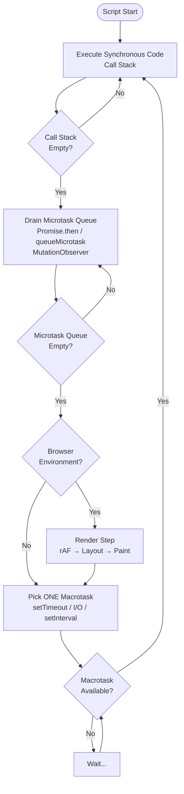
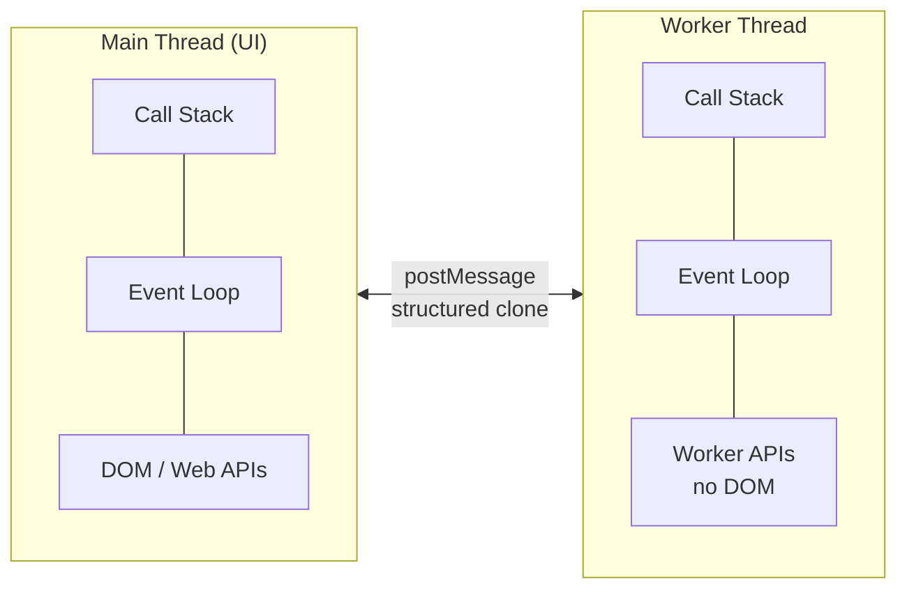

# Chapter 03 — Async JavaScript: Event Loop, Promises, and Async/Await

> Revision notes for experienced JS developers. This is not a tutorial — it is a deep map of every gotcha, edge case, and production trap.

---

## 🔁 The Event Loop — The Full Picture

The event loop is not a JS feature. It is provided by the **host environment** (browser / Node.js). The V8 engine itself has no event loop, no `setTimeout`, no `fetch`. Understanding this distinction changes everything.

### Anatomy of one loop tick

```
┌─────────────────────────────────────────────┐
│               Call Stack                    │
│  (synchronous execution, LIFO)              │
└───────────────────┬─────────────────────────┘
                    │ call stack empties
                    ▼
┌─────────────────────────────────────────────┐
│          Microtask Queue (drain fully)       │
│  Promise.then callbacks                      │
│  queueMicrotask()                            │
│  MutationObserver callbacks                  │
│  await continuations                         │
└───────────────────┬─────────────────────────┘
                    │ microtask queue empty
                    ▼
┌─────────────────────────────────────────────┐
│             Render Step (browser only)       │
│  requestAnimationFrame callbacks             │
│  Layout, Paint, Composite                   │
└───────────────────┬─────────────────────────┘
                    │
                    ▼
┌─────────────────────────────────────────────┐
│          Macrotask Queue (pick ONE)          │
│  setTimeout / setInterval callbacks          │
│  I/O callbacks (Node.js)                     │
│  MessageChannel callbacks                    │
│  setImmediate (Node.js)                      │
└─────────────────────────────────────────────┘
                    │ pick ONE macrotask, push to call stack
                    └──────────────────────────────────► repeat
```

### Mermaid Diagram — Full Event Loop Flow



### The critical rule: Microtasks drain COMPLETELY before the next macrotask

```js
console.log('1 - sync');

setTimeout(() => console.log('2 - macrotask'), 0);

Promise.resolve()
  .then(() => console.log('3 - microtask 1'))
  .then(() => console.log('4 - microtask 2'));

console.log('5 - sync');

// Output: 1, 5, 3, 4, 2
```

Every `.then()` adds to the microtask queue. They all run before `setTimeout` fires — no matter how many there are.

---

## 🕳️ The Starvation Problem

> **Here's the trap most devs fall into:** If microtasks keep scheduling more microtasks, the macrotask queue starves and the UI freezes — even though you never wrote a blocking loop.

```js
// This WILL hang the browser tab
function infiniteMicrotasks() {
  Promise.resolve().then(infiniteMicrotasks);
}
infiniteMicrotasks();
// setTimeout callbacks never fire, requestAnimationFrame never fires
// The page is unresponsive
```

In production, this appears as recursive `.then()` that conditionally re-queues. If the condition is always true due to a bug, you get a silent freeze with no stack overflow.

**Safe alternative for long-running work:**

```js
// Use setTimeout to yield control back to the browser periodically
async function processLargeArray(items) {
  const CHUNK = 500;
  for (let i = 0; i < items.length; i += CHUNK) {
    processChunk(items.slice(i, i + CHUNK));
    // Yield to browser between chunks
    await new Promise(resolve => setTimeout(resolve, 0));
  }
}
```

---

## ⏱️ setTimeout(fn, 0) — It Is Never Actually 0ms

### Why the minimum is 4ms

The HTML spec mandates a minimum delay of **4ms** for nested `setTimeout` calls (depth > 5) and **1ms** for top-level. Browsers clamp throttle background tabs to **1000ms**.

```js
// Measuring the lie
const start = performance.now();
setTimeout(() => {
  console.log(performance.now() - start); // ~1-4ms, not 0
}, 0);
```

### What `setTimeout(fn, 0)` actually means

It means: "Run this callback **after** the current call stack + all microtasks + at least one render opportunity."

**Practical use cases where it is valid:**

| Use Case | Why setTimeout(0) helps |
|---|---|
| Reading DOM after render | Defers until after browser paint |
| Breaking up synchronous work | Yields control to event loop |
| Escaping current execution context | Avoids re-entrant call stacks |
| Compatibility with synchronous APIs | Converts sync callback to async |

```js
// Real-world: read layout after a class toggle
button.addEventListener('click', () => {
  element.classList.add('expanded');
  // Without setTimeout: reads stale layout (class added but no reflow yet)
  // With setTimeout: reads layout AFTER browser has reflowed
  setTimeout(() => {
    const height = element.getBoundingClientRect().height;
    doSomethingWith(height);
  }, 0);
});
```

---

## 📦 Promise Internals — What Actually Happens

### States (sealed, not mutable)

```
pending ──► fulfilled (resolved with value)
        └─► rejected (rejected with reason)
```

A Promise transitions **exactly once**. After settlement, calling resolve/reject again is a no-op — silently ignored, no error thrown.

```js
const p = new Promise((resolve, reject) => {
  resolve(1);
  resolve(2);   // ignored
  reject('err'); // ignored
});
p.then(v => console.log(v)); // 1
```

### The executor runs synchronously

> **Here's the trap most devs fall into:** The Promise constructor executor runs **synchronously**. The callbacks passed to `.then()` are async. Many developers flip these.

```js
console.log('A');

const p = new Promise((resolve) => {
  console.log('B'); // SYNCHRONOUS — runs immediately
  resolve('value');
  console.log('C'); // also synchronous, runs after resolve()
});

p.then(v => console.log('D', v)); // async — queued as microtask

console.log('E');

// Output: A, B, C, E, D value
```

### .then() always returns a NEW Promise

This is how chaining works. The return value of each `.then()` callback becomes the resolved value of the next Promise in the chain.

```js
fetch('/api/user')
  .then(res => res.json())          // returns Promise<parsedBody>
  .then(user => user.profile)       // returns profile object (auto-wrapped in Promise)
  .then(profile => profile.avatar)  // returns string
  .catch(err => handleError(err));
```

**Return value rules inside `.then()`:**

| What you return | Effect on next `.then()` |
|---|---|
| A plain value | Resolves with that value |
| A Promise | Waits for that promise to settle |
| Nothing (undefined) | Resolves with `undefined` |
| Throws an error | Rejects the chain |

> **Here's the trap most devs fall into:** Forgetting to `return` inside `.then()` means the next `.then()` gets `undefined`.

```js
// BUG: forgot return
getUserData(id)
  .then(user => {
    fetchProfile(user.id); // no return!
  })
  .then(profile => {
    console.log(profile); // undefined — fetchProfile result was dropped
  });

// CORRECT
getUserData(id)
  .then(user => fetchProfile(user.id)) // implicit return via arrow shorthand
  .then(profile => console.log(profile));
```

### Error Propagation Through Chains

Errors skip `.then()` callbacks and fall through to the next `.catch()`.

```js
fetch('/api/data')
  .then(res => {
    if (!res.ok) throw new Error(`HTTP ${res.status}`);
    return res.json();
  })
  .then(data => transform(data))   // skipped if fetch or parse threw
  .then(result => save(result))    // skipped if any above threw
  .catch(err => {
    // catches errors from ANY step above
    logger.error('Pipeline failed', { err });
    // if you return here, the chain RECOVERS (next .then() runs)
    // if you throw here, the chain stays rejected
  });
```

### unhandledRejection — The Silent Killer in Production

```js
// This will crash Node.js in newer versions, silently swallow in old ones
async function fetchUser(id) {
  const user = await db.query(`SELECT * FROM users WHERE id = ?`, [id]);
  return user;
}

fetchUser(99999); // no .catch(), no try/catch, no await — unhandled rejection
```

**Node.js:**

```js
process.on('unhandledRejection', (reason, promise) => {
  logger.error('Unhandled Rejection', { reason });
  // In production: alert, then graceful shutdown
  process.exit(1);
});
```

**Browser:**

```js
window.addEventListener('unhandledrejection', (event) => {
  event.preventDefault(); // suppress browser console error
  Sentry.captureException(event.reason);
});
```

---

## 🐛 Common Async Bugs — The Production Minefield

### Bug 1: Forgetting `await` — The Silent Bug

This is the most common async bug in production codebases.

```js
// BUG: returns a Promise, not the value
async function saveUser(userData) {
  const user = db.save(userData); // forgot await
  console.log(user); // Promise { <pending> }
  return user;       // returns the Promise, not the saved user
}

// The CALLER gets a Promise<Promise<User>> not Promise<User>
// TypeScript with strict mode catches this — use it
```

```js
// The insidious version — conditional await
async function processOrder(order) {
  const inventory = checkInventory(order); // should be awaited
  
  if (inventory.available) { // reading .available on a Promise = undefined
    await shipOrder(order);  // always runs because undefined is falsy... wait no
  }
  // inventory is Promise object, inventory.available is undefined
  // `if (undefined)` is false — order never ships
}
```

### Bug 2: await Inside forEach — Does Nothing

> **Here's the trap most devs fall into:** `Array.forEach` does not await async callbacks. The loop completes synchronously; all async operations run in parallel without you knowing.

```js
// BUG: forEach ignores the returned Promises
const userIds = [1, 2, 3, 4, 5];

userIds.forEach(async (id) => {
  await updateUser(id); // these run in parallel, unordered
});
// Code here runs BEFORE any updateUser completes
console.log('done'); // lies — nothing is done
```

```js
// CORRECT: use for...of for sequential
for (const id of userIds) {
  await updateUser(id); // sequential, ordered, properly awaited
}

// OR: use Promise.all for parallel (explicit and intentional)
await Promise.all(userIds.map(id => updateUser(id)));
```

### Bug 3: Mixing await and .then() — Readable Chaos

It works, but it is confusing and error-prone in practice.

```js
// Legal but confusing
async function fetchData() {
  const result = await fetch('/api/data')
    .then(res => res.json())       // .then on the Promise returned by fetch
    .then(data => transform(data)); // chained further
  
  return result; // awaits the whole chain
}

// Prefer one style — pick await OR .then(), not both
async function fetchData() {
  const res = await fetch('/api/data');
  const data = await res.json();
  return transform(data);
}
```

### Bug 4: Top-Level Await in Modules

```js
// module.js — top-level await is valid in ES modules only
const config = await fetch('/config.json').then(r => r.json());
export const API_URL = config.apiUrl;

// Callers that import from this module are implicitly suspended
// The entire module evaluation is async — other modules depending on it wait
// This can slow down startup significantly if not careful
```

> **Here's the trap most devs fall into:** Top-level await blocks the importing module's evaluation. If you have a slow `await` at the top of a commonly-imported utility module, every importer waits.

---

## ⚙️ async/await Desugaring — What the Engine Does

`async/await` compiles to generator-based state machines (conceptually). Understanding this removes the "magic."

```js
async function fetchUser(id) {
  const res = await fetch(`/api/users/${id}`);
  const user = await res.json();
  return user;
}
```

Conceptual desugaring:

```js
function fetchUser(id) {
  return new Promise((resolve, reject) => {
    // Point A: runs synchronously up to first await
    const fetchPromise = fetch(`/api/users/${id}`);
    
    fetchPromise.then(
      (res) => {
        // Point B: runs in microtask after fetch resolves
        const jsonPromise = res.json();
        
        jsonPromise.then(
          (user) => resolve(user),  // Point C: resolves outer Promise
          (err) => reject(err)
        );
      },
      (err) => reject(err)
    );
  });
}
```

**Key implications:**

1. The code before the first `await` runs synchronously.
2. Each `await` suspends the function, returns control to the event loop.
3. The function resumes via a microtask callback when the awaited Promise settles.
4. `return value` from an async function wraps the value in `Promise.resolve(value)`.
5. An uncaught `throw` inside async function rejects the returned Promise.

```js
async function example() {
  console.log('A'); // synchronous
  await Promise.resolve();
  console.log('B'); // microtask — runs after current sync + remaining microtasks
}

console.log('before');
example();
console.log('after');
// Output: before, A, after, B
```

---

## 🏎️ Promise.all — Parallel vs Sequential (The Performance Trap)

### Sequential await in a loop — accidentally O(n) latency

```js
// BAD: 3 requests, each waits for the previous — total time = sum of all latencies
async function loadDashboard(userId) {
  const user    = await fetchUser(userId);      // 200ms
  const posts   = await fetchPosts(userId);     // 300ms
  const friends = await fetchFriends(userId);   // 250ms
  // Total: ~750ms — these are INDEPENDENT! No reason to be sequential
}
```

```js
// GOOD: fire all in parallel — total time = max latency (~300ms)
async function loadDashboard(userId) {
  const [user, posts, friends] = await Promise.all([
    fetchUser(userId),
    fetchPosts(userId),
    fetchFriends(userId),
  ]);
}
```

### Promise API Comparison Table

| API | Behavior | Rejects when | Use case |
|---|---|---|---|
| `Promise.all(arr)` | Waits for all to fulfill | Any one rejects | Parallel independent operations |
| `Promise.allSettled(arr)` | Waits for all to settle | Never rejects | Run all, collect results + errors |
| `Promise.race(arr)` | First to settle wins | First one rejects | Timeout patterns, fastest cache |
| `Promise.any(arr)` | First to FULFILL wins | All reject | Fallback chains, redundant sources |

```js
// Promise.allSettled — production pattern for bulk operations
const results = await Promise.allSettled(
  userIds.map(id => deleteUser(id))
);

const failures = results
  .filter(r => r.status === 'rejected')
  .map(r => r.reason);

if (failures.length > 0) {
  logger.error('Bulk delete partial failure', { failures });
}
```

```js
// Promise.race — request timeout pattern
async function fetchWithTimeout(url, ms = 5000) {
  const timeout = new Promise((_, reject) =>
    setTimeout(() => reject(new Error(`Timeout after ${ms}ms`)), ms)
  );
  
  return Promise.race([fetch(url), timeout]);
}
```

```js
// Promise.any — first successful source wins (CDN fallback)
async function loadScript(name) {
  return Promise.any([
    fetch(`https://cdn1.example.com/${name}`),
    fetch(`https://cdn2.example.com/${name}`),
    fetch(`https://cdn3.example.com/${name}`),
  ]);
  // Uses whichever CDN responds first successfully
  // Fails only if ALL three fail (AggregateError)
}
```

---

## 🚫 AbortController — Cancelling Async Operations

Native cancellation landed in the Fetch API first, but `AbortController` works with any async API that accepts a signal.

```js
// Basic fetch cancellation
const controller = new AbortController();
const { signal } = controller;

async function loadUserData(userId) {
  try {
    const res = await fetch(`/api/users/${userId}`, { signal });
    return await res.json();
  } catch (err) {
    if (err.name === 'AbortError') {
      console.log('Request was cancelled');
      return null; // clean exit, not an error
    }
    throw err; // real error — rethrow
  }
}

// Cancel on unmount (React pattern)
useEffect(() => {
  const controller = new AbortController();
  
  loadUserData(userId, controller.signal)
    .then(setUser)
    .catch(err => {
      if (err.name !== 'AbortError') setError(err);
    });
  
  return () => controller.abort(); // cleanup
}, [userId]);
```

### AbortSignal.timeout() — Static helper (2022+)

```js
// No need to manage controller + setTimeout manually
const res = await fetch('/api/data', {
  signal: AbortSignal.timeout(5000), // auto-aborts after 5s
});
```

### Building abort-aware async functions

```js
// Propagate signal through async call chains
async function processUserData(userId, signal) {
  const user = await fetchUser(userId, { signal });
  
  if (signal.aborted) throw signal.reason; // check between async steps
  
  const profile = await fetchProfile(user.profileId, { signal });
  
  return { user, profile };
}

// Make your own async utility abort-aware
function delay(ms, signal) {
  return new Promise((resolve, reject) => {
    const timer = setTimeout(resolve, ms);
    signal?.addEventListener('abort', () => {
      clearTimeout(timer);
      reject(new DOMException('Aborted', 'AbortError'));
    });
  });
}
```

---

## 🔴 Error Handling — The Complete Picture

### try/catch with async/await

```js
// Pattern 1: catch at the boundary
async function saveOrder(orderData) {
  try {
    const validated = await validate(orderData);
    const saved = await db.orders.create(validated);
    await notifyWarehouse(saved.id);
    return saved;
  } catch (err) {
    // Catches errors from ANY of the three awaits
    if (err instanceof ValidationError) {
      return { error: 'Invalid order data', details: err.fields };
    }
    if (err instanceof DatabaseError) {
      await alertOps('DB write failed', err);
    }
    throw err; // rethrow unknown errors
  }
}
```

```js
// Pattern 2: Go-style tuple (avoids try/catch nesting)
async function safeAsync(promise) {
  try {
    return [null, await promise];
  } catch (err) {
    return [err, null];
  }
}

async function saveOrder(orderData) {
  const [valErr, validated] = await safeAsync(validate(orderData));
  if (valErr) return { error: valErr.message };

  const [dbErr, saved] = await safeAsync(db.orders.create(validated));
  if (dbErr) { await alertOps(dbErr); throw dbErr; }

  return saved;
}
```

### .catch() vs second argument to .then()

> **Here's the trap most devs fall into:** The second argument to `.then(onFulfilled, onRejected)` does NOT catch errors thrown inside `onFulfilled`. `.catch()` is almost always what you want.

```js
// Subtle difference
Promise.reject('original error')
  .then(
    () => { throw new Error('from fulfillment handler'); }, // never runs
    (err) => console.log('caught:', err) // catches 'original error' only
  );

// vs

Promise.reject('original error')
  .then(() => { throw new Error('from fulfillment handler'); }) // never runs
  .catch(err => console.log('caught:', err)); // catches 'original error'

// The difference: if the FULFILLMENT handler throws, .catch() catches it
// but the second argument to .then() does NOT
Promise.resolve('ok')
  .then(
    () => { throw new Error('oops'); }, // this throws
    (err) => console.log('caught:', err) // does NOT catch the above throw
  );
// Unhandled rejection: Error: oops

Promise.resolve('ok')
  .then(() => { throw new Error('oops'); }) // this throws
  .catch(err => console.log('caught:', err)); // catches it correctly
```

### Error handling strategy table

| Scenario | Recommended approach |
|---|---|
| Single async operation | `try/catch` |
| Chain of async steps | `try/catch` around the whole chain |
| Parallel operations where partial failure is ok | `Promise.allSettled` + check `status` |
| Recovery from specific errors | `.catch(err => { if (specific) recover(); else throw err; })` |
| Global safety net | `unhandledRejection` / `unhandledrejection` listener |
| Optional async side effects | `.catch(console.error)` at the end (suppress but log) |

---

## 🌊 Async Iterators and for-await-of

Async iterators let you consume streams, paginated APIs, and real-time data sources naturally.

### Reading a stream with for-await-of

```js
// Node.js stream as async iterator (Node 10+)
import fs from 'fs';

async function processLargeFile(filePath) {
  const stream = fs.createReadStream(filePath, { encoding: 'utf8' });
  
  let lineBuffer = '';
  for await (const chunk of stream) {
    lineBuffer += chunk;
    const lines = lineBuffer.split('\n');
    lineBuffer = lines.pop(); // keep incomplete last line
    
    for (const line of lines) {
      await processLine(line); // process each complete line
    }
  }
  if (lineBuffer) await processLine(lineBuffer); // final incomplete line
}
```

### Paginated API consumption

```js
// Async generator — produces values lazily
async function* paginatedFetch(baseUrl) {
  let cursor = null;
  
  do {
    const url = cursor ? `${baseUrl}?cursor=${cursor}` : baseUrl;
    const res = await fetch(url);
    const { data, nextCursor } = await res.json();
    
    yield* data; // yield each item in the page
    
    cursor = nextCursor;
  } while (cursor);
}

// Consumer — only fetches pages as it needs them
for await (const user of paginatedFetch('/api/users')) {
  await indexUser(user);
  
  if (shouldStop()) break; // clean exit, stops fetching further pages
}
```

### Web Streams API (browser + Node 18+)

```js
// Fetch body is a ReadableStream
const res = await fetch('/large-data');
const reader = res.body.getReader();

// for-await-of over ReadableStream directly (modern browsers)
for await (const chunk of res.body) {
  const text = new TextDecoder().decode(chunk);
  processChunk(text);
}
```

---

## 🔧 Web Workers — True Parallelism

JavaScript is single-threaded — the event loop is single-threaded. Web Workers are a separate thread with their own event loop, their own heap, and no shared memory by default.



### Basic Worker Pattern

```js
// worker.js
self.onmessage = async function(event) {
  const { type, payload } = event.data;
  
  switch (type) {
    case 'COMPUTE': {
      const result = heavyComputation(payload);
      self.postMessage({ type: 'RESULT', result });
      break;
    }
    case 'FETCH_AND_PROCESS': {
      // Workers CAN fetch — they have access to fetch API
      const data = await fetch(payload.url).then(r => r.json());
      const processed = processData(data);
      self.postMessage({ type: 'PROCESSED', data: processed });
      break;
    }
  }
};
```

```js
// main.js — wrapper with Promise interface
class ComputeWorker {
  constructor() {
    this.worker = new Worker('/worker.js');
    this.pending = new Map();
    this.id = 0;
    
    this.worker.onmessage = ({ data }) => {
      const { id, result, error } = data;
      const { resolve, reject } = this.pending.get(id);
      this.pending.delete(id);
      
      error ? reject(new Error(error)) : resolve(result);
    };
  }
  
  compute(payload) {
    return new Promise((resolve, reject) => {
      const id = ++this.id;
      this.pending.set(id, { resolve, reject });
      this.worker.postMessage({ id, type: 'COMPUTE', payload });
    });
  }
  
  terminate() {
    this.worker.terminate();
  }
}

// Usage
const worker = new ComputeWorker();
const result = await worker.compute({ data: largeDataset });
worker.terminate();
```

### When to use Web Workers

| Use case | Worker? | Why |
|---|---|---|
| Image/video processing | Yes | CPU-bound, would block UI |
| Cryptography / hashing | Yes | CPU-bound |
| Large data parsing (CSV, JSON) | Yes | Can block for 100ms+ |
| Compression / decompression | Yes | CPU-bound |
| Network fetches | Usually No | Fetch is async, non-blocking |
| DOM manipulation | No | Workers have no DOM access |
| Simple state management | No | Overhead not worth it |

### SharedArrayBuffer + Atomics — Shared Memory Between Workers

SharedArrayBuffer allows **true shared memory** between main thread and workers. Atomics prevents race conditions.

> Requires COOP/COEP headers due to Spectre mitigations:
> `Cross-Origin-Opener-Policy: same-origin`
> `Cross-Origin-Embedder-Policy: require-corp`

```js
// main.js
const sharedBuffer = new SharedArrayBuffer(4); // 4 bytes = one Int32
const sharedArray = new Int32Array(sharedBuffer);

const worker = new Worker('/worker.js');
worker.postMessage({ sharedBuffer });

// Read the value (eventually written by worker)
// Using Atomics.wait would block — use in worker, not main thread
console.log(Atomics.load(sharedArray, 0)); // atomic read
```

```js
// worker.js
self.onmessage = ({ data }) => {
  const shared = new Int32Array(data.sharedBuffer);
  
  // Atomic operations prevent torn reads/writes
  Atomics.store(shared, 0, 42);            // atomic write
  Atomics.add(shared, 0, 1);              // atomic increment
  Atomics.compareExchange(shared, 0, 43, 100); // CAS operation
  
  // Atomics.wait — blocks the worker thread until notified
  // (main thread cannot use Atomics.wait — would block the UI)
  Atomics.wait(shared, 0, 100); // wait while shared[0] === 100
  
  // Atomics.notify — wake up waiting threads
  Atomics.notify(shared, 0, 1); // wake 1 waiter
};
```

**Production use case — Worker pool for image processing:**

```js
class WorkerPool {
  constructor(workerUrl, poolSize = navigator.hardwareConcurrency) {
    this.workers = Array.from({ length: poolSize }, () => ({
      worker: new Worker(workerUrl),
      busy: false,
    }));
    this.queue = [];
  }
  
  run(payload) {
    return new Promise((resolve, reject) => {
      const task = { payload, resolve, reject };
      const freeWorker = this.workers.find(w => !w.busy);
      
      if (freeWorker) {
        this.dispatch(freeWorker, task);
      } else {
        this.queue.push(task); // wait for a worker to free up
      }
    });
  }
  
  dispatch(workerSlot, task) {
    workerSlot.busy = true;
    workerSlot.worker.onmessage = ({ data }) => {
      task.resolve(data.result);
      workerSlot.busy = false;
      
      if (this.queue.length > 0) {
        this.dispatch(workerSlot, this.queue.shift());
      }
    };
    workerSlot.worker.onerror = (err) => {
      task.reject(err);
      workerSlot.busy = false;
    };
    workerSlot.worker.postMessage(task.payload);
  }
}
```

---

## 🎯 Quick Reference — When to Use What

### Event loop scheduling

| Tool | Queue | Use when |
|---|---|---|
| `queueMicrotask(fn)` | Microtask | Need to run after current sync, before next macrotask |
| `Promise.resolve().then(fn)` | Microtask | Same as above (older pattern) |
| `setTimeout(fn, 0)` | Macrotask | Need to yield to render/other tasks |
| `requestAnimationFrame(fn)` | Before render | DOM updates, animations |
| `requestIdleCallback(fn)` | Idle time | Low-priority background work |
| `MessageChannel` | Macrotask | Faster than setTimeout(0) in some environments |

### Async patterns decision tree

```
Need to run N async tasks?
├─ Are they independent? 
│  ├─ YES → Promise.all() — parallel execution
│  └─ NO (each depends on previous result) → sequential await in for...of
│
Need result of first success?
│  └─ Promise.any()
│
Need ALL results even if some fail?
│  └─ Promise.allSettled()
│
Need to process a stream or paginated source?
│  └─ Async generator + for-await-of
│
Need to cancel mid-flight?
│  └─ AbortController + signal propagation
│
CPU-bound work that will block UI?
│  └─ Web Worker
│
Need shared state between workers?
   └─ SharedArrayBuffer + Atomics
```

---

## 🎤 Interview Deep Cuts

**Q: Why do microtasks run before the next macrotask?**

The event loop spec (WHATWG) defines this explicitly. After each task (macrotask), the agent must perform a "microtask checkpoint" — which means running all microtasks until the queue is empty. This was designed so Promise callbacks have consistent, predictable timing relative to the current task without yielding to the browser render step.

**Q: Can a Promise be resolved with another Promise?**

Yes. When you resolve a Promise with another Promise (a "thenable"), the outer Promise adopts the state of the inner. This is why `async function` that returns a Promise does not double-wrap — the engine "assimilates" it.

```js
const inner = Promise.resolve(42);
const outer = Promise.resolve(inner); // outer adopts inner's state
outer.then(v => console.log(v)); // 42, not Promise{42}
```

**Q: What is the difference between `async function` returning `undefined` vs throwing?**

Both return rejected/fulfilled Promises but with different semantic meaning to callers. `return undefined` → `Promise.resolve(undefined)`. `throw new Error()` → `Promise.reject(error)`.

**Q: Is await just syntactic sugar for .then()?**

Almost but not exactly. `await` interacts with the engine's generator-based suspension mechanism. It also handles the "assimilation" of thenables correctly and integrates with the stack trace in a way that manually using `.then()` does not (native async stack traces are available in V8).

**Q: What happens when you forget to return a value in a .then() handler?**

The handler returns `undefined` implicitly. The next `.then()` in the chain receives `undefined`. No error is thrown — this is a silent correctness bug that TypeScript can catch with strict return checking.

**Q: What is the difference between `Promise.race` and `Promise.any`?**

`race` settles (resolves OR rejects) with the first settled Promise. `any` resolves with the first FULFILLED Promise — it only rejects if ALL reject (throwing `AggregateError`). Use `race` for timeouts. Use `any` for redundant sources where you want first success.

---

*File: `js-notes/03-async-js-event-loop.md` | Chapter 03 of the JS Deep Dive series*
