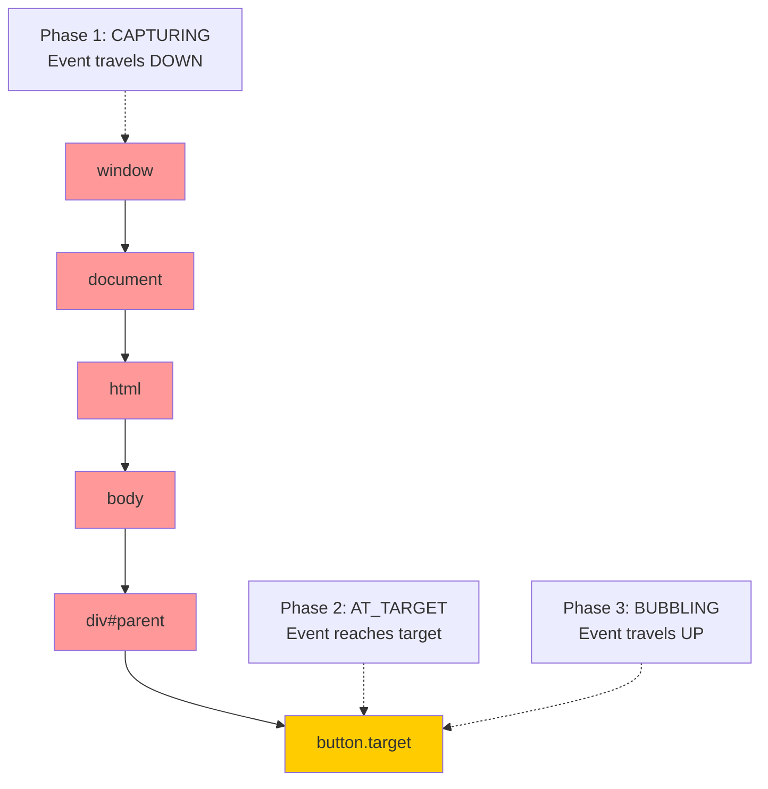
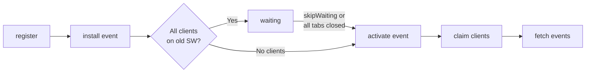
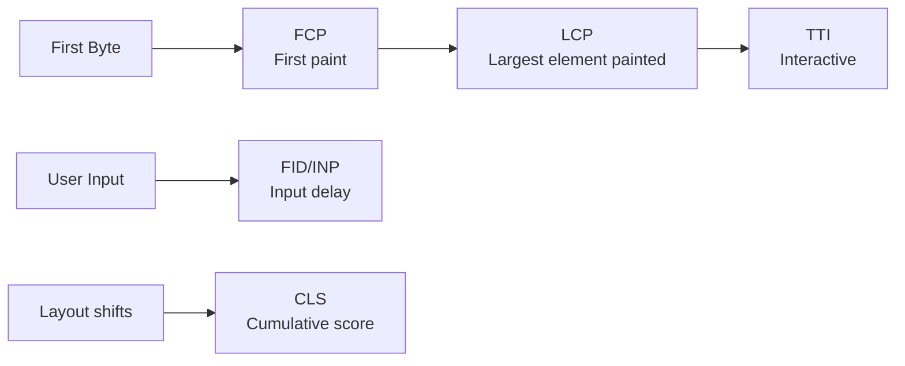

# Chapter 4: DOM, Browser APIs, and Web Platform

> Revision notes for experienced JS developers. Assumes you know the basics — these notes go deep on the WHY, the GOTCHAS, and what actually matters in production.

---

## Table of Contents

1. [DOM Querying — The Performance Myths](#1-dom-querying)
2. [Event System — Three Phases, Propagation, Delegation](#2-event-system)
3. [Observers — Mutation, Resize, Intersection](#3-observers)
4. [Performance APIs — Measuring What Actually Matters](#4-performance-apis)
5. [Fetch API Deep Dive — Streams, Abort, Retry, Dedup](#5-fetch-api)
6. [Storage — Sync Traps, IndexedDB, Cache API](#6-storage)
7. [Service Workers — Strategies, Offline, Push, Sync](#7-service-workers)
8. [Web Vitals — LCP, INP, CLS and Your JS's Role](#8-web-vitals)
9. [rAF and rIC — Animation vs Idle Work](#9-raf-and-ric)
10. [Custom Events and Event Buses](#10-custom-events)

---

## 1. DOM Querying

### querySelector vs getElementById — The Performance Myth

You've probably read that `getElementById` is faster than `querySelector('#id')`. This was true in 2010. Modern engines have optimised selector parsing to the point where the difference is negligible in practice.

```js
// Both of these are fast in 2024
const el = document.getElementById('app');
const el2 = document.querySelector('#app');

// The REAL performance question is: how often are you querying?
```

**Here's the trap most devs fall into:** calling `querySelector` inside event handlers, loops, or render functions — not caching the result.

```js
// BAD — queries the DOM on every keystroke
input.addEventListener('keyup', () => {
  const list = document.querySelector('.results-list'); // DOM query every time
  list.innerHTML = buildResults(input.value);
});

// GOOD — cache outside the handler
const list = document.querySelector('.results-list');
input.addEventListener('keyup', () => {
  list.innerHTML = buildResults(input.value);
});
```

### Live vs Static NodeList — A Production Time-bomb

This is one of the most subtle bugs you'll encounter. `getElementsByTagName`, `getElementsByClassName`, and `element.children` return **live** NodeLists. `querySelectorAll` returns a **static** NodeList.

```js
const live = document.getElementsByClassName('item');  // Live HTMLCollection
const static_ = document.querySelectorAll('.item');    // Static NodeList

// Add an element to the DOM
document.body.insertAdjacentHTML('beforeend', '<div class="item"></div>');

console.log(live.length);    // Automatically updated — reflects new DOM state
console.log(static_.length); // Stale — still the count from when you called it
```

**Production scenario — infinite loop trap:**

```js
// This WILL loop forever
const items = document.getElementsByClassName('item');
for (let i = 0; i < items.length; i++) {
  const clone = items[i].cloneNode(true);
  document.body.appendChild(clone); // items.length grows! Loop never ends
}

// Safe — convert to static array first
const items = [...document.getElementsByClassName('item')];
for (const item of items) {
  document.body.appendChild(item.cloneNode(true));
}
```

| Method | Returns | Live? | Supports Complex Selectors |
|---|---|---|---|
| `getElementById` | Element or null | N/A (single) | No (ID only) |
| `getElementsByClassName` | HTMLCollection | Yes (live) | No |
| `getElementsByTagName` | HTMLCollection | Yes (live) | No |
| `querySelector` | Element or null | N/A (single) | Yes |
| `querySelectorAll` | NodeList | No (static) | Yes |
| `element.children` | HTMLCollection | Yes (live) | N/A |
| `element.childNodes` | NodeList | Yes (live) | N/A |

### When to use `matches`, `closest`, `contains`

```js
// matches — test if element fits a selector (great in delegation)
btn.matches('.primary-btn[data-action]')

// closest — walk up the tree until selector matches (returns null if not found)
const row = td.closest('tr[data-id]'); // works up through shadow DOM boundaries if configured

// contains — check ancestry
table.contains(cell); // true if cell is anywhere inside table
```

**Here's the trap most devs fall into:** `closest` starts at the element itself, not its parent. `closest('.foo')` on an element that IS `.foo` returns itself.

---

## 2. Event System

### The Three Phases



Most devs only know bubbling. Capturing (`addEventListener(event, handler, true)` or `{ capture: true }`) fires during the downward traversal — before any child handler fires.

```js
// Real use case for capturing: analytics that must fire before handler can stopPropagation
document.addEventListener('click', trackClick, { capture: true });

function trackClick(e) {
  analytics.track('click', {
    target: e.target.dataset.trackId,
    path: e.composedPath().map(el => el.tagName).join('>')
  });
  // Don't stopPropagation — let the event continue to children
}
```

### stopPropagation vs stopImmediatePropagation vs preventDefault

**Here's the trap most devs fall into:** these three do completely different things and mixing them up silently breaks event handling.

```js
btn.addEventListener('click', (e) => {
  e.preventDefault();
  // Stops default browser action (form submit, link navigation, checkbox toggle)
  // Does NOT stop propagation — parent handlers still fire
});

btn.addEventListener('click', (e) => {
  e.stopPropagation();
  // Stops the event from bubbling to parent elements
  // Other handlers ON THIS SAME ELEMENT still fire
});

btn.addEventListener('click', (e) => {
  e.stopImmediatePropagation();
  // Stops propagation AND prevents other handlers on THIS element from firing
  // Order matters: handlers registered before this one already ran
});
```

**Production scenario — modal close on outside click:**

```js
// Common but fragile implementation
document.addEventListener('click', closeModal);
modal.addEventListener('click', (e) => e.stopPropagation()); // Trap!

// Problem: stopPropagation breaks analytics, accessibility tools, other listeners
// Better approach: use the target check
document.addEventListener('click', (e) => {
  if (!modal.contains(e.target)) {
    closeModal();
  }
});
```

### Event Delegation — Why It's More Than Just Performance

Delegation isn't just about attaching fewer listeners. It's about **handling elements that don't exist yet**.

```js
// Naive: attach listener to every row — breaks when rows are added dynamically
document.querySelectorAll('.data-row').forEach(row => {
  row.addEventListener('click', handleRowClick);
});

// Delegation: one listener, works for all current AND future rows
const table = document.querySelector('#data-table');

table.addEventListener('click', (e) => {
  const row = e.target.closest('[data-row-id]');
  if (!row) return; // click was on table chrome, not a row

  const action = e.target.closest('[data-action]')?.dataset.action;
  
  if (action === 'delete') deleteRow(row.dataset.rowId);
  else if (action === 'edit') openEditor(row.dataset.rowId);
  else selectRow(row.dataset.rowId);
});
```

**Performance reality:** Delegation reduces memory (fewer closures), but adds a tiny overhead per event (walking up with `closest`). For thousands of rows this is clearly worth it. For 5 static items, the difference is irrelevant — choose for maintainability.

### Passive Event Listeners — The Scroll Jank Killer

Before passive listeners, the browser had to wait for your `touchmove`/`wheel` handler to finish before it could scroll — because you might call `preventDefault()` to block scrolling. This caused scroll jank.

```js
// Old way — browser blocks scroll until JS finishes executing
window.addEventListener('touchmove', handler);

// New way — tells browser "I won't call preventDefault, scroll freely"
window.addEventListener('touchmove', handler, { passive: true });

// If you try to call preventDefault inside a passive listener, you get a console warning
// and it's ignored — which is the correct behaviour
```

**Here's the trap most devs fall into:** Chrome made some event listeners passive by default (touchstart, touchmove on window/document). If you need to actually prevent scrolling (e.g., dragging a carousel), you must explicitly opt out:

```js
element.addEventListener('touchmove', (e) => {
  if (isDragging) e.preventDefault(); // block scroll
}, { passive: false }); // explicitly not passive
```

| Option | When to Use |
|---|---|
| `{ passive: true }` | touch/wheel handlers that never call preventDefault — scroll performance |
| `{ passive: false }` | drag interactions where you need to block native scroll |
| `{ once: true }` | one-shot handlers (init animations, one-time consent) |
| `{ signal: controller.signal }` | cleanup without tracking the function reference |

```js
// { signal } pattern — clean AbortController-based cleanup
const ac = new AbortController();
document.addEventListener('click', handler, { signal: ac.signal });
document.addEventListener('keydown', handler, { signal: ac.signal });
// Remove ALL of them at once:
ac.abort();
```

---

## 3. Observers

### MutationObserver — Watching the DOM Change

```js
const observer = new MutationObserver((mutations) => {
  for (const mutation of mutations) {
    if (mutation.type === 'childList') {
      mutation.addedNodes.forEach(node => {
        if (node.nodeType === Node.ELEMENT_NODE) {
          // React-style: initialize new elements
          initializeComponent(node);
        }
      });
    }
    if (mutation.type === 'attributes') {
      console.log(`${mutation.attributeName} changed to ${mutation.target.getAttribute(mutation.attributeName)}`);
    }
  }
});

observer.observe(document.body, {
  childList: true,      // watch for added/removed children
  subtree: true,        // watch all descendants, not just direct children
  attributes: true,     // watch attribute changes
  attributeFilter: ['data-theme', 'aria-expanded'], // only these attrs
  characterData: true,  // watch text node changes
  attributeOldValue: true,  // include previous attribute value
  characterDataOldValue: true,
});

// Always disconnect when done — MutationObserver holds a strong reference
observer.disconnect();
```

**How React uses this concept:** React's reconciler doesn't use MutationObserver (it controls its own DOM updates), but third-party libraries use it to detect when React mounts components into the DOM — for things like initializing charts or maps that live outside React's tree.

**Production use case — auto-initializing web components:**

```js
// Initialize any custom elements added dynamically (e.g., by a CMS)
const mo = new MutationObserver((mutations) => {
  mutations
    .flatMap(m => [...m.addedNodes])
    .filter(n => n.nodeType === Node.ELEMENT_NODE)
    .flatMap(n => [n, ...n.querySelectorAll('[data-widget]')])
    .forEach(el => {
      if (!el.dataset.widgetInit) {
        initWidget(el);
        el.dataset.widgetInit = 'true';
      }
    });
});

mo.observe(document.body, { childList: true, subtree: true });
```

**Here's the trap most devs fall into:** MutationObserver callbacks fire asynchronously (microtask queue after the current task), but mutations within a callback are synchronous — you can cause an infinite loop if you're not careful:

```js
// INFINITE LOOP — observer fires, handler adds class, which triggers observer again
observer.observe(el, { attributes: true });
observer.callback = () => el.classList.add('observed'); // adds attribute = triggers again!

// Fix: check before mutating
observer.callback = () => {
  if (!el.classList.contains('observed')) {
    el.classList.add('observed');
  }
};
```

### ResizeObserver — Replacing Fragile Resize Hacks

Before ResizeObserver, detecting element size changes meant listening to `window.resize` (misses CSS changes, container queries, font changes) or polling with `setInterval` (terrible).

```js
const ro = new ResizeObserver((entries) => {
  for (const entry of entries) {
    // entry.contentRect — legacy, border-box excluded
    // entry.borderBoxSize — includes padding and border
    // entry.contentBoxSize — content only
    const { inlineSize: width, blockSize: height } = entry.contentBoxSize[0];
    
    // Logical properties — inlineSize = width in horizontal writing modes
    updateChart(entry.target, width, height);
  }
});

ro.observe(chartContainer);
// ro.unobserve(el) or ro.disconnect()
```

**Here's the trap most devs fall into:** ResizeObserver callbacks can cause layout thrashing if you read layout properties inside them and then write. The callback itself runs after layout, so reading inside is safe — but be careful about forced synchronous layouts when you write.

```js
// Safe pattern — batch reads and writes
const ro = new ResizeObserver((entries) => {
  // All reads happen here (no forced layout)
  const updates = entries.map(entry => ({
    el: entry.target,
    width: entry.contentBoxSize[0].inlineSize
  }));
  
  // Schedule writes via rAF to avoid forced synchronous layout
  requestAnimationFrame(() => {
    updates.forEach(({ el, width }) => {
      el.style.setProperty('--width', `${width}px`);
    });
  });
});
```

### IntersectionObserver — The Scroll Event Killer

`scroll` events fire dozens of times per second and force layout recalculation. IntersectionObserver is async and browser-optimised — it reports intersections without blocking the main thread.

```js
// Lazy loading images — the production pattern
const imageObserver = new IntersectionObserver((entries) => {
  entries.forEach(entry => {
    if (entry.isIntersecting) {
      const img = entry.target;
      img.src = img.dataset.src;
      img.removeAttribute('data-src');
      imageObserver.unobserve(img); // stop watching once loaded
    }
  });
}, {
  root: null,           // null = viewport
  rootMargin: '200px',  // load 200px before entering viewport
  threshold: 0          // fire as soon as ANY pixel is visible
});

document.querySelectorAll('img[data-src]').forEach(img => imageObserver.observe(img));
```

**Infinite scroll — production pattern:**

```js
// Sentinel element approach — more reliable than watching last item
const sentinel = document.querySelector('#load-more-sentinel');

const infiniteScroll = new IntersectionObserver(async (entries) => {
  if (!entries[0].isIntersecting || isLoading) return;
  
  isLoading = true;
  try {
    const newItems = await fetchNextPage(currentPage++);
    if (newItems.length === 0) {
      infiniteScroll.disconnect(); // No more data
      sentinel.remove();
      return;
    }
    renderItems(newItems);
  } finally {
    isLoading = false;
  }
}, { threshold: 0.1 });

infiniteScroll.observe(sentinel);
```

**Threshold array — fire at multiple points:**

```js
// Fire callback when 0%, 25%, 50%, 75%, 100% of element is visible
const observer = new IntersectionObserver(handleVisibility, {
  threshold: [0, 0.25, 0.5, 0.75, 1.0]
});
// entry.intersectionRatio tells you which threshold was crossed
```

---

## 4. Performance APIs

### performance.now() — Why Not Date.now()

`Date.now()` returns milliseconds since epoch. `performance.now()` returns milliseconds since the page navigation, with **sub-millisecond precision** (typically ~5µs resolution), and is not affected by system clock adjustments.

```js
// Measuring actual function execution time
const start = performance.now();
doExpensiveWork();
const duration = performance.now() - start;
console.log(`Took ${duration.toFixed(3)}ms`);

// Date.now() can jump backward (NTP sync) or have 1ms resolution
// performance.now() is monotonic — always increases, sub-ms resolution
```

**Security note:** Browsers deliberately reduce `performance.now()` precision to mitigate Spectre-class attacks. You get ~100µs resolution without `COOP`/`COEP` headers, and ~5µs with them (required for SharedArrayBuffer too).

### PerformanceObserver — Real-time Metrics Collection

```js
// Observe multiple entry types
const observer = new PerformanceObserver((list) => {
  list.getEntries().forEach(entry => {
    switch (entry.entryType) {
      case 'longtask':
        console.warn(`Long task: ${entry.duration}ms`, entry.attribution);
        break;
      case 'largest-contentful-paint':
        reportMetric('LCP', entry.startTime);
        break;
      case 'layout-shift':
        if (!entry.hadRecentInput) {
          cumulativeLayoutShift += entry.value;
        }
        break;
      case 'first-input':
        reportMetric('FID', entry.processingStart - entry.startTime);
        break;
    }
  });
});

observer.observe({
  entryTypes: ['longtask', 'largest-contentful-paint', 'layout-shift', 'first-input']
});
```

**PerformanceEntry types and what they tell you:**

| Entry Type | What it Measures | Key Properties |
|---|---|---|
| `navigation` | Page load timing | `domContentLoadedEventEnd`, `loadEventEnd` |
| `resource` | Network requests | `duration`, `transferSize`, `initiatorType` |
| `longtask` | JS blocking > 50ms | `duration`, `attribution[].name` |
| `largest-contentful-paint` | LCP element timing | `startTime`, `element`, `size` |
| `layout-shift` | CLS contributions | `value`, `hadRecentInput` |
| `first-input` | FID measurement | `processingStart`, `startTime` |
| `element` | Element timing API | `renderTime`, `loadTime` |
| `paint` | FP/FCP | `name`, `startTime` |

### Long Tasks API — Finding JS That Blocks the Main Thread

Any task > 50ms blocks the main thread and is classified as a "long task". These directly cause FID/INP degradation.

```js
const longTaskObserver = new PerformanceObserver((list) => {
  list.getEntries().forEach(entry => {
    // attribution tells you which script caused it
    const culprit = entry.attribution?.[0];
    
    reportToMonitoring({
      type: 'long-task',
      duration: entry.duration,
      script: culprit?.name,
      container: culprit?.containerType, // 'window', 'iframe', 'embed'
      startTime: entry.startTime
    });
  });
});

longTaskObserver.observe({ entryTypes: ['longtask'] });
```

**Here's the trap most devs fall into:** Long tasks show up in DevTools Performance panel as red blocks, but you won't catch them in production without PerformanceObserver. Always ship real-user monitoring (RUM) to capture long tasks in the wild.

---

## 5. Fetch API

### Request and Response Objects

Fetch isn't just a nicer XHR. Understanding `Request` and `Response` as first-class objects lets you build interceptors, cache layers, and retry logic properly.

```js
// Request object — reusable, immutable once constructed
const request = new Request('/api/data', {
  method: 'POST',
  headers: new Headers({
    'Content-Type': 'application/json',
    'X-Request-ID': crypto.randomUUID()
  }),
  body: JSON.stringify(payload),
  credentials: 'include',  // send cookies cross-origin
  cache: 'no-store',       // bypass HTTP cache
  signal: controller.signal
});

// Clone before reading body — a Request/Response body can only be consumed once
const reqClone = request.clone();
const body = await request.json(); // consumes the body
// request.json() again would throw — body already read

const response = await fetch(reqClone);
```

**Here's the trap most devs fall into:** `fetch` only rejects on network failure. A 404 or 500 response is a **resolved** promise. You must check `response.ok` or `response.status`.

```js
// Wrong — no status check
const data = await fetch('/api').then(r => r.json());

// Right — check ok before consuming body
async function fetchJSON(url, options) {
  const res = await fetch(url, options);
  if (!res.ok) {
    const error = new Error(`HTTP ${res.status}: ${res.statusText}`);
    error.status = res.status;
    error.response = res;
    throw error;
  }
  return res.json();
}
```

### Streaming Response Body

For large responses (file downloads, AI text generation, large datasets), streaming lets you process data as it arrives instead of buffering everything.

```js
// Stream an LLM response (OpenAI-style)
async function* streamCompletion(prompt) {
  const res = await fetch('/api/complete', {
    method: 'POST',
    body: JSON.stringify({ prompt }),
    headers: { 'Content-Type': 'application/json' }
  });

  const reader = res.body.getReader();
  const decoder = new TextDecoder();
  
  try {
    while (true) {
      const { done, value } = await reader.read();
      if (done) break;
      
      const chunk = decoder.decode(value, { stream: true });
      // Parse SSE format: "data: {token}\n\n"
      for (const line of chunk.split('\n')) {
        if (line.startsWith('data: ')) {
          const data = line.slice(6);
          if (data !== '[DONE]') yield JSON.parse(data);
        }
      }
    }
  } finally {
    reader.releaseLock();
  }
}

// Consumer
for await (const token of streamCompletion('Hello')) {
  appendToUI(token.text);
}
```

### AbortController — Cancelling Requests

```js
class ApiClient {
  #pendingRequests = new Map();

  async get(url) {
    // Cancel any pending request to the same URL
    this.#pendingRequests.get(url)?.abort();
    
    const controller = new AbortController();
    this.#pendingRequests.set(url, controller);
    
    try {
      const res = await fetch(url, { signal: controller.signal });
      return await res.json();
    } catch (err) {
      if (err.name === 'AbortError') return null; // cancelled — not an error
      throw err;
    } finally {
      this.#pendingRequests.delete(url);
    }
  }
}
```

**Timeout with AbortController:**

```js
// AbortSignal.timeout() — native timeout without manual cleanup
const res = await fetch('/api/slow', {
  signal: AbortSignal.timeout(5000) // abort after 5s
});

// Combining signals — abort on timeout OR user cancel
const userAC = new AbortController();
const combinedSignal = AbortSignal.any([
  AbortSignal.timeout(5000),
  userAC.signal
]);
```

### Retry with Exponential Backoff

```js
async function fetchWithRetry(url, options = {}, retries = 3) {
  const { retryOn = [429, 503], backoff = 300 } = options;
  
  for (let attempt = 0; attempt <= retries; attempt++) {
    try {
      const res = await fetch(url, options);
      
      if (retryOn.includes(res.status) && attempt < retries) {
        const retryAfter = res.headers.get('Retry-After');
        const delay = retryAfter
          ? parseInt(retryAfter) * 1000
          : backoff * 2 ** attempt + Math.random() * 100; // jitter
        
        await new Promise(resolve => setTimeout(resolve, delay));
        continue;
      }
      
      return res;
    } catch (err) {
      if (err.name === 'AbortError' || attempt === retries) throw err;
      await new Promise(resolve => setTimeout(resolve, backoff * 2 ** attempt));
    }
  }
}
```

### Request Deduplication

```js
// Prevent duplicate in-flight requests for the same resource
class RequestCache {
  #inflight = new Map();

  async fetch(url, options) {
    const key = `${options?.method ?? 'GET'}:${url}`;
    
    if (this.#inflight.has(key)) {
      return this.#inflight.get(key); // return same promise to all callers
    }
    
    const promise = fetch(url, options)
      .finally(() => this.#inflight.delete(key));
    
    this.#inflight.set(key, promise);
    return promise;
  }
}

// All callers get the SAME promise — one network request, multiple consumers
const client = new RequestCache();
const [a, b, c] = await Promise.all([
  client.fetch('/api/user'),
  client.fetch('/api/user'), // deduplicated
  client.fetch('/api/user')  // deduplicated
]);
```

---

## 6. Storage

### localStorage / sessionStorage — The Sync Tax

**Here's the trap most devs fall into:** localStorage is synchronous and runs on the main thread. A single `localStorage.setItem` call with a large value can block rendering.

```js
// BLOCKING — 5MB write blocks main thread
localStorage.setItem('huge-data', JSON.stringify(massiveObject));

// Measurement
const start = performance.now();
localStorage.setItem('test', 'x'.repeat(1024 * 1024)); // 1MB
console.log(`localStorage write: ${performance.now() - start}ms`); // Can be 10-100ms
```

| | localStorage | sessionStorage | IndexedDB | Cache API |
|---|---|---|---|---|
| Scope | Origin, persistent | Origin, tab | Origin, persistent | Origin (SW) |
| Limit | ~5MB | ~5MB | Hundreds of MB | Quota-based |
| Async | No (blocks) | No (blocks) | Yes | Yes |
| Workers | No | No | Yes | Yes |
| Structured data | No (strings) | No (strings) | Yes (any) | Request/Response |
| Use case | Small preferences | Session state | Large/complex data | Network responses |

**Safe localStorage patterns:**

```js
// Always wrap in try/catch — can throw in private browsing or when full
function safeSet(key, value) {
  try {
    localStorage.setItem(key, JSON.stringify(value));
    return true;
  } catch (err) {
    if (err.name === 'QuotaExceededError') {
      // Evict old items or degrade gracefully
      console.warn('Storage quota exceeded');
    }
    return false;
  }
}

// storage event — cross-tab communication
window.addEventListener('storage', (e) => {
  // Fires in OTHER tabs when localStorage changes (not the tab that changed it)
  if (e.key === 'auth-token' && !e.newValue) {
    logout(); // Another tab logged out
  }
});
```

### IndexedDB — Async, Large, Powerful (and Verbose)

Raw IndexedDB API is notoriously verbose. In production, use `idb` (Jakub Fiala's wrapper) or `Dexie.js`. But knowing the underlying model matters:

```js
// Raw IDB — understand the structure
const dbPromise = new Promise((resolve, reject) => {
  const request = indexedDB.open('my-app', 2); // name, version
  
  request.onupgradeneeded = (event) => {
    const db = event.target.result;
    const oldVersion = event.oldVersion;
    
    if (oldVersion < 1) {
      const store = db.createObjectStore('posts', { keyPath: 'id' });
      store.createIndex('by-date', 'createdAt'); // index for queries
    }
    if (oldVersion < 2) {
      // Migration from v1 to v2
      db.createObjectStore('comments', { autoIncrement: true });
    }
  };
  
  request.onsuccess = () => resolve(request.result);
  request.onerror = () => reject(request.error);
});

// Using idb wrapper (production)
import { openDB } from 'idb';

const db = await openDB('my-app', 2, {
  upgrade(db, oldVersion) {
    if (oldVersion < 1) {
      db.createObjectStore('posts', { keyPath: 'id' });
    }
  }
});

// CRUD
await db.put('posts', { id: '1', title: 'Hello', createdAt: Date.now() });
const post = await db.get('posts', '1');
const allPosts = await db.getAll('posts');
await db.delete('posts', '1');
```

### Cache API — Service Worker's Storage Layer

The Cache API stores `Request`/`Response` pairs. It's available in Service Workers AND in the main thread.

```js
// Main thread usage (not just SW)
const cache = await caches.open('api-v1');

// Cache a response
const response = await fetch('/api/config');
await cache.put('/api/config', response);

// Read from cache
const cached = await cache.match('/api/config');
if (cached) {
  return cached.json();
}

// caches.match — searches all caches
const match = await caches.match(request);
```

---

## 7. Service Workers

### Registration and Lifecycle



```js
// main thread registration
if ('serviceWorker' in navigator) {
  const reg = await navigator.serviceWorker.register('/sw.js', {
    scope: '/',       // what paths the SW controls
    updateViaCache: 'none'  // always revalidate SW file itself
  });
  
  // Listen for updates
  reg.addEventListener('updatefound', () => {
    const newSW = reg.installing;
    newSW.addEventListener('statechange', () => {
      if (newSW.state === 'installed' && navigator.serviceWorker.controller) {
        showUpdateBanner(); // Prompt user to refresh
      }
    });
  });
}

// Force skip waiting from main thread (after user confirms update)
async function activateUpdate() {
  const reg = await navigator.serviceWorker.getRegistration();
  reg.waiting?.postMessage({ type: 'SKIP_WAITING' });
}

navigator.serviceWorker.addEventListener('controllerchange', () => {
  window.location.reload(); // New SW activated — refresh for consistency
});
```

### Cache Strategies

```js
// sw.js

// 1. Cache First — great for static assets (JS, CSS, fonts)
async function cacheFirst(request) {
  const cached = await caches.match(request);
  if (cached) return cached;
  
  const response = await fetch(request);
  const cache = await caches.open('static-v1');
  cache.put(request, response.clone()); // clone — body can only be read once
  return response;
}

// 2. Network First — great for API calls where freshness matters
async function networkFirst(request, { timeout = 3000 } = {}) {
  const cache = await caches.open('api-v1');
  
  try {
    const controller = new AbortController();
    const timeoutId = setTimeout(() => controller.abort(), timeout);
    
    const response = await fetch(request, { signal: controller.signal });
    clearTimeout(timeoutId);
    
    if (response.ok) cache.put(request, response.clone());
    return response;
  } catch {
    const cached = await cache.match(request);
    if (cached) return cached;
    throw new Error('Offline and no cache');
  }
}

// 3. Stale-While-Revalidate — serve stale, update in background
async function staleWhileRevalidate(request) {
  const cache = await caches.open('content-v1');
  const cached = await cache.match(request);
  
  // Kick off network request regardless
  const networkPromise = fetch(request).then(response => {
    if (response.ok) cache.put(request, response.clone());
    return response;
  });
  
  return cached ?? networkPromise; // serve cache immediately, or wait for network
}

// fetch event handler
self.addEventListener('fetch', (event) => {
  const { request } = event;
  const url = new URL(request.url);
  
  if (url.pathname.startsWith('/api/')) {
    event.respondWith(networkFirst(request));
  } else if (/\.(js|css|woff2)$/.test(url.pathname)) {
    event.respondWith(cacheFirst(request));
  } else {
    event.respondWith(staleWhileRevalidate(request));
  }
});
```

### Background Sync and Push

```js
// sw.js — Background Sync (retry failed requests when back online)
self.addEventListener('sync', async (event) => {
  if (event.tag === 'post-form-data') {
    event.waitUntil(replayQueuedRequests());
  }
});

// Registration (main thread)
async function queueFormSubmit(data) {
  // Store in IDB for retry
  await db.put('outbox', { id: Date.now(), data });
  
  const reg = await navigator.serviceWorker.ready;
  await reg.sync.register('post-form-data');
  // Browser will call the sync event when online (even if tab is closed)
}

// Push Notifications
self.addEventListener('push', (event) => {
  const data = event.data?.json() ?? {};
  
  event.waitUntil(
    self.registration.showNotification(data.title, {
      body: data.body,
      icon: '/icon-192.png',
      badge: '/badge-72.png',
      data: { url: data.url },
      actions: [
        { action: 'view', title: 'View' },
        { action: 'dismiss', title: 'Dismiss' }
      ]
    })
  );
});

self.addEventListener('notificationclick', (event) => {
  event.notification.close();
  if (event.action === 'view') {
    event.waitUntil(clients.openWindow(event.notification.data.url));
  }
});
```

**Here's the trap most devs fall into:** `event.waitUntil()` in Service Workers is not optional. If you do async work without it, the browser can terminate the SW before the work completes. Always wrap async operations in `waitUntil`.

---

## 8. Web Vitals

### What They Actually Measure



| Metric | Measures | Good | Poor | Your JS's Impact |
|---|---|---|---|---|
| LCP | Time to paint largest visible element | < 2.5s | > 4s | Blocking scripts delay LCP |
| INP | Worst interaction-to-paint delay | < 200ms | > 500ms | Long tasks, heavy event handlers |
| CLS | Sum of unexpected layout shifts | < 0.1 | > 0.25 | DOM insertions without size reservation |

### LCP — What Blocks It

```js
// BAD — render-blocking script delays LCP
<script src="analytics.js"></script> // blocks HTML parsing

// GOOD — defer/async non-critical scripts
<script src="analytics.js" defer></script>   // executes after parse, before DOMContentLoaded
<script src="widget.js" async></script>      // executes as soon as downloaded (order not guaranteed)
<script type="module" src="app.js"></script> // deferred by default

// Preload the LCP resource if it's discovered late
<link rel="preload" href="/hero.jpg" as="image" fetchpriority="high">
```

### INP — Interaction to Next Paint

INP replaced FID in March 2024. FID only measured the FIRST interaction's input delay. INP measures ALL interactions and reports the worst one.

```js
// Heavy event handler — bad for INP
button.addEventListener('click', async () => {
  // ALL of this runs before the next paint — blocks visual feedback
  const data = await fetch('/api/complex');
  const processed = processHeavyData(data); // 200ms long task = bad INP
  renderResults(processed);
});

// Good INP — break work, show feedback immediately
button.addEventListener('click', async () => {
  // 1. Immediate visual feedback (user sees response fast)
  button.disabled = true;
  showSpinner();
  
  // 2. Yield to browser — allows a paint
  await scheduler.yield(); // or: await new Promise(r => setTimeout(r, 0));
  
  // 3. Do heavy work after paint
  const data = await fetch('/api/complex');
  const processed = await processInChunks(data); // break into tasks
  renderResults(processed);
  
  button.disabled = false;
  hideSpinner();
});

// processInChunks — yield between chunks to avoid long tasks
async function processInChunks(items, chunkSize = 100) {
  const results = [];
  for (let i = 0; i < items.length; i += chunkSize) {
    const chunk = items.slice(i, i + chunkSize);
    results.push(...chunk.map(processItem));
    
    if (i + chunkSize < items.length) {
      await scheduler.yield(); // yield after each chunk
    }
  }
  return results;
}
```

### CLS — Layout Shifts From JS

```js
// Layout shifts caused by JS:

// 1. Inserting content above existing content
document.body.prepend(cookieBanner); // Pushes everything down — CLS!

// Fix: reserve space, use position:fixed, or show inline at end
cookieBanner.style.position = 'fixed';
cookieBanner.style.bottom = '0';

// 2. Late image/ad loading without dimensions
const img = new Image();
img.src = '/hero.jpg';
container.appendChild(img); // No width/height — causes shift when loaded

// Fix: always set width/height or use aspect-ratio
img.width = 1200;
img.height = 630;
// or CSS: aspect-ratio: 1200/630

// 3. Web font loading causing FOUT
// Use font-display: optional or font-display: swap + size-adjust
@font-face {
  font-family: 'CustomFont';
  src: url('/font.woff2') format('woff2');
  font-display: optional; // no FOUT, no CLS — just uses fallback if not ready
  size-adjust: 98%; // reduce shift if swap is used
}
```

---

## 9. rAF and rIC

### requestAnimationFrame — The Rendering Loop

`rAF` fires before the browser paints, synchronized with the display refresh rate (typically 60fps = ~16.6ms budget). Use it for visual updates.

```js
// Animation loop
function animate(timestamp) {
  const elapsed = timestamp - startTime;
  const progress = Math.min(elapsed / duration, 1);
  
  element.style.transform = `translateX(${lerp(start, end, easeOut(progress))}px)`;
  
  if (progress < 1) {
    requestAnimationFrame(animate);
  }
}

const startTime = performance.now();
requestAnimationFrame(animate);

// rAF is paused when tab is hidden — perfect for animations, but don't rely on
// it for timers (use setTimeout for actual time-based logic)
```

**Here's the trap most devs fall into:** reading layout properties and writing inside the same rAF callback causes forced synchronous layouts (layout thrashing). Separate reads and writes.

```js
// THRASHING — browser must recalculate layout between each read/write
elements.forEach(el => {
  const height = el.offsetHeight; // FORCE LAYOUT
  el.style.height = `${height * 2}px`; // WRITE
  const width = el.offsetWidth;  // FORCE LAYOUT again
  el.style.width = `${width * 2}px`;   // WRITE
});

// CORRECT — batch reads, then writes
requestAnimationFrame(() => {
  // Phase 1: all reads
  const measurements = elements.map(el => ({
    el,
    height: el.offsetHeight,
    width: el.offsetWidth
  }));
  
  // Phase 2: all writes (no forced layout between them)
  measurements.forEach(({ el, height, width }) => {
    el.style.height = `${height * 2}px`;
    el.style.width = `${width * 2}px`;
  });
});
```

### requestIdleCallback — Background Work

`rIC` fires when the browser is idle — after all pending tasks, rAF callbacks, and paint are done. Use it for non-urgent work.

```js
// Good uses for rIC: analytics, prefetching, non-critical setup
function prefetchNextPage() {
  requestIdleCallback((deadline) => {
    // deadline.timeRemaining() — how many ms we have before browser needs thread back
    // deadline.didTimeout — true if we used the timeout option and it expired
    
    while (deadline.timeRemaining() > 0 && prefetchQueue.length > 0) {
      const url = prefetchQueue.shift();
      fetch(url, { priority: 'low' }); // don't await — fire and forget
    }
    
    if (prefetchQueue.length > 0) {
      requestIdleCallback(prefetchNextPage); // continue next idle period
    }
  }, { timeout: 2000 }); // force run within 2s even if not idle
}
```

| | `requestAnimationFrame` | `requestIdleCallback` |
|---|---|---|
| When it fires | Before each paint (~16.6ms) | When browser is idle |
| Use for | Visual updates, animations | Analytics, prefetch, cleanup |
| Budget | ~16ms (one frame) | deadline.timeRemaining() |
| Safari support | Full | No (polyfill needed) |
| Priority | High (display sync) | Low (best-effort) |

**Safari workaround for rIC:**

```js
const ric = window.requestIdleCallback || ((cb) => setTimeout(() => cb({
  timeRemaining: () => 50,
  didTimeout: false
}), 1));
```

---

## 10. Custom Events and Event Buses

### Custom Events with dispatchEvent

```js
// Creating and dispatching custom events
const event = new CustomEvent('user:login', {
  detail: { userId: '123', roles: ['admin'] },
  bubbles: true,     // bubbles up the DOM tree
  cancelable: true,  // allows preventDefault
  composed: true     // crosses shadow DOM boundaries
});

// Dispatch on a specific element (bubbles to document/window)
loginButton.dispatchEvent(event);

// Listen anywhere in the bubble chain
document.addEventListener('user:login', (e) => {
  const { userId, roles } = e.detail;
  initUserSession(userId, roles);
});

// Cancel it if needed
loginButton.addEventListener('user:login', (e) => {
  if (!isValidSession()) {
    e.preventDefault(); // only works if cancelable: true
  }
});

// Check if it was cancelled
const wasCancelled = !loginButton.dispatchEvent(event);
```

### Building a Production Event Bus

```js
// Type-safe event bus using CustomEvent under the hood
class EventBus {
  #target = new EventTarget();
  #listeners = new Map();

  on(event, handler, options) {
    // Wrap handler so we can remove by original reference
    const wrapped = (e) => handler(e.detail);
    
    if (!this.#listeners.has(handler)) {
      this.#listeners.set(handler, new Map());
    }
    this.#listeners.get(handler).set(event, wrapped);
    
    this.#target.addEventListener(event, wrapped, options);
    
    // Return unsubscribe function
    return () => this.off(event, handler);
  }

  once(event, handler) {
    const unsubscribe = this.on(event, (data) => {
      handler(data);
      unsubscribe();
    });
    return unsubscribe;
  }

  off(event, handler) {
    const wrapped = this.#listeners.get(handler)?.get(event);
    if (wrapped) {
      this.#target.removeEventListener(event, wrapped);
      this.#listeners.get(handler).delete(event);
    }
  }

  emit(event, detail) {
    this.#target.dispatchEvent(new CustomEvent(event, { detail }));
  }
}

// Usage
const bus = new EventBus();

const unsubscribe = bus.on('cart:updated', ({ items, total }) => {
  updateCartIcon(items.length);
  updateCartTotal(total);
});

bus.emit('cart:updated', { items: [...cart], total: calculateTotal(cart) });

// Cleanup (e.g., in component unmount)
unsubscribe();
```

**When to use CustomEvent vs other communication patterns:**

| Pattern | Best For | Avoid When |
|---|---|---|
| Custom Events | Loose coupling, DOM-aware flows | You need request/response pattern |
| BroadcastChannel | Cross-tab communication | Same-page only needs |
| MessageChannel | Direct two-way port communication | Broadcast needed |
| SharedWorker | Shared state across tabs | Simple event passing |
| localStorage events | Cross-tab notifications | Need rich data types |
| Pub/Sub (EventBus) | Decoupled modules in same page | Cross-origin needs |

### BroadcastChannel — Cross-Tab Events

```js
// Real-time sync across tabs
const channel = new BroadcastChannel('app-events');

// Send to all other tabs (not the sender)
channel.postMessage({ type: 'CART_UPDATED', payload: cartState });

// Receive in other tabs
channel.addEventListener('message', (e) => {
  const { type, payload } = e.data;
  if (type === 'CART_UPDATED') syncCart(payload);
  if (type === 'USER_LOGGED_OUT') redirectToLogin();
});

// Cleanup
channel.close();
```

---

## Quick Reference — API Decision Matrix

```
Need to watch DOM changes?
  → Single element attributes/children: MutationObserver
  → Element size changes: ResizeObserver
  → Viewport visibility: IntersectionObserver

Need to measure performance?
  → Sub-ms timing: performance.now()
  → Real-user metrics: PerformanceObserver
  → Find JS bottlenecks: Long Tasks API

Need to store data?
  → < 5MB, simple, sync OK: localStorage / sessionStorage
  → Large / complex / async: IndexedDB
  → HTTP responses / offline: Cache API

Need to fetch data?
  → Simple: fetch() + response.ok check
  → Cancellable: fetch() + AbortController
  → Large response: response.body (ReadableStream)
  → Unreliable network: fetchWithRetry()
  → Offline: Service Worker + cache strategy

Need to communicate between parts of the app?
  → Same page, loose coupling: CustomEvent / EventBus
  → Cross-tab: BroadcastChannel
  → Cross-origin frames: postMessage

Need to schedule work?
  → Visual update / animation: requestAnimationFrame
  → Background / low priority: requestIdleCallback
  → After current task yields: scheduler.yield() / setTimeout(0)
```

---

## Interview Deep Dives

**Q: Why can IntersectionObserver replace scroll events?**
Scroll events fire synchronously on every scroll frame, forcing style/layout recalculation. IntersectionObserver is async, runs off the main thread's hot path, and coalesces observations — the browser reports when thresholds are crossed, not on every pixel scrolled.

**Q: What happens if you don't call event.waitUntil() in a Service Worker?**
The browser considers the event handler done when the synchronous code returns. Any pending promises are not waited for, and the SW may be terminated before async work completes. `waitUntil()` extends the SW's lifetime until the provided promise resolves.

**Q: How does stale-while-revalidate differ from cache-first?**
Cache-first only fetches from network on a cache miss. SWR always fetches from network in the background (to update the cache) but returns the cached response immediately — you always get a response fast, and the cache stays fresh for the next request.

**Q: What's the CLS impact of injecting DOM nodes?**
Inserting content that causes existing content to shift produces a layout shift. The CLS score is `impact fraction × distance fraction`. Inserting at the bottom of a page (where content is off-screen) scores 0. Inserting a banner at the top that pushes visible content down scores high. Fix: use `position: fixed`, reserve space with min-height, or append below the fold.

**Q: Why is passive: true important for touchmove?**
Without it, the browser must wait up to 50ms for your handler to finish (in case you call `preventDefault`) before it can commit a scroll frame. This makes scrolling feel janky on mobile. With `passive: true`, the browser scrolls immediately and ignores any `preventDefault` call.
