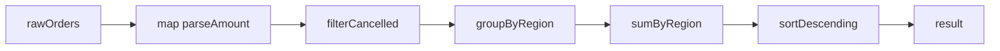
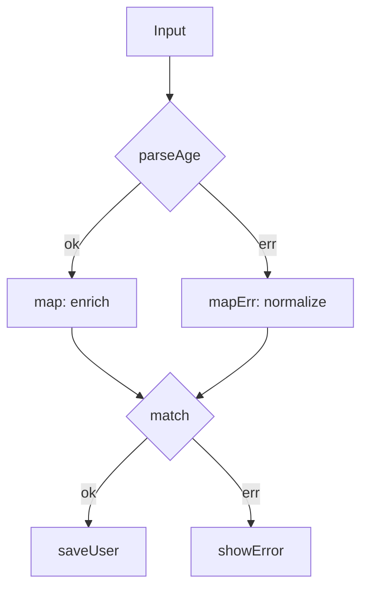
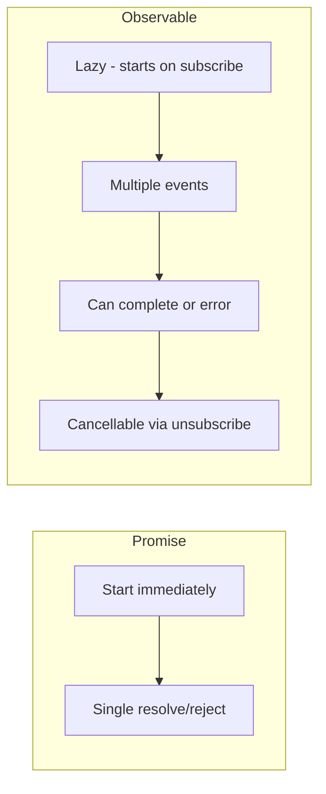
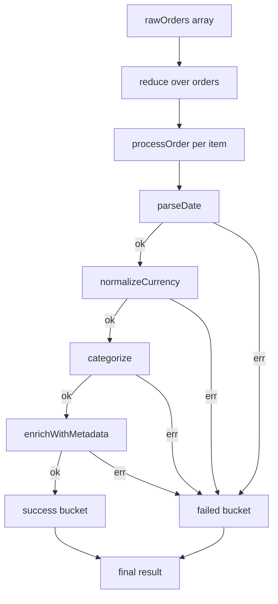

# Functional Programming in JavaScript — Revision Notes

> **Audience:** Experienced JS devs who want to sharpen mental models, catch edge-case traps, and speak fluently in interviews and code reviews.
> **Not covered:** "what is a function", "what is an array". You know JS. This is about the **why**, the **gotchas**, and the **production patterns**.

---

## 🔥 1. Pure Functions — The Bedrock of Predictability

### What makes a function pure (and why most of yours aren't)

A pure function satisfies two invariants:
1. **Determinism** — same inputs always produce the same output.
2. **No side effects** — it does not touch anything outside its own scope (no I/O, no mutations, no DOM, no `Date.now()`, no `Math.random()`).

```js
// IMPURE — depends on external state, mutates argument
let discount = 0.1;
function applyDiscount(cart) {
  cart.total = cart.total * (1 - discount); // mutation + closure over mutable external
  return cart;
}

// PURE — same input → same output, no mutation
function applyDiscount(cart, discountRate) {
  return { ...cart, total: cart.total * (1 - discountRate) };
}
```

### Why purity matters beyond testing

| Concern | Impure | Pure |
|---|---|---|
| Unit testing | Requires mocks/spies | Just assert input → output |
| Memoization | Dangerous (stale result) | Safe — result only depends on args |
| Parallelism | Race conditions | No shared state, inherently safe |
| Time-travel debugging | Impossible | Replay any sequence of inputs |
| React / state management | Unpredictable renders | Predictable renders |

**Here's the trap most devs fall into:** Thinking `async` functions can be pure. They cannot — returning a Promise wraps a side effect (a network call, timer, etc.). Pure async functions are an oxymoron. The goal is to **push side effects to the edges** of your program and keep the transformation logic in the pure core.

```js
// Side-effect boundary pattern — production style
async function fetchUserOrders(userId) {           // IMPURE — edge
  const raw = await api.get(`/users/${userId}/orders`);
  return transformOrders(raw);                      // delegate to pure core
}

// Pure core — fully testable without network
function transformOrders(raw) {
  return raw
    .filter(o => o.status !== 'cancelled')
    .map(o => ({ id: o.id, total: o.amount / 100, currency: o.currency }));
}
```

### Hidden purity violations

```js
// Looks pure, isn't — Array.sort mutates in place
function sortByDate(items) {
  return items.sort((a, b) => new Date(a.date) - new Date(b.date));
}

// Pure version
function sortByDate(items) {
  return [...items].sort((a, b) => new Date(a.date) - new Date(b.date));
}
```

Other silent mutation offenders: `Array.splice`, `Array.push`, `Array.reverse`, `Array.fill`, `Object.assign` (first arg is mutated), `delete obj.key`.

---

## 🔥 2. Immutability in JS — `const` Is Lying to You

### `const` means binding immutability, not value immutability

```js
const user = { name: 'Alice', role: 'admin' };
user.role = 'user';  // perfectly legal — const only locks the reference
user = {};           // TypeError: Assignment to constant variable
```

`const` prevents reassignment of the variable binding. The object it points to is fully mutable.

### `Object.freeze` — the shallow trap

```js
const config = Object.freeze({
  db: { host: 'localhost', port: 5432 },
  apiKey: 'secret'
});

config.apiKey = 'hacked';         // silently ignored in sloppy mode, throws in strict
config.db.host = 'attacker.com';  // THIS WORKS — freeze is one level deep!
```

**Here's the trap most devs fall into:** Using `Object.freeze` and assuming nested objects are locked.

Deep freeze utility (only use for config objects, not hot paths — it's O(n) and non-reversible):

```js
function deepFreeze(obj) {
  Object.getOwnPropertyNames(obj).forEach(name => {
    const value = obj[name];
    if (value && typeof value === 'object') deepFreeze(value);
  });
  return Object.freeze(obj);
}
```

### Producing new state — spread patterns

```js
// Shallow update
const updated = { ...user, role: 'viewer' };

// Nested update — the verbosity problem
const state = { user: { profile: { name: 'Alice', age: 30 } }, cart: [] };
const newState = {
  ...state,
  user: {
    ...state.user,
    profile: {
      ...state.user.profile,
      age: 31
    }
  }
};
```

This becomes unreadable at 3+ levels deep.

### Immer — the production answer for nested immutability

```js
import produce from 'immer';

const newState = produce(state, draft => {
  draft.user.profile.age = 31;          // looks like mutation, produces new object
  draft.cart.push({ id: 99, qty: 1 });  // array mutations work too
});

// state is unchanged. newState is a new reference only where changes occurred.
// Immer uses Proxy under the hood — structural sharing for unchanged subtrees.
```

**When to use Immer:** Redux reducers, complex form state, any time you need deep immutable updates without the spread hell.

**When NOT to use Immer:** Simple flat objects (spread is fine), performance-critical tight loops (Proxy overhead), environments without Proxy support (old IE — but in 2025, not your concern).

| Approach | Nested Updates | Performance | Readability |
|---|---|---|---|
| Spread operator | Verbose, error-prone | Fastest | Poor at depth |
| `Object.freeze` | Doesn't help | One-time cost | N/A |
| Immer `produce` | Clean, safe | ~2-3x slower than raw spread | Excellent |
| Immutable.js | Verbose API | Good with structural sharing | Poor |

---

## 🔥 3. map / filter / reduce — The Universal Operators

### reduce is the mother of all list operations

Every array transformation can be expressed as a `reduce`. Understanding this unlocks combinators.

```js
// Build map with reduce
const myMap = (arr, fn) => arr.reduce((acc, x) => [...acc, fn(x)], []);

// Build filter with reduce
const myFilter = (arr, pred) => arr.reduce((acc, x) => pred(x) ? [...acc, x] : acc, []);

// Build groupBy with reduce — real production use
const groupBy = (arr, keyFn) =>
  arr.reduce((acc, item) => {
    const key = keyFn(item);
    return { ...acc, [key]: [...(acc[key] ?? []), item] };
  }, {});

const orders = [
  { id: 1, status: 'pending', amount: 100 },
  { id: 2, status: 'shipped', amount: 200 },
  { id: 3, status: 'pending', amount: 50 },
];

groupBy(orders, o => o.status);
// { pending: [{...}, {...}], shipped: [{...}] }
```

### The empty array trap

```js
[].reduce((acc, x) => acc + x);
// TypeError: Reduce of empty array with no initial value

[].reduce((acc, x) => acc + x, 0);
// 0 — always provide an initial value unless you are 100% sure array is non-empty
```

**Here's the trap most devs fall into:** Chaining `.filter().map()` when a single `.reduce()` would traverse the array once. For small arrays it doesn't matter. For 100k items it does.

```js
// Two traversals
const result = orders
  .filter(o => o.status === 'pending')
  .map(o => o.amount);

// One traversal
const result = orders.reduce((acc, o) =>
  o.status === 'pending' ? [...acc, o.amount] : acc, []);
```

### Transducers — composable transformations without intermediate arrays

A transducer is a higher-order reducer. It transforms a reducing function without executing it, allowing composition before any traversal happens.

```js
// Conceptual model — not for every codebase, but know it exists
const map = fn => reducer => (acc, x) => reducer(acc, fn(x));
const filter = pred => reducer => (acc, x) => pred(x) ? reducer(acc, x) : acc;

const appendToArray = (acc, x) => [...acc, x];

const xform = compose(
  filter(o => o.status === 'pending'),
  map(o => o.amount)
);

orders.reduce(xform(appendToArray), []);
// Single pass, no intermediate arrays, fully composable
```

Libraries like `transducers-js` or `ramda` implement this. Most teams don't need transducers — reach for them when you're processing large streams and profiling shows GC pressure from intermediate arrays.

---

## 🔥 4. Function Composition — Building Pipelines

### compose vs pipe

```js
// compose: right-to-left (mathematical notation)
const compose = (...fns) => x => fns.reduceRight((v, f) => f(v), x);

// pipe: left-to-right (more readable for pipelines)
const pipe = (...fns) => x => fns.reduce((v, f) => f(v), x);

// Same result, different readability
const processUser = compose(formatName, normalizeEmail, trimWhitespace);
// reads: trimWhitespace → normalizeEmail → formatName (inside-out)

const processUser = pipe(trimWhitespace, normalizeEmail, formatName);
// reads: trim → normalize → format (left to right, natural)
```

**Rule of thumb:** Use `pipe` for pipelines (reads like steps in order). Use `compose` when you're thinking mathematically: `f ∘ g`.

### Production data transformation pipeline

```js
// Real pattern: ETL pipeline in a data dashboard
const pipe = (...fns) => x => fns.reduce((v, f) => f(v), x);

const parseAmount = order => ({ ...order, amount: parseFloat(order.amount) });
const filterCancelled = orders => orders.filter(o => o.status !== 'cancelled');
const groupByRegion = orders => orders.reduce((acc, o) => ({
  ...acc,
  [o.region]: [...(acc[o.region] ?? []), o]
}), {});
const sumByRegion = grouped => Object.fromEntries(
  Object.entries(grouped).map(([region, orders]) => [
    region,
    orders.reduce((sum, o) => sum + o.amount, 0)
  ])
);
const sortDescending = obj => Object.fromEntries(
  Object.entries(obj).sort(([, a], [, b]) => b - a)
);

const analyzeOrders = pipe(
  orders => orders.map(parseAmount),  // note: wrapping needed when fn takes array
  filterCancelled,
  groupByRegion,
  sumByRegion,
  sortDescending
);

analyzeOrders(rawOrders);
// { 'APAC': 45000, 'US': 38000, 'EU': 22000 }
```



### Here's the trap most devs fall into

Composing functions with **mismatched arities**. `pipe` passes a single value between stages. If a function takes `(arr, extra)`, it breaks the pipeline.

```js
// Breaks the pipeline — filter expects (item => bool), not (arr)
pipe(
  orders,
  filter(o => o.active),  // Ramda-style curried filter works; native Array.filter doesn't
)

// Fix: wrap or use a library with curried array methods (Ramda, lodash/fp)
```

---

## 🔥 5. Currying and Partial Application

### The difference (most devs conflate these)

- **Currying:** Transform `f(a, b, c)` into `f(a)(b)(c)` — every call returns a new function expecting the next argument.
- **Partial application:** Pre-fill some arguments of a function, get back a function expecting the rest. Not necessarily one argument at a time.

```js
// Manual curry
const add = a => b => a + b;
const add5 = add(5);
add5(3); // 8

// Partial application via bind
function formatCurrency(locale, currency, amount) {
  return new Intl.NumberFormat(locale, { style: 'currency', currency }).format(amount);
}
const formatUSD = formatCurrency.bind(null, 'en-US', 'USD');
formatUSD(1999.99); // '$1,999.99'
```

### Auto-curry with a utility

```js
function curry(fn) {
  return function curried(...args) {
    if (args.length >= fn.length) return fn(...args);
    return (...more) => curried(...args, ...more);
  };
}

const add = curry((a, b, c) => a + b + c);
add(1)(2)(3);    // 6
add(1, 2)(3);    // 6
add(1)(2, 3);    // 6
add(1, 2, 3);    // 6
```

### Real production usage — event handlers and data pre-binding

```js
// Currying for event handlers — avoid creating closures in JSX render
const handleFieldChange = curry((dispatch, fieldName, event) => {
  dispatch({ type: 'FIELD_CHANGE', field: fieldName, value: event.target.value });
});

// In component (created once, not on every render)
const onNameChange = handleFieldChange(dispatch)('name');
const onEmailChange = handleFieldChange(dispatch)('email');

// JSX
<input onChange={onNameChange} />
<input onChange={onEmailChange} />
```

```js
// API call factory — partial application for endpoint configuration
const makeRequest = curry(async (baseURL, method, path, body) => {
  const res = await fetch(`${baseURL}${path}`, {
    method,
    body: body ? JSON.stringify(body) : null,
    headers: { 'Content-Type': 'application/json' }
  });
  if (!res.ok) throw new Error(`${method} ${path} → ${res.status}`);
  return res.json();
});

const apiV2 = makeRequest('https://api.example.com/v2');
const get = apiV2('GET');
const post = apiV2('POST');

get('/users');            // GET /users
post('/orders', { ... }); // POST /orders
```

**Here's the trap most devs fall into:** Currying variadic functions (`...args`). Auto-curry relies on `fn.length` to know when to execute, but rest params have `length: 0`.

```js
function sum(...nums) { return nums.reduce((a, b) => a + b, 0); }
sum.length; // 0 — curry(sum) will execute immediately with zero args
```

---

## 🔥 6. Higher-Order Functions — Functions as First-Class Citizens

### Memoization — caching with HOF

```js
function memoize(fn) {
  const cache = new Map();
  return function(...args) {
    const key = JSON.stringify(args);
    if (cache.has(key)) return cache.get(key);
    const result = fn.apply(this, args);
    cache.set(key, result);
    return result;
  };
}

const expensiveCalc = memoize((userId, dateRange) => {
  // imagine heavy computation
  return computeMetrics(userId, dateRange);
});
```

**Production gotchas:**
- `JSON.stringify` fails on circular references, Dates (serializes to string), and functions.
- Unbounded cache = memory leak. Add LRU eviction for long-running processes.
- `this` context: use `.apply(this, args)` if memoizing methods.

```js
// LRU memoize — production-safe
function memoizeLRU(fn, maxSize = 100) {
  const cache = new Map();
  return function(...args) {
    const key = JSON.stringify(args);
    if (cache.has(key)) {
      const val = cache.get(key);
      cache.delete(key); cache.set(key, val); // move to end (LRU refresh)
      return val;
    }
    const result = fn.apply(this, args);
    if (cache.size >= maxSize) cache.delete(cache.keys().next().value); // evict oldest
    cache.set(key, result);
    return result;
  };
}
```

### Decorators with HOF

```js
// Timing decorator
const withTiming = (label, fn) => (...args) => {
  const start = performance.now();
  const result = fn(...args);
  console.log(`[${label}] ${(performance.now() - start).toFixed(2)}ms`);
  return result;
};

// Retry decorator for async
const withRetry = (fn, retries = 3, delay = 500) => async (...args) => {
  for (let i = 0; i < retries; i++) {
    try {
      return await fn(...args);
    } catch (err) {
      if (i === retries - 1) throw err;
      await new Promise(r => setTimeout(r, delay * 2 ** i)); // exponential backoff
    }
  }
};

// Compose decorators
const robustFetch = withRetry(withTiming('fetchUser', fetchUser));
```

---

## 🔥 7. Functors and Monads — Practical JS (No Math Degree Required)

### Functor — anything with a `map`

A functor is a container that implements `map` such that:
1. `F.of(x).map(id)` equals `F.of(x)` (identity)
2. `F.of(x).map(f).map(g)` equals `F.of(x).map(x => g(f(x)))` (composition)

Arrays are functors. Promises are functor-like. The concept matters because it gives you a safe way to transform values inside a context without unpacking them.

### Maybe / Option — null safety without null checks

```js
class Maybe {
  constructor(value) { this._value = value; }
  static of(value) { return new Maybe(value); }
  static empty() { return new Maybe(null); }

  isNothing() { return this._value == null; }

  map(fn) {
    return this.isNothing() ? Maybe.empty() : Maybe.of(fn(this._value));
  }

  getOrElse(defaultValue) {
    return this.isNothing() ? defaultValue : this._value;
  }

  chain(fn) { // flatMap — fn returns a Maybe
    return this.isNothing() ? Maybe.empty() : fn(this._value);
  }
}

// Without Maybe
function getUserCity(user) {
  if (!user) return 'Unknown';
  if (!user.address) return 'Unknown';
  if (!user.address.city) return 'Unknown';
  return user.address.city;
}

// With Maybe
const getUserCity = user =>
  Maybe.of(user)
    .chain(u => Maybe.of(u.address))
    .chain(a => Maybe.of(a.city))
    .getOrElse('Unknown');
```

**Here's the trap most devs fall into:** Overusing Maybe. If you're writing `Maybe.of(x).map(f).getOrElse(y)` everywhere for simple cases, optional chaining (`user?.address?.city ?? 'Unknown'`) is more idiomatic JS. Use Maybe when you're building a pipeline of transformations and want to stay in the "box" without breaking out to check null.

### Result / Either — error handling without try/catch spaghetti

```js
class Result {
  constructor(isOk, value, error) {
    this._isOk = isOk;
    this._value = value;
    this._error = error;
  }

  static ok(value)    { return new Result(true,  value, null); }
  static err(error)   { return new Result(false, null,  error); }

  map(fn)     { return this._isOk ? Result.ok(fn(this._value)) : this; }
  mapErr(fn)  { return this._isOk ? this : Result.err(fn(this._error)); }
  chain(fn)   { return this._isOk ? fn(this._value) : this; } // flatMap

  match({ ok, err }) {
    return this._isOk ? ok(this._value) : err(this._error);
  }
}

// Production: parsing and validating user input
const parseAge = str => {
  const n = parseInt(str, 10);
  return isNaN(n) ? Result.err('Invalid number') :
         n < 0    ? Result.err('Age cannot be negative') :
         n > 150  ? Result.err('Unrealistic age') :
                    Result.ok(n);
};

const validateUser = data =>
  parseAge(data.age)
    .map(age => ({ ...data, age }))       // enrich with parsed age
    .mapErr(e => `Age validation: ${e}`); // normalize error

validateUser({ name: 'Alice', age: '28' })
  .match({
    ok:  user  => saveUser(user),
    err: msg   => showError(msg)
  });
```



| Pattern | Use When | Don't Use When |
|---|---|---|
| `try/catch` | Single async op, unknown errors | Chained validation logic |
| `Maybe` | Null propagation in chains | Simple optional chain access |
| `Result/Either` | Validation pipelines, domain errors | Unexpected runtime errors |
| Optional chaining `?.` | Simple property access | Multi-step transformation |

---

## 🔥 8. Point-Free Style — Elegance vs. Readability

### What it is

Point-free (or "tacit") style means defining functions without explicitly mentioning their arguments.

```js
// Pointed (explicit args)
const double = x => x * 2;
const doubles = arr => arr.map(x => double(x));

// Point-free
const double = x => x * 2;
const doubles = arr => arr.map(double);  // no explicit x

// Fully point-free (with Ramda)
import * as R from 'ramda';
const activeUsernames = R.pipe(
  R.filter(R.prop('isActive')),
  R.map(R.prop('username'))
);
// No data argument mentioned anywhere
```

### When point-free hurts

**Here's the trap most devs fall into:** Going point-free for its own sake and producing unreadable code.

```js
// Point-free — you need to mentally decode this
const process = R.pipe(
  R.groupBy(R.prop('category')),
  R.map(R.reduce(R.add, 0))
);

// Pointed — obvious what's happening
const process = items => {
  const byCategory = groupBy(item => item.category, items);
  return mapValues(group => group.reduce((sum, item) => sum + item, 0), byCategory);
};
```

**Rule:** Point-free is great for simple single-purpose transformations. When the function does 3+ things, name your arguments. Code is read 10x more than it's written.

---

## 🔥 9. Ramda vs Lodash/fp — Choosing Your FP Library

### Key differences

| Feature | Ramda | Lodash/fp |
|---|---|---|
| Auto-curried | Yes, all functions | Yes (in `/fp` build) |
| Argument order | Data last | Data last |
| Immutability | Always | Always (in `/fp`) |
| Bundle size | ~47kb min | ~71kb min (tree-shakeable) |
| TypeScript types | Good (types-ramda) | Excellent (built-in) |
| Custom iteratees | Powerful (`R.where`) | Limited |
| Fantasy Land | Compliant | Partial |
| Learning curve | Steeper | Gentler if you know Lodash |

### When to use Ramda

- You're building a heavily functional codebase and want a complete FP toolkit.
- You need lens-based state access (`R.lens`, `R.view`, `R.set`, `R.over`).
- You want pattern matching-style predicates (`R.where`, `R.allPass`, `R.anyPass`).

```js
// Ramda lens — deeply nested immutable updates without Immer
import * as R from 'ramda';

const cityLens = R.lensPath(['address', 'city']);

const user = { name: 'Alice', address: { city: 'Austin', zip: '78701' } };
R.view(cityLens, user);               // 'Austin'
R.set(cityLens, 'Denver', user);      // new object, city changed
R.over(cityLens, R.toUpper, user);    // new object, city uppercased
```

### When to use Lodash/fp

- You already use Lodash and want FP without a new mental model.
- TypeScript types are a priority.
- Team is familiar with Lodash API.

```js
import { pipe, filter, map, groupBy, sumBy } from 'lodash/fp';

const summarize = pipe(
  filter(o => o.status === 'completed'),
  groupBy('region'),
  // Note: lodash/fp map over objects iterates values
);
```

### When to use neither

Vanilla ES6+ covers 80% of cases. Reach for a library when:
- You need lenses.
- You need point-free composition across many functions.
- You need `R.where`-style predicate combinators.

Do not add Ramda (47kb) just to use `R.pipe`. Write your own 5-line `pipe`.

---

## 🔥 10. Reactive Programming — Observables and RxJS

### The mental model shift

| Primitive | Sync | Async |
|---|---|---|
| Single value | value | Promise |
| Multiple values | Array | **Observable** |

An Observable is a lazy, cancellable, composable stream of events over time. It does nothing until subscribed — unlike a Promise which starts immediately.



### When RxJS makes sense

| Use Case | RxJS? | Why |
|---|---|---|
| Single HTTP call | No | Promise is simpler |
| Autocomplete search | Yes | debounce + cancel in-flight requests |
| WebSocket streams | Yes | Retry, buffer, transform events |
| Complex drag-and-drop | Yes | Combine mouse events as streams |
| Form validation (simple) | No | Overkill |
| Multi-source real-time dashboard | Yes | Merge streams from different sources |

### Autocomplete — the canonical RxJS example

```js
import { fromEvent, EMPTY } from 'rxjs';
import { debounceTime, distinctUntilChanged, switchMap, catchError, map } from 'rxjs/operators';

const searchInput = document.getElementById('search');

const results$ = fromEvent(searchInput, 'input').pipe(
  map(e => e.target.value.trim()),
  debounceTime(300),           // wait for user to stop typing
  distinctUntilChanged(),      // ignore if value didn't change
  switchMap(query =>           // cancel in-flight request if new query arrives
    query.length < 2
      ? EMPTY
      : fetchResults(query).pipe(
          catchError(() => EMPTY)  // swallow errors, don't break the stream
        )
  )
);

const sub = results$.subscribe(results => renderResults(results));

// Critical: clean up on component unmount
onDestroy(() => sub.unsubscribe());
```

**Here's the trap most devs fall into:** Using `mergeMap` instead of `switchMap` for search. `mergeMap` keeps all in-flight requests alive — you can get out-of-order results if a slow earlier request resolves after a faster later one.

| Flattening operator | Behavior | Use when |
|---|---|---|
| `switchMap` | Cancel previous, switch to new | Search, navigation |
| `mergeMap` | Keep all, merge results | Parallel uploads |
| `concatMap` | Queue, run in order | Sequential mutations |
| `exhaustMap` | Ignore new until current done | Submit button (prevent double submit) |

### Simple Observable from scratch (understanding the abstraction)

```js
// What RxJS Observable is at its core
function createInterval(ms) {
  return {
    subscribe(observer) {
      let count = 0;
      const id = setInterval(() => observer.next(count++), ms);
      return {
        unsubscribe() { clearInterval(id); }
      };
    }
  };
}

const counter = createInterval(1000);
const sub = counter.subscribe({ next: v => console.log(v) });
setTimeout(() => sub.unsubscribe(), 5000); // stop after 5s
```

---

## 🔥 Production Example — Full Data Transformation Pipeline

This ties together composition, currying, pure functions, immutability, and Result types.

```js
// utils/fp.js
const pipe = (...fns) => x => fns.reduce((v, f) => f(v), x);
const curry = fn => function curried(...args) {
  return args.length >= fn.length ? fn(...args) : (...more) => curried(...args, ...more);
};

// domain/transforms.js
const parseDate = str => {
  const d = new Date(str);
  return isNaN(d) ? Result.err(`Invalid date: ${str}`) : Result.ok(d);
};

const normalizeCurrency = curry((exchangeRates, order) =>
  Result.ok({
    ...order,
    amountUSD: order.currency === 'USD'
      ? order.amount
      : order.amount / (exchangeRates[order.currency] ?? 1)
  })
);

const categorize = order => Result.ok({
  ...order,
  tier: order.amountUSD >= 10000 ? 'enterprise'
      : order.amountUSD >= 1000  ? 'mid-market'
      : 'smb'
});

const enrichWithMetadata = curry((userId, order) =>
  Result.ok({ ...order, processedBy: userId, processedAt: new Date().toISOString() })
);

// Compose the per-order pipeline
const processOrder = curry((exchangeRates, processorId, rawOrder) =>
  Result.ok(rawOrder)
    .chain(o => parseDate(o.date).map(date => ({ ...o, date })))
    .chain(normalizeCurrency(exchangeRates))
    .chain(categorize)
    .chain(enrichWithMetadata(processorId))
);

// Batch processing — pure, testable, composable
function processBatch(rawOrders, exchangeRates, processorId) {
  const process = processOrder(exchangeRates, processorId);

  return rawOrders.reduce(
    (acc, order) => {
      const result = process(order);
      return result.match({
        ok:  o   => ({ ...acc, success: [...acc.success, o] }),
        err: msg => ({ ...acc, failed:  [...acc.failed,  { order, reason: msg }] })
      });
    },
    { success: [], failed: [] }
  );
}

// Usage
const { success, failed } = processBatch(
  rawOrders,
  { EUR: 1.08, GBP: 1.27 },
  'processor-001'
);

console.log(`Processed: ${success.length}, Failed: ${failed.length}`);
if (failed.length) console.error('Failures:', failed);
```



### What makes this production-grade

1. **Pure functions** — every transform is pure, testable with no mocks.
2. **Result monad** — errors handled at each step without try/catch blocks scattered everywhere.
3. **Currying** — `exchangeRates` and `processorId` are injected once, not threaded through every function.
4. **Immutability** — every step produces a new object with spread; originals untouched.
5. **Composability** — each stage is an independent, replaceable unit.
6. **Testability** — unit test `parseDate`, `normalizeCurrency`, `categorize` independently. Integration test `processOrder`. Batch-test `processBatch`.

---

## Quick Reference — When to Reach for What

| Pattern | Reach For It When | Avoid When |
|---|---|---|
| Pure functions | Always — default to pure | Genuinely need I/O or state |
| Immer | Nested immutable updates in reducers | Flat state, hot loops |
| `reduce` over `map+filter` | Large arrays, single-pass needed | Readability matters more |
| `pipe` / `compose` | 3+ chained transformations | 1-2 simple steps |
| Currying | Pre-binding args, event handlers, DI | Variadic functions, ad-hoc calls |
| Memoization | Pure functions called repeatedly with same args | Functions with non-serializable args |
| Maybe monad | Long chains of nullable access | Simple `?.` suffices |
| Result/Either | Domain validation pipelines | Infrastructure errors |
| Point-free | Simple, obvious transformations | Complex multi-step logic |
| RxJS | Async event streams, debounce, retry, combine | Single async calls |

---

*Last updated: 2026-06-26 | Chapter 5 of JS Deep Dive Series*
