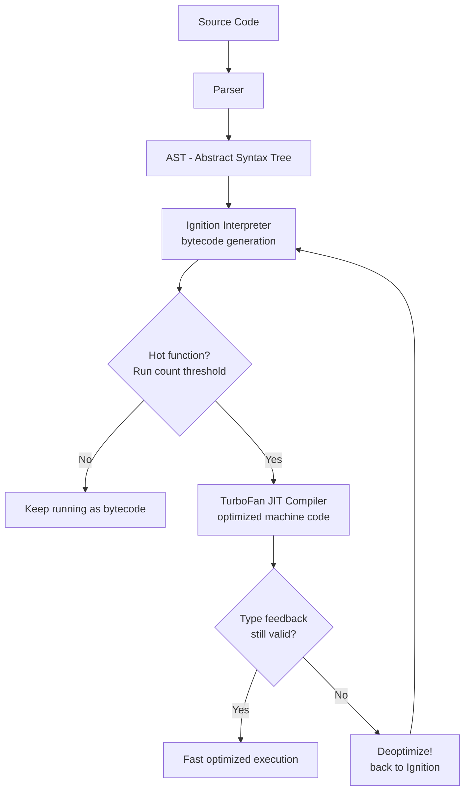
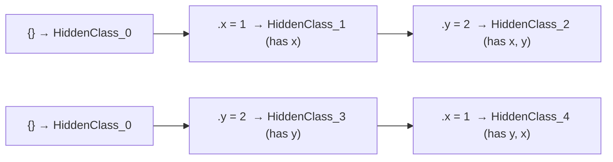
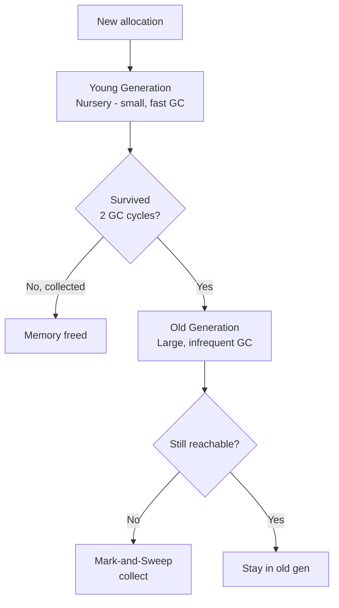
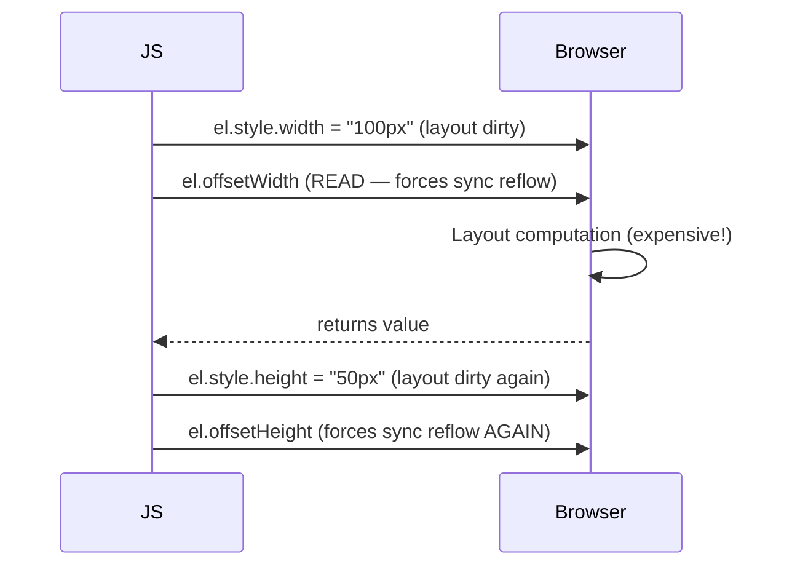
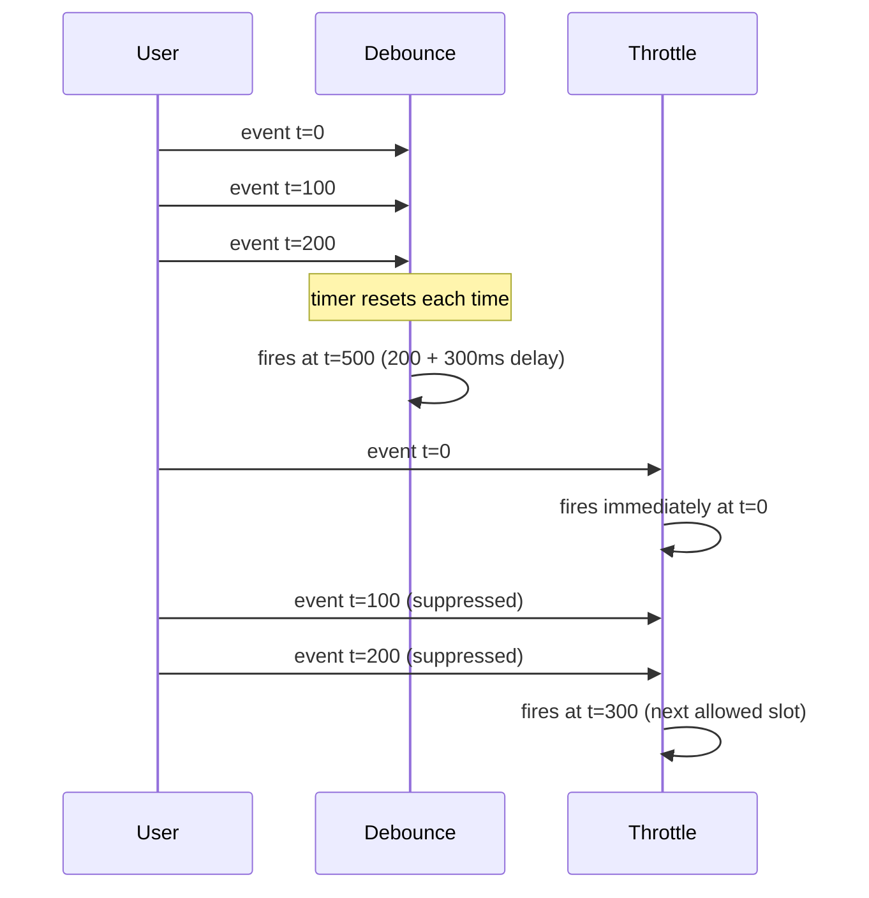

# JavaScript Performance and Memory

> Revision notes for experienced JS developers — production-grade gotchas, internals, and patterns.

---

## 🔥 1. V8 Engine Internals — How Your Code Actually Runs

Understanding V8 is the foundation. Every performance decision should trace back to what V8 does with your code.

### The Compilation Pipeline



### Parsing: Eager vs Lazy

V8 does **lazy parsing** by default — it does a quick pre-parse pass on functions it hasn't seen called yet (just checks for syntax errors, doesn't build a full AST). The full parse happens when a function is first called.

Here's the trap most devs fall into: **IIFEs and top-level code are eagerly parsed**. Wrapping everything in an IIFE to avoid globals doesn't save parse time — it costs you more.

```js
// Lazy parsed — full AST built only when firstLoad() is called
function firstLoad() {
  // heavy setup code
}

// Eagerly parsed — full AST + compilation happens immediately at startup
(function bootstrap() {
  // heavy setup code
})();
```

Pre-parsing a huge bundle is why parse time shows up in your Lighthouse "Reduce JavaScript execution time" warnings.

### Ignition: Bytecode Interpreter

Ignition compiles the AST to a compact bytecode format and executes it with a register-based VM. The bytecode is smaller than machine code (reduces memory) and serves as the baseline execution layer.

Key insight: Ignition also collects **type feedback** — what types each variable actually held at runtime. This feedback is what TurboFan uses to make aggressive assumptions.

### TurboFan: JIT Optimization

When a function is called enough times (hotness threshold — roughly 1000–2000 calls), TurboFan kicks in. It uses the collected type feedback to make speculative optimizations:

- **Inlining** — small hot functions get inlined at the call site
- **Escape analysis** — objects that don't escape a function scope get stack-allocated instead of heap-allocated
- **Type specialization** — if your function always receives `number`, TurboFan generates machine code that skips type checks entirely

```js
// TurboFan LOVES this — monomorphic, always numbers
function add(a, b) {
  return a + b;
}

for (let i = 0; i < 1_000_000; i++) add(i, i); // stays optimized

// TurboFan HATES this — polymorphic, breaks the type assumption
add(1, 2);       // optimized for number + number
add("a", "b");   // type changes → deoptimize → reoptimize for string
add({}, []);     // deoptimize again
```

### Hidden Classes (Shapes) — The Most Impactful V8 Concept

Every object in V8 has an internal **hidden class** (also called a Shape or Map). Objects with the same property layout (same keys, same order, same types) share a hidden class — property access becomes a fixed offset lookup, like a C struct.



`HiddenClass_2` and `HiddenClass_4` are **different** even though the objects have the same final keys, because the insertion order differed.

```js
// BAD — two different hidden classes → megamorphic access
function makePoint(isSwapped) {
  const p = {};
  if (isSwapped) {
    p.y = 0; p.x = 0; // HiddenClass A
  } else {
    p.x = 0; p.y = 0; // HiddenClass B
  }
  return p;
}

// GOOD — one hidden class, TurboFan can inline property access
function makePoint(x, y) {
  return { x, y }; // always same shape
}
```

Here's the trap most devs fall into: **adding properties after construction** (especially conditionally) creates hidden class transitions and kills optimization.

```js
// Kills hidden class optimization — property added after construction
const user = { id: 1, name: "Alice" };
if (isAdmin) user.adminToken = "xyz"; // new property → new hidden class

// Better — initialize all properties upfront
const user = {
  id: 1,
  name: "Alice",
  adminToken: isAdmin ? "xyz" : null, // null is fine — same shape
};
```

**Delete also kills hidden classes.** `delete obj.prop` transitions the object to a new, often "slow" (dictionary-mode) hidden class. Use `obj.prop = undefined` if you just want to clear a value.

---

## 🧠 2. Memory: Stack, Heap, and Garbage Collection

### Stack vs Heap

| Stack | Heap |
|---|---|
| Primitives, references, function call frames | Objects, arrays, functions, closures |
| Fixed size, LIFO, auto-managed | Dynamic size, GC-managed |
| Allocation is O(1) — just move a pointer | Allocation involves finding free space |
| Cleared when function returns | Lives until GC decides to collect |

Primitives stored in variables live on the **stack**. But primitives inside objects/arrays are on the **heap** (inside the object's memory block).

### Generational Garbage Collection



**Young generation (Scavenger / Minor GC):**
- Very small (~1-8MB), collected frequently
- Uses Cheney's algorithm: copy live objects to a "to-space", flip spaces
- Fast — only traverses live objects, not all of heap
- Short-lived objects (most objects) die here — good!

**Old generation (Major GC / Mark-Sweep-Compact):**
- Objects that survive two minor GCs get promoted
- Full mark-and-sweep: traverses ALL live objects from roots
- Can cause noticeable pauses — this is where GC jank comes from
- V8 uses incremental marking + concurrent sweeping to reduce main-thread pause

Here's the trap most devs fall into: **creating lots of objects in hot loops promotes them to old gen**, making major GC more expensive.

```js
// BAD — creates millions of short-lived objects, promotes many to old gen
function processFrames(frames) {
  return frames.map(f => ({
    x: f.x * 2,
    y: f.y * 2,
    timestamp: Date.now(), // new object every frame
  }));
}

// BETTER — reuse a pre-allocated output array
const output = new Array(MAX_FRAMES);
function processFrames(frames) {
  for (let i = 0; i < frames.length; i++) {
    if (!output[i]) output[i] = { x: 0, y: 0, timestamp: 0 };
    output[i].x = frames[i].x * 2;
    output[i].y = frames[i].y * 2;
    output[i].timestamp = Date.now();
  }
  return output;
}
```

### Memory Leaks You Actually Write in Production

#### 1. Closures Holding Large Objects

```js
// Classic leak — setupLogger creates a closure that holds the entire
// largePayload in scope even though it only needs the id
function setupLogger(largePayload) {
  const id = largePayload.id;
  // largePayload is captured in the closure scope — never collected
  return function log(msg) {
    console.log(`[${id}] ${msg}`);
    // even though largePayload is never used here, V8 captures the
    // entire scope — largePayload stays alive as long as log() exists
  };
}

// Fix — extract only what you need before the closure
function setupLogger(largePayload) {
  const id = largePayload.id; // extract primitive
  largePayload = null;        // allow GC of the large object
  return function log(msg) {
    console.log(`[${id}] ${msg}`);
  };
}
```

#### 2. Forgotten Event Listeners

```js
// Leak — listener holds reference to component, component holds DOM
class Widget {
  constructor(el) {
    this.el = el;
    this.data = new Array(100_000).fill(0); // large data
    // This callback captures `this`, keeping the Widget alive
    window.addEventListener("resize", () => this.render());
    // When Widget is "destroyed", it's never actually GC'd
  }
}

// Fix — store reference and remove on teardown
class Widget {
  constructor(el) {
    this.el = el;
    this.data = new Array(100_000).fill(0);
    this._onResize = () => this.render();
    window.addEventListener("resize", this._onResize);
  }
  destroy() {
    window.removeEventListener("resize", this._onResize);
    this._onResize = null;
  }
}

// Even better — AbortController for grouped cleanup
class Widget {
  constructor(el) {
    this.el = el;
    this._ac = new AbortController();
    window.addEventListener("resize", () => this.render(), {
      signal: this._ac.signal,
    });
  }
  destroy() { this._ac.abort(); }
}
```

#### 3. Detached DOM Nodes

```js
// Leak — node removed from DOM but reference kept in JS
const cache = new Map();

function buildRow(data) {
  const row = document.createElement("tr");
  // ... populate row
  cache.set(data.id, row); // row stays in memory even when removed from DOM
  return row;
}

// Fix — use WeakMap so GC can collect detached nodes
const cache = new WeakMap();
// OR clear the cache when removing: cache.delete(data.id)
```

#### 4. Timers Holding References

```js
// Leak — setInterval closure captures a large array
function startMonitor() {
  const snapshots = [];

  const intervalId = setInterval(() => {
    snapshots.push(captureSnapshot()); // snapshots grows forever
    if (snapshots.length > 100) {
      // never actually clears
    }
  }, 1000);

  // intervalId is never stored — can never call clearInterval!
}

// Fix
function startMonitor() {
  const snapshots = [];
  const MAX = 100;

  const id = setInterval(() => {
    snapshots.push(captureSnapshot());
    if (snapshots.length > MAX) snapshots.shift(); // cap size
  }, 1000);

  return () => clearInterval(id); // return cleanup function
}
```

#### 5. Global Variable Accumulation

```js
// Accidental global — strict mode prevents this
function processData(data) {
  result = transform(data); // no `let/const/var` → writes to window.result
}

// In large SPAs, module-level singletons that accumulate state
// are a subtler version of the same problem
const cache = {}; // lives forever at module scope — unbounded growth
```

---

## 🔍 3. Chrome DevTools Memory Profiling

### Heap Snapshot

Captures the full heap at a point in time. Key columns:

| Column | What it means |
|---|---|
| Shallow Size | Memory the object itself uses |
| Retained Size | Total memory freed if this object were GC'd (includes all objects only reachable through it) |
| Distance | BFS distance from GC root — larger = harder to reach = closer to being a leak candidate |

**Workflow for finding leaks:**
1. Open DevTools → Memory tab
2. Take a baseline snapshot
3. Perform the action you suspect leaks (e.g., open and close a modal 10 times)
4. Force GC (trash icon in Memory tab)
5. Take a second snapshot
6. In snapshot 2, select "Comparison" view vs snapshot 1
7. Sort by `# New` — objects that appeared and weren't collected

Here's the trap most devs fall into: **not forcing GC before the second snapshot**. Some objects are technically unreachable but not yet collected. Force GC to get a clean picture.

### Allocation Timeline

Records allocations over time — shows you which call stacks are allocating the most memory.

1. Memory tab → "Allocation instrumentation on timeline"
2. Record while performing the leaky action
3. Blue bars = live allocations, grey = collected
4. Clicking a blue bar shows the allocation call stack

### Finding Detached DOM Nodes

In the heap snapshot, filter by "Detached" in the search box. Any `Detached HTMLElement` nodes that appear are DOM nodes removed from the document but still referenced in JS.

---

## ⚡ 4. Parsing Performance: Bundles and Code Splitting

### Why JSON.parse Is Faster Than eval / Object Literals for Large Data

```js
// Slow for large configs — parsed as JS code (full AST walk)
const config = { /* 50KB of nested object literals */ };

// Fast — JSON parser is a simpler state machine, V8 has a dedicated
// fast path that's ~2x faster than parsing equivalent JS object literals
const config = JSON.parse('{ /* same 50KB as a JSON string */ }');
```

This is why Next.js and Webpack inline large static data as JSON strings instead of JS object literals.

### Code Splitting with Dynamic Import

```js
// Route-based splitting — the analytics module only loads
// when the user navigates to /analytics
const router = createRouter({
  routes: [
    {
      path: "/analytics",
      component: () => import("./pages/Analytics"), // lazy chunk
    },
    {
      path: "/dashboard",
      component: () => import("./pages/Dashboard"),
    },
  ],
});
```

### Preload vs Prefetch

| | `<link rel="preload">` | `<link rel="prefetch">` |
|---|---|---|
| Priority | High — needed for current page | Low — needed for future navigation |
| When fetched | Immediately, before render | Idle time, after page load |
| Browser honors? | Yes, mandatory | Hint only |
| Use case | Critical fonts, hero images, LCP resources | Next-page JS chunks |

```html
<!-- Preload the hero image — prevents render blocking -->
<link rel="preload" as="image" href="/hero.webp" />

<!-- Prefetch the checkout bundle when user is on cart page -->
<link rel="prefetch" href="/checkout.bundle.js" />
```

In Webpack/Vite, you can annotate dynamic imports:

```js
// Webpack magic comments
const Checkout = () =>
  import(/* webpackPrefetch: true */ "./pages/Checkout");

const HeavyChart = () =>
  import(/* webpackPreload: true */ "./components/Chart");
```

### Tree Shaking Gotchas

Tree shaking only works with **static ES module imports**. CommonJS (`require()`) defeats it entirely.

```js
// BAD — imports entire lodash (~70KB gzipped)
const _ = require("lodash");
_.debounce(fn, 300);

// GOOD — imports only debounce (~2KB)
import debounce from "lodash-es/debounce";

// ALSO BAD — side effects prevent tree shaking
import "some-lib"; // if this has side effects, bundler can't remove it
```

Mark your library as side-effect free in `package.json`:
```json
{ "sideEffects": false }
// or whitelist specific files with side effects:
{ "sideEffects": ["./src/polyfills.js", "*.css"] }
```

---

## 📊 5. Array Performance

### Avoid Sparse Arrays

```js
// Sparse array — V8 uses a dictionary (hash map) internally
const sparse = [];
sparse[0] = 1;
sparse[10_000] = 2; // indices 1–9999 are holes
// Property access is hash map lookup — much slower

// Dense array — V8 uses a contiguous C array internally
const dense = new Array(10_001).fill(0);
dense[0] = 1;
dense[10_000] = 2;
// Property access is O(1) index into contiguous memory
```

### Typed Arrays for Numeric Data

| Use Case | Typed Array | Regular Array equivalent |
|---|---|---|
| 32-bit integer math | `Int32Array` | `number[]` (64-bit float) |
| 64-bit float physics | `Float64Array` | `number[]` (same, but typed array is cache-friendly) |
| Binary data / WebSockets | `Uint8Array` | — |
| Image pixel manipulation | `Uint8ClampedArray` | — |

```js
// Processing 1M data points — typed arrays are ~10x faster
// because values are stored as actual C doubles, not boxed JS objects

// Slow
const data = new Array(1_000_000).fill(0); // array of boxed floats
for (let i = 0; i < data.length; i++) data[i] = Math.sin(i);

// Fast — contiguous memory, no boxing overhead, cache-friendly
const data = new Float64Array(1_000_000);
for (let i = 0; i < data.length; i++) data[i] = Math.sin(i);
```

### Array Access Patterns and Cache Friendliness

Modern CPUs prefetch cache lines (64 bytes). Sequential access = cache hits. Random access = cache misses = 100x slower.

```js
// Cache-friendly — sequential row-major access
function sumMatrix(matrix) {
  let sum = 0;
  for (let r = 0; r < rows; r++)
    for (let c = 0; c < cols; c++)
      sum += matrix[r][c]; // row-major: sequential memory
  return sum;
}

// Cache-unfriendly — column-major access on row-major storage
function sumMatrixSlow(matrix) {
  let sum = 0;
  for (let c = 0; c < cols; c++)
    for (let r = 0; r < rows; r++)
      sum += matrix[r][c]; // jumps cols * sizeof(element) each iteration
  return sum;
}
```

---

## 🎨 6. DOM and Rendering Performance

### Layout Thrashing

The browser maintains a **dirty flag** on the layout. Reading geometry after a write forces an immediate synchronous recalculation (forced reflow) before the read can return accurate values.



```js
// BAD — layout thrash: interleaved reads and writes in a loop
function resizeAll(elements) {
  elements.forEach(el => {
    const width = el.offsetWidth;         // read → force reflow
    el.style.width = `${width * 2}px`;   // write
    const height = el.offsetHeight;      // read → force reflow AGAIN
    el.style.height = `${height * 2}px`; // write
  });
}

// GOOD — batch all reads, then all writes
function resizeAll(elements) {
  // Phase 1: read everything
  const dims = elements.map(el => ({
    width: el.offsetWidth,
    height: el.offsetHeight,
  }));

  // Phase 2: write everything (one reflow at end)
  elements.forEach((el, i) => {
    el.style.width = `${dims[i].width * 2}px`;
    el.style.height = `${dims[i].height * 2}px`;
  });
}

// EVEN BETTER — use requestAnimationFrame to align with paint cycle
function resizeAll(elements) {
  requestAnimationFrame(() => {
    const dims = elements.map(el => ({
      width: el.offsetWidth,
      height: el.offsetHeight,
    }));
    requestAnimationFrame(() => {
      elements.forEach((el, i) => {
        el.style.width = `${dims[i].width * 2}px`;
        el.style.height = `${dims[i].height * 2}px`;
      });
    });
  });
}
```

**Properties that trigger layout (reflow):** `offsetWidth`, `offsetHeight`, `offsetTop`, `offsetLeft`, `clientWidth`, `clientHeight`, `scrollTop`, `scrollHeight`, `getBoundingClientRect()`, `getComputedStyle()`.

**Properties that are cheap (no reflow):** `el.style.width` (reading the inline style, not computed), CSS transforms/opacity (compositor-only, no layout).

### CSS will-change and Compositor Layers

```css
/* Promotes element to its own compositor layer
   Browser can animate transform/opacity without layout or paint */
.animated-card {
  will-change: transform;
  /* Use sparingly — each layer consumes GPU memory */
}
```

Here's the trap most devs fall into: **applying `will-change: transform` to everything** to "optimize" animations. Each compositor layer is a texture uploaded to the GPU. Too many layers = GPU memory pressure, which is worse than the reflow you were trying to avoid.

---

## 👷 7. Web Workers for CPU-Heavy Work

The main thread runs JS, renders, handles events, and runs GC. Anything CPU-bound over ~16ms creates jank.

```js
// main.js — offload heavy computation to a worker
const worker = new Worker(new URL("./heavy.worker.js", import.meta.url));

worker.postMessage({ data: largeDataset, operation: "crunch" });

worker.onmessage = ({ data: result }) => {
  renderResult(result); // back on main thread, safe to touch DOM
};

// heavy.worker.js
self.onmessage = ({ data: { data, operation } }) => {
  // This runs in a separate thread — won't block the UI
  const result = heavyCrunch(data);
  self.postMessage(result);
};
```

**What workers CAN'T do:** Access DOM, `window`, `document`.
**What workers CAN do:** `fetch`, `WebSockets`, `IndexedDB`, `SharedArrayBuffer`, most Web APIs.

### Transferable Objects — Avoiding Structured Clone Cost

`postMessage` deep-clones data by default (structured clone). For large `ArrayBuffer`s, this is expensive. **Transfer** the buffer instead — zero-copy, but the sender loses access.

```js
// Slow — 100MB buffer is copied
worker.postMessage({ buffer: largeArrayBuffer });

// Fast — buffer is transferred, zero-copy
worker.postMessage({ buffer: largeArrayBuffer }, [largeArrayBuffer]);
// largeArrayBuffer is now detached in the main thread — can't use it anymore
```

### When to Use / When NOT to Use Web Workers

| Use Workers | Avoid Workers |
|---|---|
| Image/video processing | Simple data transformations |
| Cryptography / hashing | Anything needing DOM access |
| Large JSON parsing / sorting | Short-lived tasks (worker startup ~10ms) |
| Physics simulations | Tasks that need frequent result sync |
| WASM execution | Highly interactive real-time UI updates |

---

## 📜 8. Virtual Scrolling for Long Lists

Rendering 10,000 DOM nodes is catastrophically slow — initial render, memory, style recalculation. Virtual scrolling renders only the visible window.

```js
// Core virtual scroll logic (without a library)
class VirtualList {
  constructor({ container, itemHeight, totalItems, renderItem }) {
    this.container = container;
    this.itemHeight = itemHeight;
    this.totalItems = totalItems;
    this.renderItem = renderItem;
    this.scrollTop = 0;
    this.viewportHeight = container.clientHeight;

    // Sentinel div that gives the container its full scroll height
    this.sentinel = document.createElement("div");
    this.sentinel.style.height = `${totalItems * itemHeight}px`;
    container.appendChild(this.sentinel);

    this.pool = []; // recycled DOM nodes
    this.container.addEventListener("scroll", () => this._onScroll());
    this._render();
  }

  _onScroll() {
    this.scrollTop = this.container.scrollTop;
    this._render();
  }

  _render() {
    const startIndex = Math.floor(this.scrollTop / this.itemHeight);
    const endIndex = Math.min(
      this.totalItems - 1,
      Math.floor((this.scrollTop + this.viewportHeight) / this.itemHeight)
    );

    // Recycle nodes outside the visible range back to pool
    // Render nodes in visible range from pool
    // Position each node with transform: translateY(index * itemHeight)
    for (let i = startIndex; i <= endIndex; i++) {
      const node = this.pool.pop() || document.createElement("div");
      this.renderItem(node, i);
      node.style.transform = `translateY(${i * this.itemHeight}px)`;
      this.sentinel.appendChild(node);
    }
  }
}
```

In React, use **react-window** (by Brian Vaughn) or **TanStack Virtual**. Never use `react-virtualized` for new projects — it's heavy and unmaintained.

```jsx
import { FixedSizeList } from "react-window";

function Row({ index, style }) {
  return (
    <div style={style}>
      {items[index].name}
    </div>
  );
}

// Only renders ~10-20 DOM nodes regardless of items.length
<FixedSizeList
  height={600}
  itemCount={100_000}
  itemSize={48}
  width="100%"
>
  {Row}
</FixedSizeList>
```

---

## ⏱️ 9. Debounce vs Throttle

### The Core Difference



**Debounce:** Fires once after a quiet period. Good for: search input, window resize final value, form auto-save.
**Throttle:** Fires at most once per interval. Good for: scroll handlers, mouse move, rate-limited API calls.

### Production Implementations

```js
// Debounce — leading and trailing edge control
function debounce(fn, delay, { leading = false, trailing = true } = {}) {
  let timer = null;
  let lastArgs = null;

  return function debounced(...args) {
    const callNow = leading && !timer;
    lastArgs = args;

    clearTimeout(timer);

    timer = setTimeout(() => {
      timer = null;
      if (trailing && lastArgs) {
        fn.apply(this, lastArgs);
        lastArgs = null;
      }
    }, delay);

    if (callNow) fn.apply(this, args);
  };
}

// Throttle — leading + trailing, with cancel support
function throttle(fn, limit) {
  let inThrottle = false;
  let trailingArgs = null;
  let trailingTimer = null;

  return function throttled(...args) {
    if (inThrottle) {
      trailingArgs = args; // queue the latest call for trailing edge
      return;
    }

    fn.apply(this, args);
    inThrottle = true;

    trailingTimer = setTimeout(() => {
      inThrottle = false;
      if (trailingArgs) {
        fn.apply(this, trailingArgs);
        trailingArgs = null;
      }
    }, limit);
  };
}
```

### When to Use / When NOT to Use

| Scenario | Use | Interval |
|---|---|---|
| Search autocomplete | Debounce | 300–500ms |
| Form validation on typing | Debounce | 200–300ms |
| Window resize → layout recalc | Debounce | 150ms |
| Scroll-based animations | Throttle | 16ms (RAF) |
| Resize observer | Throttle | 100ms |
| Mouse move → tooltip position | Throttle | 16ms |
| API polling | Neither — use intervals + AbortController | — |
| IntersectionObserver callbacks | Neither — browser handles throttling | — |

Here's the trap most devs fall into: **debouncing scroll handlers**. A debounced scroll handler fires only after the user stops scrolling — which means zero updates during the actual scroll, then a sudden jump. Throttle scroll handlers. Better yet, use `IntersectionObserver` or CSS `position: sticky` to avoid needing scroll listeners at all.

---

## 📦 10. Bundle Optimization

### Vendor Chunk Splitting

```js
// vite.config.js
export default defineConfig({
  build: {
    rollupOptions: {
      output: {
        manualChunks(id) {
          // Separate React ecosystem — cached across deploys
          if (id.includes("node_modules/react")) return "react-vendor";
          // Separate heavy charting library
          if (id.includes("node_modules/recharts")) return "chart-vendor";
          // Separate utility libs
          if (id.includes("node_modules/date-fns") ||
              id.includes("node_modules/lodash-es")) return "utils-vendor";
        },
      },
    },
  },
});
```

The point: vendor bundles are heavily cached by the browser. Separating them means a deploy that only changes your app code doesn't invalidate the 200KB React bundle the user already has cached.

### Dynamic Import Patterns

```js
// Pattern 1: Route-based (most common)
const AdminPage = lazy(() => import("./pages/Admin"));

// Pattern 2: Interaction-based — don't load until needed
async function handleExport() {
  // ExcelJS is only loaded when the user actually clicks Export
  const { Workbook } = await import("exceljs");
  const wb = new Workbook();
  // ...
}

// Pattern 3: Progressive enhancement — polyfills on demand
async function initApp() {
  if (!window.IntersectionObserver) {
    await import("intersection-observer"); // polyfill for old browsers
  }
  startApp();
}

// Pattern 4: Conditional feature based on config/feature flag
async function loadFeature(featureFlag) {
  if (!featureFlag.enabled) return;
  const { FeatureModule } = await import("./features/ExperimentalFeature");
  FeatureModule.init();
}
```

### Bundle Analysis

```bash
# Vite
npx vite-bundle-visualizer

# Webpack
npx webpack-bundle-analyzer stats.json

# Next.js
ANALYZE=true next build
```

Always check after adding dependencies. A single lodash `import _ from "lodash"` can add 70KB to your bundle even if you only use `_.get`.

### Compression and Modern Formats

| Format | Compression ratio | Browser support |
|---|---|---|
| Gzip | Good | Universal |
| Brotli | ~15% better than gzip | All modern browsers |
| Raw | Worst | — |

Enable Brotli on your server/CDN. It's free compression. Cloudflare, Vercel, and AWS CloudFront all support it automatically.

---

## 🧩 Quick-Reference: Monomorphic Functions

```js
// Monomorphic — always called with same type signature
// TurboFan produces a single, fast compiled version
function multiply(a: number, b: number) {
  return a * b;
}

// Megamorphic — called with 4+ different hidden class shapes
// TurboFan gives up and falls back to generic (slow) dispatch
function process(obj) {
  return obj.value * 2; // obj has different shapes each call
}
process({ value: 1, name: "a" });    // shape 1
process({ value: 2, x: 0, y: 0 }); // shape 2
process({ value: 3, items: [] });   // shape 3
process({ value: 4, meta: {} });    // shape 4 → megamorphic
```

---

## 🏎️ Quick-Reference: V8 Performance Checklist

- Initialize all object properties in constructor (same order, same keys)
- Never `delete` properties — set to `null`/`undefined` instead
- Keep functions monomorphic (consistent argument types and object shapes)
- Avoid sparse arrays — use `new Array(n).fill(0)` for pre-sized arrays
- Use `Float64Array` / `Int32Array` for bulk numeric processing
- Batch DOM reads before DOM writes — never interleave
- Use `requestAnimationFrame` for visual updates
- Web Workers for anything CPU-heavy (>16ms)
- Debounce user input events; throttle scroll/mouse events
- Code-split by route and by interaction
- Separate vendor chunks for better cache hit rates
- Use `WeakMap`/`WeakRef` for caches keyed on objects
- Always clean up event listeners, timers, and observers on teardown

---

*Last updated: 2026-06-26*
