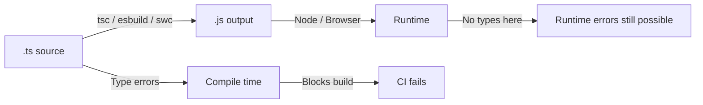

# TypeScript Essentials — Revision Notes for JavaScript Developers

> You know JS. You know how the runtime works. Now learn what TypeScript adds on top — and more importantly, WHY it exists and WHERE it saves you in production.

---

## 🗺️ Mental Model First

TypeScript is a **static analysis tool that compiles away to JavaScript**. The types exist only at compile time. At runtime you have plain JS. This is the most important thing to internalize:

- TypeScript does NOT change runtime behavior
- Type errors are compile-time warnings, not exceptions
- `any` type does not disable TypeScript — it just tells the compiler "trust me"
- `as SomeType` does not cast values — it just shuts the compiler up



The payoff: catch entire categories of bugs before code runs. The cost: a learning curve and some boilerplate. In production codebases the payoff wins overwhelmingly.

---

## 🔥 Type vs Interface — The Definitive Answer

This is the single most debated TS question. Here is the production rule:

| Use `interface` when... | Use `type` when... |
|---|---|
| Describing object shapes | Creating unions (`A \| B`) |
| Describing class contracts | Creating intersections (`A & B`) |
| You need declaration merging | Aliasing primitives (`type ID = string`) |
| Third-party lib augmentation | Conditional types |
| Extending via `extends` | Mapped types |
| The shape might be extended | Tuple types |

### Declaration Merging — Why Interfaces Win for Objects

```typescript
// interfaces merge — useful for module augmentation
interface Config {
  host: string;
}
interface Config {
  port: number;
}
// Config now has BOTH host and port — this is intentional merging
const cfg: Config = { host: 'localhost', port: 3000 };

// type aliases do NOT merge — this is a compile error
type Config2 = { host: string };
type Config2 = { port: number }; // Error: Duplicate identifier
```

### Intersection vs Extends

```typescript
// interface extends — clean, readable, works with classes
interface Animal {
  name: string;
}
interface Dog extends Animal {
  breed: string;
}

// type intersection — more flexible, handles edge cases better
type Animal2 = { name: string };
type Dog2 = Animal2 & { breed: string };

// Intersection wins when combining types from different sources
type ApiUser = DatabaseUser & AuditFields & PaginationMeta;
```

**Here's the trap most devs fall into:** Using `type` for everything because it "feels more functional". Then you need to augment a third-party module's types and you can't — because only interfaces support declaration merging. Use interfaces for any object shape that might be extended.

---

## 🔥 Union Types, Literal Types, and Discriminated Unions

### Union Types

```typescript
// basic union
type Status = 'active' | 'inactive' | 'pending';
type ID = string | number;

// union with objects — this is where it gets interesting
type ApiResponse<T> =
  | { ok: true; data: T }
  | { ok: false; error: string; statusCode: number };

// production usage
async function fetchUser(id: string): Promise<ApiResponse<User>> {
  try {
    const res = await fetch(`/api/users/${id}`);
    if (!res.ok) return { ok: false, error: 'Not found', statusCode: res.status };
    return { ok: true, data: await res.json() };
  } catch (e) {
    return { ok: false, error: 'Network error', statusCode: 0 };
  }
}

// the caller MUST handle both cases
const result = await fetchUser('123');
if (result.ok) {
  console.log(result.data); // TypeScript knows data exists here
} else {
  console.log(result.error); // TypeScript knows error exists here
}
```

### Discriminated Unions — The Most Powerful Pattern in TS

A discriminated union is a union where each member has a **literal type field** (the discriminant) that uniquely identifies it.

```typescript
// Redux action pattern — the canonical discriminated union
type Action =
  | { type: 'USER_LOGIN'; payload: { userId: string; token: string } }
  | { type: 'USER_LOGOUT' }
  | { type: 'SET_LOADING'; payload: boolean }
  | { type: 'ADD_ITEM'; payload: CartItem };

function reducer(state: State, action: Action): State {
  switch (action.type) {
    case 'USER_LOGIN':
      // TS narrows: action.payload is { userId: string; token: string }
      return { ...state, user: action.payload };
    case 'USER_LOGOUT':
      // TS narrows: action has NO payload property
      return { ...state, user: null };
    case 'SET_LOADING':
      // TS narrows: action.payload is boolean
      return { ...state, loading: action.payload };
    case 'ADD_ITEM':
      return { ...state, cart: [...state.cart, action.payload] };
    default:
      // Exhaustiveness check — if you add a new action type and forget
      // to handle it, this line causes a compile error
      const _exhaustive: never = action;
      return state;
  }
}
```

**Here's the trap most devs fall into:** Skipping the `never` exhaustiveness check. When you add a new action type months later and forget to handle it in the reducer, the bug silently ships. The `never` check makes the compiler catch it for you.

### Literal Types

```typescript
// string literals
type Direction = 'north' | 'south' | 'east' | 'west';
type HttpMethod = 'GET' | 'POST' | 'PUT' | 'PATCH' | 'DELETE';

// numeric literals
type DiceRoll = 1 | 2 | 3 | 4 | 5 | 6;
type HttpSuccessCode = 200 | 201 | 204;

// boolean literals (mostly useful in generics)
type IsLoading = true | false; // same as boolean, but can constrain

// template literal types (TS 4.1) — more on this later
type EventName = `on${Capitalize<string>}`;
type CSSProperty = `${string}-${string}`;
```

---

## 🔥 Generics — Reusable Type-Safe Code

The mental model: generics are **type parameters** — like function parameters but for types.

```typescript
// without generics — forces you to use any or duplicate code
function firstItem(arr: any[]): any {
  return arr[0];
}

// with generics — type-safe AND reusable
function firstItem<T>(arr: T[]): T | undefined {
  return arr[0];
}

const num = firstItem([1, 2, 3]);     // TypeScript infers T = number
const str = firstItem(['a', 'b']);    // TypeScript infers T = string
```

### Generic Constraints with `extends`

```typescript
// unconstrained — T could be anything, so you can't access .id
function getById<T>(items: T[], id: string): T | undefined {
  return items.find(item => item.id === id); // Error: Property 'id' does not exist on T
}

// constrained — T must have at minimum an id property
function getById<T extends { id: string }>(items: T[], id: string): T | undefined {
  return items.find(item => item.id === id); // Works!
}

// production example: typed API fetcher
async function fetchResource<T extends { id: string }>(
  endpoint: string,
  transform?: (raw: unknown) => T
): Promise<T[]> {
  const res = await fetch(endpoint);
  const data = await res.json();
  return transform ? data.map(transform) : data;
}
```

### Generic Interfaces

```typescript
// Repository pattern — works with any entity
interface Repository<T extends { id: string }> {
  findById(id: string): Promise<T | null>;
  findAll(filters?: Partial<T>): Promise<T[]>;
  create(data: Omit<T, 'id'>): Promise<T>;
  update(id: string, data: Partial<T>): Promise<T>;
  delete(id: string): Promise<void>;
}

// Implementation for User entity
class UserRepository implements Repository<User> {
  async findById(id: string): Promise<User | null> { /* ... */ }
  async findAll(filters?: Partial<User>): Promise<User[]> { /* ... */ }
  async create(data: Omit<User, 'id'>): Promise<User> { /* ... */ }
  async update(id: string, data: Partial<User>): Promise<User> { /* ... */ }
  async delete(id: string): Promise<void> { /* ... */ }
}
```

### Default Generic Types

```typescript
// T defaults to unknown if not specified
interface ApiResponse<T = unknown> {
  data: T;
  status: number;
  timestamp: string;
}

const response: ApiResponse = { data: {}, status: 200, timestamp: '...' };
// T is unknown — you must narrow before using data
```

### Conditional Types — Advanced Pattern

```typescript
// T extends U ? X : Y
type IsArray<T> = T extends any[] ? true : false;
type Unwrap<T> = T extends Promise<infer U> ? U : T;

// infer keyword — extract a type from within another type
type ReturnType<T> = T extends (...args: any[]) => infer R ? R : never;

// production: extract API response data type
type ApiData<T extends (...args: any[]) => Promise<ApiResponse<any>>> =
  Awaited<ReturnType<T>> extends ApiResponse<infer D> ? D : never;

// conditional types distribute over unions
type ToArray<T> = T extends any ? T[] : never;
type Result = ToArray<string | number>; // string[] | number[]
```

---

## 🔥 Utility Types — Know All of These

These are built into TypeScript. No import needed.

```typescript
interface User {
  id: string;
  name: string;
  email: string;
  role: 'admin' | 'user' | 'guest';
  createdAt: Date;
}
```

### Partial and Required

```typescript
// Partial<T> — all properties become optional
type UserUpdate = Partial<User>;
// { id?: string; name?: string; email?: string; ... }

// Required<T> — all properties become required (removes ?)
interface Config {
  host?: string;
  port?: number;
}
type ResolvedConfig = Required<Config>;
// { host: string; port: number }
```

### Readonly

```typescript
// Readonly<T> — prevents mutation
function processUser(user: Readonly<User>) {
  user.name = 'changed'; // Error: Cannot assign to 'name' because it is a read-only property
}

// Deep readonly (not built in — need a recursive helper)
type DeepReadonly<T> = {
  readonly [K in keyof T]: T[K] extends object ? DeepReadonly<T[K]> : T[K];
};
```

### Pick and Omit

```typescript
// Pick<T, K> — keep only listed keys
type UserPreview = Pick<User, 'id' | 'name'>;
// { id: string; name: string }

// Omit<T, K> — remove listed keys
type CreateUserDTO = Omit<User, 'id' | 'createdAt'>;
// { name: string; email: string; role: 'admin' | 'user' | 'guest' }

// production: API endpoint shapes
type UpdateUserRequest = Partial<Omit<User, 'id' | 'createdAt'>>;
```

### Extract and Exclude

```typescript
// Extract<T, U> — keep members of T that are assignable to U
type AdminOrUser = Extract<User['role'], 'admin' | 'user'>;
// 'admin' | 'user'  (excludes 'guest')

// Exclude<T, U> — remove members of T that are assignable to U
type NonAdmin = Exclude<User['role'], 'admin'>;
// 'user' | 'guest'

// production: filter action types
type ReadActions = Extract<Action['type'], `GET_${string}` | `FETCH_${string}`>;
```

### ReturnType and Parameters

```typescript
// ReturnType<T> — extract return type of a function
function createUser(data: CreateUserDTO): User { /* ... */ }
type CreatedUser = ReturnType<typeof createUser>; // User

// Parameters<T> — extract parameter types as tuple
type CreateUserArgs = Parameters<typeof createUser>; // [CreateUserDTO]
type FirstArg = Parameters<typeof createUser>[0]; // CreateUserDTO

// production: wrapper functions stay in sync automatically
function createUserWithLogging(...args: Parameters<typeof createUser>): ReturnType<typeof createUser> {
  console.log('Creating user...');
  const result = createUser(...args);
  console.log('User created:', result.id);
  return result;
}
```

### Awaited

```typescript
// Awaited<T> — unwrap Promise type (TS 4.5+)
async function fetchUser(): Promise<User> { /* ... */ }

type FetchedUser = Awaited<ReturnType<typeof fetchUser>>; // User
// without Awaited: ReturnType gives Promise<User>
```

### Record

```typescript
// Record<K, V> — object with keys K and values V
type UserMap = Record<string, User>;
type RolePermissions = Record<User['role'], string[]>;

// production: cache, lookup tables
const userCache: Record<string, User> = {};
const permissions: Record<User['role'], string[]> = {
  admin: ['read', 'write', 'delete'],
  user: ['read', 'write'],
  guest: ['read'],
};
```

### NonNullable

```typescript
// NonNullable<T> — removes null and undefined
type MaybeUser = User | null | undefined;
type DefiniteUser = NonNullable<MaybeUser>; // User

// production: after validation
function assertUser(user: MaybeUser): asserts user is NonNullable<MaybeUser> {
  if (!user) throw new Error('User required');
}
```

---

## 🔥 Template Literal Types (TS 4.1)

Build string union types programmatically — no more manual maintenance.

```typescript
// basic template literal type
type EventName = `on${Capitalize<string>}`;

// building typed event maps
type UserEvents = 'created' | 'updated' | 'deleted';
type UserEventHandlers = {
  [K in UserEvents as `onUser${Capitalize<K>}`]: (event: UserEvent<K>) => void;
};
// { onUserCreated: ..., onUserUpdated: ..., onUserDeleted: ... }

// typed CSS-in-JS property names
type CSSUnit = 'px' | 'rem' | 'em' | '%' | 'vw' | 'vh';
type CSSValue = `${number}${CSSUnit}`;

// API endpoint builder
type ApiVersion = 'v1' | 'v2';
type Resource = 'users' | 'posts' | 'comments';
type ApiEndpoint = `/${ApiVersion}/${Resource}`;
// '/v1/users' | '/v1/posts' | '/v1/comments' | '/v2/users' | ...

// production: typed i18n keys
type Locale = 'en' | 'fr' | 'de';
type TranslationKey = 'greeting' | 'farewell' | 'error';
type LocalizedKey = `${TranslationKey}.${Locale}`;
// 'greeting.en' | 'greeting.fr' | ... 'error.de'
```

**Here's the trap most devs fall into:** Template literal types are type-level constructs only. `\`${number}px\`` as a type accepts `"16px"` but not `16`. You still need runtime validation if the string comes from outside your codebase.

---

## 🔥 Mapped Types — Transform Object Types

```typescript
// basic syntax
type Optional<T> = {
  [K in keyof T]?: T[K];
};
// this is exactly how Partial<T> is implemented

// with modifiers
type Mutable<T> = {
  -readonly [K in keyof T]: T[K]; // removes readonly
};
type Required2<T> = {
  [K in keyof T]-?: T[K]; // removes ?
};

// remapping keys with as
type Getters<T> = {
  [K in keyof T as `get${Capitalize<string & K>}`]: () => T[K];
};
type UserGetters = Getters<User>;
// { getId: () => string; getName: () => string; getEmail: () => string; ... }

// filtering keys with conditional types
type OnlyStringValues<T> = {
  [K in keyof T as T[K] extends string ? K : never]: T[K];
};
type StringUserFields = OnlyStringValues<User>;
// { id: string; name: string; email: string }

// production: form field definitions
type FormFields<T> = {
  [K in keyof T]: {
    value: T[K];
    error: string | null;
    touched: boolean;
    validate: (val: T[K]) => string | null;
  };
};
type UserForm = FormFields<Omit<User, 'id' | 'createdAt'>>;
```

---

## 🔥 Type Narrowing — Teaching TS What You Know

TS narrows types inside conditionals. Understanding narrowing is essential for working with unions.

### typeof Guard

```typescript
function formatValue(val: string | number | boolean): string {
  if (typeof val === 'string') return val.toUpperCase(); // narrowed to string
  if (typeof val === 'number') return val.toFixed(2);    // narrowed to number
  return val ? 'Yes' : 'No';                             // narrowed to boolean
}
```

### instanceof Guard

```typescript
function handleError(err: unknown) {
  if (err instanceof Error) {
    console.log(err.message); // narrowed to Error
  } else if (typeof err === 'string') {
    console.log(err);
  } else {
    console.log('Unknown error', err);
  }
}
```

### in Guard

```typescript
type Cat = { meow: () => void };
type Dog = { bark: () => void };

function makeSound(animal: Cat | Dog) {
  if ('meow' in animal) {
    animal.meow(); // narrowed to Cat
  } else {
    animal.bark(); // narrowed to Dog
  }
}
```

### Custom Type Guards (User-Defined Type Guards)

```typescript
// return type is "type predicate"
function isUser(val: unknown): val is User {
  return (
    typeof val === 'object' &&
    val !== null &&
    'id' in val &&
    'name' in val &&
    'email' in val
  );
}

// production: API response validation
function parseApiResponse<T>(
  data: unknown,
  guard: (val: unknown) => val is T
): T {
  if (!guard(data)) throw new Error('Invalid API response shape');
  return data;
}

const user = parseApiResponse(await res.json(), isUser);
// user is typed as User
```

### Assertion Functions

```typescript
// throws if condition fails — TS narrows after the call
function assertDefined<T>(val: T | null | undefined, msg: string): asserts val is T {
  if (val == null) throw new Error(msg);
}

function processUser(userId: string | null) {
  assertDefined(userId, 'userId is required');
  // userId is string from here — TS knows
  userId.toUpperCase(); // no error
}
```

**Here's the trap most devs fall into:** Writing type guards that lie. `isUser` returning `true` for something that isn't a User won't cause a compile error — it causes a runtime error later, which is worse because TS gives you false confidence. Always validate all fields.

---

## 🔥 Declaration Files (.d.ts)

Declaration files describe the types for JavaScript code that has no TypeScript source.

### When You Need Them

1. You wrote a JS library and want TS consumers to get types
2. A third-party package has no `@types/` package
3. You want to augment existing type definitions

### Writing a .d.ts File

```typescript
// my-js-lib.d.ts
declare module 'my-js-lib' {
  export interface Options {
    timeout?: number;
    retries?: number;
  }

  export function fetchData(url: string, options?: Options): Promise<unknown>;
  export class HttpClient {
    constructor(baseUrl: string);
    get<T>(path: string): Promise<T>;
    post<T>(path: string, body: unknown): Promise<T>;
  }
}
```

### Module Augmentation — Extending Existing Types

```typescript
// extend Express Request to include authenticated user
// src/types/express.d.ts
import 'express';

declare module 'express' {
  interface Request {
    user?: AuthenticatedUser;
    requestId: string;
  }
}

// now this works without type errors
app.get('/profile', (req, res) => {
  if (req.user) {                    // req.user is AuthenticatedUser | undefined
    res.json(req.user);
  }
});
```

### Ambient Declarations

```typescript
// declare globals that exist at runtime (e.g., injected by build tool)
declare const __DEV__: boolean;
declare const __APP_VERSION__: string;
declare const process: {
  env: {
    NODE_ENV: 'development' | 'production' | 'test';
    API_URL: string;
  };
};
```

---

## 🔥 tsconfig.json — The Settings That Matter

### The `strict` Flag — Always Enable It

`strict: true` enables a bundle of safety checks:

| Check | What it does |
|---|---|
| `strictNullChecks` | `null` and `undefined` are not assignable to other types |
| `strictFunctionTypes` | Stricter checking of function parameter types |
| `strictBindCallApply` | Type-safe `.bind()`, `.call()`, `.apply()` |
| `strictPropertyInitialization` | Class properties must be initialized in constructor |
| `noImplicitAny` | Variables inferred as `any` become errors |
| `noImplicitThis` | `this` must have an explicit type |
| `useUnknownInCatchVariables` | Catch variables are `unknown` instead of `any` |

**Here's the trap most devs fall into:** Turning off `strictNullChecks` because it "generates too many errors". Those errors ARE bugs. Every `possibly undefined` error TS shows you is a crash waiting to happen in production. Fix them, don't suppress them.

### Key Settings Reference

```jsonc
{
  "compilerOptions": {
    // === Output ===
    "target": "ES2022",          // JS version to compile to
    "module": "ESNext",          // module system (ESNext for bundlers, CommonJS for Node)
    "moduleResolution": "Bundler", // how imports are resolved (Bundler for Vite/webpack)
    "outDir": "./dist",
    "rootDir": "./src",

    // === Safety ===
    "strict": true,              // enables all strict checks — ALWAYS ON
    "noUncheckedIndexedAccess": true, // arr[0] returns T | undefined
    "noImplicitOverride": true,  // must use 'override' keyword in classes
    "exactOptionalPropertyTypes": true, // { x?: string } ≠ { x: string | undefined }

    // === Developer Experience ===
    "paths": {                   // import aliases — avoid ../../../
      "@/*": ["./src/*"],
      "@components/*": ["./src/components/*"],
      "@utils/*": ["./src/utils/*"]
    },
    "baseUrl": ".",

    // === Type Checking ===
    "skipLibCheck": true,        // skip .d.ts checks in node_modules (speeds up builds)
    "isolatedModules": true,     // each file is independently transpilable (required for esbuild/swc)

    // === Source Maps ===
    "sourceMap": true,
    "declaration": true,         // emit .d.ts files (for libraries)
    "declarationMap": true       // source maps for .d.ts files
  },
  "include": ["src/**/*"],
  "exclude": ["node_modules", "dist"]
}
```

### `noUncheckedIndexedAccess` — The Underrated Safety Check

```typescript
const users: User[] = getUsers();

// without noUncheckedIndexedAccess
const first = users[0]; // type: User — might crash if array is empty

// with noUncheckedIndexedAccess
const first = users[0]; // type: User | undefined — forces you to check
if (first) {
  console.log(first.name); // safe
}
```

---

## 🔥 Common TypeScript Mistakes

### 1. `any` Instead of `unknown`

```typescript
// BAD — disables type checking entirely
function parseJSON(text: string): any {
  return JSON.parse(text);
}
const user = parseJSON(text);
user.doesNotExist(); // no error — runtime crash

// GOOD — forces caller to narrow before using
function parseJSON(text: string): unknown {
  return JSON.parse(text);
}
const data = parseJSON(text);
if (isUser(data)) {
  data.name; // safe — narrowed to User
}
```

### 2. Type Assertions Instead of Type Guards

```typescript
// BAD — you're lying to the compiler
const user = apiResponse.data as User; // might not actually be a User
user.name.toUpperCase(); // potential runtime error

// GOOD — you're proving it to the compiler
const user = parseApiResponse(apiResponse.data, isUser); // throws if invalid
user.name.toUpperCase(); // safe — validated at runtime
```

### 3. Non-Null Assertion Abuse (`!`)

```typescript
// the ! operator tells TS "I know this isn't null/undefined"
// it does NOT add any runtime check
const user = getUser()!; // if getUser() returns null, this crashes at runtime

// BAD — using ! everywhere to silence errors
function renderUser(userId: string) {
  const user = userCache[userId]!; // crashes if userId not in cache
  render(user.name);
}

// GOOD — explicit null check
function renderUser(userId: string) {
  const user = userCache[userId];
  if (!user) throw new Error(`User ${userId} not found in cache`);
  render(user.name);
}
```

**The smell test for `!`:** If you're using `!` because you're "pretty sure" the value isn't null, write the null check instead. `!` is legitimate only when you have external knowledge the compiler can't have (e.g., DOM elements selected from static HTML, initialized in a `beforeAll` test setup).

### 4. Widening Accidentally

```typescript
// TS infers literal type vs wide type depending on context
let status = 'active';        // inferred as string (widened)
const status2 = 'active';     // inferred as 'active' (literal)

// fixing with 'as const'
const config = {
  method: 'GET',    // inferred as string — won't match HttpMethod
  url: '/users',
} as const;
// config.method is 'GET' (literal) — works with HttpMethod type

// production gotcha: function arguments
function setMethod(method: HttpMethod) { /* ... */ }
const m = 'GET';
setMethod(m); // Error if m is typed as string, not 'GET'
setMethod(m as HttpMethod); // workaround — but type guard is better
```

### 5. Forgetting that Enums Compile to JS

```typescript
// const enum — compiles away entirely (inlined at usage sites)
const enum Direction {
  Up = 'UP',
  Down = 'DOWN',
}
// compiled: Direction.Up becomes just 'UP'

// regular enum — compiles to a JS object (extra runtime weight)
enum Status {
  Active = 'active',
  Inactive = 'inactive',
}
// compiled: { Active: 'active', active: 'Active', ... }  (reverse mapping for numeric enums)

// prefer union literal types for most cases
type Status2 = 'active' | 'inactive'; // no runtime overhead, same type safety
```

---

## 🔥 TypeScript with Async

### Typing Promises

```typescript
// explicit return type — good practice for public APIs
async function fetchUser(id: string): Promise<User> {
  const res = await fetch(`/api/users/${id}`);
  if (!res.ok) throw new Error(`HTTP ${res.status}`);
  return res.json() as Promise<User>; // cast needed since fetch returns Promise<any>
}

// Promise.all with typed results
const [user, posts, comments] = await Promise.all([
  fetchUser('123'),
  fetchUserPosts('123'),
  fetchUserComments('123'),
]);
// user: User, posts: Post[], comments: Comment[]

// Promise.allSettled with result inspection
const results = await Promise.allSettled([fetchUser('1'), fetchUser('2')]);
results.forEach(result => {
  if (result.status === 'fulfilled') {
    console.log(result.value.name); // value: User
  } else {
    console.log(result.reason); // reason: any (unfortunately)
  }
});
```

### Error Typing in Catch Blocks

```typescript
// with strict: true (useUnknownInCatchVariables)
try {
  await fetchUser('123');
} catch (err) {
  // err is 'unknown' — not 'any'
  // you MUST narrow before using it
  if (err instanceof Error) {
    console.log(err.message);
  } else if (typeof err === 'string') {
    console.log(err);
  }
}

// production pattern: typed error class
class ApiError extends Error {
  constructor(
    public statusCode: number,
    message: string,
    public data?: unknown
  ) {
    super(message);
    this.name = 'ApiError';
  }
}

try {
  await fetchUser('123');
} catch (err) {
  if (err instanceof ApiError) {
    if (err.statusCode === 404) handleNotFound();
    if (err.statusCode === 403) handleForbidden();
  }
  throw err; // re-throw unknown errors
}
```

---

## 🔥 Production Examples

### Typed API Client

```typescript
// types/api.ts
interface Endpoints {
  'GET /users': { params: { page?: number; limit?: number }; response: PaginatedResponse<User> };
  'GET /users/:id': { params: { id: string }; response: User };
  'POST /users': { body: CreateUserDTO; response: User };
  'PATCH /users/:id': { body: Partial<UpdateUserDTO>; params: { id: string }; response: User };
  'DELETE /users/:id': { params: { id: string }; response: void };
}

type Method = 'GET' | 'POST' | 'PUT' | 'PATCH' | 'DELETE';
type EndpointKey = keyof Endpoints;
type RouteMethod<K extends EndpointKey> = K extends `${infer M extends Method} ${string}` ? M : never;
type RouteResponse<K extends EndpointKey> = Endpoints[K]['response'];

class TypedApiClient {
  constructor(private baseUrl: string, private token: string) {}

  async request<K extends EndpointKey>(
    endpoint: K,
    options: Omit<Endpoints[K], 'response'>
  ): Promise<RouteResponse<K>> {
    const [method, path] = (endpoint as string).split(' ');
    const res = await fetch(`${this.baseUrl}${path}`, {
      method,
      headers: {
        'Content-Type': 'application/json',
        Authorization: `Bearer ${this.token}`,
      },
      body: 'body' in options ? JSON.stringify(options.body) : undefined,
    });
    if (!res.ok) throw new ApiError(res.status, await res.text());
    return res.json();
  }
}

const client = new TypedApiClient('https://api.example.com', token);
const users = await client.request('GET /users', { params: { page: 1 } });
// users: PaginatedResponse<User>
```

### Typed Redux Slice (with Redux Toolkit)

```typescript
// store/userSlice.ts
import { createSlice, createAsyncThunk, PayloadAction } from '@reduxjs/toolkit';

interface UserState {
  entities: Record<string, User>;
  ids: string[];
  loading: 'idle' | 'pending' | 'succeeded' | 'failed';
  error: string | null;
  currentUserId: string | null;
}

const initialState: UserState = {
  entities: {},
  ids: [],
  loading: 'idle',
  error: null,
  currentUserId: null,
};

export const fetchUsers = createAsyncThunk<
  User[],           // return type
  { page: number }, // argument type
  { rejectValue: string } // thunkAPI types
>('users/fetchAll', async ({ page }, { rejectWithValue }) => {
  try {
    const res = await fetch(`/api/users?page=${page}`);
    if (!res.ok) return rejectWithValue(`HTTP ${res.status}`);
    return res.json();
  } catch (e) {
    return rejectWithValue('Network error');
  }
});

const userSlice = createSlice({
  name: 'users',
  initialState,
  reducers: {
    setCurrentUser(state, action: PayloadAction<string | null>) {
      state.currentUserId = action.payload;
    },
    userUpdated(state, action: PayloadAction<{ id: string; changes: Partial<User> }>) {
      const { id, changes } = action.payload;
      if (state.entities[id]) {
        Object.assign(state.entities[id], changes);
      }
    },
  },
  extraReducers: builder => {
    builder
      .addCase(fetchUsers.pending, state => {
        state.loading = 'pending';
        state.error = null;
      })
      .addCase(fetchUsers.fulfilled, (state, action) => {
        state.loading = 'succeeded';
        action.payload.forEach(user => {
          state.entities[user.id] = user;
          if (!state.ids.includes(user.id)) state.ids.push(user.id);
        });
      })
      .addCase(fetchUsers.rejected, (state, action) => {
        state.loading = 'failed';
        state.error = action.payload ?? 'Unknown error';
      });
  },
});

export const { setCurrentUser, userUpdated } = userSlice.actions;
export default userSlice.reducer;
```

### Typed React Component Props

```typescript
// components/UserCard.tsx
import React from 'react';

// props interface — use interface for component props
interface UserCardProps {
  user: User;
  variant?: 'compact' | 'full' | 'minimal';
  onEdit?: (user: User) => void;
  onDelete?: (userId: string) => Promise<void>;
  className?: string;
  children?: React.ReactNode;
}

// generic component
interface ListProps<T extends { id: string }> {
  items: T[];
  renderItem: (item: T, index: number) => React.ReactNode;
  keyExtractor?: (item: T) => string;
  emptyState?: React.ReactNode;
  loading?: boolean;
}

function List<T extends { id: string }>({
  items,
  renderItem,
  keyExtractor = item => item.id,
  emptyState,
  loading,
}: ListProps<T>) {
  if (loading) return <div>Loading...</div>;
  if (items.length === 0) return <>{emptyState}</>;
  return (
    <ul>
      {items.map((item, i) => (
        <li key={keyExtractor(item)}>{renderItem(item, i)}</li>
      ))}
    </ul>
  );
}

// typed event handlers
interface FormProps<T extends Record<string, unknown>> {
  initialValues: T;
  onSubmit: (values: T) => Promise<void>;
  validate?: (values: T) => Partial<Record<keyof T, string>>;
}

// typed ref
const inputRef = React.useRef<HTMLInputElement>(null);
// inputRef.current is HTMLInputElement | null
```

---

## 🔥 Quick Reference: When to Use What

| Pattern | Use when |
|---|---|
| `interface` | Describing object/class shape that may be extended |
| `type` | Unions, intersections, aliases, computed types |
| `unknown` | You have a value from outside your codebase |
| `never` | Exhaustiveness checks, impossible code paths |
| `as const` | You want literal types from object/array literals |
| `!` (non-null) | Compiler can't know but you are 100% certain |
| Type guard | You need to narrow at runtime and get TS type inference |
| Assertion function | You want to throw on invalid input and narrow after |
| Generic | Code that should work with multiple types type-safely |
| Mapped type | Transforming all properties of an object type |
| Conditional type | Choosing a type based on another type |
| Template literal type | Building string union types from other string unions |
| `.d.ts` file | Adding types to untyped JS, augmenting module types |

---

## 🔥 Interview-Ready Summary

**"Why use TypeScript?"**
Catch bugs at compile time instead of runtime. Enables confident refactoring — rename a field and every usage fails to compile, not silently at runtime. IDE autocomplete becomes accurate. Onboarding new devs is faster because types document intent.

**"What is structural typing?"**
TS uses structural (duck) typing, not nominal typing. If object A has all the properties of type B, A is assignable to B — even without explicitly declaring `implements B`. This matches how JS actually works.

**"When would you use `unknown` over `any`?"**
`any` completely disables type checking for that value and everything touched by it — it is viral. `unknown` forces you to narrow before using, keeping type safety intact. Use `unknown` for: JSON.parse results, API responses before validation, catch block errors.

**"What is a discriminated union?"**
A union type where each member has a literal type field (the discriminant) that uniquely identifies the variant. Enables exhaustive switch statements, where the compiler tells you if you've missed a case. The foundation of state machines, Redux actions, and result types in TypeScript.
