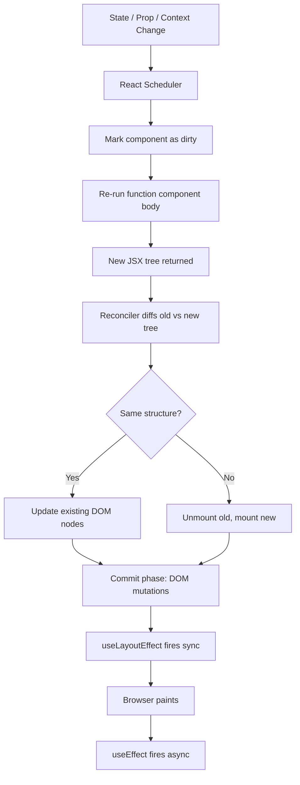
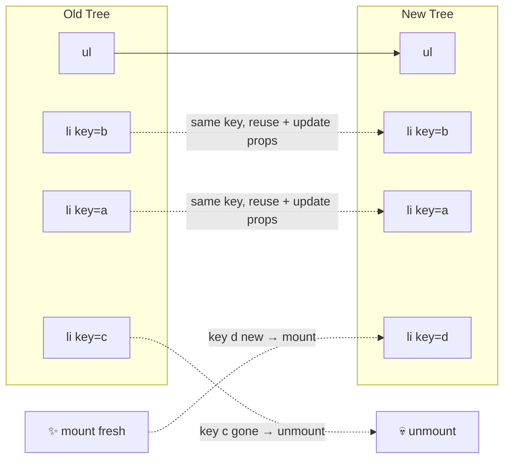
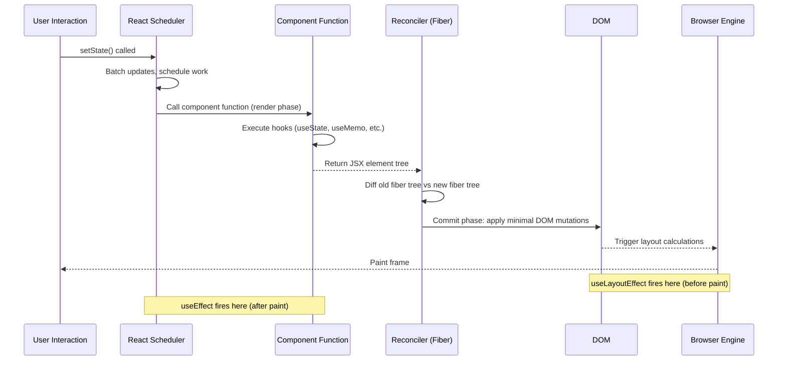

# 08 — React Fundamentals and Mental Model

> Revision notes for an experienced JS developer. Everything here assumes you know closures, the event loop, prototypes, and async/await cold. This is about the React-specific model, its guarantees, and where it will surprise you in production.

---

## 🧠 The One Mental Model That Unlocks Everything

Before any API, before hooks, before reconciliation — understand this:

```
UI = f(state)
```

React is **not a DOM manipulation library**. It is a **state-to-UI synchronisation engine**. You never describe how the DOM should change. You describe what the UI should look like *given the current state*, and React figures out the delta.

This is the philosophical shift. jQuery devs reach for the DOM. React devs reach for state.

```js
// ❌ Imperative jQuery brain leaking into React
document.querySelector('.count').textContent = count + 1;

// ✅ React brain: describe the UI, not the mutation
setCount(c => c + 1); // React will re-run f(state) and sync the DOM
```

The consequence: **every bug caused by stale UI is a state synchronisation bug**, not a DOM bug. Stop asking "why didn't the DOM update?" Start asking "what is the current state, and why isn't the render reflecting it?"

---

## 🏗️ Component Model — The React Tree

### Function Components Are Just Functions

A React function component is a pure(-ish) function that takes props and returns JSX. React calls it. React owns the call schedule. You do not call it yourself.

```ts
// This is just a function. React is the caller.
function UserCard({ userId }: { userId: string }) {
  const user = useUser(userId); // hook — only valid because React is the caller
  return <div>{user.name}</div>;
}

// NEVER do this — you bypass React's scheduler and hooks system
const element = UserCard({ userId: '123' }); // ❌ raw call — hooks break
```

### Props: Read-Only, Passed Down, Snapshot in Time

Props are the function arguments for a given render. They are **frozen at render time** — a closure snapshot.

```ts
function Timer({ delay }: { delay: number }) {
  useEffect(() => {
    const id = setInterval(() => {
      // `delay` here is the value from when this effect ran,
      // NOT the current prop value if it changes later
      console.log('tick every', delay);
    }, delay);
    return () => clearInterval(id);
  }, [delay]); // correct: re-run when delay changes
}
```

Here's the trap most devs fall into: **props look like live bindings but they are snapshots**. If you capture a prop in a closure (setTimeout, setInterval, event handler) without putting it in the dependency array, you're reading stale data.

### When Does React Re-Render?

Three triggers. Memorise these.

| Trigger | Mechanism | Notes |
|---|---|---|
| Own state change | `setState` / `useState` setter | Schedules re-render of component + subtree |
| Parent re-renders | Parent function body re-executes | Child re-renders unless memoised |
| Context value changes | `useContext` subscription | All consumers re-render, regardless of which slice changed |



> **Interview-ready:** React renders in two phases — **render phase** (pure, can be interrupted, may run multiple times in concurrent mode) and **commit phase** (synchronous, DOM mutations happen here). `useEffect` runs after commit + paint. `useLayoutEffect` runs after commit but before paint — use it for DOM measurements.

---

## 🔬 JSX Deep Dive — What Babel Actually Produces

JSX is syntactic sugar. Babel transforms it before the browser sees it.

```jsx
// What you write
const el = (
  <Button onClick={handleClick} disabled={isLoading}>
    Submit
  </Button>
);

// What Babel produces (React 17+ automatic runtime)
import { jsx as _jsx } from 'react/jsx-runtime';
const el = _jsx(Button, {
  onClick: handleClick,
  disabled: isLoading,
  children: 'Submit'
});

// Old transform (React < 17, manual import)
const el = React.createElement(Button, {
  onClick: handleClick,
  disabled: isLoading
}, 'Submit');
```

Understanding this means you understand:
- JSX is **not HTML** — `className`, `htmlFor`, `onClick` (camelCase events)
- You can use JSX without a component at all — it's just a function call returning an object (a React element descriptor)
- A React element is a **plain object**: `{ type: Button, props: { onClick, disabled, children }, key: null, ref: null }`

### Fragments — Why They Exist

React's `createElement` returns one element. But DOM siblings are valid. Fragments solve this without adding wrapper nodes.

```jsx
// ❌ Adds unnecessary div — breaks flex/grid layouts in parent
return (
  <div>
    <dt>Term</dt>
    <dd>Definition</dd>
  </div>
);

// ✅ No DOM node added
return (
  <>
    <dt>Term</dt>
    <dd>Definition</dd>
  </>
);

// When you need a key (e.g. mapping), use explicit Fragment
return items.map(item => (
  <React.Fragment key={item.id}>
    <dt>{item.term}</dt>
    <dd>{item.def}</dd>
  </React.Fragment>
));
```

### Keys — The Reconciliation Hint

Keys are not for performance. They are a **correctness mechanism** for the reconciliation algorithm.

```jsx
// ❌ Using index as key — causes ghost state bugs
{todos.map((todo, i) => (
  <TodoItem key={i} todo={todo} />
))}

// ✅ Stable, unique ID as key
{todos.map(todo => (
  <TodoItem key={todo.id} todo={todo} />
))}
```

Here's the trap most devs fall into: **index keys break when the list reorders or filters**. React sees key=0, key=1, key=2 in both old and new tree, assumes they are the *same* components, and just patches props — it does NOT reset internal state. Result: a checkbox that was checked for item A is now checked for item B after a sort.

**Key as a reset mechanism** (production pattern):

```jsx
// Force a form to fully reset when the route param changes
// without unmounting/remounting the route
function EditUserPage() {
  const { userId } = useParams();
  return <UserForm key={userId} userId={userId} />;
}
```

Changing the key tells React: "this is a completely different component instance — destroy the old one and mount fresh." Use this instead of complex `useEffect` reset logic.

| key strategy | When to use |
|---|---|
| Stable unique ID | Always default |
| Index | Static list, never reordered, never filtered |
| Route param / entity ID | Resetting component on navigation |
| Random (uuid on mount) | Never — causes full remount every render |

---

## ⚙️ Reconciliation and Diffing Algorithm

React's reconciler (Fiber) walks the element tree and produces a diff. The algorithm has two heuristics that make it O(n) instead of O(n³):

1. **Different type → full subtree replacement.** If `<div>` becomes `<section>`, React destroys the div subtree (runs cleanup effects, unmounts) and creates the section subtree from scratch. No diffing of children.

2. **Keys identify elements across renders.** Within a list, React matches old and new elements by key. Unmatched elements are destroyed; new keys are mounted fresh.



**Type change example — real bug:**

```jsx
// This destroys InputA and mounts InputB every render
// because conditional changes which component occupies the slot
function Form({ isEmail }) {
  return isEmail ? <EmailInput /> : <TextInput />;
}

// Fix: same component type, different props
function Form({ isEmail }) {
  return <Input type={isEmail ? 'email' : 'text'} />;
}
```

Here's the trap most devs fall into: **conditionally rendering different component types at the same position in the tree** causes full unmount/remount. The input loses focus, animations reset, internal state is gone.

---

## 🔒 StrictMode — Intentional Double Invocation

`<React.StrictMode>` in development mode deliberately runs certain lifecycle behaviors twice to surface bugs.

**What it does in React 18:**

| Behaviour | Why |
|---|---|
| Renders component body twice (dev only) | Exposes non-pure render functions (side effects in body) |
| Mounts, unmounts, remounts each component (dev only) | Tests that effects properly clean up and can re-run |
| Fires `useEffect` cleanup + re-run on initial mount | Simulates future React "offscreen" feature |

```js
// This bug is immediately visible in StrictMode
function DataFetcher() {
  const [data, setData] = useState(null);

  // ❌ Bug: starts two fetches, second one wins, first is leaked
  useEffect(() => {
    fetch('/api/data').then(r => r.json()).then(setData);
    // No cleanup — StrictMode will run this twice → two in-flight fetches
  }, []);

  // ✅ Correct: abort controller cleans up
  useEffect(() => {
    const controller = new AbortController();
    fetch('/api/data', { signal: controller.signal })
      .then(r => r.json())
      .then(setData)
      .catch(e => { if (e.name !== 'AbortError') throw e; });
    return () => controller.abort();
  }, []);
}
```

StrictMode only affects development builds. Remove it from production? You can, but you lose the safety net. The React team's guidance: keep it on. If StrictMode breaks your app, your app has bugs that were hiding.

---

## ⚡ React 18 — The Changes That Matter

### Automatic Batching

Pre-React 18, batching (grouping multiple state updates into one re-render) only happened inside React event handlers. In timeouts, promises, and native event listeners, every `setState` triggered a separate re-render.

```js
// React 17 — 3 separate renders inside setTimeout
setTimeout(() => {
  setA(1); // render 1
  setB(2); // render 2
  setC(3); // render 3
}, 1000);

// React 18 — 1 render inside setTimeout (automatic batching)
setTimeout(() => {
  setA(1);
  setB(2);
  setC(3);
  // React batches all three → 1 render
}, 1000);
```

**Breaking change:** If you relied on intermediate renders between state updates (e.g. a loading spinner that flashed on between two setStates), React 18 will suppress it. Opt out with `flushSync`:

```js
import { flushSync } from 'react-dom';

// Force synchronous render between updates (rare, usually wrong)
flushSync(() => setLoading(true));
// DOM is updated here
flushSync(() => setData(result));
```

Here's the trap most devs fall into: **upgrading to React 18 and seeing "the loading state doesn't show anymore"** — automatic batching is why. The fix is usually `flushSync`, but more often the real fix is rethinking whether you actually needed that intermediate render.

### Transitions — startTransition

Marks state updates as "non-urgent" so React can interrupt them to handle urgent updates (typing, clicking).

```tsx
import { startTransition, useTransition } from 'react';

function SearchPage() {
  const [query, setQuery] = useState('');
  const [results, setResults] = useState([]);
  const [isPending, startTransition] = useTransition();

  function handleChange(e: React.ChangeEvent<HTMLInputElement>) {
    // Urgent: update the input value immediately
    setQuery(e.target.value);

    // Non-urgent: filter 10,000 results — can be interrupted
    startTransition(() => {
      setResults(filterResults(e.target.value));
    });
  }

  return (
    <>
      <input value={query} onChange={handleChange} />
      {isPending && <Spinner />}
      <ResultsList results={results} />
    </>
  );
}
```

| Use `startTransition` | Do NOT use |
|---|---|
| Expensive re-renders from user input | Fetching data (use Suspense) |
| Filtering/sorting large lists | Urgent UI updates (typing, clicking) |
| Navigating between heavy pages | Anything that must be synchronous |

### Suspense for Data Fetching

Suspense lets you declaratively handle async loading states. In React 18, it works with concurrent features.

```tsx
// Boundary catches "suspended" children
function App() {
  return (
    <Suspense fallback={<PageSkeleton />}>
      <UserProfile userId="123" />
    </Suspense>
  );
}

// Component signals "I'm not ready" by throwing a Promise
function UserProfile({ userId }: { userId: string }) {
  // useSWR, React Query, or any Suspense-compatible fetcher
  const { data } = useSWR(`/api/users/${userId}`, fetcher, { suspense: true });
  return <div>{data.name}</div>;
}
```

The mechanics: when a component throws a Promise during render, React catches it, shows the nearest Suspense fallback, and re-renders the component when the promise resolves.

---

## 🎛️ Controlled vs Uncontrolled Components

### Controlled — React Owns the Value

```tsx
function ControlledInput() {
  const [value, setValue] = useState('');

  return (
    <input
      value={value}           // React drives the DOM
      onChange={e => setValue(e.target.value)}
    />
  );
}
```

The input's DOM value is always in sync with React state. Every keystroke: event → setState → re-render → DOM value written.

### Uncontrolled — DOM Owns the Value

```tsx
function UncontrolledForm() {
  const nameRef = useRef<HTMLInputElement>(null);

  function handleSubmit(e: React.FormEvent) {
    e.preventDefault();
    // Read value only when needed — no re-renders on keystroke
    console.log(nameRef.current?.value);
  }

  return (
    <form onSubmit={handleSubmit}>
      <input ref={nameRef} defaultValue="" />
      <button type="submit">Submit</button>
    </form>
  );
}
```

| | Controlled | Uncontrolled |
|---|---|---|
| Value lives in | React state | DOM |
| Re-renders on type | Yes | No |
| Validation timing | Real-time possible | On submit |
| Reset | `setValue('')` | `form.reset()` / `ref.value = ''` |
| File inputs | Not possible (browser security) | Required |
| Performance-sensitive forms | Consider uncontrolled | Preferred |

Here's the trap most devs fall into: **controlled inputs with expensive parent re-renders**. A form with 20 fields where every keystroke re-renders the whole page is a sign you should either use uncontrolled inputs or lift state down with `React.memo`.

**When uncontrolled is actually right:**
- File inputs (`<input type="file">` — you cannot set `.value` programmatically)
- Forms where you only need the value on submit (registration forms, search bars)
- Third-party DOM-heavy libraries (editors, date pickers that manage their own DOM)

---

## 📡 Lifting State Up and the Anti-Patterns

When two sibling components need to share state, lift to their closest common ancestor.

```tsx
// ❌ Anti-pattern: state duplicated in two components, they go out of sync
function FilterBar() {
  const [search, setSearch] = useState('');
  // ...
}
function ProductList() {
  const [search, setSearch] = useState(''); // separate — never in sync
  // ...
}

// ✅ Lifted to parent
function ProductPage() {
  const [search, setSearch] = useState('');
  return (
    <>
      <FilterBar search={search} onSearchChange={setSearch} />
      <ProductList search={search} />
    </>
  );
}
```

### Prop Drilling Warning Signs

When you're passing props through 3+ layers of components that don't use them, you have prop drilling. The smell:

```tsx
// Layer 1
<App theme={theme} />
// Layer 2: App → Layout, just passing theme through
<Layout theme={theme} />
// Layer 3: Layout → Sidebar, just passing theme through
<Sidebar theme={theme} />
// Layer 4: Sidebar → MenuItem, ACTUALLY uses it
<MenuItem theme={theme} />
```

Solutions (in order of preference):

1. **Component composition** — pass components as props instead of data (see next section)
2. **Context** — for truly global data (auth, theme, locale)
3. **State management library** — Zustand, Jotai for complex shared state

Here's the trap most devs fall into: **reaching for Context as the first fix for prop drilling**. Context re-renders ALL consumers on every value change. Composition is free and often solves the problem without any library.

---

## 🧩 Composition Patterns

### Children Prop — The Most Underused Pattern

```tsx
// ❌ Prop drilling approach — Page knows about Avatar internals
function Page() {
  const user = useUser();
  return <Layout avatarUrl={user.avatarUrl} userName={user.name} />;
}
function Layout({ avatarUrl, userName }: LayoutProps) {
  return (
    <nav>
      <Avatar url={avatarUrl} name={userName} />
    </nav>
  );
}

// ✅ Composition — Layout doesn't know or care about Avatar
function Page() {
  const user = useUser();
  return (
    <Layout nav={<Avatar url={user.avatarUrl} name={user.name} />}>
      <main>Content</main>
    </Layout>
  );
}
function Layout({ nav, children }: { nav: React.ReactNode; children: React.ReactNode }) {
  return (
    <>
      <nav>{nav}</nav>
      {children}
    </>
  );
}
```

This is the **slot pattern** — named slots passed as props. Zero prop drilling. `Layout` is now a pure layout shell that composes whatever you give it.

### Compound Components Preview

Compound components share implicit state through Context, creating a cohesive API surface.

```tsx
// Usage looks like this — expressive, flexible, no prop drilling
<Select value={value} onChange={setValue}>
  <Select.Trigger>{value || 'Choose...'}</Select.Trigger>
  <Select.Options>
    <Select.Option value="a">Option A</Select.Option>
    <Select.Option value="b">Option B</Select.Option>
  </Select.Options>
</Select>
```

The pattern: parent creates a Context with state, children consume it via `useContext`. This is how Radix UI, Headless UI, and React Aria work internally.

### Render Props (Know It, Rarely Write It)

Superseded by hooks in most cases, but useful for component libraries that need to share logic with arbitrary JSX output.

```tsx
// Render prop — function as child
<VirtualList
  items={thousandItems}
  renderItem={(item, index) => <Row key={item.id} data={item} index={index} />}
/>
```

When to use render props today: when you're building a library and need to give the consumer full JSX control, and a custom hook would require them to write more boilerplate.

---

## 🔄 The Full Rendering Cycle — Reference Diagram



---

## 🎯 Common Production Gotchas — Rapid Fire

### Object/Array as State Dependency

```ts
// ❌ New array reference every render → infinite effect loop
const filters = ['active', 'paid']; // declared in component body
useEffect(() => {
  fetchData(filters);
}, [filters]); // filters is new [] every render

// ✅ Move outside component or use useMemo
const FILTERS = ['active', 'paid']; // module-level constant — stable reference
```

### Stale Closure in useEffect

```ts
function Counter() {
  const [count, setCount] = useState(0);

  useEffect(() => {
    const id = setInterval(() => {
      // ❌ count is captured at 0, never updates — stale closure
      setCount(count + 1);
    }, 1000);
    return () => clearInterval(id);
  }, []); // missing dependency

  // ✅ Functional update — no dependency on current value
  useEffect(() => {
    const id = setInterval(() => {
      setCount(c => c + 1); // reads fresh state from React
    }, 1000);
    return () => clearInterval(id);
  }, []);
}
```

### Rendering Functions vs Components

```tsx
// ❌ Calling as function — hooks inside won't work correctly,
// React DevTools won't see it as a component, no error boundaries
function Parent() {
  return <div>{renderList()}</div>; // if renderList uses hooks: broken
}

// ✅ Use as component — React owns the instance
function Parent() {
  return <div><List /></div>;
}
```

### Event Handler Re-Creation

```tsx
// ❌ New function reference every render → child re-renders every parent render
function Parent() {
  const handleClick = () => doSomething(); // new reference each render
  return <MemoizedChild onClick={handleClick} />;
}

// ✅ useCallback for stable reference (only when child is memoized)
function Parent() {
  const handleClick = useCallback(() => doSomething(), []);
  return <MemoizedChild onClick={handleClick} />;
}
```

Here's the trap most devs fall into: **wrapping everything in useCallback "for performance"**. `useCallback` is only useful when the child is wrapped in `React.memo`. Without memo, `useCallback` is pure overhead — you're computing and storing the cached function for nothing.

---

## 📋 Interview-Ready Summary

| Question | One-liner answer |
|---|---|
| What triggers a re-render? | Own state change, parent re-render, subscribed context change |
| What is reconciliation? | React's O(n) algorithm for diffing old vs new element trees |
| Why are keys important? | They identify element identity across renders — wrong keys cause state bugs |
| What does StrictMode do? | Double-invokes renders and effects in dev to surface side-effect bugs |
| What is automatic batching? | React 18 groups all state updates (including in async code) into one render |
| Controlled vs uncontrolled? | Controlled: React owns value. Uncontrolled: DOM owns value. Use uncontrolled for file inputs and perf-sensitive forms |
| What is a React element? | A plain JS object `{ type, props, key, ref }` — not a DOM node |
| Render phase vs commit phase? | Render: pure, diffing, interruptible. Commit: DOM mutations, synchronous |
| When does useEffect fire? | After commit phase AND after browser paint |
| When does useLayoutEffect fire? | After commit phase but BEFORE browser paint — use for DOM measurements |

---

*Chapter 08 — Last updated: 2026-06-26 | See also: 09-hooks-deep-dive.md, 10-state-management.md*
