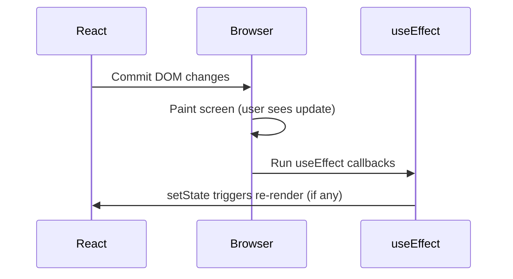
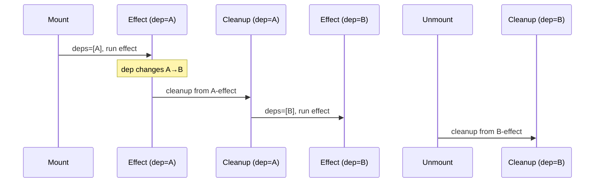
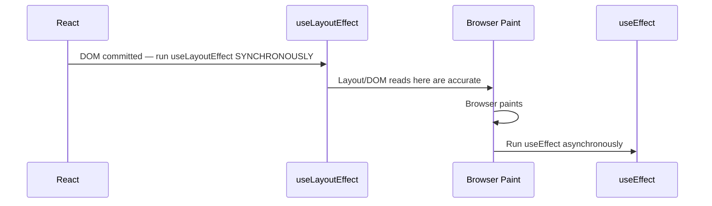
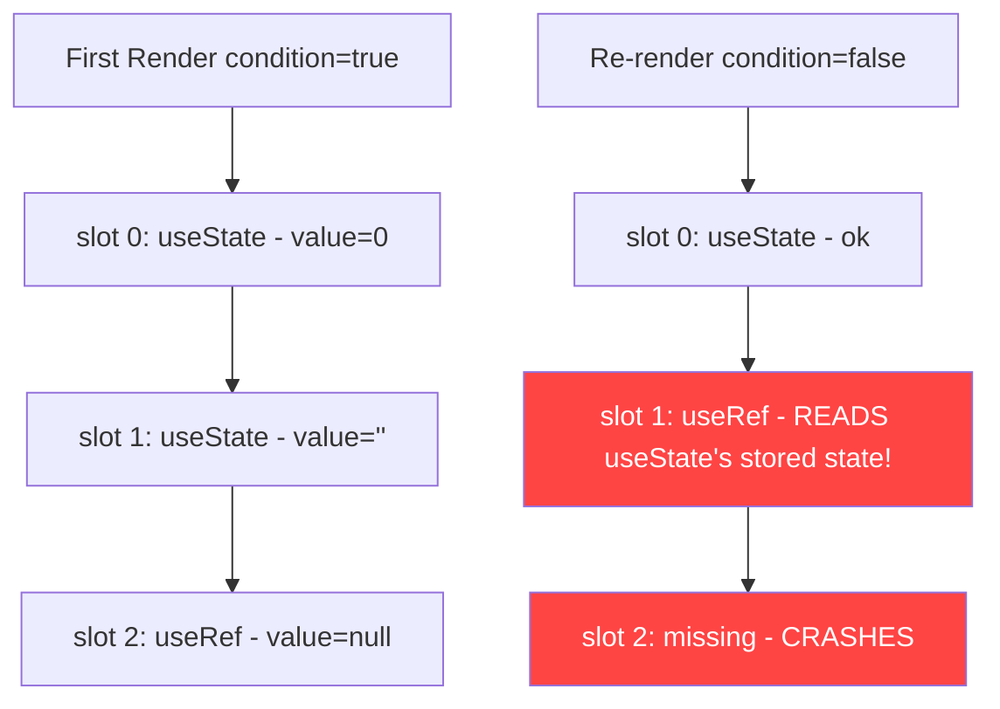
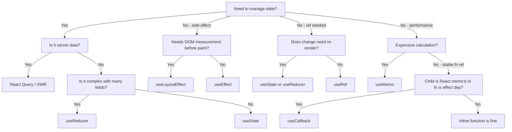
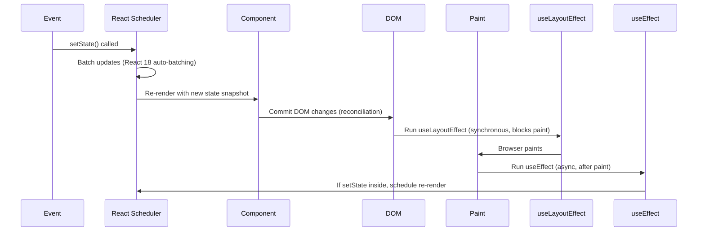

# React Hooks — Deep Dive

> Revision notes for experienced JS developers. Assumes you know React basics. This chapter is about the WHY, the traps, and the production-grade patterns.

---

## Table of Contents

1. [useState — Snapshots, Closures, Functional Updates](#usestate)
2. [useEffect — Synchronization, Not Lifecycle](#useeffect)
3. [useLayoutEffect — Synchronous DOM Mutations](#uselayouteffect)
4. [useRef — Stable References Without Re-renders](#useref)
5. [useMemo — Memoize Wisely](#usememo)
6. [useCallback — Stable Function References](#usecallback)
7. [useContext — The Hidden Performance Trap](#usecontext)
8. [useReducer — When State Gets Complex](#usereducer)
9. [Custom Hooks — Full Implementations](#custom-hooks)
10. [React 18 Hooks — useId, useDeferredValue, useTransition](#react-18-hooks)
11. [Rules of Hooks — The WHY Behind the Rules](#rules-of-hooks)

---

## 🔥 1. useState — Snapshots, Closures & Functional Updates {#usestate}

### State is a Snapshot, Not a Variable

This is the most misunderstood concept in React. State is NOT a mutable variable — it is a **snapshot** captured at render time.

```jsx
function Counter() {
  const [count, setCount] = useState(0);

  function handleClick() {
    // All three of these read the SAME snapshot value
    setCount(count + 1); // count is 0 here
    setCount(count + 1); // count is STILL 0, not 1
    setCount(count + 1); // count is STILL 0, not 2
    // Result: count becomes 1, not 3
  }

  return <button onClick={handleClick}>{count}</button>;
}
```

**Here's the trap most devs fall into:** They think `setCount` mutates `count` in-place. It does NOT. React schedules a re-render with a new snapshot. Within a single event handler, `count` is frozen at the value from when the render happened.

### Functional Updates — When You MUST Use Them

Use `setState(prev => ...)` whenever:
1. The next state depends on the previous state
2. You are inside closures that might be stale (timeouts, intervals, event listeners)
3. Multiple state updates are batched

```jsx
// BAD — race condition with stale closure
function Counter() {
  const [count, setCount] = useState(0);

  useEffect(() => {
    const interval = setInterval(() => {
      setCount(count + 1); // "count" is captured at effect creation — STALE after first tick
    }, 1000);
    return () => clearInterval(interval);
  }, []); // empty deps means count is permanently 0 inside here
}

// GOOD — functional update always gets latest state
function Counter() {
  const [count, setCount] = useState(0);

  useEffect(() => {
    const interval = setInterval(() => {
      setCount(prev => prev + 1); // React passes the actual current state
    }, 1000);
    return () => clearInterval(interval);
  }, []); // dep array is correct now — no stale closure
}
```

### Stale Closure — The Most Common React Bug in Production

The stale closure problem occurs when a function "closes over" a state value at creation time, but then that function runs later when state has changed.

```jsx
// Production scenario: WebSocket message handler
function ChatRoom({ roomId }) {
  const [messages, setMessages] = useState([]);

  useEffect(() => {
    const ws = new WebSocket(`wss://api.example.com/${roomId}`);

    // BAD: This handler closes over `messages` at effect creation time
    ws.onmessage = (event) => {
      const newMsg = JSON.parse(event.data);
      setMessages([...messages, newMsg]); // messages is stale!
    };

    return () => ws.close();
  }, [roomId]); // messages NOT in deps — intentional but broken
}

// GOOD: Use functional update or useRef
function ChatRoom({ roomId }) {
  const [messages, setMessages] = useState([]);

  useEffect(() => {
    const ws = new WebSocket(`wss://api.example.com/${roomId}`);

    ws.onmessage = (event) => {
      const newMsg = JSON.parse(event.data);
      setMessages(prev => [...prev, newMsg]); // Always gets current messages
    };

    return () => ws.close();
  }, [roomId]);
}
```

### Lazy Initialization — useState(() => expensiveCompute())

React calls the initializer function ONLY on the first render. Pass a function, not a value.

```jsx
// BAD: expensiveCompute() runs on EVERY render, result is only used once
const [data, setData] = useState(expensiveCompute());

// GOOD: Function is called once on mount
const [data, setData] = useState(() => expensiveCompute());

// Real use case: parsing from localStorage
const [prefs, setPrefs] = useState(() => {
  try {
    return JSON.parse(localStorage.getItem('user-prefs')) ?? defaultPrefs;
  } catch {
    return defaultPrefs; // Guard against corrupted JSON
  }
});
```

### useState vs useReducer Decision Matrix

| Scenario | useState | useReducer |
|---|---|---|
| Single primitive value | Yes | Overkill |
| 2-3 related fields | Maybe | Better |
| Complex transitions | No | Yes |
| Next state depends on event type | No | Yes |
| Same action from different UI elements | No | Yes |
| You need action history/logging | No | Yes |

---

## 🔥 2. useEffect — Synchronization, Not Lifecycle {#useeffect}

### The Mental Model Shift

Stop thinking in lifecycle terms (`componentDidMount`, `componentDidUpdate`, `componentWillUnmount`). Think in **synchronization** terms.

> "How do I keep this external system in sync with my React state?"

```
External System <---> useEffect <---> React State
  WebSocket             sync           roomId
  DOM API               sync           isVisible
  localStorage          sync           theme
  setTimeout            sync           delay
```

### The Timing: After Paint, Not During



**Here's the trap most devs fall into:** They expect useEffect to run synchronously after state changes. It runs asynchronously after the browser paints. This is intentional — it doesn't block the UI. If you need synchronous post-DOM work (measuring layout), use `useLayoutEffect`.

### Dependency Array — Why exhaustive-deps is Right

The `exhaustive-deps` ESLint rule exists because stale closures are silent bugs. The rule forces you to declare every reactive value your effect reads.

```jsx
// The lint rule catches this:
function SearchResults({ query, userId }) {
  const [results, setResults] = useState([]);

  useEffect(() => {
    // Effect reads `userId` but it's not in deps
    // If userId changes, effect doesn't re-run — stale data
    fetchResults(query, userId).then(setResults);
  }, [query]); // ESLint: 'userId' is missing from dependency array
}

// Correct:
useEffect(() => {
  fetchResults(query, userId).then(setResults);
}, [query, userId]);
```

**When to disable the lint rule (rare):** Only when you intentionally want to read a ref (refs are stable) or when you have a deliberate "run once on mount" pattern — but then you should use `useRef` for the mutable value, not silence the lint.

### Cleanup Function — Precise Timing

The cleanup runs:
1. **Before** the next effect runs (when deps change)
2. **On unmount**

It does NOT run before the first effect.



```jsx
// Production: WebSocket with proper cleanup
function useLiveData(channelId) {
  const [data, setData] = useState(null);

  useEffect(() => {
    let cancelled = false; // Guard for async operations
    const ws = new WebSocket(`wss://live.api.com/${channelId}`);

    ws.onmessage = (e) => {
      if (!cancelled) setData(JSON.parse(e.data));
    };

    ws.onerror = (e) => {
      if (!cancelled) console.error('WS error', e);
    };

    return () => {
      cancelled = true;  // Prevent state update after unmount
      ws.close();        // Disconnect WebSocket
    };
  }, [channelId]); // Re-connects when channel changes

  return data;
}
```

### Effects for Synchronization — Not Data Fetching

**Here's the trap most devs fall into:** Using useEffect for data fetching creates waterfalls and race conditions.

```jsx
// BAD: Waterfall — parent fetches, then child mounts, then child fetches
function UserProfile({ userId }) {
  const [user, setUser] = useState(null);

  useEffect(() => {
    fetchUser(userId).then(setUser);
  }, [userId]);

  if (!user) return <Spinner />;

  // Dashboard only mounts after user loads — then it starts its own fetch
  return <Dashboard userId={user.id} />;
}

// BAD: Race condition — fast typing causes multiple in-flight requests
function Search({ query }) {
  const [results, setResults] = useState([]);

  useEffect(() => {
    fetch(`/api/search?q=${query}`)
      .then(r => r.json())
      .then(setResults); // If query changes fast, responses arrive out of order
  }, [query]);
}
```

```jsx
// GOOD: Cancellation with AbortController
useEffect(() => {
  const controller = new AbortController();

  fetch(`/api/search?q=${query}`, { signal: controller.signal })
    .then(r => r.json())
    .then(setResults)
    .catch(err => {
      if (err.name !== 'AbortError') setError(err);
    });

  return () => controller.abort(); // Cancel in-flight request on dep change
}, [query]);

// BEST: Use React Query / SWR for data fetching — they handle:
// - caching, deduplication, background refetch
// - race conditions, loading/error states
// - request cancellation
const { data, isLoading, error } = useQuery({
  queryKey: ['search', query],
  queryFn: () => fetchSearch(query),
});
```

### Common useEffect Misuses

| Misuse | Problem | Fix |
|---|---|---|
| Fetching data without cleanup | Race conditions, memory leaks | AbortController or React Query |
| Syncing state to state | Derived state anti-pattern | Compute during render instead |
| `useEffect` with `[]` for "run once" | Mount vs StrictMode double-invoke | Use cleanup to make it idempotent |
| Setting state unconditionally | Infinite loop | Check if value actually changed |
| Subscribing without unsubscribing | Memory leak | Always return cleanup |

---

## 🔥 3. useLayoutEffect — Synchronous Before Paint {#uselayouteffect}

### Timing Difference



`useLayoutEffect` blocks the browser from painting until it completes. Use this when you need to **measure DOM** and then make changes before the user sees the intermediate state.

```jsx
// Tooltip positioning — must measure BEFORE paint to avoid flicker
function Tooltip({ targetRef, content }) {
  const [position, setPosition] = useState({ top: 0, left: 0 });
  const tooltipRef = useRef(null);

  useLayoutEffect(() => {
    if (!targetRef.current || !tooltipRef.current) return;

    const targetRect = targetRef.current.getBoundingClientRect();
    const tooltipRect = tooltipRef.current.getBoundingClientRect();

    // If useEffect: user sees tooltip in wrong position for a frame
    // useLayoutEffect: calculate and apply before any paint
    setPosition({
      top: targetRect.bottom + 8,
      left: targetRect.left + (targetRect.width - tooltipRect.width) / 2,
    });
  }, [targetRef]);

  return (
    <div
      ref={tooltipRef}
      style={{ position: 'fixed', top: position.top, left: position.left }}
    >
      {content}
    </div>
  );
}
```

### When to Use / When NOT to Use

| Use useLayoutEffect | Use useEffect |
|---|---|
| DOM measurements (getBoundingClientRect) | Data fetching |
| Tooltip/popover positioning | Event subscriptions |
| Scroll position restoration | Analytics/logging |
| Preventing visual flicker from DOM mutation | Timers |
| Animating from measured values | API calls |

**SSR Warning:** `useLayoutEffect` fires synchronously — it cannot run on the server. Next.js will warn. If you need SSR compatibility, gate it:

```jsx
const useIsomorphicLayoutEffect =
  typeof window !== 'undefined' ? useLayoutEffect : useEffect;
```

---

## 🔥 4. useRef — Stable References Without Re-renders {#useref}

### Two Distinct Use Cases

1. **DOM reference** — attach to a DOM node via `ref` prop
2. **Mutable container** — store any value that should persist across renders without triggering re-renders

```jsx
// Use case 1: DOM reference
function VideoPlayer({ src }) {
  const videoRef = useRef(null);

  function play() {
    videoRef.current.play(); // Direct DOM API access
  }

  return <video ref={videoRef} src={src} />;
}

// Use case 2: Mutable container — storing interval ID
function usePolling(callback, interval) {
  const savedCallback = useRef(callback);
  const intervalRef = useRef(null);

  // Keep ref current without re-running effect
  useEffect(() => {
    savedCallback.current = callback;
  });

  useEffect(() => {
    intervalRef.current = setInterval(() => savedCallback.current(), interval);
    return () => clearInterval(intervalRef.current);
  }, [interval]);

  // Expose a way to stop manually
  return () => clearInterval(intervalRef.current);
}
```

### Storing Previous Value with useRef

```jsx
function usePrevious(value) {
  const prevRef = useRef(undefined);

  useEffect(() => {
    prevRef.current = value;
  }); // No dep array — runs after every render, AFTER the return

  return prevRef.current; // Returns value from PREVIOUS render
}

// Usage:
function PriceDisplay({ price }) {
  const previousPrice = usePrevious(price);
  const direction = price > previousPrice ? 'up' : 'down';

  return (
    <span className={`price price--${direction}`}>
      {price}
    </span>
  );
}
```

**Here's the trap most devs fall into:** Forgetting that `ref.current` mutation does NOT trigger a re-render. If you need the component to re-render when a ref changes, you need state or a callback ref.

### Callback Refs — For Dynamic DOM Nodes

When a node might not exist on first render (conditional rendering), use a callback ref:

```jsx
function MeasuredList({ items }) {
  const [heights, setHeights] = useState({});

  // Called when the node mounts/unmounts — reliable even with conditional rendering
  const measuredRef = useCallback((node) => {
    if (node !== null) {
      setHeights(prev => ({
        ...prev,
        [node.dataset.id]: node.getBoundingClientRect().height,
      }));
    }
  }, []);

  return (
    <ul>
      {items.map(item => (
        <li key={item.id} ref={measuredRef} data-id={item.id}>
          {item.content}
        </li>
      ))}
    </ul>
  );
}
```

---

## 🔥 5. useMemo — Memoize Wisely {#usememo}

### The Two Reasons to Use useMemo

1. **Skip expensive recalculations** — CPU-heavy transformations
2. **Referential stability** — prevent child re-renders caused by new object/array references

```jsx
// Reason 1: Expensive calculation
function DataGrid({ rawData, filters }) {
  const processedData = useMemo(() => {
    return rawData
      .filter(row => filters.every(f => f(row)))
      .sort((a, b) => a.timestamp - b.timestamp)
      .map(row => ({ ...row, computed: heavyTransform(row) }));
  }, [rawData, filters]); // Only recomputes when these change

  return <Table data={processedData} />;
}

// Reason 2: Referential stability — object created inline would be new on every render
function UserDashboard({ user }) {
  // Without useMemo: new object reference every render → child always re-renders
  const userConfig = useMemo(() => ({
    theme: user.preferences.theme,
    locale: user.preferences.locale,
    timezone: user.timezone,
  }), [user.preferences.theme, user.preferences.locale, user.timezone]);

  return <ConfiguredWidget config={userConfig} />;
}
```

### When useMemo is NOT Worth It

```jsx
// Overhead > benefit: memoizing trivial operations
const doubled = useMemo(() => count * 2, [count]); // Just do: count * 2

// Memoizing primitive return values — already cheap
const label = useMemo(() => `User: ${name}`, [name]); // Just template literal

// Objects not passed down — no referential stability benefit needed
const localConfig = useMemo(() => ({ debug: true }), []); // Unused by children
```

| When to useMemo | When to skip |
|---|---|
| Computation > ~1ms (profile first!) | Primitive values |
| Object/array passed to memoized child | Local-only values |
| Object used as useEffect dependency | Computations on small arrays |
| Heavy array transforms (sort/filter) | String concatenation |

**Here's the trap most devs fall into:** Wrapping everything in useMemo "for safety." useMemo itself has overhead — closure creation, dependency comparison. On small values, it's slower than the raw computation.

---

## 🔥 6. useCallback — Stable Function References {#usecallback}

### useCallback is Just useMemo for Functions

```jsx
// These are equivalent:
const memoizedFn = useCallback(fn, deps);
const memoizedFn = useMemo(() => fn, deps);
```

### When useCallback Actually Helps

useCallback is only useful in two scenarios:

1. **Passing to a React.memo'd child** — prevents child re-render
2. **Using as a useEffect dependency** — prevents effect from re-running unnecessarily

```jsx
// Scenario 1: Memoized child
const ExpensiveList = React.memo(function ExpensiveList({ onItemClick }) {
  // Only re-renders if onItemClick reference changes
  return <ul>{items.map(i => <li onClick={() => onItemClick(i.id)} />)}</ul>;
});

function Parent() {
  const [filter, setFilter] = useState('');
  const [selectedId, setSelectedId] = useState(null);

  // Without useCallback: new function every render → ExpensiveList always re-renders
  // With useCallback: same reference → ExpensiveList skips re-render
  const handleItemClick = useCallback((id) => {
    setSelectedId(id);
  }, []); // No deps — setSelectedId is stable (React guarantees this)

  return (
    <>
      <input value={filter} onChange={e => setFilter(e.target.value)} />
      <ExpensiveList onItemClick={handleItemClick} />
    </>
  );
}
```

```jsx
// Scenario 2: As useEffect dependency
function useSearch(query) {
  const [results, setResults] = useState([]);

  // If fetchResults is created inline, effect would run on every render
  const fetchResults = useCallback(async () => {
    const data = await api.search(query);
    setResults(data);
  }, [query]);

  useEffect(() => {
    fetchResults();
  }, [fetchResults]); // fetchResults is stable when query hasn't changed

  return results;
}
```

**Here's the trap most devs fall into:** Using `useCallback` on event handlers passed to regular (non-memoized) HTML elements. `<button onClick={handleClick}>` — React doesn't care if `handleClick` is the same reference between renders for native elements.

---

## 🔥 7. useContext — The Hidden Performance Trap {#usecontext}

### How Context Re-renders Work

**Every component that calls `useContext(MyContext)` re-renders whenever the context VALUE changes** — not when any state changes, specifically when the object reference passed to the Provider changes.

```jsx
// PROBLEM: This re-renders ALL consumers on every parent render
function App() {
  const [user, setUser] = useState(null);
  const [theme, setTheme] = useState('dark');

  // New object reference created on every render → all consumers re-render
  return (
    <AppContext.Provider value={{ user, theme, setUser, setTheme }}>
      <Routes />
    </AppContext.Provider>
  );
}
```

### Solutions to Context Performance

**Solution 1: Split contexts by update frequency**

```jsx
// Split into separate contexts — components only subscribe to what they need
const UserContext = createContext(null);
const ThemeContext = createContext(null);
const UserActionsContext = createContext(null); // Actions almost never change

function App() {
  const [user, setUser] = useState(null);
  const [theme, setTheme] = useState('dark');

  // Actions are stable — memoize them separately
  const userActions = useMemo(() => ({ setUser }), []);

  return (
    <UserActionsContext.Provider value={userActions}>
      <ThemeContext.Provider value={theme}>
        <UserContext.Provider value={user}>
          <Routes />
        </UserContext.Provider>
      </ThemeContext.Provider>
    </UserActionsContext.Provider>
  );
}

// Component that only needs theme doesn't re-render on user change
function Header() {
  const theme = useContext(ThemeContext); // Only re-renders on theme change
  return <header className={theme}>...</header>;
}
```

**Solution 2: Memoize context value**

```jsx
function UserProvider({ children }) {
  const [user, setUser] = useState(null);

  const value = useMemo(() => ({ user, setUser }), [user]);
  // Now only creates new reference when user changes
  // setUser is stable (React guarantees setter stability)

  return <UserContext.Provider value={value}>{children}</UserContext.Provider>;
}
```

**Solution 3: Use Zustand/Jotai for global state (recommended at scale)**

```jsx
// Zustand: Only re-renders components that subscribe to changed slices
const useStore = create((set) => ({
  user: null,
  theme: 'dark',
  setUser: (user) => set({ user }),
  setTheme: (theme) => set({ theme }),
}));

// Component only re-renders when user changes — theme changes don't matter
function UserAvatar() {
  const user = useStore(state => state.user); // Selector-based subscription
  return ;
}
```

### Context vs External State

| Aspect | Context | Zustand/Jotai |
|---|---|---|
| Re-render granularity | Entire subtree | Selector-based |
| Boilerplate | Low | Low (Zustand) |
| DevTools | None built-in | Full DevTools |
| Best for | Theme, locale, auth | Complex app state |
| Performance at scale | Problematic | Excellent |

---

## 🔥 8. useReducer — When State Gets Complex {#usereducer}

### The Mental Model

`useReducer` is `useState` with a dispatch table. It moves state logic out of components into pure functions.

```
dispatch({ type: 'ACTION', payload }) → reducer(currentState, action) → newState
```

### When to Prefer useReducer Over useState

```jsx
// Complex form with validation — useReducer shines here
type FormState = {
  values: Record<string, string>;
  errors: Record<string, string>;
  touched: Record<string, boolean>;
  isSubmitting: boolean;
  submitCount: number;
};

type FormAction =
  | { type: 'FIELD_CHANGE'; field: string; value: string }
  | { type: 'FIELD_BLUR'; field: string }
  | { type: 'SUBMIT_START' }
  | { type: 'SUBMIT_SUCCESS' }
  | { type: 'SUBMIT_FAILURE'; errors: Record<string, string> }
  | { type: 'RESET' };

function formReducer(state: FormState, action: FormAction): FormState {
  switch (action.type) {
    case 'FIELD_CHANGE':
      return {
        ...state,
        values: { ...state.values, [action.field]: action.value },
        errors: { ...state.errors, [action.field]: '' }, // Clear error on change
      };

    case 'FIELD_BLUR':
      return {
        ...state,
        touched: { ...state.touched, [action.field]: true },
        errors: {
          ...state.errors,
          [action.field]: validateField(action.field, state.values[action.field]),
        },
      };

    case 'SUBMIT_START':
      return { ...state, isSubmitting: true, submitCount: state.submitCount + 1 };

    case 'SUBMIT_SUCCESS':
      return { ...state, isSubmitting: false };

    case 'SUBMIT_FAILURE':
      return { ...state, isSubmitting: false, errors: action.errors };

    case 'RESET':
      return initialFormState;

    default:
      return state;
  }
}
```

### Reducer Pattern with useEffect

```jsx
// Async actions via useEffect + dispatch — no middleware needed
function useAsyncReducer(reducer, initialState) {
  const [state, dispatch] = useReducer(reducer, initialState);

  // Wrap dispatch for async operations
  const asyncDispatch = useCallback(async (action) => {
    if (typeof action === 'function') {
      // Thunk-style: action is a function that receives dispatch
      await action(dispatch);
    } else {
      dispatch(action);
    }
  }, []);

  return [state, asyncDispatch];
}

// Usage
const [state, dispatch] = useAsyncReducer(formReducer, initialFormState);

async function handleSubmit(e) {
  e.preventDefault();
  dispatch({ type: 'SUBMIT_START' });
  try {
    await api.submitForm(state.values);
    dispatch({ type: 'SUBMIT_SUCCESS' });
  } catch (err) {
    dispatch({ type: 'SUBMIT_FAILURE', errors: err.fieldErrors });
  }
}
```

### useState vs useReducer — Quick Decision

```
Is the next state a direct transformation of an action? → useReducer
Do multiple state fields update together? → useReducer
Do different UI elements trigger the same state transition? → useReducer
Is state a single independent value? → useState
Is it UI state (isOpen, isLoading)? → useState (mostly)
```

---

## 🔥 9. Custom Hooks — Full Production Implementations {#custom-hooks}

### useDebounce

```tsx
import { useState, useEffect } from 'react';

function useDebounce<T>(value: T, delay: number): T {
  const [debouncedValue, setDebouncedValue] = useState<T>(value);

  useEffect(() => {
    const timer = setTimeout(() => {
      setDebouncedValue(value);
    }, delay);

    return () => clearTimeout(timer); // Cancel on next value change
  }, [value, delay]);

  return debouncedValue;
}

// Usage: Search input that only fires when user pauses
function SearchBar() {
  const [input, setInput] = useState('');
  const debouncedQuery = useDebounce(input, 300);

  const { data } = useQuery({
    queryKey: ['search', debouncedQuery],
    queryFn: () => fetchSearch(debouncedQuery),
    enabled: debouncedQuery.length > 2,
  });

  return (
    <div>
      <input value={input} onChange={e => setInput(e.target.value)} />
      <Results data={data} />
    </div>
  );
}
```

### usePrevious

```tsx
import { useRef, useEffect } from 'react';

function usePrevious<T>(value: T): T | undefined {
  const ref = useRef<T | undefined>(undefined);

  useEffect(() => {
    ref.current = value;
    // Runs AFTER render — so during this render, ref.current is still the previous value
  });

  return ref.current;
}

// Usage: Animate value changes
function AnimatedCounter({ count }: { count: number }) {
  const prevCount = usePrevious(count);
  const direction = prevCount !== undefined && count > prevCount ? 'up' : 'down';

  return (
    <span className={`counter counter--${direction}`} key={count}>
      {count}
    </span>
  );
}
```

### useLocalStorage

```tsx
import { useState, useEffect, useCallback } from 'react';

function useLocalStorage<T>(
  key: string,
  initialValue: T
): [T, (value: T | ((prev: T) => T)) => void, () => void] {
  const [storedValue, setStoredValue] = useState<T>(() => {
    try {
      const item = window.localStorage.getItem(key);
      return item ? (JSON.parse(item) as T) : initialValue;
    } catch (error) {
      console.warn(`useLocalStorage: Error reading key "${key}"`, error);
      return initialValue;
    }
  });

  const setValue = useCallback((value: T | ((prev: T) => T)) => {
    try {
      setStoredValue(prev => {
        const valueToStore = value instanceof Function ? value(prev) : value;
        window.localStorage.setItem(key, JSON.stringify(valueToStore));
        return valueToStore;
      });
    } catch (error) {
      console.warn(`useLocalStorage: Error setting key "${key}"`, error);
    }
  }, [key]);

  const removeValue = useCallback(() => {
    try {
      window.localStorage.removeItem(key);
      setStoredValue(initialValue);
    } catch (error) {
      console.warn(`useLocalStorage: Error removing key "${key}"`, error);
    }
  }, [key, initialValue]);

  // Sync across browser tabs
  useEffect(() => {
    function handleStorageChange(e: StorageEvent) {
      if (e.key === key && e.newValue !== null) {
        try {
          setStoredValue(JSON.parse(e.newValue) as T);
        } catch {
          // Ignore invalid JSON
        }
      }
    }

    window.addEventListener('storage', handleStorageChange);
    return () => window.removeEventListener('storage', handleStorageChange);
  }, [key]);

  return [storedValue, setValue, removeValue];
}
```

### useFetch

```tsx
import { useState, useEffect, useRef, useCallback } from 'react';

type FetchState<T> = {
  data: T | null;
  error: Error | null;
  isLoading: boolean;
};

type UseFetchReturn<T> = FetchState<T> & {
  refetch: () => void;
};

function useFetch<T>(url: string, options?: RequestInit): UseFetchReturn<T> {
  const [state, setState] = useState<FetchState<T>>({
    data: null,
    error: null,
    isLoading: true,
  });

  const [refetchIndex, setRefetchIndex] = useState(0);
  const optionsRef = useRef(options);

  // Keep options ref current without re-triggering effect
  useEffect(() => {
    optionsRef.current = options;
  });

  useEffect(() => {
    if (!url) return;

    const controller = new AbortController();
    setState(prev => ({ ...prev, isLoading: true, error: null }));

    fetch(url, { ...optionsRef.current, signal: controller.signal })
      .then(async (res) => {
        if (!res.ok) {
          throw new Error(`HTTP ${res.status}: ${res.statusText}`);
        }
        return res.json() as Promise<T>;
      })
      .then((data) => {
        setState({ data, error: null, isLoading: false });
      })
      .catch((err) => {
        if (err.name === 'AbortError') return; // Ignore cancellation
        setState({ data: null, error: err, isLoading: false });
      });

    return () => controller.abort();
  }, [url, refetchIndex]);

  const refetch = useCallback(() => {
    setRefetchIndex(i => i + 1);
  }, []);

  return { ...state, refetch };
}

// Usage
function UserProfile({ userId }: { userId: string }) {
  const { data, error, isLoading, refetch } = useFetch<User>(
    `/api/users/${userId}`
  );

  if (isLoading) return <Skeleton />;
  if (error) return <ErrorBanner error={error} onRetry={refetch} />;

  return <ProfileCard user={data!} />;
}
```

### useIntersectionObserver

```tsx
import { useState, useEffect, useRef } from 'react';

function useIntersectionObserver(
  options: IntersectionObserverInit = {}
): [React.RefObject<Element>, boolean] {
  const [isIntersecting, setIsIntersecting] = useState(false);
  const ref = useRef<Element>(null);

  useEffect(() => {
    const element = ref.current;
    if (!element) return;

    const observer = new IntersectionObserver(([entry]) => {
      setIsIntersecting(entry.isIntersecting);
    }, options);

    observer.observe(element);
    return () => observer.disconnect();
  }, [options.root, options.rootMargin, options.threshold]);
  // Note: options object itself would cause infinite loop — destructure deps

  return [ref, isIntersecting];
}

// Usage: Lazy load images
function LazyImage({ src, alt }: { src: string; alt: string }) {
  const [ref, isVisible] = useIntersectionObserver({ threshold: 0.1 });
  const [loaded, setLoaded] = useState(false);

  return (
    <div ref={ref as React.RefObject<HTMLDivElement>}>
      {isVisible && (
         setLoaded(true)}
          className={loaded ? 'loaded' : 'loading'}
        />
      )}
    </div>
  );
}
```

---

## 🔥 10. React 18 Hooks {#react-18-hooks}

### useId — Stable IDs for Accessibility

```jsx
// Problem: SSR hydration mismatch — server and client generate different IDs
function Input({ label }) {
  const id = Math.random().toString(); // Different on server vs client — BAD

  return (
    <>
      <label htmlFor={id}>{label}</label>
      <input id={id} />
    </>
  );
}

// useId: Generates stable, unique, SSR-compatible IDs
function Input({ label }) {
  const id = useId(); // Same value on server and client
  // Generates something like ":r0:", ":r1:", etc.

  return (
    <>
      <label htmlFor={id}>{label}</label>
      <input id={id} />
    </>
  );
}

// Multiple IDs from one useId (use prefix pattern)
function RadioGroup({ name, options }) {
  const groupId = useId();

  return options.map(opt => (
    <div key={opt.value}>
      <input
        type="radio"
        id={`${groupId}-${opt.value}`}
        name={name}
        value={opt.value}
      />
      <label htmlFor={`${groupId}-${opt.value}`}>{opt.label}</label>
    </div>
  ));
}
```

### useTransition — Keeping UI Responsive

`useTransition` marks state updates as non-urgent. React will interrupt them to handle urgent updates (typing, clicking).

```jsx
// Without useTransition: typing into search box lags because filtering is slow
function SlowSearch() {
  const [query, setQuery] = useState('');
  const [results, setResults] = useState(allItems);

  function handleChange(e) {
    const val = e.target.value;
    setQuery(val);
    setResults(filterItems(allItems, val)); // Slow — blocks the input update
  }

  return (
    <>
      <input value={query} onChange={handleChange} />
      <ResultsList results={results} />
    </>
  );
}

// With useTransition: input stays responsive, results update when React has time
function FastSearch() {
  const [query, setQuery] = useState('');
  const [results, setResults] = useState(allItems);
  const [isPending, startTransition] = useTransition();

  function handleChange(e) {
    const val = e.target.value;
    setQuery(val); // Urgent — updates immediately

    startTransition(() => {
      setResults(filterItems(allItems, val)); // Non-urgent — can be deferred
    });
  }

  return (
    <>
      <input value={query} onChange={handleChange} />
      {isPending && <Spinner />}
      <ResultsList results={results} style={{ opacity: isPending ? 0.7 : 1 }} />
    </>
  );
}
```

### useDeferredValue — Deferring Derived Values

`useDeferredValue` defers updating a value without needing to control where the state update happens (useful when you don't own the state setter).

```jsx
// useDeferredValue vs useTransition
// useTransition: you control the state update — wrap in startTransition
// useDeferredValue: you receive a prop/value you don't control

function SearchResults({ query }) {
  // `query` prop comes from parent — you can't wrap parent's setState
  const deferredQuery = useDeferredValue(query);
  // deferredQuery lags behind query — React prioritizes updating query first

  const results = useMemo(
    () => filterItems(allItems, deferredQuery),
    [deferredQuery]
  );

  const isStale = query !== deferredQuery;

  return (
    <div style={{ opacity: isStale ? 0.7 : 1 }}>
      {results.map(item => <Item key={item.id} item={item} />)}
    </div>
  );
}
```

### Comparison: useTransition vs useDeferredValue

| Aspect | useTransition | useDeferredValue |
|---|---|---|
| Controls | State updates you own | Values you receive |
| Gives you | `isPending` boolean | Deferred copy of value |
| Use when | Wrapping your own setState | Working with props/derived values |
| Concurrent feature | Yes | Yes |
| Interruptible | Yes | Yes |

---

## 🔥 11. Rules of Hooks — The WHY Behind the Rules {#rules-of-hooks}

### The Two Rules

1. Only call Hooks at the **top level** — no loops, conditions, nested functions
2. Only call Hooks from **React function components** or **custom hooks**

### Why These Rules Exist — The Internal Mechanism

React tracks hooks by **call order**, not by name. Internally, each component has a linked list of hook states:

```
Component render call 1:
  useState('') → slot[0]
  useEffect(fn) → slot[1]
  useRef(null)  → slot[2]

Component render call 2 (re-render):
  useState('')  → slot[0] ← Must match previous order
  useEffect(fn) → slot[1] ← Must match previous order
  useRef(null)  → slot[2] ← Must match previous order
```

If you conditionally call a hook:

```jsx
// ILLEGAL — breaks the rules
function BrokenComponent({ condition }) {
  const [a, setA] = useState(0);         // slot[0] ✓

  if (condition) {
    const [b, setB] = useState('');       // slot[1] when condition=true
  }

  const ref = useRef(null);              // slot[1] when condition=false
                                          // slot[2] when condition=true
  // MISMATCH: React reads slot[1] expecting useRef's state
  // but gets useState's state when condition changes from true→false
}
```



### Why Custom Hooks Are Safe

Custom hooks are just functions. As long as they follow the rules internally, and you call them at the top level of your component, the call order is preserved.

```jsx
// This is fine — useFetch is called unconditionally at top level
function UserProfile({ userId }) {
  const { data, isLoading } = useFetch(`/api/users/${userId}`);
  // ... inside useFetch, all hooks run in consistent order
}

// This breaks the rule — custom hook called conditionally
function UserProfile({ userId, isLoggedIn }) {
  if (!isLoggedIn) return null; // Early return BEFORE hook calls is fine

  // But this is NOT fine:
  if (isLoggedIn) {
    const { data } = useFetch(`/api/users/${userId}`); // Conditional hook call
  }
}
```

### Correct Pattern for Conditional Logic in Hooks

```jsx
// Move the condition INSIDE the hook or the hook's internal effect
function UserProfile({ userId, isLoggedIn }) {
  // Always call the hook, control the behavior inside
  const { data } = useFetch(isLoggedIn ? `/api/users/${userId}` : null);
  // useFetch internally: if (!url) return; — no fetch when null

  if (!isLoggedIn) return <LoginPrompt />;
  return <Profile data={data} />;
}
```

---

## 🔥 Quick Reference — Hook Decision Tree



---

## 🔥 Rendering Mental Model — Everything Together



---

## 🔥 Production Checklist

Before shipping a component with hooks, verify:

- [ ] Every `useEffect` has a cleanup if it sets up subscriptions, intervals, or listeners
- [ ] Dependency arrays are exhaustive (no stale closures hiding)
- [ ] `useState` functional update form used whenever next state depends on previous
- [ ] `useRef` used for mutable values that should NOT trigger re-renders
- [ ] Context is split by update frequency if used at scale
- [ ] `useMemo`/`useCallback` only where there's a measurable need (profiling first)
- [ ] Custom hooks start with `use` (enables lint rules and React DevTools support)
- [ ] No hooks called conditionally or inside loops
- [ ] AbortController used in any fetch-based effect
- [ ] `useLayoutEffect` swapped to `useIsomorphicLayoutEffect` for SSR contexts

---

*Last updated: 2026-06-26 | React 18 + TypeScript patterns*
