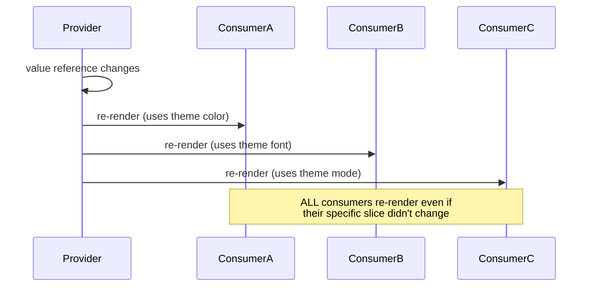
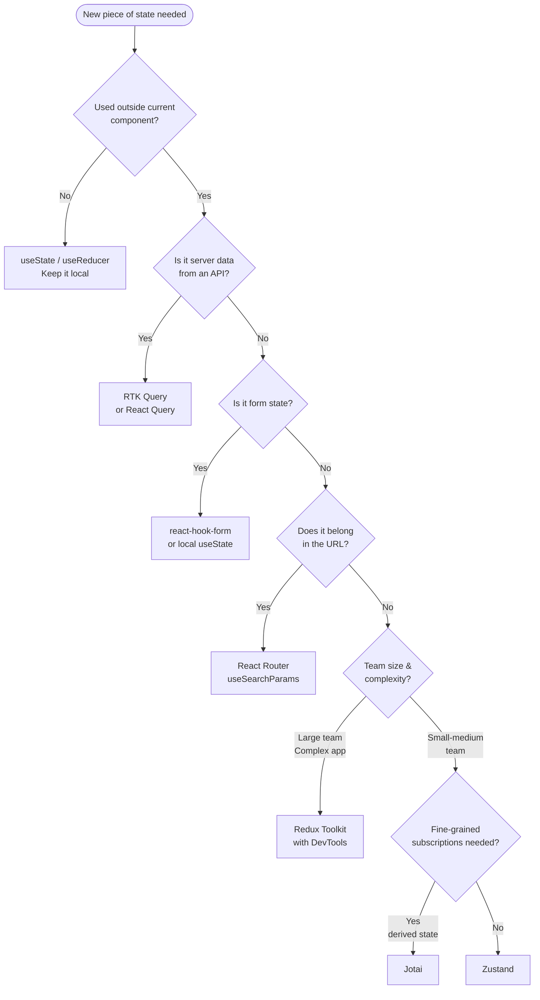

# React State Management — Context, Redux Toolkit, Zustand

> Revision notes for experienced JS developers. Assumes you know React basics. Focus is on the WHY, the gotchas, and production-grade patterns.

---

## 🗺️ The Mental Model Before Everything Else

State in React is a spectrum, not a binary choice. The mistake most developers make is reaching for global state too early. Before picking a library, classify your state:

| State Type | Lives Where | Examples |
|---|---|---|
| **UI State** | Component-local | modal open, tab active, form dirty |
| **Server Cache** | Global (RTK Query / React Query) | API responses, paginated lists |
| **Global Client State** | Global store | auth user, theme, cart |
| **URL State** | Browser URL | filters, pagination, current page |
| **Form State** | Local (react-hook-form / local) | field values, validation errors |

URL state is criminally underused. Filters, search terms, pagination? Put them in the URL. It is free, shareable, and survives a refresh.

```mermaid
flowchart TD
    Q1{Is state used by\nmore than one component?} -->|No| LOCAL[useState / useReducer]
    Q1 -->|Yes| Q2{Does it change\nfrequently? (keystrokes, scroll)}
    Q2 -->|No| Q3{Is it server data\n(API responses)?}
    Q2 -->|Yes| ZUSTAND[Zustand with\nfine-grained selectors]
    Q3 -->|Yes| RTK[RTK Query]
    Q3 -->|No| Q4{Is the team large?\nNeed time-travel debug?}
    Q4 -->|Yes| REDUX[Redux Toolkit]
    Q4 -->|No| Q5{Complex derived\nstate / atom subscriptions?}
    Q5 -->|Yes| JOTAI[Jotai / Recoil]
    Q5 -->|No| CONTEXT[Context API\nor Zustand]
```

---

## 🏠 Local State — useState and useReducer

You already know `useState`. But there is a specific point where you should switch to `useReducer`: when **next state depends on previous state through multiple sub-values**, or when you have **multiple dispatch actions that affect the same piece of state**.

### When `useReducer` beats `useState`

```tsx
// BAD — multiple useState that always change together
const [isLoading, setIsLoading] = useState(false);
const [data, setData] = useState(null);
const [error, setError] = useState(null);

// GOOD — colocated, impossible states eliminated
type FetchState<T> =
  | { status: 'idle' }
  | { status: 'loading' }
  | { status: 'success'; data: T }
  | { status: 'error'; error: Error };

function fetchReducer<T>(state: FetchState<T>, action: Action): FetchState<T> {
  switch (action.type) {
    case 'FETCH_START': return { status: 'loading' };
    case 'FETCH_SUCCESS': return { status: 'success', data: action.payload };
    case 'FETCH_ERROR': return { status: 'error', error: action.payload };
    default: return state;
  }
}
```

The discriminated union (`status: 'loading'` vs `status: 'success'`) makes impossible states **unrepresentable**. You can never have `isLoading: true` and `data: someValue` simultaneously — a real bug in the multi-useState version.

---

## 🌐 Context API — The Right Tool for the Right Job

Context is not a state manager. It is a **dependency injection mechanism**. It solves prop drilling, but it is not a replacement for Redux or Zustand.

### How Context Actually Works

Every consumer re-renders when the context value reference changes. This is the source of 90% of Context performance bugs.



### When Context is RIGHT

- Theme (changes once per session at most)
- Authenticated user object (changes on login/logout only)
- Locale / i18n
- Feature flags
- Modal/toast service (rarely updated)

### When Context is WRONG

- Form state (every keystroke triggers re-renders across entire tree)
- Shopping cart with quantity adjustments
- Real-time data (WebSocket feeds)
- Any state that updates more than ~1/second

> **Here's the trap most devs fall into:** They build a `UserContext` that holds the user object, and then add `notifications`, `unreadCount`, and `preferences` to the same context object. Now every notification update re-renders every component that only needed the user's name.

### The Fix — Split Contexts

```tsx
// BAD — one fat context
const AppContext = createContext<{
  user: User;
  notifications: Notification[];
  theme: Theme;
}>(null!);

// GOOD — split by update frequency
const UserContext = createContext<User>(null!);
const ThemeContext = createContext<Theme>(null!);
const NotificationContext = createContext<Notification[]>([]);

// Now a notification update only re-renders notification consumers
```

### Optimizing Context with useMemo

```tsx
function AuthProvider({ children }: { children: React.ReactNode }) {
  const [user, setUser] = useState<User | null>(null);

  // Without useMemo: new object reference every render = all consumers re-render
  // With useMemo: stable reference until user changes
  const value = useMemo(
    () => ({
      user,
      login: async (creds: Credentials) => {
        const u = await authService.login(creds);
        setUser(u);
      },
      logout: () => {
        authService.logout();
        setUser(null);
      },
    }),
    [user] // only recreate when user changes
  );

  return <UserContext.Provider value={value}>{children}</UserContext.Provider>;
}
```

### createContext with Default Value Pattern

Always provide a meaningful default — it doubles as documentation and prevents null crashes in tests:

```tsx
interface ThemeContextValue {
  mode: 'light' | 'dark';
  toggle: () => void;
}

// Default prevents "cannot read property of null" in tests
// and documents the shape
const ThemeContext = createContext<ThemeContextValue>({
  mode: 'light',
  toggle: () => {
    if (process.env.NODE_ENV !== 'production') {
      console.warn('ThemeContext used outside of ThemeProvider');
    }
  },
});

// Custom hook — enforces usage within provider
export function useTheme() {
  return useContext(ThemeContext);
}
```

### Context + useReducer = "Poor Man's Redux"

For medium complexity without a library:

```tsx
type Action =
  | { type: 'SET_USER'; payload: User }
  | { type: 'LOGOUT' }
  | { type: 'UPDATE_PREFERENCES'; payload: Partial<Preferences> };

function authReducer(state: AuthState, action: Action): AuthState {
  switch (action.type) {
    case 'SET_USER': return { ...state, user: action.payload, isAuthenticated: true };
    case 'LOGOUT': return { user: null, isAuthenticated: false, preferences: defaultPrefs };
    case 'UPDATE_PREFERENCES':
      return { ...state, preferences: { ...state.preferences, ...action.payload } };
  }
}

// Separate dispatch context — consumers that only dispatch never re-render on state changes
const AuthStateContext = createContext<AuthState>(null!);
const AuthDispatchContext = createContext<React.Dispatch<Action>>(null!);
```

This "separate state and dispatch context" pattern is a significant optimization — components that only need to dispatch actions never re-render when state changes.

---

## ⚡ Redux Toolkit — When You Need Seriousness

Plain Redux in 2024 is malpractice. RTK eliminates the boilerplate while keeping everything Redux is good at: predictable state, time-travel debugging, and ecosystem (middleware, DevTools).

### Why RTK Over Vanilla Redux

| Vanilla Redux | Redux Toolkit |
|---|---|
| Separate action types, action creators, reducer | `createSlice` — all three in one |
| Manual immutable spread: `{ ...state, items: [...state.items, newItem] }` | Immer baked in: `state.items.push(newItem)` |
| Manual thunk boilerplate | `createAsyncThunk` with auto pending/fulfilled/rejected |
| No data fetching built in | RTK Query — full data fetching + caching layer |
| Selector performance: manual `reselect` | Integrated `createSelector` |

### createSlice — The Core

```tsx
// features/cart/cartSlice.ts
import { createSlice, PayloadAction, createSelector } from '@reduxjs/toolkit';

interface CartItem {
  id: string;
  name: string;
  price: number;
  quantity: number;
}

interface CartState {
  items: CartItem[];
  couponCode: string | null;
  discountPercent: number;
}

const initialState: CartState = {
  items: [],
  couponCode: null,
  discountPercent: 0,
};

const cartSlice = createSlice({
  name: 'cart',
  initialState,
  reducers: {
    addItem(state, action: PayloadAction<CartItem>) {
      // Immer lets you mutate directly — it produces a new state under the hood
      const existing = state.items.find(i => i.id === action.payload.id);
      if (existing) {
        existing.quantity += 1;
      } else {
        state.items.push(action.payload);
      }
    },
    removeItem(state, action: PayloadAction<string>) {
      state.items = state.items.filter(i => i.id !== action.payload);
    },
    applyCoupon(state, action: PayloadAction<{ code: string; discount: number }>) {
      state.couponCode = action.payload.code;
      state.discountPercent = action.payload.discount;
    },
    clearCart(state) {
      state.items = [];
      state.couponCode = null;
      state.discountPercent = 0;
    },
  },
  // extraReducers handles actions from OTHER slices or async thunks
  extraReducers: (builder) => {
    builder.addCase(checkoutThunk.fulfilled, (state) => {
      state.items = [];
    });
  },
});

export const { addItem, removeItem, applyCoupon, clearCart } = cartSlice.actions;
export default cartSlice.reducer;

// Memoized selectors — only recompute when inputs change
export const selectCartItems = (state: RootState) => state.cart.items;
export const selectCartTotal = createSelector(
  selectCartItems,
  (state: RootState) => state.cart.discountPercent,
  (items, discount) => {
    const subtotal = items.reduce((sum, item) => sum + item.price * item.quantity, 0);
    return subtotal * (1 - discount / 100);
  }
);
```

> **Here's the trap most devs fall into:** Writing mutations in `extraReducers` and thinking they work the same as `reducers`. They do — but developers forget to add the async thunk's type to `extraReducers` and end up with undefined action handlers that silently do nothing.

### createAsyncThunk — Async the Right Way

```tsx
// features/products/productsThunks.ts
import { createAsyncThunk } from '@reduxjs/toolkit';

// createAsyncThunk<ReturnType, ArgType, ThunkApiConfig>
export const fetchProductsByCategory = createAsyncThunk<
  Product[],
  string, // categoryId
  { rejectValue: ApiError }
>(
  'products/fetchByCategory',
  async (categoryId, { rejectWithValue, signal }) => {
    try {
      // signal is an AbortSignal — RTK auto-aborts on component unmount
      const response = await api.get(`/products?category=${categoryId}`, { signal });
      return response.data;
    } catch (err) {
      if (api.isAxiosError(err) && err.response) {
        return rejectWithValue({ message: err.response.data.message, status: err.response.status });
      }
      throw err;
    }
  }
);

// In the slice
const productsSlice = createSlice({
  name: 'products',
  initialState: { items: [] as Product[], status: 'idle' as LoadingStatus, error: null as string | null },
  reducers: {},
  extraReducers: (builder) => {
    builder
      .addCase(fetchProductsByCategory.pending, (state) => {
        state.status = 'loading';
        state.error = null;
      })
      .addCase(fetchProductsByCategory.fulfilled, (state, action) => {
        state.status = 'success';
        state.items = action.payload;
      })
      .addCase(fetchProductsByCategory.rejected, (state, action) => {
        state.status = 'error';
        // action.payload is typed as ApiError because of rejectWithValue
        state.error = action.payload?.message ?? 'Unknown error';
      });
  },
});
```

### RTK Query — The Killer Feature

RTK Query is what makes RTK genuinely competitive with React Query. It handles: fetching, caching, deduplication, background refetch, optimistic updates, and cache invalidation.

```tsx
// services/api.ts — single source of truth for all API calls
import { createApi, fetchBaseQuery } from '@reduxjs/toolkit/query/react';

export const shopApi = createApi({
  reducerPath: 'shopApi', // key in Redux store
  baseQuery: fetchBaseQuery({
    baseUrl: '/api',
    prepareHeaders: (headers, { getState }) => {
      const token = (getState() as RootState).auth.token;
      if (token) headers.set('Authorization', `Bearer ${token}`);
      return headers;
    },
  }),
  tagTypes: ['Product', 'Cart', 'Order'],
  endpoints: (builder) => ({

    // QUERY — GET data
    getProducts: builder.query<Product[], { category?: string; page: number }>({
      query: ({ category, page }) => `/products?page=${page}${category ? `&category=${category}` : ''}`,
      providesTags: (result) =>
        result
          ? [...result.map(({ id }) => ({ type: 'Product' as const, id })), 'Product']
          : ['Product'],
    }),

    getProduct: builder.query<Product, string>({
      query: (id) => `/products/${id}`,
      providesTags: (_, __, id) => [{ type: 'Product', id }],
    }),

    // MUTATION — POST/PUT/DELETE
    addToCart: builder.mutation<Cart, { productId: string; quantity: number }>({
      query: (body) => ({ url: '/cart/items', method: 'POST', body }),
      invalidatesTags: ['Cart'], // auto-refetch anything tagged 'Cart'
    }),

    placeOrder: builder.mutation<Order, OrderPayload>({
      query: (body) => ({ url: '/orders', method: 'POST', body }),
      invalidatesTags: ['Cart', 'Order'],
      // Optimistic update
      onQueryStarted: async (_, { dispatch, queryFulfilled }) => {
        try {
          await queryFulfilled;
        } catch {
          // Rollback logic if needed
        }
      },
    }),
  }),
});

// Auto-generated hooks
export const {
  useGetProductsQuery,
  useGetProductQuery,
  useAddToCartMutation,
  usePlaceOrderMutation,
} = shopApi;
```

Using these in a component:

```tsx
function ProductList({ category }: { category: string }) {
  const [page, setPage] = useState(1);

  // Automatic: loading state, error state, caching, deduplication, background refetch
  const { data: products, isLoading, isFetching, error } = useGetProductsQuery({ category, page });

  // isFetching is true during background refetch; isLoading is true only on first load
  // This distinction lets you show a subtle spinner instead of blocking the whole UI

  const [addToCart, { isLoading: isAddingToCart }] = useAddToCartMutation();

  if (isLoading) return <SkeletonGrid />;
  if (error) return <ErrorBoundaryFallback error={error} />;

  return (
    <div>
      {isFetching && <TopProgressBar />}
      {products?.map(p => (
        <ProductCard
          key={p.id}
          product={p}
          onAddToCart={() => addToCart({ productId: p.id, quantity: 1 })}
          isAddingToCart={isAddingToCart}
        />
      ))}
      <Pagination page={page} onPageChange={setPage} />
    </div>
  );
}
```

> **Here's the trap most devs fall into:** Using `useEffect` + `fetch` alongside RTK Query, duplicating the same endpoint with no caching or deduplication. If you have RTK Query in your project, ALL data fetching should go through it. The cache invalidation system only works if RTK knows about every mutation.

### configureStore — Putting It Together

```tsx
// store/index.ts
import { configureStore } from '@reduxjs/toolkit';
import { shopApi } from '../services/api';
import cartReducer from '../features/cart/cartSlice';
import authReducer from '../features/auth/authSlice';

export const store = configureStore({
  reducer: {
    cart: cartReducer,
    auth: authReducer,
    [shopApi.reducerPath]: shopApi.reducer, // RTK Query's own reducer
  },
  middleware: (getDefaultMiddleware) =>
    getDefaultMiddleware().concat(shopApi.middleware), // RTK Query's cache middleware
  devTools: process.env.NODE_ENV !== 'production',
});

export type RootState = ReturnType<typeof store.getState>;
export type AppDispatch = typeof store.dispatch;

// Typed hooks — use these instead of raw useSelector/useDispatch
export const useAppSelector = useSelector.withTypes<RootState>();
export const useAppDispatch = useDispatch.withTypes<AppDispatch>();
```

---

## 🐻 Zustand — Simple, Fast, No Ceremony

Zustand is what you reach for when Redux feels like overkill but Context has performance problems. The entire model is: a module-level store, hooks to read/write it, selectors to avoid over-rendering.

### No Provider Needed — This Is the Point

```tsx
// store/authStore.ts
import { create } from 'zustand';
import { persist, devtools } from 'zustand/middleware';
import { immer } from 'zustand/middleware/immer';

interface User {
  id: string;
  email: string;
  role: 'admin' | 'user';
  preferences: { theme: 'light' | 'dark'; notifications: boolean };
}

interface AuthStore {
  user: User | null;
  token: string | null;
  isAuthenticated: boolean;
  isLoading: boolean;
  // Actions live IN the store — no action creators, no dispatch
  login: (credentials: { email: string; password: string }) => Promise<void>;
  logout: () => void;
  updatePreferences: (prefs: Partial<User['preferences']>) => void;
}

export const useAuthStore = create<AuthStore>()(
  devtools(
    persist(
      immer((set, get) => ({
        user: null,
        token: null,
        isAuthenticated: false,
        isLoading: false,

        login: async ({ email, password }) => {
          set({ isLoading: true });
          try {
            const { user, token } = await authApi.login({ email, password });
            set({ user, token, isAuthenticated: true, isLoading: false });
          } catch (error) {
            set({ isLoading: false });
            throw error; // Re-throw so the component can handle UI feedback
          }
        },

        logout: () => {
          authApi.logout();
          set({ user: null, token: null, isAuthenticated: false });
        },

        updatePreferences: (prefs) => {
          set((state) => {
            // immer middleware lets us mutate directly
            if (state.user) {
              Object.assign(state.user.preferences, prefs);
            }
          });
        },
      })),
      {
        name: 'auth-storage', // localStorage key
        partialize: (state) => ({ token: state.token, user: state.user }), // Only persist these fields
      }
    ),
    { name: 'AuthStore' } // DevTools label
  )
);
```

### Selectors — The Re-render Prevention Mechanism

> **Here's the trap most devs fall into:** Calling `useAuthStore()` without a selector. This subscribes the component to the ENTIRE store — any change to `isLoading`, `token`, anything, re-renders the component even if it only displays the user's name.

```tsx
// BAD — re-renders on every store change
function UserAvatar() {
  const { user } = useAuthStore(); // entire store subscription
  return ;
}

// GOOD — re-renders ONLY when user.avatarUrl changes
function UserAvatar() {
  const avatarUrl = useAuthStore((state) => state.user?.avatarUrl);
  return ;
}

// GOOD — stable selector reference (if the selector is expensive)
const selectUserRole = (state: AuthStore) => state.user?.role;

function AdminPanel() {
  const role = useAuthStore(selectUserRole);
  if (role !== 'admin') return null;
  return <AdminDashboard />;
}
```

Zustand uses `Object.is` to compare selector results. For derived arrays/objects, use the `shallow` equality function:

```tsx
import { shallow } from 'zustand/shallow';

// Without shallow: new array reference on every render = always re-renders
// With shallow: only re-renders if array elements change
function CartSummary() {
  const { items, total } = useCartStore(
    (state) => ({ items: state.items, total: state.total }),
    shallow // second argument: equality function
  );
}
```

### Middleware Stack

```tsx
create<Store>()(
  devtools(     // Redux DevTools support
    persist(    // localStorage/sessionStorage/IndexedDB
      immer(    // Immer for mutation-style updates
        (set, get) => ({ /* store */ })
      ),
      { name: 'my-store' }
    ),
    { name: 'MyStore', enabled: process.env.NODE_ENV !== 'production' }
  )
);
```

### Zustand vs RTK — When to Pick Which

| Scenario | Winner | Reason |
|---|---|---|
| Small-medium app, minimal team | Zustand | Less boilerplate, faster to ship |
| Large team, multiple devs on same state | RTK | Slice ownership, strict action model |
| Data fetching + caching | RTK Query | Built-in, powerful |
| Simple global state (auth, theme, cart) | Zustand | No providers, simpler API |
| Need time-travel debugging | RTK | First-class DevTools support |
| Server-side rendering | RTK | Better SSR hydration story |
| Complex cross-slice logic | RTK | Middleware ecosystem, selectors |
| Need fine-grained re-render control | Zustand | Selector model is simpler |

---

## ⚛️ Jotai / Recoil — Atomic State

Jotai (prefer over Recoil — smaller, no string keys) wins when you have **derived state that depends on multiple independent atoms** or **partial tree subscriptions**.

The mental model: state as a graph of atoms, not a single tree.

```tsx
import { atom, useAtom, useAtomValue, useSetAtom } from 'jotai';

const userAtom = atom<User | null>(null);
const themeAtom = atom<'light' | 'dark'>('light');

// Derived atom — recomputes when userAtom changes
const isAdminAtom = atom((get) => get(userAtom)?.role === 'admin');

// Async atom — suspense-compatible
const userProfileAtom = atom(async (get) => {
  const user = get(userAtom);
  if (!user) return null;
  return await api.getProfile(user.id);
});

// Write-only atom (actions)
const loginAtom = atom(null, async (get, set, credentials: Credentials) => {
  const user = await authApi.login(credentials);
  set(userAtom, user);
});

function LoginButton() {
  const login = useSetAtom(loginAtom); // doesn't subscribe to any atom value
  return <button onClick={() => login({ email, password })}>Login</button>;
}
```

When Jotai wins over Zustand/RTK: you have many small independent pieces of state that different parts of the tree subscribe to independently, and you want React Suspense integration out of the box.

---

## 🔐 Production Example: Auth State with Zustand

Full production auth flow:

```tsx
// store/authStore.ts
import { create } from 'zustand';
import { persist, devtools } from 'zustand/middleware';
import { immer } from 'zustand/middleware/immer';
import { authApi } from '../api/auth';

type AuthStatus = 'idle' | 'loading' | 'authenticated' | 'unauthenticated';

interface AuthStore {
  status: AuthStatus;
  user: User | null;
  token: string | null;
  error: string | null;
  login: (creds: Credentials) => Promise<void>;
  logout: () => Promise<void>;
  refreshSession: () => Promise<void>;
  clearError: () => void;
}

export const useAuthStore = create<AuthStore>()(
  devtools(
    persist(
      immer((set, get) => ({
        status: 'idle',
        user: null,
        token: null,
        error: null,

        login: async (creds) => {
          set({ status: 'loading', error: null });
          try {
            const { user, token } = await authApi.login(creds);
            set({ status: 'authenticated', user, token });
          } catch (err) {
            set({
              status: 'unauthenticated',
              error: err instanceof ApiError ? err.message : 'Login failed',
            });
            throw err;
          }
        },

        logout: async () => {
          const token = get().token;
          // Clear local state immediately for instant UI response
          set({ status: 'unauthenticated', user: null, token: null });
          // Fire-and-forget server logout
          authApi.logout(token).catch(console.error);
        },

        refreshSession: async () => {
          const token = get().token;
          if (!token) return;
          try {
            const { user, token: newToken } = await authApi.refresh(token);
            set({ user, token: newToken, status: 'authenticated' });
          } catch {
            set({ status: 'unauthenticated', user: null, token: null });
          }
        },

        clearError: () => set({ error: null }),
      })),
      {
        name: 'auth',
        partialize: ({ token, user }) => ({ token, user }),
        onRehydrateStorage: () => (state) => {
          // After rehydration from localStorage, verify the token is still valid
          if (state?.token) {
            state.refreshSession();
          }
        },
      }
    ),
    { name: 'Auth' }
  )
);

// Route guard hook
export function useRequireAuth(redirectTo = '/login') {
  const status = useAuthStore((s) => s.status);
  const navigate = useNavigate();

  useEffect(() => {
    if (status === 'unauthenticated') navigate(redirectTo);
  }, [status, navigate, redirectTo]);

  return status === 'authenticated';
}
```

---

## 📡 Production Example: API Data with RTK Query

```tsx
// features/dashboard/DashboardPage.tsx
function DashboardPage() {
  const userId = useAuthStore((s) => s.user?.id);

  // Multiple queries — RTK deduplicates concurrent identical requests
  const { data: stats, isLoading: statsLoading } = useGetUserStatsQuery(userId!, {
    skip: !userId,
    pollingInterval: 30_000, // background refresh every 30s
    refetchOnFocus: true,    // refetch when tab regains focus
  });

  const { data: recentOrders } = useGetRecentOrdersQuery(
    { userId: userId!, limit: 5 },
    { skip: !userId }
  );

  // Prefetch on hover — loads data before user clicks
  const prefetchOrders = usePrefetch('getOrderHistory');

  return (
    <div>
      <StatsGrid stats={stats} isLoading={statsLoading} />
      <RecentOrdersList
        orders={recentOrders}
        onViewAllHover={() => prefetchOrders({ userId: userId!, page: 1 })}
      />
    </div>
  );
}
```

---

## 📝 Production Example: Form State (Keep It Local)

```tsx
// Always keep form state local — never put it in global store
function CheckoutForm() {
  // react-hook-form manages its own state — zero re-renders on keystroke
  const { register, handleSubmit, watch, formState: { errors, isSubmitting } } = useForm<CheckoutData>({
    defaultValues: { shippingAddress: '', paymentMethod: 'card' },
    resolver: zodResolver(checkoutSchema),
  });

  const [placeOrder, { isLoading }] = usePlaceOrderMutation();

  const onSubmit = async (data: CheckoutData) => {
    try {
      const order = await placeOrder(data).unwrap(); // .unwrap() throws on RTK Query errors
      navigate(`/orders/${order.id}/confirmation`);
    } catch (err) {
      toast.error('Order failed. Please try again.');
    }
  };

  return (
    <form onSubmit={handleSubmit(onSubmit)}>
      <input {...register('shippingAddress')} />
      {errors.shippingAddress && <span>{errors.shippingAddress.message}</span>}
      <button type="submit" disabled={isSubmitting || isLoading}>
        {isLoading ? 'Placing Order...' : 'Place Order'}
      </button>
    </form>
  );
}
```

---

## 🎯 The Decision Tree — Which State Manager



---

## 🔍 Interview-Ready Deep Questions

**Q: Why does Redux insist on immutability?**
Time-travel debugging requires storing every past state snapshot. Mutable state means all references point to the same object — there is nothing to replay. Immutability enables `prev !== next` reference equality checks in `react-redux` `useSelector` to prevent unnecessary re-renders.

**Q: How does RTK Query cache invalidation work?**
Every query `providesTags` (declares what it depends on). Every mutation `invalidatesTags` (declares what it makes stale). When a mutation fires, RTK Query finds all active queries whose provided tags intersect the mutation's invalidated tags, and marks them stale — triggering a background refetch. It is a tag-based pub/sub system over the cache.

**Q: What is the stale-while-revalidate pattern in RTK Query?**
`keepUnusedDataFor` (default: 60 seconds) keeps cache alive after component unmounts. When a component re-mounts within that window, it immediately serves stale data (fast render) while fetching fresh data in the background. Users see content instantly rather than a loading spinner.

**Q: Zustand vs Context for global auth state — which wins and why?**
Zustand. With Context, every component wrapped in `AuthProvider` re-renders when auth state changes (unless you meticulously split and memoize). Zustand's selector model means only components that subscribe to the specific changed slice re-render. In a large app the difference is significant. Context wins only if you want zero dependencies.

**Q: When would you avoid Redux entirely?**
Solo project or small team where the overhead of slice-per-feature structure slows delivery. Apps where all "global" state is actually server cache (RTK Query or React Query handles this without Redux). When you need atomic/derived state patterns (Jotai is cleaner). Redux's strength is predictability and tooling at scale — at small scale, that is overhead.

---

## 🚨 Common Gotchas Summary

| Gotcha | Problem | Fix |
|---|---|---|
| Fat Context | Every consumer re-renders on any change | Split contexts by update frequency |
| No selector in Zustand | `useStore()` — re-renders on all changes | Always pass selector: `useStore(s => s.field)` |
| Mutable Redux | Direct state mutation | Use Immer (built into RTK) or spread |
| Forgetting RTK middleware | Cache never invalidates | Always add `shopApi.middleware` in configureStore |
| `.unwrap()` missing | RTK mutation errors silently swallowed | Use `.unwrap()` to get a throwable promise |
| Mixed fetch strategies | Some components use useEffect+fetch, some RTK Query | Commit to one — mixing breaks cache invalidation |
| Form state in Redux | Thousands of dispatches per session | Keep form state local (react-hook-form) |
| Storing derived state | Computing total price in Redux | Use `createSelector` — compute, don't store |
| `useEffect` for auth redirect | Flashes wrong content before redirect | Check auth in loader (React Router v6) or middleware |
