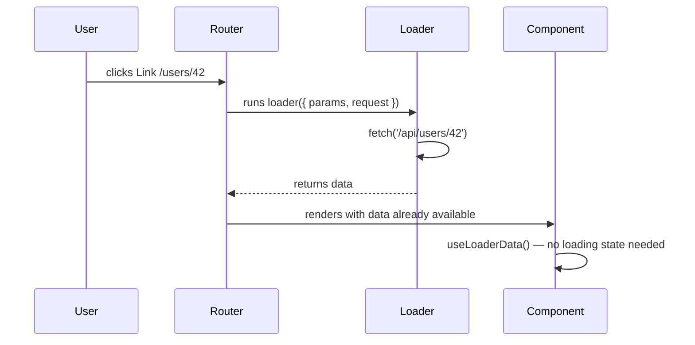

# React Router v6 + Data Fetching Patterns — Revision Notes

> Target: Experienced JS developer. Skip basics. Go deep on WHY, edge cases, and production reality.

---

# PART 1 — React Router v6

---

## 🗺️ 1. BrowserRouter Setup, Routes + Route, Outlet (Nested Routes), Link vs NavLink

### The Mental Model Shift from v5 → v6

React Router v6 is a complete rethink, not an upgrade. The biggest shift: **route matching is now exhaustive and ranked**, not first-match-wins. You no longer need `<Switch>` and `exact` — the router scores each route by specificity.

```
v5: first match wins (Switch) — order matters
v6: best match wins (Routes)  — order irrelevant
```

### BrowserRouter vs createBrowserRouter

You have two setup paths in v6. Know BOTH because the second unlocks the entire data API:

```jsx
// PATH A — Classic JSX-based (v6.0–6.3 style)
// Works, but NO access to loaders/actions
import { BrowserRouter, Routes, Route } from 'react-router-dom';

function App() {
  return (
    <BrowserRouter>
      <Routes>
        <Route path="/" element={<Layout />}>
          <Route index element={<Home />} />
          <Route path="dashboard" element={<Dashboard />} />
          <Route path="users/:id" element={<UserProfile />} />
          <Route path="*" element={<NotFound />} />
        </Route>
      </Routes>
    </BrowserRouter>
  );
}

// PATH B — Data API style (v6.4+) — createBrowserRouter
// Unlocks: loaders, actions, fetchers, defer
import { createBrowserRouter, RouterProvider } from 'react-router-dom';

const router = createBrowserRouter([
  {
    path: '/',
    element: <Layout />,
    errorElement: <ErrorBoundary />,
    children: [
      { index: true, element: <Home /> },
      {
        path: 'dashboard',
        element: <Dashboard />,
        loader: dashboardLoader,      // runs before component renders
      },
      {
        path: 'users/:id',
        element: <UserProfile />,
        loader: userLoader,
      },
    ],
  },
]);

function App() {
  return <RouterProvider router={router} />;
}
```

> **Here's the trap most devs fall into:** They use `BrowserRouter` and then wonder why `useLoaderData()` always returns `undefined`. Loaders only work with `createBrowserRouter` / `createMemoryRouter` / `createHashRouter`. The JSX `<BrowserRouter>` approach is a legacy path.

### Nested Routes and Outlet

Nesting in v6 is **declarative and layout-driven**. The parent component must render `<Outlet />` — it's the slot where child routes inject their content.

```jsx
// Layout.tsx — parent component
import { Outlet, Link } from 'react-router-dom';

function Layout() {
  return (
    <div className="app-shell">
      <nav>
        <Link to="/">Home</Link>
        <Link to="/dashboard">Dashboard</Link>
      </nav>
      <main>
        <Outlet />  {/* child route renders here */}
      </main>
    </div>
  );
}
```

**Outlet with context** — you can pass data down to child routes via Outlet without prop drilling:

```jsx
// Parent
<Outlet context={{ user: currentUser, permissions }} />

// Child
import { useOutletContext } from 'react-router-dom';
const { user, permissions } = useOutletContext<{ user: User; permissions: string[] }>();
```

**Index routes** — the route that renders when the parent path matches exactly (no trailing segment):

```jsx
{ path: 'settings', element: <SettingsLayout />, children: [
  { index: true, element: <GeneralSettings /> },  // /settings
  { path: 'security', element: <SecuritySettings /> },  // /settings/security
]}
```

### Link vs NavLink

| Feature | `Link` | `NavLink` |
|---|---|---|
| Purpose | Navigation only | Navigation + active styling |
| `className` | Static string | Function `(isActive, isPending) => string` |
| `style` | Static object | Function `(isActive) => object` |
| `aria-current` | Not added | Added automatically when active |
| Use when | Generic links | Navbars, tabs, menus |

```jsx
// NavLink — the className-as-function pattern is key
<NavLink
  to="/dashboard"
  className={({ isActive, isPending }) =>
    isActive ? 'nav-link active' : isPending ? 'nav-link pending' : 'nav-link'
  }
>
  Dashboard
</NavLink>

// isPending is ONLY truthy when using loaders (data API)
// It signals the next route's loader is running but navigation hasn't committed
```

> **Here's the trap most devs fall into:** Using `to="dashboard"` (relative) vs `to="/dashboard"` (absolute) inside nested routes. Relative paths resolve relative to the current route segment — which can bite you inside deeply nested layouts. Always use absolute paths in navbars to be safe.

---

## 🔑 2. Route Parameters (useParams) and Search Params (useSearchParams)

### useParams — Route Segments as State

`useParams()` returns an object of all matched dynamic segments. TypeScript users: params are always `string | undefined`.

```tsx
// Route: /users/:userId/posts/:postId
const { userId, postId } = useParams<{ userId: string; postId: string }>();
// These are ALWAYS strings — parse integers explicitly
const id = parseInt(userId!, 10);
```

> **Here's the trap most devs fall into:** Treating params as stable references. If the user navigates from `/users/1` to `/users/2`, the component **does NOT remount** — only the param changes. You must react to param changes with `useEffect([userId])` or loaders.

```jsx
// WRONG — fetches only on mount
useEffect(() => {
  fetchUser(userId);
}, []); // userId is missing from deps

// RIGHT
useEffect(() => {
  fetchUser(userId);
}, [userId]); // refetches when route changes
```

### useSearchParams — Treat It Like useState for the URL

Search params (`?filter=active&page=2`) are **URL-encoded state**. `useSearchParams` mirrors the `useState` API deliberately.

```tsx
const [searchParams, setSearchParams] = useSearchParams();

// Read
const filter = searchParams.get('filter') ?? 'all';
const page = parseInt(searchParams.get('page') ?? '1', 10);
const tags = searchParams.getAll('tag'); // ?tag=a&tag=b → ['a', 'b']

// Write — MERGES by default (unlike raw URL manipulation)
setSearchParams(prev => {
  prev.set('filter', 'active');
  prev.set('page', '1'); // reset page on filter change
  return prev;
});

// Or replace the whole thing
setSearchParams({ filter: 'active', page: '1' });
```

**Key behaviors to know:**

```jsx
// Updating one param without blowing away others
setSearchParams(prev => {
  prev.set('page', String(newPage));
  return prev; // MUST return the same URLSearchParams object
});

// Navigate options work here too
setSearchParams({ q: 'react' }, { replace: true }); // no history entry
```

**Production pattern — search params as a single source of truth for filters:**

```tsx
function ProductList() {
  const [searchParams, setSearchParams] = useSearchParams();

  const filters = {
    category: searchParams.get('category') ?? '',
    minPrice: Number(searchParams.get('minPrice') ?? 0),
    maxPrice: Number(searchParams.get('maxPrice') ?? Infinity),
    sort: (searchParams.get('sort') ?? 'relevance') as SortOrder,
    page: Number(searchParams.get('page') ?? 1),
  };

  // Shareable URL ✓, browser back button works ✓, bookmark-able ✓
  const updateFilter = (key: string, value: string) => {
    setSearchParams(prev => {
      prev.set(key, value);
      prev.set('page', '1'); // always reset page on filter change
      return prev;
    });
  };

  // ...
}
```

> **Here's the trap most devs fall into:** Mixing search params with local state for the same concern. If the filter lives in `useState`, the URL is stale, sharing doesn't work, and the back button breaks. Commit to one or the other.

---

## 🧭 3. Programmatic Navigation (useNavigate — replace vs push)

```tsx
import { useNavigate } from 'react-router-dom';
const navigate = useNavigate();

// Push — adds to history stack (user can go back)
navigate('/dashboard');
navigate(`/users/${userId}`);

// Replace — replaces current entry (user CANNOT go back)
navigate('/login', { replace: true });

// Relative navigation — go up one segment
navigate('..'); // equivalent of clicking back in route tree

// State — pass transient data without URL params
navigate('/confirmation', {
  state: { orderId, items, total },
});
// Receive in destination:
const { orderId } = useLocation().state as OrderState;
```

**When to use `replace: true`:**
- After form submission (prevent re-POST on back button)
- After authentication (don't let user navigate back to login)
- After redirect from 404 to home
- Any "you shouldn't come back here" scenario

**When to use state:**
- Flash messages / toasts after redirect
- Passing context that doesn't belong in the URL (e.g., "came from search results")
- Transient wizard step data

> **Here's the trap most devs fall into:** Relying on `navigate(-1)` as a "back button" without considering the case where the user arrived directly (e.g., opened link in new tab). Always pair it with a fallback: `history.length > 1 ? navigate(-1) : navigate('/dashboard')`.

**Delta navigation:**
```tsx
navigate(-1);  // go back
navigate(1);   // go forward
navigate(-2);  // go back 2 steps
```

---

## 🔐 4. Protected Routes Pattern

The canonical v6 protected route uses a wrapper component that checks auth and renders `<Navigate>` for redirect or `<Outlet>` to pass through.

```tsx
// ProtectedRoute.tsx
import { Navigate, Outlet, useLocation } from 'react-router-dom';
import { useAuth } from '@/hooks/useAuth';

interface ProtectedRouteProps {
  allowedRoles?: string[];
}

function ProtectedRoute({ allowedRoles }: ProtectedRouteProps) {
  const { user, isLoading } = useAuth();
  const location = useLocation();

  if (isLoading) {
    return <FullPageSpinner />; // don't flash redirect before auth resolves
  }

  if (!user) {
    // Preserve intended destination for post-login redirect
    return <Navigate to="/login" state={{ from: location }} replace />;
  }

  if (allowedRoles && !allowedRoles.some(r => user.roles.includes(r))) {
    return <Navigate to="/403" replace />;
  }

  return <Outlet />;
}

// Router config
const router = createBrowserRouter([
  {
    element: <ProtectedRoute />,
    children: [
      { path: '/dashboard', element: <Dashboard /> },
      { path: '/profile', element: <Profile /> },
    ],
  },
  {
    element: <ProtectedRoute allowedRoles={['admin']} />,
    children: [
      { path: '/admin', element: <AdminPanel /> },
    ],
  },
  { path: '/login', element: <Login /> },
]);

// After login — redirect to intended destination
function Login() {
  const navigate = useNavigate();
  const location = useLocation();
  const from = (location.state as any)?.from?.pathname ?? '/dashboard';

  const handleLogin = async (credentials) => {
    await authService.login(credentials);
    navigate(from, { replace: true }); // replace so back doesn't re-hit login
  };
}
```

> **Here's the trap most devs fall into:** Not handling `isLoading` state. If auth state resolves async (e.g., checking token on mount), the component briefly sees `user = null` and fires the redirect — even for authenticated users. Always gate on loading first.

---

## ⚡ 5. Route Loaders and Actions (React Router 6.4+ Data API)

This is the biggest feature of modern React Router — it shifts data fetching from useEffect inside components to **collocated loader functions** that run during navigation, before the component renders.



### Loader

```tsx
// loaders/userLoader.ts
import { LoaderFunctionArgs } from 'react-router-dom';

export async function userLoader({ params }: LoaderFunctionArgs) {
  const res = await fetch(`/api/users/${params.userId}`, {
    headers: { Authorization: `Bearer ${getToken()}` },
  });

  if (res.status === 404) {
    throw new Response('User not found', { status: 404 });
  }
  if (!res.ok) {
    throw new Response('Server error', { status: res.status });
  }

  return res.json(); // returned data is available via useLoaderData()
}

// Route config
{
  path: 'users/:userId',
  element: <UserProfile />,
  loader: userLoader,
  errorElement: <RouteError />,
}

// Component — NO useState, NO useEffect, NO loading spinner needed
function UserProfile() {
  const user = useLoaderData() as User;
  // data is guaranteed to be here — loader ran first
  return <div>{user.name}</div>;
}

// Error boundary for this route
function RouteError() {
  const error = useRouteError();

  if (isRouteErrorResponse(error)) {
    return <div>Error {error.status}: {error.data}</div>;
  }
  return <div>Unexpected error</div>;
}
```

### Actions (Form Mutations)

Actions are the server-side handler for `<Form>` submissions. They work like server actions.

```tsx
// actions/createUserAction.ts
export async function createUserAction({ request }: ActionFunctionArgs) {
  const formData = await request.formData();
  const data = Object.fromEntries(formData);

  const res = await fetch('/api/users', {
    method: 'POST',
    body: JSON.stringify(data),
    headers: { 'Content-Type': 'application/json' },
  });

  if (!res.ok) {
    // Return validation errors — not throw — so component can show them
    return { errors: await res.json() };
  }

  return redirect('/users'); // react-router's redirect, not browser's
}

// Component using React Router's Form (not HTML form)
import { Form, useActionData, useNavigation } from 'react-router-dom';

function CreateUser() {
  const actionData = useActionData() as { errors?: Record<string, string> };
  const navigation = useNavigation();
  const isSubmitting = navigation.state === 'submitting';

  return (
    <Form method="post">
      <input name="name" />
      {actionData?.errors?.name && <span>{actionData.errors.name}</span>}
      <button disabled={isSubmitting}>
        {isSubmitting ? 'Creating...' : 'Create User'}
      </button>
    </Form>
  );
}
```

### defer — Streaming / Waterfall Avoidance

`defer` lets you return a promise from a loader and stream parts of the UI:

```tsx
import { defer, Await } from 'react-router-dom';
import { Suspense } from 'react';

// Loader — don't await the slow call
export async function dashboardLoader() {
  const criticalData = await fetchCriticalData(); // await this — needed immediately
  const slowStats = fetchSlowAnalytics();         // don't await — defer it

  return defer({
    criticalData,    // available immediately
    slowStats,       // promise — resolves later
  });
}

// Component
function Dashboard() {
  const { criticalData, slowStats } = useLoaderData() as DashboardData;

  return (
    <div>
      <h1>{criticalData.title}</h1>
      <Suspense fallback={<StatsSkeleton />}>
        <Await resolve={slowStats} errorElement={<StatsError />}>
          {(stats) => <StatsPanel data={stats} />}
        </Await>
      </Suspense>
    </div>
  );
}
```

> **Here's the trap most devs fall into:** Using `defer` for everything. `defer` means the component renders before the promise resolves — the page shell appears but with skeleton. Use `await` for data critical to the page's first meaningful paint, `defer` for secondary/below-fold data.

---

## ✂️ 6. Code Splitting with lazy + Suspense at Route Level

Route-level code splitting is the highest-ROI optimization for SPAs. Every route becomes its own chunk.

```tsx
import { lazy, Suspense } from 'react';
import { createBrowserRouter, RouterProvider } from 'react-router-dom';

// Each lazy() call = its own JS chunk
const Dashboard = lazy(() => import('./pages/Dashboard'));
const UserProfile = lazy(() => import('./pages/UserProfile'));
const AdminPanel = lazy(() => import('./pages/AdminPanel'));

const router = createBrowserRouter([
  {
    path: '/',
    element: <Layout />,
    children: [
      {
        path: 'dashboard',
        element: (
          <Suspense fallback={<PageSkeleton />}>
            <Dashboard />
          </Suspense>
        ),
        // Loader can still be eagerly imported (tiny, no component code)
        loader: () => import('./loaders/dashboardLoader').then(m => m.dashboardLoader()),
      },
      {
        path: 'users/:id',
        element: (
          <Suspense fallback={<PageSkeleton />}>
            <UserProfile />
          </Suspense>
        ),
      },
    ],
  },
]);
```

**Prefetch on hover — production UX pattern:**

```tsx
// Preload the chunk on hover to eliminate perceived latency
const DashboardPage = lazy(() => import('./pages/Dashboard'));

function prefetchDashboard() {
  import('./pages/Dashboard'); // triggers chunk download without rendering
}

<Link to="/dashboard" onMouseEnter={prefetchDashboard}>
  Dashboard
</Link>
```

> **Here's the trap most devs fall into:** Placing `<Suspense>` too low (wrapping each lazy page individually). Put a single `<Suspense>` at a high level in your layout — this prevents Suspense boundaries from tearing the entire layout on navigation. The fallback should match the overall page chrome, not just the content area.

**With `createBrowserRouter` — lazy route modules (v6.9+):**

```tsx
// The new preferred way — co-locate loader + component
{
  path: 'dashboard',
  lazy: async () => {
    const { loader, default: Component } = await import('./pages/Dashboard');
    return { loader, Component };
  },
}
// Dashboard.tsx exports both default component AND named loader
// This means the loader also code-splits with the component
```

---

# PART 2 — Data Fetching Patterns

---

## 🚨 1. The Problems with useEffect Fetching

Every senior dev has written this at least once. Here's why it's actually broken:

```tsx
// CLASSIC BROKEN PATTERN — do not use in production
function UserList() {
  const [users, setUsers] = useState([]);
  const [loading, setLoading] = useState(false);
  const [error, setError] = useState(null);

  useEffect(() => {
    setLoading(true);
    fetch('/api/users')
      .then(r => r.json())
      .then(setUsers)
      .catch(setError)
      .finally(() => setLoading(false));
  }, []);
}
```

### Problem 1: Race Conditions

```tsx
// User types fast in a search box
// Request A (query="re") starts
// Request B (query="rea") starts
// Request B resolves first, sets state to "rea" results
// Request A resolves SECOND — OVERWRITES with stale "re" results
// UI shows wrong data

// Fix with AbortController
useEffect(() => {
  const controller = new AbortController();

  async function fetchData() {
    try {
      const res = await fetch(`/api/search?q=${query}`, {
        signal: controller.signal,
      });
      setResults(await res.json());
    } catch (e) {
      if (e.name !== 'AbortError') setError(e);
    }
  }

  fetchData();
  return () => controller.abort(); // cancel on re-run
}, [query]);
```

### Problem 2: No Cache — Re-fetches Every Render/Mount

Navigate away and back → re-fetch. Strict Mode in development → component mounts TWICE → two simultaneous requests. Parent re-renders with same props → potential re-fetch.

### Problem 3: Manual Loading/Error State Everywhere

Every component duplicates the loading/error/data state pattern. 10 components = 10 identical state machines.

### Problem 4: Request Waterfalls

```
Parent component mounts → fetches user
  → user loads → child renders → fetches user's posts
    → posts load → sub-child renders → fetches comments
```

Each step waits for the previous. With useEffect you can't easily parallelize server-driven data dependencies.

### Problem 5: No Background Refresh

Stale data stays stale until the user forces a reload. No re-validation on window focus, no polling, no cache invalidation.

---

## ⚡ 2. React Query (TanStack Query v5) — Deep Dive

TanStack Query v5 ships significant API changes from v4. Know the differences.

### Setup

```tsx
import { QueryClient, QueryClientProvider } from '@tanstack/react-query';
import { ReactQueryDevtools } from '@tanstack/react-query-devtools';

const queryClient = new QueryClient({
  defaultOptions: {
    queries: {
      staleTime: 1000 * 60 * 5,   // 5 min — don't refetch if data is fresh
      gcTime: 1000 * 60 * 10,     // 10 min — keep unused cache (was cacheTime in v4)
      retry: 1,                    // retry once on failure
      refetchOnWindowFocus: true,  // refetch when tab regains focus
    },
  },
});

// v4 was cacheTime — v5 renamed to gcTime (Garbage Collection time)
// This is one of the most common migration gotchas

function App() {
  return (
    <QueryClientProvider client={queryClient}>
      <Router />
      <ReactQueryDevtools initialIsOpen={false} />
    </QueryClientProvider>
  );
}
```

### useQuery — The Core API

```tsx
import { useQuery } from '@tanstack/react-query';

// v5 signature — options object only (no positional args like v4)
const {
  data,
  isLoading,      // true only on FIRST load (no cached data)
  isFetching,     // true whenever a request is in-flight (including background)
  isError,
  error,
  isStale,
  dataUpdatedAt,
  refetch,
} = useQuery({
  queryKey: ['users', userId],
  queryFn: ({ signal }) => fetchUser(userId, { signal }), // signal for cancellation
  enabled: !!userId,                    // don't run if userId is undefined
  staleTime: 1000 * 60,                 // override default — fresh for 1 min
  select: (data) => data.users,         // transform/select from cache
  placeholderData: previousData,        // show old data while fetching new
});
```

**`isLoading` vs `isFetching` — the distinction that trips everyone:**

| State | isLoading | isFetching |
|---|---|---|
| First fetch, no cache | `true` | `true` |
| Background refetch (has cache) | `false` | `true` |
| Idle | `false` | `false` |

Use `isLoading` for skeleton/spinner. Use `isFetching` for a subtle loading indicator that shows even during background refetches.

### staleTime vs gcTime

```
Query lifecycle:

FETCH → FRESH (staleTime window)
      → STALE (will refetch in background on next use)
      → INACTIVE (no components using it)
      → GARBAGE COLLECTED (gcTime elapsed)
```

```tsx
// staleTime: how long data is considered "fresh" — no background refetch
// gcTime: how long UNUSED queries stay in cache before being deleted

// Config for rarely-changing reference data (dropdown options, config):
useQuery({
  queryKey: ['countries'],
  queryFn: fetchCountries,
  staleTime: Infinity,  // never re-fetch
  gcTime: Infinity,     // never evict from cache
});

// Config for real-time-ish data (notifications, prices):
useQuery({
  queryKey: ['notifications'],
  queryFn: fetchNotifications,
  staleTime: 0,               // always stale — refetch on every focus/mount
  refetchInterval: 30_000,    // also poll every 30s
});
```

> **Here's the trap most devs fall into:** Setting `staleTime` to 0 (the default) and wondering why their app makes so many requests. The default means every query is immediately stale, causing background refetches on every window focus. Set a reasonable `staleTime` globally.

### useMutation + Invalidation

```tsx
import { useMutation, useQueryClient } from '@tanstack/react-query';

function CreatePostForm() {
  const queryClient = useQueryClient();

  const mutation = useMutation({
    mutationFn: (newPost: CreatePostDTO) =>
      fetch('/api/posts', {
        method: 'POST',
        body: JSON.stringify(newPost),
        headers: { 'Content-Type': 'application/json' },
      }).then(r => r.json()),

    onSuccess: (data, variables, context) => {
      // Option 1: Invalidate — refetch the list
      queryClient.invalidateQueries({ queryKey: ['posts'] });

      // Option 2: Set directly — no refetch needed
      queryClient.setQueryData(['posts', data.id], data);
    },

    onError: (error, variables, context) => {
      // Rollback optimistic update if we set one in onMutate
      if (context?.previousPosts) {
        queryClient.setQueryData(['posts'], context.previousPosts);
      }
    },
  });

  return (
    <form onSubmit={e => {
      e.preventDefault();
      mutation.mutate({ title, body });
    }}>
      <button disabled={mutation.isPending}>
        {mutation.isPending ? 'Posting...' : 'Post'}
      </button>
      {mutation.isError && <span>{mutation.error.message}</span>}
    </form>
  );
}
```

### Optimistic Updates — Full Pattern

```tsx
const mutation = useMutation({
  mutationFn: (updatedPost) => updatePost(updatedPost),

  onMutate: async (updatedPost) => {
    // 1. Cancel any outgoing refetches (to not overwrite optimistic update)
    await queryClient.cancelQueries({ queryKey: ['posts', updatedPost.id] });

    // 2. Snapshot the previous value
    const previousPost = queryClient.getQueryData(['posts', updatedPost.id]);

    // 3. Optimistically update
    queryClient.setQueryData(['posts', updatedPost.id], old => ({
      ...old,
      ...updatedPost,
    }));

    // 4. Return snapshot for rollback
    return { previousPost };
  },

  onError: (err, updatedPost, context) => {
    // 5. Roll back on error
    queryClient.setQueryData(
      ['posts', updatedPost.id],
      context.previousPost
    );
  },

  onSettled: (data, error, variables) => {
    // 6. Always refetch after error or success
    queryClient.invalidateQueries({ queryKey: ['posts', variables.id] });
  },
});
```

### Dependent Queries

```tsx
// Query 2 depends on data from Query 1
const { data: user } = useQuery({
  queryKey: ['user', userId],
  queryFn: () => fetchUser(userId),
});

const { data: projects } = useQuery({
  queryKey: ['projects', user?.organizationId],
  queryFn: () => fetchProjects(user!.organizationId),
  enabled: !!user?.organizationId, // key: enabled gates the query
});
```

### Infinite / Pagination with useInfiniteQuery

```tsx
const {
  data,            // { pages: Page[], pageParams: unknown[] }
  fetchNextPage,
  hasNextPage,
  isFetchingNextPage,
} = useInfiniteQuery({
  queryKey: ['posts', filters],
  queryFn: ({ pageParam = 1 }) => fetchPosts({ page: pageParam, ...filters }),
  getNextPageParam: (lastPage, allPages) => {
    // Return next page param or undefined to signal end
    return lastPage.hasMore ? lastPage.nextCursor : undefined;
  },
  initialPageParam: 1, // v5 requires this (v4 didn't)
});

// Flatten pages for rendering
const allPosts = data?.pages.flatMap(page => page.posts) ?? [];

// Infinite scroll trigger
<div ref={infiniteScrollRef} onClick={() => fetchNextPage()}>
  {isFetchingNextPage ? 'Loading more...' : hasNextPage ? 'Load more' : 'End'}
</div>
```

> **Here's the trap most devs fall into:** Forgetting `initialPageParam` in v5. This is a breaking change from v4. Without it, TypeScript will warn and the query may behave unexpectedly.

---

## 🔄 3. SWR — Stale-While-Revalidate Strategy

SWR (from Vercel/Next.js team) implements the HTTP `stale-while-revalidate` cache strategy: show stale data immediately, then silently revalidate in background.

```tsx
import useSWR from 'swr';
import useSWRMutation from 'swr/mutation';

const fetcher = (url: string) => fetch(url).then(r => r.json());

function UserProfile({ id }: { id: string }) {
  const { data, error, isLoading, isValidating, mutate } = useSWR(
    `/api/users/${id}`,
    fetcher,
    {
      revalidateOnFocus: true,
      revalidateOnReconnect: true,
      dedupingInterval: 2000, // dedupe requests within 2s window
    }
  );

  // isLoading = no data yet (initial)
  // isValidating = revalidating (can have stale data at same time)
}

// Mutation with SWR
const { trigger, isMutating } = useSWRMutation(
  '/api/users',
  async (url, { arg }: { arg: CreateUserDTO }) => {
    return fetch(url, { method: 'POST', body: JSON.stringify(arg) }).then(r => r.json());
  }
);

await trigger(newUser);
mutate(); // revalidate the list
```

### React Query vs SWR — Head to Head

| Feature | TanStack Query v5 | SWR |
|---|---|---|
| Cache key format | Array `['users', id]` | String/function URL |
| Mutation API | `useMutation` (rich lifecycle hooks) | `useSWRMutation` (simpler) |
| Optimistic updates | Full support with rollback | Manual via `mutate(data, false)` |
| Infinite query | `useInfiniteQuery` (built-in) | `useSWRInfinite` |
| Background refetch | Yes | Yes |
| Window focus revalidation | Yes | Yes |
| Devtools | First-class plugin | Unofficial |
| Bundle size | ~13KB gzipped | ~4KB gzipped |
| Pagination | `keepPreviousData` / `placeholderData` | `keepPreviousData` option |
| Server State + Client Sync | Deep, explicit control | Convention over config |
| When to choose | Large apps, complex mutations, teams | Next.js apps, simpler needs |

> **Here's the trap most devs fall into:** Choosing SWR because it's smaller, but then needing optimistic updates + rollback + dependent query chains — features that require significant custom code with SWR but are first-class in TanStack Query.

---

## 🏭 4. Query Key Factory Pattern

As apps grow, ad-hoc query key strings like `['users', id, 'posts']` become impossible to maintain. The factory pattern solves this.

```ts
// queryKeys.ts — single source of truth for all query keys
export const queryKeys = {
  users: {
    all: () => ['users'] as const,
    lists: () => [...queryKeys.users.all(), 'list'] as const,
    list: (filters: UserFilters) => [...queryKeys.users.lists(), filters] as const,
    details: () => [...queryKeys.users.all(), 'detail'] as const,
    detail: (id: string) => [...queryKeys.users.details(), id] as const,
    posts: (userId: string) => [...queryKeys.users.detail(userId), 'posts'] as const,
  },
  posts: {
    all: () => ['posts'] as const,
    list: (filters: PostFilters) => ['posts', 'list', filters] as const,
    detail: (id: string) => ['posts', 'detail', id] as const,
  },
} as const;

// Usage in components — no magic strings
useQuery({
  queryKey: queryKeys.users.detail(userId),
  queryFn: () => fetchUser(userId),
});

// Invalidate all user queries (any key starting with ['users'])
queryClient.invalidateQueries({ queryKey: queryKeys.users.all() });

// Invalidate only user list queries
queryClient.invalidateQueries({ queryKey: queryKeys.users.lists() });

// Invalidate one specific user
queryClient.invalidateQueries({ queryKey: queryKeys.users.detail(userId) });
```

**Why this matters in production:**

```
queryKeys.users.all()       → ['users']
queryKeys.users.lists()     → ['users', 'list']
queryKeys.users.list({})    → ['users', 'list', {}]
queryKeys.users.detail('1') → ['users', 'detail', '1']
queryKeys.users.posts('1')  → ['users', 'detail', '1', 'posts']

Invalidating ['users'] invalidates ALL of the above — hierarchically.
This is the power of array-based keys.
```

---

## 🗃️ 5. Server State vs Client State

This distinction is fundamental to architecting React apps correctly.

| Dimension | Server State | Client State |
|---|---|---|
| Lives in | Remote server / database | Browser memory |
| Owned by | Backend | Frontend |
| Persists | Yes (across sessions) | No (resets on reload) |
| Shared | Yes (multiple users) | No (per user session) |
| Stale? | Can become stale | Always current |
| Examples | User profiles, posts, products | Modal open, form input, selected tab, theme |
| Tool | React Query / SWR / loader | useState / useReducer / Zustand |

> **Here's the trap most devs fall into:** Copying server state into useState/Redux and then managing synchronization manually. This is the bug factory. Server state belongs in a cache (React Query). The moment you do `setUsers(response.data)`, you've created a second source of truth you now have to keep in sync.

```
Rule: If it comes from the network, it's server state — don't put it in useState.
      Only put UI state (what's open, selected, typed) in local/global client state.
```

**Zustand / Redux for client state + React Query for server state:**

```tsx
// Zustand — purely UI/client state
const useUIStore = create<UIState>(set => ({
  sidebarOpen: false,
  selectedTheme: 'dark',
  toggleSidebar: () => set(s => ({ sidebarOpen: !s.sidebarOpen })),
}));

// React Query — server state
const { data: user } = useQuery({
  queryKey: queryKeys.users.detail(userId),
  queryFn: () => fetchUser(userId),
});

// NEVER: const [user, setUser] = useState(null) + useEffect to fetch
```

---

## 🏗️ Full Production Example: List + Detail + Optimistic Like Button

```tsx
// queryKeys.ts
export const postKeys = {
  all: () => ['posts'] as const,
  list: (filters: PostFilters) => ['posts', 'list', filters] as const,
  detail: (id: string) => ['posts', 'detail', id] as const,
};

// api/posts.ts
export const postApi = {
  list: async (filters: PostFilters): Promise<Post[]> => {
    const params = new URLSearchParams(filters as any);
    const res = await fetch(`/api/posts?${params}`);
    if (!res.ok) throw new Error('Failed to fetch posts');
    return res.json();
  },
  get: async (id: string): Promise<Post> => {
    const res = await fetch(`/api/posts/${id}`);
    if (!res.ok) throw new Error('Post not found');
    return res.json();
  },
  like: async (id: string): Promise<{ liked: boolean; likesCount: number }> => {
    const res = await fetch(`/api/posts/${id}/like`, { method: 'POST' });
    if (!res.ok) throw new Error('Failed to like');
    return res.json();
  },
};

// hooks/usePosts.ts
export function usePostList(filters: PostFilters) {
  return useQuery({
    queryKey: postKeys.list(filters),
    queryFn: () => postApi.list(filters),
    staleTime: 1000 * 60,
    placeholderData: keepPreviousData, // v5 API — show old data during filter change
  });
}

export function usePost(id: string) {
  return useQuery({
    queryKey: postKeys.detail(id),
    queryFn: () => postApi.get(id),
    enabled: !!id,
  });
}

export function useLikePost() {
  const queryClient = useQueryClient();

  return useMutation({
    mutationFn: (postId: string) => postApi.like(postId),

    onMutate: async (postId: string) => {
      // Cancel any outgoing refetches for this post
      await queryClient.cancelQueries({ queryKey: postKeys.detail(postId) });

      // Snapshot previous state
      const previousPost = queryClient.getQueryData<Post>(postKeys.detail(postId));

      // Optimistic update — toggle liked immediately
      queryClient.setQueryData<Post>(postKeys.detail(postId), old => {
        if (!old) return old;
        return {
          ...old,
          liked: !old.liked,
          likesCount: old.liked ? old.likesCount - 1 : old.likesCount + 1,
        };
      });

      // Also update list cache if post appears there
      queryClient.setQueriesData<Post[]>(
        { queryKey: postKeys.all(), exact: false },
        (old) => old?.map(p => p.id === postId
          ? { ...p, liked: !p.liked, likesCount: p.liked ? p.likesCount - 1 : p.likesCount + 1 }
          : p
        )
      );

      return { previousPost };
    },

    onError: (err, postId, context) => {
      // Roll back on error
      if (context?.previousPost) {
        queryClient.setQueryData(postKeys.detail(postId), context.previousPost);
      }
    },

    onSettled: (data, error, postId) => {
      // Always sync from server after mutation
      queryClient.invalidateQueries({ queryKey: postKeys.detail(postId) });
    },
  });
}

// pages/PostList.tsx
function PostList() {
  const [searchParams, setSearchParams] = useSearchParams();
  const filters: PostFilters = {
    category: searchParams.get('category') ?? 'all',
    sort: (searchParams.get('sort') ?? 'recent') as SortOrder,
    page: Number(searchParams.get('page') ?? 1),
  };

  const { data: posts, isLoading, isFetching, isError } = usePostList(filters);

  if (isLoading) return <PostListSkeleton />;
  if (isError) return <ErrorState />;

  return (
    <div>
      {isFetching && <div className="refetch-indicator" />}
      <FilterBar
        filters={filters}
        onChange={(key, value) =>
          setSearchParams(prev => { prev.set(key, value); prev.set('page', '1'); return prev; })
        }
      />
      <div className="post-grid">
        {posts?.map(post => (
          <PostCard key={post.id} post={post} />
        ))}
      </div>
    </div>
  );
}

// components/PostCard.tsx
function PostCard({ post }: { post: Post }) {
  const likeMutation = useLikePost();
  const navigate = useNavigate();

  return (
    <article onClick={() => navigate(`/posts/${post.id}`)}>
      <h2>{post.title}</h2>
      <button
        onClick={e => {
          e.stopPropagation();
          likeMutation.mutate(post.id);
        }}
        className={post.liked ? 'liked' : ''}
        disabled={likeMutation.isPending}
        aria-label={post.liked ? 'Unlike post' : 'Like post'}
      >
        {post.liked ? '❤️' : '🤍'} {post.likesCount}
      </button>
    </article>
  );
}

// pages/PostDetail.tsx — using RR6 loader OR React Query (your choice per architecture)
// OPTION A: React Router loader (no loading state)
export async function postDetailLoader({ params }: LoaderFunctionArgs) {
  // Can pre-populate React Query cache from loader!
  const post = await postApi.get(params.postId!);
  queryClient.setQueryData(postKeys.detail(params.postId!), post);
  return post;
}

function PostDetail() {
  // Works whether data came from loader or query
  const loaderPost = useLoaderData() as Post;
  // Or use React Query — will find data in cache from loader
  const { data: post } = usePost(useParams().postId!);
  const likeMutation = useLikePost();

  const displayPost = post ?? loaderPost;

  return (
    <article>
      <h1>{displayPost.title}</h1>
      <button
        onClick={() => likeMutation.mutate(displayPost.id)}
        disabled={likeMutation.isPending}
      >
        {displayPost.liked ? 'Unlike' : 'Like'} ({displayPost.likesCount})
      </button>
      <div dangerouslySetInnerHTML={{ __html: displayPost.htmlContent }} />
    </article>
  );
}
```

---

## 🧠 Interview-Ready Mental Models

**"How does React Query prevent race conditions?"**
Each query has a unique key. When a query is cancelled/superseded, React Query ignores stale responses. The `signal` passed to `queryFn` lets you abort the underlying fetch. Only the latest response for a given key is committed to cache.

**"What's the difference between invalidating and refetching?"**
- `invalidateQueries` marks the cache as stale and schedules a background refetch IF any component is currently subscribed to that query. If no component is mounted, it just marks stale.
- `refetchQueries` forces an immediate re-fetch regardless of staleTime and regardless of whether components are subscribed.

**"When would you use React Router loaders over React Query?"**
- Loaders are better when: you need data before the component renders (no flicker), you want to co-locate data requirements with routing, or you're building a progressive enhancement app.
- React Query is better when: you need the data across multiple routes (global cache), you need background refresh, mutation and cache invalidation complexity is high, or you're adding to an existing app not built on RR6.4+.
- They compose: use loaders to kick off fetches, seed the React Query cache via `queryClient.setQueryData`, then use `useQuery` in components. Best of both worlds.

**"Explain stale-while-revalidate in one sentence."**
Serve the cached (possibly stale) response immediately for fast UX, then fetch fresh data in the background and update when it arrives — prioritizing perceived performance over absolute freshness.

---

## 🗂️ Quick Reference Cheat Sheet

```
React Router v6
├── createBrowserRouter         → enables data API (loaders/actions)
├── BrowserRouter + Routes      → legacy path, no loaders
├── <Outlet />                  → renders child route
├── useParams()                 → route segments (always string)
├── useSearchParams()           → like useState but in URL
├── useNavigate()               → programmatic navigation
│   ├── navigate(to)            → push (history entry)
│   └── navigate(to, {replace}) → replace (no back)
├── <Navigate replace />        → declarative redirect
├── useLoaderData()             → data from loader (no loading state)
├── useActionData()             → data from action (form errors)
├── useNavigation()             → navigation state (idle/loading/submitting)
└── defer() + <Await>           → streaming/progressive loading

TanStack Query v5
├── useQuery({ queryKey, queryFn, enabled, staleTime, select })
│   ├── isLoading               → first load only
│   └── isFetching              → any in-flight request
├── useMutation({ mutationFn, onMutate, onError, onSettled })
├── useInfiniteQuery({ getNextPageParam, initialPageParam })
├── queryClient.invalidateQueries({ queryKey })
├── queryClient.setQueryData(key, updater)
├── queryClient.cancelQueries({ queryKey })
├── staleTime                   → fresh window (no background refetch)
└── gcTime                      → eviction window (was cacheTime in v4)
```
