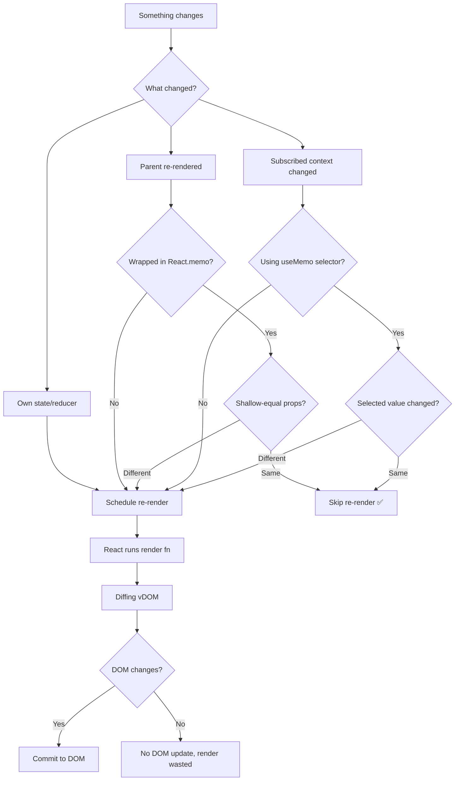
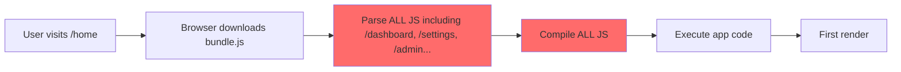
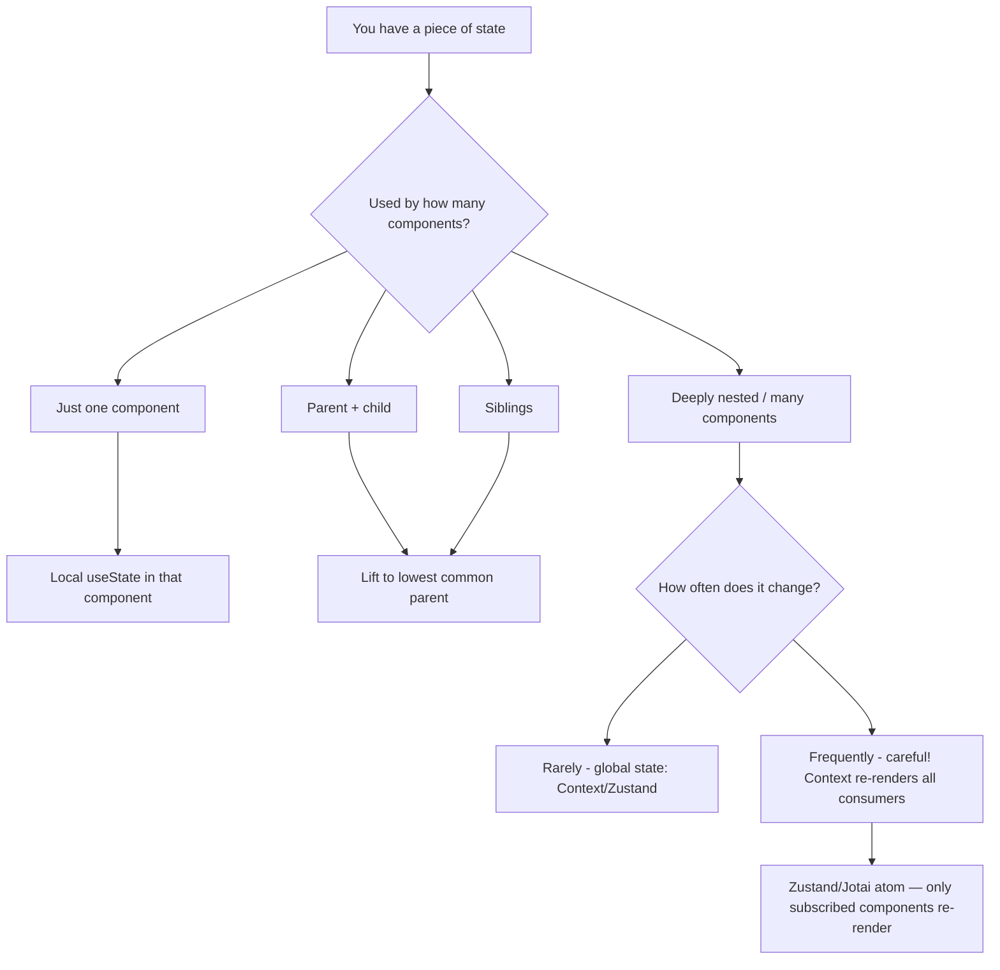
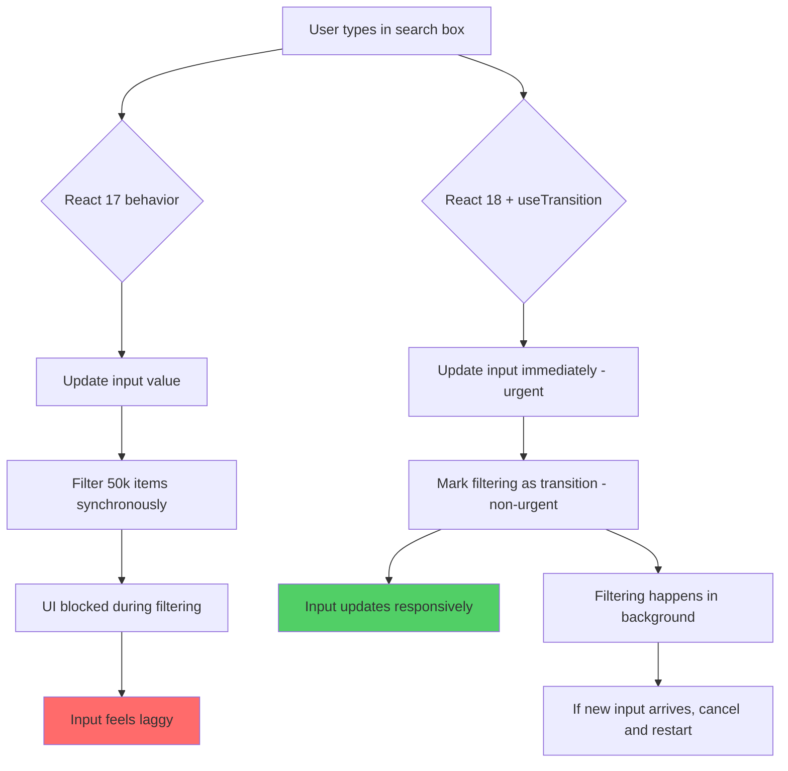

# React Performance Optimization — Deep Revision Notes

> For experienced JS developers revising React. Assumes you know closures, the event loop, referential equality, and why `[] !== []`. Skips basics. Goes deep on the WHY.

---

## 🔥 1. When React Re-Renders — The Real Rules

### The Three Triggers

React re-renders a component when **any** of these happen:

1. **Its own state changes** — `useState`, `useReducer` dispatch
2. **Its parent re-renders** — even if props passed to it didn't change
3. **A context it subscribes to changes** — even if the specific value it reads didn't change (pre-selector era)

That second rule is the one that catches everyone off guard.

```tsx
// ParentComponent re-renders on every keystroke
function Parent() {
  const [query, setQuery] = useState('');

  return (
    <>
      <input value={query} onChange={e => setQuery(e.target.value)} />
      <ExpensiveChild />  {/* re-renders on EVERY keystroke — even though it gets no props */}
    </>
  );
}

function ExpensiveChild() {
  // No props, no state, no context — but still re-renders with parent
  return <div>I am expensive</div>;
}
```

### Here's the trap most devs fall into:

> "My component has no props, so it won't re-render unnecessarily."

Wrong. Parent re-render = child re-render, unless you explicitly opt out with `React.memo`.

### The Re-render Decision Tree



### Re-renders Are Usually Fine

The profiler insight that changes everything: **most re-renders take < 1ms**. React's reconciler is fast. The real cost is:

- Re-renders that trigger **expensive computations** inside the render function
- Re-renders that cause **downstream cascades** across hundreds of components
- Re-renders that **interrupt user input** (jank)

Premature optimization with `useMemo`/`useCallback`/`React.memo` everywhere adds cognitive overhead and can actually make performance worse (memoization has a cost too).

**Profile first. Optimize second. Always.**

---

## 🔥 2. React.memo — Shallow Equality Gate

### What it Actually Does

```tsx
const MyComponent = React.memo(function MyComponent({ user, onSave }) {
  return <div>{user.name}</div>;
});
```

React.memo wraps the component in a higher-order component that performs a **shallow equality check** on props before deciding to re-render. If all prop references are identical (`===`), the previous render output is reused.

### Shallow vs Deep — The Critical Detail

```tsx
// Shallow check means:
{ id: 1, name: 'Alice' } === { id: 1, name: 'Alice' }  // FALSE (different objects)
'Alice' === 'Alice'                                       // TRUE (primitive)
myFunc === myFunc                                         // TRUE (same reference)
myFunc === () => {}                                       // FALSE (new ref each render)
```

So React.memo only helps when your props are **primitives** or **stable references**.

### When React.memo is Worth It

| Scenario | Worth It? | Why |
|---|---|---|
| Pure display component, many siblings, parent re-renders often | Yes | Prevents cascade re-renders |
| Component with expensive render (data grid, chart) | Yes | Skipping render saves real time |
| Component that renders 0-1 times per interaction | No | Overhead > benefit |
| Props include inline objects/arrays | No | Shallow check always fails |
| Props include arrow functions from parent | No | New ref every render |
| Cheap component (renders in < 0.5ms) | No | Memo overhead may cost more |

### The Custom Comparator Escape Hatch

```tsx
const UserCard = React.memo(
  function UserCard({ user, config }) {
    return <div>{user.name} - {config.theme}</div>;
  },
  (prevProps, nextProps) => {
    // Return true = skip re-render (same), false = re-render (different)
    return (
      prevProps.user.id === nextProps.user.id &&
      prevProps.config.theme === nextProps.config.theme
    );
  }
);
```

**Trap:** Custom comparators are easy to get wrong — a bug here causes stale UI silently. Only use when shallow check is genuinely too aggressive and you've profiled it.

### Here's the trap most devs fall into:

```tsx
// You memo'd the child — but you're passing a new object every render
function Parent() {
  const [count, setCount] = useState(0);
  
  return (
    <MemoizedChild
      // NEW OBJECT every render — memo is useless
      style={{ color: 'red', fontWeight: 'bold' }}
      // NEW FUNCTION every render — memo is useless
      onSave={() => handleSave(count)}
    />
  );
}
```

React.memo without stable prop references = wasted memory + CPU overhead with zero benefit.

---

## 🔥 3. useMemo vs useCallback — Referential Stability, Not Magic

### The Most Important Thing to Understand

**Neither `useMemo` nor `useCallback` prevent re-renders on their own.** They prevent recomputation and maintain referential stability for downstream consumers.

```
useMemo    → memoizes a VALUE
useCallback → memoizes a FUNCTION (syntactic sugar: useMemo(() => fn, deps))
```

### useMemo — When the Computation Is Expensive

```tsx
function ProductList({ products, categoryFilter, priceRange }) {
  // BAD: runs expensive filter on every render
  const filteredProducts = products
    .filter(p => p.category === categoryFilter)
    .filter(p => p.price >= priceRange.min && p.price <= priceRange.max)
    .sort((a, b) => b.rating - a.rating);

  // GOOD: only recomputes when inputs actually change
  const filteredProducts = useMemo(() => {
    return products
      .filter(p => p.category === categoryFilter)
      .filter(p => p.price >= priceRange.min && p.price <= priceRange.max)
      .sort((a, b) => b.rating - a.rating);
  }, [products, categoryFilter, priceRange]);
  
  return <VirtualList items={filteredProducts} />;
}
```

**When it's actually worth it:** The computation needs to take > ~1ms to be worth the overhead. Filtering 10 items? Not worth it. Filtering 50,000 items with a complex predicate? Absolutely.

### useCallback — Stable Function References

Primary use case: **passing callbacks to memoized children or as effect dependencies**.

```tsx
function SearchPage() {
  const [query, setQuery] = useState('');
  const [results, setResults] = useState([]);

  // Without useCallback: new function ref on every keystroke
  // → MemoizedResultList re-renders on every keystroke even if results didn't change
  
  const handleResultClick = useCallback((resultId: string) => {
    analytics.track('result_click', { query, resultId });
    router.push(`/result/${resultId}`);
  }, [query]); // only changes when query changes

  return (
    <>
      <input value={query} onChange={e => setQuery(e.target.value)} />
      <MemoizedResultList results={results} onResultClick={handleResultClick} />
    </>
  );
}
```

### The Dependency Array Trap

```tsx
// TRAP: object in deps — new reference every render = memo never hits
const processedData = useMemo(() => {
  return heavyTransform(data, options);
}, [data, options]); // if options = { sort: 'asc' } is created inline above, this never memoizes

// FIX: destructure primitives from the object
const { sort, filter } = options;
const processedData = useMemo(() => {
  return heavyTransform(data, { sort, filter });
}, [data, sort, filter]);
```

### Comparison Table

| Hook | Memoizes | Prevents Re-render? | Use When |
|---|---|---|---|
| `React.memo` | Component output | Yes (if props stable) | Pure components with expensive renders |
| `useMemo` | Computed value | No (directly) | Expensive computation, stable ref for memo'd child |
| `useCallback` | Function reference | No (directly) | Stable callback for memo'd child or effect deps |

### Profile Before Adding Them

React DevTools Profiler is your source of truth. If a component renders in 0.3ms, `useMemo` overhead might cost you 0.2ms of savings for zero UX benefit. The rule: **measure first, memoize second**.

---

## 🔥 4. React Profiler — Finding the Real Bottleneck

### DevTools Profiler Views

**Flamegraph** — horizontal bars showing time per component in render order:
- Width = time spent rendering
- Color = how "hot" (yellow/red = slow, gray = fast or skipped)
- Click a bar to see exact render time and why it rendered

**Ranked Chart** — components sorted slowest to fastest:
- Best for immediately spotting your worst offender
- Shows "why did this render?" (state change, parent re-render, hook change)

### Reading "Why Did This Render?"

In DevTools, click any component in the flamegraph and look at the right panel:

```
Why did this render?
- Props changed: [onSave]    ← function ref changed
- State changed: [items]
- Parent rendered: Dashboard
- Hooks changed: [1]         ← hook #1's deps changed
```

This tells you exactly what to fix.

### The Programmatic Profiler

```tsx
import { Profiler } from 'react';

function App() {
  function onRenderCallback(
    id,          // component tree identifier
    phase,       // "mount" or "update"
    actualDuration,  // time spent rendering
    baseDuration,    // estimated time without memoization
    startTime,
    commitTime
  ) {
    if (actualDuration > 16) {
      // Over one frame budget — log it
      console.warn(`[Perf] ${id} took ${actualDuration.toFixed(2)}ms (${phase})`);
      analyticsService.track('slow_render', { id, duration: actualDuration });
    }
  }

  return (
    <Profiler id="DataGrid" onRender={onRenderCallback}>
      <DataGrid rows={rows} columns={columns} />
    </Profiler>
  );
}
```

### Here's the trap most devs fall into:

> Optimizing a component that renders in 2ms while ignoring the one that renders 200 times per second.

**Total cost = render time × render frequency.** A 0.5ms component that renders 500 times costs more than a 50ms component that renders once. The Profiler's timeline view shows you this pattern.

### Production Performance Monitoring

```tsx
// In production, use the onRender prop with your analytics
// React will call it even in production builds if you use <Profiler>
// (though DevTools flamegraph only works in development)

const perfObserver = new PerformanceObserver((list) => {
  for (const entry of list.getEntries()) {
    if (entry.entryType === 'measure' && entry.name.startsWith('react-')) {
      analytics.track('react_perf', {
        name: entry.name,
        duration: entry.duration,
        url: window.location.pathname,
      });
    }
  }
});
perfObserver.observe({ entryTypes: ['measure'] });
```

---

## 🔥 5. Code Splitting — Load Only What You Need

### The Core Insight

JavaScript bundles are parsed and compiled synchronously on the main thread. A 500KB bundle that loads upfront blocks the UI even if 80% of that code is for routes the user may never visit.



Code splitting breaks this into chunks — each route/feature downloads only what it needs.

### Route-Level Splitting — The Default Starting Point

```tsx
import { lazy, Suspense } from 'react';
import { Routes, Route } from 'react-router-dom';

// Each of these creates a separate chunk
const Dashboard = lazy(() => import('./pages/Dashboard'));
const Settings = lazy(() => import('./pages/Settings'));
const AdminPanel = lazy(() => import('./pages/AdminPanel'));
const Reports = lazy(() => import('./pages/Reports'));

function App() {
  return (
    <Suspense fallback={<PageSkeleton />}>
      <Routes>
        <Route path="/dashboard" element={<Dashboard />} />
        <Route path="/settings" element={<Settings />} />
        <Route path="/admin" element={<AdminPanel />} />
        <Route path="/reports" element={<Reports />} />
      </Routes>
    </Suspense>
  );
}
```

### Component-Level Splitting — Heavy Features

```tsx
// A charting library might be 200KB+. Don't load it until the chart is needed.
const ChartComponent = lazy(() => import('./components/HeavyChart'));
const RichTextEditor = lazy(() => import('./components/RichTextEditor'));
const VideoPlayer = lazy(() => import('./components/VideoPlayer'));

function ReportBuilder({ showChart, showEditor }) {
  return (
    <div>
      <ReportHeader />
      
      {showChart && (
        <Suspense fallback={<ChartSkeleton />}>
          <ChartComponent data={chartData} />
        </Suspense>
      )}
      
      {showEditor && (
        <Suspense fallback={<EditorSkeleton />}>
          <RichTextEditor initialContent={content} />
        </Suspense>
      )}
    </div>
  );
}
```

### Preloading — Anticipate User Intent

```tsx
// Preload on hover — user is signaling intent
function NavLink({ to, label, component }) {
  const handleMouseEnter = () => {
    // Trigger the dynamic import but don't await it
    // Browser will cache the chunk for when it's actually needed
    import(`./pages/${component}`);
  };

  return (
    <Link to={to} onMouseEnter={handleMouseEnter}>
      {label}
    </Link>
  );
}

// Or preload specific lazy components explicitly
const AdminPanel = lazy(() => import('./pages/AdminPanel'));

// Call this when you detect the user is likely to go to /admin
function preloadAdmin() {
  import('./pages/AdminPanel');
}
```

### Named Exports with lazy()

```tsx
// lazy() requires a default export — here's how to handle named exports
const { DataGrid } = lazy(() =>
  import('./components/DataGrid').then(module => ({
    default: module.DataGrid
  }))
);

// Or use a re-export barrel file
// components/DataGrid/index.ts
export { DataGrid as default } from './DataGrid';
```

### Here's the trap most devs fall into:

> Adding code splitting everywhere, including for components that are always visible on first load. Splitting the navbar, hero section, or above-the-fold content adds a network round-trip waterfall with zero benefit — it's actually slower.

**Rule:** Only split code that is conditionally rendered or on non-initial routes.

---

## 🔥 6. Virtualization — Rendering 10,000 Rows Without Dying

### Why Naive Long Lists Kill Performance

```tsx
// This renders 10,000 DOM nodes instantly
function BadList({ items }) {
  return (
    <ul>
      {items.map(item => <ListItem key={item.id} item={item} />)}
    </ul>
  );
}
// Result: 10k DOM nodes, 10k event listeners, 10k React fiber nodes
// Initial render: ~800ms. Scroll: janky. Memory: spiked.
```

### Virtualization — Only Render the Visible Window

```tsx
import { FixedSizeList } from 'react-window';

function VirtualizedUserList({ users }) {
  const Row = ({ index, style }) => (
    // style MUST be applied — it contains the absolute positioning
    <div style={style}>
      <UserRow user={users[index]} />
    </div>
  );

  return (
    <FixedSizeList
      height={600}         // visible container height
      itemCount={users.length}
      itemSize={72}        // fixed row height in px
      width="100%"
    >
      {Row}
    </FixedSizeList>
  );
}
```

### Variable Height Items — react-window

```tsx
import { VariableSizeList } from 'react-window';

function VariableList({ posts }) {
  // You must know or estimate height upfront
  const getItemSize = (index) => {
    return posts[index].hasImage ? 280 : 120;
  };

  return (
    <VariableSizeList
      height={800}
      itemCount={posts.length}
      itemSize={getItemSize}
      width="100%"
    >
      {({ index, style }) => (
        <div style={style}>
          <PostCard post={posts[index]} />
        </div>
      )}
    </VariableSizeList>
  );
}
```

### TanStack Virtual — More Modern, Headless

```tsx
import { useVirtualizer } from '@tanstack/react-virtual';

function VirtualTable({ rows }) {
  const parentRef = useRef(null);

  const rowVirtualizer = useVirtualizer({
    count: rows.length,
    getScrollElement: () => parentRef.current,
    estimateSize: () => 48,
    overscan: 5, // render 5 extra rows above/below viewport
  });

  return (
    <div ref={parentRef} style={{ height: '600px', overflow: 'auto' }}>
      {/* Total height to make scrollbar accurate */}
      <div style={{ height: `${rowVirtualizer.getTotalSize()}px`, position: 'relative' }}>
        {rowVirtualizer.getVirtualItems().map((virtualRow) => (
          <div
            key={virtualRow.index}
            style={{
              position: 'absolute',
              top: 0,
              left: 0,
              width: '100%',
              transform: `translateY(${virtualRow.start}px)`,
              height: `${virtualRow.size}px`,
            }}
          >
            <TableRow row={rows[virtualRow.index]} />
          </div>
        ))}
      </div>
    </div>
  );
}
```

### When to Virtualize

| List Size | Approach |
|---|---|
| < 100 items | Render all — virtualization overhead not worth it |
| 100–500 items | Virtualize if items are complex (images, many DOM nodes) |
| 500+ items | Always virtualize |
| Infinite scroll | Always virtualize + windowed data fetching |

---

## 🔥 7. Image Optimization — The Forgotten Performance Win

### Native Lazy Loading — Use It by Default

```tsx
function ProductImage({ src, alt, width, height }) {
  return (
    
  );
}

// For above-the-fold critical images — DON'T lazy load these
function HeroImage({ src }) {
  return (
    
  );
}
```

### IntersectionObserver — Custom Lazy Loading

```tsx
function LazyImage({ src, alt, placeholder }) {
  const [isVisible, setIsVisible] = useState(false);
  const [isLoaded, setIsLoaded] = useState(false);
  const imgRef = useRef(null);

  useEffect(() => {
    const observer = new IntersectionObserver(
      ([entry]) => {
        if (entry.isIntersecting) {
          setIsVisible(true);
          observer.disconnect(); // load once, then stop watching
        }
      },
      { rootMargin: '200px' } // start loading 200px before entering viewport
    );

    if (imgRef.current) observer.observe(imgRef.current);
    return () => observer.disconnect();
  }, []);

  return (
    <div ref={imgRef} className="img-container">
      {/* Blur placeholder — prevents layout shift */}
      
      {isVisible && (
         setIsLoaded(true)}
          className={`main-img ${isLoaded ? 'visible' : 'invisible'}`}
        />
      )}
    </div>
  );
}
```

### Format and Size — Use What the Browser Supports

```tsx
function ResponsiveImage({ baseSrc, alt }) {
  return (
    <picture>
      {/* Modern formats first — browser picks first supported */}
      <source
        srcSet={`${baseSrc}-400.avif 400w, ${baseSrc}-800.avif 800w, ${baseSrc}-1600.avif 1600w`}
        type="image/avif"
        sizes="(max-width: 600px) 400px, (max-width: 1200px) 800px, 1600px"
      />
      <source
        srcSet={`${baseSrc}-400.webp 400w, ${baseSrc}-800.webp 800w, ${baseSrc}-1600.webp 1600w`}
        type="image/webp"
        sizes="(max-width: 600px) 400px, (max-width: 1200px) 800px, 1600px"
      />
      {/* Fallback */}
      
    </picture>
  );
}
```

### Here's the trap most devs fall into:

> Not setting explicit `width` and `height` on images. Without dimensions, the browser doesn't know how tall the image will be during layout, causing **Cumulative Layout Shift (CLS)** — content jumps down as images load. This tanks your Core Web Vitals score.

---

## 🔥 8. State Colocation — Keep State Where It's Used

### The Lift-Too-High Problem

```tsx
// BAD: form state lifted to parent just because "maybe we'll need it later"
function UserDashboard() {
  const [firstName, setFirstName] = useState('');
  const [lastName, setLastName] = useState('');
  const [email, setEmail] = useState('');
  // Every keystroke here re-renders UserDashboard AND all its children

  return (
    <div>
      <ExpensiveAnalyticsPanel />  {/* re-renders on every keystroke! */}
      <ExpensiveChartSection />    {/* re-renders on every keystroke! */}
      <UserForm
        firstName={firstName}
        lastName={lastName}
        email={email}
        onChange={{ setFirstName, setLastName, setEmail }}
      />
    </div>
  );
}

// GOOD: form state lives in the form
function UserDashboard() {
  return (
    <div>
      <ExpensiveAnalyticsPanel />  {/* never re-renders due to form input */}
      <ExpensiveChartSection />    {/* never re-renders due to form input */}
      <UserForm />
    </div>
  );
}

function UserForm() {
  const [firstName, setFirstName] = useState('');
  const [lastName, setLastName] = useState('');
  const [email, setEmail] = useState('');
  // Keystrokes only re-render UserForm and its children — nothing above
  return ( /* form JSX */ );
}
```

### The Decision Framework for Where to Put State



### Context Re-render Problem

```tsx
// PROBLEM: Every component using useContext(ThemeContext) re-renders
// when ANY value in this object changes
const ThemeContext = createContext(null);

function ThemeProvider({ children }) {
  const [theme, setTheme] = useState('light');
  const [fontSize, setFontSize] = useState(16);

  // NEW OBJECT every render — all consumers re-render
  return (
    <ThemeContext.Provider value={{ theme, setTheme, fontSize, setFontSize }}>
      {children}
    </ThemeContext.Provider>
  );
}

// FIX 1: Split contexts by update frequency
const ThemeValueContext = createContext(null);   // changes rarely
const ThemeActionsContext = createContext(null); // stable — never changes

function ThemeProvider({ children }) {
  const [theme, setTheme] = useState('light');
  
  const actions = useMemo(() => ({ setTheme }), []); // stable reference
  
  return (
    <ThemeActionsContext.Provider value={actions}>
      <ThemeValueContext.Provider value={theme}>
        {children}
      </ThemeValueContext.Provider>
    </ThemeActionsContext.Provider>
  );
}

// FIX 2: Use Zustand — only the specific slice subscriber re-renders
const useThemeStore = create(set => ({
  theme: 'light',
  fontSize: 16,
  setTheme: (theme) => set({ theme }),
  setFontSize: (fontSize) => set({ fontSize }),
}));

// This component ONLY re-renders when theme changes, not fontSize
function ThemedButton() {
  const theme = useThemeStore(state => state.theme);
  return <button className={theme}>Click</button>;
}
```

---

## 🔥 9. Common Performance Killers — The Production Traps

### Killer 1: Inline Objects and Arrays as Props

```tsx
// Every render creates a new object ref → React.memo is defeated
function BadParent({ userId }) {
  return (
    <MemoizedUserCard
      style={{ margin: '16px', padding: '8px' }}  // new ref
      config={{ showAvatar: true, compact: false }}  // new ref
      tags={['premium', 'verified']}                 // new ref
    />
  );
}

// Fix: hoist constants outside the component
const CARD_STYLE = { margin: '16px', padding: '8px' };
const CARD_CONFIG = { showAvatar: true, compact: false };
const DEFAULT_TAGS = ['premium', 'verified'];

function GoodParent({ userId }) {
  return (
    <MemoizedUserCard
      style={CARD_STYLE}
      config={CARD_CONFIG}
      tags={DEFAULT_TAGS}
    />
  );
}
```

### Killer 2: Anonymous Functions as Props to Memo'd Components

```tsx
// useCallback is your fix here
function DataTable({ rows }) {
  // BAD: new function ref every render
  return (
    <MemoizedRow
      rows={rows}
      onDelete={(id) => deleteRow(id)}          // new ref
      onEdit={(id, data) => updateRow(id, data)} // new ref
    />
  );
}

// GOOD:
function DataTable({ rows }) {
  const handleDelete = useCallback((id) => deleteRow(id), []);
  const handleEdit = useCallback((id, data) => updateRow(id, data), []);

  return (
    <MemoizedRow
      rows={rows}
      onDelete={handleDelete}
      onEdit={handleEdit}
    />
  );
}
```

### Killer 3: Expensive Operations in Render Body

```tsx
// BAD: runs on every render
function ReportPage({ rawData }) {
  // This runs synchronously, blocking the render
  const processedData = rawData
    .flatMap(d => d.entries)
    .filter(e => e.status === 'active')
    .reduce((acc, e) => {
      // complex aggregation
    }, {});

  return <Chart data={processedData} />;
}

// GOOD: memoize it
function ReportPage({ rawData }) {
  const processedData = useMemo(() => {
    return rawData
      .flatMap(d => d.entries)
      .filter(e => e.status === 'active')
      .reduce((acc, e) => {
        // complex aggregation
      }, {});
  }, [rawData]);

  return <Chart data={processedData} />;
}
```

### Killer 4: Key Prop as Array Index

```tsx
// TRAP: when list order changes or items are inserted/deleted,
// using index as key confuses React's reconciler — wrong components
// get re-used, state gets mixed up, animations break

// BAD
{items.map((item, index) => <Item key={index} item={item} />)}

// GOOD — stable unique identity
{items.map(item => <Item key={item.id} item={item} />)}
```

### Killer 5: useEffect with Missing or Stale Dependencies

```tsx
// TRAP: this effect runs on every render because the handler isn't memoized
function SearchBox({ onSearch }) {
  const [query, setQuery] = useState('');
  
  useEffect(() => {
    const timer = setTimeout(() => onSearch(query), 300);
    return () => clearTimeout(timer);
  }, [query, onSearch]); // onSearch changes every render → effect runs constantly

  // FIX: ensure onSearch is stable via useCallback in parent
  // OR: remove onSearch from deps and use a ref
}

// Using a ref to escape stale closure without adding to deps
function SearchBox({ onSearch }) {
  const [query, setQuery] = useState('');
  const onSearchRef = useRef(onSearch);
  
  // Keep ref current without adding to deps
  useEffect(() => {
    onSearchRef.current = onSearch;
  });

  useEffect(() => {
    const timer = setTimeout(() => onSearchRef.current(query), 300);
    return () => clearTimeout(timer);
  }, [query]); // stable dep list
}
```

---

## 🔥 10. useTransition and useDeferredValue — Concurrency for Real UIs

### The Problem They Solve

React 18's concurrent features let you mark some state updates as **non-urgent**, so React can interrupt them to handle urgent ones (user input, animations).



### useTransition — Marking Updates as Non-Urgent

```tsx
import { useState, useTransition } from 'react';

function SearchPage({ allItems }) {
  const [query, setQuery] = useState('');
  const [filteredItems, setFilteredItems] = useState(allItems);
  const [isPending, startTransition] = useTransition();

  function handleSearch(e) {
    const value = e.target.value;
    
    // URGENT: update the input immediately (user sees their typing)
    setQuery(value);
    
    // NON-URGENT: the expensive filter can wait
    startTransition(() => {
      // React can interrupt this if the user types again
      const results = allItems.filter(item =>
        item.name.toLowerCase().includes(value.toLowerCase()) ||
        item.description.toLowerCase().includes(value.toLowerCase())
      );
      setFilteredItems(results);
    });
  }

  return (
    <div>
      <input value={query} onChange={handleSearch} />
      
      {/* Show loading indicator during transition without blocking input */}
      {isPending && <div className="search-spinner" />}
      
      <ResultsList items={filteredItems} isPending={isPending} />
    </div>
  );
}
```

### useDeferredValue — Defer a Value You Don't Control

Use this when you receive a prop or state value from outside and want to defer its heavy usage without controlling the setter:

```tsx
import { useDeferredValue, useMemo } from 'react';

function HeavyFilteredList({ searchQuery, items }) {
  // Deferred value lags behind searchQuery
  // The "urgent" query updates immediately, the deferred one catches up
  const deferredQuery = useDeferredValue(searchQuery);
  
  // This expensive computation uses the deferred value
  // so it doesn't block the UI on every keystroke
  const filteredItems = useMemo(() => {
    return items.filter(item =>
      item.title.toLowerCase().includes(deferredQuery.toLowerCase())
    );
  }, [items, deferredQuery]);
  
  // isStale: true when deferredQuery hasn't caught up yet
  const isStale = deferredQuery !== searchQuery;

  return (
    <ul style={{ opacity: isStale ? 0.7 : 1, transition: 'opacity 0.2s' }}>
      {filteredItems.map(item => (
        <li key={item.id}>{item.title}</li>
      ))}
    </ul>
  );
}
```

### useTransition vs useDeferredValue

| | `useTransition` | `useDeferredValue` |
|---|---|---|
| Use when | You control the state setter | You receive the value as prop/from external state |
| Wraps | The state update | The value itself |
| Access to `isPending` | Yes | No (compare value to deferred value) |
| Good for | Search input + results, tab switching | Props-driven heavy components |

### Here's the trap most devs fall into:

> Wrapping everything in `useTransition` including trivial state updates. These hooks have overhead. Use them specifically for state updates that trigger **visually expensive renders** — filtering large lists, switching complex tab content, paginating heavy tables.

### Real-World: Tab Switching

```tsx
function Dashboard() {
  const [activeTab, setActiveTab] = useState('overview');
  const [isPending, startTransition] = useTransition();

  const tabs = ['overview', 'analytics', 'reports', 'settings'];

  return (
    <div>
      <nav>
        {tabs.map(tab => (
          <button
            key={tab}
            onClick={() => {
              // Tab switch feels instant even if new content is heavy
              startTransition(() => setActiveTab(tab));
            }}
            className={`tab ${activeTab === tab ? 'active' : ''} ${isPending ? 'loading' : ''}`}
          >
            {tab}
          </button>
        ))}
      </nav>
      
      <Suspense fallback={<TabSkeleton />}>
        {/* Heavy tab content renders without blocking the tab buttons */}
        <TabContent tab={activeTab} />
      </Suspense>
    </div>
  );
}
```

---

## 🔥 Quick Reference — The Performance Decision Checklist

### Before You Optimize

```
1. Is there actually a problem? (perceived lag, dropped frames, profiler evidence)
2. What is the bottleneck? (Profiler → Ranked view → slowest component)
3. Why is it slow? (too many renders? expensive computation? DOM updates?)
4. What's the cheapest fix? (state colocation before useMemo, memo before refactor)
```

### The Optimization Ladder (cheapest to most complex)

```
1. Colocate state — cheapest, zero runtime cost
2. Hoist constants out of render — free
3. React.memo on expensive pure components — low overhead
4. useCallback/useMemo for stable refs/expensive computation — profile first
5. Code splitting — improves load time, not runtime
6. Virtualization — for long lists only
7. useTransition/useDeferredValue — for concurrent scenarios
8. Web Workers — for truly CPU-heavy work off the main thread
```

### Interview Deep Points

**Q: What's the difference between `useMemo` returning a function vs `useCallback`?**
A: Identical. `useCallback(fn, deps)` === `useMemo(() => fn, deps)`. `useCallback` is syntactic sugar.

**Q: Can `React.memo` cause bugs?**
A: Yes. If your component has side effects that depend on re-rendering (anti-pattern, but real), memo can suppress them. Also, custom comparators that return `true` when they should return `false` cause stale renders — silent bugs.

**Q: Why does React re-render even when state value is the same?**
A: React bails out of rendering in `useState`/`useReducer` only if the new value is identical by `Object.is`. But the bailout happens *after* the render function runs — React can't know the value didn't change until after computing it. The optimization is that React skips committing to the DOM and re-rendering children, but the component itself still runs once.

**Q: When would you NOT use code splitting?**
A: For components that are always needed on initial render (header, nav, above-fold content). Splitting these adds a network waterfall that increases Time to Interactive.

**Q: What is `startTransition` doing under the hood?**
A: It sets a flag on the fiber update priority to "Transition" (lower than "Default" urgency). React's scheduler can then interrupt transition-priority work if higher-priority work arrives (like another user input). It's cooperative multitasking inside the React runtime.

---

*Last updated: 2026-06-26 | React 18+ | Covers concurrent mode, hooks, and modern tooling*
