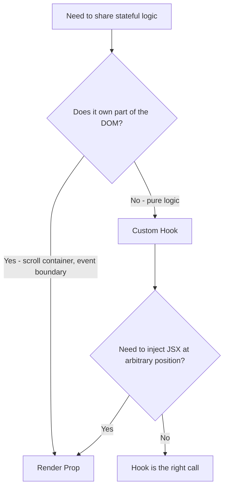
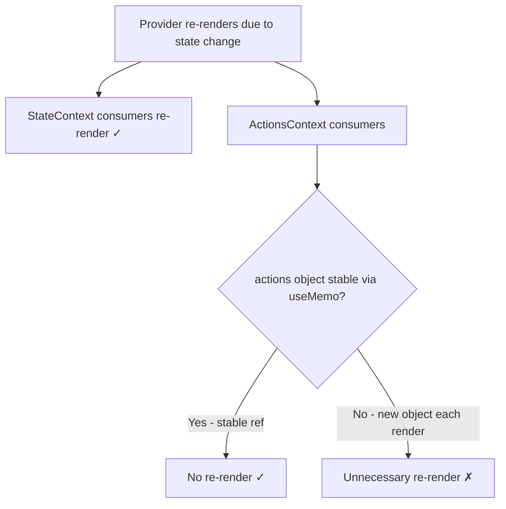
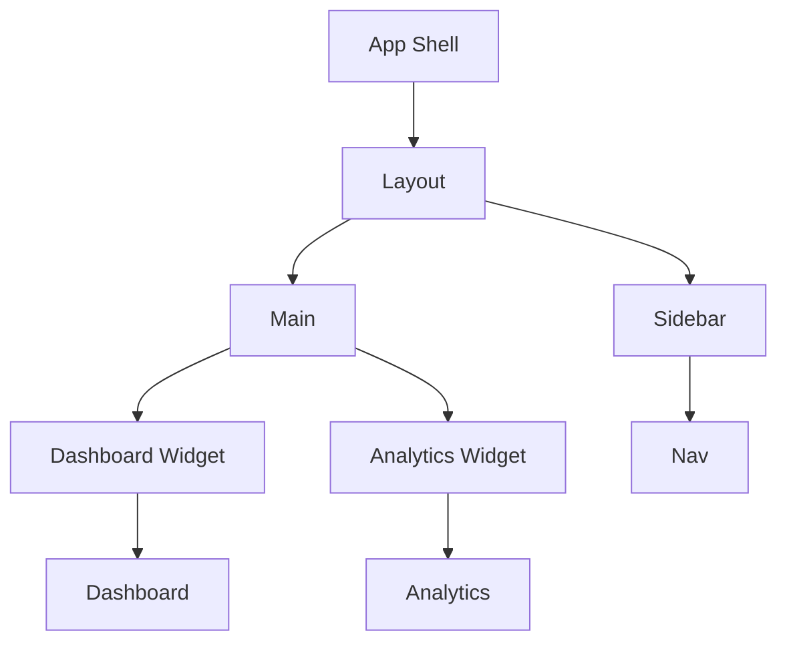
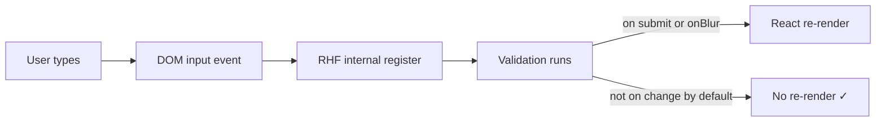

# React Patterns and Architecture
> Revision notes for experienced JS devs. Assumes you know React basics — this is about scaling, correctness, and production tradeoffs.

---

## 🧩 1. Compound Components

### The Core Idea

Compound components let a parent and its children share implicit state through Context — without prop drilling. The parent owns the state machine; children are "slots" that plug into it.

The canonical real-world examples: `<Tabs>`, `<Accordion>`, `<Select>`, `<Menu>`, `<Dialog>`.

```tsx
// What the consumer writes — this is the API goal
<Select value={value} onChange={setValue}>
  <Select.Trigger />
  <Select.Dropdown>
    <Select.Option value="react">React</Select.Option>
    <Select.Option value="vue">Vue</Select.Option>
    <Select.Option value="svelte">Svelte</Select.Option>
  </Select.Dropdown>
</Select>
```

No prop threading. No `options={[...]}` array. The tree IS the structure.

### Full Production Implementation

```tsx
// select/SelectContext.tsx
import { createContext, useContext } from 'react';

interface SelectContextValue {
  value: string;
  onChange: (val: string) => void;
  open: boolean;
  setOpen: (open: boolean) => void;
}

const SelectContext = createContext<SelectContextValue | null>(null);

export function useSelectContext() {
  const ctx = useContext(SelectContext);
  if (!ctx) throw new Error('Select compound components must be used within <Select>');
  return ctx;
}

export { SelectContext };
```

```tsx
// select/Select.tsx
import { useState, useCallback } from 'react';
import { SelectContext } from './SelectContext';

interface SelectProps {
  value: string;
  onChange: (val: string) => void;
  children: React.ReactNode;
}

function Select({ value, onChange, children }: SelectProps) {
  const [open, setOpen] = useState(false);

  return (
    <SelectContext.Provider value={{ value, onChange, open, setOpen }}>
      <div className="select-root" style={{ position: 'relative', display: 'inline-block' }}>
        {children}
      </div>
    </SelectContext.Provider>
  );
}

function Trigger({ children }: { children?: React.ReactNode }) {
  const { value, open, setOpen } = useSelectContext();
  return (
    <button
      type="button"
      aria-haspopup="listbox"
      aria-expanded={open}
      onClick={() => setOpen(!open)}
      className="select-trigger"
    >
      {children ?? value ?? 'Select...'}
      <span aria-hidden>{open ? ' ▲' : ' ▼'}</span>
    </button>
  );
}

function Dropdown({ children }: { children: React.ReactNode }) {
  const { open } = useSelectContext();
  if (!open) return null;
  return (
    <ul role="listbox" className="select-dropdown">
      {children}
    </ul>
  );
}

function Option({ value, children }: { value: string; children: React.ReactNode }) {
  const { value: selectedValue, onChange, setOpen } = useSelectContext();
  const isSelected = value === selectedValue;

  return (
    <li
      role="option"
      aria-selected={isSelected}
      onClick={() => { onChange(value); setOpen(false); }}
      className={`select-option ${isSelected ? 'selected' : ''}`}
    >
      {children}
    </li>
  );
}

// Attach sub-components as static properties
Select.Trigger = Trigger;
Select.Dropdown = Dropdown;
Select.Option = Option;

export { Select };
```

### Here's the trap most devs fall into:

Throwing the guard `if (!ctx) throw` into the context hook is critical. Without it, a `Select.Option` rendered outside `<Select>` will silently receive `null` and crash at runtime with an unhelpful error. The guard gives you an immediate, readable error at the point of misuse.

### When to Use Compound Components

**Use when:**
- The component has a well-defined slot structure (trigger, dropdown, items, header, body, footer)
- You want consumers to arrange children however they like
- You're building a UI library meant for composition
- Internal state is complex but shouldn't leak to consumers

**Do NOT use when:**
- The "composition" is just 1-2 props — this is over-engineering
- Children need to be dynamic arrays from data (just use a `map` + render prop or options prop)
- You need server-side rendering with streaming and the context boundary adds complexity

### Comparison: Options Prop vs Compound Components

| Dimension | `options={[...]}` prop | Compound Components |
|---|---|---|
| Consumer flexibility | Low — structure is fixed | High — consumer controls layout |
| Internal state sharing | Via prop drilling or callback | Via Context (implicit) |
| Composability | Poor | Excellent |
| TypeScript overhead | Simple | Moderate (generic sub-types) |
| Learning curve | None | Some |
| Best for | Simple dropdowns, configs | Complex UI libraries |

---

## 🎣 2. Render Props

### Still Alive — Here's When

Hooks replaced 90% of render prop use cases. But render props still win in specific scenarios:

1. **When the consumer needs to control the rendering structure** — a hook returns data, a render prop injects it into JSX position
2. **When the component needs to be framework-agnostic** — a render prop component works in class components too
3. **React Virtual, react-window, Downshift** — all use render props because they control the outer scroll container and need the inner JSX from you

```tsx
// Mouse tracker — still a valid render prop use case
// The hook version doesn't tell you WHERE in the tree to render
interface MousePosition { x: number; y: number }

function MouseTracker({ children }: { children: (pos: MousePosition) => React.ReactNode }) {
  const [pos, setPos] = useState<MousePosition>({ x: 0, y: 0 });

  const handleMove = useCallback((e: React.MouseEvent) => {
    setPos({ x: e.clientX, y: e.clientY });
  }, []);

  return (
    <div onMouseMove={handleMove} style={{ width: '100%', height: '100vh' }}>
      {children(pos)}
    </div>
  );
}

// Usage
<MouseTracker>
  {({ x, y }) => (
    <div style={{ position: 'fixed', left: x, top: y }}>
      <Tooltip />
    </div>
  )}
</MouseTracker>
```

### Here's the trap most devs fall into:

Inline render prop functions create a new function reference on every render, which breaks `React.memo` on the child. If the render prop is in a tight render loop, memoize it:

```tsx
// BAD — new function every render, breaks memo
<DataTable renderRow={(row) => <Row key={row.id} data={row} />} />

// GOOD
const renderRow = useCallback((row: Row) => <Row key={row.id} data={row} />, []);
<DataTable renderRow={renderRow} />
```

### Render Props vs Hooks Decision Tree



---

## 🧱 3. Higher-Order Components (HOCs)

### The Pattern

A HOC is a function that takes a component and returns a new component with added behavior. It's the OOP decorator pattern for React.

```tsx
// withAuth.tsx — still the cleanest HOC in production codebases
import { ComponentType, FC } from 'react';
import { Navigate, useLocation } from 'react-router-dom';
import { useAuth } from '@/features/auth/hooks/useAuth';

interface WithAuthOptions {
  redirectTo?: string;
  requiredRole?: string;
}

function withAuth<P extends object>(
  WrappedComponent: ComponentType<P>,
  options: WithAuthOptions = {}
): FC<P> {
  const { redirectTo = '/login', requiredRole } = options;

  const WithAuthComponent: FC<P> = (props) => {
    const { user, isLoading } = useAuth();
    const location = useLocation();

    if (isLoading) return <div>Loading...</div>;
    if (!user) return <Navigate to={redirectTo} state={{ from: location }} replace />;
    if (requiredRole && user.role !== requiredRole) return <Navigate to="/forbidden" replace />;

    return <WrappedComponent {...props} />;
  };

  // Essential for devtools — without this, all HOC-wrapped components are "WithAuthComponent"
  WithAuthComponent.displayName = `withAuth(${WrappedComponent.displayName ?? WrappedComponent.name})`;

  return WithAuthComponent;
}

export { withAuth };

// Usage
const AdminDashboard = withAuth(Dashboard, { requiredRole: 'admin' });
```

### Here's the trap most devs fall into:

HOCs break prop inference badly if you forget to forward refs:

```tsx
// BAD — ref on a HOC-wrapped component goes nowhere
const EnhancedInput = withLogger(Input);
<EnhancedInput ref={inputRef} /> // inputRef.current is null

// GOOD — forward the ref through
function withLogger<P extends object>(Wrapped: ComponentType<P>) {
  const WithLogger = React.forwardRef<HTMLElement, P>((props, ref) => {
    console.log('render', props);
    return <Wrapped {...props} ref={ref} />;
  });
  WithLogger.displayName = `withLogger(${Wrapped.displayName ?? Wrapped.name})`;
  return WithLogger;
}
```

### HOC vs Hook vs Compound Component

| Scenario | Best Choice |
|---|---|
| Auth guard, permission check | HOC (`withAuth`) |
| Data fetching for a single component | Custom Hook |
| Cross-cutting concern in class components | HOC |
| Shared visual slot structure (tabs, dialogs) | Compound Component |
| Animation / transition behavior injection | HOC or Hook |
| Logic reuse across function components | Hook (always prefer) |
| Wrapping 3rd party components you can't modify | HOC |

### When HOCs Are Still The Right Call in 2025

- **Legacy class component codebases** — hooks don't work in class components; HOCs do
- **`connect()` from Redux** — you're still wrapping a component declaratively
- **`withRouter` in older React Router codebases**
- **Analytics/logging injection** — wrap a route-level component without touching its source
- **Testing** — HOCs let you swap dependencies at the component boundary

---

## 🔭 4. Controlled vs Uncontrolled + `useImperativeHandle`

### The Distinction

| | Controlled | Uncontrolled |
|---|---|---|
| Source of truth | React state (parent owns) | DOM / internal ref |
| Validation timing | On every change | On demand (submit, blur) |
| Programmatic reset | `setValue('')` | `inputRef.current.value = ''` |
| Performance | Re-renders on every keystroke | No re-renders until read |

### `useImperativeHandle` — The Right Mental Model

It's not for everything. It exists for one reason: **exposing an imperative API surface from a child component to a parent**, when you can't model the interaction declaratively.

Perfect use cases:
- `modal.open()` / `modal.close()`
- `textEditor.focus()` / `textEditor.clear()`
- `carousel.scrollToIndex(n)`
- `form.reset()` / `form.submit()`

```tsx
// ConfirmModal.tsx — real production pattern
import { forwardRef, useImperativeHandle, useState, useCallback } from 'react';
import { createPortal } from 'react-dom';

export interface ConfirmModalHandle {
  open: (message: string) => Promise<boolean>;
}

interface ConfirmModalProps {
  title?: string;
}

const ConfirmModal = forwardRef<ConfirmModalHandle, ConfirmModalProps>(
  ({ title = 'Confirm' }, ref) => {
    const [state, setState] = useState<{
      visible: boolean;
      message: string;
      resolve: ((val: boolean) => void) | null;
    }>({ visible: false, message: '', resolve: null });

    useImperativeHandle(ref, () => ({
      open(message: string): Promise<boolean> {
        return new Promise((resolve) => {
          setState({ visible: true, message, resolve });
        });
      },
    }), []); // empty deps — the API surface never changes

    const handleChoice = useCallback((confirmed: boolean) => {
      state.resolve?.(confirmed);
      setState({ visible: false, message: '', resolve: null });
    }, [state]);

    if (!state.visible) return null;

    return createPortal(
      <div className="modal-backdrop" role="dialog" aria-modal aria-labelledby="modal-title">
        <div className="modal-panel">
          <h2 id="modal-title">{title}</h2>
          <p>{state.message}</p>
          <div className="modal-actions">
            <button onClick={() => handleChoice(false)}>Cancel</button>
            <button onClick={() => handleChoice(true)} autoFocus>Confirm</button>
          </div>
        </div>
      </div>,
      document.body
    );
  }
);
ConfirmModal.displayName = 'ConfirmModal';

// Usage in parent
function DeleteButton({ id }: { id: string }) {
  const modalRef = useRef<ConfirmModalHandle>(null);
  const { mutate: deleteItem } = useDeleteMutation();

  const handleDelete = async () => {
    const confirmed = await modalRef.current!.open(
      'This action cannot be undone. Delete this item?'
    );
    if (confirmed) deleteItem(id);
  };

  return (
    <>
      <button onClick={handleDelete}>Delete</button>
      <ConfirmModal ref={modalRef} title="Delete Item" />
    </>
  );
}
```

### Here's the trap most devs fall into:

Putting too much in `useImperativeHandle`. If you find yourself exposing `getData()` or `isValid()` via the handle, stop — that's state that belongs in the parent or in a shared store. `useImperativeHandle` is for **actions**, not state queries.

Also — the `deps` array on `useImperativeHandle` works like `useMemo`. If your handle methods close over state that changes, you must include that state in deps or you'll have stale closures.

---

## 🏗️ 5. Provider Pattern

### The Right Way to Build Feature Modules

The naïve approach is one giant `AppContext`. The correct approach is feature-scoped providers that encapsulate their own state + actions.

```tsx
// features/cart/CartProvider.tsx
import { createContext, useContext, useReducer, useCallback, useMemo } from 'react';

// --- Types ---
interface CartItem { id: string; name: string; price: number; qty: number; }
interface CartState { items: CartItem[]; }

type CartAction =
  | { type: 'ADD_ITEM'; payload: CartItem }
  | { type: 'REMOVE_ITEM'; payload: { id: string } }
  | { type: 'UPDATE_QTY'; payload: { id: string; qty: number } }
  | { type: 'CLEAR' };

// --- Reducer (pure, easily testable) ---
function cartReducer(state: CartState, action: CartAction): CartState {
  switch (action.type) {
    case 'ADD_ITEM': {
      const exists = state.items.find(i => i.id === action.payload.id);
      if (exists) {
        return {
          items: state.items.map(i =>
            i.id === action.payload.id ? { ...i, qty: i.qty + 1 } : i
          ),
        };
      }
      return { items: [...state.items, action.payload] };
    }
    case 'REMOVE_ITEM':
      return { items: state.items.filter(i => i.id !== action.payload.id) };
    case 'UPDATE_QTY':
      return {
        items: state.items.map(i =>
          i.id === action.payload.id ? { ...i, qty: action.payload.qty } : i
        ),
      };
    case 'CLEAR':
      return { items: [] };
    default:
      return state;
  }
}

// --- Contexts: SPLIT state from actions to prevent unnecessary re-renders ---
const CartStateContext = createContext<CartState | null>(null);
const CartActionsContext = createContext<{
  addItem: (item: CartItem) => void;
  removeItem: (id: string) => void;
  updateQty: (id: string, qty: number) => void;
  clearCart: () => void;
} | null>(null);

// --- Provider ---
export function CartProvider({ children }: { children: React.ReactNode }) {
  const [state, dispatch] = useReducer(cartReducer, { items: [] });

  // useMemo so actions object is stable — components using only actions won't re-render
  const actions = useMemo(() => ({
    addItem: (item: CartItem) => dispatch({ type: 'ADD_ITEM', payload: item }),
    removeItem: (id: string) => dispatch({ type: 'REMOVE_ITEM', payload: { id } }),
    updateQty: (id: string, qty: number) => dispatch({ type: 'UPDATE_QTY', payload: { id, qty } }),
    clearCart: () => dispatch({ type: 'CLEAR' }),
  }), []); // dispatch is stable from useReducer

  return (
    <CartStateContext.Provider value={state}>
      <CartActionsContext.Provider value={actions}>
        {children}
      </CartActionsContext.Provider>
    </CartStateContext.Provider>
  );
}

// --- Hooks (the public API for consumers) ---
export function useCartState() {
  const ctx = useContext(CartStateContext);
  if (!ctx) throw new Error('useCartState must be used within CartProvider');
  return ctx;
}

export function useCartActions() {
  const ctx = useContext(CartActionsContext);
  if (!ctx) throw new Error('useCartActions must be used within CartProvider');
  return ctx;
}

// Derived selectors (computed state, not stored state)
export function useCartTotal() {
  const { items } = useCartState();
  return useMemo(
    () => items.reduce((sum, item) => sum + item.price * item.qty, 0),
    [items]
  );
}
```

### Here's the trap most devs fall into:

Putting state AND actions in the same context. Every time the state changes, every subscriber (including components that only call actions and never read state) re-renders. Splitting into two contexts costs almost nothing and eliminates a class of unnecessary renders.

### Context Re-render Flow



---

## 🎭 6. Headless UI Components

### What "Headless" Means

A headless component contains **all the logic, state, accessibility, and keyboard handling** with **zero opinion on visual output**. You own the CSS.

Libraries: **Radix UI**, **Headless UI** (Tailwind Labs), **React Aria** (Adobe), **Downshift**, **TanStack Table**.

Why this is the future: design systems are unique per product. Behavior (focus traps, ARIA roles, keyboard nav) is universal and hard to get right. Headless separates those concerns cleanly.

```tsx
// Using Radix UI Select — headless with full a11y
import * as Select from '@radix-ui/react-select';
import { ChevronDown, Check } from 'lucide-react';

function FrameworkSelect({ value, onValueChange }: {
  value: string;
  onValueChange: (v: string) => void;
}) {
  return (
    <Select.Root value={value} onValueChange={onValueChange}>
      <Select.Trigger className="select-trigger" aria-label="Framework">
        <Select.Value placeholder="Select a framework..." />
        <Select.Icon><ChevronDown size={16} /></Select.Icon>
      </Select.Trigger>

      <Select.Portal>
        <Select.Content className="select-content" position="popper" sideOffset={4}>
          <Select.Viewport>
            <Select.Group>
              <Select.Label className="select-label">Frontend</Select.Label>
              {['React', 'Vue', 'Svelte', 'Angular'].map(fw => (
                <Select.Item key={fw} value={fw.toLowerCase()} className="select-item">
                  <Select.ItemText>{fw}</Select.ItemText>
                  <Select.ItemIndicator><Check size={14} /></Select.ItemIndicator>
                </Select.Item>
              ))}
            </Select.Group>
          </Select.Viewport>
        </Select.Content>
      </Select.Portal>
    </Select.Root>
  );
}
```

You get: focus trapping, arrow key navigation, typeahead search, proper `role="listbox"`, `aria-selected`, `aria-activedescendant` — all for free. You write zero JavaScript for any of it.

### Headless vs Styled Components vs CSS Modules

| | Headless (Radix/Aria) | UI Kit (MUI/Chakra) | Roll Your Own |
|---|---|---|---|
| Accessibility | Built-in, tested | Mostly there | You're responsible |
| Design freedom | 100% yours | Theme tokens only | 100% yours |
| Bundle size | Small, tree-shakeable | Larger | Smallest |
| Time to accessible UI | Fast | Fast | Slow |
| Custom behavior | Via composition | Often impossible | Full control |

### Here's the trap most devs fall into:

Radix portals render into `document.body`. If your CSS is scoped (CSS Modules, Shadow DOM), portal content will escape those scopes. You need a `<Select.Portal container={ref.current}>` pointing to an element inside your scoped boundary, or you need to explicitly style `.select-content` at the global level.

---

## 🚧 7. Error Boundaries

### Class Components Still Matter — Here's Why

`componentDidCatch` and `getDerivedStateFromError` have no hook equivalents as of React 18. Error boundaries **must** be class components. This will change with React 19's `use()` + Suspense changes, but for now:

```tsx
// Without a library — the minimal correct implementation
import { Component, type ReactNode, type ErrorInfo } from 'react';

interface Props {
  fallback: ReactNode | ((error: Error, reset: () => void) => ReactNode);
  onError?: (error: Error, errorInfo: ErrorInfo) => void;
  children: ReactNode;
}

interface State { error: Error | null; }

class ErrorBoundary extends Component<Props, State> {
  state: State = { error: null };

  static getDerivedStateFromError(error: Error): State {
    return { error };
  }

  componentDidCatch(error: Error, errorInfo: ErrorInfo) {
    // Send to Sentry, Datadog, etc.
    this.props.onError?.(error, errorInfo);
    console.error('ErrorBoundary caught:', error, errorInfo.componentStack);
  }

  reset = () => this.setState({ error: null });

  render() {
    const { error } = this.state;
    if (error) {
      const { fallback } = this.props;
      return typeof fallback === 'function' ? fallback(error, this.reset) : fallback;
    }
    return this.props.children;
  }
}
```

### Use `react-error-boundary` in Production

The library handles edge cases you'll miss (reset on key change, reset on deps change, `useErrorBoundary` hook):

```tsx
import { ErrorBoundary, useErrorBoundary } from 'react-error-boundary';

// Throwing from async event handlers (NOT covered by boundaries by default)
function DataLoader() {
  const { showBoundary } = useErrorBoundary();

  const handleClick = async () => {
    try {
      await fetchData();
    } catch (err) {
      showBoundary(err); // manually trigger the boundary from async code
    }
  };

  return <button onClick={handleClick}>Load</button>;
}

// Placement strategy
function App() {
  return (
    // Top level — catches catastrophic failures
    <ErrorBoundary fallback={<CriticalErrorPage />} onError={reportToSentry}>
      <Layout>
        {/* Feature level — isolates dashboard failures from sidebar */}
        <ErrorBoundary
          fallback={({ error, resetErrorBoundary }) => (
            <WidgetError message={error.message} onRetry={resetErrorBoundary} />
          )}
        >
          <Dashboard />
        </ErrorBoundary>
        <Sidebar />
      </Layout>
    </ErrorBoundary>
  );
}
```

### Error Boundary Placement Strategy



### Here's the trap most devs fall into:

Error boundaries do **not** catch:
- Errors in async code (setTimeout, fetch, event handlers)
- Errors in the boundary itself
- Errors in server-side rendering
- `useEffect` cleanup function errors in React 18

For async errors, use `useErrorBoundary().showBoundary` or re-throw inside a `startTransition`.

---

## ⏳ 8. Suspense Boundaries

### Mental Model

Suspense is not just for lazy loading. It's React's mechanism for saying "I'm waiting for something — show the fallback." In React 18+ with `use()` (React 19) or data libraries that implement the Suspense protocol (React Query, Relay, SWR with `suspense: true`), it handles data loading too.

```tsx
// Nested Suspense for progressive loading — each boundary resolves independently
function ProductPage({ id }: { id: string }) {
  return (
    // Outer boundary: page chrome loads fast
    <Suspense fallback={<PageSkeleton />}>
      <ProductHeader id={id} />

      <div className="product-layout">
        {/* Images might be slow — isolated boundary */}
        <Suspense fallback={<ImagePlaceholder />}>
          <ProductImages id={id} />
        </Suspense>

        <div className="product-details">
          <ProductInfo id={id} />

          {/* Reviews are lowest priority — load last */}
          <Suspense fallback={<ReviewsSkeleton />}>
            <ProductReviews id={id} />
          </Suspense>
        </div>
      </div>
    </Suspense>
  );
}
```

### React Query + Suspense (Production Pattern)

```tsx
// queryClient config
const queryClient = new QueryClient({
  defaultOptions: {
    queries: {
      suspense: true, // React Query v4
      // In v5: use useSuspenseQuery hook directly
      staleTime: 30_000,
      retry: 1,
    },
  },
});

// Component — no loading/error state needed
function UserProfile({ userId }: { userId: string }) {
  // This throws a Promise if data isn't cached — Suspense catches it
  const { data: user } = useSuspenseQuery({
    queryKey: ['user', userId],
    queryFn: () => api.getUser(userId),
  });

  // data is ALWAYS defined here — never undefined
  return <div>{user.name}</div>;
}

// Parent handles loading and error
function UserSection({ userId }: { userId: string }) {
  return (
    <ErrorBoundary fallback={<UserError />} onError={reportToSentry}>
      <Suspense fallback={<UserSkeleton />}>
        <UserProfile userId={userId} />
      </Suspense>
    </ErrorBoundary>
  );
}
```

### Here's the trap most devs fall into:

Nesting `<Suspense>` directly inside `<ErrorBoundary>` the wrong way. The correct order is ErrorBoundary **outside** Suspense. If it's reversed, a fetch error that should show an error UI will instead trigger the nearest Suspense fallback (the spinner), and your error boundary never fires.

```tsx
// WRONG
<Suspense fallback={<Spinner />}>
  <ErrorBoundary fallback={<Error />}>
    <AsyncComponent />
  </ErrorBoundary>
</Suspense>

// CORRECT
<ErrorBoundary fallback={<Error />}>
  <Suspense fallback={<Spinner />}>
    <AsyncComponent />
  </Suspense>
</ErrorBoundary>
```

---

## 📁 9. Feature Module Architecture

### The Scalable Folder Structure

For large React apps (50+ components, 10+ developers), co-locating by feature beats co-locating by type.

```
src/
├── app/                        # App-wide setup (providers, router, store)
│   ├── App.tsx
│   ├── router.tsx
│   └── providers.tsx
├── features/
│   ├── auth/
│   │   ├── components/
│   │   │   ├── LoginForm.tsx
│   │   │   └── AuthGuard.tsx
│   │   ├── hooks/
│   │   │   ├── useAuth.ts
│   │   │   └── useLoginMutation.ts
│   │   ├── api/
│   │   │   └── authApi.ts
│   │   ├── store/
│   │   │   └── authSlice.ts   # or AuthProvider.tsx
│   │   ├── types/
│   │   │   └── auth.types.ts
│   │   └── index.ts           # Public API — what the feature exports
│   ├── cart/
│   │   ├── components/
│   │   ├── hooks/
│   │   ├── api/
│   │   └── index.ts
│   └── products/
│       ├── components/
│       ├── hooks/
│       └── index.ts
├── shared/
│   ├── components/            # Truly reusable UI (Button, Input, Modal)
│   ├── hooks/                 # Generic hooks (useDebounce, useLocalStorage)
│   ├── utils/                 # Pure utility functions
│   └── types/                 # Shared types (ApiResponse, PaginatedResult)
└── pages/                     # Route-level components only — thin shells
    ├── ProductsPage.tsx
    └── CartPage.tsx
```

### The `index.ts` Barrel Export — Public API Contract

```ts
// features/auth/index.ts — only export what's meant to be used externally
export { LoginForm } from './components/LoginForm';
export { AuthGuard } from './components/AuthGuard';
export { useAuth } from './hooks/useAuth';
export type { AuthUser, LoginPayload } from './types/auth.types';
// NOT exported: internal helpers, raw API calls, implementation details
```

This creates a clear boundary. Other features import from `@/features/auth`, not from deep paths inside auth. Refactoring the internals doesn't break consumers.

### Import Rules (enforce with ESLint)

```
features/cart  →  CAN import from shared/
features/cart  →  CANNOT import from features/auth/  (use shared if needed)
pages/         →  CAN import from features/ and shared/
shared/        →  CANNOT import from features/ or pages/
```

Use `eslint-plugin-boundaries` to enforce this as a lint error.

### Here's the trap most devs fall into:

Cross-feature imports at depth: `import { authToken } from '../auth/store/authSlice'`. This couples features together silently. The fix: either move the shared piece to `shared/`, or expose it through the feature's `index.ts` public API so the coupling is explicit and visible.

---

## 📝 10. Form Patterns with React Hook Form + Zod

### Why React Hook Form (RHF)

Standard controlled forms re-render on **every keystroke**. In a form with 20 fields, that's 20 re-renders per second while typing. RHF keeps inputs **uncontrolled** under the hood (DOM state, not React state). React only gets involved at validation and submission.



### Full Production Form: RHF + Zod

```tsx
// features/auth/components/RegisterForm.tsx
import { useForm } from 'react-hook-form';
import { zodResolver } from '@hookform/resolvers/zod';
import { z } from 'zod';
import { useRegisterMutation } from '../hooks/useRegisterMutation';

// Schema first — this is the single source of truth for validation AND types
const registerSchema = z.object({
  name: z.string().min(2, 'Name must be at least 2 characters').max(50),
  email: z.string().email('Invalid email address'),
  password: z
    .string()
    .min(8, 'Password must be at least 8 characters')
    .regex(/[A-Z]/, 'Must contain at least one uppercase letter')
    .regex(/[0-9]/, 'Must contain at least one number'),
  confirmPassword: z.string(),
  role: z.enum(['developer', 'designer', 'manager'], {
    required_error: 'Please select a role',
  }),
  agreeToTerms: z.literal(true, {
    errorMap: () => ({ message: 'You must accept the terms' }),
  }),
}).refine(
  (data) => data.password === data.confirmPassword,
  { message: "Passwords don't match", path: ['confirmPassword'] }
);

// Infer the TypeScript type from the schema — never maintain them separately
type RegisterFormData = z.infer<typeof registerSchema>;

function RegisterForm() {
  const { mutateAsync: register, isPending } = useRegisterMutation();

  const {
    register: registerField,
    handleSubmit,
    formState: { errors, isSubmitting, dirtyFields },
    setError,
    reset,
    watch,
  } = useForm<RegisterFormData>({
    resolver: zodResolver(registerSchema),
    defaultValues: {
      name: '',
      email: '',
      password: '',
      confirmPassword: '',
    },
    mode: 'onBlur', // validate on blur, not on every keystroke
  });

  const onSubmit = async (data: RegisterFormData) => {
    try {
      await register(data);
      reset();
    } catch (error) {
      // Map server errors back to specific fields
      if (error instanceof ApiError && error.field === 'email') {
        setError('email', {
          type: 'server',
          message: 'This email is already registered',
        });
      } else {
        setError('root', { message: 'Registration failed. Please try again.' });
      }
    }
  };

  return (
    <form onSubmit={handleSubmit(onSubmit)} noValidate>
      {errors.root && (
        <div role="alert" className="form-error-banner">
          {errors.root.message}
        </div>
      )}

      <div className="form-group">
        <label htmlFor="name">Full Name</label>
        <input
          id="name"
          type="text"
          aria-describedby={errors.name ? 'name-error' : undefined}
          aria-invalid={!!errors.name}
          {...registerField('name')}
        />
        {errors.name && (
          <span id="name-error" role="alert" className="field-error">
            {errors.name.message}
          </span>
        )}
      </div>

      <div className="form-group">
        <label htmlFor="email">Email</label>
        <input
          id="email"
          type="email"
          aria-describedby={errors.email ? 'email-error' : undefined}
          aria-invalid={!!errors.email}
          {...registerField('email')}
        />
        {errors.email && (
          <span id="email-error" role="alert" className="field-error">
            {errors.email.message}
          </span>
        )}
      </div>

      <div className="form-group">
        <label htmlFor="role">Role</label>
        <select id="role" {...registerField('role')}>
          <option value="">Select a role...</option>
          <option value="developer">Developer</option>
          <option value="designer">Designer</option>
          <option value="manager">Manager</option>
        </select>
        {errors.role && <span role="alert" className="field-error">{errors.role.message}</span>}
      </div>

      <div className="form-group">
        <label>
          <input type="checkbox" {...registerField('agreeToTerms')} />
          I agree to the Terms of Service
        </label>
        {errors.agreeToTerms && (
          <span role="alert" className="field-error">{errors.agreeToTerms.message}</span>
        )}
      </div>

      <button type="submit" disabled={isSubmitting || isPending}>
        {isSubmitting || isPending ? 'Creating account...' : 'Create Account'}
      </button>
    </form>
  );
}
```

### Reusable Form Field Pattern

For large forms, extract the label + input + error structure into a reusable field component:

```tsx
// shared/components/FormField.tsx
interface FormFieldProps {
  label: string;
  name: string;
  error?: string;
  children: React.ReactElement;
}

function FormField({ label, name, error, children }: FormFieldProps) {
  const errorId = `${name}-error`;
  const childWithA11y = React.cloneElement(children, {
    id: name,
    'aria-describedby': error ? errorId : undefined,
    'aria-invalid': !!error || undefined,
  });

  return (
    <div className="form-group">
      <label htmlFor={name}>{label}</label>
      {childWithA11y}
      {error && <span id={errorId} role="alert" className="field-error">{error}</span>}
    </div>
  );
}

// Usage
<FormField label="Email" name="email" error={errors.email?.message}>
  <input type="email" {...registerField('email')} />
</FormField>
```

### Here's the trap most devs fall into:

Using `watch()` to reactively drive other field defaults. `watch()` subscribes to field value changes and **causes re-renders** — it opts back into React state semantics. If you need one field's value to affect another's validation, use `refine()` or `superRefine()` in Zod instead. If you need to conditionally show/hide fields based on another field, use `useWatch()` with a stable subscription rather than `watch()` inside a hot render path.

Also: `handleSubmit` swallows async errors silently. **Always** wrap your submit handler body in try/catch and use `setError('root', ...)` for user-visible feedback. Unhandled rejections inside `handleSubmit` become silent failures.

### RHF `Controller` for UI Library Inputs

When using inputs that aren't native DOM elements (Radix Select, custom date pickers, etc.):

```tsx
import { Controller } from 'react-hook-form';

<Controller
  name="framework"
  control={control}
  render={({ field, fieldState }) => (
    <FrameworkSelect
      value={field.value}
      onValueChange={field.onChange}
      onBlur={field.onBlur}
      hasError={!!fieldState.error}
    />
  )}
/>
```

---

## 🏎️ Performance Cross-Cutting Concerns

### Memoization Rules

```tsx
// useMemo — for expensive derived computations
const sortedItems = useMemo(
  () => [...items].sort((a, b) => a.name.localeCompare(b.name)),
  [items]
);

// useCallback — for stable function references passed to memoized children
const handleDelete = useCallback((id: string) => {
  dispatch({ type: 'DELETE', payload: id });
}, [dispatch]); // dispatch from useReducer is always stable

// React.memo — for pure components that receive stable props
const Row = React.memo(function Row({ data, onDelete }: RowProps) {
  return <tr>...</tr>;
});

// DON'T memo everything — the overhead is real
// Memo is only worth it if:
// 1. The component renders frequently
// 2. It receives the same props frequently
// 3. The render is expensive
```

### State Colocation

Push state down to where it's actually used. Global state causes global re-renders.

```tsx
// BAD — search filter in global store causes entire app to re-render on keystroke
const { searchQuery, setSearchQuery } = useGlobalStore();

// GOOD — local state, only the search + results re-render
function ProductSearch() {
  const [query, setQuery] = useState('');
  const results = useFilteredProducts(query); // query stays local
  return <div>...</div>;
}
```

---

## 🎯 Interview Deep Dives

### "Why can't Error Boundaries be hooks?"

React's error handling during render needs to intercept the thrown error synchronously in the render phase and decide whether to re-render with the fallback. Hooks run inside the component body — by the time an error throws, the component's fiber is in an error state. `getDerivedStateFromError` is a static method called by the reconciler itself, outside of any component's render. The React team has acknowledged hooks-based error boundaries are coming (React 19), but require fundamental changes to how errors propagate through the fiber tree.

### "How does Context cause re-renders and how do you prevent them?"

Every time a Context Provider's `value` prop gets a new reference, all consumers re-render — even if the data they subscribe to hasn't changed. There's no selector API in React Context (unlike Redux `useSelector`). Mitigations:
1. Split context by update frequency (state context vs actions context)
2. Memoize the value object: `useMemo(() => ({ user, logout }), [user])`
3. For fine-grained subscriptions, use Zustand, Jotai, or Recoil which have built-in selector support
4. `use-context-selector` library adds a selector API on top of React Context

### "When does React batch state updates?"

React 18+ batches all state updates by default — inside event handlers, timeouts, promises, and native DOM events. Before React 18, batching only happened inside React event handlers. If you need to force a synchronous flush (rare), use `flushSync` from `react-dom`. If you need to opt out of batching (almost never), wrap in `unstable_batchedUpdates` (legacy).

---

## Quick Reference: Pattern Selection

| Pattern | Use it when... | Avoid when... |
|---|---|---|
| Compound Components | Building UI library components with slot structure | Simple props suffice |
| Render Props | Logic owner needs to control DOM placement | Pure logic reuse — use hooks |
| HOC | Cross-cutting behavior injection, class components | New code — prefer hooks |
| useImperativeHandle | Parent needs to call imperative methods on child | You're trying to share state — use lifting instead |
| Provider Pattern | Feature-scoped state + actions | Single component needs state — keep it local |
| Headless UI | Building accessible, styled components | You just need a quick button |
| Error Boundary | Isolating failure domains in the UI tree | Individual async error handling — use try/catch |
| Suspense | Async data loading with graceful progressive UI | Synchronous operations |
| Feature Modules | 10+ features, 5+ developers | Small apps — adds overhead |
| RHF + Zod | Any non-trivial form | Single-field inputs — useState is fine |
