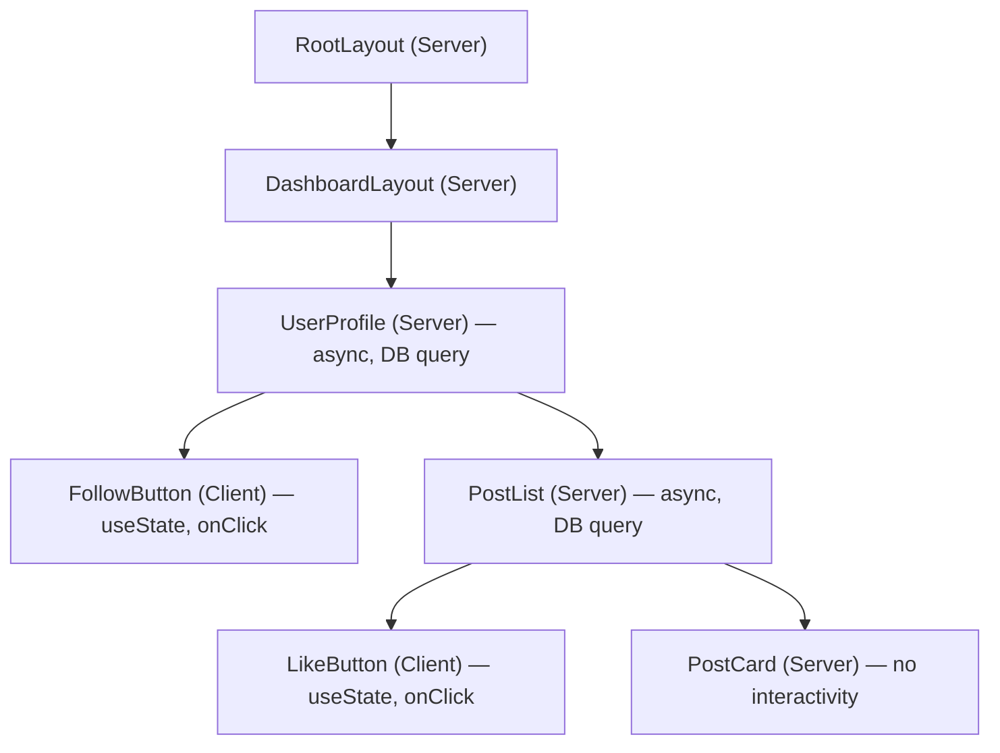
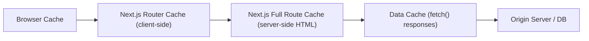
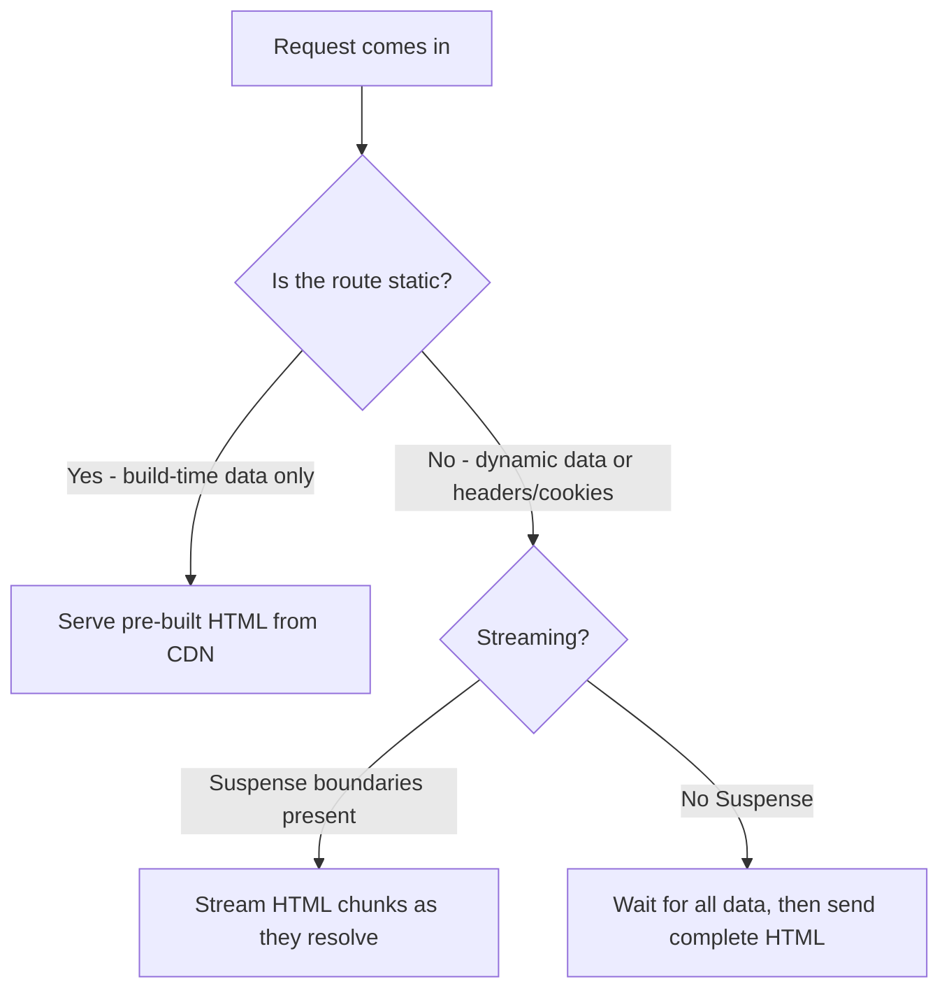

# Next.js — App Router and Full Stack React

> Revision notes for experienced JS developers. Assumes fluency in React, TypeScript, and async JS. Focuses on WHY, GOTCHAS, and production patterns.

---

## 🗺️ Table of Contents

1. [App Router Fundamentals](#1-app-router-fundamentals)
2. [Server Components — The Paradigm Shift](#2-server-components--the-paradigm-shift)
3. [Data Fetching in App Router](#3-data-fetching-in-app-router)
4. [Server Actions](#4-server-actions)
5. [Rendering Strategies](#5-rendering-strategies)
6. [Middleware](#6-middleware)
7. [Image Component](#7-image-component)
8. [Route Handlers](#8-route-handlers)
9. [Metadata API](#9-metadata-api)
10. [Deployment](#10-deployment)
11. [Full Example: Blog with Server Components + React Query + Server Actions](#11-full-example-blog)

---

## 1. App Router Fundamentals

### The File Convention System

App Router uses a **co-location** model. Every route segment is a folder. Special filenames have reserved semantics:

| File | Purpose | Runs on |
|---|---|---|
| `page.tsx` | UI for the route, makes it publicly accessible | Server (default) |
| `layout.tsx` | Wraps children, persists across navigations | Server (default) |
| `loading.tsx` | Suspense boundary fallback shown during data fetch | Server (streamed) |
| `error.tsx` | Error boundary for the segment | **Client** (must be) |
| `not-found.tsx` | Rendered when `notFound()` is called | Server |
| `template.tsx` | Like layout but re-mounts on navigation (no state persistence) | Server |
| `route.ts` | API route handler — no UI | Server/Edge |
| `middleware.ts` | Runs before request, at the root level only | Edge |

```
app/
├── layout.tsx          ← root layout (html, body tags live here)
├── page.tsx            ← renders at /
├── loading.tsx         ← suspense fallback for /
├── error.tsx           ← error boundary for /
├── not-found.tsx       ← 404 for /
├── dashboard/
│   ├── layout.tsx      ← nested layout (wraps all /dashboard/* routes)
│   ├── page.tsx        ← renders at /dashboard
│   └── settings/
│       └── page.tsx    ← renders at /dashboard/settings
```

**Here's the trap most devs fall into:** Layouts do NOT re-render on navigation between children. This means layout-level data fetches only run once. If you need fresh data on every navigation, use `template.tsx` instead, or fetch in the `page.tsx` itself.

### Route Groups — `(folder)`

Parentheses around a folder name create a **route group**: the folder name is excluded from the URL, but you still get layout isolation.

```
app/
├── (marketing)/
│   ├── layout.tsx     ← marketing layout (nav, footer for marketing pages)
│   ├── page.tsx       ← /
│   └── about/
│       └── page.tsx   ← /about
├── (dashboard)/
│   ├── layout.tsx     ← dashboard layout (sidebar, auth guard)
│   └── dashboard/
│       └── page.tsx   ← /dashboard
```

**Real-world use cases:**
- Separate auth-protected layouts from public layouts without affecting URLs
- Split a large app into logical sections each with their own root layout
- Multiple root layouts (e.g., marketing site vs. app)

**Here's the trap most devs fall into:** You can have multiple `layout.tsx` files at the root level only if they're inside different route groups. You cannot have two root layouts without route groups.

### Dynamic Segments

```
app/
├── blog/
│   ├── [slug]/
│   │   └── page.tsx      ← /blog/my-post  → params.slug = "my-post"
│   └── [...slug]/
│       └── page.tsx      ← /blog/a/b/c   → params.slug = ["a","b","c"]  (catch-all)
│   └── [[...slug]]/
│       └── page.tsx      ← /blog or /blog/a/b  (optional catch-all)
```

```typescript
// app/blog/[slug]/page.tsx
export default async function BlogPost({
  params,
  searchParams,
}: {
  params: { slug: string };
  searchParams: { page?: string };
}) {
  const post = await getPost(params.slug);
  return <article>{/* ... */}</article>;
}
```

**Note:** In Next.js 15, `params` and `searchParams` are now **Promises** that must be awaited. This was a breaking change.

```typescript
// Next.js 15 — params is a Promise
export default async function BlogPost({
  params,
}: {
  params: Promise<{ slug: string }>;
}) {
  const { slug } = await params; // must await
  // ...
}
```

### Parallel Routes — `@slot`

Show multiple independent pages in the same layout simultaneously. Each `@slot` is passed as a prop to the parent layout.

```
app/
├── layout.tsx          ← receives { children, team, analytics } props
├── page.tsx
├── @team/
│   └── page.tsx        ← /  (rendered in @team slot)
└── @analytics/
    └── page.tsx        ← /  (rendered in @analytics slot)
```

```typescript
// app/layout.tsx
export default function Layout({
  children,
  team,
  analytics,
}: {
  children: React.ReactNode;
  team: React.ReactNode;
  analytics: React.ReactNode;
}) {
  return (
    <div className="grid grid-cols-[1fr_300px]">
      <div>
        {children}
        {team}
      </div>
      <aside>{analytics}</aside>
    </div>
  );
}
```

**Real-world use:** Dashboards with independent loading states for each panel. Each slot gets its own `loading.tsx` and `error.tsx`.

### Intercepting Routes — The Modal Pattern

This is the UX pattern where navigating directly to `/photos/1` shows the full page, but clicking a photo from the gallery shows it in a modal while keeping the gallery in the background.

```
app/
├── layout.tsx
├── photos/
│   ├── page.tsx              ← /photos gallery
│   └── [id]/
│       └── page.tsx          ← /photos/1 (full page, direct nav or refresh)
├── @modal/
│   ├── default.tsx           ← renders null (no modal by default)
│   └── (.)photos/
│       └── [id]/
│           └── page.tsx      ← /photos/1 (intercepted — shows modal)
```

Interception convention:
- `(.)` — same level
- `(..)` — one level up
- `(..)(..)` — two levels up
- `(...)` — root

```typescript
// app/@modal/(.)photos/[id]/page.tsx
import { Modal } from '@/components/modal';

export default async function PhotoModal({ params }: { params: { id: string } }) {
  const photo = await getPhoto(params.id);
  return (
    <Modal>
      
    </Modal>
  );
}
```

```typescript
// app/layout.tsx — parallel + intercepting working together
export default function Layout({
  children,
  modal,
}: {
  children: React.ReactNode;
  modal: React.ReactNode;
}) {
  return (
    <html>
      <body>
        {children}
        {modal} {/* renders null or modal based on interception */}
      </body>
    </html>
  );
}
```

---

## 2. Server Components — The Paradigm Shift

### What RSC Actually Means

React Server Components are components that **only ever execute on the server**. They never ship their JavaScript to the browser. This is NOT SSR — SSR has always existed in Next.js. The difference:

| | Traditional SSR | React Server Components |
|---|---|---|
| Where component runs | Server (and then re-runs on client as hydration) | Server only — never on client |
| JS sent to browser | Component code + runtime | Zero JS for the component itself |
| Can use Node APIs | In `getServerSideProps` (separate function) | Directly inside the component |
| Can be async | No (components are sync functions) | Yes — `async function Component()` |
| Can use useState/useEffect | No (but hydrates to enable it) | No |

```typescript
// Server Component — this code NEVER runs in browser
// No 'use client' needed — Server Component is the default
import { db } from '@/lib/db';
import { cache } from 'react';

const getUser = cache(async (id: string) => {
  return db.user.findUnique({ where: { id } });
});

export default async function UserProfile({ userId }: { userId: string }) {
  // Direct DB access — no API layer needed
  const user = await getUser(userId);
  
  if (!user) notFound();

  // This import never ships to client
  const { parseMarkdown } = await import('some-huge-markdown-lib');
  const bio = parseMarkdown(user.rawBio);

  return (
    <div>
      <h1>{user.name}</h1>
      <div dangerouslySetInnerHTML={{ __html: bio }} />
      {/* Can mix in Client Components */}
      <FollowButton userId={user.id} />
    </div>
  );
}
```

### The Component Tree Mental Model



**Key rule:** Server Components can render Client Components, but Client Components **cannot** render Server Components (directly). You can pass Server Components as `children` to Client Components.

```typescript
// WRONG — Client Component cannot import Server Component
'use client';
import { ServerComponent } from './ServerComponent'; // This makes it a Client Component!

// CORRECT — Pass as children (composition pattern)
// page.tsx (Server Component)
import { ClientWrapper } from './ClientWrapper';
import { ServerData } from './ServerData'; // Server Component

export default async function Page() {
  return (
    <ClientWrapper>
      <ServerData /> {/* ServerData stays a Server Component */}
    </ClientWrapper>
  );
}

// ClientWrapper.tsx
'use client';
export function ClientWrapper({ children }: { children: React.ReactNode }) {
  const [open, setOpen] = useState(false);
  return <div onClick={() => setOpen(true)}>{children}</div>;
}
```

### When to Use Server vs. Client Components

**Use Server Components when:**
- Fetching data from DB or external API
- Accessing filesystem, environment secrets
- Using heavy dependencies (markdown parsers, PDF generators, chart server renderers)
- Static/mostly static content (navigation, footers, product listings)

**Use Client Components when:**
- `useState`, `useReducer`, `useContext`
- `useEffect`, `useLayoutEffect`
- Browser APIs (`window`, `document`, `localStorage`)
- Event handlers (`onClick`, `onChange`, `onSubmit`)
- Custom hooks that use any of the above
- Third-party libraries that use client-only APIs

**Here's the trap most devs fall into:** Adding `'use client'` to a component that has no actual client-side behavior just to import it from a Client Component. This unnecessarily bloats the client bundle. Use the composition pattern instead.

### The 'use client' Boundary

`'use client'` is a **boundary declaration**, not a per-component flag. Once you mark a component as `'use client'`, **all** of its imports also become client-side (they're bundled together).

```typescript
// DANGER: This pulls ALL of ClientComponent's imports into client bundle
'use client';
import { hugeLibrary } from 'massive-library'; // now ships to client!
```

**Production pattern:** Keep Client Components as leaf nodes or near-leaf nodes in the tree. Push the client boundary as deep as possible.

---

## 3. Data Fetching in App Router

### fetch() with Built-in Caching

Next.js extends the native `fetch` API with caching semantics at the framework level.

```typescript
// Static — fetched once at build time, cached forever
const data = await fetch('https://api.example.com/posts', {
  cache: 'force-cache', // default behavior
});

// Dynamic — fetched on every request, not cached
const data = await fetch('https://api.example.com/user', {
  cache: 'no-store',
});

// ISR — revalidate every hour
const data = await fetch('https://api.example.com/products', {
  next: { revalidate: 3600 },
});

// Tag-based revalidation — revalidate on demand via Server Action
const data = await fetch('https://api.example.com/posts', {
  next: { tags: ['posts'] },
});
// Later: revalidateTag('posts') in a Server Action
```

### The Four Caching Layers in Next.js



| Cache | What it stores | Duration | Invalidated by |
|---|---|---|---|
| Request Memoization | Duplicate `fetch()` calls in same render | Single request | Automatic |
| Data Cache | `fetch()` responses | Persistent (until revalidation) | `revalidatePath`, `revalidateTag`, time |
| Full Route Cache | Rendered HTML + RSC payload | Persistent | Redeployment, `revalidatePath` |
| Router Cache | RSC payload in browser | 30s (dynamic) / 5min (static) | `router.refresh()`, Server Action |

**Here's the trap most devs fall into:** Wondering why your data isn't updating after you changed the DB directly. The Full Route Cache is aggressively persistent. In development, caching is mostly disabled. In production, you'll need to call `revalidatePath()` or set `cache: 'no-store'` on your fetches.

### React `cache()` for Deduplication

When multiple Server Components in the same render tree need the same data, `cache()` prevents duplicate DB queries:

```typescript
// lib/data.ts
import { cache } from 'react';
import { db } from './db';

// cache() memoizes within a single request render
export const getPost = cache(async (slug: string) => {
  console.log('DB hit for:', slug); // only logs once even if called 3 times
  return db.post.findFirst({ where: { slug } });
});

// app/blog/[slug]/page.tsx — calls getPost
// app/blog/[slug]/layout.tsx — also calls getPost
// Result: only ONE DB query, both get the same data
```

**`cache()` vs fetch deduplication:**
- `fetch()` deduplication is automatic for the same URL + options
- `cache()` is for arbitrary async functions (DB calls, file reads, computed values)
- Both are per-request — not persistent across requests

### Parallel Data Fetching

```typescript
// WRONG — Sequential (waterfall)
export default async function Dashboard() {
  const user = await getUser();        // wait 100ms
  const posts = await getPosts();      // wait 200ms
  const analytics = await getAnalytics(); // wait 150ms
  // Total: 450ms
}

// CORRECT — Parallel
export default async function Dashboard() {
  const [user, posts, analytics] = await Promise.all([
    getUser(),
    getPosts(),
    getAnalytics(),
  ]);
  // Total: 200ms (slowest wins)
}
```

### Fetching Across Component Tree with Suspense

```typescript
// app/dashboard/page.tsx
import { Suspense } from 'react';
import { UserStats } from './UserStats';
import { RecentPosts } from './RecentPosts';
import { Skeleton } from '@/components/ui/skeleton';

export default function Dashboard() {
  return (
    <div className="grid grid-cols-2 gap-4">
      {/* These fetch independently and stream separately */}
      <Suspense fallback={<Skeleton className="h-32" />}>
        <UserStats />
      </Suspense>
      <Suspense fallback={<Skeleton className="h-32" />}>
        <RecentPosts />
      </Suspense>
    </div>
  );
}

// app/dashboard/UserStats.tsx — async Server Component
export async function UserStats() {
  const stats = await getUserStats(); // slow query — 800ms
  return <div>{/* stats UI */}</div>;
}

// app/dashboard/RecentPosts.tsx — async Server Component
export async function RecentPosts() {
  const posts = await getRecentPosts(); // fast query — 100ms
  return <div>{/* posts UI */}</div>;
}
// Result: RecentPosts streams in at 100ms, UserStats at 800ms — no waterfall
```

---

## 4. Server Actions

### What Server Actions Are

Server Actions let you define server-side functions that can be called directly from Client Components — no manual API route needed. They're essentially RPC (Remote Procedure Call) with built-in CSRF protection and progressive enhancement.

```typescript
// app/actions.ts
'use server'; // marks ALL exports in this file as Server Actions

import { revalidatePath, revalidateTag } from 'next/cache';
import { redirect } from 'next/navigation';
import { db } from '@/lib/db';
import { auth } from '@/lib/auth';

export async function createPost(formData: FormData) {
  const session = await auth(); // auth check inside Server Action
  if (!session) throw new Error('Unauthorized');

  const title = formData.get('title') as string;
  const content = formData.get('content') as string;

  // Validate
  if (!title || title.length < 3) {
    return { error: 'Title must be at least 3 characters' };
  }

  const post = await db.post.create({
    data: { title, content, authorId: session.user.id },
  });

  revalidatePath('/blog');           // invalidate cached blog index
  revalidateTag('posts');            // invalidate all 'posts' tagged fetches
  redirect(`/blog/${post.slug}`);   // navigate to new post
}
```

### Progressive Enhancement — The Form Pattern

Server Actions shine with native HTML forms because they work without JavaScript:

```typescript
// app/contact/page.tsx
import { sendContactEmail } from './actions';

export default function ContactPage() {
  return (
    <form action={sendContactEmail}>  {/* Works even with JS disabled */}
      <input name="email" type="email" required />
      <textarea name="message" required />
      <button type="submit">Send</button>
    </form>
  );
}
```

### With `useActionState` for UX

```typescript
// app/blog/new/page.tsx
'use client';
import { useActionState } from 'react'; // React 19
import { createPost } from '../actions';

type State = { error?: string; success?: boolean };

export default function NewPostForm() {
  const [state, formAction, isPending] = useActionState<State, FormData>(
    createPost,
    {}
  );

  return (
    <form action={formAction}>
      {state.error && (
        <p className="text-red-500">{state.error}</p>
      )}
      <input
        name="title"
        className="border rounded p-2 w-full"
        placeholder="Post title"
        disabled={isPending}
      />
      <textarea
        name="content"
        className="border rounded p-2 w-full mt-2"
        rows={10}
        disabled={isPending}
      />
      <button
        type="submit"
        disabled={isPending}
        className="bg-blue-500 text-white px-4 py-2 rounded mt-2"
      >
        {isPending ? 'Publishing...' : 'Publish'}
      </button>
    </form>
  );
}
```

### Calling Server Actions Programmatically

```typescript
'use client';
import { deletePost } from '@/app/actions';
import { useTransition } from 'react';

export function DeleteButton({ postId }: { postId: string }) {
  const [isPending, startTransition] = useTransition();

  return (
    <button
      onClick={() => {
        startTransition(async () => {
          await deletePost(postId);
        });
      }}
      disabled={isPending}
    >
      {isPending ? 'Deleting...' : 'Delete'}
    </button>
  );
}
```

**Here's the trap most devs fall into:** Forgetting that Server Actions can throw errors that crash the boundary. Always return error objects instead of throwing for user-facing validation errors. Only throw for true unexpected failures.

### revalidatePath vs revalidateTag

| | `revalidatePath` | `revalidateTag` |
|---|---|---|
| Granularity | Specific URL path | All fetches with that tag |
| Use when | You know which page changed | You have shared data across pages |
| Example | `/blog` after creating a post | `'posts'` tag on all post-related fetches |

```typescript
// Revalidate a specific layout too
revalidatePath('/blog', 'layout'); // revalidates layout + all children
revalidatePath('/blog/[slug]', 'page'); // revalidates dynamic pages
```

---

## 5. Rendering Strategies

### The Three Rendering Modes



| Strategy | When HTML is generated | Data freshness | Use case |
|---|---|---|---|
| Static (SSG) | At build time | Stale until redeploy or revalidate | Marketing pages, docs |
| ISR | At build time + on-demand | Up to N seconds stale | Blog posts, product pages |
| Dynamic (SSR) | Every request | Always fresh | User-specific pages, real-time |
| Streaming | Every request (progressively) | Always fresh | Dashboards, slow queries |

### Opting Into Dynamic Rendering

Next.js automatically detects when a route must be dynamic. But you can force it:

```typescript
// app/dashboard/page.tsx
import { cookies, headers } from 'next/headers'; // using these = dynamic
import { unstable_noStore as noStore } from 'next/cache';

// Option 1: Export dynamic config
export const dynamic = 'force-dynamic';
export const revalidate = 0;

// Option 2: Use dynamic functions (cookies, headers, searchParams)
export default async function Page() {
  const cookieStore = cookies();
  const theme = cookieStore.get('theme'); // auto-opts into dynamic
  // ...
}

// Option 3: noStore() in data function
async function getData() {
  noStore(); // equivalent to cache: 'no-store' on fetch
  return db.query();
}
```

### `generateStaticParams` for Static Dynamic Routes

```typescript
// app/blog/[slug]/page.tsx

// Tell Next.js which slugs to pre-render at build time
export async function generateStaticParams() {
  const posts = await db.post.findMany({ select: { slug: true } });
  return posts.map((post) => ({ slug: post.slug }));
}

// dynamicParams controls what happens for slugs NOT in generateStaticParams
export const dynamicParams = true;  // default: render on demand and cache
// export const dynamicParams = false; // return 404 for unknown slugs
```

### Streaming with Suspense

```typescript
// app/analytics/page.tsx
import { Suspense } from 'react';

// Shell renders immediately (no data)
export default function AnalyticsPage() {
  return (
    <main>
      <h1>Analytics</h1>                    {/* Immediate */}
      <QuickStats />                          {/* Fast Server Component */}
      <Suspense fallback={<ChartSkeleton />}>
        <SlowChart />                         {/* Streams in when ready */}
      </Suspense>
      <Suspense fallback={<TableSkeleton />}>
        <DataTable />                         {/* Streams in when ready */}
      </Suspense>
    </main>
  );
}

async function SlowChart() {
  const data = await getAnalyticsData(); // 2 second query
  return <Chart data={data} />;
}
```

**HTTP-level:** Next.js uses chunked transfer encoding. The initial shell HTML is flushed immediately, then each Suspense boundary's HTML is sent as a `<script>` tag that React uses to "fill in" the placeholder on the client.

---

## 6. Middleware

### What Middleware Is and Isn't

Middleware runs on the **Edge Runtime** (V8 isolate, not full Node.js) before the request reaches your routes. It can:
- Read/write cookies and headers
- Redirect and rewrite URLs
- Return responses directly (early exit)

It **cannot:**
- Import arbitrary Node.js modules (no `fs`, no Prisma, no full DB clients)
- Access the database directly (use a lightweight auth token check instead)

```typescript
// middleware.ts — must be at project root
import { NextResponse } from 'next/server';
import type { NextRequest } from 'next/server';
import { verifyToken } from '@/lib/auth-edge'; // must be edge-compatible

export function middleware(request: NextRequest) {
  const { pathname } = request.nextUrl;

  // Auth check — protect /dashboard and /api (except /api/auth)
  if (pathname.startsWith('/dashboard') || 
      (pathname.startsWith('/api') && !pathname.startsWith('/api/auth'))) {
    
    const token = request.cookies.get('session')?.value;
    
    if (!token || !verifyToken(token)) {
      const loginUrl = new URL('/login', request.url);
      loginUrl.searchParams.set('callbackUrl', pathname);
      return NextResponse.redirect(loginUrl);
    }
  }

  // A/B testing — rewrite URL without redirect (URL stays the same for user)
  if (pathname === '/pricing') {
    const variant = request.cookies.get('ab-variant')?.value ?? 
      (Math.random() > 0.5 ? 'a' : 'b');
    
    const response = NextResponse.rewrite(
      new URL(`/pricing-${variant}`, request.url)
    );
    response.cookies.set('ab-variant', variant, { maxAge: 60 * 60 * 24 * 7 });
    return response;
  }

  // Locale redirect
  const acceptLanguage = request.headers.get('accept-language');
  if (pathname === '/' && acceptLanguage?.startsWith('es')) {
    return NextResponse.redirect(new URL('/es', request.url));
  }

  return NextResponse.next();
}

// Control which paths middleware runs on
export const config = {
  matcher: [
    // Skip Next.js internals and static files
    '/((?!_next/static|_next/image|favicon.ico|public/).*)',
  ],
};
```

**Here's the trap most devs fall into:** Importing Prisma or a JWT library that uses Node.js crypto in middleware. You'll get a build error or runtime crash. Use `jose` (edge-compatible JWT) instead of `jsonwebtoken`.

---

## 7. Image Component

### Why next/image Exists

The native `` tag has no size optimization, no lazy loading by default, and causes layout shift (CLS). `next/image` fixes all of this:

- Automatic WebP/AVIF conversion (30-50% smaller)
- Lazy loading by default
- Prevents Cumulative Layout Shift (must know dimensions)
- Responsive srcsets generated automatically
- On-demand image optimization via a built-in API

```typescript
import Image from 'next/image';

// Local images — width/height inferred from import
import heroImage from '/public/hero.jpg';

export function Hero() {
  return (
    <Image
      src={heroImage}
      alt="Hero image"
      priority            // LCP image — skip lazy load
      placeholder="blur"  // auto blur-up from local image
      className="rounded-lg"
    />
  );
}

// Remote images — must specify width + height (or fill)
export function Avatar({ url, name }: { url: string; name: string }) {
  return (
    <Image
      src={url}
      alt={name}
      width={48}
      height={48}
      className="rounded-full"
    />
  );
}

// Fill mode — image fills its parent container
export function CoverImage({ src }: { src: string }) {
  return (
    <div className="relative h-64 w-full">
      <Image
        src={src}
        alt="Cover"
        fill
        sizes="(max-width: 768px) 100vw, (max-width: 1200px) 50vw, 33vw"
        className="object-cover"
      />
    </div>
  );
}
```

### Configuring Remote Domains

```typescript
// next.config.ts
import type { NextConfig } from 'next';

const config: NextConfig = {
  images: {
    remotePatterns: [
      {
        protocol: 'https',
        hostname: 'images.unsplash.com',
        pathname: '/photo-*',
      },
      {
        protocol: 'https',
        hostname: '**.cloudinary.com', // wildcard subdomain
      },
    ],
  },
};
export default config;
```

**Here's the trap most devs fall into:** Not providing the `sizes` attribute on fill/responsive images. Without it, the browser downloads the full-width image on mobile. The `sizes` attribute tells the browser which image size to fetch at each breakpoint.

---

## 8. Route Handlers

### Replacing `pages/api` with Route Handlers

Route handlers use Web Standard `Request`/`Response` objects. They live in `app/api/route.ts` (or any path ending in `/route.ts`).

```typescript
// app/api/posts/route.ts
import { NextRequest, NextResponse } from 'next/server';
import { auth } from '@/lib/auth';
import { db } from '@/lib/db';
import { z } from 'zod';

const CreatePostSchema = z.object({
  title: z.string().min(3).max(200),
  content: z.string().min(10),
  published: z.boolean().default(false),
});

export async function GET(request: NextRequest) {
  const { searchParams } = new URL(request.url);
  const page = parseInt(searchParams.get('page') ?? '1');
  const limit = parseInt(searchParams.get('limit') ?? '10');

  const posts = await db.post.findMany({
    where: { published: true },
    skip: (page - 1) * limit,
    take: limit,
    orderBy: { createdAt: 'desc' },
  });

  return NextResponse.json({ posts, page, limit });
}

export async function POST(request: NextRequest) {
  const session = await auth();
  if (!session) {
    return NextResponse.json({ error: 'Unauthorized' }, { status: 401 });
  }

  const body = await request.json();
  const result = CreatePostSchema.safeParse(body);
  
  if (!result.success) {
    return NextResponse.json(
      { error: 'Validation failed', details: result.error.flatten() },
      { status: 422 }
    );
  }

  const post = await db.post.create({
    data: { ...result.data, authorId: session.user.id },
  });

  return NextResponse.json(post, { status: 201 });
}
```

```typescript
// app/api/posts/[id]/route.ts — dynamic route handler
export async function DELETE(
  request: NextRequest,
  { params }: { params: { id: string } }
) {
  const session = await auth();
  if (!session) return NextResponse.json({ error: 'Unauthorized' }, { status: 401 });

  const post = await db.post.findUnique({ where: { id: params.id } });
  if (!post) return NextResponse.json({ error: 'Not found' }, { status: 404 });
  if (post.authorId !== session.user.id) {
    return NextResponse.json({ error: 'Forbidden' }, { status: 403 });
  }

  await db.post.delete({ where: { id: params.id } });
  return new NextResponse(null, { status: 204 });
}
```

### Route Handler Caching

```typescript
// Static route handler — cached like a page
export const dynamic = 'force-static';

// Cache with revalidation
export const revalidate = 60;

export async function GET() {
  const data = await getPublicData();
  return NextResponse.json(data);
}
```

**When to use Route Handlers vs. Server Actions:**

| Scenario | Use |
|---|---|
| External service needs to call your API (webhooks) | Route Handler |
| Mobile app / third party consuming your API | Route Handler |
| File upload with streaming | Route Handler |
| Form submission from your React app | Server Action |
| Mutation triggered by button click | Server Action |
| CRON job triggered by Vercel/Upstash | Route Handler |

---

## 9. Metadata API

### Static vs. Dynamic Metadata

```typescript
// app/layout.tsx — static metadata
import type { Metadata } from 'next';

export const metadata: Metadata = {
  title: {
    template: '%s | My Blog', // Page titles become "Post Title | My Blog"
    default: 'My Blog',
  },
  description: 'A blog about web development',
  openGraph: {
    type: 'website',
    locale: 'en_US',
    url: 'https://myblog.com',
    siteName: 'My Blog',
  },
  twitter: {
    card: 'summary_large_image',
    creator: '@myhandle',
  },
  robots: {
    index: true,
    follow: true,
  },
};
```

```typescript
// app/blog/[slug]/page.tsx — dynamic metadata
import type { Metadata } from 'next';
import { getPost } from '@/lib/data';

export async function generateMetadata({
  params,
}: {
  params: { slug: string };
}): Promise<Metadata> {
  const post = await getPost(params.slug); // deduped with page's getPost call

  if (!post) return { title: 'Post Not Found' };

  return {
    title: post.title,
    description: post.excerpt,
    openGraph: {
      title: post.title,
      description: post.excerpt,
      type: 'article',
      publishedTime: post.createdAt.toISOString(),
      authors: [post.author.name],
      images: [
        {
          url: post.coverImage ?? '/og-default.jpg',
          width: 1200,
          height: 630,
          alt: post.title,
        },
      ],
    },
  };
}
```

### File-Based Metadata

Special files in route segments that Next.js handles automatically:

```
app/
├── favicon.ico              ← auto-served as favicon
├── icon.png                 ← app icon
├── apple-icon.png           ← Apple touch icon
├── opengraph-image.png      ← default OG image
├── robots.txt               ← or robots.ts for dynamic
├── sitemap.xml              ← or sitemap.ts for dynamic
└── blog/
    └── [slug]/
        └── opengraph-image.tsx  ← dynamic OG image per post
```

```typescript
// app/blog/[slug]/opengraph-image.tsx
import { ImageResponse } from 'next/og';
import { getPost } from '@/lib/data';

export const runtime = 'edge';
export const size = { width: 1200, height: 630 };
export const contentType = 'image/png';

export default async function OgImage({ params }: { params: { slug: string } }) {
  const post = await getPost(params.slug);

  return new ImageResponse(
    <div
      style={{
        background: 'linear-gradient(to bottom right, #1e293b, #334155)',
        width: '100%',
        height: '100%',
        display: 'flex',
        flexDirection: 'column',
        justifyContent: 'center',
        padding: 60,
      }}
    >
      <p style={{ color: '#94a3b8', fontSize: 24 }}>{post?.author.name}</p>
      <h1 style={{ color: 'white', fontSize: 64, fontWeight: 700, lineHeight: 1.2 }}>
        {post?.title}
      </h1>
    </div>
  );
}
```

---

## 10. Deployment

### Vercel vs. Self-Hosted

| Feature | Vercel | Self-Hosted (Docker) |
|---|---|---|
| ISR | Built-in, zero config | Requires custom cache handler |
| Edge Middleware | Vercel Edge Network | Limited — runs where your server is |
| Image optimization | Automatic | Requires `sharp` installed |
| Serverless functions | Auto-scaled per route | You manage scaling |
| Cost | Per-function invocation | Predictable (VPS cost) |
| Vendor lock-in | Moderate | None |

### Docker Deployment (Self-Hosted)

```dockerfile
# Dockerfile
FROM node:20-alpine AS base

FROM base AS deps
RUN apk add --no-cache libc6-compat
WORKDIR /app
COPY package.json pnpm-lock.yaml ./
RUN corepack enable pnpm && pnpm install --frozen-lockfile

FROM base AS builder
WORKDIR /app
COPY --from=deps /app/node_modules ./node_modules
COPY . .
ENV NEXT_TELEMETRY_DISABLED=1
RUN pnpm build

FROM base AS runner
WORKDIR /app
ENV NODE_ENV=production
ENV NEXT_TELEMETRY_DISABLED=1
RUN addgroup --system --gid 1001 nodejs
RUN adduser --system --uid 1001 nextjs

COPY --from=builder /app/public ./public
COPY --from=builder --chown=nextjs:nodejs /app/.next/standalone ./
COPY --from=builder --chown=nextjs:nodejs /app/.next/static ./.next/static

USER nextjs
EXPOSE 3000
ENV PORT=3000
CMD ["node", "server.js"]
```

```typescript
// next.config.ts — required for standalone Docker output
const config: NextConfig = {
  output: 'standalone', // produces minimal server bundle
};
```

### Environment Variables

```bash
# .env.local — local dev only, never committed
DATABASE_URL="postgresql://localhost:5432/myapp"
NEXTAUTH_SECRET="dev-secret"

# .env — committed, defaults for all environments
NEXT_PUBLIC_APP_URL="http://localhost:3000"
```

```typescript
// Server-side: any env var
const dbUrl = process.env.DATABASE_URL;

// Client-side: ONLY vars prefixed with NEXT_PUBLIC_
const appUrl = process.env.NEXT_PUBLIC_APP_URL;
```

**Here's the trap most devs fall into:** Forgetting that `NEXT_PUBLIC_` vars are **baked in at build time**, not at runtime. If you change them in your hosting environment without rebuilding, the client-side values won't update. For truly dynamic runtime client config, use a Route Handler to serve config from the server.

### ISR on Self-Hosted

```typescript
// next.config.ts
const config: NextConfig = {
  experimental: {
    incrementalCacheHandlerPath: require.resolve('./cache-handler.js'),
  },
};

// cache-handler.js — example using Redis
const { createClient } = require('redis');
const client = createClient({ url: process.env.REDIS_URL });

module.exports = class CacheHandler {
  async get(key) {
    const data = await client.get(key);
    return data ? JSON.parse(data) : null;
  }
  async set(key, data, ctx) {
    await client.set(key, JSON.stringify(data), { EX: ctx.revalidate || 3600 });
  }
};
```

---

## 11. Full Example: Blog

A production-pattern blog with Server Components for data, React Query for client-side optimistic updates, and Server Actions for mutations.

### Project Structure

```
app/
├── (blog)/
│   ├── layout.tsx           ← blog layout with nav
│   ├── page.tsx             ← post list (Server Component)
│   └── [slug]/
│       ├── page.tsx         ← post detail (Server Component)
│       └── opengraph-image.tsx
├── (admin)/
│   ├── layout.tsx           ← admin layout (auth-protected)
│   └── admin/
│       ├── page.tsx         ← post management
│       └── new/
│           └── page.tsx     ← create post form
├── api/
│   └── posts/
│       └── route.ts         ← for React Query (client-side)
└── actions/
    └── posts.ts             ← Server Actions
```

### Server Component — Post List

```typescript
// app/(blog)/page.tsx
import { Suspense } from 'react';
import { getPublishedPosts } from '@/lib/data';
import { PostCard } from '@/components/post-card';
import { PostCardSkeleton } from '@/components/skeletons';

async function PostList() {
  const posts = await getPublishedPosts();

  return (
    <div className="grid gap-6 md:grid-cols-2 lg:grid-cols-3">
      {posts.map((post) => (
        <PostCard key={post.id} post={post} />
      ))}
    </div>
  );
}

export default function BlogPage() {
  return (
    <main className="container mx-auto px-4 py-8">
      <h1 className="text-4xl font-bold mb-8">Blog</h1>
      <Suspense
        fallback={
          <div className="grid gap-6 md:grid-cols-2 lg:grid-cols-3">
            {Array.from({ length: 6 }).map((_, i) => (
              <PostCardSkeleton key={i} />
            ))}
          </div>
        }
      >
        <PostList />
      </Suspense>
    </main>
  );
}
```

### Server Actions — Mutations

```typescript
// app/actions/posts.ts
'use server';

import { revalidatePath, revalidateTag } from 'next/cache';
import { redirect } from 'next/navigation';
import { auth } from '@/lib/auth';
import { db } from '@/lib/db';
import { z } from 'zod';
import slugify from 'slugify';

const PostSchema = z.object({
  title: z.string().min(3, 'Title must be at least 3 characters').max(200),
  content: z.string().min(10, 'Content must be at least 10 characters'),
  excerpt: z.string().max(500).optional(),
  published: z.boolean().default(false),
});

export type PostFormState = {
  errors?: Partial<Record<keyof z.infer<typeof PostSchema>, string[]>>;
  message?: string;
};

export async function createPost(
  prevState: PostFormState,
  formData: FormData
): Promise<PostFormState> {
  const session = await auth();
  if (!session?.user) return { message: 'Unauthorized' };

  const raw = {
    title: formData.get('title'),
    content: formData.get('content'),
    excerpt: formData.get('excerpt') || undefined,
    published: formData.get('published') === 'on',
  };

  const result = PostSchema.safeParse(raw);
  if (!result.success) {
    return { errors: result.error.flatten().fieldErrors };
  }

  const slug = slugify(result.data.title, { lower: true, strict: true });

  const post = await db.post.create({
    data: {
      ...result.data,
      slug,
      authorId: session.user.id,
    },
  });

  revalidatePath('/');
  revalidatePath('/admin');
  revalidateTag('posts');

  redirect(`/blog/${post.slug}`);
}

export async function togglePublished(postId: string) {
  const session = await auth();
  if (!session?.user) throw new Error('Unauthorized');

  const post = await db.post.findUnique({ where: { id: postId } });
  if (!post || post.authorId !== session.user.id) throw new Error('Forbidden');

  const updated = await db.post.update({
    where: { id: postId },
    data: { published: !post.published },
  });

  revalidatePath('/admin');
  revalidateTag('posts');

  return updated;
}

export async function deletePost(postId: string) {
  const session = await auth();
  if (!session?.user) throw new Error('Unauthorized');

  const post = await db.post.findUnique({ where: { id: postId } });
  if (!post || post.authorId !== session.user.id) throw new Error('Forbidden');

  await db.post.delete({ where: { id: postId } });

  revalidatePath('/admin');
  revalidatePath('/');
  revalidateTag('posts');
}
```

### New Post Form — Client Component

```typescript
// app/(admin)/admin/new/page.tsx
'use client';
import { useActionState } from 'react';
import { createPost, type PostFormState } from '@/app/actions/posts';

const initialState: PostFormState = {};

export default function NewPostPage() {
  const [state, formAction, isPending] = useActionState(createPost, initialState);

  return (
    <div className="max-w-2xl mx-auto py-8">
      <h1 className="text-3xl font-bold mb-8">New Post</h1>

      <form action={formAction} className="space-y-6">
        <div>
          <label htmlFor="title" className="block text-sm font-medium mb-1">
            Title
          </label>
          <input
            id="title"
            name="title"
            type="text"
            className="w-full border rounded-lg p-3 focus:ring-2 focus:ring-blue-500"
            aria-describedby="title-error"
          />
          {state.errors?.title && (
            <p id="title-error" className="text-red-500 text-sm mt-1">
              {state.errors.title[0]}
            </p>
          )}
        </div>

        <div>
          <label htmlFor="content" className="block text-sm font-medium mb-1">
            Content (Markdown)
          </label>
          <textarea
            id="content"
            name="content"
            rows={20}
            className="w-full border rounded-lg p-3 font-mono focus:ring-2 focus:ring-blue-500"
            aria-describedby="content-error"
          />
          {state.errors?.content && (
            <p id="content-error" className="text-red-500 text-sm mt-1">
              {state.errors.content[0]}
            </p>
          )}
        </div>

        <div className="flex items-center gap-3">
          <input type="checkbox" id="published" name="published" className="h-4 w-4" />
          <label htmlFor="published" className="text-sm font-medium">
            Publish immediately
          </label>
        </div>

        {state.message && (
          <p className="text-red-500">{state.message}</p>
        )}

        <button
          type="submit"
          disabled={isPending}
          className="w-full bg-blue-600 text-white py-3 rounded-lg font-medium 
                     hover:bg-blue-700 disabled:opacity-50 disabled:cursor-not-allowed
                     transition-colors"
        >
          {isPending ? 'Publishing...' : 'Publish Post'}
        </button>
      </form>
    </div>
  );
}
```

### React Query for Client-Side Data (Admin Dashboard)

```typescript
// app/(admin)/admin/page.tsx
import { HydrationBoundary, QueryClient, dehydrate } from '@tanstack/react-query';
import { auth } from '@/lib/auth';
import { redirect } from 'next/navigation';
import { AdminPostList } from './AdminPostList';

// Server Component — prefetches data and dehydrates for client
export default async function AdminPage() {
  const session = await auth();
  if (!session?.user) redirect('/login');

  const queryClient = new QueryClient();

  // Prefetch on server so client has instant data
  await queryClient.prefetchQuery({
    queryKey: ['admin-posts'],
    queryFn: () => fetch(`${process.env.NEXT_PUBLIC_APP_URL}/api/posts?admin=true`)
      .then(r => r.json()),
  });

  return (
    <HydrationBoundary state={dehydrate(queryClient)}>
      <AdminPostList />
    </HydrationBoundary>
  );
}
```

```typescript
// app/(admin)/admin/AdminPostList.tsx
'use client';
import { useQuery, useMutation, useQueryClient } from '@tanstack/react-query';
import { useTransition } from 'react';
import { togglePublished, deletePost } from '@/app/actions/posts';

type Post = { id: string; title: string; slug: string; published: boolean; createdAt: string };

export function AdminPostList() {
  const queryClient = useQueryClient();
  const [isPending, startTransition] = useTransition();

  const { data, isLoading } = useQuery<{ posts: Post[] }>({
    queryKey: ['admin-posts'],
    queryFn: () => fetch('/api/posts?admin=true').then(r => r.json()),
    staleTime: 60_000,
  });

  const deleteMutation = useMutation({
    mutationFn: (postId: string) => deletePost(postId),
    // Optimistic update
    onMutate: async (postId) => {
      await queryClient.cancelQueries({ queryKey: ['admin-posts'] });
      const previous = queryClient.getQueryData<{ posts: Post[] }>(['admin-posts']);
      
      queryClient.setQueryData<{ posts: Post[] }>(['admin-posts'], (old) => ({
        posts: old?.posts.filter(p => p.id !== postId) ?? [],
      }));
      
      return { previous };
    },
    onError: (_err, _postId, context) => {
      queryClient.setQueryData(['admin-posts'], context?.previous);
    },
    onSettled: () => {
      queryClient.invalidateQueries({ queryKey: ['admin-posts'] });
    },
  });

  if (isLoading) return <div>Loading posts...</div>;

  return (
    <div className="space-y-4">
      <h1 className="text-2xl font-bold">Manage Posts</h1>
      <div className="divide-y border rounded-lg overflow-hidden">
        {data?.posts.map((post) => (
          <div key={post.id} className="flex items-center justify-between p-4 bg-white">
            <div>
              <h2 className="font-medium">{post.title}</h2>
              <p className="text-sm text-gray-500">
                {new Date(post.createdAt).toLocaleDateString()} ·{' '}
                <span className={post.published ? 'text-green-600' : 'text-yellow-600'}>
                  {post.published ? 'Published' : 'Draft'}
                </span>
              </p>
            </div>
            <div className="flex gap-2">
              <button
                onClick={() => startTransition(() => togglePublished(post.id))}
                disabled={isPending}
                className="text-sm px-3 py-1 border rounded hover:bg-gray-50"
              >
                {post.published ? 'Unpublish' : 'Publish'}
              </button>
              <button
                onClick={() => deleteMutation.mutate(post.id)}
                disabled={deleteMutation.isPending}
                className="text-sm px-3 py-1 bg-red-500 text-white rounded hover:bg-red-600"
              >
                Delete
              </button>
            </div>
          </div>
        ))}
      </div>
    </div>
  );
}
```

### Route Handler for React Query

```typescript
// app/api/posts/route.ts
import { NextRequest, NextResponse } from 'next/server';
import { auth } from '@/lib/auth';
import { db } from '@/lib/db';

export async function GET(request: NextRequest) {
  const { searchParams } = new URL(request.url);
  const isAdmin = searchParams.get('admin') === 'true';

  if (isAdmin) {
    const session = await auth();
    if (!session?.user) {
      return NextResponse.json({ error: 'Unauthorized' }, { status: 401 });
    }

    const posts = await db.post.findMany({
      where: { authorId: session.user.id },
      orderBy: { createdAt: 'desc' },
      select: { id: true, title: true, slug: true, published: true, createdAt: true },
    });

    return NextResponse.json({ posts });
  }

  // Public endpoint — cached
  const posts = await db.post.findMany({
    where: { published: true },
    orderBy: { createdAt: 'desc' },
    select: { id: true, title: true, slug: true, excerpt: true, createdAt: true },
    take: 20,
  });

  return NextResponse.json(
    { posts },
    { headers: { 'Cache-Control': 'public, s-maxage=60, stale-while-revalidate=300' } }
  );
}
```

---

## 🧩 Quick Reference — Directive Cheat Sheet

```typescript
// File-level directives — must be first line
'use client'  // Component runs on client + server (SSR), ships JS to browser
'use server'  // Function is a Server Action (or entire file of Server Actions)

// Export-level configs for pages/layouts
export const dynamic = 'force-dynamic'   // Always SSR, never cache
export const dynamic = 'force-static'   // Always static, error if dynamic used
export const revalidate = 3600          // ISR — revalidate every hour
export const runtime = 'edge'           // Use Edge runtime instead of Node.js
export const runtime = 'nodejs'         // Default — full Node.js
```

## 🔥 The Mental Model That Makes Everything Click

App Router is built around **server-first** rendering with **selective hydration**. The default is server, you opt INTO client. The flow:

```
1. Request arrives
2. Next.js renders Server Components on server (can be async, DB, etc.)
3. Client Components are rendered to HTML on server too (SSR)
4. HTML is streamed to browser chunk by chunk (Suspense boundaries)
5. React hydrates Client Components in the browser (attaches event handlers)
6. Server Components are NEVER hydrated — they're inert HTML
```

The React Server Component payload (RSC payload) is a special binary format that represents the component tree. It's what Next.js uses to update the page during client navigation without full page reloads, while still keeping Server Components on the server.

---

*Sources: Next.js 15 docs, React 19 RFC, Vercel engineering blog, production experience.*
