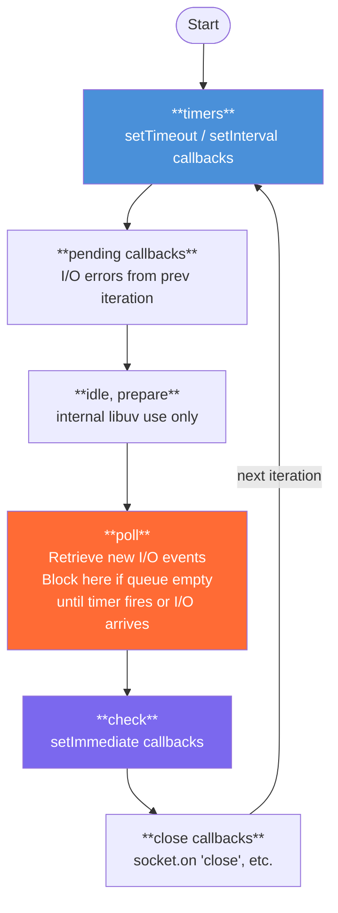
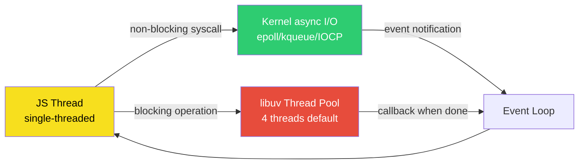
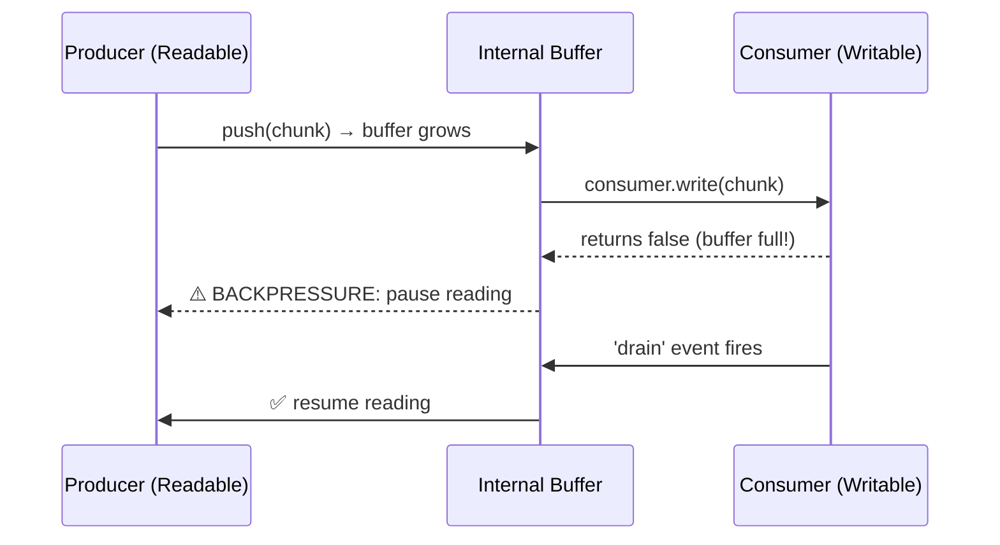

# 15 — Node.js Internals: Event Loop, Streams, and libuv

> **Audience:** Experienced JS developers revising for interviews or production debugging. JS syntax is assumed — we go straight to the guts.

---

## 🏗️ Node.js Architecture: Four Layers You Must Know

Node.js is not "just a runtime." It is a composition of four distinct layers, each with a different job. Knowing which layer owns which problem is 80% of debugging Node.js in production.

```
┌─────────────────────────────────────────────────────────────┐
│                    Your Application Code                      │
├─────────────────────────────────────────────────────────────┤
│              Node.js Standard Library (JS layer)             │
│       fs, http, crypto, stream, path, events, ...           │
├─────────────────────────────────────────────────────────────┤
│         Node.js Bindings (C++ glue / bridge layer)          │
│   node_file.cc, node_crypto.cc, node_http_parser.cc, ...    │
├──────────────────────────┬──────────────────────────────────┤
│        V8 Engine         │         libuv                     │
│   (JS execution &        │  (event loop, async I/O,         │
│    heap/GC management)   │   thread pool, OS abstractions)  │
└──────────────────────────┴──────────────────────────────────┘
```

### V8 — The JS Execution Engine

V8 compiles JS to native machine code using JIT (Just-In-Time) compilation. What you care about as a Node developer:

- **Hidden classes / shapes:** V8 creates internal "shapes" for objects. If you add properties in different orders to the same "class" of objects, V8 de-optimises both. Keep constructor property order consistent.
- **Inline caching (IC):** V8 caches the type of values at call sites. Polymorphic call sites (same function called with different object shapes) cause megamorphic ICs — a serious perf cliff.
- **Garbage Collection (Generational):**
  - **New space (Scavenger/Minor GC):** Fast, small, for short-lived objects. Runs constantly.
  - **Old space (Major GC / Mark-Sweep-Compact):** Slow, stop-the-world pauses. Triggered when new space fills up and objects are promoted.

**The production implication:** Memory leaks in Node usually manifest as Old space growing unchecked. Use `--max-old-space-size=<MB>` to cap it, and `process.memoryUsage()` to monitor it.

### libuv — The Hidden Boss

libuv is a C library that gives Node cross-platform async I/O. It is the reason the same `fs.readFile` call works on Linux (epoll), macOS (kqueue), and Windows (IOCP).

libuv provides:
- The **event loop** (the 6-phase loop detailed below)
- A **thread pool** (for blocking operations)
- Abstractions for sockets, timers, child processes, signals, and more
- **Async DNS resolution** (uses thread pool for `getaddrinfo`)

### Node.js Bindings — The Glue

When you call `fs.readFile()`, the JS lands in a C++ binding (`node_file.cc`) which calls into libuv. The bindings are Node's bridge — they convert JS types (V8 objects) into C types libuv and the OS understand. C++ addons (`.node` files via `node-gyp`) operate at this same layer.

---

## 🔄 The Event Loop: The 6-Phase Deep Dive

The Node.js event loop is **not** the browser event loop. Do not conflate them. The browser has a simpler macro/microtask model. Node has 6 ordered phases, each with its own FIFO queue.



**Between every phase transition**, Node drains two queues completely before moving on:
1. `process.nextTick` queue
2. Promise microtask queue (`.then`, `async/await` continuations)

This is the most interview-critical fact about the Node event loop.

### Phase 1: Timers

Executes callbacks whose **threshold** (delay) has elapsed. This is the key word — not "exact delay." A `setTimeout(fn, 1)` fires when ≥ 1ms has elapsed **and** the event loop reaches the timers phase. The actual delay is always longer under load.

```js
// Production gotcha: setTimeout(fn, 0) is actually setTimeout(fn, 1)
// Per the HTML spec minimum, but Node's libuv clamps at 1ms too.
setTimeout(() => console.log('timer'), 0);
// Actual minimum delay: 1ms
```

### Phase 2: Pending Callbacks

Executes I/O callbacks deferred to the next loop iteration. For example, TCP errors like `ECONNREFUSED` land here, not in the poll phase. You rarely interact with this directly but it explains why some socket errors feel "delayed."

### Phase 3: Idle, Prepare

Internal. libuv uses this for its own bookkeeping. You have no access here. Forget it exists.

### Phase 4: Poll — The Heart of the Loop

This is the most important phase and the one most developers don't understand.

**What happens:**
1. Calculate how long to block (based on nearest timer deadline).
2. Execute any I/O callbacks in the poll queue that are already ready.
3. If the poll queue empties:
   - If `setImmediate` callbacks are pending → exit poll, move to check phase
   - If no `setImmediate` callbacks → **block here** waiting for I/O events up to the timer threshold

**The "block here" part is what makes Node efficient.** Instead of spinning, libuv makes a blocking syscall (`epoll_wait` on Linux) that returns when the OS has data. Zero CPU burn while waiting for network responses.

### Phase 5: Check — setImmediate

Runs `setImmediate` callbacks. Always runs after the poll phase of the same iteration.

### Phase 6: Close Callbacks

Runs `close` events: `socket.destroy()`, `http.server.close()`. Cleanup logic lives here.

---

## ⏱️ process.nextTick vs setImmediate vs setTimeout(fn, 0)

This is the single most-asked Node.js interview question. Get it exactly right.

```js
setTimeout(() => console.log('1 - setTimeout'), 0);

setImmediate(() => console.log('2 - setImmediate'));

process.nextTick(() => console.log('3 - nextTick'));

Promise.resolve().then(() => console.log('4 - Promise'));

console.log('5 - synchronous');
```

**Output (guaranteed):**
```
5 - synchronous
3 - nextTick
4 - Promise
1 - setTimeout    ← order of 1 and 2 can vary OUTSIDE I/O context
2 - setImmediate  ← (see note below)
```

**Here's the trap most devs fall into:** The order of `setTimeout(fn, 0)` vs `setImmediate` is **non-deterministic** when called from the main module (outside an I/O callback). This is because it depends on how long the loop startup takes — if it takes > 1ms, the timer fires first; if not, `setImmediate` fires first.

```js
// ❌ Non-deterministic — don't rely on this order
setTimeout(() => console.log('timeout'), 0);
setImmediate(() => console.log('immediate'));

// ✅ INSIDE an I/O callback, order is guaranteed:
// setImmediate ALWAYS fires before setTimeout
const fs = require('fs');
fs.readFile('/etc/hostname', () => {
  setTimeout(() => console.log('timeout'), 0);
  setImmediate(() => console.log('immediate')); // Always first
});
// Output: immediate → timeout (guaranteed)
```

### The nextTick Starvation Problem

`process.nextTick` is NOT part of the event loop. It runs after the current operation completes, before the loop resumes. This means you can **starve the event loop** with recursive `nextTick`:

```js
// ❌ Production anti-pattern: this starves I/O forever
function recursiveTick() {
  process.nextTick(recursiveTick);
}
recursiveTick(); // HTTP requests never get handled

// ✅ Use setImmediate for recursive async work
function recursiveImmediate() {
  setImmediate(recursiveImmediate); // Yields to I/O between iterations
}
```

### Execution Order Summary Table

| Mechanism | Queue | When it runs | Starvation risk |
|---|---|---|---|
| Synchronous code | Call stack | Right now | Blocks everything |
| `process.nextTick` | nextTick queue | After current op, before event loop continues | Yes — recursive nextTick starves I/O |
| `Promise.resolve().then` | Microtask queue | After nextTick queue, before event loop continues | Yes — same as above |
| `setImmediate` | Check phase queue | End of current loop iteration (check phase) | No |
| `setTimeout(fn, 0)` | Timers phase queue | Next timers phase (≥ 1ms) | No |
| I/O callbacks | Poll phase queue | When OS signals data ready | No |

---

## 🧵 libuv Thread Pool: What Really Runs Off-Thread

Node is single-threaded for **your JS**. But libuv has a thread pool (default: 4 threads) for operations that the OS cannot do asynchronously, or which would block.



### What Uses the Thread Pool

| Operation | Thread Pool? | Why |
|---|---|---|
| `fs.readFile`, `fs.writeFile`, `fs.stat` | **Yes** | OS file I/O can't be made truly async everywhere |
| `crypto.pbkdf2`, `crypto.scrypt`, `crypto.randomBytes` | **Yes** | CPU-intensive, would block event loop |
| `dns.lookup` (not `dns.resolve`) | **Yes** | `getaddrinfo` is a blocking libc call |
| `zlib` compression/decompression | **Yes** | CPU-heavy |
| TCP/UDP network I/O (`http.request`, `net.Socket`) | **No** | Uses kernel async I/O (epoll/kqueue/IOCP) |
| `dns.resolve` (direct DNS query) | **No** | Uses kernel async I/O |

**Here's the trap most devs fall into:** People assume all I/O is handled by the thread pool. Network I/O is **not** in the thread pool — it goes directly through the kernel's async I/O mechanism. Only `dns.lookup` (which calls the OS resolver, which may read `/etc/hosts` from disk) hits the thread pool.

### The Thread Pool Bottleneck in Production

```js
// Scenario: 100 concurrent requests, each doing pbkdf2 password hashing
// Thread pool has 4 threads → 96 requests queue up, latency spikes

const { pbkdf2 } = require('crypto');

// ❌ This will kill your API response times under load
app.post('/login', (req, res) => {
  pbkdf2(req.body.password, salt, 100000, 64, 'sha512', (err, key) => {
    // With 4 thread pool threads and 100 concurrent requests,
    // requests 5-100 wait for earlier hashing to finish
    res.json({ success: true });
  });
});

// ✅ Solutions:
// 1. Increase UV_THREADPOOL_SIZE (up to 128, set before Node starts)
UV_THREADPOOL_SIZE=16 node server.js

// 2. Move CPU work to worker threads (better isolation)
// 3. Use bcrypt with async workers (argon2 native module does this)
```

```js
// Measuring thread pool saturation — a production diagnostic pattern
const start = Date.now();
let completed = 0;

for (let i = 0; i < 8; i++) {
  crypto.pbkdf2('password', 'salt', 100000, 64, 'sha512', () => {
    completed++;
    console.log(`#${completed} done at ${Date.now() - start}ms`);
  });
}
// With UV_THREADPOOL_SIZE=4 (default):
// #1-#4 complete around same time (~200ms)
// #5-#8 complete around same time (~400ms) — double because queued
// This proves 4 threads working in 2 batches
```

### Setting UV_THREADPOOL_SIZE

```bash
# Must be set BEFORE Node.js starts — not runtime configurable
UV_THREADPOOL_SIZE=16 node server.js

# Or in your process manager (PM2 ecosystem.config.js):
module.exports = {
  apps: [{
    name: 'api',
    script: 'server.js',
    env: { UV_THREADPOOL_SIZE: 16 }
  }]
};
```

Max value is 128 (libuv hard cap). Setting it higher than your CPU core count has diminishing returns for CPU-bound tasks but helps for I/O-bound thread pool operations.

---

## 🌊 Streams: Processing Data Without Loading It Into RAM

The most underused and most critical Node.js API for production systems. A Stream is an abstract interface for working with streaming data — data that arrives or is produced over time, chunk by chunk.


### The Four Stream Types

| Type | Abstract class | Real examples | readable | writable |
|---|---|---|---|---|
| Readable | `stream.Readable` | `fs.createReadStream`, `http.IncomingMessage`, `process.stdin` | Yes | No |
| Writable | `stream.Writable` | `fs.createWriteStream`, `http.ServerResponse`, `process.stdout` | No | Yes |
| Duplex | `stream.Duplex` | `net.Socket`, `WebSocket` | Yes | Yes (independent) |
| Transform | `stream.Transform` | `zlib.createGzip()`, `crypto.createCipheriv()` | Yes | Yes (output = f(input)) |

### Why Streams: The 10GB Problem

```js
// ❌ Loading entire file into memory — will crash for large files
const data = fs.readFileSync('bigfile.csv'); // 10GB → OOM kill
processData(data);

// ✅ Streaming — RAM stays at ~highWaterMark (default 16KB per chunk)
const { pipeline } = require('stream/promises');
const { createReadStream, createWriteStream } = require('fs');
const { createGzip } = require('zlib');

await pipeline(
  createReadStream('bigfile.csv'),
  createGzip(),
  createWriteStream('bigfile.csv.gz')
);
// Processes 10GB using ~100KB RAM — the event loop stays free
```

### Backpressure: The Most Important Stream Concept

Backpressure is what happens when the producer is faster than the consumer. Without it, you buffer everything in memory — exactly what streams are supposed to prevent.



The `write()` method on a Writable returns `false` when the internal buffer exceeds `highWaterMark`. This is the signal to pause the source. If you ignore it, buffers grow unboundedly — you've recreated the memory problem you were trying to avoid.

```js
// ❌ Ignoring backpressure — memory will balloon under load
readable.on('data', (chunk) => {
  writable.write(chunk); // ignores the false return value
});

// ✅ Manual backpressure handling (how pipe() does it internally)
readable.on('data', (chunk) => {
  const canContinue = writable.write(chunk);
  if (!canContinue) {
    readable.pause();
    writable.once('drain', () => readable.resume());
  }
});
readable.on('end', () => writable.end());
```

### highWaterMark: Tuning the Buffer

```js
// highWaterMark controls buffer size before backpressure kicks in
// Default: 16KB for byte streams, 16 objects for object mode streams

// For fast network → slow disk: lower HWM to apply backpressure sooner
const readable = fs.createReadStream('file', { highWaterMark: 64 * 1024 }); // 64KB

// For object streams (e.g., database rows): HWM is object count
const { Readable } = require('stream');
const objStream = new Readable({
  objectMode: true,
  highWaterMark: 100, // buffer up to 100 objects before backpressure
  read() {}
});
```

### pipe() vs pipeline() — Always Use pipeline() in Production

```js
// ❌ pipe() does NOT handle errors properly
// If source errors, destination is NOT automatically destroyed
const src = fs.createReadStream('file.txt');
const dst = fs.createWriteStream('out.txt');
src.pipe(dst); // if src errors, dst stays open → resource leak

// ✅ pipeline() with async/await — proper error propagation and cleanup
const { pipeline } = require('stream/promises');

async function processFile() {
  try {
    await pipeline(
      fs.createReadStream('input.csv'),
      new Transform({
        transform(chunk, encoding, callback) {
          // transform data
          callback(null, chunk.toString().toUpperCase());
        }
      }),
      fs.createWriteStream('output.csv')
    );
    console.log('Pipeline succeeded');
  } catch (err) {
    console.error('Pipeline failed:', err);
    // All streams are automatically destroyed on error
  }
}
```

### Building a Custom Transform Stream (Production Pattern)

```js
const { Transform } = require('stream');
const { createReadStream, createWriteStream } = require('fs');
const { pipeline } = require('stream/promises');

// Real example: parse CSV rows from a stream, enrich them, write JSON
class CsvToJsonTransform extends Transform {
  constructor(options = {}) {
    super({ ...options, objectMode: true });
    this._buffer = '';
    this._headers = null;
  }

  _transform(chunk, encoding, callback) {
    this._buffer += chunk.toString();
    const lines = this._buffer.split('\n');
    this._buffer = lines.pop(); // keep incomplete last line

    for (const line of lines) {
      if (!this._headers) {
        this._headers = line.split(',').map(h => h.trim());
        continue;
      }
      if (!line.trim()) continue;
      
      const values = line.split(',');
      const row = {};
      this._headers.forEach((h, i) => {
        row[h] = values[i]?.trim();
      });
      this.push(row); // push object downstream
    }
    callback();
  }

  _flush(callback) {
    // Handle remaining buffer content
    if (this._buffer.trim() && this._headers) {
      const values = this._buffer.split(',');
      const row = {};
      this._headers.forEach((h, i) => { row[h] = values[i]?.trim(); });
      this.push(row);
    }
    callback();
  }
}

class JsonStringifyTransform extends Transform {
  constructor() {
    super({ writableObjectMode: true }); // accepts objects, outputs bytes
  }
  _transform(obj, encoding, callback) {
    callback(null, JSON.stringify(obj) + '\n');
  }
}

// Process 10GB CSV → NDJSON with 16KB RAM
await pipeline(
  createReadStream('huge.csv'),
  new CsvToJsonTransform(),
  new JsonStringifyTransform(),
  createWriteStream('output.ndjson')
);
```

### When to Use / When NOT to Use Streams

| Use Streams | Do NOT Use Streams |
|---|---|
| Processing large files (logs, CSVs, exports) | Small data that fits in RAM (config files, templates) |
| HTTP request/response proxying | When you need random access to data |
| Real-time data pipelines | One-shot computations on known-small input |
| Media streaming (audio, video) | When stream API complexity outweighs benefit |
| Database result set streaming (pg cursor) | Simple transformations on few MB |

---

## 📦 Buffer: Binary Data in a JS World

Before `Buffer`, JS had no way to handle raw binary data. `Buffer` is a fixed-length sequence of bytes (a `Uint8Array` subclass since Node 4).

```js
// Three ways to create Buffers — different security implications

// ✅ Zero-filled, safe for uninitialized data
const safe = Buffer.alloc(10); // 10 bytes of 0x00

// ✅ From data you own
const fromString = Buffer.from('hello world', 'utf8');
const fromHex = Buffer.from('deadbeef', 'hex');
const fromBase64 = Buffer.from('aGVsbG8=', 'base64');
const fromArray = Buffer.from([0x48, 0x65, 0x6c, 0x6c, 0x6f]);

// ❌ NEVER use in production code receiving external data
const unsafe = Buffer.allocUnsafe(10); // may contain old memory contents!
// (Use only for internal buffers you immediately fill)
```

**Here's the trap most devs fall into:** `Buffer.allocUnsafe()` is fast because it skips zeroing memory, but it exposes whatever was in that memory region before — potentially including passwords, keys, or other sensitive data. Only use it for internal buffers you immediately overwrite completely.

### Buffer vs Uint8Array

`Buffer` extends `Uint8Array` and they are largely interchangeable, but there are subtle differences:

| | `Buffer` | `Uint8Array` |
|---|---|---|
| Node-specific | Yes | No (Web standard) |
| Pool allocation | Yes (small buffers share a pool) | No |
| `.toString()` encoding support | Yes (utf8, hex, base64, latin1...) | No — only `TextDecoder` |
| Interop with Node APIs | Native | Works via coercion |
| Recommended for new code | For binary data in Node | For cross-platform / typed arrays |

```js
// Converting between them
const buf = Buffer.from([1, 2, 3]);
const ua = new Uint8Array(buf); // copy
const ua2 = new Uint8Array(buf.buffer, buf.byteOffset, buf.byteLength); // zero-copy view

// TextDecoder for Uint8Array (the portable way)
const decoder = new TextDecoder('utf-8');
const str = decoder.decode(ua);
```

---

## 🧵 Worker Threads: True Multi-Threading

Node's worker threads (added in v10, stable in v12) give you real OS threads that run V8 instances in isolation. Not processes — threads — so they share memory if you opt in.

### When to Use Worker Threads

```
CPU-bound work (YES → Worker Threads):
  Image/video processing, ML inference, JSON parsing of huge files,
  crypto operations (if you want to avoid thread pool saturation),
  any hot loop that takes > 10ms on the main thread

I/O-bound work (NO → just use async):
  HTTP requests, database queries, file reads — libuv handles these
  efficiently already. Adding worker threads here adds overhead with
  zero benefit.
```

### Production Worker Thread Pattern

```js
// worker.js — runs in worker thread
const { workerData, parentPort } = require('worker_threads');

function expensiveComputation(data) {
  // Simulate: image processing, ML feature extraction, etc.
  let result = 0;
  for (let i = 0; i < data.iterations; i++) {
    result += Math.sqrt(i) * Math.PI;
  }
  return result;
}

const result = expensiveComputation(workerData);
parentPort.postMessage({ result });
```

```js
// main.js — worker pool pattern (production-grade)
const { Worker } = require('worker_threads');
const os = require('os');

class WorkerPool {
  constructor(workerScript, poolSize = os.cpus().length) {
    this.workerScript = workerScript;
    this.pool = [];
    this.queue = [];
    
    for (let i = 0; i < poolSize; i++) {
      this._addWorker();
    }
  }

  _addWorker() {
    const worker = new Worker(this.workerScript, { workerData: {} });
    worker.isAvailable = true;
    worker.on('message', ({ result, taskId }) => {
      const task = this.pendingTasks.get(taskId);
      if (task) {
        task.resolve(result);
        this.pendingTasks.delete(taskId);
      }
      worker.isAvailable = true;
      this._processQueue();
    });
    worker.on('error', (err) => {
      console.error('Worker error:', err);
      // Replace dead worker
      this.pool = this.pool.filter(w => w !== worker);
      this._addWorker();
    });
    this.pool.push(worker);
  }

  run(data) {
    return new Promise((resolve, reject) => {
      this.queue.push({ data, resolve, reject });
      this._processQueue();
    });
  }

  _processQueue() {
    if (this.queue.length === 0) return;
    const available = this.pool.find(w => w.isAvailable);
    if (!available) return;
    
    const task = this.queue.shift();
    available.isAvailable = false;
    available.postMessage(task.data);
    // Match resolve to this task via message handler above
  }
}

// Usage
const pool = new WorkerPool('./worker.js', 4);
const results = await Promise.all(
  Array.from({ length: 20 }, (_, i) => pool.run({ iterations: 1e8 }))
);
```

### SharedArrayBuffer: Zero-Copy Data Sharing

```js
// Sharing large buffers between main thread and workers WITHOUT copying

// main.js
const { Worker } = require('worker_threads');

const sharedBuffer = new SharedArrayBuffer(4 * 1024 * 1024); // 4MB shared
const sharedArray = new Float64Array(sharedBuffer);

// Fill with data
for (let i = 0; i < sharedArray.length; i++) sharedArray[i] = Math.random();

const worker = new Worker('./worker.js', {
  workerData: { sharedBuffer } // transferred, not copied
});

// worker.js
const { workerData } = require('worker_threads');
const sharedArray = new Float64Array(workerData.sharedBuffer);
// Worker can read/write sharedArray directly — same memory as main thread
// Use Atomics for synchronization if concurrent access is possible
const sum = sharedArray.reduce((a, b) => a + b, 0);
```

---

## 🌐 Cluster Module: CPU-Level Horizontal Scaling

Worker threads = multiple threads, one process. Cluster = multiple processes, one port.

Cluster lets you fork N worker processes (one per CPU core recommended), all sharing the same server port. The master process distributes incoming connections.

```js
// cluster.js — production-ready cluster setup
const cluster = require('cluster');
const http = require('http');
const os = require('os');

const NUM_WORKERS = os.cpus().length;

if (cluster.isPrimary) {
  console.log(`Master ${process.pid} starting ${NUM_WORKERS} workers`);
  
  // Fork workers
  for (let i = 0; i < NUM_WORKERS; i++) {
    cluster.fork();
  }

  // Respawn dead workers
  cluster.on('exit', (worker, code, signal) => {
    console.error(`Worker ${worker.process.pid} died (${signal || code}). Restarting...`);
    cluster.fork();
  });

  // Zero-downtime reload: send SIGUSR2 to master to restart workers one by one
  process.on('SIGUSR2', () => {
    const workers = Object.values(cluster.workers);
    let i = 0;
    const restartNext = () => {
      if (i >= workers.length) return;
      const worker = workers[i++];
      worker.disconnect();
      worker.on('exit', () => {
        cluster.fork().on('listening', restartNext);
      });
    };
    restartNext();
  });

} else {
  // Worker process — runs your actual server
  const app = require('./app'); // Express/Fastify app
  const server = http.createServer(app);
  server.listen(3000, () => {
    console.log(`Worker ${process.pid} listening`);
  });
}
```

### How Load Balancing Works

| Platform | Default algorithm | Notes |
|---|---|---|
| Linux | Round-robin (from master) | Master accepts connection, sends fd to worker |
| Windows | OS-level (`SO_REUSEPORT`) | Workers compete directly for connections |

**Here's the trap most devs fall into:** Cluster does NOT give you shared session state. Each worker is an isolated process. If Worker 1 stores a session in memory, Worker 2 doesn't see it. Use Redis/a shared store for sessions in clustered deployments.

### Cluster vs Worker Threads vs PM2

| | Cluster | Worker Threads | PM2 cluster mode |
|---|---|---|---|
| Isolation | Full process isolation | Single process | Full process isolation |
| Memory sharing | No (IPC only) | Yes (SharedArrayBuffer) | No |
| Best for | HTTP servers, CPU scaling | CPU-bound tasks | Production process management |
| Crash resilience | Auto-respawn via master | Worker dies → main continues | Auto-respawn via PM2 |
| Session sharing | ❌ Need Redis | ✅ SharedArrayBuffer | ❌ Need Redis |

---

## 🔀 child_process: exec vs spawn vs fork

### exec

Spawns a shell, runs a command string, buffers ALL output in memory.

```js
const { exec } = require('child_process');

// ✅ OK for small output, shell commands
exec('ls -la /var/log', { maxBuffer: 1024 * 1024 }, (err, stdout, stderr) => {
  if (err) throw err;
  console.log(stdout);
});

// ❌ Shell injection vulnerability if user input is used
exec(`ls ${userInput}`); // NEVER do this — use spawn instead
```

### spawn

Spawns a child process directly (no shell by default), streams output.

```js
const { spawn } = require('child_process');

// ✅ For large output, streaming, or when you need to avoid shell injection
const child = spawn('ffmpeg', [
  '-i', 'input.mp4',
  '-vf', 'scale=1280:720',
  'output.mp4'
]);

child.stdout.on('data', (data) => process.stdout.write(data));
child.stderr.on('data', (data) => process.stderr.write(data));

child.on('close', (code) => {
  console.log(`ffmpeg exited with code ${code}`);
});

// With { shell: true } it behaves like exec (not recommended for user input)
```

### fork

`spawn` specialised for Node.js scripts. Sets up an IPC channel automatically.

```js
// parent.js
const { fork } = require('child_process');

const child = fork('./heavy-computation.js');

child.send({ task: 'computePrimes', limit: 1e7 });

child.on('message', (result) => {
  console.log('Got result:', result);
  child.kill();
});

// heavy-computation.js
process.on('message', ({ task, limit }) => {
  if (task === 'computePrimes') {
    const primes = computePrimes(limit); // blocking is OK — different process
    process.send({ primes });
  }
});
```

### Comparison Table

| | `exec` | `spawn` | `fork` |
|---|---|---|---|
| Shell spawned | Yes | No (default) | No |
| Output handling | Buffered (string) | Streamed | Streamed |
| IPC channel | No | No | Yes (automatic) |
| Best for | Simple shell commands, small output | Long-running processes, large output | Running other Node.js scripts |
| Shell injection risk | High | Low | Low |
| Max output concern | Yes (`maxBuffer`) | No (streaming) | No (streaming) |

---

## 🏎️ Production Patterns & Gotchas Reference

### Event Loop Lag Monitoring

```js
// Measure event loop lag — critical for production observability
function measureEventLoopLag(interval = 1000) {
  let lastCheck = Date.now();
  
  setInterval(() => {
    const now = Date.now();
    const lag = now - lastCheck - interval;
    lastCheck = now;
    
    if (lag > 100) { // > 100ms lag is concerning
      console.warn(`Event loop lag: ${lag}ms`);
      // Emit to your metrics system (Prometheus, Datadog, etc.)
    }
  }, interval).unref(); // .unref() so this doesn't prevent process exit
}

measureEventLoopLag();
```

### Async Iterator Streams (Node 12+)

```js
// Modern way to consume readable streams without event listeners
async function processLogFile(filePath) {
  const readable = fs.createReadStream(filePath, { encoding: 'utf8' });
  
  for await (const chunk of readable) {
    // Backpressure is handled automatically
    await processChunk(chunk);
  }
}

// With readline for line-by-line processing
const { createInterface } = require('readline');

async function* readLines(filePath) {
  const rl = createInterface({
    input: fs.createReadStream(filePath),
    crlfDelay: Infinity
  });
  for await (const line of rl) {
    yield line;
  }
}

for await (const line of readLines('huge.log')) {
  if (line.includes('ERROR')) await logToDatabase(line);
}
```

### The "Premature Close" Stream Trap

```js
// ❌ This leaks: response stream may close before you're done writing
app.get('/stream', (req, res) => {
  const readable = fs.createReadStream('bigfile.bin');
  readable.pipe(res);
  // If client disconnects: readable keeps reading, res errors silently
});

// ✅ Handle client disconnect properly
app.get('/stream', (req, res) => {
  const readable = fs.createReadStream('bigfile.bin');
  
  pipeline(readable, res, (err) => {
    if (err && err.code !== 'ERR_STREAM_DESTROYED') {
      console.error('Stream error:', err);
    }
  });
  
  req.on('close', () => {
    readable.destroy(); // Stop reading if client left
  });
});
```

### Don't Block the Event Loop

```js
// ❌ JSON.parse of a 50MB response blocks the event loop for ~500ms
app.get('/data', async (req, res) => {
  const raw = await fetch(bigDataUrl).then(r => r.text());
  const data = JSON.parse(raw); // Blocks event loop — all other requests wait
  res.json(data);
});

// ✅ Offload to worker thread for large JSON
const { Worker, isMainThread, parentPort, workerData } = require('worker_threads');

// In worker: 
// parentPort.postMessage(JSON.parse(workerData.rawJson));

// In main:
function parseJsonInWorker(rawJson) {
  return new Promise((resolve, reject) => {
    const w = new Worker(__filename, { workerData: { rawJson } });
    w.on('message', resolve);
    w.on('error', reject);
  });
}
```

---

## 📊 Interview Cheat Sheet

| Question | One-Line Answer |
|---|---|
| What is libuv? | C library providing Node's event loop, thread pool, and OS async I/O abstractions |
| Why is Node single-threaded? | JS engine (V8) is single-threaded, but I/O is delegated to libuv's async mechanisms |
| What uses the thread pool? | `fs`, `crypto`, `dns.lookup`, `zlib` — NOT network I/O |
| What is backpressure? | Signal from consumer to producer to slow down when buffer exceeds highWaterMark |
| nextTick vs setImmediate? | nextTick runs before event loop resumes; setImmediate runs at end of current iteration (check phase) |
| When to use worker threads? | CPU-bound work only — image processing, crypto, heavy computation |
| cluster vs worker threads? | Cluster = multi-process (isolated), Workers = multi-thread (can share memory) |
| pipe vs pipeline? | pipeline handles errors and cleanup; pipe leaks resources on error |
| What are event loop phases? | timers → pending callbacks → idle/prepare → poll → check → setImmediate → close callbacks |
| How does Node handle 10K connections? | Single thread + kernel async I/O (epoll/kqueue) — no thread per connection |

---

*Last updated: 2026-06-26 | Node.js 20 LTS*
