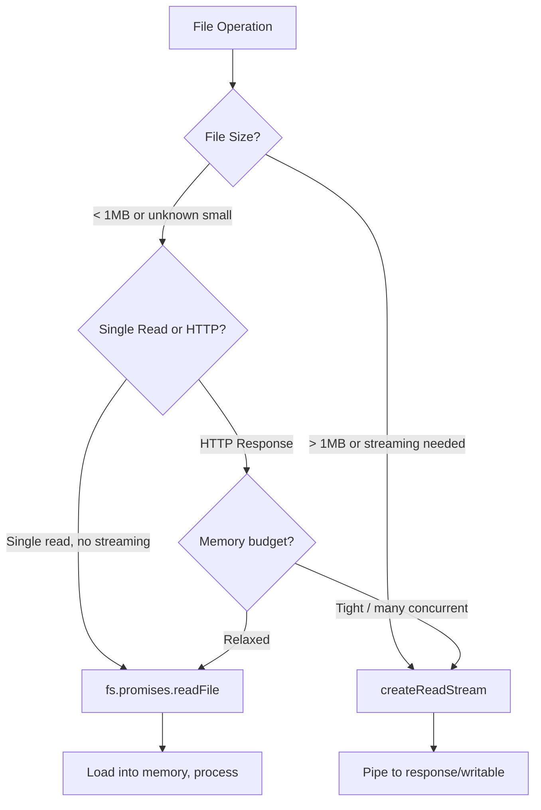
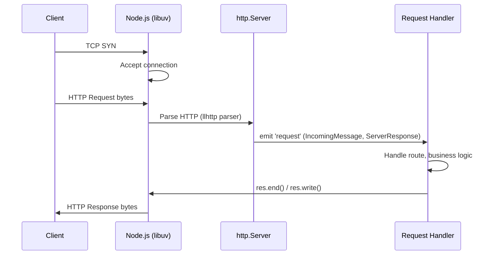
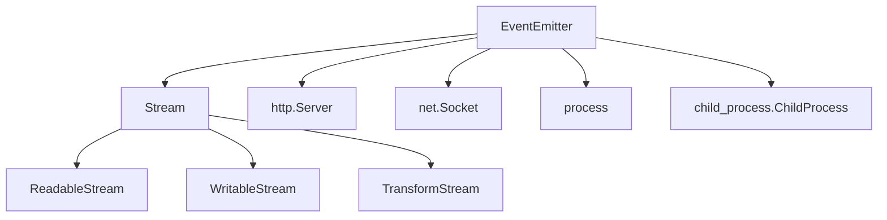
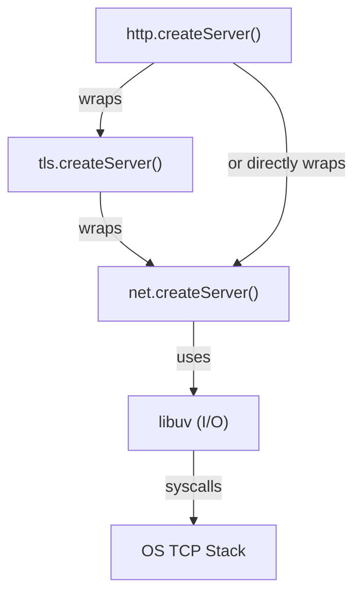

# Node.js Core Modules — Production Usage

> **Audience:** Experienced JS devs revising Node.js internals for production work or interviews. Every section assumes you know JS — we skip the basics and go straight to traps, trade-offs, and production patterns.

---

## Table of Contents

1. [fs Module — File System Mastery](#-fs-module--file-system-mastery)
2. [path Module — Platform-Independent Paths](#-path-module--platform-independent-paths)
3. [http/https Module — Server Internals](#-httphttps-module--server-internals)
4. [events Module — EventEmitter Deep Dive](#-events-module--eventemitter-deep-dive)
5. [crypto Module — Security Primitives](#-crypto-module--security-primitives)
6. [os Module — System Information](#-os-module--system-information)
7. [net Module — TCP Layer](#-net-module--tcp-layer)
8. [url Module — WHATWG Standard](#-url-module--whatwg-standard)
9. [zlib Module — Compression](#-zlib-module--compression)

---

## 🔥 fs Module — File System Mastery

### The API Landscape

Node.js `fs` gives you three API styles for every operation. In production, you almost never use the callback API directly.

| API Style | Example | When to Use |
|-----------|---------|-------------|
| Callback | `fs.readFile(path, cb)` | Legacy code only — avoid in new code |
| Sync | `fs.readFileSync(path)` | Startup config loading ONLY — blocks event loop |
| Promise | `fs.promises.readFile(path)` | **Default choice for all async work** |
| Stream | `fs.createReadStream(path)` | Large files, HTTP responses, piping |

```js
// WRONG: mixes callbacks and promises — a maintenance nightmare
fs.readFile('./config.json', (err, data) => {
  if (err) throw err;
  const config = JSON.parse(data);
  somePromiseCall(config).then(() => { ... });
});

// RIGHT: full async/await with fs.promises
import { promises as fsp } from 'fs';
import { join } from 'path';

async function loadConfig(configPath) {
  try {
    const raw = await fsp.readFile(configPath, 'utf8');
    return JSON.parse(raw);
  } catch (err) {
    if (err.code === 'ENOENT') {
      // File doesn't exist — return sane defaults instead of crashing
      return getDefaultConfig();
    }
    throw err; // Re-throw anything else (permissions, parse errors)
  }
}
```

### readFile vs createReadStream — The Real Decision

This is one of the most impactful decisions in a Node.js server's performance profile.



**`fs.promises.readFile` — when it's right:**
- Config files (loaded once at startup)
- Template files you need to process / modify before sending
- JSON files you parse
- Files small enough to fit comfortably in memory

**`createReadStream` — when it's right:**
- Serving static files over HTTP (video, large images, downloads)
- Processing log files line by line
- Piping file content into crypto streams, zlib streams, network sockets
- Anything where you don't need the whole file at once

```js
// Production file server — stream instead of buffer
import http from 'http';
import { createReadStream } from 'fs';
import { promises as fsp } from 'fs';
import { join, extname } from 'path';

const MIME_TYPES = {
  '.html': 'text/html',
  '.js':   'application/javascript',
  '.css':  'text/css',
  '.json': 'application/json',
  '.png':  'image/png',
  '.mp4':  'video/mp4',
};

http.createServer(async (req, res) => {
  const filePath = join('./public', req.url);
  
  try {
    const stat = await fsp.stat(filePath);
    const ext  = extname(filePath);
    const mime = MIME_TYPES[ext] ?? 'application/octet-stream';

    // Support Range requests for video seeking
    const range = req.headers.range;
    if (range) {
      const [start, end] = range.replace(/bytes=/, '').split('-').map(Number);
      const chunkEnd = end || Math.min(start + 1_000_000, stat.size - 1);
      res.writeHead(206, {
        'Content-Range':  `bytes ${start}-${chunkEnd}/${stat.size}`,
        'Accept-Ranges':  'bytes',
        'Content-Length': chunkEnd - start + 1,
        'Content-Type':   mime,
      });
      createReadStream(filePath, { start, end: chunkEnd }).pipe(res);
    } else {
      res.writeHead(200, {
        'Content-Length': stat.size,
        'Content-Type':   mime,
      });
      createReadStream(filePath).pipe(res);
    }
  } catch (err) {
    if (err.code === 'ENOENT') {
      res.writeHead(404); res.end('Not Found');
    } else {
      res.writeHead(500); res.end('Server Error');
    }
  }
}).listen(3000);
```

> **Here's the trap most devs fall into:** Using `readFile` to serve a 500MB video file. Every concurrent request allocates a 500MB buffer. 10 concurrent requests = 5GB memory. The server crashes. Use `createReadStream` + pipe. It never buffers more than the highWaterMark (default 64KB) at a time.

### writeFile vs createWriteStream

Same logic applies on the write side:

```js
// GOOD for small writes — atomic, simple
await fsp.writeFile('./output.json', JSON.stringify(data, null, 2), 'utf8');

// GOOD for large / incremental writes
import { createWriteStream } from 'fs';

async function writeLargeCSV(outputPath, rows) {
  const stream = createWriteStream(outputPath, { encoding: 'utf8' });
  
  return new Promise((resolve, reject) => {
    stream.on('error', reject);
    stream.on('finish', resolve);
    
    stream.write('id,name,email\n');
    for (const row of rows) {
      // write() returns false when internal buffer is full — respect backpressure!
      const canContinue = stream.write(`${row.id},${row.name},${row.email}\n`);
      if (!canContinue) {
        // In real code: pause source, wait for 'drain', then resume
      }
    }
    stream.end();
  });
}
```

> **Here's the trap most devs fall into:** Ignoring backpressure. When `writable.write()` returns `false`, the internal buffer is full. Keep writing and you'll accumulate data in memory until it crashes. Always listen for `'drain'` or use `pipeline()` which handles this automatically.

```js
// pipeline() handles backpressure automatically — prefer this
import { pipeline } from 'stream/promises';
import { createReadStream, createWriteStream } from 'fs';
import { createGzip } from 'zlib';

await pipeline(
  createReadStream('./access.log'),
  createGzip(),
  createWriteStream('./access.log.gz')
);
// Handles backpressure, errors, cleanup automatically
```

### fs.watch — File Watching in Production

```js
import { watch } from 'fs';

// BASIC: works but has quirks
const watcher = watch('./config', { recursive: true }, (eventType, filename) => {
  console.log(`${eventType}: ${filename}`);
});

// Clean up on process exit
process.on('SIGINT', () => { watcher.close(); process.exit(0); });
```

**fs.watch gotchas in production:**
- On macOS, `rename` events fire for both the rename source AND destination (two events for one rename)
- On Linux, large directory trees with `recursive: true` can hit inotify limits
- Events are NOT guaranteed to fire once per change — some editors (vim, Emacs) do atomic saves by writing to a temp file and renaming, which fires `rename` not `change`
- For production file watching, use **chokidar** which wraps `fs.watch` with debouncing, deduplication, and cross-platform normalization

### __dirname vs import.meta.url (ESM)

This trips up developers migrating from CJS to ESM:

```js
// CommonJS — __dirname works natively
const configPath = path.join(__dirname, 'config', 'app.json');

// ESM — __dirname does NOT exist
// WRONG:
const configPath = path.join(__dirname, 'config', 'app.json'); // ReferenceError

// RIGHT for ESM:
import { fileURLToPath } from 'url';
import { dirname, join } from 'path';

const __filename = fileURLToPath(import.meta.url);
const __dirname  = dirname(__filename);

const configPath = join(__dirname, 'config', 'app.json');
```

### Directory Traversal — Recursive Operations

```js
import { promises as fsp } from 'fs';
import { join, extname } from 'path';

// Production recursive directory scanner — async generator pattern
async function* walkDir(dir) {
  const entries = await fsp.readdir(dir, { withFileTypes: true });
  for (const entry of entries) {
    const fullPath = join(dir, entry.name);
    if (entry.isDirectory()) {
      yield* walkDir(fullPath); // recurse
    } else {
      yield fullPath;
    }
  }
}

// Usage: collect all .ts files in a project
async function findTypeScriptFiles(root) {
  const files = [];
  for await (const file of walkDir(root)) {
    if (extname(file) === '.ts') files.push(file);
  }
  return files;
}
```

### Log File Rotation — Production Pattern

```js
import { createWriteStream } from 'fs';
import { promises as fsp } from 'fs';

class RotatingLogger {
  constructor(basePath, maxBytes = 10 * 1024 * 1024) { // 10MB
    this.basePath  = basePath;
    this.maxBytes  = maxBytes;
    this.bytesWritten = 0;
    this.stream    = null;
    this.index     = 0;
  }

  async open() {
    this.stream = createWriteStream(this.currentPath(), { flags: 'a' });
    try {
      const stat = await fsp.stat(this.currentPath());
      this.bytesWritten = stat.size;
    } catch { this.bytesWritten = 0; }
  }

  currentPath() { return `${this.basePath}.${this.index}`; }

  async write(line) {
    const data = line + '\n';
    const bytes = Buffer.byteLength(data);
    if (this.bytesWritten + bytes > this.maxBytes) await this.rotate();
    this.stream.write(data);
    this.bytesWritten += bytes;
  }

  async rotate() {
    await new Promise(r => this.stream.end(r));
    this.index++;
    this.bytesWritten = 0;
    this.stream = createWriteStream(this.currentPath(), { flags: 'a' });
  }
}
```

---

## 🗂️ path Module — Platform-Independent Paths

### The Core Functions and When They Differ

| Function | Input | Output | Key Behaviour |
|----------|-------|--------|---------------|
| `path.join(...parts)` | `'foo', '../bar', 'baz.js'` | `bar/baz.js` | Normalises separators, resolves `..` segments |
| `path.resolve(...parts)` | `'foo', 'bar'` | `/cwd/foo/bar` | Always returns absolute path — uses CWD if no absolute segment found |
| `path.relative(from, to)` | `'/a/b'`, `'/a/c/d'` | `'../c/d'` | Relative path from `from` to `to` |
| `path.extname(p)` | `'index.min.js'` | `'.js'` | Last extension only |
| `path.basename(p, ext)` | `'/a/b/foo.js'`, `'.js'` | `'foo'` | Filename with optional ext stripping |
| `path.dirname(p)` | `'/a/b/foo.js'` | `'/a/b'` | Parent directory |
| `path.parse(p)` | `'/a/b/foo.js'` | `{root, dir, base, ext, name}` | Decompose path into parts |

> **Here's the trap most devs fall into:** Confusing `path.join` and `path.resolve`.

```js
import { join, resolve } from 'path';

// join just concatenates and normalises — relative input stays relative
join('foo', 'bar');           // 'foo/bar' (or 'foo\bar' on Windows)
join('/foo', 'bar', '../baz'); // '/foo/baz'

// resolve builds an absolute path — processes segments RIGHT to LEFT
// stops when it hits an absolute segment
resolve('foo', 'bar');        // '/cwd/foo/bar'  — cwd is prefixed
resolve('/foo', 'bar');       // '/foo/bar'       — /foo is absolute, stops there
resolve('/foo', '/bar');      // '/bar'           — /bar overrides everything before it

// GOTCHA: user-supplied path as last arg to resolve can be a path traversal attack
const userInput = '../../etc/passwd';
const safe   = join('/public', userInput);   // '/public/../../etc/passwd' — NOT safe (still has ..)
const normalised = resolve('/public', userInput); // '/etc/passwd' — DANGEROUS if you trust this
// Always validate that resolved path starts with expected root:
if (!resolvedPath.startsWith(expectedRoot)) throw new Error('Path traversal detected');
```

### Cross-Platform — The Windows Problem

```js
import path from 'path';
import { posix, win32 } from 'path';

// On Windows: path.sep is '\', path.delimiter is ';'
// On POSIX:   path.sep is '/', path.delimiter is ':'

// WRONG: hard-coded separators
const p = 'public' + '/' + 'assets'; // breaks on Windows

// RIGHT: always use path.join
const p = path.join('public', 'assets'); // correct on any platform

// When working with URLs (always forward slashes), use path.posix explicitly
const urlPath = posix.join('/', 'api', 'v1', 'users'); // '/api/v1/users' always

// Converting Windows paths for URLs
const winPath = 'C:\\Users\\foo\\project\\index.js';
const urlReady = winPath.split(win32.sep).join(posix.sep); // 'C:/Users/foo/project/index.js'
```

### path.parse — Decomposing for Transformations

```js
import { parse, format } from 'path';

// Common production task: change file extension
function changeExtension(filePath, newExt) {
  const parsed = parse(filePath);
  parsed.ext  = newExt;
  parsed.base = parsed.name + newExt; // format() uses base over name+ext if both present
  return format(parsed);
}

changeExtension('/dist/bundle.js', '.min.js'); // '/dist/bundle.min.js'

// Another pattern: find all files relative to a base for URL generation
import { relative, posix } from 'path';

function fileToUrl(filePath, rootDir) {
  const rel = relative(rootDir, filePath);
  // Normalise to forward slashes for URL
  return '/' + rel.split('\\').join('/');
}
```

---

## 🌐 http/https Module — Server Internals

### Anatomy of http.createServer



```js
import http from 'http';

const server = http.createServer((req, res) => {
  // req: http.IncomingMessage  — readable stream
  // res: http.ServerResponse   — writable stream

  // IncomingMessage key properties:
  // req.method   — 'GET', 'POST', etc.
  // req.url      — raw URL string (unparsed, e.g. '/api/users?page=1')
  // req.headers  — all lowercased: req.headers['content-type']
  // req.socket   — underlying net.Socket (for IP: req.socket.remoteAddress)
});

server.listen(3000, '0.0.0.0', () => {
  console.log('Listening on :3000');
});

// Handle server-level errors (e.g., EADDRINUSE)
server.on('error', (err) => {
  if (err.code === 'EADDRINUSE') {
    console.error('Port 3000 is already in use');
    process.exit(1);
  }
  throw err;
});

// Graceful shutdown — stop accepting new connections, drain existing
process.on('SIGTERM', () => {
  server.close(() => {
    console.log('Server closed gracefully');
    process.exit(0);
  });
});
```

### Reading Request Bodies — The Streaming Reality

HTTP request body is a stream. You have to collect it. Every framework does this for you, but knowing the internals matters.

```js
// Production body reader with size limit (protect against memory bombs)
function readBody(req, maxBytes = 1024 * 1024) { // 1MB default
  return new Promise((resolve, reject) => {
    const chunks = [];
    let totalBytes = 0;

    req.on('data', (chunk) => {
      totalBytes += chunk.length;
      if (totalBytes > maxBytes) {
        req.destroy();
        reject(Object.assign(new Error('Request body too large'), { code: 'PAYLOAD_TOO_LARGE' }));
        return;
      }
      chunks.push(chunk);
    });

    req.on('end', () => resolve(Buffer.concat(chunks)));
    req.on('error', reject);
  });
}

// JSON endpoint
async function handlePost(req, res) {
  try {
    const raw  = await readBody(req);
    const body = JSON.parse(raw.toString('utf8'));
    // process body...
    res.writeHead(200, { 'Content-Type': 'application/json' });
    res.end(JSON.stringify({ ok: true }));
  } catch (err) {
    if (err.code === 'PAYLOAD_TOO_LARGE') {
      res.writeHead(413); res.end('Payload Too Large');
    } else if (err instanceof SyntaxError) {
      res.writeHead(400); res.end('Invalid JSON');
    } else {
      res.writeHead(500); res.end('Internal Error');
    }
  }
}
```

### Streaming Responses — Server-Sent Events

```js
// Server-Sent Events — long-lived streaming response
function handleSSE(req, res) {
  res.writeHead(200, {
    'Content-Type':  'text/event-stream',
    'Cache-Control': 'no-cache',
    'Connection':    'keep-alive',
    // Required for proxied environments (nginx buffers SSE otherwise)
    'X-Accel-Buffering': 'no',
  });

  // Send initial comment to establish connection
  res.write(': connected\n\n');

  const interval = setInterval(() => {
    const data = JSON.stringify({ ts: Date.now(), value: Math.random() });
    res.write(`data: ${data}\n\n`);
  }, 1000);

  // Clean up when client disconnects
  req.on('close', () => {
    clearInterval(interval);
  });
}
```

### http.request — Internals (Not for Production Use Directly)

> **Interview answer:** Frameworks like `axios` and native `fetch` are built on top of `http.request`. Knowing the internals explains why streaming bodies matters, why timeout configuration is subtle, and what happens at the TCP level.

```js
import https from 'https';

// Raw http.request — educational, not production
function makeRequest(options, body) {
  return new Promise((resolve, reject) => {
    const req = https.request(options, (res) => {
      const chunks = [];
      res.on('data', chunk => chunks.push(chunk));
      res.on('end', () => resolve({
        status: res.statusCode,
        headers: res.headers,
        body: Buffer.concat(chunks).toString('utf8'),
      }));
    });

    req.on('error', reject);
    
    // GOTCHA: timeout must be set on the socket, not as a timer
    req.setTimeout(5000, () => {
      req.destroy(new Error('Request timed out'));
    });

    if (body) req.write(body);
    req.end();
  });
}
```

**In production: use `fetch` (Node 18+) or `axios`.** The raw `http.request` is useful to understand but has too many footguns for application code.

---

## ⚡ events Module — EventEmitter Deep Dive

### EventEmitter is the Backbone of Node.js

Everything in Node.js that does I/O — streams, HTTP servers, TCP sockets — extends `EventEmitter`. Understanding it deeply means understanding Node.js.



### Core API — What Actually Matters

```js
import { EventEmitter } from 'events';

const emitter = new EventEmitter();

// on: persistent listener (stays until removed)
emitter.on('data', (payload) => { console.log('got data:', payload); });

// once: single-fire listener (auto-removed after first emit)
emitter.once('connected', () => { console.log('connected once'); });

// off / removeListener: same function reference required
const handler = (msg) => console.log(msg);
emitter.on('message', handler);
emitter.off('message', handler);  // handler reference must match

// emit: synchronous! Listeners run before emit() returns
emitter.emit('data', { id: 1 });

// removeAllListeners — useful in tests and cleanup
emitter.removeAllListeners('data');
emitter.removeAllListeners(); // removes everything
```

> **Here's the trap most devs fall into:** `emit()` is **synchronous**. Every listener runs to completion before the `emit()` call returns. If a listener throws, the error propagates to the caller of `emit()` — not caught asynchronously. This surprises developers who assume events are "fire and forget".

```js
emitter.on('data', () => { throw new Error('sync throw!'); });
try {
  emitter.emit('data'); // error thrown HERE, caught HERE
} catch (err) {
  console.log('Caught synchronously:', err.message);
}
```

### The Error Event — CRITICAL

The `'error'` event is special. If you emit `'error'` and there are no listeners, **Node.js throws an uncaught exception and crashes the process**.

```js
// WRONG — will crash if no error listener is attached
const stream = createReadStream('/nonexistent');
stream.pipe(res); // what if the file doesn't exist?

// RIGHT — always handle errors on EventEmitters
const stream = createReadStream('/nonexistent');
stream.on('error', (err) => {
  res.writeHead(500);
  res.end('File not available');
});
stream.pipe(res);

// Even better: use pipeline() from stream/promises which handles errors properly
import { pipeline } from 'stream/promises';
await pipeline(createReadStream(path), res).catch(err => {
  // stream errors caught here
});
```

### Extending EventEmitter — Production Pattern

```js
import { EventEmitter } from 'events';

class DatabasePool extends EventEmitter {
  #connections = [];
  #maxSize;
  #waiting = [];

  constructor(maxSize = 10) {
    super();
    this.#maxSize = maxSize;
    // Set max listeners higher if you expect many consumers
    this.setMaxListeners(50);
  }

  async acquire() {
    if (this.#connections.length < this.#maxSize) {
      const conn = await this.#createConnection();
      this.#connections.push(conn);
      this.emit('acquire', conn);
      return conn;
    }
    // Pool exhausted — wait for a release
    return new Promise((resolve, reject) => {
      const timeout = setTimeout(() => {
        const idx = this.#waiting.indexOf(resolve);
        if (idx !== -1) this.#waiting.splice(idx, 1);
        reject(new Error('Connection pool timeout'));
      }, 5000);

      this.#waiting.push((conn) => {
        clearTimeout(timeout);
        resolve(conn);
      });
    });
  }

  release(conn) {
    const waiter = this.#waiting.shift();
    if (waiter) {
      waiter(conn); // hand off directly to next waiter
    } else {
      this.emit('release', conn);
    }
  }

  #createConnection() {
    // Returns promise that resolves to a DB connection
    return Promise.resolve({ id: Math.random(), query: async () => {} });
  }
}
```

### Memory Leak Warning — The 11+ Listeners Problem

```js
// Node.js warns when >10 listeners on a single event type
// This warning is VALUABLE — it catches listener leaks

emitter.setMaxListeners(0);   // disable warning (dangerous — hides leaks)
emitter.setMaxListeners(20);  // raise limit when you legitimately need more
emitter.getMaxListeners();    // check current limit

// Common leak pattern — adding listeners inside request handlers
http.createServer((req, res) => {
  // WRONG: adds a new listener on every request
  process.on('SIGTERM', cleanup); // leaks listeners!
  
  // RIGHT: add listeners once at startup, not per request
}).listen(3000);
```

### EventEmitter vs RxJS Observable

| Feature | EventEmitter | RxJS Observable |
|---------|-------------|-----------------|
| Push model | Yes | Yes |
| Pull / lazy | No | Yes (cold observables) |
| Backpressure | No | Yes (via operators) |
| Error propagation | Manual (error event) | Built-in, typed |
| Completion signal | No | Yes (`complete()`) |
| Operators | None | 100+ (map, filter, debounce…) |
| Async coordination | Complex (manual) | Built-in (combineLatest, merge…) |
| Bundle size | 0KB (core) | ~50KB |
| When to use | Node.js I/O, simple events | Complex async streams, UI events |

**Interview answer:** Use EventEmitter when you're working with Node.js built-ins and simple event broadcasting. Use RxJS when you need composable async logic, complex timing (debounce, throttle, switchMap), or need a completion/error protocol built into the observable contract.

---

## 🔐 crypto Module — Security Primitives

### randomBytes — The Only Secure Random in Node.js

```js
import { randomBytes, randomUUID } from 'crypto';

// Secure token generation — for session IDs, API keys, reset tokens
function generateToken(bytes = 32) {
  return randomBytes(bytes).toString('hex'); // 64 char hex string
}

// URL-safe base64 variant (no +, /, = characters)
function generateUrlSafeToken(bytes = 32) {
  return randomBytes(bytes)
    .toString('base64')
    .replace(/\+/g, '-')
    .replace(/\//g, '_')
    .replace(/=/g, '');
}

// UUID v4 — built-in since Node 14.17
const id = randomUUID(); // '9b1deb4d-3b7d-4bad-9bdd-2b0d7b3dcb6d'
```

> **Here's the trap most devs fall into:** Using `Math.random()` for security tokens. `Math.random()` is not cryptographically secure — it's seeded and predictable. An attacker who observes some outputs can predict future ones. ALWAYS use `crypto.randomBytes()` for anything security-related.

### createHash — Checksums and Fingerprints (NOT Passwords)

```js
import { createHash } from 'crypto';

// File integrity check
function hashFile(buffer) {
  return createHash('sha256').update(buffer).digest('hex');
}

// Idempotency key from request body
function requestFingerprint(method, url, body) {
  return createHash('sha256')
    .update(method)
    .update(url)
    .update(JSON.stringify(body))
    .digest('base64');
}

// Content-based cache key for ETags
function etag(content) {
  return `"${createHash('sha1').update(content).digest('hex')}"`;
}
```

> **Here's the trap most devs fall into:** Hashing passwords with SHA-256 or MD5. These are FAST hashes — designed for checksums, not passwords. A modern GPU can compute billions of SHA-256 hashes per second, making brute-force trivial. Use `bcrypt`, `argon2`, or Node's built-in `scrypt` for passwords.

### createHmac — Webhook Signature Verification

This is one of the most common production uses of the crypto module.

```js
import { createHmac, timingSafeEqual } from 'crypto';

// Verify incoming webhook from Stripe/GitHub/etc.
function verifyWebhookSignature(payload, signature, secret) {
  const expected = createHmac('sha256', secret)
    .update(payload) // payload must be raw Buffer, not parsed JSON
    .digest('hex');

  // CRITICAL: use timingSafeEqual to prevent timing attacks
  // Regular === leaks information about where strings diverge
  const expectedBuf = Buffer.from(`sha256=${expected}`, 'utf8');
  const receivedBuf = Buffer.from(signature, 'utf8');

  if (expectedBuf.length !== receivedBuf.length) return false;
  return timingSafeEqual(expectedBuf, receivedBuf);
}

// Express middleware version
function webhookMiddleware(secret) {
  return (req, res, next) => {
    const sig    = req.headers['x-hub-signature-256'];
    const raw    = req.rawBody; // must preserve raw body (use express.raw())
    
    if (!verifyWebhookSignature(raw, sig, secret)) {
      return res.status(401).json({ error: 'Invalid signature' });
    }
    next();
  };
}
```

### scrypt / pbkdf2 — Password Hashing (When You Can't Use bcrypt)

```js
import { scrypt, randomBytes } from 'crypto';
import { promisify } from 'util';

const scryptAsync = promisify(scrypt);

async function hashPassword(password) {
  const salt = randomBytes(32).toString('hex');
  const hash = await scryptAsync(password, salt, 64);
  return `${salt}:${hash.toString('hex')}`;
}

async function verifyPassword(password, stored) {
  const [salt, hashHex] = stored.split(':');
  const hash     = Buffer.from(hashHex, 'hex');
  const derived  = await scryptAsync(password, salt, 64);
  return timingSafeEqual(hash, derived);
}
```

**In production: use `bcrypt` or `argon2` packages.** They're battle-tested, have tunable cost factors, and are designed specifically for password hashing.

### AES-256-GCM — Encryption at Rest

```js
import { createCipheriv, createDecipheriv, randomBytes } from 'crypto';

const ALGORITHM = 'aes-256-gcm';
const KEY_LEN   = 32; // 256 bits
const IV_LEN    = 12; // 96 bits (GCM standard)

function encrypt(plaintext, key) {
  const iv         = randomBytes(IV_LEN);
  const cipher     = createCipheriv(ALGORITHM, key, iv);
  const encrypted  = Buffer.concat([
    cipher.update(plaintext, 'utf8'),
    cipher.final(),
  ]);
  const authTag = cipher.getAuthTag(); // GCM authentication tag

  // Store iv + authTag + ciphertext together
  return Buffer.concat([iv, authTag, encrypted]).toString('base64');
}

function decrypt(ciphertext, key) {
  const data      = Buffer.from(ciphertext, 'base64');
  const iv        = data.subarray(0, IV_LEN);
  const authTag   = data.subarray(IV_LEN, IV_LEN + 16);
  const encrypted = data.subarray(IV_LEN + 16);

  const decipher = createDecipheriv(ALGORITHM, key, iv);
  decipher.setAuthTag(authTag); // MUST set before final()

  return Buffer.concat([
    decipher.update(encrypted),
    decipher.final(), // throws if authentication fails — detects tampering
  ]).toString('utf8');
}
```

> **Here's the trap most devs fall into:** Using AES-CBC instead of AES-GCM. CBC doesn't include authentication — an attacker can flip bits in the ciphertext and you won't know. GCM provides both confidentiality AND integrity (authenticated encryption). Always use GCM.

---

## 💻 os Module — System Information

### Production Uses of the os Module

```js
import os from 'os';

// Number of logical CPU cores — used for clustering
const cpuCount = os.cpus().length;
// os.cpus() returns array of {model, speed(MHz), times{user,nice,sys,idle,irq}}

// Memory monitoring
const totalMem = os.totalmem();  // bytes
const freeMem  = os.freemem();   // bytes
const usedMem  = totalMem - freeMem;
const memUsagePct = ((usedMem / totalMem) * 100).toFixed(1);

// Platform detection
os.platform(); // 'linux', 'darwin', 'win32'
os.arch();     // 'x64', 'arm64'
os.release();  // kernel version string
os.hostname(); // machine hostname — useful for distributed tracing

// Temp directory — platform-appropriate
os.tmpdir(); // '/tmp' on Linux, 'C:\Users\foo\AppData\Local\Temp' on Windows

// Network interfaces — finding the machine's IP
function getLocalIp() {
  const interfaces = os.networkInterfaces();
  for (const name of Object.keys(interfaces)) {
    for (const iface of interfaces[name]) {
      // Skip internal (loopback) and IPv6
      if (iface.family === 'IPv4' && !iface.internal) {
        return iface.address;
      }
    }
  }
  return '127.0.0.1';
}
```

### Cluster Module Integration — Using cpuCount

```js
import cluster from 'cluster';
import os from 'os';
import http from 'http';

if (cluster.isPrimary) {
  const numWorkers = os.cpus().length;
  console.log(`Primary ${process.pid}: forking ${numWorkers} workers`);

  for (let i = 0; i < numWorkers; i++) {
    cluster.fork();
  }

  cluster.on('exit', (worker, code, signal) => {
    console.log(`Worker ${worker.process.pid} died (${signal || code}). Restarting...`);
    cluster.fork(); // auto-restart
  });
} else {
  // Worker process — each runs an independent HTTP server
  // OS load-balances incoming connections across workers
  http.createServer((req, res) => {
    res.end(`Handled by worker ${process.pid}`);
  }).listen(3000);
}
```

**When to use / When NOT to use clustering:**
- **Use:** CPU-bound request handling, maximising single-machine throughput
- **Don't use:** If your app has significant shared in-process state (caches, queues) — each worker has its own memory. Use Redis for shared state.
- **Modern alternative:** `worker_threads` for CPU-bound tasks within a single process, `pm2 cluster mode` for production process management.

---

## 🔌 net Module — TCP Layer

### Understanding What's Below HTTP



### TCP Server — Custom Protocol

```js
import net from 'net';

// Simple Redis-like custom protocol server
const server = net.createServer({ allowHalfOpen: false }, (socket) => {
  // socket is a net.Socket — duplex stream
  console.log(`Client: ${socket.remoteAddress}:${socket.remotePort}`);

  socket.setEncoding('utf8');
  socket.setKeepAlive(true, 60_000); // send TCP keepalive every 60s

  let buffer = '';

  socket.on('data', (data) => {
    buffer += data;
    // Simple line-based protocol
    const lines = buffer.split('\n');
    buffer = lines.pop(); // save incomplete last line

    for (const line of lines) {
      const response = processCommand(line.trim());
      socket.write(response + '\n');
    }
  });

  socket.on('end', () => {
    socket.end(); // half-close: send FIN to client
  });

  socket.on('error', (err) => {
    if (err.code !== 'ECONNRESET') {
      console.error('Socket error:', err.message);
    }
    // Socket is destroyed automatically after error
  });
});

server.listen(6379, () => console.log('TCP server on :6379'));

function processCommand(line) {
  if (line === 'PING') return 'PONG';
  if (line.startsWith('ECHO ')) return line.slice(5);
  return 'ERR unknown command';
}
```

> **Here's the trap most devs fall into:** Not handling `ECONNRESET`. When a client abruptly disconnects (app crash, network drop), the socket emits `error` with `ECONNRESET`. Since `error` without a listener crashes the process, always handle socket errors even if just to ignore `ECONNRESET`.

### TCP Client

```js
import net from 'net';

const client = net.createConnection({ host: 'localhost', port: 6379 }, () => {
  console.log('Connected to server');
  client.write('PING\n');
});

client.on('data', (data) => {
  console.log('Response:', data.toString().trim());
  client.end();
});

client.on('error', (err) => {
  console.error('Connection error:', err.message);
});
```

---

## 🔗 url Module — WHATWG Standard

### URL Class vs Legacy querystring

| Feature | `URL` (WHATWG) | `querystring` (legacy) |
|---------|---------------|----------------------|
| Standard | Browser-compatible WHATWG | Node.js only, deprecated |
| Parsing | Full URL parsing | Query strings only |
| Unicode | Handled (percent-encoding) | Manual |
| `URLSearchParams` | Built-in | N/A |
| Relative URLs | Supported (with base) | N/A |
| Status | **Use this** | Avoid in new code |

```js
import { URL, URLSearchParams } from 'url'; // or just use global URL in Node 10+

// Full URL parsing
const url = new URL('https://api.example.com:8080/v1/users?page=2&limit=10#section');
url.protocol;  // 'https:'
url.hostname;  // 'api.example.com'
url.port;      // '8080'
url.pathname;  // '/v1/users'
url.search;    // '?page=2&limit=10'
url.hash;      // '#section'
url.href;      // full URL string

// Mutate and re-serialize
url.searchParams.set('limit', '25');
url.href; // 'https://api.example.com:8080/v1/users?page=2&limit=25#section'

// Resolve relative URL against base (equivalent to browser behavior)
const base   = new URL('https://api.example.com/v1/');
const target = new URL('../v2/users', base);
target.href; // 'https://api.example.com/v2/users'
```

### URLSearchParams — Building Query Strings

```js
// Building query strings for outgoing requests
function buildApiUrl(base, params) {
  const url = new URL(base);
  for (const [key, value] of Object.entries(params)) {
    if (value != null) { // skip null/undefined
      url.searchParams.set(key, value);
    }
  }
  return url.href;
}

buildApiUrl('https://api.example.com/search', {
  q: 'hello world', // auto-encoded: q=hello+world
  page: 1,
  limit: null,      // skipped
});
// 'https://api.example.com/search?q=hello+world&page=1'

// Parsing incoming query strings
function parseQuery(queryString) {
  const params = new URLSearchParams(queryString);
  return Object.fromEntries(params.entries());
}

parseQuery('?foo=bar&ids=1&ids=2'); // { foo: 'bar', ids: '2' }  ← GOTCHA: getAll('ids') gives ['1','2']
// Use params.getAll('ids') for multi-value params
```

> **Here's the trap most devs fall into:** Using `Object.fromEntries(params.entries())` when query params have multiple values for the same key. `entries()` only returns the last value for duplicates. Use `params.getAll(key)` to get an array of all values for repeated keys.

---

## 📦 zlib Module — Compression

### HTTP Response Compression

```js
import http from 'http';
import { createGzip, createDeflate, createBrotliCompress } from 'zlib';
import { pipeline } from 'stream/promises';
import { createReadStream } from 'fs';

http.createServer(async (req, res) => {
  const acceptEncoding = req.headers['accept-encoding'] ?? '';

  // Priority: br > gzip > deflate > none
  let compressStream;
  let encoding;

  if (acceptEncoding.includes('br')) {
    compressStream = createBrotliCompress();
    encoding = 'br';
  } else if (acceptEncoding.includes('gzip')) {
    compressStream = createGzip({ level: 6 }); // level 1-9, 6 is a good balance
    encoding = 'gzip';
  } else if (acceptEncoding.includes('deflate')) {
    compressStream = createDeflate();
    encoding = 'deflate';
  }

  res.writeHead(200, {
    'Content-Type': 'application/json',
    ...(encoding && { 'Content-Encoding': encoding }),
    'Vary': 'Accept-Encoding', // CRITICAL: tells CDNs to cache separately per encoding
  });

  const dataStream = createReadStream('./large-data.json');

  if (compressStream) {
    await pipeline(dataStream, compressStream, res);
  } else {
    await pipeline(dataStream, res);
  }
}).listen(3000);
```

### Compressing Files — Log Archival

```js
import { createGzip, createGunzip, constants as zlibConstants } from 'zlib';
import { pipeline } from 'stream/promises';
import { createReadStream, createWriteStream } from 'fs';

// Compress a log file after rotation
async function compressLog(inputPath) {
  const outputPath = inputPath + '.gz';
  await pipeline(
    createReadStream(inputPath),
    createGzip({
      level: zlibConstants.Z_BEST_COMPRESSION, // 9 — max compression, slower
      // For time-sensitive pipelines use Z_BEST_SPEED (1)
    }),
    createWriteStream(outputPath)
  );
  return outputPath;
}

// Decompress
async function decompressLog(inputPath) {
  const outputPath = inputPath.replace(/\.gz$/, '');
  await pipeline(
    createReadStream(inputPath),
    createGunzip(),
    createWriteStream(outputPath)
  );
  return outputPath;
}
```

### In-Memory Compression — API Responses

```js
import { gzip, gunzip } from 'zlib';
import { promisify } from 'util';

const gzipAsync   = promisify(gzip);
const gunzipAsync = promisify(gunzip);

// Cache compressed API responses in Redis
async function cacheCompressedResponse(redisClient, key, data) {
  const json       = JSON.stringify(data);
  const compressed = await gzipAsync(Buffer.from(json, 'utf8'));
  await redisClient.setex(key, 300, compressed.toString('binary'));
}

async function getCachedResponse(redisClient, key) {
  const raw = await redisClient.get(key);
  if (!raw) return null;
  const decompressed = await gunzipAsync(Buffer.from(raw, 'binary'));
  return JSON.parse(decompressed.toString('utf8'));
}
```

**Compression ratio context:**
- JSON API responses: ~70-80% reduction with gzip
- Already-compressed files (JPEG, MP4, ZIP): almost zero reduction — don't bother compressing these
- Brotli typically achieves 15-20% better compression than gzip at comparable speeds

### When to Use / When NOT to Use zlib

| Use | Don't Use |
|-----|-----------|
| Compressing JSON API responses | Compressing already-compressed formats (JPEG, PNG, MP4, ZIP) |
| Log file archival | Small responses < 1KB (compression overhead > savings) |
| Reducing bandwidth to CDN origin | Real-time low-latency streams (adds latency) |
| Static asset compression (pre-compress at build time) | When CPU is the bottleneck (zlib is CPU-intensive) |

---

## 🏭 Production Patterns — Putting It All Together

### Secure File Upload Streaming

```js
import http from 'http';
import { createWriteStream } from 'fs';
import { createHash } from 'crypto';
import { pipeline } from 'stream/promises';
import { join } from 'path';
import { randomUUID } from 'crypto';

const UPLOAD_DIR = '/var/uploads';
const MAX_FILE_SIZE = 100 * 1024 * 1024; // 100MB

async function handleUpload(req, res) {
  const fileId   = randomUUID();
  const destPath = join(UPLOAD_DIR, fileId);
  const hasher   = createHash('sha256');
  let bytesReceived = 0;

  // Transform stream to track bytes and hash simultaneously
  const { Transform } = await import('stream');
  const tracker = new Transform({
    transform(chunk, enc, cb) {
      bytesReceived += chunk.length;
      if (bytesReceived > MAX_FILE_SIZE) {
        return cb(new Error('File too large'));
      }
      hasher.update(chunk);
      cb(null, chunk);
    }
  });

  try {
    await pipeline(req, tracker, createWriteStream(destPath));
    const checksum = hasher.digest('hex');

    res.writeHead(201, { 'Content-Type': 'application/json' });
    res.end(JSON.stringify({ fileId, checksum, size: bytesReceived }));
  } catch (err) {
    // Clean up partial file
    await import('fs').then(fs => fs.promises.unlink(destPath).catch(() => {}));
    
    if (err.message === 'File too large') {
      res.writeHead(413); res.end('File too large');
    } else {
      res.writeHead(500); res.end('Upload failed');
    }
  }
}
```

### Health Check Endpoint — os + process

```js
import os from 'os';
import { EventEmitter } from 'events';

function createHealthCheck(db, cache) {
  return async (req, res) => {
    const startTime = Date.now();

    const [dbOk, cacheOk] = await Promise.allSettled([
      db.ping().then(() => true).catch(() => false),
      cache.ping().then(() => true).catch(() => false),
    ]);

    const health = {
      status: 'ok',
      timestamp: new Date().toISOString(),
      uptime: process.uptime(),
      pid: process.pid,
      hostname: os.hostname(),
      memory: {
        process: process.memoryUsage(),
        system: {
          total: os.totalmem(),
          free: os.freemem(),
          usedPct: (((os.totalmem() - os.freemem()) / os.totalmem()) * 100).toFixed(1),
        }
      },
      cpu: { count: os.cpus().length, loadAvg: os.loadavg() },
      dependencies: {
        database: dbOk.value,
        cache: cacheOk.value,
      },
      responseTime: Date.now() - startTime,
    };

    const isHealthy = dbOk.value && cacheOk.value;
    health.status = isHealthy ? 'ok' : 'degraded';

    res.writeHead(isHealthy ? 200 : 503, { 'Content-Type': 'application/json' });
    res.end(JSON.stringify(health, null, 2));
  };
}
```

---

## 🎯 Interview-Ready Quick Reference

### Critical Distinctions

| Question | Answer |
|----------|--------|
| `readFile` vs `createReadStream`? | Buffer all vs stream chunks — use stream for >1MB or HTTP responses |
| `path.join` vs `path.resolve`? | join normalises, stays relative; resolve always returns absolute |
| `__dirname` in ESM? | Doesn't exist — use `fileURLToPath(import.meta.url)` + `dirname()` |
| Why is EventEmitter `emit()` synchronous? | Design choice — ensures predictable execution order; async would require callbacks or promises |
| `error` event with no listener? | Process crashes — uncaughtException. Always handle `error` on EventEmitters |
| `Math.random()` for tokens? | Never — not cryptographically secure; use `crypto.randomBytes()` |
| SHA-256 for passwords? | Never — too fast; use bcrypt/argon2/scrypt |
| AES-CBC vs AES-GCM? | Always GCM — provides authentication (detects tampering); CBC doesn't |
| `timingSafeEqual` vs `===`? | Use `timingSafeEqual` for secrets — prevents timing attacks that leak info via comparison time |
| When to avoid zlib? | Already-compressed formats, very small payloads, latency-sensitive paths |

### Error Code Cheat Sheet

```
ENOENT    — file/dir not found
EACCES    — permission denied
EEXIST    — file already exists (O_EXCL flag)
EISDIR    — expected file but got directory
ENOTDIR   — expected directory but got file
ENOTEMPTY — rmdir on non-empty directory
EADDRINUSE— port already bound (http.listen)
ECONNRESET— remote end abruptly closed connection
EPIPE     — writing to closed stream (client disconnected mid-response)
EMFILE    — too many open file descriptors (increase ulimit)
```

---

*These notes cover the core Node.js modules you will encounter in every production codebase. The internals understanding here directly transfers to debugging, performance tuning, and building reliable systems.*
