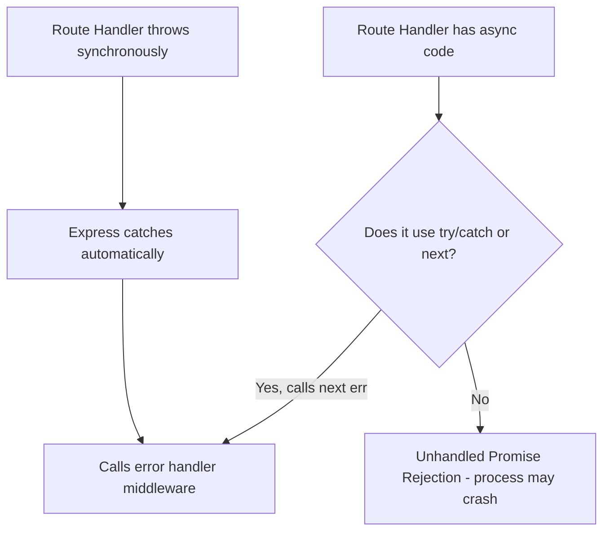

# Express.js Deep Dive — Production Patterns

> Revision notes for experienced JS developers. Skips basics, goes deep on internals, gotchas, and production patterns.

---

## 🧠 What Express Actually Is (Internals)

Express is not a framework in the Rails/Spring sense. It is a **thin routing and middleware layer** bolted on top of Node's built-in `http` module. Understanding this is the foundation for everything else.

```js
// This is what Node gives you raw:
import http from 'http';
const server = http.createServer((req, res) => {
  res.end('Hello');
});

// Express wraps createServer internally. app IS a request handler function:
import express from 'express';
const app = express();
// app is literally: function(req, res, next) { ... }
// You can pass it directly:
const server = http.createServer(app);
server.listen(3000);
// OR use the shortcut:
app.listen(3000);  // does exactly the above internally
```

### What Express Enhances

`req` and `res` in Express are the same `IncomingMessage` and `ServerResponse` objects from Node's `http` module — Express **prototypally extends** them. It does **not** wrap them in a new class.

```js
// Express source (simplified):
// req.__proto__ = app.request  (which extends http.IncomingMessage)
// res.__proto__ = app.response (which extends http.ServerResponse)
```

This means **all native Node properties still exist**. When you call `res.json()`, Express is adding methods on top of the raw `res.write()` / `res.end()` from Node.

### The Middleware Stack

```mermaid
graph TD
    A[HTTP Request] --> B[express internals: parse URL, method]
    B --> C[Middleware 1: morgan logger]
    C -->|next()| D[Middleware 2: json parser]
    D -->|next()| E[Middleware 3: auth check]
    E -->|next()| F[Route Handler]
    F --> G[HTTP Response]
    E -->|next with err| H[Error Handler Middleware]
    H --> G
```

The "middleware stack" is literally a **JavaScript array** of functions Express iterates through. When you call `next()`, Express advances the index. When you `res.send()`, the response ends and no further middleware runs (but Express doesn't stop iterating if you call `next()` after — which is a source of bugs).

**Here's the trap most devs fall into:** Calling `next()` and `res.json()` in the same handler doesn't crash immediately — it just causes a "headers already sent" error later. Always `return next()` or `return res.json()` to stop execution:

```js
// BAD: Headers already sent error waiting to happen
app.use((req, res, next) => {
  if (!req.headers.authorization) {
    res.status(401).json({ error: 'Unauthorized' });
    next(); // OOPS — execution continues
  }
  next();
});

// GOOD: explicit return
app.use((req, res, next) => {
  if (!req.headers.authorization) {
    return res.status(401).json({ error: 'Unauthorized' });
  }
  next();
});
```

---

## 🔗 Middleware Deep Dive

### Types of Middleware

| Type | Signature | Scope | Example |
|------|-----------|-------|---------|
| Application-level | `(req, res, next)` | All routes unless path given | `app.use(helmet())` |
| Router-level | `(req, res, next)` | Router's routes only | `router.use(authMiddleware)` |
| Error-handling | `(err, req, res, next)` | After `next(err)` called | Centralized error handler |
| Built-in | — | Express ships them | `express.json()`, `express.static()` |
| Third-party | — | npm packages | `helmet`, `cors`, `morgan` |

### Application-Level Middleware

```js
// Without path: runs for EVERY request
app.use(express.json());

// With path: runs only for routes starting with /api
app.use('/api', express.json());

// Order matters — this runs BEFORE route handlers
app.use((req, res, next) => {
  req.requestId = crypto.randomUUID();
  next();
});
```

### Router-Level Middleware

`express.Router()` creates a mini-app with its own middleware stack. This is how you achieve modular routing without polluting the main `app`:

```js
// routes/users.js
import { Router } from 'express';
const router = Router();

// Runs only for /users/* routes
router.use(requireAuth);

router.get('/', getAllUsers);
router.post('/', createUser);
router.get('/:id', getUserById);

export default router;

// app.js
app.use('/users', usersRouter);
```

**Here's the trap most devs fall into:** `router.use()` scopes to the router's mount path, but route params defined in `app.use('/users/:id', router)` are NOT accessible in the router via `req.params.id` by default. Pass `{ mergeParams: true }` to the Router constructor:

```js
const router = Router({ mergeParams: true }); // now req.params.id is available
```

### Error-Handling Middleware — The 4-Parameter Signature

Express identifies error middleware by **arity (number of parameters)**. It must be exactly 4:

```js
// Express checks fn.length === 4 to classify as error handler
app.use((err, req, res, next) => {
  // If you accidentally write (err, req, res) Express won't treat it as error handler
  console.error(err.stack);
  res.status(err.status || 500).json({ error: err.message });
});
```

**Here's the trap most devs fall into:** Forgetting `next` in the signature. Even if you never call `next`, you need it:

```js
// Express will NOT call this as an error handler — only 3 params
app.use((err, req, res) => { ... }); // WRONG

// Express WILL call this — 4 params
app.use((err, req, res, next) => { ... }); // CORRECT
```

### Built-in Middleware

```js
// express.json() replaces bodyParser.json() (bodyParser is now part of Express)
app.use(express.json({
  limit: '10kb',        // reject bodies larger than 10kb
  strict: true,         // only accept arrays and objects (not primitives)
  reviver: (key, val) => val // JSON.parse reviver function
}));

// express.urlencoded() for HTML form submissions
app.use(express.urlencoded({ extended: true })); // extended: true uses qs library

// express.static() for serving static files
app.use('/static', express.static(path.join(__dirname, 'public'), {
  maxAge: '1d',         // Cache-Control max-age
  etag: true,           // Enable ETags
  index: 'index.html',  // Directory index file
  dotfiles: 'ignore'    // Don't serve .env, .htaccess etc.
}));
```

### Third-Party Middleware: Production Essentials

```js
import helmet from 'helmet';
import cors from 'cors';
import morgan from 'morgan';

// helmet sets 11 security headers (X-Frame-Options, HSTS, CSP, etc.)
app.use(helmet({
  contentSecurityPolicy: {
    directives: {
      defaultSrc: ["'self'"],
      scriptSrc: ["'self'", "'unsafe-inline'"], // tweak for your needs
    }
  },
  crossOriginEmbedderPolicy: false // disable if you use cross-origin iframes
}));

// morgan for structured request logging
app.use(morgan('combined', {
  skip: (req, res) => res.statusCode < 400, // log only errors in production
  stream: { write: (message) => logger.info(message.trim()) } // pipe to winston/pino
}));
```

---

## 🗺️ Routing — Beyond the Basics

### Route Methods and Chaining

```js
// route() lets you chain handlers for the same path — no DRY violation
app.route('/articles/:id')
  .get(getArticle)
  .put(updateArticle)
  .delete(deleteArticle);

// route.all() — ANY HTTP method
router.all('/secret', (req, res, next) => {
  console.log('Accessing secret section...');
  next();
});
```

### Multiple Handlers on One Route

Each handler is just another function in the middleware array for that route:

```js
// Array syntax — useful for composing reusable middleware
const requireAdmin = [requireAuth, requireRole('admin')];

app.delete('/users/:id', requireAdmin, deleteUser);

// Or inline — useful for route-specific logic
app.get('/dashboard',
  requireAuth,
  (req, res, next) => {
    // Prefetch user data before main handler
    User.findById(req.user.id).then(user => {
      req.fullUser = user;
      next();
    }).catch(next);
  },
  renderDashboard
);
```

### `router.param()` — DRY Parameter Resolution

**Here's the trap most devs fall into:** Repeating `User.findById(req.params.id)` in every route handler. Use `router.param()` to resolve once:

```js
// Runs once per request when :userId appears in a matched route
router.param('userId', async (req, res, next, id) => {
  try {
    const user = await User.findById(id);
    if (!user) return res.status(404).json({ error: 'User not found' });
    req.targetUser = user; // available in all subsequent handlers
    next();
  } catch (err) {
    next(err);
  }
});

router.get('/:userId/profile', (req, res) => {
  // req.targetUser already populated — no DB call needed here
  res.json(req.targetUser);
});
```

### Regex Routes

Express 4.x supports limited regex. Express 5.x dropped `*` in strings — use explicit regex:

```js
// Express 4: this works but is ambiguous
app.get('/fly*', handler);

// Express 5 / production-safe: explicit regex
app.get(/^\/fly/, handler);

// Named capture groups in Express 5
app.get('/users/:id(\\d+)', handler); // :id must be digits only
```

### Router Mounting — Versioned APIs

```js
// Clean API versioning with isolated routers
const v1Router = Router();
const v2Router = Router();

v1Router.use('/users', v1UsersRouter);
v2Router.use('/users', v2UsersRouter);

app.use('/api/v1', v1Router);
app.use('/api/v2', v2Router);
```

---

## 📦 req and res — Production-Level Usage

### req Object Reference

```js
// req.params — from URL path segments
// GET /users/42/posts/7
req.params.userId // '42' — ALWAYS a string, not a number
req.params.postId // '7'

// req.query — from URL query string (?name=alice&active=true)
req.query.name   // 'alice'
req.query.active // 'true' — also a string, not boolean

// req.body — from request body (requires express.json())
req.body.email   // whatever was in the JSON body

// req.headers — lowercase always
req.headers['content-type']      // 'application/json'
req.headers.authorization        // 'Bearer eyJ...'
req.get('Content-Type')          // Express convenience method, same thing

// req.ip — the client IP
// Without trust proxy: always 127.0.0.1 behind a load balancer (wrong!)
// With trust proxy: reads from X-Forwarded-For header
app.set('trust proxy', 1); // trust first proxy (e.g., nginx, Heroku)
req.ip // now gives real client IP

// req.path, req.hostname, req.protocol, req.method
req.path     // '/users/42' (without query string)
req.hostname // 'api.example.com' (without port)
req.protocol // 'https'
req.secure   // true if https (shorthand for req.protocol === 'https')
req.method   // 'GET', 'POST', etc.

// req.cookies (requires cookie-parser middleware)
req.cookies.sessionId

// req.signedCookies (tamper-evident, requires cookie-parser with secret)
req.signedCookies.userId

// Custom properties attached by middleware — TypeScript section covers typing
req.user    // set by auth middleware
req.requestId // set by correlation ID middleware
```

**Here's the trap most devs fall into:** `req.params` values are always strings. Passing `req.params.id` directly to `mongoose.findById()` works because Mongoose coerces, but passing it to arithmetic or strict equality checks will silently fail:

```js
// TRAP
if (req.params.id === 1) // always false — '1' !== 1

// CORRECT
const id = parseInt(req.params.id, 10);
if (isNaN(id)) return res.status(400).json({ error: 'Invalid ID' });
```

### res Object Reference

```js
// res.json() — sets Content-Type: application/json automatically, calls JSON.stringify
res.json({ message: 'ok' });

// res.status() returns res, so you can chain
res.status(201).json({ id: newUser._id });

// res.send() — sets Content-Type based on body type
res.send('plain text');       // text/html
res.send({ key: 'val' });     // application/json (calls JSON.stringify)
res.send(Buffer.from('...'));  // application/octet-stream

// res.send() vs res.end()
// res.end() — raw Node, no Content-Type, no JSON.stringify
// NEVER use res.end() for JSON — use res.json()
// res.end() is for when you want to end without a body (e.g., 204 No Content)
res.status(204).end();

// res.sendFile() — serve a file, handles Range headers, ETags
res.sendFile(path.join(__dirname, 'files', filename), {
  root: __dirname, // security: prevents path traversal
  headers: { 'Content-Disposition': 'attachment' }
});

// res.redirect()
res.redirect('/new-path');           // 302 by default
res.redirect(301, '/permanent-path'); // 301 Moved Permanently
res.redirect('back');                // redirects to Referer header

// res.set() / res.setHeader() — set response headers
res.set('X-Request-Id', req.requestId);
res.set({ 'Cache-Control': 'no-store', 'Pragma': 'no-cache' });

// res.locals — pass data between middleware WITHOUT polluting req
// Scoped to the current request/response cycle, not global
res.locals.user = authenticatedUser;
// Later middleware or template can access res.locals.user
```

### res.locals — The Right Pattern for Middleware Communication

```js
// WRONG: attach everything to req (mixes request data with computed data)
req.currentUser = user;  // req is for incoming data
req.permissions = perms; // gets messy fast

// RIGHT: use res.locals for computed/derived data set by middleware
app.use(async (req, res, next) => {
  try {
    const token = req.headers.authorization?.split(' ')[1];
    if (token) {
      res.locals.user = await verifyToken(token);
    }
    next();
  } catch (err) {
    next(err);
  }
});

app.get('/profile', (req, res) => {
  if (!res.locals.user) return res.status(401).json({ error: 'Unauthorized' });
  res.json(res.locals.user);
});
```

---

## 💥 Error Handling — The Full Picture

### Sync vs Async Error Propagation



```js
// Synchronous throw — Express 4+ catches this automatically
app.get('/sync', (req, res) => {
  throw new Error('Sync error'); // Express catches and forwards to error handler
});

// Async — you MUST explicitly pass to next()
app.get('/async', async (req, res, next) => {
  try {
    const data = await someAsyncOperation();
    res.json(data);
  } catch (err) {
    next(err); // explicitly forward to error handler
  }
});

// Express 5 handles async automatically (no try/catch needed):
// app.get('/async', async (req, res) => {
//   const data = await someAsyncOperation(); // rejected promise auto-forwarded
//   res.json(data);
// });
```

**Here's the trap most devs fall into:** In Express 4, unhandled promise rejections in route handlers DON'T go to the error handler — they go to `process.on('unhandledRejection')` and can crash the process. Always `try/catch` with `next(err)` in Express 4 async handlers.

### Custom Error Classes — Operational vs Programmer Errors

This distinction matters for what you log, alert on, and send to the client:

```js
// Operational errors: expected, safe to expose to client (4xx)
class AppError extends Error {
  constructor(message, statusCode) {
    super(message);
    this.statusCode = statusCode;
    this.isOperational = true;
    Error.captureStackTrace(this, this.constructor);
  }
}

class ValidationError extends AppError {
  constructor(message, fields) {
    super(message, 400);
    this.fields = fields;
  }
}

class NotFoundError extends AppError {
  constructor(resource = 'Resource') {
    super(`${resource} not found`, 404);
  }
}

class UnauthorizedError extends AppError {
  constructor(message = 'Unauthorized') {
    super(message, 401);
  }
}

// Programmer errors: bugs, should NOT be exposed, should be alerted/logged fully
// Example: trying to read property of undefined, DB connection failed, etc.
```

### Centralized Error Handler

Must be the **last** `app.use()` call. Express routes and middleware are matched in order, so error handlers at the end only catch errors forwarded via `next(err)`:

```js
// errorHandler.js
export const errorHandler = (err, req, res, next) => {
  // Log everything — but selectively
  if (err.isOperational) {
    // Expected error — log at warn level
    logger.warn({ err, requestId: req.requestId }, err.message);
  } else {
    // Programmer error — log full stack, alert ops team
    logger.error({ err, requestId: req.requestId }, 'Unexpected error');
    // Consider triggering an alert (PagerDuty, Sentry, etc.)
  }

  // Don't expose internals in production
  const isDev = process.env.NODE_ENV === 'development';

  const statusCode = err.statusCode || 500;
  const response = {
    error: {
      message: err.isOperational ? err.message : 'Internal Server Error',
      requestId: req.requestId,
      ...(isDev && { stack: err.stack }),
      ...(err.fields && { fields: err.fields }),
    }
  };

  res.status(statusCode).json(response);
};

// app.js — must be last
app.use(notFoundHandler); // 404 for unmatched routes
app.use(errorHandler);    // error handler — always last, always 4 params
```

### 404 Handler — The Often Missed Piece

```js
// Catches all routes that didn't match any defined route
// Must come AFTER all route definitions, BEFORE error handler
app.use((req, res, next) => {
  next(new NotFoundError(`Route ${req.method} ${req.path}`));
});
```

---

## 🏭 Production Setup — All the Middleware You Need

### Security Layer: helmet

```js
import helmet from 'helmet';

app.use(helmet()); // safe defaults cover 11 headers

// Key headers helmet sets:
// Content-Security-Policy: controls where scripts/styles can load from
// X-Frame-Options: DENY (clickjacking protection)
// X-Content-Type-Options: nosniff (MIME type sniffing protection)
// Strict-Transport-Security: HSTS (HTTPS enforcement)
// X-XSS-Protection: 0 (disabled — modern browsers handle this better without it)
// Referrer-Policy: no-referrer
```

### CORS — Multiple Origins Done Right

```js
import cors from 'cors';

const allowedOrigins = [
  'https://app.example.com',
  'https://admin.example.com',
  ...(process.env.NODE_ENV === 'development' ? ['http://localhost:3000'] : [])
];

const corsOptions = {
  origin: (origin, callback) => {
    // Allow requests with no origin (mobile apps, curl, Postman)
    if (!origin || allowedOrigins.includes(origin)) {
      callback(null, true);
    } else {
      callback(new AppError(`Origin ${origin} not allowed`, 403));
    }
  },
  methods: ['GET', 'POST', 'PUT', 'DELETE', 'PATCH', 'OPTIONS'],
  allowedHeaders: ['Content-Type', 'Authorization', 'X-Request-ID'],
  exposedHeaders: ['X-Request-ID', 'X-Rate-Limit-Remaining'],
  credentials: true,       // allow cookies with cross-origin requests
  maxAge: 86400,           // preflight cache: 24 hours
};

app.use(cors(corsOptions));
app.options('*', cors(corsOptions)); // handle OPTIONS preflight for all routes
```

**Here's the trap most devs fall into:** Setting `credentials: true` with `origin: '*'` — browsers block this combination. If you need credentials, you must specify exact origins.

### Rate Limiting

```js
import rateLimit from 'express-rate-limit';
import slowDown from 'express-slow-down';

// Hard limit — blocks after N requests
const apiLimiter = rateLimit({
  windowMs: 15 * 60 * 1000, // 15 minutes
  max: 100,
  standardHeaders: true,    // Return rate limit info in RateLimit-* headers
  legacyHeaders: false,      // Disable X-RateLimit-* headers
  keyGenerator: (req) => req.headers['x-forwarded-for'] || req.ip,
  handler: (req, res) => {
    res.status(429).json({
      error: 'Too many requests, please try again later.',
      retryAfter: Math.ceil(req.rateLimit.resetTime / 1000),
    });
  },
  // skip: (req) => req.user?.isPremium // skip rate limit for premium users
});

// Slow down — progressively delays responses (kinder than hard block)
const speedLimiter = slowDown({
  windowMs: 15 * 60 * 1000,
  delayAfter: 50,   // start slowing after 50 requests
  delayMs: (hits) => hits * 100, // each request adds 100ms delay
});

// Apply globally or to specific routers
app.use('/api/', speedLimiter);
app.use('/api/', apiLimiter);

// More aggressive limit for auth endpoints
const authLimiter = rateLimit({
  windowMs: 15 * 60 * 1000,
  max: 5,
  skipSuccessfulRequests: true, // only count failed attempts
});
app.use('/api/auth/login', authLimiter);
```

### Compression

```js
import compression from 'compression';

app.use(compression({
  threshold: 1024, // only compress responses > 1KB
  filter: (req, res) => {
    // Don't compress if client explicitly says no
    if (req.headers['x-no-compression']) return false;
    return compression.filter(req, res);
  },
  level: 6 // 1 (fastest) to 9 (best compression). 6 is good balance
}));
```

### Request ID / Correlation ID

Critical for distributed tracing — ties logs from multiple services together:

```js
import { v4 as uuidv4 } from 'uuid';

app.use((req, res, next) => {
  // Accept from upstream (e.g., API gateway already set it) or generate
  const requestId = req.headers['x-request-id'] || uuidv4();
  req.requestId = requestId;
  res.set('X-Request-ID', requestId);

  // If using pino logger with child loggers:
  req.log = logger.child({ requestId });
  // Now use req.log.info() throughout request lifecycle
  next();
});
```

---

## 📐 Express with TypeScript

### Extending Request and Response

TypeScript's module augmentation lets you add custom properties to Express types without monkey-patching or `any`:

```ts
// types/express.d.ts — declaration merging
import { User } from '../models/User';

declare global {
  namespace Express {
    interface Request {
      requestId: string;
      user?: User;           // set by auth middleware — optional since not always present
      log: pino.Logger;      // child logger scoped to request
    }

    interface Locals {
      // res.locals type — extend if needed
      cacheControl?: string;
    }
  }
}
```

### Typed Middleware

```ts
import { Request, Response, NextFunction, RequestHandler } from 'express';

// Typed middleware factory
export const requireRole = (role: string): RequestHandler => {
  return (req: Request, res: Response, next: NextFunction): void => {
    if (!req.user) {
      res.status(401).json({ error: 'Unauthorized' });
      return;
    }
    if (req.user.role !== role) {
      res.status(403).json({ error: 'Forbidden' });
      return;
    }
    next();
  };
};

// Typed route handler with generics
interface CreateUserBody {
  name: string;
  email: string;
  role: 'user' | 'admin';
}

interface UserResponse {
  id: string;
  name: string;
  email: string;
}

// Request<Params, ResBody, ReqBody, QueryString>
const createUser = async (
  req: Request<{}, UserResponse, CreateUserBody>,
  res: Response<UserResponse>,
  next: NextFunction
): Promise<void> => {
  try {
    const user = await UserService.create(req.body);
    res.status(201).json(user);
  } catch (err) {
    next(err);
  }
};
```

### Typed Error Handler

```ts
import { ErrorRequestHandler } from 'express';

// The 4-param constraint is preserved in TypeScript's ErrorRequestHandler type
export const errorHandler: ErrorRequestHandler = (err, req, res, next) => {
  const statusCode = err.statusCode ?? 500;
  res.status(statusCode).json({
    error: err.isOperational ? err.message : 'Internal Server Error',
    requestId: req.requestId,
  });
};
```

---

## 🚫 What Express Does NOT Give You

This is crucial for system design interviews and production planning:

| Capability | Express provides? | What to use instead |
|---|---|---|
| Input validation | No | `zod`, `joi`, `express-validator` |
| Authentication | No | `passport.js`, `jsonwebtoken`, Auth0 |
| Authorization | No | `casl`, custom RBAC middleware |
| File uploads | No | `multer`, `busboy` |
| WebSockets | No | `ws`, `socket.io` (attaches to same http server) |
| TypeScript types | Partial | `@types/express`, declaration merging |
| Request queuing | No | Bull/BullMQ with Redis |
| Caching | No | `node-cache`, Redis via `ioredis` |
| Database ORM | No | Prisma, TypeORM, Mongoose |
| Session management | No | `express-session` + Redis store |
| Structured logging | No | `pino`, `winston` |
| OpenAPI/Swagger | No | `swagger-ui-express` + `zod-to-openapi` |

### Input Validation Pattern (Zod + Express)

```ts
import { z } from 'zod';

const CreateUserSchema = z.object({
  body: z.object({
    name: z.string().min(1).max(100),
    email: z.string().email(),
    age: z.number().int().positive().optional(),
  }),
  query: z.object({
    notify: z.enum(['email', 'sms']).optional(),
  }),
  params: z.object({})
});

// Reusable validation middleware factory
const validate = (schema: z.ZodType) => (
  req: Request, res: Response, next: NextFunction
) => {
  const result = schema.safeParse({
    body: req.body,
    query: req.query,
    params: req.params,
  });

  if (!result.success) {
    return res.status(400).json({
      error: 'Validation failed',
      fields: result.error.flatten().fieldErrors,
    });
  }

  Object.assign(req, result.data); // typed and validated
  next();
};

router.post('/users', validate(CreateUserSchema), createUser);
```

---

## 🏗️ Full Production App Skeleton

Middleware order is critical. Here's the correct ordering with explanations:

```
D:\development\siddesh\knowlege-base\js-notes\17-express-deep-dive.md
```

```ts
// src/app.ts
import express from 'express';
import helmet from 'helmet';
import cors from 'cors';
import compression from 'compression';
import morgan from 'morgan';
import rateLimit from 'express-rate-limit';

import { requestIdMiddleware } from './middleware/requestId';
import { errorHandler } from './middleware/errorHandler';
import { notFoundHandler } from './middleware/notFound';
import { usersRouter } from './routes/users';
import { authRouter } from './routes/auth';
import logger from './lib/logger';

export function createApp() {
  const app = express();

  // ━━━━━━━━━━━━━━━━━━━━━━━━━━━━━━━━━━━━━━━━━━━
  // 1. TRUST PROXY — must be FIRST
  //    Without this, req.ip is always 127.0.0.1 behind nginx/ALB
  // ━━━━━━━━━━━━━━━━━━━━━━━━━━━━━━━━━━━━━━━━━━━
  if (process.env.NODE_ENV === 'production') {
    app.set('trust proxy', 1);
  }

  // ━━━━━━━━━━━━━━━━━━━━━━━━━━━━━━━━━━━━━━━━━━━
  // 2. SECURITY HEADERS — before anything else
  // ━━━━━━━━━━━━━━━━━━━━━━━━━━━━━━━━━━━━━━━━━━━
  app.use(helmet());

  // ━━━━━━━━━━━━━━━━━━━━━━━━━━━━━━━━━━━━━━━━━━━
  // 3. CORS — before rate limiting and body parsing
  //    (OPTIONS preflight must not hit rate limiter)
  // ━━━━━━━━━━━━━━━━━━━━━━━━━━━━━━━━━━━━━━━━━━━
  app.use(cors(corsOptions));
  app.options('*', cors(corsOptions));

  // ━━━━━━━━━━━━━━━━━━━━━━━━━━━━━━━━━━━━━━━━━━━
  // 4. REQUEST ID — attach early so all logs have it
  // ━━━━━━━━━━━━━━━━━━━━━━━━━━━━━━━━━━━━━━━━━━━
  app.use(requestIdMiddleware);

  // ━━━━━━━━━━━━━━━━━━━━━━━━━━━━━━━━━━━━━━━━━━━
  // 5. REQUEST LOGGING — after request ID, before body parsing
  //    (log the request as it arrives, not after processing)
  // ━━━━━━━━━━━━━━━━━━━━━━━━━━━━━━━━━━━━━━━━━━━
  app.use(morgan('combined', {
    stream: { write: (msg) => logger.info(msg.trim()) },
    skip: (req, res) => process.env.NODE_ENV === 'test',
  }));

  // ━━━━━━━━━━━━━━━━━━━━━━━━━━━━━━━━━━━━━━━━━━━
  // 6. COMPRESSION — before body parsing but after logging
  //    (compress the response, doesn't affect request processing)
  // ━━━━━━━━━━━━━━━━━━━━━━━━━━━━━━━━━━━━━━━━━━━
  app.use(compression());

  // ━━━━━━━━━━━━━━━━━━━━━━━━━━━━━━━━━━━━━━━━━━━
  // 7. BODY PARSING — before routes that need req.body
  // ━━━━━━━━━━━━━━━━━━━━━━━━━━━━━━━━━━━━━━━━━━━
  app.use(express.json({ limit: '10kb' }));
  app.use(express.urlencoded({ extended: true, limit: '10kb' }));

  // ━━━━━━━━━━━━━━━━━━━━━━━━━━━━━━━━━━━━━━━━━━━
  // 8. RATE LIMITING — after body parsing, before route handlers
  // ━━━━━━━━━━━━━━━━━━━━━━━━━━━━━━━━━━━━━━━━━━━
  app.use('/api/', rateLimit({ windowMs: 15 * 60 * 1000, max: 100 }));

  // ━━━━━━━━━━━━━━━━━━━━━━━━━━━━━━━━━━━━━━━━━━━
  // 9. ROUTES — core application logic
  // ━━━━━━━━━━━━━━━━━━━━━━━━━━━━━━━━━━━━━━━━━━━
  app.use('/api/auth', authRouter);
  app.use('/api/users', usersRouter);

  // Health check — no rate limit, no auth
  app.get('/health', (req, res) => {
    res.json({ status: 'ok', timestamp: new Date().toISOString() });
  });

  // ━━━━━━━━━━━━━━━━━━━━━━━━━━━━━━━━━━━━━━━━━━━
  // 10. 404 HANDLER — after all routes
  // ━━━━━━━━━━━━━━━━━━━━━━━━━━━━━━━━━━━━━━━━━━━
  app.use(notFoundHandler);

  // ━━━━━━━━━━━━━━━━━━━━━━━━━━━━━━━━━━━━━━━━━━━
  // 11. CENTRALIZED ERROR HANDLER — always last
  // ━━━━━━━━━━━━━━━━━━━━━━━━━━━━━━━━━━━━━━━━━━━
  app.use(errorHandler);

  return app;
}
```

```ts
// src/server.ts — separate from app for testability
import { createApp } from './app';
import { connectDB } from './lib/db';
import logger from './lib/logger';

const PORT = parseInt(process.env.PORT ?? '3000', 10);

async function start() {
  await connectDB();

  const app = createApp();
  const server = app.listen(PORT, () => {
    logger.info(`Server running on port ${PORT}`);
  });

  // Graceful shutdown — critical for Kubernetes/ECS rolling deploys
  const shutdown = async (signal: string) => {
    logger.info(`${signal} received. Starting graceful shutdown...`);
    server.close(async () => {
      await disconnectDB();
      logger.info('Shutdown complete');
      process.exit(0);
    });

    // Force exit after 30s if connections don't close
    setTimeout(() => {
      logger.error('Forced shutdown after timeout');
      process.exit(1);
    }, 30_000);
  };

  process.on('SIGTERM', () => shutdown('SIGTERM'));
  process.on('SIGINT', () => shutdown('SIGINT'));

  // Catch programmer errors — log and exit (let process manager restart)
  process.on('uncaughtException', (err) => {
    logger.fatal({ err }, 'Uncaught exception — shutting down');
    server.close(() => process.exit(1));
  });

  process.on('unhandledRejection', (reason) => {
    logger.fatal({ reason }, 'Unhandled rejection — shutting down');
    server.close(() => process.exit(1));
  });
}

start();
```

---

## ⚡ Express 4 vs Express 5 — Key Differences

| Feature | Express 4 | Express 5 |
|---|---|---|
| Async error handling | Manual `try/catch + next(err)` | Auto-catches rejected promises |
| Regex routes | `app.get('/fly*', ...)` | Must use literal regex `/^\/fly/` |
| `req.body` type | Mixed | Stricter TypeScript support |
| Router path params | No `mergeParams` by default | Same (no change) |
| Node.js minimum | 0.10+ | 18+ |
| Release status | Stable (current LTS) | RC as of 2024 |

**When to migrate to Express 5:** When you want native async error propagation without wrapping every handler in try/catch. The async auto-catch alone removes a whole class of bugs.

---

## 🎯 Interview-Ready Deep Points

**Q: How does Express route matching work?**
Express iterates its layer array. Each layer has a regexp (compiled from the path string) and a handle function. The first layer whose regexp matches the request path and method gets called. `router.use()` uses prefix matching (not exact); `router.get()` etc. use exact + method matching.

**Q: Why does error handler need exactly 4 params?**
Express checks `fn.length` (the `length` property of a function = number of declared parameters). If `fn.length === 4`, it registers as an error handler and is only invoked when `next(err)` is called with an error argument.

**Q: What's the difference between `app.use()` and `app.get()`?**
`app.use()` matches any HTTP method and uses prefix path matching. `app.get()` matches only GET and uses exact path matching (with Express's param syntax). `app.use('/api', router)` fires for `/api`, `/api/users`, `/api/anything`. `app.get('/api', handler)` only fires for exactly `/api` with GET.

**Q: How would you handle file uploads in Express?**
Express has no built-in multipart parser. Use `multer` which wraps `busboy`. Configure storage (disk or memory), set file size limits, filter by MIME type, and never trust `req.file.originalname` for saving to disk (use `path.extname` + a UUID).

**Q: How do you share state between middleware?**
`req` for incoming request-derived data (user from auth token). `res.locals` for computed data set by middleware, scoped to the request lifecycle. Module-level singletons (DB connections, config) for global state. Never use global mutable state — it's shared across all concurrent requests.

---

## 🔑 Quick Reference Card

```
Middleware order:
trust proxy → helmet → cors → requestId → morgan → compression → bodyParser → rateLimit → routes → 404 → errorHandler

Error propagation:
sync throw → auto-caught by Express
async error → must call next(err) [Express 4] or auto-caught [Express 5]
4-param fn → error handler (must have all 4 even if unused)

Key settings:
app.set('trust proxy', 1)      — real IPs behind load balancer
express.json({ limit: '10kb' }) — prevent body-size DoS
res.locals                      — middleware-to-route communication
router.param()                  — DRY param resolution
{ mergeParams: true }           — access parent router params in child router
```
