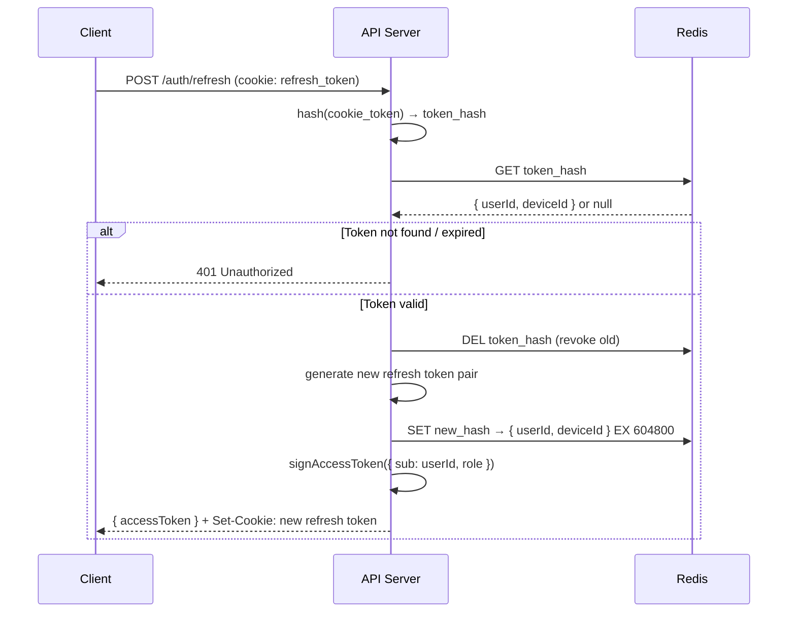
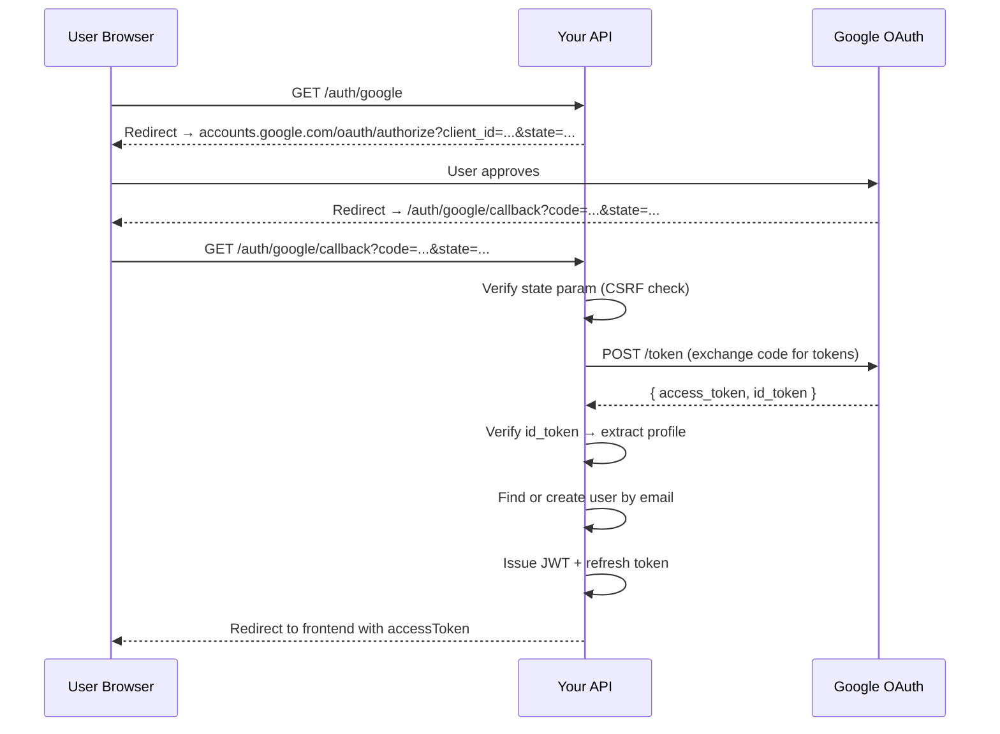

# Chapter 19 — Production Node.js: Authentication, Authorization, and Security

> Revision notes for experienced JS developers. Skips basics, covers every production gotcha.

---

## 🔥 The Real Mental Model Before You Write a Single Line

Authentication and authorization are not the same thing, and confusing them in your architecture leads to security debt that compounds fast.

- **Authentication** = "Who are you?" — verifying identity
- **Authorization** = "What can you do?" — verifying permission

Most tutorial auth code conflates them into one god-middleware. Production systems keep them strictly layered: authenticate first, authorize second, and treat each as independently testable units.

The threat model you're defending against in 2024+ production Node.js:
- Stolen JWT tokens (client-side XSS, network interception)
- Refresh token theft (longer window, bigger impact)
- Brute-force on password endpoints
- CSRF on cookie-based flows
- Token replay after logout
- Privilege escalation via role manipulation
- Injection (SQL, NoSQL, command injection) via unsanitized input

---

## 🔐 Password Hashing: bcrypt vs argon2 — The Deep Cut

### bcrypt

bcrypt has one job: make password hashing slow and memory-predictable. The cost factor (work factor) is the number of rounds as `2^cost`. Cost 12 means `2^12 = 4096` iterations.

```javascript
import bcrypt from 'bcrypt';

const SALT_ROUNDS = 12;

export async function hashPassword(plaintext) {
  // bcrypt internally generates a random 128-bit salt — never pass your own
  return bcrypt.hash(plaintext, SALT_ROUNDS);
}

export async function verifyPassword(plaintext, hash) {
  // timing-safe by design — bcrypt.compare does NOT short-circuit on mismatch
  return bcrypt.compare(plaintext, hash);
}
```

**Why cost 12, not 14 or 16?**

At cost 12, bcrypt takes ~250ms per hash on modern hardware. That's acceptable for login (user waits ~250ms). At cost 14, it's ~1 second. The problem is this also applies to your *server's* CPU. Under auth load (burst signups, login storms), a cost that's too high becomes a DoS vector — an attacker can flood `/auth/login` and pin your CPU at 100%.

| Cost Factor | Hash Time (approx) | Notes |
|-------------|-------------------|-------|
| 10 | ~60ms | Too fast — weak under GPU cracking |
| 12 | ~250ms | Industry sweet spot for web APIs |
| 14 | ~1000ms | Web app UX suffers; OK for admin portals |
| 16 | ~4000ms | Only justified for very high-security offline use |

**Here's the trap most devs fall into:** Using `bcrypt.hashSync()` in production. It blocks the event loop for the full duration of hashing. With cost 12 and any burst of signups, you lock up the entire Node process. Always use the async variant.

### argon2 — Why It's the Superior Choice

bcrypt has a known weakness: it caps input at 72 bytes (silently truncates), uses only 4KB of memory, and its memory usage doesn't scale. This makes it tractable for GPU/ASIC attacks with enough hardware.

argon2 (winner of the Password Hashing Competition) is **memory-hard**: each hash computation requires a tunable amount of memory. Parallelizing on GPUs becomes expensive because you can't fit thousands of parallel hashing threads in GPU VRAM simultaneously.

```javascript
import argon2 from 'argon2';

const ARGON2_OPTIONS = {
  type: argon2.argon2id,     // hybrid of argon2i (side-channel resistant) and argon2d (GPU resistant)
  memoryCost: 2 ** 16,       // 64MB RAM per hash — GPU parallelism killer
  timeCost: 3,               // 3 passes over memory
  parallelism: 1,            // single thread — predictable server load
};

export async function hashPassword(plaintext) {
  return argon2.hash(plaintext, ARGON2_OPTIONS);
}

export async function verifyPassword(plaintext, hash) {
  return argon2.verify(hash, plaintext);  // note: hash first, then plaintext
}
```

| Dimension | bcrypt | argon2id |
|-----------|--------|----------|
| Memory per hash | 4KB (fixed) | Configurable (64MB+ recommended) |
| GPU attack resistance | Low | High |
| Input length limit | 72 bytes (silent truncate) | No limit |
| Side-channel resistance | Moderate | High (argon2id) |
| Node.js ecosystem | Mature (`bcrypt`) | Mature (`argon2`) |
| OWASP recommendation | Acceptable | Preferred |

**When to use argon2id:** New projects, anything storing highly sensitive data.
**When bcrypt is acceptable:** Legacy systems already using bcrypt — migration cost isn't worth it unless you're re-hashing on next login.

### Timing-Safe Comparison for Non-Hash Secrets

For comparing API keys or HMAC signatures (not passwords), you need `crypto.timingSafeEqual`. Regular string comparison (`===`) short-circuits on the first mismatch, leaking timing information that lets attackers guess byte-by-byte.

```javascript
import { timingSafeEqual } from 'crypto';

export function safeCompare(a, b) {
  const aBuf = Buffer.from(a, 'utf8');
  const bBuf = Buffer.from(b, 'utf8');
  // Must be same length — length difference itself is a leak, but we handle it:
  if (aBuf.length !== bBuf.length) {
    // Still do a comparison to avoid timing side-channel on length
    timingSafeEqual(aBuf, aBuf);
    return false;
  }
  return timingSafeEqual(aBuf, bBuf);
}
```

---

## 🗝️ JWT Strategy: Access + Refresh Token Architecture

### Why Not a Single Long-Lived JWT?

A single token valid for 30 days that gets stolen means 30 days of unauthorized access with no revocation mechanism. JWTs are stateless — once issued, they're valid until expiry unless you add a state check (which defeats the stateless benefit).

The answer is two-token architecture:

```
┌──────────────────────────────────────────────────┐
│  ACCESS TOKEN (15 min, RS256, stateless)         │
│  Payload: { sub: userId, role, iat, exp }        │
│  Stored: memory / JS variable on client          │
│  Sent: Authorization: Bearer <token>             │
└──────────────────────────────────────────────────┘

┌──────────────────────────────────────────────────┐
│  REFRESH TOKEN (7 days, opaque, stateful)        │
│  Value: cryptographically random 256-bit string  │
│  Stored: httpOnly Secure SameSite=Strict cookie  │
│  Redis: hash(token) → { userId, deviceId } TTL 7d│
└──────────────────────────────────────────────────┘
```

### Why RS256 (Asymmetric) Instead of HS256 (Symmetric)?

With HS256, the same secret signs and verifies tokens. If you have multiple services, they all need the secret — which means compromise of any service compromises all token verification.

With RS256, the private key stays on the auth service only. All other services get the public key and can verify tokens without ever touching the private key.

```bash
# Generate RSA key pair (production: store in secrets manager, not .env)
openssl genrsa -out private.pem 2048
openssl rsa -in private.pem -pubout -out public.pem
```

### JWT Service

```javascript
// services/jwt.service.js
import jwt from 'jsonwebtoken';
import { readFileSync } from 'fs';
import { randomBytes, createHash } from 'crypto';

const PRIVATE_KEY = readFileSync('./keys/private.pem', 'utf8');
const PUBLIC_KEY = readFileSync('./keys/public.pem', 'utf8');

const ACCESS_TOKEN_TTL = '15m';
const REFRESH_TOKEN_TTL = 7 * 24 * 60 * 60; // seconds

export function signAccessToken(payload) {
  return jwt.sign(payload, PRIVATE_KEY, {
    algorithm: 'RS256',
    expiresIn: ACCESS_TOKEN_TTL,
    issuer: 'api.yourapp.com',
    audience: 'yourapp.com',
  });
}

export function verifyAccessToken(token) {
  // Throws JsonWebTokenError, TokenExpiredError, NotBeforeError
  return jwt.verify(token, PUBLIC_KEY, {
    algorithms: ['RS256'],  // whitelist — never omit this
    issuer: 'api.yourapp.com',
    audience: 'yourapp.com',
  });
}

export function generateRefreshToken() {
  // Opaque — not a JWT. Store the hash in Redis, send the raw token to client.
  const raw = randomBytes(32).toString('hex');
  const hash = createHash('sha256').update(raw).digest('hex');
  return { raw, hash };
}

export function hashRefreshToken(raw) {
  return createHash('sha256').update(raw).digest('hex');
}
```

**Here's the trap most devs fall into:** Not whitelisting `algorithms` in `jwt.verify()`. Before this became a well-known vulnerability (CVE-2015-9235), an attacker could forge a token signed with `alg: "none"` and bypass verification. Always explicitly specify allowed algorithms.

### Token Refresh Flow



### Redis Refresh Token Store

```javascript
// services/token-store.service.js
import { createClient } from 'redis';

const redis = createClient({ url: process.env.REDIS_URL });
await redis.connect();

const REFRESH_TTL = 60 * 60 * 24 * 7; // 7 days in seconds

export async function storeRefreshToken(hash, userId, deviceId = 'default') {
  await redis.setEx(
    `rt:${hash}`,
    REFRESH_TTL,
    JSON.stringify({ userId, deviceId, createdAt: Date.now() })
  );
}

export async function consumeRefreshToken(hash) {
  const key = `rt:${hash}`;
  const raw = await redis.get(key);
  if (!raw) return null;
  await redis.del(key); // atomic consume — token is single-use
  return JSON.parse(raw);
}

export async function revokeAllUserTokens(userId) {
  // Nuclear option: logout from all devices
  // Requires scanning pattern — use a secondary index in Redis
  const keys = await redis.keys(`rt:*`); // In production, use SCAN not KEYS
  for (const key of keys) {
    const val = await redis.get(key);
    if (val) {
      const data = JSON.parse(val);
      if (data.userId === userId) await redis.del(key);
    }
  }
}
```

**Here's the trap most devs fall into:** Using `redis.keys('*')` in production. It's O(N) and blocks Redis. Use `SCAN` with cursor iteration for anything at scale:

```javascript
export async function revokeAllUserTokens(userId) {
  let cursor = 0;
  do {
    const result = await redis.scan(cursor, { MATCH: 'rt:*', COUNT: 100 });
    cursor = result.cursor;
    for (const key of result.keys) {
      const val = await redis.get(key);
      if (val && JSON.parse(val).userId === userId) {
        await redis.del(key);
      }
    }
  } while (cursor !== 0);
}
```

---

## 🚀 Auth Router — Full Production Implementation

```javascript
// routes/auth.router.js
import { Router } from 'express';
import rateLimit from 'express-rate-limit';
import { hashPassword, verifyPassword } from '../services/password.service.js';
import { signAccessToken, verifyAccessToken, generateRefreshToken, hashRefreshToken } from '../services/jwt.service.js';
import { storeRefreshToken, consumeRefreshToken } from '../services/token-store.service.js';
import { UserRepository } from '../repositories/user.repo.js';
import { validate } from '../middleware/validate.middleware.js';
import { registerSchema, loginSchema } from '../schemas/auth.schemas.js';

const router = Router();

// Rate limiting — tight on auth endpoints
const authLimiter = rateLimit({
  windowMs: 15 * 60 * 1000, // 15 minutes
  max: 10,
  standardHeaders: true,
  legacyHeaders: false,
  message: { error: 'Too many requests, try again later' },
});

const COOKIE_OPTIONS = {
  httpOnly: true,           // Not accessible via document.cookie
  secure: process.env.NODE_ENV === 'production', // HTTPS only in prod
  sameSite: 'strict',       // CSRF protection
  maxAge: 7 * 24 * 60 * 60 * 1000, // 7 days in ms
  path: '/auth/refresh',    // Scoped — cookie only sent to refresh endpoint
};

router.post('/register', authLimiter, validate(registerSchema), async (req, res) => {
  const { email, password, name } = req.body;

  const existing = await UserRepository.findByEmail(email);
  if (existing) {
    // Timing: always hash even if user exists to prevent user enumeration via timing
    await hashPassword(password);
    return res.status(409).json({ error: 'Email already registered' });
  }

  const passwordHash = await hashPassword(password);
  const user = await UserRepository.create({ email, passwordHash, name, role: 'user' });

  const accessToken = signAccessToken({ sub: user.id, role: user.role });
  const { raw, hash } = generateRefreshToken();
  await storeRefreshToken(hash, user.id);

  res.cookie('refresh_token', raw, COOKIE_OPTIONS);
  res.status(201).json({ accessToken, user: { id: user.id, email, name, role: user.role } });
});

router.post('/login', authLimiter, validate(loginSchema), async (req, res) => {
  const { email, password } = req.body;

  const user = await UserRepository.findByEmail(email);

  if (!user) {
    // Always hash to prevent timing-based user enumeration
    await hashPassword(password);
    return res.status(401).json({ error: 'Invalid credentials' });
  }

  const valid = await verifyPassword(password, user.passwordHash);
  if (!valid) return res.status(401).json({ error: 'Invalid credentials' });

  const accessToken = signAccessToken({ sub: user.id, role: user.role });
  const { raw, hash } = generateRefreshToken();
  await storeRefreshToken(hash, user.id);

  res.cookie('refresh_token', raw, COOKIE_OPTIONS);
  res.json({ accessToken, user: { id: user.id, email: user.email, name: user.name, role: user.role } });
});

router.post('/refresh', async (req, res) => {
  const rawToken = req.cookies?.refresh_token;
  if (!rawToken) return res.status(401).json({ error: 'No refresh token' });

  const hash = hashRefreshToken(rawToken);
  const tokenData = await consumeRefreshToken(hash); // Atomic: get + delete

  if (!tokenData) return res.status(401).json({ error: 'Invalid or expired refresh token' });

  const user = await UserRepository.findById(tokenData.userId);
  if (!user) return res.status(401).json({ error: 'User not found' });

  // Rotation: issue new refresh token
  const { raw: newRaw, hash: newHash } = generateRefreshToken();
  await storeRefreshToken(newHash, user.id);

  const accessToken = signAccessToken({ sub: user.id, role: user.role });

  res.cookie('refresh_token', newRaw, COOKIE_OPTIONS);
  res.json({ accessToken });
});

router.post('/logout', async (req, res) => {
  const rawToken = req.cookies?.refresh_token;
  if (rawToken) {
    const hash = hashRefreshToken(rawToken);
    await consumeRefreshToken(hash); // Revoke in Redis
  }
  res.clearCookie('refresh_token', { path: '/auth/refresh' });
  res.json({ message: 'Logged out' });
});

export default router;
```

---

## 🛡️ JWT Middleware

```javascript
// middleware/authenticate.middleware.js
import { verifyAccessToken } from '../services/jwt.service.js';

export function authenticate(req, res, next) {
  const authHeader = req.headers.authorization;

  if (!authHeader?.startsWith('Bearer ')) {
    return res.status(401).json({ error: 'Missing or malformed Authorization header' });
  }

  const token = authHeader.slice(7); // Remove 'Bearer '

  try {
    const payload = verifyAccessToken(token);
    req.user = {
      id: payload.sub,
      role: payload.role,
    };
    next();
  } catch (err) {
    if (err.name === 'TokenExpiredError') {
      return res.status(401).json({ error: 'Access token expired', code: 'TOKEN_EXPIRED' });
    }
    return res.status(401).json({ error: 'Invalid access token' });
  }
}
```

**Here's the trap most devs fall into:** Catching all JWT errors with a generic 401 and not exposing `TOKEN_EXPIRED` as a distinct error code. Your client needs to distinguish "expired" (trigger refresh) from "invalid" (force logout). Without the error code, clients can't implement silent refresh.

---

## 👮 Authorization: RBAC + Resource-Based Access

### Role-Based Access Control (RBAC)

```javascript
// middleware/authorize.middleware.js

export function requireRole(...allowedRoles) {
  return (req, res, next) => {
    if (!req.user) {
      return res.status(401).json({ error: 'Not authenticated' });
    }
    if (!allowedRoles.includes(req.user.role)) {
      return res.status(403).json({ error: 'Insufficient permissions' });
    }
    next();
  };
}

// Usage:
// router.delete('/users/:id', authenticate, requireRole('admin'), deleteUser);
// router.get('/analytics', authenticate, requireRole('admin', 'analyst'), getAnalytics);
```

### Resource-Based Authorization (Ownership Check)

RBAC isn't enough when users should only edit *their own* resources. This is a separate concern:

```javascript
// middleware/resource-owner.middleware.js

export function requireOwnership(getResourceUserId) {
  // getResourceUserId is a function that fetches the resource's owner ID
  return async (req, res, next) => {
    try {
      const resourceUserId = await getResourceUserId(req);
      
      if (req.user.role === 'admin') return next(); // Admins bypass ownership
      
      if (String(resourceUserId) !== String(req.user.id)) {
        return res.status(403).json({ error: 'Access denied: not your resource' });
      }
      next();
    } catch (err) {
      next(err);
    }
  };
}

// Usage in route:
router.put(
  '/posts/:postId',
  authenticate,
  requireOwnership(async (req) => {
    const post = await PostRepository.findById(req.params.postId);
    if (!post) throw Object.assign(new Error('Not found'), { status: 404 });
    req.resource = post; // Attach for downstream handler
    return post.userId;
  }),
  updatePost
);
```

### Permission-Based Authorization (Fine-Grained)

For more complex apps, roles aren't granular enough. Use a permission matrix:

```javascript
// config/permissions.js
export const PERMISSIONS = {
  'post:read':   ['user', 'moderator', 'admin'],
  'post:create': ['user', 'moderator', 'admin'],
  'post:delete': ['moderator', 'admin'],
  'user:ban':    ['moderator', 'admin'],
  'user:delete': ['admin'],
};

export function can(permission) {
  return (req, res, next) => {
    const allowedRoles = PERMISSIONS[permission];
    if (!allowedRoles) return res.status(403).json({ error: `Unknown permission: ${permission}` });
    if (!allowedRoles.includes(req.user?.role)) {
      return res.status(403).json({ error: 'Forbidden', required: permission });
    }
    next();
  };
}

// Usage: router.delete('/posts/:id', authenticate, can('post:delete'), deletePost);
```

---

## 🌐 OAuth2 Social Login (Google)



```javascript
// routes/oauth.router.js
import { Router } from 'express';
import { OAuth2Client } from 'google-auth-library';
import { randomBytes } from 'crypto';
import { UserRepository } from '../repositories/user.repo.js';
import { signAccessToken, generateRefreshToken } from '../services/jwt.service.js';
import { storeRefreshToken } from '../services/token-store.service.js';

const router = Router();
const client = new OAuth2Client(
  process.env.GOOGLE_CLIENT_ID,
  process.env.GOOGLE_CLIENT_SECRET,
  process.env.GOOGLE_REDIRECT_URI
);

const COOKIE_OPTIONS = {
  httpOnly: true,
  secure: process.env.NODE_ENV === 'production',
  sameSite: 'lax', // 'lax' for OAuth redirects (strict breaks cross-origin redirects)
  maxAge: 7 * 24 * 60 * 60 * 1000,
  path: '/auth/refresh',
};

// State store — in production use Redis with TTL, not in-memory
const pendingStates = new Map();

router.get('/google', (req, res) => {
  const state = randomBytes(16).toString('hex');
  pendingStates.set(state, { createdAt: Date.now() });

  const url = client.generateAuthUrl({
    access_type: 'offline',
    scope: ['openid', 'email', 'profile'],
    state,
    prompt: 'select_account',
  });

  res.redirect(url);
});

router.get('/google/callback', async (req, res) => {
  const { code, state, error } = req.query;

  if (error) return res.redirect(`${process.env.FRONTEND_URL}/login?error=oauth_denied`);

  // CSRF: validate state
  if (!state || !pendingStates.has(state)) {
    return res.status(400).json({ error: 'Invalid OAuth state — possible CSRF' });
  }
  pendingStates.delete(state);

  try {
    const { tokens } = await client.getToken(code);
    const ticket = await client.verifyIdToken({
      idToken: tokens.id_token,
      audience: process.env.GOOGLE_CLIENT_ID,
    });

    const { sub: googleId, email, name, picture } = ticket.getPayload();

    let user = await UserRepository.findByEmail(email);
    if (!user) {
      user = await UserRepository.create({
        email,
        name,
        avatarUrl: picture,
        googleId,
        role: 'user',
        passwordHash: null, // OAuth users have no password
      });
    } else if (!user.googleId) {
      // Existing email-password user — link accounts
      await UserRepository.update(user.id, { googleId });
    }

    const accessToken = signAccessToken({ sub: user.id, role: user.role });
    const { raw, hash } = generateRefreshToken();
    await storeRefreshToken(hash, user.id);

    res.cookie('refresh_token', raw, COOKIE_OPTIONS);
    // Redirect frontend with access token in fragment (not query string — not logged by servers)
    res.redirect(`${process.env.FRONTEND_URL}/auth/callback#token=${accessToken}`);
  } catch (err) {
    console.error('OAuth callback error:', err);
    res.redirect(`${process.env.FRONTEND_URL}/login?error=oauth_failed`);
  }
});

export default router;
```

**Here's the trap most devs fall into:** Setting `sameSite: 'strict'` on cookies used during OAuth. Strict mode blocks the cookie from being sent on cross-origin redirects — meaning your callback endpoint won't receive the session cookie. Use `'lax'` for OAuth flows.

---

## 🪖 Security Headers with Helmet

```javascript
// app.js
import helmet from 'helmet';

app.use(helmet()); // Enables 15+ headers with sensible defaults

// But the defaults often need overriding for SPAs:
app.use(
  helmet.contentSecurityPolicy({
    directives: {
      defaultSrc: ["'self'"],
      scriptSrc: ["'self'", "'nonce-{NONCE}'"], // Use nonces, not unsafe-inline
      styleSrc: ["'self'", 'https://fonts.googleapis.com'],
      fontSrc: ["'self'", 'https://fonts.gstatic.com'],
      imgSrc: ["'self'", 'data:', 'https://storage.googleapis.com'],
      connectSrc: ["'self'", 'https://api.yourapp.com'],
      frameSrc: ["'none'"],
      objectSrc: ["'none'"],
      upgradeInsecureRequests: [],
    },
  })
);

app.use(helmet.hsts({
  maxAge: 31536000,        // 1 year
  includeSubDomains: true,
  preload: true,           // Submit to HSTS preload list
}));

app.use(helmet.frameguard({ action: 'deny' })); // X-Frame-Options: DENY
app.use(helmet.noSniff());                       // X-Content-Type-Options: nosniff
app.use(helmet.xssFilter());                     // X-XSS-Protection: 1; mode=block
app.use(helmet.referrerPolicy({ policy: 'strict-origin-when-cross-origin' }));
```

| Header | Purpose | Default Value |
|--------|---------|---------------|
| `Strict-Transport-Security` | Forces HTTPS | `max-age=15552000` |
| `Content-Security-Policy` | Restricts resource loading | Complex — set explicitly |
| `X-Frame-Options` | Prevent clickjacking | `SAMEORIGIN` |
| `X-Content-Type-Options` | Prevent MIME sniffing | `nosniff` |
| `X-XSS-Protection` | Browser XSS filter | `0` (modern: let CSP handle it) |
| `Referrer-Policy` | Controls referrer info | `no-referrer` |
| `Permissions-Policy` | Control browser features | Camera, mic, geolocation off |

---

## 🌍 CORS — The Precise Configuration

```javascript
// middleware/cors.middleware.js
import cors from 'cors';

const ALLOWED_ORIGINS = [
  'https://yourapp.com',
  'https://www.yourapp.com',
  /^https:\/\/.*\.yourapp\.com$/, // Any subdomain
];

if (process.env.NODE_ENV === 'development') {
  ALLOWED_ORIGINS.push('http://localhost:3000', 'http://localhost:5173');
}

function isOriginAllowed(origin) {
  return ALLOWED_ORIGINS.some((allowed) =>
    allowed instanceof RegExp ? allowed.test(origin) : allowed === origin
  );
}

export const corsMiddleware = cors({
  origin: (origin, callback) => {
    // Allow requests with no origin (server-to-server, curl, Postman)
    if (!origin) return callback(null, true);
    if (isOriginAllowed(origin)) return callback(null, true);
    callback(new Error(`CORS: Origin ${origin} not allowed`));
  },
  credentials: true,        // Required for cookies to be sent cross-origin
  methods: ['GET', 'POST', 'PUT', 'PATCH', 'DELETE', 'OPTIONS'],
  allowedHeaders: ['Content-Type', 'Authorization', 'X-Request-ID'],
  exposedHeaders: ['X-Request-ID', 'X-RateLimit-Remaining'],
  maxAge: 86400,            // Preflight cache: 24 hours (reduces OPTIONS requests)
});

// Explicitly handle preflight for all routes
app.options('*', corsMiddleware);
app.use(corsMiddleware);
```

**Here's the trap most devs fall into:** Setting `credentials: true` with `origin: '*'`. Browsers reject this combination — wildcard origin + credentials is blocked by the CORS spec. You must specify explicit origins when credentials are enabled.

**Here's the other trap:** Forgetting `app.options('*', cors())` before route definitions. Without this, preflight OPTIONS requests hit your auth middleware and fail with 401 before CORS headers are even applied.

---

## 🧹 Input Sanitization vs. Validation

These are different operations that must both happen:

| | Validation | Sanitization |
|--|-----------|-------------|
| **What** | Check if input is acceptable | Transform input to safe form |
| **When** | Before processing | Before storing/rendering |
| **Error on fail** | Yes — reject request | No — silently clean |
| **Example** | `email` must be valid format | Strip `<script>` tags from content |

### Schema Validation with Zod

```javascript
// schemas/auth.schemas.js
import { z } from 'zod';

export const registerSchema = z.object({
  body: z.object({
    email: z.string().email().toLowerCase().trim(),
    password: z
      .string()
      .min(8, 'Password must be at least 8 characters')
      .max(128, 'Password too long') // Prevent bcrypt 72-byte truncation issues
      .regex(/[A-Z]/, 'Must contain uppercase')
      .regex(/[0-9]/, 'Must contain number'),
    name: z.string().min(1).max(100).trim(),
  }),
});

// middleware/validate.middleware.js
export function validate(schema) {
  return async (req, res, next) => {
    try {
      const parsed = await schema.parseAsync({
        body: req.body,
        query: req.query,
        params: req.params,
      });
      // Replace with coerced/trimmed values
      req.body = parsed.body ?? req.body;
      req.query = parsed.query ?? req.query;
      req.params = parsed.params ?? req.params;
      next();
    } catch (err) {
      if (err.name === 'ZodError') {
        return res.status(400).json({
          error: 'Validation failed',
          issues: err.errors.map((e) => ({ field: e.path.join('.'), message: e.message })),
        });
      }
      next(err);
    }
  };
}
```

### XSS Prevention — sanitize-html for Rich Text

For endpoints that accept user-generated rich text (blog posts, comments), validate format with Zod, then sanitize HTML before storing:

```javascript
import sanitizeHtml from 'sanitize-html';

const SANITIZE_OPTIONS = {
  allowedTags: ['b', 'i', 'em', 'strong', 'a', 'p', 'br', 'ul', 'ol', 'li', 'code', 'pre'],
  allowedAttributes: {
    a: ['href', 'rel', 'target'],
  },
  allowedSchemes: ['http', 'https', 'mailto'],
  // Force external links to be noopener
  transformTags: {
    a: (tagName, attribs) => ({
      tagName,
      attribs: {
        ...attribs,
        rel: 'noopener noreferrer',
        target: '_blank',
      },
    }),
  },
};

export function sanitizeRichText(dirty) {
  return sanitizeHtml(dirty, SANITIZE_OPTIONS);
}
```

**Here's the trap most devs fall into:** Running sanitize-html on the way *out* (at render time) instead of on the way *in* (before storage). Sanitize before storage. If you sanitize only at render time, you're relying on never forgetting to sanitize — one missed call = stored XSS.

### SQL Injection — Parameterized Queries

Never, ever concatenate user input into SQL strings. Parameterized queries via your ORM or driver:

```javascript
// WRONG — SQL injection waiting to happen
const users = await db.query(`SELECT * FROM users WHERE email = '${email}'`);

// RIGHT — Postgres parameterized (pg library)
const users = await db.query('SELECT * FROM users WHERE email = $1', [email]);

// RIGHT — with Prisma (always parameterized under the hood)
const user = await prisma.user.findUnique({ where: { email } });

// RIGHT — with raw Knex
const user = await knex('users').where({ email }).first();

// WRONG even with ORMs — raw query with string interpolation
const user = await prisma.$queryRaw`SELECT * FROM users WHERE email = ${email}`; // SAFE (tagged template)
const user = await prisma.$queryRawUnsafe(`SELECT * FROM users WHERE email = '${email}'`); // UNSAFE
```

**Here's the trap most devs fall into:** Thinking ORMs make you immune. Most ORMs have escape hatches (`$queryRawUnsafe`, `knex.raw()`) that reintroduce injection risk. Always use parameterized variants even with raw queries.

---

## 🔍 Interview-Ready Deep Cuts

**Q: Why store the hash of the refresh token in Redis instead of the raw token?**

If Redis is compromised, an attacker gets hashes instead of usable tokens. Combined with the fact that the raw token was sent to the client over HTTPS and only that client has it, the hash in Redis is useless to an attacker without the raw value.

**Q: What is refresh token rotation and why does detecting a reuse indicate compromise?**

When a refresh token is used, you delete it and issue a new one. If an attacker steals a refresh token and uses it, the legitimate user's next refresh will fail (the token was already consumed). Detect this: if a consumed token is presented again, it means someone is replaying a stolen token. Revoke all tokens for that user immediately.

```javascript
// Enhanced refresh with reuse detection
export async function consumeRefreshToken(hash) {
  const key = `rt:${hash}`;
  const revokedKey = `rt:revoked:${hash}`;

  const isRevoked = await redis.exists(revokedKey);
  if (isRevoked) {
    // Reuse detected — nuclear response
    const meta = await redis.get(revokedKey);
    if (meta) {
      const { userId } = JSON.parse(meta);
      await revokeAllUserTokens(userId); // Blast all sessions
    }
    return null;
  }

  const raw = await redis.get(key);
  if (!raw) return null;

  const data = JSON.parse(raw);
  // Mark as revoked (keep briefly to catch replay)
  await redis.setEx(revokedKey, 300, raw); // 5 min replay detection window
  await redis.del(key);
  return data;
}
```

**Q: How does `sameSite: 'strict'` protect against CSRF without a CSRF token?**

With `strict`, the refresh token cookie is never sent on cross-origin requests — not on form posts, not on redirected GET requests from external sites. A malicious site cannot trigger your `/auth/refresh` endpoint because the browser will simply omit the cookie. For API endpoints that rely on cookies, `strict` eliminates the need for CSRF tokens entirely. But as noted: this breaks OAuth callbacks.

**Q: How do you handle JWT key rotation in production?**

Use a JWKS (JSON Web Key Set) endpoint that exposes multiple public keys by key ID (`kid`). When rotating, add the new key, keep the old key for the TTL of existing access tokens (15 minutes max), then remove it. Your `verifyAccessToken` selects the correct key by matching the `kid` in the JWT header.

---

## ✅ Production Security Checklist

- [ ] argon2id (or bcrypt at cost 12) for passwords
- [ ] Rate limit on `/auth/login`, `/auth/register`, `/auth/refresh`
- [ ] RS256 JWT with explicit algorithm whitelist in `verify()`
- [ ] Refresh tokens: opaque, hashed in Redis, single-use with rotation
- [ ] httpOnly Secure SameSite cookie for refresh token, scoped to `/auth/refresh`
- [ ] CORS: explicit origin list, `credentials: true`, preflight handler
- [ ] Helmet with custom CSP (not default permissive)
- [ ] HSTS with preload
- [ ] Input validation (Zod) + sanitization (sanitize-html) as separate steps
- [ ] All DB queries parameterized — no string concatenation
- [ ] `TOKEN_EXPIRED` error code in JWT middleware for client-side silent refresh
- [ ] OAuth: state param validated (CSRF), `sameSite: 'lax'` on cookies
- [ ] Reuse detection on refresh tokens — revoke all sessions on replay
- [ ] Never log raw tokens, passwords, or sensitive headers
