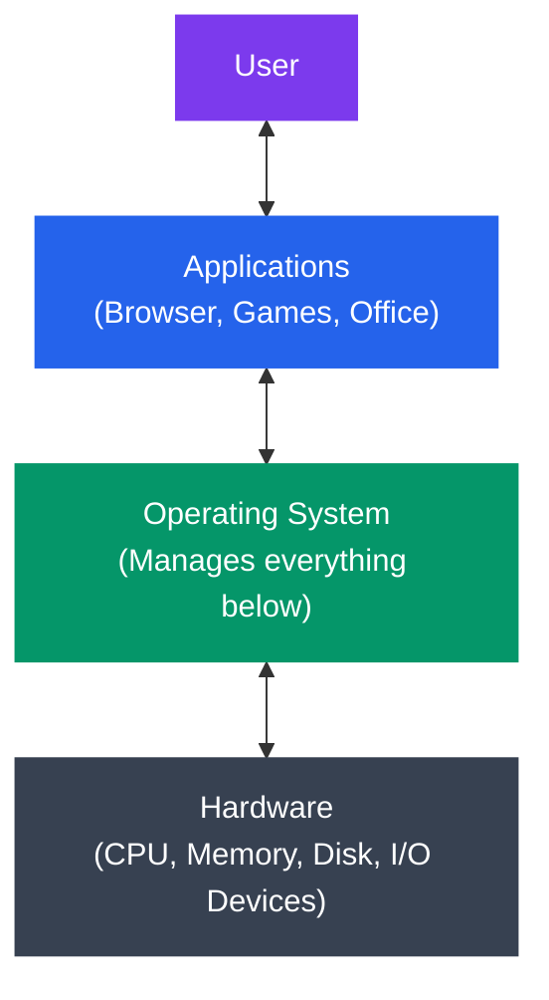
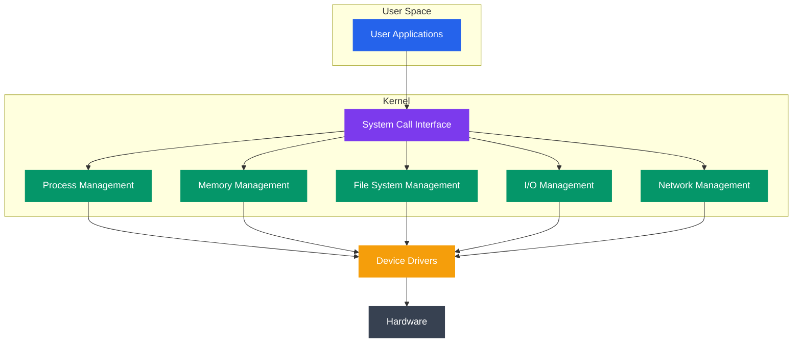

# Introduction to Operating Systems

## What You'll Learn

- Operating system kya hota hai aur uski core responsibilities kya hain
- OS jo services deta hai
- Operating systems ki history ka short tour
- Major operating systems (Linux, Windows, macOS, Unix)
- OS kaise hardware aur software ke beech interface ka kaam karta hai

## Operating System Kya Hai?

Socho tum ek naye office mein join kar rahe ho. Waha ek HR/admin team hoti hai jo sab kuch manage karti hai — desk allot karna, laptop dena, WiFi access dena, security card banwana, meeting rooms book karna. Tumhe khud jaake IT department se cable milane ki zarurat nahi padti, tum bas apna kaam karte ho aur admin team background mein sab manage karti rehti hai.

**Operating System (OS)** bilkul yehi role play karta hai computer ke andar. Yeh ek system software hai jo hardware, memory, storage, aur doosre resources ko manage karta hai, aur applications ko ek common, easy-to-use interface deta hai. OS user/applications aur actual hardware ke beech ka **middleman** hai — bina OS ke, tumhe Chrome browser likhte waqt yeh bhi sochna padta ki hard disk ka konsa sector use karna hai, ya keyboard se input kaise read karna hai. Bilkul waise hi jaise agar Zomato na ho, toh tumhe restaurant ka number khud dhoondhna padega, khud call karke order dena padega, khud delivery boy arrange karna padega. Zomato ek layer ban jaata hai jo yeh sab complexity chhupa deta hai — tum bas app kholte ho aur "Order" dabate ho.

### Simple Definition

```
Operating System = Resource Manager + Interface

The OS:
1. Manages hardware (CPU, memory, storage, devices)
2. Provides interface for users and applications
3. Ensures security and protection
4. Optimizes resource utilization
```

### Layered View

Neeche diagram dekho — yeh dikhata hai ki user, application, OS aur hardware kaise ek doosre ke upar layered hain. Har layer sirf apne neeche wali layer se baat karta hai, upar wali layer ko implementation details pata nahi hoti.



```
[User]
   ↕
[Applications] (Browser, Games, Office)
   ↕
[Operating System] (Manages everything below)
   ↕
[Hardware] (CPU, Memory, Disk, I/O Devices)
```

## Operating System Ki Zarurat Kyun Padi?

### OS ke Bina:

Zara imagine karo, agar OS na ho toh har programmer ko apna game ya app likhte waqt hardware ka poora driver khud likhna padega. Matlab Chrome banane wale ko yeh bhi decide karna padega ki disk ke kaunse physical sector mein file save hogi. Bilkul waise jaise agar Swiggy na ho toh har restaurant ko khud apni delivery fleet rakhni padegi, khud app banana padega, khud payment gateway integrate karna padega — bahut zyada duplicate kaam aur chaos.

```
Problems:
❌ Each program must include hardware drivers
❌ No protection between programs
❌ Can't run multiple programs simultaneously
❌ Complex hardware management
❌ No resource sharing
❌ Programs tied to specific hardware
```

### OS ke Saath:

```
Benefits:
✅ Abstraction - Programs don't need to know hardware details
✅ Isolation - Programs can't interfere with each other
✅ Multitasking - Run multiple programs at once
✅ Resource management - Fair allocation of resources
✅ Security - Access control and protection
✅ Portability - Same program runs on different hardware
```

> [!tip]
> Yeh soch ke dekho — Node.js mein jab tum `fs.readFile()` call karte ho, tumhe pata bhi nahi hota disk ke andar data kaha stored hai. Yeh sab abstraction OS + filesystem ki wajah se possible hai.

## Operating System Ki Core Responsibilities

### 1. Process Management

**Kya hota hai?** Process management ka matlab hai — running programs (jinhe "processes" kehte hain) ko create karna, unhe CPU time dena, unhe pause/resume karna, aur unke beech communication set up karna.

```
Responsibilities:
- Creating and deleting processes
- Scheduling processes on CPU
- Suspending and resuming processes
- Process synchronization
- Inter-process communication
```

**Example**: Jab tum Chrome open karte ho, OS yeh sab karta hai:
1. Chrome ke liye ek naya process banata hai
2. Uske liye memory allocate karta hai
3. Use CPU pe run karne ke liye schedule karta hai
4. Uska file access manage karta hai
5. Jab tum close karte ho, sab cleanup kar deta hai

Socho isko IRCTC ki tarah — jab ek naya passenger ticket book karta hai, system ek naya "booking request" create karta hai, use process karta hai queue mein daal ke, aur confirm hone ke baad resources release kar deta hai.

### 2. Memory Management

**Kya hota hai?** Yeh computer ke RAM ko manage karne ka kaam hai — kaunsa program kitni memory use kar raha hai, kaunsi memory free hai, aur agar RAM kam pade toh kya karna hai.

```
Responsibilities:
- Allocating memory to processes
- Tracking which memory is used/free
- Swapping processes between RAM and disk (virtual memory)
- Protecting process memory from other processes
```

**Example**: Tumhare laptop mein 8 GB RAM hai, lekin tum jo programs chala rahe ho unhe total 12 GB chahiye:

```
OS Solution:
- Keeps active programs in RAM (8 GB)
- Moves inactive portions to disk (swap space)
- Swaps data between RAM and disk as needed
```

Yeh bilkul BigBasket ke warehouse jaisa hai — jo items abhi high demand mein hain (fast-moving), unhe front shelf pe rakha jaata hai (RAM), aur jo rarely order hote hain unhe godown mein bhej diya jaata hai (disk/swap). Jab zarurat pade, godown se wapas la sakte ho, thoda slow hota hai but kaam chal jaata hai.

> [!warning]
> Agar swapping bahut zyada hone lage (RAM chhoti aur demand bahut zyada), toh system bahut slow ho jaata hai — isko "thrashing" kehte hain. Isiliye production servers mein RAM sizing important hoti hai.

### 3. File System Management

**Kya hota hai?** Data ko persistently (permanently) store aur organize karne ka kaam. Tumhare files, folders, unki permissions — sab kuch file system manage karta hai.

```
Responsibilities:
- Creating, reading, writing, deleting files
- Directory structure management
- File permissions and access control
- Mapping files to physical storage
- Backup and recovery
```

**Example**: File path translation

```
User sees: /home/user/documents/report.pdf
OS sees:    Disk 0, Sector 12345, Blocks 100-125
```

Jaise tumhe UPI transaction karte waqt sirf "Ramesh ko 500 rupaye bhejo" dikhta hai, lekin backend mein bank accounts, IFSC codes, NPCI routing sab hota hai — tumhe woh complexity dikhti nahi. File system bhi bilkul yehi karta hai; tumhe sirf readable path dikhta hai, actual disk ke sectors/blocks OS handle karta hai.

### 4. Device Management (I/O Management)

**Kya hota hai?** Keyboard, mouse, printer, disk, network card — in sab input/output devices ko manage karna.

```
Responsibilities:
- Device drivers for hardware
- Buffering and caching I/O
- Scheduling I/O operations
- Error handling
```

**Example**: Document print karna

```
Flow:
Application → OS Print Service → Printer Driver → Hardware
```

### 5. Security and Protection

**Kyun zaruri hai?** Agar koi bhi process kisi bhi doosre process ki memory ya file ko chhu sake, toh system bilkul unsafe ho jaayega — ek malicious app poora system crash kar sakta hai ya data chura sakta hai. OS ka kaam hai boundaries banake rakhna, jaise CRED app tumhare bank details ko doosre apps se completely isolate rakhta hai.

```
Responsibilities:
- User authentication (login)
- Access control (file permissions)
- Preventing unauthorized access
- Protecting processes from each other
- Virus and malware protection
```

**Example**: Linux file permissions

```
-rw-r--r-- report.txt
│││││││││└─ Others: read only
││││││└└└─ Group: read only
│││└└└───── Owner: read and write
└─────────── Regular file
```

### 6. Networking

**Kya hota hai?** OS network connections aur communication ko bhi handle karta hai — internet pe data bhejna/receive karna, sockets banana, security dekhna.

```
Responsibilities:
- Network protocol implementation (TCP/IP)
- Socket management
- Network security
- Routing and packet forwarding
```

## Operating System Services

### Users Ke Liye Services

1. **User Interface**

   ```
   Types:
   - CLI (Command Line Interface): bash, cmd, PowerShell
   - GUI (Graphical User Interface): Windows, macOS, GNOME
   - Touch Interface: Android, iOS
   ```

2. **Program Execution**

   ```
   Services:
   - Load program into memory
   - Run the program
   - Handle normal/abnormal termination
   ```

3. **I/O Operations**

   ```
   Services:
   - Reading files
   - Writing to disk
   - Keyboard input
   - Screen output
   ```

4. **File System Manipulation**

   ```
   Services:
   - Create, delete, rename files
   - Search for files
   - List directory contents
   - Manage permissions
   ```

5. **Communication**

   ```
   Between processes:
   - Shared memory
   - Message passing
   
   Between computers:
   - Network sockets
   - Remote procedure calls
   ```

6. **Error Detection and Handling**

   ```
   Detect errors in:
   - CPU
   - Memory
   - I/O devices
   - User programs
   ```

### System Efficiency Ke Liye Services

1. **Resource Allocation**
   - CPU time
   - Memory space
   - File storage
   - I/O devices

2. **Accounting**
   - Track resource usage
   - Billing information
   - Performance statistics

3. **Protection and Security**
   - Control access to resources
   - Authenticate users
   - Defend against attacks

## Operating Systems Ki Short History

Chalo ab thoda time-travel karte hain aur dekhte hain ki OS ka concept kaise evolve hua — computer science ka "from scratch" journey.

### 1940s-1950s: First Generation

Shuru mein OS jaisa kuch tha hi nahi. Programmer khud directly hardware ko program karta tha — matlab tar aur switches se instructions dete the.

```
Characteristics:
- No operating system
- Direct hardware programming
- One program at a time
- Vacuum tubes and plugboards

Example: ENIAC, UNIVAC
```

### 1950s-1960s: Second Generation - Batch Systems

Ab jobs ko punch cards pe likha jaata tha, operator inko ek "batch" mein daal ke machine ko de deta tha, aur machine sequentially inhe process karti thi. Bilkul aise jaise railway station pe purane zamane mein saari applications collect karke ek saath process ki jaati thi, ek-ek karke counter pe nahi.

```
Characteristics:
- Batch processing
- Jobs submitted on punch cards
- Operator loads batch of jobs
- Sequential execution

Innovation: Reduce setup time between jobs

Example Systems: IBM 7094, FMS (Fortran Monitor System)
```

### 1960s-1970s: Third Generation - Multiprogramming

Yaha se cheezein interesting hoti hain — ab multiple programs same time pe memory mein rehte the, aur CPU unke beech switch karta tha. Time-sharing systems aaye, jisse multiple users ek hi computer ko interactively use kar sakte the — jaise ek cyber cafe mein alag-alag terminal se log ek hi server use karte hain.

```
Characteristics:
- Multiple programs in memory
- CPU switches between them
- Time-sharing systems
- Interactive computing

Innovation: Multiple users simultaneously

Example Systems:
- MULTICS
- Unix (1969) - Ken Thompson and Dennis Ritchie
- OS/360 (IBM)
```

### 1970s-1980s: Fourth Generation - Personal Computers

Ab microprocessors aa gaye aur computer chhota, saste, aur ghar-ghar mein pahunchne wala ban gaya. GUI ka concept bhi yahin se emerge hua.

```
Characteristics:
- Microprocessor-based computers
- Single-user systems
- Graphical user interfaces (GUI)

Major OS:
- CP/M (1974)
- Apple DOS (1978)
- MS-DOS (1981)
- Mac OS (1984)
- Windows 1.0 (1985)
```

### 1990s: Modern Operating Systems

```
Characteristics:
- True multitasking
- Networking built-in
- Internet-ready
- 32-bit architecture

Major Releases:
- Linux (1991) - Linus Torvalds
- Windows 95 (1995)
- Mac OS X (2001)
```

> [!info]
> Linux ki kahani interesting hai — Linus Torvalds ek Finnish student the jo apna khud ka Unix-like OS banana chahte the (Unix mehenga tha aur proprietary). Unhone 1991 mein Linux kernel ko internet pe free release kar diya, aur duniya bhar ke developers ne mil ke isko improve karna shuru kar diya. Aaj ka result — Linux poori duniya ke servers, cloud, aur Android phones ko power karta hai.

### 2000s-Present: Contemporary Era

```
Characteristics:
- 64-bit systems
- Multi-core support
- Mobile operating systems
- Cloud and distributed systems
- Virtualization and containers

Major OS:
- Android (2008)
- iOS (2007)
- Chrome OS (2011)
- Windows 10/11
- macOS (continued evolution)
- Linux distributions
```

## Major Operating Systems

### 1. Unix and Unix-like Systems

Unix ko sabka "dadaji" bol sakte ho — bahut sare modern OS (Linux, macOS, BSD variants) isi ke concepts pe based hain.

```
Unix (1969):
- Multi-user, multitasking
- Portable (written in C)
- Hierarchical file system
- Powerful shell

Unix Derivatives:
- Solaris (Sun/Oracle)
- AIX (IBM)
- HP-UX (HP)
- BSD (FreeBSD, OpenBSD, NetBSD)
- macOS (Darwin kernel, BSD-based)
```

### 2. Linux

```
Linux (1991):
- Open-source, free
- Unix-like
- Highly customizable
- Dominant in servers, supercomputers

Popular Distributions:
- Ubuntu (user-friendly)
- Debian (stable)
- Red Hat Enterprise Linux (RHEL)
- CentOS / Rocky Linux
- Fedora
- Arch Linux (minimal, DIY)
- Android (mobile)
```

Node.js developer hone ke naate tumhe yeh pata hoga ki almost saare production servers (AWS EC2, Docker containers, Kubernetes nodes) Linux pe hi chalte hain. Isiliye jab tum `docker run node:20` karte ho, andar ek lightweight Linux distro hi chal raha hota hai.

**Linux Architecture**:

```
[Applications]
     ↓
[System Libraries (glibc)]
     ↓
[System Call Interface]
     ↓
[Linux Kernel]
     ↓
[Hardware]
```

### 3. Windows

```
Microsoft Windows:
- Dominant desktop OS (70%+ market share)
- Proprietary, closed-source
- User-friendly GUI
- Strong backwards compatibility

Major Versions:
- Windows NT family (modern)
  - Windows 2000
  - Windows XP
  - Windows 7
  - Windows 10
  - Windows 11
  - Windows Server
```

**Windows Architecture**:

```
[Applications]
     ↓
[Windows API (Win32)]
     ↓
[Executive Services]
     ↓
[Windows NT Kernel]
     ↓
[Hardware Abstraction Layer (HAL)]
     ↓
[Hardware]
```

### 4. macOS

```
macOS (formerly Mac OS X):
- Unix-based (Darwin kernel)
- Proprietary (Apple)
- Known for user experience
- Tight hardware integration

Architecture:
- Darwin kernel (XNU - hybrid kernel)
- BSD subsystem
- Mach microkernel base
- Aqua GUI
```

### 5. Mobile Operating Systems

```
Android (Google):
- Linux kernel-based
- Open-source (AOSP)
- 70%+ mobile market share
- Java/Kotlin apps

iOS (Apple):
- Unix-based (Darwin)
- Proprietary
- ~25% mobile market share
- Swift/Objective-C apps
```

## OS Ek Interface Ki Tarah

### Abstraction Layers

OS multiple levels pe abstraction provide karta hai — matlab har level pe complexity ko chhupa ke ek simpler, usable cheez de deta hai:

```
Level 1 - Hardware:
Physical CPU → OS abstracts to → Virtual CPUs (threads)

Level 2 - Memory:
Physical RAM → OS abstracts to → Virtual address spaces

Level 3 - Storage:
Disk sectors → OS abstracts to → Files and directories

Level 4 - Devices:
Hardware ports → OS abstracts to → Device files (/dev/)
```

Yeh bilkul Ola/Uber jaisa hai — tumhe pata nahi hota driver ki exact GPS coordinates ya engine ki RPM, tumhe bas "cab arriving in 5 mins" dikhta hai. App ne saari complexity ko abstract karke ek simple interface bana diya.

### System Call Interface

Applications OS se baat karte hain **system calls** ke through. Jab bhi tumhara code kuch aisa karta hai jisme hardware ya kernel-level resource ki zarurat ho (file padhna, network pe data bhejna, memory allocate karna), toh background mein ek system call fire hoti hai.

```c
// User program (C code)
#include <stdio.h>
#include <unistd.h>

int main() {
    // This printf() eventually calls write() system call
    printf("Hello, World!\n");
    
    // Direct system call
    write(1, "Direct system call\n", 19);
    
    return 0;
}
```

**Flow**:

```
Application (printf)
    ↓
C Library (glibc)
    ↓
System Call (write)
    ↓
Kernel
    ↓
Hardware (screen)
```

> [!tip]
> Node.js mein bhi jab tum `fs.writeFile()` ya `console.log()` call karte ho, andar hi andar V8/libuv ye system calls hi trigger karte hain (`write()`, `open()` waghera). Isiliye Node ka "non-blocking I/O" concept samajhne ke liye OS-level system calls samajhna helpful hota hai.

## OS Ke Components



```
┌─────────────────────────────────────┐
│         User Applications           │
├─────────────────────────────────────┤
│      System Call Interface          │
├─────────────────────────────────────┤
│   ┌─────────────────────────────┐   │
│   │   Process Management        │   │
│   ├─────────────────────────────┤   │
│   │   Memory Management         │   │
│   ├─────────────────────────────┤   │
│   │   File System Management    │   │
│   ├─────────────────────────────┤   │
│   │   I/O Management            │   │
│   ├─────────────────────────────┤   │
│   │   Network Management        │   │
│   └─────────────────────────────┘   │
│          Kernel                      │
├─────────────────────────────────────┤
│         Device Drivers              │
├─────────────────────────────────────┤
│           Hardware                  │
└─────────────────────────────────────┘
```

## Real-World Example: Web Browser Kholna

Chalo ek practical example se samajhte hain — jab tum Chrome ke icon pe double-click karte ho, tab OS ke andar kya-kya hota hai step by step:

```
1. User Action:
   - Double-click Chrome icon

2. OS Receives Event:
   - Mouse driver detects click
   - GUI system identifies icon clicked
   - OS locates Chrome executable file

3. Process Creation:
   - OS creates new process for Chrome
   - Allocates process ID (PID)
   - Creates memory address space

4. Memory Allocation:
   - OS loads Chrome binary into memory
   - Allocates heap for dynamic memory
   - Sets up stack for function calls

5. Resource Setup:
   - Opens file descriptors (stdin, stdout, stderr)
   - Sets up network sockets (if needed)
   - Grants necessary permissions

6. CPU Scheduling:
   - OS adds Chrome to ready queue
   - Scheduler assigns CPU time
   - Chrome begins execution

7. Runtime:
   - Chrome makes system calls for file access, network, etc.
   - OS manages Chrome's resource requests
   - OS protects Chrome from other processes

8. User Closes Chrome:
   - Chrome terminates
   - OS reclaims memory
   - OS closes file descriptors
   - OS removes process from system
```

Isko dekh ke samajh aata hai ki jab tum bas "double-click" karte ho, uske peeche OS bahut sara silent kaam karta hai — bilkul jaise Swiggy pe order karte waqt tumhe sirf "Order Placed" dikhta hai, lekin backend mein restaurant notify hota hai, delivery partner assign hota hai, payment process hota hai — sab kuch chhupa hua hota hai.

## Operating System Performance Metrics

| Metric | Description | Example |
|--------|-------------|---------|
| **Throughput** | Number of processes completed per unit time | 100 processes/minute |
| **Turnaround Time** | Time from submission to completion | 5 seconds per process |
| **Response Time** | Time from request to first response | 100ms for web request |
| **CPU Utilization** | Percentage of time CPU is busy | 75% utilization |
| **Memory Utilization** | Percentage of memory in use | 6 GB / 8 GB = 75% |
| **I/O Efficiency** | Effective use of I/O devices | Disk read/write speed |

## Exercises

### Beginner
1. OS ki paanch main responsibilities list karo
2. Pata karo tum konsa OS use kar rahe ho aur uska version dekho:
   ```bash
   # Linux
   uname -a
   cat /etc/os-release
   
   # macOS
   sw_vers
   
   # Windows (PowerShell)
   Get-ComputerInfo | Select-Object WindowsVersion
   ```
3. Task Manager (Windows) ya Activity Monitor (macOS) ya System Monitor (Linux) khol ke observe karo:
   - Kitne processes chal rahe hain?
   - Kitni memory use ho rahi hai?
   - Konsa process sabse zyada CPU use kar raha hai?

### Intermediate
4. Ek file read operation ke liye application se hardware tak ka path trace karo
5. Research karo aur explain karo kernel mode aur user mode mein kya fark hai
6. Linux aur Windows architectures ko compare karo
7. 10 system calls list karo aur unka purpose likho (Linux pe `man syscalls` use karo)

### Advanced
8. Ek simple C program likho jo directly system calls use kare:
   ```c
   // Use open(), read(), write(), close() instead of fopen(), fread(), etc.
   ```
9. Research karo tumhara OS virtual memory kaise implement karta hai
10. Apne OS ka boot process analyze karo aur bootloader aur init system identify karo

## Key Takeaways

- Operating system hardware resources manage karta hai aur applications ko services provide karta hai
- Core responsibilities: process, memory, file, I/O, security, networking
- OS hardware aur software ke beech abstraction layers deta hai
- Major OS families: Unix/Linux, Windows, macOS, mobile (Android/iOS)
- Applications OS se system calls ke through interact karte hain
- OS batch systems se evolve hoke aaj ke modern multi-user, multitasking systems tak pahuncha hai

## Next Steps

Continue to [OS Architecture and Structure](./02_os_architecture.md) to learn about different operating system architectures and designs.

---

[← Back to Fundamentals](./README.md) | [Next: OS Architecture and Structure →](./02_os_architecture.md)
