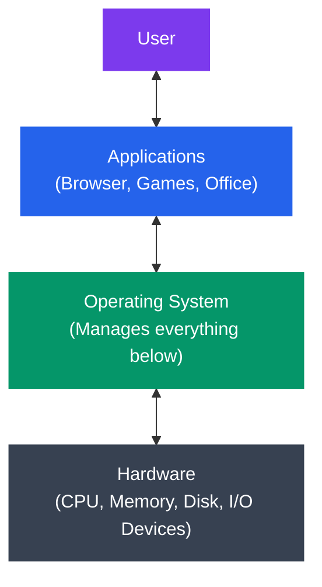
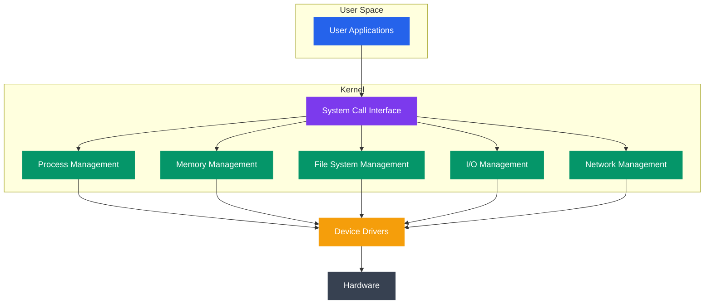

# Introduction to Operating Systems

## What You'll Learn

- What an operating system is and its core responsibilities
- Services provided by operating systems
- Brief history of operating systems evolution
- Major operating systems (Linux, Windows, macOS, Unix)
- How OS acts as interface between hardware and software

## What is an Operating System?

An **operating system (OS)** is system software that manages computer hardware, software resources, and provides common services for computer programs. It acts as an intermediary between users/applications and the computer hardware.

### Simple Definition

```
Operating System = Resource Manager + Interface

The OS:
1. Manages hardware (CPU, memory, storage, devices)
2. Provides interface for users and applications
3. Ensures security and protection
4. Optimizes resource utilization
```

### Layered View



```
[User]
   ↕
[Applications] (Browser, Games, Office)
   ↕
[Operating System] (Manages everything below)
   ↕
[Hardware] (CPU, Memory, Disk, I/O Devices)
```

## Why Do We Need an Operating System?

### Without an OS:

```
Problems:
❌ Each program must include hardware drivers
❌ No protection between programs
❌ Can't run multiple programs simultaneously
❌ Complex hardware management
❌ No resource sharing
❌ Programs tied to specific hardware
```

### With an OS:

```
Benefits:
✅ Abstraction - Programs don't need to know hardware details
✅ Isolation - Programs can't interfere with each other
✅ Multitasking - Run multiple programs at once
✅ Resource management - Fair allocation of resources
✅ Security - Access control and protection
✅ Portability - Same program runs on different hardware
```

## Core Responsibilities of an Operating System

### 1. Process Management

Managing execution of programs (processes).

```
Responsibilities:
- Creating and deleting processes
- Scheduling processes on CPU
- Suspending and resuming processes
- Process synchronization
- Inter-process communication
```

**Example**: When you open Chrome, the OS:
1. Creates a process for Chrome
2. Allocates memory for it
3. Schedules it to run on CPU
4. Manages its file access
5. Cleans up when you close it

### 2. Memory Management

Managing the computer's RAM.

```
Responsibilities:
- Allocating memory to processes
- Tracking which memory is used/free
- Swapping processes between RAM and disk (virtual memory)
- Protecting process memory from other processes
```

**Example**: Your computer has 8 GB RAM, but you run programs needing 12 GB total:
```
OS Solution:
- Keeps active programs in RAM (8 GB)
- Moves inactive portions to disk (swap space)
- Swaps data between RAM and disk as needed
```

### 3. File System Management

Organizing and storing data persistently.

```
Responsibilities:
- Creating, reading, writing, deleting files
- Directory structure management
- File permissions and access control
- Mapping files to physical storage
- Backup and recovery
```

**Example**: File path translation
```
User sees: /home/user/documents/report.pdf
OS sees:    Disk 0, Sector 12345, Blocks 100-125
```

### 4. Device Management (I/O Management)

Managing input/output devices.

```
Responsibilities:
- Device drivers for hardware
- Buffering and caching I/O
- Scheduling I/O operations
- Error handling
```

**Example**: Printing a document
```
Flow:
Application → OS Print Service → Printer Driver → Hardware
```

### 5. Security and Protection

Ensuring system integrity and protecting resources.

```
Responsibilities:
- User authentication (login)
- Access control (file permissions)
- Preventing unauthorized access
- Protecting processes from each other
- Virus and malware protection
```

**Example**: Linux file permissions
```
-rw-r--r-- report.txt
│││││││││└─ Others: read only
││││││└└└─ Group: read only
│││└└└───── Owner: read and write
└─────────── Regular file
```

### 6. Networking

Managing network connections and communication.

```
Responsibilities:
- Network protocol implementation (TCP/IP)
- Socket management
- Network security
- Routing and packet forwarding
```

## Operating System Services

### Services for Users

1. **User Interface**
   ```
   Types:
   - CLI (Command Line Interface): bash, cmd, PowerShell
   - GUI (Graphical User Interface): Windows, macOS, GNOME
   - Touch Interface: Android, iOS
   ```

2. **Program Execution**
   ```
   Services:
   - Load program into memory
   - Run the program
   - Handle normal/abnormal termination
   ```

3. **I/O Operations**
   ```
   Services:
   - Reading files
   - Writing to disk
   - Keyboard input
   - Screen output
   ```

4. **File System Manipulation**
   ```
   Services:
   - Create, delete, rename files
   - Search for files
   - List directory contents
   - Manage permissions
   ```

5. **Communication**
   ```
   Between processes:
   - Shared memory
   - Message passing
   
   Between computers:
   - Network sockets
   - Remote procedure calls
   ```

6. **Error Detection and Handling**
   ```
   Detect errors in:
   - CPU
   - Memory
   - I/O devices
   - User programs
   ```

### Services for System Efficiency

1. **Resource Allocation**
   - CPU time
   - Memory space
   - File storage
   - I/O devices

2. **Accounting**
   - Track resource usage
   - Billing information
   - Performance statistics

3. **Protection and Security**
   - Control access to resources
   - Authenticate users
   - Defend against attacks

## Brief History of Operating Systems

### 1940s-1950s: First Generation

```
Characteristics:
- No operating system
- Direct hardware programming
- One program at a time
- Vacuum tubes and plugboards

Example: ENIAC, UNIVAC
```

### 1950s-1960s: Second Generation - Batch Systems

```
Characteristics:
- Batch processing
- Jobs submitted on punch cards
- Operator loads batch of jobs
- Sequential execution

Innovation: Reduce setup time between jobs

Example Systems: IBM 7094, FMS (Fortran Monitor System)
```

### 1960s-1970s: Third Generation - Multiprogramming

```
Characteristics:
- Multiple programs in memory
- CPU switches between them
- Time-sharing systems
- Interactive computing

Innovation: Multiple users simultaneously

Example Systems:
- MULTICS
- Unix (1969) - Ken Thompson and Dennis Ritchie
- OS/360 (IBM)
```

### 1970s-1980s: Fourth Generation - Personal Computers

```
Characteristics:
- Microprocessor-based computers
- Single-user systems
- Graphical user interfaces (GUI)

Major OS:
- CP/M (1974)
- Apple DOS (1978)
- MS-DOS (1981)
- Mac OS (1984)
- Windows 1.0 (1985)
```

### 1990s: Modern Operating Systems

```
Characteristics:
- True multitasking
- Networking built-in
- Internet-ready
- 32-bit architecture

Major Releases:
- Linux (1991) - Linus Torvalds
- Windows 95 (1995)
- Mac OS X (2001)
```

### 2000s-Present: Contemporary Era

```
Characteristics:
- 64-bit systems
- Multi-core support
- Mobile operating systems
- Cloud and distributed systems
- Virtualization and containers

Major OS:
- Android (2008)
- iOS (2007)
- Chrome OS (2011)
- Windows 10/11
- macOS (continued evolution)
- Linux distributions
```

## Major Operating Systems

### 1. Unix and Unix-like Systems

```
Unix (1969):
- Multi-user, multitasking
- Portable (written in C)
- Hierarchical file system
- Powerful shell

Unix Derivatives:
- Solaris (Sun/Oracle)
- AIX (IBM)
- HP-UX (HP)
- BSD (FreeBSD, OpenBSD, NetBSD)
- macOS (Darwin kernel, BSD-based)
```

### 2. Linux

```
Linux (1991):
- Open-source, free
- Unix-like
- Highly customizable
- Dominant in servers, supercomputers

Popular Distributions:
- Ubuntu (user-friendly)
- Debian (stable)
- Red Hat Enterprise Linux (RHEL)
- CentOS / Rocky Linux
- Fedora
- Arch Linux (minimal, DIY)
- Android (mobile)
```

**Linux Architecture**:
```
[Applications]
     ↓
[System Libraries (glibc)]
     ↓
[System Call Interface]
     ↓
[Linux Kernel]
     ↓
[Hardware]
```

### 3. Windows

```
Microsoft Windows:
- Dominant desktop OS (70%+ market share)
- Proprietary, closed-source
- User-friendly GUI
- Strong backwards compatibility

Major Versions:
- Windows NT family (modern)
  - Windows 2000
  - Windows XP
  - Windows 7
  - Windows 10
  - Windows 11
  - Windows Server
```

**Windows Architecture**:
```
[Applications]
     ↓
[Windows API (Win32)]
     ↓
[Executive Services]
     ↓
[Windows NT Kernel]
     ↓
[Hardware Abstraction Layer (HAL)]
     ↓
[Hardware]
```

### 4. macOS

```
macOS (formerly Mac OS X):
- Unix-based (Darwin kernel)
- Proprietary (Apple)
- Known for user experience
- Tight hardware integration

Architecture:
- Darwin kernel (XNU - hybrid kernel)
- BSD subsystem
- Mach microkernel base
- Aqua GUI
```

### 5. Mobile Operating Systems

```
Android (Google):
- Linux kernel-based
- Open-source (AOSP)
- 70%+ mobile market share
- Java/Kotlin apps

iOS (Apple):
- Unix-based (Darwin)
- Proprietary
- ~25% mobile market share
- Swift/Objective-C apps
```

## OS as an Interface

### Abstraction Layers

The OS provides abstraction at multiple levels:

```
Level 1 - Hardware:
Physical CPU → OS abstracts to → Virtual CPUs (threads)

Level 2 - Memory:
Physical RAM → OS abstracts to → Virtual address spaces

Level 3 - Storage:
Disk sectors → OS abstracts to → Files and directories

Level 4 - Devices:
Hardware ports → OS abstracts to → Device files (/dev/)
```

### System Call Interface

Applications interact with OS through **system calls**:

```c
// User program (C code)
#include <stdio.h>
#include <unistd.h>

int main() {
    // This printf() eventually calls write() system call
    printf("Hello, World!\n");
    
    // Direct system call
    write(1, "Direct system call\n", 19);
    
    return 0;
}
```

**Flow**:
```
Application (printf)
    ↓
C Library (glibc)
    ↓
System Call (write)
    ↓
Kernel
    ↓
Hardware (screen)
```

## OS Components



```
┌─────────────────────────────────────┐
│         User Applications           │
├─────────────────────────────────────┤
│      System Call Interface          │
├─────────────────────────────────────┤
│   ┌─────────────────────────────┐   │
│   │   Process Management        │   │
│   ├─────────────────────────────┤   │
│   │   Memory Management         │   │
│   ├─────────────────────────────┤   │
│   │   File System Management    │   │
│   ├─────────────────────────────┤   │
│   │   I/O Management            │   │
│   ├─────────────────────────────┤   │
│   │   Network Management        │   │
│   └─────────────────────────────┘   │
│          Kernel                      │
├─────────────────────────────────────┤
│         Device Drivers              │
├─────────────────────────────────────┤
│           Hardware                  │
└─────────────────────────────────────┘
```

## Real-World Example: Opening a Web Browser

Let's trace what happens when you double-click Chrome:

```
1. User Action:
   - Double-click Chrome icon

2. OS Receives Event:
   - Mouse driver detects click
   - GUI system identifies icon clicked
   - OS locates Chrome executable file

3. Process Creation:
   - OS creates new process for Chrome
   - Allocates process ID (PID)
   - Creates memory address space

4. Memory Allocation:
   - OS loads Chrome binary into memory
   - Allocates heap for dynamic memory
   - Sets up stack for function calls

5. Resource Setup:
   - Opens file descriptors (stdin, stdout, stderr)
   - Sets up network sockets (if needed)
   - Grants necessary permissions

6. CPU Scheduling:
   - OS adds Chrome to ready queue
   - Scheduler assigns CPU time
   - Chrome begins execution

7. Runtime:
   - Chrome makes system calls for file access, network, etc.
   - OS manages Chrome's resource requests
   - OS protects Chrome from other processes

8. User Closes Chrome:
   - Chrome terminates
   - OS reclaims memory
   - OS closes file descriptors
   - OS removes process from system
```

## Operating System Performance Metrics

| Metric | Description | Example |
|--------|-------------|---------|
| **Throughput** | Number of processes completed per unit time | 100 processes/minute |
| **Turnaround Time** | Time from submission to completion | 5 seconds per process |
| **Response Time** | Time from request to first response | 100ms for web request |
| **CPU Utilization** | Percentage of time CPU is busy | 75% utilization |
| **Memory Utilization** | Percentage of memory in use | 6 GB / 8 GB = 75% |
| **I/O Efficiency** | Effective use of I/O devices | Disk read/write speed |

## Exercises

### Beginner
1. List the five main responsibilities of an operating system
2. Identify which OS you're using and find its version:
   ```bash
   # Linux
   uname -a
   cat /etc/os-release
   
   # macOS
   sw_vers
   
   # Windows (PowerShell)
   Get-ComputerInfo | Select-Object WindowsVersion
   ```
3. Open Task Manager (Windows) or Activity Monitor (macOS) or System Monitor (Linux) and observe:
   - How many processes are running?
   - How much memory is being used?
   - Which process uses the most CPU?

### Intermediate
4. Trace the path from application to hardware for a file read operation
5. Research and explain the difference between kernel mode and user mode
6. Compare and contrast Linux and Windows architectures
7. List 10 system calls and their purposes (use `man syscalls` on Linux)

### Advanced
8. Write a simple C program that uses system calls directly:
   ```c
   // Use open(), read(), write(), close() instead of fopen(), fread(), etc.
   ```
9. Research how your OS implements virtual memory
10. Analyze your OS boot process and identify the bootloader and init system used

## Key Takeaways

- Operating systems manage hardware resources and provide services to applications
- Core responsibilities: process, memory, file, I/O, security, networking
- OS provides abstraction layers between hardware and software
- Major OS families: Unix/Linux, Windows, macOS, mobile (Android/iOS)
- Applications interact with OS through system calls
- OS evolved from batch systems to modern multi-user, multitasking systems

## Next Steps

Continue to [OS Architecture and Structure](./02_os_architecture.md) to learn about different operating system architectures and designs.

---

[← Back to Fundamentals](./README.md) | [Next: OS Architecture and Structure →](./02_os_architecture.md)
