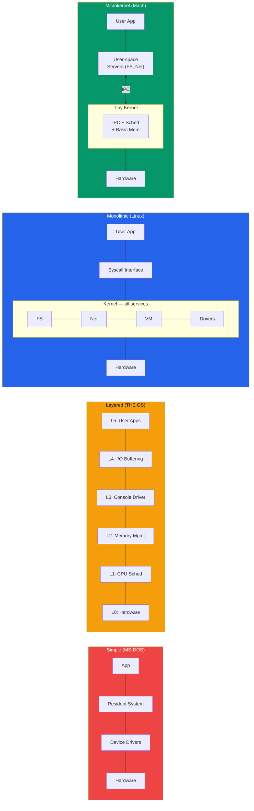

# OS Architecture and Structure

## What You'll Learn

- Different approaches to structuring an operating system
- Simple/monolithic structure (MS-DOS)
- Layered approach to OS design (THE OS)
- Monolithic kernel architecture (Linux)
- Microkernel architecture (Minix, QNX, Mach)
- Hybrid kernel architecture (Windows NT, macOS XNU)
- Modular approach with loadable kernel modules
- Trade-offs between architectures in performance, security, and maintainability

## Why Does OS Structure Matter?

How an operating system is structured affects everything: performance, reliability, security, and maintainability. A poorly structured OS is hard to debug, extend, and secure. Over decades, several approaches have emerged, each with distinct trade-offs.



```
Key Design Goals:
- Performance     → Minimize overhead in common operations
- Reliability     → Isolate faults so one bug doesn't crash everything
- Security        → Enforce boundaries between components
- Extensibility   → Easy to add new features and drivers
- Maintainability → Readable, testable, modular code
```

## 1. Simple Structure (No Clear Architecture)

Early operating systems had no well-defined structure. All code ran in a single address space with minimal separation between components.

### MS-DOS Example

MS-DOS was not divided into modules. Applications could access hardware directly, with almost no protection.

```
┌─────────────────────────────┐
│     Application Programs    │  ← Could directly access I/O
├─────────────────────────────┤
│   Resident System Program   │
├─────────────────────────────┤
│   MS-DOS Device Drivers     │
├─────────────────────────────┤
│   ROM BIOS Device Drivers   │
├─────────────────────────────┤
│        Hardware              │
└─────────────────────────────┘

Problem: No separation of concerns
- Applications can write directly to hardware
- A single bug can crash the entire system
- No memory protection between programs
```

### Characteristics

```
Advantages:
+ Simple to implement
+ Low overhead (no mode switching)
+ Fast for single-user, single-task scenarios

Disadvantages:
- No protection between components
- Extremely difficult to debug
- Cannot support multiple users or tasks safely
- Security is nonexistent
```

## 2. Layered Approach

The layered approach organizes the OS into a hierarchy of layers. Each layer only uses services from the layer directly below it. Dijkstra's THE operating system (1968) was the first to use this approach.

### THE OS Layer Structure

```
┌─────────────────────────────────────┐
│  Layer 5: User Programs             │
├─────────────────────────────────────┤
│  Layer 4: Buffering for I/O         │
├─────────────────────────────────────┤
│  Layer 3: Operator Console Driver   │
├─────────────────────────────────────┤
│  Layer 2: Memory Management         │
├─────────────────────────────────────┤
│  Layer 1: CPU Scheduling            │
├─────────────────────────────────────┤
│  Layer 0: Hardware                  │
└─────────────────────────────────────┘

Rule: Layer N can ONLY call Layer N-1
      Layer N-1 cannot call Layer N
```

### Design Principle

```c
/*
 * Layered OS design principle:
 * Each layer provides services to the layer above
 * and uses services from the layer below.
 */

// Layer 1: CPU Scheduling
void schedule_process(process_t *proc) {
    // Uses Layer 0 (hardware) for timer interrupts
    set_timer_interrupt(TIME_QUANTUM);
    context_switch(proc);
}

// Layer 2: Memory Management (uses Layer 1)
void *allocate_memory(size_t size) {
    // Uses scheduling to manage waiting processes
    // when memory is not available
    while (!memory_available(size)) {
        yield_cpu();  // Calls Layer 1
    }
    return get_free_block(size);
}
```

### Characteristics

```
Advantages:
+ Clear separation of concerns
+ Easy to debug (test layer by layer from bottom up)
+ Each layer hides implementation details from higher layers
+ Straightforward to verify correctness

Disadvantages:
- Difficult to define layers cleanly (circular dependencies)
- Performance overhead from passing through multiple layers
- Inflexible — hard to rearrange or add layers later
- Real OS components don't always fit neatly into layers
```

## 3. Monolithic Kernel

In a monolithic kernel, the entire OS runs as a single program in kernel space. All services — process management, memory management, file systems, device drivers — share the same address space.

### Linux Monolithic Kernel Architecture

```
┌───────────────────────────────────────────────┐
│              User Space                        │
│   ┌──────┐  ┌──────┐  ┌──────┐  ┌──────┐     │
│   │ bash │  │ vim  │  │ gcc  │  │ httpd│     │
│   └──┬───┘  └──┬───┘  └──┬───┘  └──┬───┘     │
├──────┼─────────┼────────┼─────────┼───────────┤
│      │    System Call Interface (int 0x80 /    │
│      │         syscall instruction)            │
├──────┼─────────┼────────┼─────────┼───────────┤
│      ▼         ▼        ▼         ▼            │
│  ┌────────────────────────────────────────┐    │
│  │            Kernel Space                │    │
│  │                                        │    │
│  │  ┌──────────┐ ┌──────────┐ ┌───────┐  │    │
│  │  │ Process  │ │ Memory   │ │ File  │  │    │
│  │  │ Manager  │ │ Manager  │ │Systems│  │    │
│  │  └──────────┘ └──────────┘ └───────┘  │    │
│  │  ┌──────────┐ ┌──────────┐ ┌───────┐  │    │
│  │  │ Network  │ │  Device  │ │  IPC  │  │    │
│  │  │  Stack   │ │ Drivers  │ │       │  │    │
│  │  └──────────┘ └──────────┘ └───────┘  │    │
│  │                                        │    │
│  │  All components share the same address │    │
│  │  space and can call each other directly│    │
│  └────────────────────────────────────────┘    │
├───────────────────────────────────────────────┤
│                 Hardware                       │
└───────────────────────────────────────────────┘
```

### Linux Kernel Module Example

```c
/* hello_module.c - A simple Linux kernel module */
#include <linux/init.h>
#include <linux/module.h>
#include <linux/kernel.h>

MODULE_LICENSE("GPL");
MODULE_AUTHOR("Student");
MODULE_DESCRIPTION("A simple kernel module");

static int __init hello_init(void) {
    printk(KERN_INFO "Hello from kernel module!\n");
    return 0;
}

static void __exit hello_exit(void) {
    printk(KERN_INFO "Goodbye from kernel module!\n");
}

module_init(hello_init);
module_exit(hello_exit);
```

```bash
# Build and load a kernel module
make -C /lib/modules/$(uname -r)/build M=$(pwd) modules
sudo insmod hello_module.ko     # Load module
lsmod | grep hello              # Verify loaded
sudo rmmod hello_module         # Unload module
dmesg | tail                    # Check kernel log
```

### Characteristics

```
Advantages:
+ High performance (no IPC overhead between components)
+ Direct function calls between subsystems
+ Mature, well-tested (Linux has decades of development)
+ Efficient — all kernel code shares one address space

Disadvantages:
- A bug in any driver can crash the entire kernel
- Large codebase is hard to maintain (Linux: 30M+ lines)
- Adding features requires recompiling or using modules
- Security: a compromised driver has full kernel access
```

## 4. Microkernel Architecture

A microkernel moves as much functionality as possible out of the kernel into user-space servers. The kernel provides only the bare minimum: IPC, basic scheduling, and memory management.

### Microkernel Structure

```
┌─────────────────────────────────────────────────────┐
│                    User Space                        │
│  ┌──────┐ ┌──────┐ ┌──────┐ ┌───────┐ ┌─────────┐  │
│  │ File │ │Device│ │Network│ │Process│ │  User   │  │
│  │Server│ │Driver│ │Server │ │Server │ │  Apps   │  │
│  └──┬───┘ └──┬───┘ └──┬───┘ └───┬───┘ └────┬────┘  │
│     │        │        │         │           │        │
│     └────────┴────────┴────┬────┴───────────┘        │
│                            │ IPC (message passing)   │
├────────────────────────────┼─────────────────────────┤
│                            ▼                         │
│  ┌──────────────────────────────────────────────┐    │
│  │              Microkernel                      │    │
│  │  - IPC (message passing)                      │    │
│  │  - Basic scheduling                           │    │
│  │  - Low-level memory management                │    │
│  │  - Interrupt handling                         │    │
│  └──────────────────────────────────────────────┘    │
├──────────────────────────────────────────────────────┤
│                     Hardware                         │
└──────────────────────────────────────────────────────┘
```

### IPC in a Microkernel

```
File Read Operation - Microkernel vs Monolithic:

Monolithic (Linux):
  App → syscall → Kernel (VFS → FS driver → disk driver) → App
  Total transitions: 2 (user→kernel, kernel→user)

Microkernel:
  App → IPC → Kernel → IPC → File Server → IPC → Kernel →
  IPC → Disk Driver → IPC → Kernel → IPC → File Server →
  IPC → Kernel → IPC → App
  Total transitions: many more context switches
```

### Examples of Microkernels

```
Minix 3:
- Created by Andrew Tanenbaum (educational OS)
- Self-healing: can restart crashed drivers automatically
- ~6,000 lines of kernel code

QNX Neutrino:
- Real-time microkernel OS
- Used in automotive (BlackBerry QNX), medical devices
- POSIX-compliant
- Extremely reliable

Mach:
- Developed at Carnegie Mellon University
- Foundation for macOS (XNU kernel uses Mach)
- Introduced concept of ports for IPC
```

### Characteristics

```
Advantages:
+ Fault isolation — a crashed driver doesn't crash the kernel
+ Security — smaller kernel means smaller attack surface
+ Easier to verify correctness (smaller codebase)
+ Can restart failed services without rebooting
+ Portable — minimal hardware-specific code in kernel

Disadvantages:
- Performance overhead from IPC (message passing)
- More complex communication between components
- Harder to achieve high throughput for I/O operations
- Fewer production systems use pure microkernels
```

## 5. Hybrid Kernel

A hybrid kernel combines ideas from monolithic and microkernel designs. It keeps some services in kernel space for performance while maintaining a modular design. Most modern commercial operating systems use this approach.

### Windows NT Hybrid Architecture

```
┌─────────────────────────────────────────────────┐
│                  User Mode                       │
│  ┌────────────┐ ┌───────────┐ ┌──────────────┐  │
│  │ Win32 Apps │ │ POSIX Apps│ │  OS/2 Apps   │  │
│  └─────┬──────┘ └─────┬─────┘ └──────┬───────┘  │
│        │              │              │           │
│  ┌─────┴──────┐ ┌─────┴─────┐ ┌─────┴───────┐  │
│  │ Win32      │ │ POSIX     │ │ OS/2        │  │
│  │ Subsystem  │ │ Subsystem │ │ Subsystem   │  │
│  └─────┬──────┘ └─────┬─────┘ └──────┬───────┘  │
├────────┼──────────────┼──────────────┼───────────┤
│        ▼   Kernel Mode ▼              ▼          │
│  ┌───────────────────────────────────────────┐   │
│  │            Executive Services             │   │
│  │  ┌────────┐ ┌──────┐ ┌──────┐ ┌───────┐  │   │
│  │  │  I/O   │ │Object│ │Memory│ │Process│  │   │
│  │  │Manager │ │Mgr   │ │Mgr   │ │Mgr    │  │   │
│  │  └────────┘ └──────┘ └──────┘ └───────┘  │   │
│  ├───────────────────────────────────────────┤   │
│  │               NT Kernel                   │   │
│  ├───────────────────────────────────────────┤   │
│  │     Hardware Abstraction Layer (HAL)      │   │
│  └───────────────────────────────────────────┘   │
├──────────────────────────────────────────────────┤
│                   Hardware                       │
└──────────────────────────────────────────────────┘
```

### macOS XNU Hybrid Architecture

```
┌─────────────────────────────────────────────┐
│              User Space                      │
│  ┌────────┐  ┌────────┐  ┌──────────────┐   │
│  │  Aqua  │  │ Cocoa  │  │  POSIX Apps  │   │
│  │  GUI   │  │  Apps  │  │  (Terminal)  │   │
│  └────┬───┘  └───┬────┘  └──────┬───────┘   │
├───────┼──────────┼──────────────┼────────────┤
│       ▼          ▼              ▼             │
│  ┌───────────────────────────────────────┐   │
│  │           XNU Kernel                  │   │
│  │                                       │   │
│  │  ┌─────────────┐  ┌──────────────┐    │   │
│  │  │    Mach      │  │     BSD      │    │   │
│  │  │ (microkernel │  │  (monolithic │    │   │
│  │  │  component)  │  │  component)  │    │   │
│  │  │             │  │             │    │   │
│  │  │ - IPC/ports  │  │ - VFS       │    │   │
│  │  │ - VM         │  │ - Networking│    │   │
│  │  │ - Scheduling │  │ - POSIX API │    │   │
│  │  └─────────────┘  └──────────────┘    │   │
│  │  ┌────────────────────────────────┐   │   │
│  │  │         I/O Kit (drivers)      │   │   │
│  │  └────────────────────────────────┘   │   │
│  └───────────────────────────────────────┘   │
├──────────────────────────────────────────────┤
│                  Hardware                    │
└──────────────────────────────────────────────┘
```

### Characteristics

```
Advantages:
+ Better performance than pure microkernel
+ More modular than pure monolithic
+ Subsystem architecture allows multiple personalities
+ HAL provides hardware portability (Windows NT)

Disadvantages:
- Complexity of combining two approaches
- Still vulnerable to kernel-mode driver crashes
- Harder to classify and reason about
- "Worst of both worlds" criticism (not as fast as monolithic,
  not as reliable as microkernel)
```

## 6. Modular Approach (Loadable Kernel Modules)

Modern monolithic kernels like Linux use loadable kernel modules (LKMs) to achieve modularity without the overhead of a microkernel. Modules can be loaded and unloaded at runtime.

```
┌──────────────────────────────────────────────┐
│                Kernel Core                    │
│  ┌──────────────────────────────────────┐    │
│  │  Process Management  │  Memory Mgmt  │    │
│  ├──────────────────────┴───────────────┤    │
│  │         Core Kernel Services         │    │
│  └──────────────┬───────────────────────┘    │
│                 │                             │
│    ┌────────────┼────────────┐                │
│    ▼            ▼            ▼                │
│  ┌─────┐   ┌──────┐   ┌──────────┐          │
│  │ ext4 │   │ USB  │   │ iptables │  ← LKMs │
│  │ module│   │driver│   │ module   │          │
│  └─────┘   └──────┘   └──────────┘          │
│                                              │
│  Modules can be loaded/unloaded at runtime   │
│  without rebooting the system                │
└──────────────────────────────────────────────┘
```

```bash
# Working with Linux kernel modules
lsmod                           # List loaded modules
modinfo ext4                    # Info about a module
sudo modprobe vfat              # Load a module (with dependencies)
sudo modprobe -r vfat           # Unload a module
ls /lib/modules/$(uname -r)/    # Module directory
```

### Characteristics

```
Advantages:
+ Flexibility of microkernel (load only what you need)
+ Performance of monolithic (modules run in kernel space)
+ No reboot needed to add new functionality
+ Smaller kernel image (drivers loaded on demand)

Disadvantages:
- Modules still run in kernel space (crash = kernel crash)
- No fault isolation between modules
- Dependency management between modules
- Security risk — malicious modules have full kernel access
```

## Architecture Comparison Table

| Feature | Simple | Layered | Monolithic | Microkernel | Hybrid | Modular |
|---------|--------|---------|------------|-------------|--------|---------|
| **Performance** | High | Low | High | Low-Medium | Medium-High | High |
| **Reliability** | Very Low | Medium | Medium | High | Medium-High | Medium |
| **Security** | None | Medium | Medium | High | Medium-High | Medium |
| **Maintainability** | Very Low | High | Low | High | Medium | Medium-High |
| **Extensibility** | Low | Low | Medium | High | Medium | High |
| **Complexity** | Low | Medium | High | Medium | Very High | Medium |
| **Fault Isolation** | None | Partial | None | Full | Partial | None |
| **Real Examples** | MS-DOS | THE OS | Linux | Minix, QNX | Windows NT, macOS | Linux (with LKMs) |

## Choosing an Architecture

```
Use Simple Structure when:
→ Single-purpose embedded device, no protection needed

Use Layered when:
→ Teaching OS concepts, formal verification required

Use Monolithic when:
→ Maximum performance is critical (servers, desktops)

Use Microkernel when:
→ Reliability is paramount (medical, aviation, automotive)

Use Hybrid when:
→ Balance of performance, modularity, and compatibility

Use Modular when:
→ Need flexibility within a monolithic design (Linux)
```

## Practical Example: Checking Your OS Architecture

```bash
# Linux: Check kernel type
uname -r                   # Kernel version
cat /proc/version           # Detailed kernel info

# Check loaded kernel modules (monolithic + modular)
lsmod | head -20

# Count kernel modules
lsmod | wc -l

# Check kernel configuration
cat /boot/config-$(uname -r) | grep CONFIG_MODULES

# macOS: XNU (hybrid) information
uname -v                   # Darwin kernel version
sysctl kern.version        # Detailed kernel info
kextstat | head -10        # List loaded kernel extensions
```

## Exercises

### Beginner
1. Draw from memory the diagram for each architecture type: simple, layered, monolithic, microkernel, and hybrid.
2. Run `uname -r` and `lsmod` on a Linux system. How many modules are loaded? What does this tell you about the kernel's architecture?
3. Explain in your own words why MS-DOS is considered a "simple structure" OS.

### Intermediate
4. Compare the path a file read request takes in a monolithic kernel vs a microkernel. Count the number of context switches in each case.
5. Research why the Linux kernel chose a monolithic design rather than a microkernel. Read about the Torvalds-Tanenbaum debate and summarize both arguments.
6. Write a simple Linux kernel module (use the template above) that prints your name to the kernel log when loaded and unloaded.

### Advanced
7. Download and examine the Minix 3 source code. Identify the user-space servers (file system, network, etc.) and explain how they communicate with the microkernel.
8. Compare the XNU kernel's Mach and BSD layers. Which services live in each layer and why?
9. Design a hypothetical OS architecture for a self-driving car. Justify your choice of kernel type based on reliability, real-time, and performance requirements.

## Key Takeaways

- OS architecture determines the trade-offs between performance, reliability, and maintainability
- Simple/no-structure designs (MS-DOS) offer no protection and are unsuitable for modern systems
- The layered approach provides clean separation but suffers from performance overhead
- Monolithic kernels (Linux) are fast but a single bug in any component can crash the system
- Microkernels (Minix, QNX) isolate faults to individual servers at the cost of IPC overhead
- Hybrid kernels (Windows NT, macOS XNU) combine monolithic performance with microkernel modularity
- Loadable kernel modules give monolithic kernels the flexibility to add/remove functionality at runtime
- No architecture is universally best — the choice depends on the system's requirements

---

[← Previous: Introduction to OS](./01_introduction_to_os.md) | [Next: System Calls →](./03_system_calls.md)
