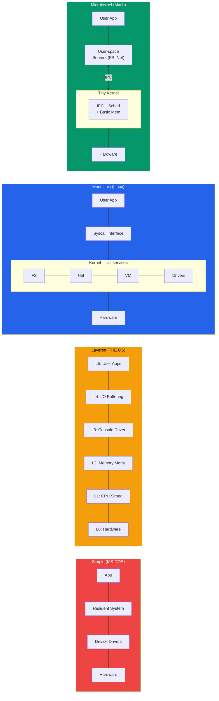

# OS Architecture and Structure

## Kya Seekhoge Is File Mein

- OS ko structure karne ke alag-alag tareeke
- Simple/monolithic structure (MS-DOS)
- Layered approach (THE OS)
- Monolithic kernel architecture (Linux)
- Microkernel architecture (Minix, QNX, Mach)
- Hybrid kernel architecture (Windows NT, macOS XNU)
- Modular approach — loadable kernel modules
- Performance, security aur maintainability mein trade-offs

## OS Ka Structure Itna Matter Kyun Karta Hai?

Socho tum Zomato jaisa ek bada system bana rahe ho. Ab do options hain — ek, poora system ek hi bade monolith mein likh do jahan order service, payment service, restaurant service sab ek hi codebase mein mixed hain. Doosra, sabko clean microservices mein tod do jahan har service apna kaam karti hai aur baaki services se message bhej ke baat karti hai.

Dono approach kaam karengi, lekin trade-offs bilkul alag hain — performance, reliability, security, aur maintainability sab pe farak padega. Bilkul yahi decision Operating System banane wale engineers ko bhi lena padta hai. Kaise crash isolate hoga? Kaun sa component kaunsa privilege rakhega? Naya feature add karna kitna aasan hoga? Pichle 50+ saalon mein OS designers ne alag-alag approaches try ki hain, aur har ek ka apna trade-off hai — koi ek "best" answer nahi hai.

Yeh samajhna zaruri hai ki "OS architecture" ka matlab sirf ek academic diagram nahi hai jo tum exam mein bana ke bhool jaate ho. Yeh decision seedha affect karta hai ki:
- Jab tumhara laptop ka WiFi driver crash ho, toh poora system hang hota hai ya sirf WiFi disconnect hota hai?
- Naya file system support add karne ke liye kya poora OS recompile karna padega, ya bas ek plugin load karna hoga?
- Ek malicious app kya seedha disk ko corrupt kar sakti hai, ya beech mein koi security layer hai?

Yeh sab sawaal answer karta hai — "OS Architecture".



```
Key Design Goals:
- Performance     → Minimize overhead in common operations
- Reliability     → Isolate faults so one bug doesn't crash everything
- Security        → Enforce boundaries between components
- Extensibility   → Easy to add new features and drivers
- Maintainability → Readable, testable, modular code
```

Yeh paanch goals hi har architecture decision ke peeche ka "why" hain. Jab bhi kisi kernel design ko dekho, poocho — is design ne in paanch mein se kaunsa goal prioritize kiya, aur kaunsa sacrifice kiya? Koi bhi single architecture in paanchon mein perfect score nahi le sakti — yeh ek zero-sum game jaisa hai. Jaise agar tum apne backend mein bahut zyada validation/checks daaloge, security badhegi lekin performance thodi kam hogi. Bilkul waisa hi trade-off yahan bhi chalta hai.

## 1. Simple Structure (Koi Clear Architecture Nahi)

**Kya hota hai?** Purane zamane ke operating systems mein koi well-defined structure nahi hota tha. Sara code ek hi address space mein chalta tha, components ke beech mein bilkul minimal separation.

**Kyun aisa design hua?** Us waqt (1970s-80s) hardware bahut limited tha — RAM kilobytes mein hoti thi, CPU single-tasking karta tha. Memory protection hardware (MMU) bhi expensive tha, toh engineers ne simplicity aur speed ko priority di, security ko nahi — kyunki us waqt "ek user, ek machine" model hi common tha, koi multi-user server nahi hota tha ghar pe.

### MS-DOS Example

Socho ek chhota sa dukaan hai jahan malik khud counter pe baitha hai, khud stock manage kar raha hai, khud cash bhi sambhal raha hai — koi departments nahi, koi checks nahi. Yahi tha MS-DOS. Yeh modules mein divide nahi tha. Applications directly hardware access kar sakti thi, bina kisi protection ke.

```
┌─────────────────────────────┐
│     Application Programs    │  ← Could directly access I/O
├─────────────────────────────┤
│   Resident System Program   │
├─────────────────────────────┤
│   MS-DOS Device Drivers     │
├─────────────────────────────┤
│   ROM BIOS Device Drivers   │
├─────────────────────────────┤
│        Hardware              │
└─────────────────────────────┘

Problem: No separation of concerns
- Applications can write directly to hardware
- A single bug can crash the entire system
- No memory protection between programs
```

Yaha problem yeh thi ki agar ek chhota sa game apna buggy code likh de aur galti se video memory ke bahar likh de, toh poora system crash ho jaata tha. Koi security guard nahi tha jo bole "ruko, yeh tumhara area nahi hai." Bilkul aise jaise agar Swiggy delivery boy directly restaurant ke kitchen mein ghus ke apna order khud bana le — koi rok-tok nahi. Ya socho, agar Paytm ka ek buggy feature seedha bank ke server ke database tables ko modify kar sake bina kisi API contract ke — chaos ho jayega.

**Kaise dikhta tha practically?** Agar tumne MS-DOS pe koi program chalaya jo bhool se ek galat memory address pe likh de, toh koi "segmentation fault" nahi aata tha jaise aaj Linux pe aata hai — seedha system freeze ya reboot ho jaata tha. Isiliye purane games mein "Press Ctrl+Alt+Del to restart" bahut common sight thi.

### Characteristics

```
Advantages:
+ Simple to implement
+ Low overhead (no mode switching)
+ Fast for single-user, single-task scenarios

Disadvantages:
- No protection between components
- Extremely difficult to debug
- Cannot support multiple users or tasks safely
- Security is nonexistent
```

> [!warning]
> Simple structure sirf tab theek hai jab ek hi trusted program chal raha ho (jaise ek embedded microwave ka controller). Multi-user, multi-tasking duniya ke liye yeh bilkul unsafe hai.

**Aaj kahan milta hai?** Bilkul yeh model mar nahi gaya — bahut saare tiny embedded systems (jaise ek washing machine ka controller, ek basic calculator chip) aaj bhi is tarah kaam karte hain, kyunki wahan sirf ek hi trusted firmware chalta hai aur koi third-party app install nahi hoti. Jahan trust ki zarurat hi nahi, wahan protection ka overhead bhi nahi chahiye.

## 2. Layered Approach

**Kya hota hai?** Layered approach OS ko layers ke hierarchy mein organize karta hai. Har layer sirf apne seedhe neeche wali layer ki services use kar sakti hai — upar wali ko access nahi kar sakti, aur neeche wali ko upar wali ke baare mein pata bhi nahi hota. Dijkstra ka THE operating system (1968) is approach ko use karne wala sabse pehla tha.

Socho yeh bilkul ek corporate hierarchy jaisa hai — junior developer apne team lead se hi baat karega, seedha CEO ko call nahi karega. Har level apna specific kaam karta hai aur sirf apne immediate niche wale level ki services use karta hai. Ya socho ek IRCTC jaisa system jahan booking layer seedha database ko touch nahi karta — pehle payment layer se confirm hota hai, phir seat allocation layer, phir database layer — har layer apna kaam karke agli layer ko sirf clean interface deti hai.

### THE OS Layer Structure

```
┌─────────────────────────────────────┐
│  Layer 5: User Programs             │
├─────────────────────────────────────┤
│  Layer 4: Buffering for I/O         │
├─────────────────────────────────────┤
│  Layer 3: Operator Console Driver   │
├─────────────────────────────────────┤
│  Layer 2: Memory Management         │
├─────────────────────────────────────┤
│  Layer 1: CPU Scheduling            │
├─────────────────────────────────────┤
│  Layer 0: Hardware                  │
└─────────────────────────────────────┘

Rule: Layer N can ONLY call Layer N-1
      Layer N-1 cannot call Layer N
```

### Design Principle

Yeh rule strict hai — Layer 2 (Memory Management) sirf Layer 1 (CPU Scheduling) ko call kar sakta hai, upar Layer 3 ko bilkul touch nahi kar sakta. Isse code predictable aur testable ban jaata hai.

```c
/*
 * Layered OS design principle:
 * Each layer provides services to the layer above
 * and uses services from the layer below.
 */

// Layer 1: CPU Scheduling
void schedule_process(process_t *proc) {
    // Uses Layer 0 (hardware) for timer interrupts
    set_timer_interrupt(TIME_QUANTUM);
    context_switch(proc);
}

// Layer 2: Memory Management (uses Layer 1)
void *allocate_memory(size_t size) {
    // Uses scheduling to manage waiting processes
    // when memory is not available
    while (!memory_available(size)) {
        yield_cpu();  // Calls Layer 1
    }
    return get_free_block(size);
}
```

Yaha dekho — `allocate_memory` (Layer 2) `yield_cpu()` (Layer 1) ko call kar raha hai, kyunki memory available nahi hai toh process ko wait karwana padega. Layer 2 kabhi bhi Layer 3 ya usse upar ki kisi cheez ko touch nahi karega. Yeh strictness hi is design ki taakat hai — jaise ek clean layered web app mein Controller seedha Database query nahi likhta, wo Service layer ko call karta hai, jo Repository layer ko call karti hai. Har layer apni responsibility tak simit rehti hai.

### Characteristics

```
Advantages:
+ Clear separation of concerns
+ Easy to debug (test layer by layer from bottom up)
+ Each layer hides implementation details from higher layers
+ Straightforward to verify correctness
```

Debugging ka fayda yeh hai — jaise CI/CD pipeline mein tum bottom se test karte ho (unit test → integration test → e2e), yahan bhi Layer 0 ko pehle test karo, phir Layer 1, phir Layer 2 — agar Layer 0 sahi kaam kar raha hai toh upar wali layers ka bug dhoondhna aasan ho jaata hai. Yeh bilkul waisa hi hai jaise agar tumhare Node.js app ka API fail ho raha hai, toh pehle tum database connection check karoge (sabse neeche wali layer), fir ORM layer, fir business logic, fir API layer — bottom-up debugging.

```
Disadvantages:
- Difficult to define layers cleanly (circular dependencies)
- Performance overhead from passing through multiple layers
- Inflexible — hard to rearrange or add layers later
- Real OS components don't always fit neatly into layers
```

> [!info]
> Real duniya mein perfect layering karna mushkil hai — kabhi kabhi Memory Management ko Scheduling ki zarurat padti hai, aur Scheduling ko bhi Memory ki. Yeh circular dependency layered approach ke liye headache create karti hai. Isiliye pure layered OS design aajkal educational purpose ke alawa kam hi milta hai.

**Gotcha samajhna zaruri hai:** Layering ka overhead real hai — har request ko multiple layers se guzarna padta hai, jaise ek HTTP request jo Nginx → API Gateway → Auth Service → Business Layer → Database se guzre. Har hop pe thoda latency add hota hai. Isliye pure layered OS design production mein rare hai — modern kernels layering ki idea use toh karte hain (conceptually), lekin strict N-to-N-1 rule follow nahi karte, taaki performance na mare jaaye.

## 3. Monolithic Kernel

**Kya hota hai?** Monolithic kernel mein poora OS ek single program ki tarah kernel space mein chalta hai. Saari services — process management, memory management, file systems, device drivers — sab same address space share karte hain, aur ek dusre ko directly function call karke access kar sakte hain.

Socho ek bada joint family jaha sab ek hi ghar mein rehte hain — koi separate room nahi, koi door lock nahi, koi seedha doosre ke kamre mein ja sakta hai kisi bhi cheez ke liye. Fast hai kyunki koi permission mangni nahi padti, lekin agar ek member ne kitchen mein aag laga di toh poora ghar jal sakta hai.

### Linux Monolithic Kernel Architecture

```
┌───────────────────────────────────────────────┐
│              User Space                        │
│   ┌──────┐  ┌──────┐  ┌──────┐  ┌──────┐     │
│   │ bash │  │ vim  │  │ gcc  │  │ httpd│     │
│   └──┬───┘  └──┬───┘  └──┬───┘  └──┬───┘     │
├──────┼─────────┼────────┼─────────┼───────────┤
│      │    System Call Interface (int 0x80 /    │
│      │         syscall instruction)            │
├──────┼─────────┼────────┼─────────┼───────────┤
│      ▼         ▼        ▼         ▼            │
│  ┌────────────────────────────────────────┐    │
│  │            Kernel Space                │    │
│  │                                        │    │
│  │  ┌──────────┐ ┌──────────┐ ┌───────┐  │    │
│  │  │ Process  │ │ Memory   │ │ File  │  │    │
│  │  │ Manager  │ │ Manager  │ │Systems│  │    │
│  │  └──────────┘ └──────────┘ └───────┘  │    │
│  │  ┌──────────┐ ┌──────────┐ ┌───────┐  │    │
│  │  │ Network  │ │  Device  │ │  IPC  │  │    │
│  │  │  Stack   │ │ Drivers  │ │       │  │    │
│  │  └──────────┘ └──────────┘ └───────┘  │    │
│  │                                        │    │
│  │  All components share the same address │    │
│  │  space and can call each other directly│    │
│  └────────────────────────────────────────┘    │
├───────────────────────────────────────────────┤
│                 Hardware                       │
└───────────────────────────────────────────────┘
```

Linux exactly isi tarah kaam karta hai. Jab tum `bash` mein koi command chalate ho jo file padhti hai, toh internally File System module directly Memory Manager aur Device Driver ko call kar leta hai — koi message-passing ka overhead nahi, seedha function call, jaise ek hi codebase mein ek function doosre function ko call kare.

**Kyun monolithic design fast hai?** Function call bilkul cheap operation hai — bas ek jump instruction aur stack pe kuch push/pop. Jabki agar tumhe message bhejna pade (IPC), toh operating system ko context switch karna padta hai — ek process se doosre process mein control transfer karna, jo comparatively costly hai. Isliye monolithic kernel mein subsystems seedha ek doosre ko call karke fast raha lete hain.

### Linux Kernel Module Example

Linux monolithic hone ke bawajood extensible bhi hai — kyunki tum naye modules ko runtime pe load/unload kar sakte ho, bina poora kernel recompile kiye. Neeche ek simple example hai jo boot hote hi kuch print karta hai:

```c
/* hello_module.c - A simple Linux kernel module */
#include <linux/init.h>
#include <linux/module.h>
#include <linux/kernel.h>

MODULE_LICENSE("GPL");
MODULE_AUTHOR("Student");
MODULE_DESCRIPTION("A simple kernel module");

static int __init hello_init(void) {
    printk(KERN_INFO "Hello from kernel module!\n");
    return 0;
}

static void __exit hello_exit(void) {
    printk(KERN_INFO "Goodbye from kernel module!\n");
}

module_init(hello_init);
module_exit(hello_exit);
```

```bash
# Build and load a kernel module
make -C /lib/modules/$(uname -r)/build M=$(pwd) modules
sudo insmod hello_module.ko     # Load module
lsmod | grep hello              # Verify loaded
sudo rmmod hello_module         # Unload module
dmesg | tail                    # Check kernel log
```

`insmod` module ko load karta hai kernel space mein — bilkul dhyan rakhna, yeh module ab kernel ke same privilege level pe chal raha hai, matlab agar isme bug hai toh poora system crash ho sakta hai.

### Characteristics

```
Advantages:
+ High performance (no IPC overhead between components)
+ Direct function calls between subsystems
+ Mature, well-tested (Linux has decades of development)
+ Efficient — all kernel code shares one address space
```

Performance ka fayda seedha samajh aata hai — jaise ek monolith backend app mein ek function doosre function ko directly call kar leta hai (koi network hop nahi), waise hi monolithic kernel mein subsystems ek dusre ko directly call karte hain.

```
Disadvantages:
- A bug in any driver can crash the entire kernel
- Large codebase is hard to maintain (Linux: 30M+ lines)
- Adding features requires recompiling or using modules
- Security: a compromised driver has full kernel access
```

> [!warning]
> Linux kernel mein aaj 30 million+ lines of code hai. Ek buggy USB driver bhi poore system ko "kernel panic" (blue/black screen jaisa crash) mein daal sakta hai — kyunki driver bhi kernel ke same trust level pe chal raha hota hai.

**Common gotcha:** Bahut log sochte hain "Linux monolithic hai matlab pura kernel ek hi bade file mein likha hai" — galat baat. Monolithic ka matlab hai saari services *same address space* mein chalti hain, code physically alag-alag files/modules mein organized hai (fs/, net/, drivers/, mm/ directories dekho Linux source mein). "Monolithic" architecture ke baare mein hai (privilege boundary), file organization ke baare mein nahi.

## 4. Microkernel Architecture

**Kya hota hai?** Microkernel jitna ho sake utna functionality kernel ke bahar user-space servers mein nikaal deta hai. Kernel sirf bare minimum provide karta hai: IPC (inter-process communication), basic scheduling, aur memory management.

Isko aise socho — yeh ek building society hai jaha security guard (microkernel) sirf gate control karta hai, aur baaki sab kaam (electrician, plumber, cleaner) alag-alag contractors (user-space servers) karte hain jo society ke andar rehte hain, lekin society office ke through message bhej ke coordinate karte hain. Agar plumber contractor ka kaam kharab ho jaaye (crash), toh electrician ka kaam chalu rehta hai — poori society down nahi hoti.

### Microkernel Structure

```
┌─────────────────────────────────────────────────────┐
│                    User Space                        │
│  ┌──────┐ ┌──────┐ ┌──────┐ ┌───────┐ ┌─────────┐  │
│  │ File │ │Device│ │Network│ │Process│ │  User   │  │
│  │Server│ │Driver│ │Server │ │Server │ │  Apps   │  │
│  └──┬───┘ └──┬───┘ └──┬───┘ └───┬───┘ └────┬────┘  │
│     │        │        │         │           │        │
│     └────────┴────────┴────┬────┴───────────┘        │
│                            │ IPC (message passing)   │
├────────────────────────────┼─────────────────────────┤
│                            ▼                         │
│  ┌──────────────────────────────────────────────┐    │
│  │              Microkernel                      │    │
│  │  - IPC (message passing)                      │    │
│  │  - Basic scheduling                           │    │
│  │  - Low-level memory management                │    │
│  │  - Interrupt handling                         │    │
│  └──────────────────────────────────────────────┘    │
├──────────────────────────────────────────────────────┤
│                     Hardware                         │
└──────────────────────────────────────────────────────┘
```

Dekho — File Server, Device Driver, Network Server sab user space mein hain, kernel space mein nahi. Yeh bilkul microservices architecture jaisa hai jaha File Server ek independent service hai jo API calls (IPC messages) ke through baaki services se baat karti hai.

### IPC in a Microkernel

Ab yahi trade-off samajhna zaruri hai — jab har cheez ke liye message bhejna padta hai, toh ek simple file read operation bhi kaafi zyada "hops" leta hai:

```
File Read Operation - Microkernel vs Monolithic:

Monolithic (Linux):
  App → syscall → Kernel (VFS → FS driver → disk driver) → App
  Total transitions: 2 (user→kernel, kernel→user)

Microkernel:
  App → IPC → Kernel → IPC → File Server → IPC → Kernel →
  IPC → Disk Driver → IPC → Kernel → IPC → File Server →
  IPC → Kernel → IPC → App
  Total transitions: many more context switches
```

Bilkul aise samjho jaise UPI transaction mein agar har step pe alag bank ko manually call karna pade instead of ek unified payment gateway — jitne zyada hops, utna zyada latency. Microkernel mein har IPC call ek context switch hai (user→kernel→user), aur context switch CPU ke liye costly operation hai — CPU registers save karne hote hain, cache invalidate hoti hai, memory mapping switch karni padti hai. Yeh sab milaake ek "chhota sa tax" hai jo har operation pe lagta hai.

### Examples of Microkernels

```
Minix 3:
- Created by Andrew Tanenbaum (educational OS)
- Self-healing: can restart crashed drivers automatically
- ~6,000 lines of kernel code

QNX Neutrino:
- Real-time microkernel OS
- Used in automotive (BlackBerry QNX), medical devices
- POSIX-compliant
- Extremely reliable

Mach:
- Developed at Carnegie Mellon University
- Foundation for macOS (XNU kernel uses Mach)
- Introduced concept of ports for IPC
```

Minix 3 ka "self-healing" feature interesting hai — agar koi driver crash ho jaaye, toh microkernel usko automatically restart kar deta hai, bilkul jaise Kubernetes mein ek crashed pod ko automatically restart kiya jaata hai (self-healing infrastructure). QNX ka use automotive aur medical devices mein hota hai kyunki wahan reliability jaan-maal ka mamla hai — agar car ka infotainment crash bhi ho jaaye, toh braking system down nahi hona chahiye. Socho ek self-driving car ka sensor-processing module crash ho jaaye — agar poora system down ho gaya, toh accident ho sakta hai. Microkernel design mein sirf wahi module restart hota hai, baaki critical systems (brakes, steering) chalte rehte hain.

### Characteristics

```
Advantages:
+ Fault isolation — a crashed driver doesn't crash the kernel
+ Security — smaller kernel means smaller attack surface
+ Easier to verify correctness (smaller codebase)
+ Can restart failed services without rebooting
+ Portable — minimal hardware-specific code in kernel
```

```
Disadvantages:
- Performance overhead from IPC (message passing)
- More complex communication between components
- Harder to achieve high throughput for I/O operations
- Fewer production systems use pure microkernels
```

> [!tip]
> Yeh wahi trade-off hai jo microservices vs monolith mein bhi dikhta hai — microservices fault isolation aur independent scaling dete hain, lekin network calls ka overhead aata hai. Microkernel mein bhi bilkul yehi debate hai, bas network calls ki jagah IPC messages hain.

**Historical context — Torvalds vs Tanenbaum debate:** 1992 mein ek famous Usenet debate hua tha jahan Andrew Tanenbaum (Minix creator, microkernel supporter) ne Linus Torvalds ke monolithic Linux design ko "obsolete" bola tha. Torvalds ne counter-argue kiya ki practically monolithic kernel zyada performant aur maintainable hai real-world use ke liye. 30+ saal baad, Linux (monolithic) sabse zyada widely-used server/desktop kernel hai, jabki microkernels niche use-cases (real-time, safety-critical) mein hi popular reh gaye — lekin dono designs apni jagah sahi hain, depend karta hai use-case pe.

## 5. Hybrid Kernel

**Kya hota hai?** Hybrid kernel monolithic aur microkernel dono ideas ko combine karta hai. Yeh kuch services ko performance ke liye kernel space mein rakhta hai, lekin design ko modular bhi rakhta hai. Aaj ke zyadatar commercial operating systems (Windows, macOS) isi approach ko follow karte hain.

Socho isko aise — yeh ek modern startup jaisa hai jo purane monolith ka core fast rakhta hai (jaise checkout flow, jahan speed critical hai), lekin naye features ko separate modular services ki tarah design karta hai. Best of both worlds pane ki koshish, lekin dono ki complexity bhi saath aati hai.

### Windows NT Hybrid Architecture

```
┌─────────────────────────────────────────────────┐
│                  User Mode                       │
│  ┌────────────┐ ┌───────────┐ ┌──────────────┐  │
│  │ Win32 Apps │ │ POSIX Apps│ │  OS/2 Apps   │  │
│  └─────┬──────┘ └─────┬─────┘ └──────┬───────┘  │
│        │              │              │           │
│  ┌─────┴──────┐ ┌─────┴─────┐ ┌─────┴───────┐  │
│  │ Win32      │ │ POSIX     │ │ OS/2        │  │
│  │ Subsystem  │ │ Subsystem │ │ Subsystem   │  │
│  └─────┬──────┘ └─────┬─────┘ └──────┬───────┘  │
├────────┼──────────────┼──────────────┼───────────┤
│        ▼   Kernel Mode ▼              ▼          │
│  ┌───────────────────────────────────────────┐   │
│  │            Executive Services             │   │
│  │  ┌────────┐ ┌──────┐ ┌──────┐ ┌───────┐  │   │
│  │  │  I/O   │ │Object│ │Memory│ │Process│  │   │
│  │  │Manager │ │Mgr   │ │Mgr   │ │Mgr    │  │   │
│  │  └────────┘ └──────┘ └──────┘ └───────┘  │   │
│  ├───────────────────────────────────────────┤   │
│  │               NT Kernel                   │   │
│  ├───────────────────────────────────────────┤   │
│  │     Hardware Abstraction Layer (HAL)      │   │
│  └───────────────────────────────────────────┘   │
├──────────────────────────────────────────────────┤
│                   Hardware                       │
└──────────────────────────────────────────────────┘
```

Windows NT mein "Subsystems" (Win32, POSIX, OS/2) user mode mein alag-alag "personalities" provide karte hain — matlab ek hi kernel Windows apps aur POSIX apps dono ko chala sakta hai, alag-alag translation layers ke through. Neeche HAL (Hardware Abstraction Layer) ka fayda yeh hai ki Windows ko alag-alag hardware pe chalane ke liye kernel code badalne ki zarurat nahi — bas HAL badalta hai. Bilkul jaise ek app ka business logic same rahe, sirf database driver badal jaaye Postgres se MySQL.

### macOS XNU Hybrid Architecture

```
┌─────────────────────────────────────────────┐
│              User Space                      │
│  ┌────────┐  ┌────────┐  ┌──────────────┐   │
│  │  Aqua  │  │ Cocoa  │  │  POSIX Apps  │   │
│  │  GUI   │  │  Apps  │  │  (Terminal)  │   │
│  └────┬───┘  └───┬────┘  └──────┬───────┘   │
├───────┼──────────┼──────────────┼────────────┤
│       ▼          ▼              ▼             │
│  ┌───────────────────────────────────────┐   │
│  │           XNU Kernel                  │   │
│  │                                       │   │
│  │  ┌─────────────┐  ┌──────────────┐    │   │
│  │  │    Mach      │  │     BSD      │    │   │
│  │  │ (microkernel │  │  (monolithic │    │   │
│  │  │  component)  │  │  component)  │    │   │
│  │  │             │  │             │    │   │
│  │  │ - IPC/ports  │  │ - VFS       │    │   │
│  │  │ - VM         │  │ - Networking│    │   │
│  │  │ - Scheduling │  │ - POSIX API │    │   │
│  │  └─────────────┘  └──────────────┘    │   │
│  │  ┌────────────────────────────────┐   │   │
│  │  │         I/O Kit (drivers)      │   │   │
│  │  └────────────────────────────────┘   │   │
│  └───────────────────────────────────────┘   │
├──────────────────────────────────────────────┤
│                  Hardware                    │
└──────────────────────────────────────────────┘
```

XNU (macOS ka kernel) sabse interesting example hai — literally naam ka matlab hi hai "X is Not Unix". Isme Mach (microkernel jaisa hissa — IPC, VM, scheduling) aur BSD (monolithic style — VFS, networking, POSIX API) dono ek saath live karte hain, ek hi kernel ke andar. Yeh dono duniya ko jodne ki koshish hai — Mach se fault isolation ka benefit, aur BSD se mature, fast POSIX subsystem.

### Characteristics

```
Advantages:
+ Better performance than pure microkernel
+ More modular than pure monolithic
+ Subsystem architecture allows multiple personalities
+ HAL provides hardware portability (Windows NT)

Disadvantages:
- Complexity of combining two approaches
- Still vulnerable to kernel-mode driver crashes
- Harder to classify and reason about
- "Worst of both worlds" criticism (not as fast as monolithic,
  not as reliable as microkernel)
```

> [!info]
> Hybrid kernels ko critics kabhi kabhi "jack of all trades, master of none" bolte hain — na poora monolithic ki speed milti hai, na poora microkernel ki reliability. Phir bhi practical world mein yeh sabse common approach hai kyunki compatibility aur legacy support ke liye zaruri hai.

**Real-world lesson yahan** — bilkul software engineering mein bhi aisa hota hai. Bahut baar "purist" architecture (pure microservices, pure functional programming, pure monolithic) practically utna kaam nahi karta jitna theory mein lagta hai. Real production systems mostly hybrid approach lete hain jo pragmatic trade-offs karta hai — jaise ek Node.js app jo mostly monolith hai lekin heavy background jobs ke liye separate worker service use karta hai.

## 6. Modular Approach (Loadable Kernel Modules)

**Kya hota hai?** Modern monolithic kernels jaise Linux "loadable kernel modules" (LKMs) use karte hain taaki microkernel ke overhead ke bina bhi modularity mil sake. Modules ko runtime pe load aur unload kiya ja sakta hai — bina reboot kiye.

Isko aise socho — jaise ek e-commerce app (Flipkart) ka core checkout flow hamesha deployed rehta hai, lekin "festive sale banner" plugin ko tum runtime pe on/off kar sakte ho, bina poore app ko restart kiye. Linux mein bhi USB driver ya filesystem driver ko zarurat padne pe load karo, na ho toh unload kar do.

```
┌──────────────────────────────────────────────┐
│                Kernel Core                    │
│  ┌──────────────────────────────────────┐    │
│  │  Process Management  │  Memory Mgmt  │    │
│  ├──────────────────────┴───────────────┤    │
│  │         Core Kernel Services         │    │
│  └──────────────┬───────────────────────┘    │
│                 │                             │
│    ┌────────────┼────────────┐                │
│    ▼            ▼            ▼                │
│  ┌─────┐   ┌──────┐   ┌──────────┐          │
│  │ ext4 │   │ USB  │   │ iptables │  ← LKMs │
│  │ module│   │driver│   │ module   │          │
│  └─────┘   └──────┘   └──────────┘          │
│                                              │
│  Modules can be loaded/unloaded at runtime   │
│  without rebooting the system                │
└──────────────────────────────────────────────┘
```

```bash
# Working with Linux kernel modules
lsmod                           # List loaded modules
modinfo ext4                    # Info about a module
sudo modprobe vfat              # Load a module (with dependencies)
sudo modprobe -r vfat           # Unload a module
ls /lib/modules/$(uname -r)/    # Module directory
```

`modprobe` `insmod` se better hai kyunki yeh module ki dependencies bhi automatically resolve kar deta hai — bilkul `npm install` jaisa jo dependency tree khud resolve kar leta hai, jabki `insmod` sirf ek single file load karta hai (jaise manually ek `.js` file include karna bina package manager ke).

### Characteristics

```
Advantages:
+ Flexibility of microkernel (load only what you need)
+ Performance of monolithic (modules run in kernel space)
+ No reboot needed to add new functionality
+ Smaller kernel image (drivers loaded on demand)

Disadvantages:
- Modules still run in kernel space (crash = kernel crash)
- No fault isolation between modules
- Dependency management between modules
- Security risk — malicious modules have full kernel access
```

> [!warning]
> Yaad rakhna — LKM sirf "loading flexibility" deta hai, "fault isolation" nahi. Module fir bhi kernel space mein hi chalta hai, toh agar usme bug hai, poora kernel crash ho sakta hai — bilkul monolithic kernel jaisa hi risk.

**Ek common mistake jo naye log karte hain** — sochte hain ki LKM "sandboxed plugin" hai, jaise browser extension. Reality mein aisa bilkul nahi hai — jab tum `insmod` se ek `.ko` file load karte ho, yeh full kernel privilege le leta hai, jaise root access se bhi zyada powerful. Isliye production servers pe random third-party kernel modules load karna bahut risky maana jaata hai (rootkits isi tarah kaam karte hain — malicious kernel module load karke poore system ka control le lete hain).

## Architecture Comparison Table

| Feature | Simple | Layered | Monolithic | Microkernel | Hybrid | Modular |
|---------|--------|---------|------------|-------------|--------|---------|
| **Performance** | High | Low | High | Low-Medium | Medium-High | High |
| **Reliability** | Very Low | Medium | Medium | High | Medium-High | Medium |
| **Security** | None | Medium | Medium | High | Medium-High | Medium |
| **Maintainability** | Very Low | High | Low | High | Medium | Medium-High |
| **Extensibility** | Low | Low | Medium | High | Medium | High |
| **Complexity** | Low | Medium | High | Medium | Very High | Medium |
| **Fault Isolation** | None | Partial | None | Full | Partial | None |
| **Real Examples** | MS-DOS | THE OS | Linux | Minix, QNX | Windows NT, macOS | Linux (with LKMs) |

Is table ko dhyan se dekho — koi bhi ek row aisi nahi hai jahan sab kuch "High" ho. Har architecture ne kisi na kisi cheez ko trade-off kiya hai. Yeh engineering ka fundamental truth hai — free lunch nahi milta. Yeh CAP theorem jaisa hi ek trade-off triangle hai — tum har cheez ek saath maximize nahi kar sakte.

## Sahi Architecture Kaise Chuno

```
Use Simple Structure when:
→ Single-purpose embedded device, no protection needed

Use Layered when:
→ Teaching OS concepts, formal verification required

Use Monolithic when:
→ Maximum performance is critical (servers, desktops)

Use Microkernel when:
→ Reliability is paramount (medical, aviation, automotive)

Use Hybrid when:
→ Balance of performance, modularity, and compatibility

Use Modular when:
→ Need flexibility within a monolithic design (Linux)
```

Yeh bilkul waisa hi decision hai jaise tum ek naya backend system design karte waqt karte ho — chhota internal tool ke liye monolith kaafi hai, lekin agar life-critical system (jaise airplane control) bana rahe ho toh fault isolation (microkernel jaisa) sabse zaruri ho jaata hai, chahe performance thodi kam kyun na ho. Jaise interview mein bhi poochte hain "monolith vs microservices kab use karoge?" — is OS architecture decision ka bhi bilkul wahi flavor hai, bas scale kernel level pe hai.

## Practical Example: Apna OS Architecture Check Karna

Chalo apne machine pe try karte hain — yeh commands tumhe batayenge ki tumhara OS kaunsi architecture follow karta hai aur uske andar kya-kya load hai.

```bash
# Linux: Check kernel type
uname -r                   # Kernel version
cat /proc/version           # Detailed kernel info

# Check loaded kernel modules (monolithic + modular)
lsmod | head -20

# Count kernel modules
lsmod | wc -l

# Check kernel configuration
cat /boot/config-$(uname -r) | grep CONFIG_MODULES

# macOS: XNU (hybrid) information
uname -v                   # Darwin kernel version
sysctl kern.version        # Detailed kernel info
kextstat | head -10        # List loaded kernel extensions
```

`lsmod | wc -l` chalake dekho — jitne zyada modules loaded honge, utna clear pata chalega ki Linux ka modular approach kitna heavily use ho raha hai tumhari machine pe (WiFi driver, filesystem, network modules — sab LKM hi hain).

> [!tip]
> Agar tumhare paas WSL hai (jo Windows pe kaafi common setup hai tumhare jaise Node.js devs ke liye), toh WSL2 ek actual Linux kernel run karta hai — waha bhi `uname -r` aur `lsmod` try kar sakte ho aur dekh sakte ho ki underlying architecture kaisi dikhti hai.

## Exercises

### Beginner
1. Draw from memory the diagram for each architecture type: simple, layered, monolithic, microkernel, and hybrid.
2. Run `uname -r` and `lsmod` on a Linux system. How many modules are loaded? What does this tell you about the kernel's architecture?
3. Explain in your own words why MS-DOS is considered a "simple structure" OS.

### Intermediate
4. Compare the path a file read request takes in a monolithic kernel vs a microkernel. Count the number of context switches in each case.
5. Research why the Linux kernel chose a monolithic design rather than a microkernel. Read about the Torvalds-Tanenbaum debate and summarize both arguments.
6. Write a simple Linux kernel module (use the template above) that prints your name to the kernel log when loaded and unloaded.

### Advanced
7. Download and examine the Minix 3 source code. Identify the user-space servers (file system, network, etc.) and explain how they communicate with the microkernel.
8. Compare the XNU kernel's Mach and BSD layers. Which services live in each layer and why?
9. Design a hypothetical OS architecture for a self-driving car. Justify your choice of kernel type based on reliability, real-time, and performance requirements.

## Key Takeaways

- OS architecture yeh decide karta hai ki performance, reliability, aur maintainability mein kya trade-off milega
- Simple/no-structure designs (MS-DOS) koi protection nahi dete, modern systems ke liye unfit hain, lekin trusted embedded devices mein aaj bhi relevant hain
- Layered approach clean separation deta hai lekin performance overhead ke saath aata hai, aur circular dependencies real duniya mein isse messy bana deti hain
- Monolithic kernels (Linux) fast hain kyunki subsystems direct function calls karte hain, lekin kisi bhi component ka ek bug poora system crash kar sakta hai
- Microkernels (Minix, QNX) faults ko individual servers tak isolate karte hain, IPC overhead ki keemat pe — safety-critical systems (medical, automotive) mein isiliye popular hain
- Hybrid kernels (Windows NT, macOS XNU) monolithic ki performance aur microkernel ki modularity combine karte hain, complexity ki keemat pe
- Loadable kernel modules monolithic kernels ko runtime pe functionality add/remove karne ki flexibility dete hain, lekin fault isolation nahi — module crash bhi kernel crash hi hota hai
- Koi ek architecture universally best nahi hai — choice system ke requirements (performance vs reliability vs security) pe depend karti hai, bilkul jaise monolith vs microservices ka decision

---

[← Previous: Introduction to OS](./01_introduction_to_os.md) | [Next: System Calls →](./03_system_calls.md)
