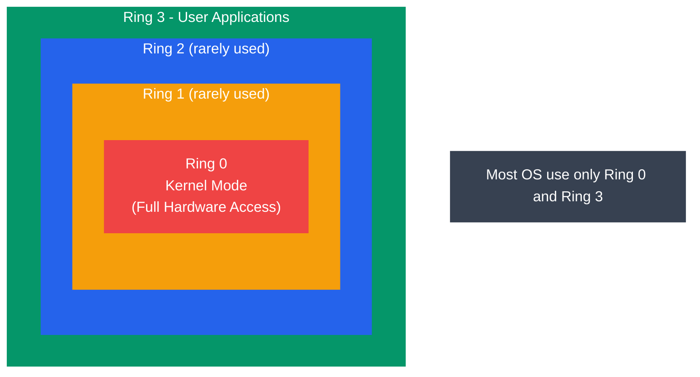
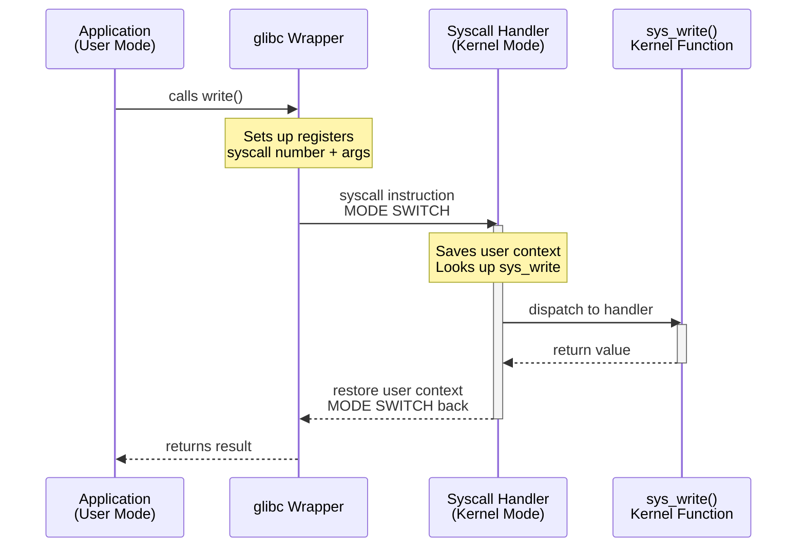

# System Calls and APIs

## What You'll Learn

- What system calls are and why they exist
- User mode vs kernel mode and CPU privilege levels (Ring 0 / Ring 3)
- How the system call mechanism works (trap, interrupt, mode switch)
- Categories of system calls: process, file, device, information, communication
- The Linux system call interface and syscall numbers
- C library wrappers (glibc) and how they relate to raw system calls
- Using `strace` to trace system calls in real time
- Writing C programs that use system calls directly

## What Are System Calls?

A **system call** (syscall) is a programmatic way for a user-space application to request a service from the operating system kernel. System calls are the only legal entry point into the kernel for user programs.

```
Why system calls exist:
- User programs cannot access hardware directly
- The kernel controls all hardware resources
- System calls provide a controlled, secure gateway
- They enforce protection and access control

Without system calls:
  App → directly touches hardware → chaos, crashes, security holes

With system calls:
  App → syscall → Kernel validates → performs operation → returns result
```

## User Mode vs Kernel Mode

Modern CPUs have at least two privilege levels. The OS kernel runs in the most privileged mode; user applications run in a restricted mode.

### CPU Protection Rings (x86)



```
┌───────────────────────────────────────┐
│                                       │
│    ┌───────────────────────────┐      │
│    │                           │      │
│    │    ┌─────────────────┐    │      │
│    │    │                 │    │      │
│    │    │    ┌───────┐    │    │      │
│    │    │    │Ring 0 │    │    │      │
│    │    │    │Kernel │    │    │      │
│    │    │    └───────┘    │    │      │
│    │    │    Ring 1       │    │      │
│    │    │  (rarely used)  │    │      │
│    │    └─────────────────┘    │      │
│    │       Ring 2              │      │
│    │     (rarely used)         │      │
│    └───────────────────────────┘      │
│           Ring 3                      │
│        User Applications              │
└───────────────────────────────────────┘

In practice, most OS use only Ring 0 and Ring 3:
  Ring 0 = Kernel Mode (full hardware access)
  Ring 3 = User Mode   (restricted access)
```

### Mode Comparison

| Feature | User Mode (Ring 3) | Kernel Mode (Ring 0) |
|---------|-------------------|---------------------|
| Hardware access | No direct access | Full access |
| Memory access | Own address space only | All memory |
| Privileged instructions | Cannot execute | Can execute |
| I/O operations | Must go through kernel | Direct I/O |
| Crash impact | Only the process dies | Entire system crashes |
| Code running | Applications, libraries | Kernel, drivers |

## System Call Mechanism

When a user program needs a kernel service, it triggers a **trap** (software interrupt) that switches the CPU from user mode to kernel mode.

### Step-by-Step Flow

```
Step 1: Application calls C library function
        printf("hello") → glibc write()

Step 2: C library sets up syscall
        - Places syscall number in register (e.g., eax = 1 for write)
        - Places arguments in registers (ebx, ecx, edx...)

Step 3: Trigger mode switch
        - x86 32-bit: int 0x80 (software interrupt)
        - x86 64-bit: syscall instruction (faster)

Step 4: CPU switches to kernel mode
        - Saves user context (registers, stack pointer)
        - Jumps to kernel syscall handler

Step 5: Kernel processes the request
        - Validates syscall number
        - Checks permissions
        - Performs the operation

Step 6: Kernel returns result
        - Places return value in register (eax/rax)
        - Restores user context
        - Switches back to user mode

Step 7: C library returns to application
```

### Diagram: Mode Switch



```
  User Mode                         Kernel Mode
  ─────────                         ───────────
  ┌─────────┐                       
  │  App    │                       
  │ calls   │                       
  │ write() │                       
  └────┬────┘                       
       │                            
       ▼                            
  ┌──────────┐                      
  │  glibc   │                      
  │ wrapper  │                      
  │ sets up  │                      
  │ registers│                      
  └────┬─────┘                      
       │   syscall instruction      
       │ ─ ─ ─ ─ ─ ─ ─ ─ ─ ─ ─ ─ ─▶ ┌──────────────┐
       │   MODE SWITCH               │ syscall      │
       │                              │ handler      │
       │                              │ (lookup      │
       │                              │  sys_write)  │
       │                              └──────┬───────┘
       │                                     ▼
       │                              ┌──────────────┐
       │                              │ sys_write()  │
       │                              │ kernel func  │
       │                              └──────┬───────┘
       │                                     │
       │   return value              ◀ ─ ─ ─┘
       │ ◀ ─ ─ ─ ─ ─ ─ ─ ─ ─ ─ ─ ─ ─
  ┌────┴─────┐                      
  │  App     │                      
  │ continues│                      
  └──────────┘                      
```

## Types of System Calls

### 1. Process Control

System calls that manage the lifecycle and execution of processes.

```
fork()    → Create a new child process (copy of parent)
exec()    → Replace current process image with a new program
exit()    → Terminate the calling process
wait()    → Wait for a child process to terminate
getpid()  → Get process ID
kill()    → Send a signal to a process
```

```c
/* fork_example.c - Creating a child process */
#include <stdio.h>
#include <unistd.h>
#include <sys/wait.h>

int main() {
    pid_t pid = fork();  // Create child process

    if (pid < 0) {
        perror("fork failed");
        return 1;
    } else if (pid == 0) {
        /* Child process */
        printf("Child: PID = %d, Parent PID = %d\n",
               getpid(), getppid());
        /* Replace child with 'ls' command */
        execlp("ls", "ls", "-l", NULL);
    } else {
        /* Parent process */
        printf("Parent: PID = %d, Child PID = %d\n",
               getpid(), pid);
        int status;
        wait(&status);  // Wait for child to finish
        printf("Parent: Child exited with status %d\n",
               WEXITSTATUS(status));
    }
    return 0;
}
```

### 2. File Management

System calls for creating, reading, writing, and managing files.

```
open()    → Open a file and return a file descriptor
read()    → Read bytes from a file descriptor
write()   → Write bytes to a file descriptor
close()   → Close a file descriptor
lseek()   → Reposition read/write file offset
stat()    → Get file status/metadata
unlink()  → Delete a file
mkdir()   → Create a directory
```

```c
/* file_syscalls.c - File operations using system calls */
#include <stdio.h>
#include <fcntl.h>
#include <unistd.h>
#include <string.h>

int main() {
    /* Open file (create if doesn't exist) */
    int fd = open("test.txt", O_WRONLY | O_CREAT | O_TRUNC, 0644);
    if (fd < 0) {
        perror("open failed");
        return 1;
    }

    /* Write to file */
    const char *msg = "Hello from system calls!\n";
    ssize_t bytes_written = write(fd, msg, strlen(msg));
    printf("Wrote %zd bytes\n", bytes_written);

    close(fd);

    /* Read it back */
    fd = open("test.txt", O_RDONLY);
    char buffer[256];
    ssize_t bytes_read = read(fd, buffer, sizeof(buffer) - 1);
    buffer[bytes_read] = '\0';
    printf("Read: %s", buffer);

    close(fd);
    return 0;
}
```

### 3. Device Management

System calls for interacting with hardware devices.

```
ioctl()   → Device-specific control operations
read()    → Read from device (same as file read)
write()   → Write to device (same as file write)
mmap()    → Map device memory into process address space
```

```c
/* ioctl_example.c - Get terminal window size */
#include <stdio.h>
#include <sys/ioctl.h>
#include <unistd.h>

int main() {
    struct winsize ws;
    /* ioctl() to get terminal dimensions */
    if (ioctl(STDOUT_FILENO, TIOCGWINSZ, &ws) == 0) {
        printf("Terminal size: %d rows x %d cols\n",
               ws.ws_row, ws.ws_col);
    }
    return 0;
}
```

### 4. Information Maintenance

System calls to get and set system or process information.

```
getpid()      → Get process ID
getuid()      → Get user ID
time()        → Get current time
gettimeofday()→ Get time with microsecond precision
uname()       → Get system information
sysinfo()     → Get overall system statistics
```

```c
/* sysinfo_example.c - System information */
#include <stdio.h>
#include <unistd.h>
#include <sys/utsname.h>
#include <time.h>

int main() {
    /* Get system name info */
    struct utsname info;
    uname(&info);
    printf("System:  %s\n", info.sysname);
    printf("Node:    %s\n", info.nodename);
    printf("Release: %s\n", info.release);
    printf("Machine: %s\n", info.machine);

    /* Get current time */
    time_t now = time(NULL);
    printf("Time:    %s", ctime(&now));

    /* Get process info */
    printf("PID:     %d\n", getpid());
    printf("UID:     %d\n", getuid());

    return 0;
}
```

### 5. Communication (IPC)

System calls for inter-process communication.

```
pipe()    → Create a unidirectional communication channel
shmget()  → Allocate shared memory segment
shmat()   → Attach shared memory to process
socket()  → Create network communication endpoint
send()    → Send data over a socket
recv()    → Receive data from a socket
msgget()  → Create a message queue
```

```c
/* pipe_example.c - Parent-child communication via pipe */
#include <stdio.h>
#include <unistd.h>
#include <string.h>
#include <sys/wait.h>

int main() {
    int pipefd[2];  /* pipefd[0]=read, pipefd[1]=write */
    pipe(pipefd);

    pid_t pid = fork();

    if (pid == 0) {
        /* Child: read from pipe */
        close(pipefd[1]);  /* Close write end */
        char buffer[128];
        ssize_t n = read(pipefd[0], buffer, sizeof(buffer) - 1);
        buffer[n] = '\0';
        printf("Child received: %s\n", buffer);
        close(pipefd[0]);
    } else {
        /* Parent: write to pipe */
        close(pipefd[0]);  /* Close read end */
        const char *msg = "Hello from parent!";
        write(pipefd[1], msg, strlen(msg));
        close(pipefd[1]);
        wait(NULL);
    }
    return 0;
}
```

## Linux System Call Interface

Every system call has a unique number. The kernel uses this number to look up the corresponding handler function in the **syscall table**.

### Common Linux Syscall Numbers (x86-64)

```
Number  Syscall       Description
──────  ──────────    ───────────────────────
  0     read          Read from file descriptor
  1     write         Write to file descriptor
  2     open          Open a file
  3     close         Close a file descriptor
  9     mmap          Map files/devices into memory
 39     getpid        Get process ID
 57     fork          Create a child process
 59     execve        Execute a program
 60     exit          Terminate the process
 62     kill          Send signal to a process
```

### Invoking a Raw System Call

```c
/* raw_syscall.c - Using syscall() directly */
#include <stdio.h>
#include <unistd.h>
#include <sys/syscall.h>

int main() {
    /* Direct syscall: write(1, "Hello\n", 6) */
    /* SYS_write = 1 on x86-64 */
    long ret = syscall(SYS_write, 1, "Hello via raw syscall!\n", 23);
    printf("syscall returned: %ld\n", ret);

    /* Get PID via raw syscall */
    pid_t pid = syscall(SYS_getpid);
    printf("PID via syscall: %d\n", pid);
    printf("PID via getpid: %d\n", getpid());

    return 0;
}
```

## C Library Wrappers (glibc)

Applications rarely invoke system calls directly. Instead, they call C library (glibc) wrapper functions that handle the low-level details.

```
Why use wrappers?
─────────────────
1. Portability — same function works across architectures
2. Convenience — handles register setup, error codes
3. Buffering — stdio functions buffer I/O for performance
4. Error handling — sets errno on failure

Call chain:
  printf("hello")           ← C library (buffered I/O)
    → write(fd, buf, len)   ← glibc wrapper (sets up registers)
      → syscall instruction ← triggers kernel mode switch
        → sys_write()       ← kernel implementation
```

```c
/*
 * Comparison: glibc wrapper vs direct syscall
 *
 * Both do the same thing — write to stdout.
 * The wrapper is portable and easier to use.
 */
#include <stdio.h>
#include <unistd.h>
#include <sys/syscall.h>
#include <string.h>

int main() {
    const char *msg = "Hello, World!\n";

    /* Method 1: High-level C library (buffered) */
    printf("%s", msg);

    /* Method 2: POSIX wrapper (unbuffered) */
    write(STDOUT_FILENO, msg, strlen(msg));

    /* Method 3: Raw syscall (least portable) */
    syscall(SYS_write, STDOUT_FILENO, msg, strlen(msg));

    return 0;
}
```

## Using strace to Trace System Calls

`strace` is an essential debugging tool that intercepts and records every system call made by a process.

```bash
# Basic usage: trace a command
strace ls -l

# Trace only specific system calls
strace -e trace=open,read,write ls

# Trace with timestamps
strace -t ls

# Trace a running process by PID
strace -p 1234

# Count system calls (summary)
strace -c ls

# Save output to file
strace -o trace.log ls

# Trace child processes too
strace -f ./my_program
```

### Example strace Output

```bash
$ strace -e trace=write echo "Hello"
write(1, "Hello\n", 6)           = 6
+++ exited with 0 +++

$ strace -c ls /tmp
% time     seconds  usecs/call     calls    errors syscall
------ ----------- ----------- --------- --------- --------
 25.71    0.000009           9         1           execve
 22.86    0.000008           1         8           mmap
 14.29    0.000005           1         4           openat
 11.43    0.000004           1         6           close
  8.57    0.000003           1         5           fstat
  5.71    0.000002           1         3           read
  5.71    0.000002           2         1           write
  5.71    0.000002           1         3         1 access
------ ----------- ----------- --------- --------- --------
100.00    0.000035                    31         1 total
```

## System Call Error Handling

System calls return -1 on failure and set the global variable `errno` to indicate the specific error.

```c
/* error_handling.c - Proper syscall error handling */
#include <stdio.h>
#include <fcntl.h>
#include <unistd.h>
#include <errno.h>
#include <string.h>

int main() {
    /* Try to open a nonexistent file */
    int fd = open("/nonexistent/file.txt", O_RDONLY);

    if (fd == -1) {
        /* errno is set by the failed system call */
        printf("Error number: %d\n", errno);
        printf("Error message: %s\n", strerror(errno));
        perror("open");  /* Prints: open: No such file or directory */
    }

    return 0;
}
```

## System Call Categories Summary

| Category | Purpose | Key Syscalls |
|----------|---------|--------------|
| **Process Control** | Create, terminate, manage processes | `fork`, `exec`, `exit`, `wait`, `kill` |
| **File Management** | Create, read, write, delete files | `open`, `read`, `write`, `close`, `stat` |
| **Device Management** | Control hardware devices | `ioctl`, `read`, `write`, `mmap` |
| **Information** | Get/set system and process info | `getpid`, `uname`, `time`, `sysinfo` |
| **Communication** | Inter-process communication | `pipe`, `socket`, `shmget`, `msgget` |

## Exercises

### Beginner
1. Write a C program that uses `getpid()`, `getppid()`, and `getuid()` to print process and user information.
2. Use `strace` to trace the `echo "hello"` command. Identify which system call produces the output.
3. Write a program that opens a file, writes a message, closes it, then reads and prints the contents — using only `open()`, `write()`, `read()`, and `close()` (no `printf` for file I/O).

### Intermediate
4. Write a program that uses `fork()` and `exec()` to run the `ls -la` command in a child process while the parent waits.
5. Use `strace -c` on several common commands (`ls`, `cat`, `grep`) and compare which system calls they use most frequently.
6. Create a program that communicates between parent and child using `pipe()`. The parent sends a number, the child doubles it and sends it back (use two pipes for bidirectional communication).

### Advanced
7. Write a program that invokes a system call using the raw `syscall()` function instead of the glibc wrapper. Compare its behavior with the wrapper version.
8. Use `strace` to trace a web server (like `python3 -m http.server`) while making HTTP requests. Identify the `socket`, `bind`, `listen`, `accept`, `read`, and `write` calls.
9. Research and explain how `vDSO` (virtual Dynamic Shared Object) allows certain system calls (like `gettimeofday`) to execute without a full mode switch. Why is this faster?

## Key Takeaways

- System calls are the controlled interface between user applications and the kernel
- CPUs enforce privilege levels: Ring 0 (kernel) has full access, Ring 3 (user) is restricted
- The syscall mechanism involves saving context, switching modes, executing the kernel function, and returning
- Linux system calls are identified by numbers and invoked via the `syscall` instruction (x86-64)
- C library wrappers (glibc) provide portable, convenient access to system calls
- System calls fall into five categories: process, file, device, information, and communication
- `strace` is invaluable for debugging and understanding program behavior at the syscall level
- Always check return values and `errno` for proper error handling

---

[← Previous: OS Architecture](./02_os_architecture.md) | [Next: OS Types →](./04_os_types.md)
