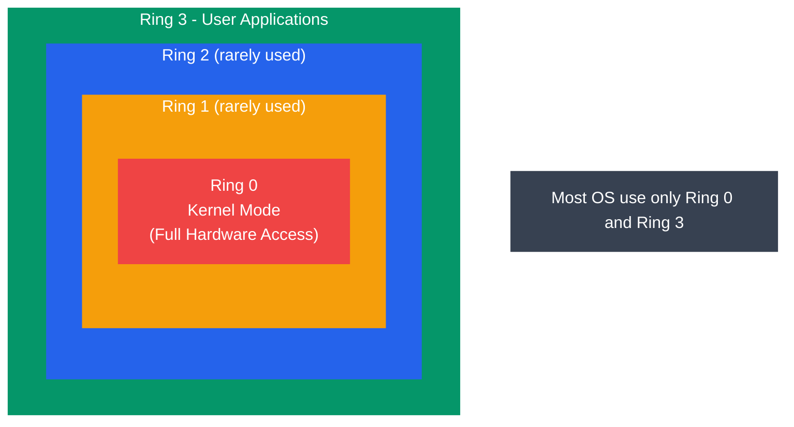
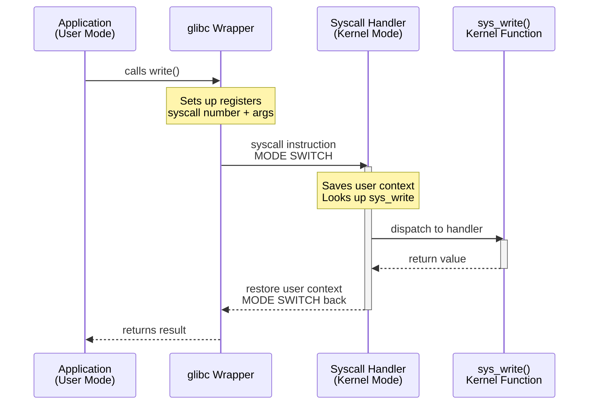

# System Calls and APIs

## What You'll Learn

- System calls kya hote hain aur inki zaroorat kyun padi
- User mode vs kernel mode, aur CPU privilege levels (Ring 0 / Ring 3)
- System call mechanism kaise kaam karta hai (trap, interrupt, mode switch)
- System calls ki categories: process, file, device, information, communication
- Linux system call interface aur syscall numbers
- C library wrappers (glibc) aur unka raw system calls se rishta
- `strace` se real-time mein system calls trace karna
- C programs likhna jo directly system calls use karte hain

## System Calls Hote Kya Hain?

Socho tum Zomato app khol ke ek order place karte ho. Tum khud restaurant ki kitchen mein ghus ke khana nahi bana sakte — tumhe app ke through order dena padta hai, jo backend mein verify hota hai, phir restaurant tak pahunchta hai, phir tumhare paas food aata hai. Tum kitchen ko directly touch nahi kar sakte, sirf ek **controlled interface** (app/order system) ke through request bhej sakte ho.

Bilkul yahi cheez OS mein hoti hai. Ek **system call (syscall)** ek programmatic tareeka hai jisse user-space application kernel se koi service maangta hai — jaise file padhna, network par data bhejna, ya naya process banana. System calls hi kernel mein ghusne ka **sirf ek legal darwaza** hain, user programs ke liye. Koi bhi application seedhe hardware ko touch nahi kar sakta — usko hamesha kernel se hi permission leni padti hai.

**Kyun zaruri hai yeh sab?**

```
System calls kyun zaruri hain:
- User programs directly hardware access nahi kar sakte
- Kernel hi saare hardware resources ko control karta hai
- System calls ek controlled, secure gateway provide karte hain
- Yeh protection aur access control enforce karte hain

System calls ke bina:
  App → seedha hardware ko chhedta hai → chaos, crashes, security holes

System calls ke saath:
  App → syscall → Kernel validate karta hai → operation perform karta hai → result return karta hai
```

Agar system calls na hote, toh koi bhi buggy ya malicious app directly disk ya network card ko chhed sakti thi — matlab ek app crash ho toh poora system crash ho sakta tha, ya koi app dusre process ka data chura sakti thi. System call layer ek "bouncer" ki tarah kaam karta hai jo har request ko check karke hi andar jaane deta hai.

## User Mode vs Kernel Mode

Modern CPUs mein kam se kam do privilege levels hote hain. OS kernel sabse zyada privileged mode mein chalta hai; user applications ek restricted mode mein chalti hain.

Isko aise socho — kernel mode matlab **building ka security guard/watchman** hai jiske paas master key hai, har room (hardware resource) tak access hai. User mode matlab tum **tenant** ho, tumhare paas sirf apne flat (apna address space) ki key hai. Agar tumhe building ki electricity panel touch karni hai, toh tumhe watchman se request karni padegi — tum khud panel nahi khol sakte.

### CPU Protection Rings (x86)



```
┌───────────────────────────────────────┐
│                                       │
│    ┌───────────────────────────┐      │
│    │                           │      │
│    │    ┌─────────────────┐    │      │
│    │    │                 │    │      │
│    │    │    ┌───────┐    │    │      │
│    │    │    │Ring 0 │    │    │      │
│    │    │    │Kernel │    │    │      │
│    │    │    └───────┘    │    │      │
│    │    │    Ring 1       │    │      │
│    │    │  (rarely used)  │    │      │
│    │    └─────────────────┘    │      │
│    │       Ring 2              │      │
│    │     (rarely used)         │      │
│    └───────────────────────────┘      │
│           Ring 3                      │
│        User Applications              │
└───────────────────────────────────────┘

Practically, zyadatar OS sirf Ring 0 aur Ring 3 use karte hain:
  Ring 0 = Kernel Mode (full hardware access)
  Ring 3 = User Mode   (restricted access)
```

x86 architecture mein technically 4 rings hain (0, 1, 2, 3), lekin Linux/Windows jaise mainstream OS sirf 2 hi use karte hain — Ring 0 (kernel) aur Ring 3 (user). Ring 1 aur 2 kabhi kabhi virtualization ke liye use hote hain (jaise hypervisors), par general purpose OS ke liye inki zarurat nahi.

> [!info]
> ARM processors mein bhi similar concept hai jise **Exception Levels (EL0-EL3)** kehte hain. Concept same hai — bas naming alag hai.

### Mode Comparison

| Feature | User Mode (Ring 3) | Kernel Mode (Ring 0) |
|---------|-------------------|---------------------|
| Hardware access | Direct access nahi | Full access |
| Memory access | Sirf apna address space | Saari memory |
| Privileged instructions | Execute nahi kar sakte | Execute kar sakte hain |
| I/O operations | Kernel ke through jaana padta hai | Direct I/O |
| Crash impact | Sirf woh process marta hai | Poora system crash ho sakta hai |
| Code running | Applications, libraries | Kernel, drivers |

Isliye jab tumhara Node.js app crash hota hai, tumhara Windows/Linux crash nahi hota — kyunki Node.js user mode mein chal raha hota hai. Lekin agar kernel mein koi driver crash ho jaaye, toh poora system down ho sakta hai (jaise "blue screen of death" — woh usually kernel-mode driver ki galti hoti hai).

## System Call Mechanism

Jab ek user program ko kernel service chahiye hoti hai, woh ek **trap** (software interrupt) trigger karta hai jo CPU ko user mode se kernel mode mein switch kar deta hai.

Socho yeh bilkul customer care call jaisa hai. Tum (application) IVR system (glibc wrapper) ko call karte ho, "1 dabao account balance ke liye" (syscall number set karna), phir call transfer hoti hai actual agent (kernel handler) ko, agent tumhara kaam karta hai (kernel function execute), aur result wapas tumhe deta hai — phir call end (mode switch back).

### Step-by-Step Flow

```
Step 1: Application C library function call karta hai
        printf("hello") → glibc write()

Step 2: C library syscall set up karti hai
        - Syscall number ko register mein daalta hai (e.g., eax = 1 for write)
        - Arguments ko registers mein daalta hai (ebx, ecx, edx...)

Step 3: Mode switch trigger hota hai
        - x86 32-bit: int 0x80 (software interrupt)
        - x86 64-bit: syscall instruction (zyada fast)

Step 4: CPU kernel mode mein switch hota hai
        - User context save hota hai (registers, stack pointer)
        - Kernel syscall handler par jump hota hai

Step 5: Kernel request process karta hai
        - Syscall number validate karta hai
        - Permissions check karta hai
        - Operation perform karta hai

Step 6: Kernel result return karta hai
        - Return value register mein daalta hai (eax/rax)
        - User context restore karta hai
        - Wapas user mode mein switch hota hai

Step 7: C library application ko return karti hai
```

Yeh poora flow **microseconds** mein hota hai, lekin fir bhi ek mode switch ek "expensive" operation maana jaata hai kyunki CPU ko context save/restore karna padta hai. Isi wajah se performance-critical applications (jaise high-frequency trading systems ya game engines) system calls ko minimize karne ki koshish karte hain — jaise buffered I/O use karke, taaki har chhoti write ke liye alag syscall na karna pade.

### Diagram: Mode Switch



```
  User Mode                         Kernel Mode
  ─────────                         ───────────
  ┌─────────┐                       
  │  App    │                       
  │ calls   │                       
  │ write() │                       
  └────┬────┘                       
       │                            
       ▼                            
  ┌──────────┐                      
  │  glibc   │                      
  │ wrapper  │                      
  │ sets up  │                      
  │ registers│                      
  └────┬─────┘                      
       │   syscall instruction      
       │ ─ ─ ─ ─ ─ ─ ─ ─ ─ ─ ─ ─ ─▶ ┌──────────────┐
       │   MODE SWITCH               │ syscall      │
       │                              │ handler      │
       │                              │ (lookup      │
       │                              │  sys_write)  │
       │                              └──────┬───────┘
       │                                     ▼
       │                              ┌──────────────┐
       │                              │ sys_write()  │
       │                              │ kernel func  │
       │                              └──────┬───────┘
       │                                     │
       │   return value              ◀ ─ ─ ─┘
       │ ◀ ─ ─ ─ ─ ─ ─ ─ ─ ─ ─ ─ ─ ─
  ┌────┴─────┐                      
  │  App     │                      
  │ continues│                      
  └──────────┘                      
```

## Types of System Calls

System calls ko broadly 5 categories mein baant sakte hain — process control, file management, device management, information maintenance, aur communication. Chalo ek ek karke dekhte hain.

### 1. Process Control

Yeh woh system calls hain jo processes ke lifecycle aur execution ko manage karte hain — matlab process banana, chalana, khatam karna.

```
fork()    → Naya child process banata hai (parent ki copy)
exec()    → Current process image ko naye program se replace karta hai
exit()    → Calling process ko terminate karta hai
wait()    → Child process ke terminate hone ka wait karta hai
getpid()  → Process ID lene ke liye
kill()    → Kisi process ko signal bhejne ke liye
```

`fork()` samajhne ke liye socho tum ek Zomato delivery order place karte ho, aur system ek **duplicate order** bana deta hai jo bilkul same hai (same items, same address) — bas ek naya order ID hai. `fork()` bhi bilkul yahi karta hai: parent process ki poori copy (child process) create ho jaati hai, bas PID alag hota hai. Phir usually child process `exec()` call karke apna khud ka naya "menu" (naya program) load kar leta hai.

```c
/* fork_example.c - Creating a child process */
#include <stdio.h>
#include <unistd.h>
#include <sys/wait.h>

int main() {
    pid_t pid = fork();  // Create child process

    if (pid < 0) {
        perror("fork failed");
        return 1;
    } else if (pid == 0) {
        /* Child process */
        printf("Child: PID = %d, Parent PID = %d\n",
               getpid(), getppid());
        /* Replace child with 'ls' command */
        execlp("ls", "ls", "-l", NULL);
    } else {
        /* Parent process */
        printf("Parent: PID = %d, Child PID = %d\n",
               getpid(), pid);
        int status;
        wait(&status);  // Wait for child to finish
        printf("Parent: Child exited with status %d\n",
               WEXITSTATUS(status));
    }
    return 0;
}
```

Yahan `fork()` ek hi jagah call hota hai lekin **do baar return** karta hai — ek baar parent process mein (jahan `pid` child ka actual PID hota hai) aur ek baar child process mein (jahan `pid` 0 hota hai). Yeh confuse karne wala concept hai jab pehli baar seekhte ho, isliye if-else conditions dhyan se padho.

### 2. File Management

Yeh system calls files create, read, write, aur manage karne ke kaam aate hain.

```
open()    → File open karke file descriptor return karta hai
read()    → File descriptor se bytes padhta hai
write()   → File descriptor mein bytes likhta hai
close()   → File descriptor close karta hai
lseek()   → Read/write file offset ko reposition karta hai
stat()    → File status/metadata leta hai
unlink()  → File delete karta hai
mkdir()   → Directory create karta hai
```

**File descriptor** ko ek OYO room booking token ki tarah socho — jab tum ek file "open" karte ho, OS tumhe ek chhota number (integer) deta hai jo us file ko represent karta hai. Har baar us file ko touch karna ho, tum poora file path nahi dete, sirf yeh token (fd) dikhate ho. Har process ke paas already 3 default "tokens" hote hain: `0` (stdin), `1` (stdout), `2` (stderr).

```c
/* file_syscalls.c - File operations using system calls */
#include <stdio.h>
#include <fcntl.h>
#include <unistd.h>
#include <string.h>

int main() {
    /* Open file (create if doesn't exist) */
    int fd = open("test.txt", O_WRONLY | O_CREAT | O_TRUNC, 0644);
    if (fd < 0) {
        perror("open failed");
        return 1;
    }

    /* Write to file */
    const char *msg = "Hello from system calls!\n";
    ssize_t bytes_written = write(fd, msg, strlen(msg));
    printf("Wrote %zd bytes\n", bytes_written);

    close(fd);

    /* Read it back */
    fd = open("test.txt", O_RDONLY);
    char buffer[256];
    ssize_t bytes_read = read(fd, buffer, sizeof(buffer) - 1);
    buffer[bytes_read] = '\0';
    printf("Read: %s", buffer);

    close(fd);
    return 0;
}
```

> [!warning]
> Har `open()` ke baad `close()` call karna mat bhoolna. Agar file descriptors leak hote rahe (close nahi kiye), toh ek process ke paas limited fd ka quota hota hai (usually 1024 default) — aur ek time baad "too many open files" error aane lagta hai. Yeh Node.js developers ke liye bhi relevant hai — agar tum streams properly close nahi karte, wahi problem hoti hai.

### 3. Device Management

Yeh system calls hardware devices ke saath interact karne ke liye hote hain.

```
ioctl()   → Device-specific control operations
read()    → Device se read karna (file read jaisa hi)
write()   → Device mein write karna (file write jaisa hi)
mmap()    → Device memory ko process address space mein map karna
```

Linux mein ek interesting philosophy hai — "**Everything is a file**". Matlab printer, keyboard, hard disk, sabko file ki tarah treat kiya jaata hai (`/dev/` directory mein), aur unhe same `read()`/`write()` syscalls se access kiya ja sakta hai. Lekin kuch device-specific operations hote hain jo generic read/write mein fit nahi hote (jaise terminal ka window size lena) — unke liye `ioctl()` (I/O control) use hota hai, jo ek "catch-all" swiss-army-knife syscall hai.

```c
/* ioctl_example.c - Get terminal window size */
#include <stdio.h>
#include <sys/ioctl.h>
#include <unistd.h>

int main() {
    struct winsize ws;
    /* ioctl() to get terminal dimensions */
    if (ioctl(STDOUT_FILENO, TIOCGWINSZ, &ws) == 0) {
        printf("Terminal size: %d rows x %d cols\n",
               ws.ws_row, ws.ws_col);
    }
    return 0;
}
```

### 4. Information Maintenance

Yeh system calls system ya process ki information get/set karne ke kaam aate hain.

```
getpid()      → Process ID lena
getuid()      → User ID lena
time()        → Current time lena
gettimeofday()→ Microsecond precision ke saath time lena
uname()       → System information lena
sysinfo()     → Overall system statistics lena
```

```c
/* sysinfo_example.c - System information */
#include <stdio.h>
#include <unistd.h>
#include <sys/utsname.h>
#include <time.h>

int main() {
    /* Get system name info */
    struct utsname info;
    uname(&info);
    printf("System:  %s\n", info.sysname);
    printf("Node:    %s\n", info.nodename);
    printf("Release: %s\n", info.release);
    printf("Machine: %s\n", info.machine);

    /* Get current time */
    time_t now = time(NULL);
    printf("Time:    %s", ctime(&now));

    /* Get process info */
    printf("PID:     %d\n", getpid());
    printf("UID:     %d\n", getuid());

    return 0;
}
```

Yeh calls hume system ke baare mein "meta-information" dete hain — jaise `uname -a` command jab tum Linux terminal mein chalate ho, backend mein woh `uname()` syscall hi use kar rahi hoti hai.

### 5. Communication (IPC)

Yeh system calls inter-process communication (IPC) ke liye hote hain — matlab do alag processes aapas mein data kaise share karein.

```
pipe()    → Ek unidirectional communication channel banata hai
shmget()  → Shared memory segment allocate karta hai
shmat()   → Shared memory ko process se attach karta hai
socket()  → Network communication endpoint banata hai
send()    → Socket ke through data bhejta hai
recv()    → Socket se data receive karta hai
msgget()  → Message queue create karta hai
```

`pipe()` ko socho ek **dabba jisme ek taraf se cheez daali jaaye aur dusri taraf se nikaali jaaye** — jaise ek tube ke through paani ek direction mein flow karta hai. Shell mein jab tum `ls | grep "txt"` likhte ho, wahan bhi backend mein `pipe()` syscall hi use hota hai — `ls` ka output pipe ke ek end mein jaata hai, aur `grep` dusre end se padhta hai.

```c
/* pipe_example.c - Parent-child communication via pipe */
#include <stdio.h>
#include <unistd.h>
#include <string.h>
#include <sys/wait.h>

int main() {
    int pipefd[2];  /* pipefd[0]=read, pipefd[1]=write */
    pipe(pipefd);

    pid_t pid = fork();

    if (pid == 0) {
        /* Child: read from pipe */
        close(pipefd[1]);  /* Close write end */
        char buffer[128];
        ssize_t n = read(pipefd[0], buffer, sizeof(buffer) - 1);
        buffer[n] = '\0';
        printf("Child received: %s\n", buffer);
        close(pipefd[0]);
    } else {
        /* Parent: write to pipe */
        close(pipefd[0]);  /* Close read end */
        const char *msg = "Hello from parent!";
        write(pipefd[1], msg, strlen(msg));
        close(pipefd[1]);
        wait(NULL);
    }
    return 0;
}
```

`socket()` bhi isi family ka member hai, bas yeh do alag machines ke beech communication ke liye hota hai (network ke through) — jaise tumhara Node.js Express server jab `app.listen(3000)` karta hai, andar hi andar `socket()`, `bind()`, aur `listen()` syscalls chal rahi hoti hain.

## Linux System Call Interface

Har system call ka ek unique number hota hai. Kernel is number ko use karke **syscall table** mein corresponding handler function dhundhta hai — bilkul restaurant ke menu ki tarah jahan har dish ka ek number hota hai, aur waiter number bolke order kitchen tak pahunchata hai.

### Common Linux Syscall Numbers (x86-64)

```
Number  Syscall       Description
──────  ──────────    ───────────────────────
  0     read          File descriptor se read karna
  1     write         File descriptor mein write karna
  2     open          File open karna
  3     close         File descriptor close karna
  9     mmap          Files/devices ko memory mein map karna
 39     getpid        Process ID lena
 57     fork          Child process create karna
 59     execve        Program execute karna
 60     exit          Process terminate karna
 62     kill          Process ko signal bhejna
```

> [!info]
> Yeh numbers architecture-specific hote hain — x86-64 par `write` ka number 1 hai, lekin x86 32-bit par yeh alag hai (0 hota hai), aur ARM par bhi different mapping hai. Isliye direct syscall numbers hardcode karna portable nahi hota — isi liye `<sys/syscall.h>` mein defined constants (`SYS_write` etc.) use karte hain, jo compile-time par sahi number resolve kar dete hain.

### Invoking a Raw System Call

```c
/* raw_syscall.c - Using syscall() directly */
#include <stdio.h>
#include <unistd.h>
#include <sys/syscall.h>

int main() {
    /* Direct syscall: write(1, "Hello\n", 6) */
    /* SYS_write = 1 on x86-64 */
    long ret = syscall(SYS_write, 1, "Hello via raw syscall!\n", 23);
    printf("syscall returned: %ld\n", ret);

    /* Get PID via raw syscall */
    pid_t pid = syscall(SYS_getpid);
    printf("PID via syscall: %d\n", pid);
    printf("PID via getpid: %d\n", getpid());

    return 0;
}
```

## C Library Wrappers (glibc)

Applications shayad hi kabhi directly system calls invoke karti hain. Iske bajaye, woh C library (glibc) ke wrapper functions call karti hain jo low-level details handle karte hain.

Isko UPI transaction jaisa socho — jab tum PhonePe se paise bhejte ho, tumhe NPCI ke internal protocols ya bank ke raw APIs ka pata nahi hota. PhonePe app (glibc wrapper) tumhare liye woh complexity handle karta hai — tum bas "send money" dabate ho, aur baaki sab backend mein ho jaata hai. Agar tumhe khud NPCI ke saath raw protocol se baat karni pade, kaafi mushkil aur error-prone hoga.

```
Wrappers kyun use karte hain?
─────────────────
1. Portability — same function alag-alag architectures par kaam karta hai
2. Convenience — register setup, error codes sab handle karta hai
3. Buffering — stdio functions I/O ko buffer karte hain, performance ke liye
4. Error handling — failure par errno set karta hai

Call chain:
  printf("hello")           ← C library (buffered I/O)
    → write(fd, buf, len)   ← glibc wrapper (registers set karta hai)
      → syscall instruction ← kernel mode switch trigger karta hai
        → sys_write()       ← kernel implementation
```

```c
/*
 * Comparison: glibc wrapper vs direct syscall
 *
 * Dono same kaam karte hain — stdout mein write karna.
 * Wrapper zyada portable aur easy hai use karne mein.
 */
#include <stdio.h>
#include <unistd.h>
#include <sys/syscall.h>
#include <string.h>

int main() {
    const char *msg = "Hello, World!\n";

    /* Method 1: High-level C library (buffered) */
    printf("%s", msg);

    /* Method 2: POSIX wrapper (unbuffered) */
    write(STDOUT_FILENO, msg, strlen(msg));

    /* Method 3: Raw syscall (least portable) */
    syscall(SYS_write, STDOUT_FILENO, msg, strlen(msg));

    return 0;
}
```

`printf()` aur `write()` mein bada fark yeh hai ki `printf()` apna khud ka **buffer** rakhta hai — matlab har chhoti print ke liye syscall nahi karta, kaafi data accumulate karke ek saath ek badi `write()` call karta hai. Yeh bilkul aisa hai jaise Swiggy delivery boy ek trip mein 5 orders ikatthe deliver kare instead of 5 alag trips lagane ke — time aur effort dono bachta hai.

## Using strace to Trace System Calls

`strace` ek zaruri debugging tool hai jo kisi process dwara ki gayi har system call ko intercept aur record karta hai. Isko socho jaise ek **CCTV camera jo har transaction record karta hai** — jab tumhe pata nahi chal raha ki koi program slow kyun hai ya crash kyun ho raha hai, `strace` laga do aur dekho backend mein exactly kya ho raha hai kernel ke saath.

```bash
# Basic usage: ek command trace karna
strace ls -l

# Sirf specific system calls trace karna
strace -e trace=open,read,write ls

# Timestamps ke saath trace karna
strace -t ls

# PID se ek running process trace karna
strace -p 1234

# System calls count karna (summary)
strace -c ls

# Output ko file mein save karna
strace -o trace.log ls

# Child processes ko bhi trace karna
strace -f ./my_program
```

### Example strace Output

```bash
$ strace -e trace=write echo "Hello"
write(1, "Hello\n", 6)           = 6
+++ exited with 0 +++

$ strace -c ls /tmp
% time     seconds  usecs/call     calls    errors syscall
------ ----------- ----------- --------- --------- --------
 25.71    0.000009           9         1           execve
 22.86    0.000008           1         8           mmap
 14.29    0.000005           1         4           openat
 11.43    0.000004           1         6           close
  8.57    0.000003           1         5           fstat
  5.71    0.000002           1         3           read
  5.71    0.000002           2         1           write
  5.71    0.000002           1         3         1 access
------ ----------- ----------- --------- --------- --------
100.00    0.000035                    31         1 total
```

Jab production mein koi Node.js server "hang" ho jaaye ya expected se slow chal raha ho, `strace -p <pid>` lagana ek powerful debugging technique hai — tumhe pata chal jaata hai ki process kya wait kar raha hai (jaise disk I/O, network call, ya lock).

## System Call Error Handling

System calls failure par `-1` return karte hain aur global variable `errno` set kar dete hain jo specific error batata hai.

```c
/* error_handling.c - Proper syscall error handling */
#include <stdio.h>
#include <fcntl.h>
#include <unistd.h>
#include <errno.h>
#include <string.h>

int main() {
    /* Try to open a nonexistent file */
    int fd = open("/nonexistent/file.txt", O_RDONLY);

    if (fd == -1) {
        /* errno failed system call dwara set hota hai */
        printf("Error number: %d\n", errno);
        printf("Error message: %s\n", strerror(errno));
        perror("open");  /* Prints: open: No such file or directory */
    }

    return 0;
}
```

> [!tip]
> Node.js mein jab tum `fs.readFileSync()` use karte ho aur error aata hai, woh error object ka `code` field (jaise `ENOENT`, `EACCES`) dekh ke lagta hai — yeh sab actually Linux ke `errno` values hi hain, bas Node.js unhe JavaScript-friendly string codes mein wrap kar deta hai. `ENOENT` = "Error NO ENTry" (file exist nahi karti), `EACCES` = "Error ACCESs" (permission denied), waghera. System calls ki yeh error convention seedhe tumhare JS code tak percolate hoti hai.

## System Call Categories Summary

| Category | Purpose | Key Syscalls |
|----------|---------|--------------|
| **Process Control** | Process create, terminate, manage karna | `fork`, `exec`, `exit`, `wait`, `kill` |
| **File Management** | Files create, read, write, delete karna | `open`, `read`, `write`, `close`, `stat` |
| **Device Management** | Hardware devices control karna | `ioctl`, `read`, `write`, `mmap` |
| **Information** | System aur process info get/set karna | `getpid`, `uname`, `time`, `sysinfo` |
| **Communication** | Inter-process communication | `pipe`, `socket`, `shmget`, `msgget` |

## Exercises

### Beginner
1. Ek C program likho jo `getpid()`, `getppid()`, aur `getuid()` use karke process aur user information print kare.
2. `strace` use karke `echo "hello"` command trace karo. Pata lagao kaunsi system call output produce karti hai.
3. Ek program likho jo file open kare, message likhe, close kare, phir wapas padh ke print kare — sirf `open()`, `write()`, `read()`, aur `close()` use karke (file I/O ke liye `printf` nahi).

### Intermediate
4. Ek program likho jo `fork()` aur `exec()` use karke `ls -la` command ko child process mein chalaye, jabki parent wait kare.
5. `strace -c` ko kai common commands (`ls`, `cat`, `grep`) par use karo aur compare karo ki kaunsi system calls sabse zyada use hoti hain.
6. Ek program banao jo parent aur child ke beech `pipe()` use karke communicate kare. Parent ek number bheje, child usko double karke wapas bheje (bidirectional communication ke liye do pipes use karo).

### Advanced
7. Ek program likho jo glibc wrapper ke bajaye raw `syscall()` function use karke ek system call invoke kare. Wrapper version se behavior compare karo.
8. `strace` use karke ek web server (jaise `python3 -m http.server`) trace karo jabki HTTP requests bhi bhejo. `socket`, `bind`, `listen`, `accept`, `read`, aur `write` calls identify karo.
9. Research karo aur explain karo ki `vDSO` (virtual Dynamic Shared Object) kaise certain system calls (jaise `gettimeofday`) ko poore mode switch ke bina execute karne deta hai. Yeh kyun faster hota hai?

## Key Takeaways

- System calls user applications aur kernel ke beech ka controlled interface hain
- CPUs privilege levels enforce karte hain: Ring 0 (kernel) ke paas full access hai, Ring 3 (user) restricted hai
- Syscall mechanism mein context save karna, mode switch karna, kernel function execute karna, aur wapas return karna shaamil hai
- Linux system calls numbers se identify hote hain aur `syscall` instruction (x86-64) ke through invoke hote hain
- C library wrappers (glibc) system calls ka portable, convenient access dete hain
- System calls 5 categories mein aate hain: process, file, device, information, aur communication
- `strace` program behavior ko syscall level par debug aur samajhne ke liye bahut kaam ka tool hai
- Return values aur `errno` hamesha check karo proper error handling ke liye

---

[← Previous: OS Architecture](./02_os_architecture.md) | [Next: OS Types →](./04_os_types.md)
