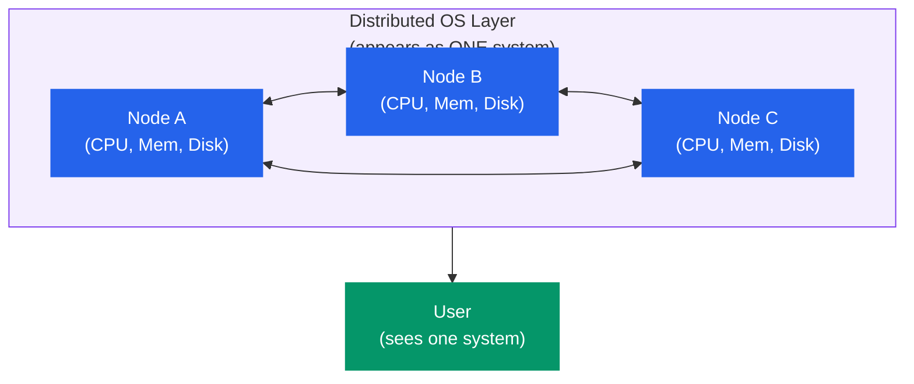
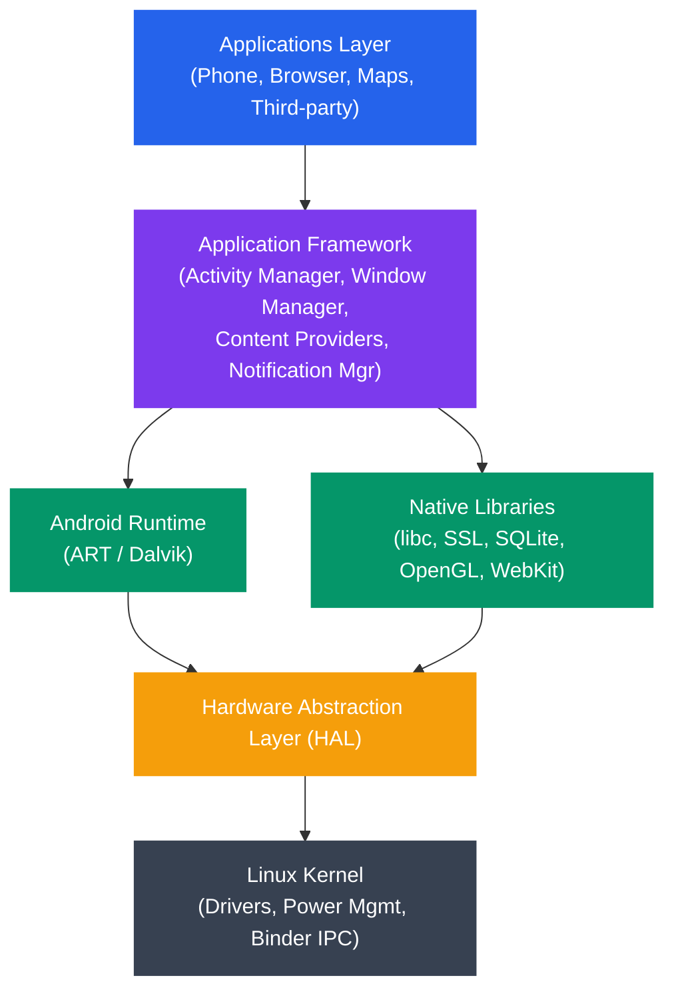

# Operating System Types

## What You'll Learn

- Batch operating systems and their historical importance
- Time-sharing and multitasking operating systems
- Real-time operating systems (hard vs soft real-time)
- Distributed operating systems and transparency
- Network operating systems
- Mobile operating systems (Android, iOS architecture)
- Embedded operating systems (FreeRTOS, VxWorks)
- Multi-processor systems (SMP, NUMA)
- How to choose the right OS type for a given use case

## Overview

Operating systems are classified based on how they manage resources, serve users, and handle tasks. Understanding these categories helps you choose the right OS for a given application — from a wristwatch to a supercomputer.

```
Classification Axes:
─────────────────────
1. By task handling:    Batch, Interactive, Real-time
2. By user count:       Single-user, Multi-user
3. By processor count:  Single-processor, Multi-processor
4. By distribution:     Centralized, Distributed, Network
5. By purpose:          General-purpose, Embedded, Mobile
```

## 1. Batch Operating Systems

The earliest OS type. Jobs are collected into batches, submitted together, and processed sequentially without user interaction.

```
┌─────────┐    ┌───────────┐    ┌─────────────────────┐
│ Users   │───▶│ Operator  │───▶│ Batch OS            │
│ submit  │    │ groups    │    │                     │
│ jobs    │    │ jobs into │    │ Job 1 → Job 2 → ...│
│ on cards│    │ batches   │    │ (sequential)        │
└─────────┘    └───────────┘    └─────────────────────┘

Timeline:
  ┌──────┐┌──────┐┌──────┐┌──────┐
  │Job 1 ││Job 2 ││Job 3 ││Job 4 │
  └──────┘└──────┘└──────┘└──────┘
  ──────────────────────────────────▶ time
  CPU runs one job at a time
```

### Characteristics

```
Advantages:
+ Efficient for large, repetitive tasks
+ Minimal operator intervention once batch starts
+ Good CPU utilization for compute-bound jobs

Disadvantages:
- No user interaction during execution
- Long turnaround time (wait for entire batch)
- Difficult to debug (no interactive feedback)
- CPU idle during I/O operations (early versions)
```

### Modern Relevance

Batch processing still exists today in many forms:

```bash
# Modern batch processing examples

# Cron job (scheduled batch)
crontab -l
# 0 2 * * * /usr/local/bin/backup.sh    ← runs at 2 AM daily

# Batch data processing
hadoop jar wordcount.jar input/ output/

# CI/CD pipelines are batch processes
# GitHub Actions, Jenkins, GitLab CI
```

## 2. Time-Sharing / Multitasking OS

Time-sharing systems allow multiple users or processes to share the CPU by rapidly switching between them, giving each the illusion of dedicated access.

```
Time-Sharing: CPU rapidly switches between processes

Process A:  ██░░██░░██░░██░░
Process B:  ░░██░░░░░░██░░██
Process C:  ░░░░░░██░░░░░░░░
            ──────────────────▶ time
            Each █ = one time quantum (e.g., 10ms)

User Experience:
  User 1: types command → sees response in ~100ms
  User 2: types command → sees response in ~100ms
  User 3: types command → sees response in ~100ms
  (all feel like they have the computer to themselves)
```

### Types of Multitasking

```
Cooperative Multitasking (old Windows 3.x, classic Mac OS):
- Process must voluntarily yield CPU
- A buggy process can freeze the entire system

Preemptive Multitasking (modern OS: Linux, Windows NT+, macOS):
- OS forcibly takes CPU away after a time quantum
- A buggy process cannot monopolize the CPU
- Requires hardware timer interrupt
```

### Example

```c
/* multitask_demo.c - Two processes sharing CPU */
#include <stdio.h>
#include <unistd.h>
#include <sys/wait.h>

int main() {
    pid_t pid = fork();

    if (pid == 0) {
        /* Child process */
        for (int i = 0; i < 5; i++) {
            printf("[Child  PID=%d] iteration %d\n", getpid(), i);
            usleep(100000);  /* 100ms */
        }
    } else {
        /* Parent process */
        for (int i = 0; i < 5; i++) {
            printf("[Parent PID=%d] iteration %d\n", getpid(), i);
            usleep(100000);
        }
        wait(NULL);
    }
    return 0;
}
/* Output is interleaved — OS schedules both processes */
```

### Characteristics

```
Advantages:
+ Fast response time for interactive users
+ Fair resource sharing among users/processes
+ Better CPU utilization (switch during I/O waits)
+ Supports multiple simultaneous users

Disadvantages:
- Overhead from context switching
- More complex OS (scheduling, memory protection)
- Requires memory protection hardware (MMU)
- Security challenges with multiple users
```

## 3. Real-Time Operating Systems (RTOS)

A real-time OS guarantees that tasks complete within a strict deadline. Missing a deadline can range from degraded quality to catastrophic failure.

### Hard Real-Time vs Soft Real-Time

```
Hard Real-Time:
  Deadline MUST be met — missing it is a system failure.
  Examples: pacemaker, anti-lock brakes, flight controller

  Task ━━━━━━━┫ DEADLINE
              ↑
         Must finish here or system fails

Soft Real-Time:
  Deadline SHOULD be met — missing it degrades quality.
  Examples: video streaming, audio playback, gaming

  Task ━━━━━━━━━━┫ DEADLINE
                  ↑
            Should finish here, but small delays are tolerable
```

### RTOS Task Scheduling

```
Priority-based preemptive scheduling:

Priority 1 (highest): ████████
Priority 2:           ░░░░████░░░░████
Priority 3 (lowest):  ░░░░░░░░░░░░░░░░████
                      ──────────────────────▶ time

Higher-priority task ALWAYS preempts lower-priority tasks.
This ensures critical tasks meet their deadlines.
```

### Examples of RTOS

```
FreeRTOS:
- Open-source, widely used in IoT
- Runs on microcontrollers (ARM Cortex-M, ESP32)
- ~9,000 lines of core code
- Owned by Amazon (AWS)

VxWorks:
- Commercial RTOS by Wind River
- Used in Mars rovers, Boeing 787, medical devices
- POSIX-compliant
- Deterministic scheduling

QNX Neutrino:
- Microkernel RTOS by BlackBerry
- Automotive infotainment, industrial control
- POSIX-compliant
- Self-healing architecture

RTLinux / PREEMPT_RT:
- Real-time extensions for Linux kernel
- Makes Linux suitable for soft real-time tasks
- Used in audio production, industrial automation
```

### FreeRTOS Task Example

```c
/* FreeRTOS task creation (pseudocode) */
#include "FreeRTOS.h"
#include "task.h"

void sensor_task(void *params) {
    while (1) {
        read_sensor_data();
        process_data();
        vTaskDelay(pdMS_TO_TICKS(10));  /* Run every 10ms */
    }
}

void motor_task(void *params) {
    while (1) {
        update_motor_control();
        vTaskDelay(pdMS_TO_TICKS(5));   /* Run every 5ms */
    }
}

int main(void) {
    /* Higher priority number = higher priority */
    xTaskCreate(motor_task,  "Motor",  256, NULL, 3, NULL);
    xTaskCreate(sensor_task, "Sensor", 256, NULL, 2, NULL);
    vTaskStartScheduler();
    return 0;
}
```

## 4. Distributed Operating Systems

A distributed OS manages a collection of independent computers and makes them appear as a single coherent system to the user.



```
┌────────┐    ┌────────┐    ┌────────┐
│ Node A │◄──▶│ Node B │◄──▶│ Node C │
│ (CPU,  │    │ (CPU,  │    │ (CPU,  │
│  Mem,  │    │  Mem,  │    │  Mem,  │
│  Disk) │    │  Disk) │    │  Disk) │
└────────┘    └────────┘    └────────┘
     ▲              ▲             ▲
     └──────────────┼─────────────┘
                    │
          Distributed OS Layer
          (appears as ONE system)
                    │
                    ▼
              ┌──────────┐
              │   User   │
              │ (sees one│
              │  system) │
              └──────────┘
```

### Transparency Goals

| Transparency Type | Meaning |
|-------------------|---------|
| **Access** | Local and remote resources accessed the same way |
| **Location** | User doesn't need to know where a resource is |
| **Migration** | Resources can move without users noticing |
| **Replication** | Multiple copies exist without user awareness |
| **Concurrency** | Multiple users share resources transparently |
| **Failure** | System hides failures and recovers automatically |

### Characteristics

```
Advantages:
+ Resource sharing across machines
+ Fault tolerance (one node fails, others continue)
+ Scalability (add more nodes)
+ Geographic distribution

Disadvantages:
- Network latency and bandwidth limitations
- Complex synchronization (distributed consensus)
- Partial failure handling is extremely hard
- Security across network boundaries
```

## 5. Network Operating Systems

Unlike distributed OS, a network OS does not hide the network. Users are aware of multiple machines and explicitly access remote resources.

```
Network OS:                           Distributed OS:
┌─────────┐  ┌─────────┐             ┌─────────────────┐
│Server A │  │Server B │             │   Single System  │
│(files)  │  │(printer)│             │     Image        │
└────┬────┘  └────┬────┘             │ (multiple nodes  │
     │            │                  │  hidden from     │
   Network      Network              │  the user)       │
     │            │                  └─────────────────┘
┌────┴────────────┴────┐
│ Client workstation   │
│ User explicitly      │
│ accesses \\ServerA   │
└──────────────────────┘
```

### Examples

```
Common Network OS Features:
- File sharing (NFS, SMB/CIFS)
- Remote login (SSH, Telnet)
- Print sharing
- Email services
- Directory services (LDAP, Active Directory)

Examples:
- Windows Server (Active Directory, SMB shares)
- Linux with NFS/Samba
- Novell NetWare (historical)
```

```bash
# Network OS operations (Linux)

# Mount a remote NFS share
sudo mount -t nfs server:/shared /mnt/shared

# Access Windows share via SMB
smbclient //server/share -U username

# Remote login
ssh user@remote-server

# Transfer files
scp file.txt user@server:/home/user/
```

## 6. Mobile Operating Systems

Designed for smartphones, tablets, and wearable devices. They emphasize touch interfaces, power efficiency, and app sandboxing.

### Android Architecture



```
┌──────────────────────────────────────────┐
│           Applications Layer             │
│  (Phone, Browser, Maps, Third-party)     │
├──────────────────────────────────────────┤
│        Application Framework             │
│  (Activity Manager, Window Manager,      │
│   Content Providers, Notification Mgr)   │
├──────────────────────────────────────────┤
│  Android Runtime │  Native Libraries     │
│  (ART / Dalvik)  │  (libc, SSL, SQLite,  │
│                  │   OpenGL, WebKit)      │
├──────────────────────────────────────────┤
│   Hardware Abstraction Layer (HAL)       │
├──────────────────────────────────────────┤
│         Linux Kernel                     │
│  (Drivers, Power Mgmt, Binder IPC)      │
└──────────────────────────────────────────┘
```

### iOS Architecture

```
┌──────────────────────────────────────────┐
│         Cocoa Touch Layer                │
│  (UIKit, MapKit, GameKit)                │
├──────────────────────────────────────────┤
│          Media Layer                     │
│  (Core Audio, Core Graphics, OpenGL ES) │
├──────────────────────────────────────────┤
│       Core Services Layer                │
│  (Foundation, Core Data, CloudKit)       │
├──────────────────────────────────────────┤
│        Core OS Layer                     │
│  (Darwin/XNU Kernel, Security, System)   │
└──────────────────────────────────────────┘
```

### Mobile OS Characteristics

```
Key Design Priorities:
- Power efficiency (battery life is critical)
- Touch-optimized user interface
- App sandboxing (security isolation)
- Sensor integration (GPS, accelerometer, camera)
- Cellular and wireless connectivity
- App store distribution model

Constraints:
- Limited RAM and storage
- Thermal throttling
- Background process restrictions
- Permission-based security model
```

## 7. Embedded Operating Systems

Designed for dedicated-purpose devices with constrained resources. They run on microcontrollers and specialized hardware.

```
┌────────────────────────────────────┐
│        Application Code            │
│  (device-specific functionality)   │
├────────────────────────────────────┤
│      Middleware / Libraries        │
│  (networking, protocols, GUI)      │
├────────────────────────────────────┤
│     Embedded OS / RTOS             │
│  (task scheduler, drivers, HAL)    │
├────────────────────────────────────┤
│     Hardware (microcontroller)     │
│  (ARM Cortex-M, ESP32, AVR)       │
└────────────────────────────────────┘
```

### Examples of Embedded OS

```
FreeRTOS:
- Most popular embedded RTOS
- Runs on 40+ microcontroller architectures
- Kernel size: ~6-10 KB
- Used in: IoT devices, wearables, sensors

Zephyr:
- Open-source RTOS by Linux Foundation
- Focus on IoT and connected devices
- Built-in Bluetooth, WiFi, USB stacks
- Used in: smart home, industrial IoT

VxWorks:
- Commercial, safety-certified RTOS
- DO-178C (aviation), IEC 62304 (medical)
- Used in: Mars rovers, fighter jets, MRI machines

Embedded Linux:
- Full Linux on resource-constrained devices
- Built with Yocto or Buildroot
- Used in: routers, smart TVs, Raspberry Pi
```

### Embedded vs General-Purpose OS

| Feature | Embedded OS | General-Purpose OS |
|---------|-------------|-------------------|
| **Target** | Specific hardware | Wide range of hardware |
| **Size** | KB to a few MB | Hundreds of MB to GB |
| **Boot time** | Milliseconds | Seconds to minutes |
| **Real-time** | Usually yes | Usually no |
| **User interface** | None or minimal | Full GUI |
| **Resource usage** | Minimal (KB RAM) | Extensive (GB RAM) |
| **Updates** | Rare, firmware-based | Frequent, online |

## 8. Multi-Processor Systems

Operating systems that manage multiple CPUs to increase throughput, reliability, and computing power.

### Symmetric Multiprocessing (SMP)

```
┌─────────────────────────────────────────┐
│              Shared Memory               │
├─────┬─────┬─────┬─────┬────────────────┤
│     │     │     │     │                │
│CPU 0│CPU 1│CPU 2│CPU 3│  Shared Bus    │
│     │     │     │     │                │
└─────┴─────┴─────┴─────┴────────────────┘

SMP Characteristics:
- All CPUs are equal (symmetric)
- All CPUs share the same memory
- Single OS instance manages all CPUs
- Any CPU can run any process/thread
- Used in: most modern desktops, servers
```

### Non-Uniform Memory Access (NUMA)

```
┌─────────────────┐     ┌─────────────────┐
│    NUMA Node 0   │     │    NUMA Node 1   │
│  ┌─────┬─────┐  │     │  ┌─────┬─────┐  │
│  │CPU 0│CPU 1│  │     │  │CPU 2│CPU 3│  │
│  └─────┴─────┘  │     │  └─────┴─────┘  │
│  ┌─────────────┐ │     │  ┌─────────────┐ │
│  │ Local Memory│ │◄───▶│  │ Local Memory│ │
│  │  (fast)     │ │     │  │  (fast)     │ │
│  └─────────────┘ │     │  └─────────────┘ │
└─────────────────┘     └─────────────────┘
         │   Interconnect (slower)   │
         └───────────────────────────┘

NUMA Characteristics:
- Each CPU has fast local memory
- Accessing remote memory is slower
- OS-aware scheduling places processes
  near their memory for best performance
- Used in: large servers, HPC systems
```

```bash
# Check system topology on Linux
lscpu                          # CPU info including NUMA nodes
numactl --hardware             # NUMA topology
cat /proc/cpuinfo | grep "processor" | wc -l  # CPU count
```

## Comprehensive Comparison Table

| OS Type | Users | Response Time | Throughput | Example |
|---------|-------|--------------|------------|---------|
| **Batch** | No interaction | Hours | High (bulk) | IBM OS/360, cron jobs |
| **Time-Sharing** | Multiple interactive | Milliseconds | Medium | Unix, Linux, Windows |
| **Hard Real-Time** | None/limited | Microseconds (guaranteed) | Varies | VxWorks, QNX |
| **Soft Real-Time** | Interactive | Milliseconds (best-effort) | Medium | Linux PREEMPT_RT |
| **Distributed** | Multiple | Varies | Very High | Google's systems, Amoeba |
| **Network** | Multiple | Varies | Medium | Windows Server, NFS |
| **Mobile** | Single | Milliseconds | Medium | Android, iOS |
| **Embedded** | None | Microseconds-ms | Dedicated | FreeRTOS, Zephyr |
| **SMP** | Multiple | Milliseconds | High | Linux on multi-core |
| **NUMA** | Multiple | Milliseconds | Very High | Linux on multi-socket |

## Choosing the Right OS Type

```
Decision Guide:
───────────────

Safety-critical system (lives at stake)?
  → Hard Real-Time OS (VxWorks, QNX, INTEGRITY)

Tiny microcontroller with KB of RAM?
  → Embedded RTOS (FreeRTOS, Zephyr)

Smartphone or tablet?
  → Mobile OS (Android, iOS)

Desktop or general-purpose server?
  → Time-sharing / Multitasking (Linux, Windows, macOS)

Large-scale computation across many machines?
  → Distributed OS or cluster (Kubernetes, Hadoop on Linux)

File/print sharing for an office?
  → Network OS (Windows Server, Linux with Samba)

High-performance scientific computing?
  → SMP/NUMA-aware OS (Linux on HPC clusters)

Streaming or multimedia?
  → Soft Real-Time (Linux with low-latency kernel)
```

## Exercises

### Beginner
1. Classify the following devices by OS type: smartwatch, ATM, web server, Mars rover, laptop, Wi-Fi router, car infotainment system.
2. Explain the difference between cooperative and preemptive multitasking. Which is used in modern desktop operating systems and why?
3. Write a bash script that simulates batch processing: it reads a list of commands from a file and executes them sequentially.
   ```bash
   # batch.sh
   while IFS= read -r cmd; do
       echo "Executing: $cmd"
       eval "$cmd"
   done < jobs.txt
   ```

### Intermediate
4. Compare Android and iOS architectures. What are the key differences in their kernel, runtime, and security models?
5. Research the FreeRTOS task scheduler. How does priority-based preemptive scheduling differ from the round-robin scheduling used in desktop Linux?
6. Explain why a distributed OS needs to solve the consensus problem. What is the CAP theorem and how does it affect distributed system design?

### Advanced
7. Set up FreeRTOS on an ESP32 microcontroller (or simulator) and create two tasks with different priorities. Observe how the scheduler handles them.
8. Configure the Linux PREEMPT_RT patch and measure scheduling latency using `cyclictest`. Compare results with a standard kernel.
9. Design an OS architecture for a fleet of autonomous delivery drones. Specify which OS type each component would use (flight controller, navigation, fleet coordination) and justify each choice.

## Key Takeaways

- Batch OS processes jobs sequentially without interaction — still used in scheduled tasks and data pipelines
- Time-sharing OS enables multiple users/processes to share CPU via rapid context switching
- Real-time OS guarantees deadlines: hard real-time (failure = catastrophe) vs soft real-time (failure = degraded quality)
- Distributed OS makes multiple machines appear as one system, hiding network complexity
- Network OS lets users explicitly access resources on remote machines
- Mobile OS prioritize power efficiency, touch interaction, and app sandboxing
- Embedded OS run on constrained hardware with minimal resources and often real-time requirements
- Multi-processor systems (SMP, NUMA) use multiple CPUs for higher throughput and reliability
- The right OS type depends on the use case: safety requirements, resource constraints, user needs, and scale

---

[← Previous: System Calls](./03_system_calls.md) | [Next: Kernel Architecture →](./05_kernel_architecture.md)
