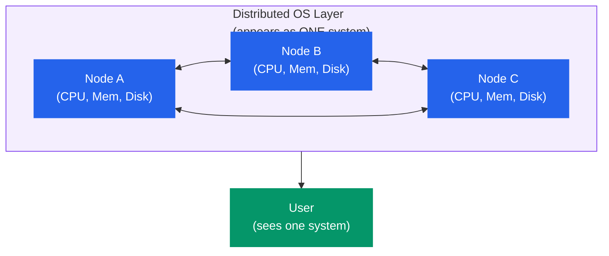
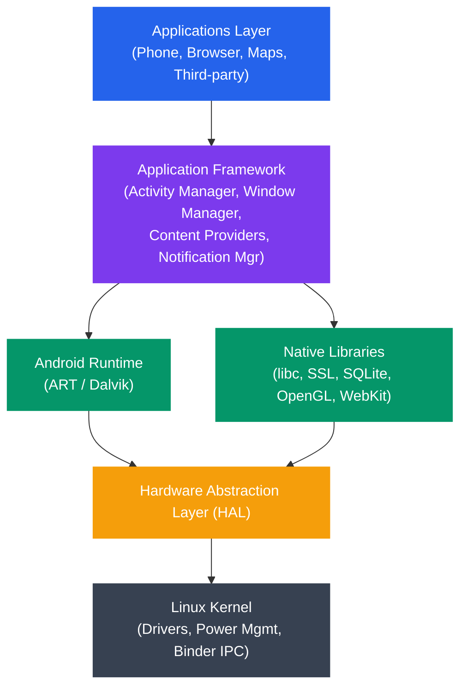

# Operating System Types

## What You'll Learn

- Batch operating systems and their historical importance
- Time-sharing and multitasking operating systems
- Real-time operating systems (hard vs soft real-time)
- Distributed operating systems and transparency
- Network operating systems
- Mobile operating systems (Android, iOS architecture)
- Embedded operating systems (FreeRTOS, VxWorks)
- Multi-processor systems (SMP, NUMA)
- How to choose the right OS type for a given use case

## Overview

Kya hota hai jab tumse koi puche — "bhai, OS toh OS hota hai, alag types kyun?" Simple jawab: ek wristwatch aur ek supercomputer, dono ke andar "operating system" hi chal raha hota hai, lekin dono ke requirements zameen-aasman ka fark rakhte hain. Wristwatch ko bas ek clock chalana hai — kam power, kam RAM, koi user interaction nahi. Supercomputer ko hazaaron jobs parallel mein handle karni hain. Isi wajah se OS ko different "types" mein classify kiya jata hai — resource management ke tareeke, kitne users serve karta hai, aur tasks kaise handle karta hai — isi basis pe.

Socho isko aise: jaise Zomato ek hi company hai, lekin usme alag-alag "modes" hain — normal delivery, Zomato Instant (10-min delivery — real-time jaisa), aur bulk catering orders (batch processing jaisa, ek saath bahut sara order process hota hai). OS types bhi waise hi hain — same underlying concept (resource manage karna), lekin use-case ke hisaab se design alag.

```
Classification Axes:
─────────────────────
1. By task handling:    Batch, Interactive, Real-time
2. By user count:       Single-user, Multi-user
3. By processor count:  Single-processor, Multi-processor
4. By distribution:     Centralized, Distributed, Network
5. By purpose:          General-purpose, Embedded, Mobile
```

## 1. Batch Operating Systems

**Kya hota hai?** Yeh sabse purana OS type hai — jab computers itne mehenge the ki unhe idle nahi chhod sakte the. Jobs ko ek saath collect karke "batch" banaya jata tha, ek saath submit kiya jata tha, aur phir OS unko ek-ek karke sequentially process karta tha — beech mein koi user interaction nahi.

Zomato ke context mein socho — jaise raat ko 2 baje sabhi restaurants ka din bhar ka sales data ek saath process karke report banana. User real-time mein kuch dekh nahi raha, bas ek bada chunk of work submit hota hai aur system apni marzi se, apne time pe, sequentially process karta hai.

```
┌─────────┐    ┌───────────┐    ┌─────────────────────┐
│ Users   │───▶│ Operator  │───▶│ Batch OS            │
│ submit  │    │ groups    │    │                     │
│ jobs    │    │ jobs into │    │ Job 1 → Job 2 → ...│
│ on cards│    │ batches   │    │ (sequential)        │
└─────────┘    └───────────┘    └─────────────────────┘

Timeline:
  ┌──────┐┌──────┐┌──────┐┌──────┐
  │Job 1 ││Job 2 ││Job 3 ││Job 4 │
  └──────┘└──────┘└──────┘└──────┘
  ──────────────────────────────────▶ time
  CPU runs one job at a time
```

Purane zamane mein (1950s-60s) programmers punch cards pe apna code likhte the, operator ko de dete the, aur operator saare cards collect karke ek "batch" bana ke computer mein feed karta tha. Result agle din milta tha! Aaj sochne mein crazy lagta hai but tab compute itna scarce resource tha ki har second ka CPU time precious tha.

### Characteristics

```
Advantages:
+ Efficient for large, repetitive tasks
+ Minimal operator intervention once batch starts
+ Good CPU utilization for compute-bound jobs

Disadvantages:
- No user interaction during execution
- Long turnaround time (wait for entire batch)
- Difficult to debug (no interactive feedback)
- CPU idle during I/O operations (early versions)
```

> [!warning]
> Batch OS ka sabse bada dard yeh tha — agar tumhari job mein ek chhoti si typo thi, toh pura result aane ke baad hi pata chalta tha ki galti thi. Debugging ka loop bahut lamba tha — submit karo, ghanto wait karo, result dekho, galti mile toh phir se poore cycle se guzro.

### Modern Relevance

Batch processing aaj bhi zinda hai — bas ab yeh "punch cards" nahi, "cron jobs" aur "pipelines" ban gaya hai. Jab bhi tumhe koi kaam turant karne ki zarurat nahi hoti, aur bas ek bada chunk of data ek saath process karna hota hai — batch processing wahi concept hai.

```bash
# Modern batch processing examples

# Cron job (scheduled batch)
crontab -l
# 0 2 * * * /usr/local/bin/backup.sh    ← runs at 2 AM daily

# Batch data processing
hadoop jar wordcount.jar input/ output/

# CI/CD pipelines are batch processes
# GitHub Actions, Jenkins, GitLab CI
```

Socho jab tum apna Node.js project GitHub par push karte ho aur GitHub Actions pipeline chalta hai — build karta hai, tests run karta hai, deploy karta hai — yeh sab ek batch job hi hai. Tumhe result turant nahi chahiye hota, kuch minute wait karna padta hai, but poora pipeline sequentially, bina interaction ke chalta hai.

## 2. Time-Sharing / Multitasking OS

**Kyun zaruri hai?** Batch OS mein problem yeh thi ki user ko turant response nahi milta tha. Time-sharing OS ne yeh solve kiya — ek hi CPU ko itni fast speed se multiple processes ke beech switch karo ki har user/process ko lagta hai ki poora CPU sirf usi ke liye hai.

Socho jaise ek waiter ek saath 5 tables handle kar raha hai. Har table pe woh thodi der rukta hai, order leta hai ya serve karta hai, phir agle table pe chala jata hai. Itni fast speed se ghoomta hai ki har table ko lagta hai "arre yeh waiter toh sirf hamare liye hi hai!" — yehi time-sharing ka essence hai.

```
Time-Sharing: CPU rapidly switches between processes

Process A:  ██░░██░░██░░██░░
Process B:  ░░██░░░░░░██░░██
Process C:  ░░░░░░██░░░░░░░░
            ──────────────────▶ time
            Each █ = one time quantum (e.g., 10ms)

User Experience:
  User 1: types command → sees response in ~100ms
  User 2: types command → sees response in ~100ms
  User 3: types command → sees response in ~100ms
  (all feel like they have the computer to themselves)
```

### Types of Multitasking

Do tareeke hain CPU ko multiple processes ke beech share karne ke — ek "sabhi bhale bacche ban ke line mein raho" wala approach, aur doosra "police force zabardasti line mein khada karega" wala approach.

```
Cooperative Multitasking (old Windows 3.x, classic Mac OS):
- Process must voluntarily yield CPU
- A buggy process can freeze the entire system

Preemptive Multitasking (modern OS: Linux, Windows NT+, macOS):
- OS forcibly takes CPU away after a time quantum
- A buggy process cannot monopolize the CPU
- Requires hardware timer interrupt
```

**Cooperative multitasking** ka matlab hai — har process ko bharosa hai ki woh khud CPU chhod dega jab uska kaam ho jayega ya woh wait kar raha hoga. Problem yeh hai — agar ek process buggy hai aur infinite loop mein phas gaya, toh woh kabhi CPU chhodega hi nahi, aur poora system freeze ho jayega. Purane Windows 3.x mein ek app hang hoti thi toh pura system hang ho jata tha — yaad hai woh "blue screen" wala experience?

**Preemptive multitasking** mein OS boss hai. Ek hardware timer interrupt hota hai jo har X milliseconds mein OS ko "oye, tera time up ho gaya, agle process ko chance de" bolta hai. Isliye modern OS (Linux, Windows NT+, macOS) mein agar ek app hang bhi ho jaye, doosri apps chalti rehti hain — jaise agar Chrome tumhare laptop pe hang ho jaye, VS Code phir bhi kaam karta rehta hai.

### Example

```c
/* multitask_demo.c - Two processes sharing CPU */
#include <stdio.h>
#include <unistd.h>
#include <sys/wait.h>

int main() {
    pid_t pid = fork();

    if (pid == 0) {
        /* Child process */
        for (int i = 0; i < 5; i++) {
            printf("[Child  PID=%d] iteration %d\n", getpid(), i);
            usleep(100000);  /* 100ms */
        }
    } else {
        /* Parent process */
        for (int i = 0; i < 5; i++) {
            printf("[Parent PID=%d] iteration %d\n", getpid(), i);
            usleep(100000);
        }
        wait(NULL);
    }
    return 0;
}
/* Output is interleaved — OS schedules both processes */
```

Is code mein `fork()` se ek child process banti hai. Ab parent aur child dono CPU maang rahe hain, aur OS ka scheduler dono ko time-slices dega. Output run karo toh dekhoge ki Parent aur Child ke print statements interleaved order mein aa rahe hain — kabhi Parent pehle, kabhi Child pehle, predictable pattern nahi hoga kyunki OS scheduler decide karta hai kiska turn kab hai.

### Characteristics

```
Advantages:
+ Fast response time for interactive users
+ Fair resource sharing among users/processes
+ Better CPU utilization (switch during I/O waits)
+ Supports multiple simultaneous users

Disadvantages:
- Overhead from context switching
- More complex OS (scheduling, memory protection)
- Requires memory protection hardware (MMU)
- Security challenges with multiple users
```

> [!tip]
> Jab tum apne Node.js server pe ek saath 100 requests handle karte ho (event loop ke through), soch ke dekho — underlying OS bhi yehi kaam kar raha hai tumhare processes/threads ke liye, bas OS level pe. Node.js single-threaded event loop hai, but woh bhi OS ke upar hi chalta hai jo khud time-sharing kar raha hota hai baaki processes ke saath.

## 3. Real-Time Operating Systems (RTOS)

**Kya hota hai?** Real-time OS ek guarantee deta hai — "tera kaam is deadline ke andar hi complete hoga, chahe kuch bhi ho jaye." Yeh normal OS se bilkul alag mindset hai. Normal OS (jaise Linux desktop) "average" fast hone ki koshish karta hai, but RTOS "predictable" hona zaruri samajhta hai — chahe average speed thodi kam ho.

Socho pacemaker ka example — agar dil ko signal 5ms mein milna chahiye tha aur 50ms mein mila, toh yeh "thoda slow tha" wali baat nahi hai — yeh life-and-death ka matter hai. Isliye RTOS deadline miss hone ko seriously leta hai.

### Hard Real-Time vs Soft Real-Time

```
Hard Real-Time:
  Deadline MUST be met — missing it is a system failure.
  Examples: pacemaker, anti-lock brakes, flight controller

  Task ━━━━━━━┫ DEADLINE
              ↑
         Must finish here or system fails

Soft Real-Time:
  Deadline SHOULD be met — missing it degrades quality.
  Examples: video streaming, audio playback, gaming

  Task ━━━━━━━━━━┫ DEADLINE
                  ↑
            Should finish here, but small delays are tolerable
```

**Hard real-time** matlab deadline miss karna == system fail. Koi compromise nahi. Pacemaker, ABS brakes, airplane flight controller — yahan agar deadline miss hui toh log mar sakte hain. Isliye yeh systems bahut strict, predictable, aur heavily tested hote hain.

**Soft real-time** matlab deadline miss ho bhi gayi toh duniya khatam nahi hogi — bas quality thodi kharab hogi. Socho tum Hotstar pe IPL match dekh rahe ho aur ek frame thoda late aaya — video thoda buffer hua, ek second ka lag laga, but match dekhna band nahi hoga. Yeh soft real-time ka example hai — video streaming, gaming, audio playback sab isi category mein aate hain.

### RTOS Task Scheduling

```
Priority-based preemptive scheduling:

Priority 1 (highest): ████████
Priority 2:           ░░░░████░░░░████
Priority 3 (lowest):  ░░░░░░░░░░░░░░░░████
                      ──────────────────────▶ time

Higher-priority task ALWAYS preempts lower-priority tasks.
This ensures critical tasks meet their deadlines.
```

RTOS mein scheduling ka golden rule hai — **jo zyada critical hai woh hamesha jeetega**. Jaise ek hospital emergency room mein — agar heart attack wala patient aata hai aur ek normal checkup wala patient bhi wait kar raha hai, doctor turant heart attack wale ko dekhega, chahe normal patient ka number pehle se aa chuka ho. High-priority task hamesha low-priority task ko "preempt" (interrupt) kar dega taaki critical deadline miss na ho.

### Examples of RTOS

```
FreeRTOS:
- Open-source, widely used in IoT
- Runs on microcontrollers (ARM Cortex-M, ESP32)
- ~9,000 lines of core code
- Owned by Amazon (AWS)

VxWorks:
- Commercial RTOS by Wind River
- Used in Mars rovers, Boeing 787, medical devices
- POSIX-compliant
- Deterministic scheduling

QNX Neutrino:
- Microkernel RTOS by BlackBerry
- Automotive infotainment, industrial control
- POSIX-compliant
- Self-healing architecture

RTLinux / PREEMPT_RT:
- Real-time extensions for Linux kernel
- Makes Linux suitable for soft real-time tasks
- Used in audio production, industrial automation
```

Interesting fact — VxWorks NASA ke Mars rovers mein chalta hai! Socho, karodo kilometer door ek chhota sa RTOS chal raha hai jo perfectly predictable hona chahiye kyunki ek galti fix karne ke liye tum wahan jaake dobara boot nahi kar sakte.

### FreeRTOS Task Example

```c
/* FreeRTOS task creation (pseudocode) */
#include "FreeRTOS.h"
#include "task.h"

void sensor_task(void *params) {
    while (1) {
        read_sensor_data();
        process_data();
        vTaskDelay(pdMS_TO_TICKS(10));  /* Run every 10ms */
    }
}

void motor_task(void *params) {
    while (1) {
        update_motor_control();
        vTaskDelay(pdMS_TO_TICKS(5));   /* Run every 5ms */
    }
}

int main(void) {
    /* Higher priority number = higher priority */
    xTaskCreate(motor_task,  "Motor",  256, NULL, 3, NULL);
    xTaskCreate(sensor_task, "Sensor", 256, NULL, 2, NULL);
    vTaskStartScheduler();
    return 0;
}
```

Yahan `motor_task` ki priority 3 hai aur `sensor_task` ki 2 — matlab motor control zyada critical hai (jaise ek robot arm ko galat move na hone dena) aur woh sensor read karne se pehle CPU paayega jab dono ready hon.

## 4. Distributed Operating Systems

**Kya hota hai?** Distributed OS multiple independent computers ko manage karta hai aur user ko lagta hai ki yeh sab ek hi system hai. User ko pata bhi nahi chalta ki uske request ke peeche 10 alag-alag machines kaam kar rahi hain.

Socho Swiggy ka backend — jab tum order place karte ho, tumhe lagta hai "ek Swiggy app hai jo mera order le raha hai." But peeche 100s of servers hain — restaurant matching service, delivery partner assignment, payment gateway, notification service — sab alag machines pe chal rahe hain, lekin tumhe ek single, seamless experience milta hai. Yehi distributed system ka core idea hai — complexity ko user se hide karna.



```
┌────────┐    ┌────────┐    ┌────────┐
│ Node A │◄──▶│ Node B │◄──▶│ Node C │
│ (CPU,  │    │ (CPU,  │    │ (CPU,  │
│  Mem,  │    │  Mem,  │    │  Mem,  │
│  Disk) │    │  Disk) │    │  Disk) │
└────────┘    └────────┘    └────────┘
     ▲              ▲             ▲
     └──────────────┼─────────────┘
                    │
          Distributed OS Layer
          (appears as ONE system)
                    │
                    ▼
              ┌──────────┐
              │   User   │
              │ (sees one│
              │  system) │
              └──────────┘
```

### Transparency Goals

Distributed OS ka goal hai — "transparency". Matlab jitna zyada tum complexity ko user se chhupa sako, utna behtar. Neeche di gayi table mein alag-alag types ki transparency hain jo distributed OS achieve karne ki koshish karta hai:

| Transparency Type | Meaning |
|-------------------|---------|
| **Access** | Local and remote resources accessed the same way |
| **Location** | User doesn't need to know where a resource is |
| **Migration** | Resources can move without users noticing |
| **Replication** | Multiple copies exist without user awareness |
| **Concurrency** | Multiple users share resources transparently |
| **Failure** | System hides failures and recovers automatically |

Isko IRCTC ke example se samjho — jab tum ticket book karte ho, tumhe pata nahi hota ki tumhara request kaunse data center ke kaunse server pe process ho raha hai (**Location transparency**), agar ek server down ho jaye toh system automatically doosre server pe switch kar deta hai bina tumhe pata chale (**Failure transparency**), aur tumhara data multiple jagah replicate hota hai taaki backup rahe (**Replication transparency**).

### Characteristics

```
Advantages:
+ Resource sharing across machines
+ Fault tolerance (one node fails, others continue)
+ Scalability (add more nodes)
+ Geographic distribution

Disadvantages:
- Network latency and bandwidth limitations
- Complex synchronization (distributed consensus)
- Partial failure handling is extremely hard
- Security across network boundaries
```

> [!warning]
> Distributed systems ka sabse bada dard hai "partial failure" — jab kuch nodes theek kaam kar rahe hain aur kuch fail ho rahe hain, tumhe pata bhi nahi chalta ki kaunsa node down hai ya sirf slow hai. Yeh Zomato/Swiggy jaise systems mein bhi hota hai — kabhi order status update nahi hota because ek microservice down tha, but baaki sab kaam kar raha tha.

## 5. Network Operating Systems

**Kya hota hai?** Distributed OS ke bilkul opposite mindset — Network OS network ko chhupata nahi, balki user ko explicitly pata hota hai ki multiple machines hain aur woh khud decide karta hai kaunsi machine se kya access karna hai.

Socho office ka setup — tumhe pata hai ki file server alag machine hai (`\\FileServer\Shared`) aur printer alag machine se connect hai. Tum explicitly `\\FileServer` type karke connect karte ho — system yeh nahi chhupata ki yeh remote resource hai. Yeh distributed OS se bilkul alag approach hai, jahan sab kuch ek single system jaisa dikhta hai.

```
Network OS:                           Distributed OS:
┌─────────┐  ┌─────────┐             ┌─────────────────┐
│Server A │  │Server B │             │   Single System  │
│(files)  │  │(printer)│             │     Image        │
└────┬────┘  └────┬────┘             │ (multiple nodes  │
     │            │                  │  hidden from     │
   Network      Network              │  the user)       │
     │            │                  └─────────────────┘
┌────┴────────────┴────┐
│ Client workstation   │
│ User explicitly      │
│ accesses \\ServerA   │
└──────────────────────┘
```

### Examples

```
Common Network OS Features:
- File sharing (NFS, SMB/CIFS)
- Remote login (SSH, Telnet)
- Print sharing
- Email services
- Directory services (LDAP, Active Directory)

Examples:
- Windows Server (Active Directory, SMB shares)
- Linux with NFS/Samba
- Novell NetWare (historical)
```

```bash
# Network OS operations (Linux)

# Mount a remote NFS share
sudo mount -t nfs server:/shared /mnt/shared

# Access Windows share via SMB
smbclient //server/share -U username

# Remote login
ssh user@remote-server

# Transfer files
scp file.txt user@server:/home/user/
```

Tum roz `ssh user@remote-server` use karte hoge apne production servers pe deploy karne ke liye — yeh exactly network OS wala concept hai. Tumhe pata hai ki yeh ek alag, remote machine hai, aur tum explicitly usse connect ho rahe ho. Distributed OS mein tumhe yeh sochna hi nahi padta.

## 6. Mobile Operating Systems

**Kyun alag category chahiye?** Smartphone ke constraints desktop se bahut alag hain — battery limited hai, screen chhoti hai (touch input), aur apps ek dusre se securely isolate honi chahiye (koi app tumhara WhatsApp data na chura le). Isliye mobile OS ka design philosophy hi alag hai — power efficiency aur security sabse upar.

### Android Architecture



```
┌──────────────────────────────────────────┐
│           Applications Layer             │
│  (Phone, Browser, Maps, Third-party)     │
├──────────────────────────────────────────┤
│        Application Framework             │
│  (Activity Manager, Window Manager,      │
│   Content Providers, Notification Mgr)   │
├──────────────────────────────────────────┤
│  Android Runtime │  Native Libraries     │
│  (ART / Dalvik)  │  (libc, SSL, SQLite,  │
│                  │   OpenGL, WebKit)      │
├──────────────────────────────────────────┤
│   Hardware Abstraction Layer (HAL)       │
├──────────────────────────────────────────┤
│         Linux Kernel                     │
│  (Drivers, Power Mgmt, Binder IPC)      │
└──────────────────────────────────────────┘
```

Yeh dekhkar interesting lag sakta hai — Android ke andar actually ek **Linux kernel** chal raha hai! Matlab jab tum apna Android phone use karte ho, base level pe woh Linux hi hai, bas upar Android ka apna framework, runtime (ART/Dalvik jo Java/Kotlin code ko run karta hai), aur apps ki layer chadhi hui hai. Isliye Node.js dev hone ke naate agar tumne kabhi Linux commands seekhe hain, unka concept Android ke bilkul andar bhi laagu hota hai.

### iOS Architecture

```
┌──────────────────────────────────────────┐
│         Cocoa Touch Layer                │
│  (UIKit, MapKit, GameKit)                │
├──────────────────────────────────────────┤
│          Media Layer                     │
│  (Core Audio, Core Graphics, OpenGL ES) │
├──────────────────────────────────────────┤
│       Core Services Layer                │
│  (Foundation, Core Data, CloudKit)       │
├──────────────────────────────────────────┤
│        Core OS Layer                     │
│  (Darwin/XNU Kernel, Security, System)   │
└──────────────────────────────────────────┘
```

iOS ke neeche **Darwin/XNU kernel** chalta hai (jo macOS ke saath bhi shared hai — dono Apple ke products ek hi kernel family use karte hain). Yeh Unix-based hai, but Apple isko poori tarah closed-source rakhta hai, jabki Android ka core Linux kernel open-source hai.

### Mobile OS Characteristics

```
Key Design Priorities:
- Power efficiency (battery life is critical)
- Touch-optimized user interface
- App sandboxing (security isolation)
- Sensor integration (GPS, accelerometer, camera)
- Cellular and wireless connectivity
- App store distribution model

Constraints:
- Limited RAM and storage
- Thermal throttling
- Background process restrictions
- Permission-based security model
```

**App sandboxing** ek bahut important concept hai — har app apne khud ke isolated "box" mein chalti hai. Jaise ek PG mein har room ka apna alag lock hota hai — tumhare roommate ka data tumhe access nahi karne dega, waise hi Instagram app tumhare WhatsApp ka data directly access nahi kar sakti. Permission model isi security ka extension hai — jab koi app camera ya location maangti hai, OS explicitly tumse puchhta hai "allow karu?"

## 7. Embedded Operating Systems

**Kya hota hai?** Embedded OS ek dedicated-purpose device ke liye design kiya jata hai — jaise ek smartwatch, washing machine, ya IoT sensor. Yeh general-purpose nahi hota — sirf ek specific kaam karne ke liye optimize kiya gaya hota hai, aur usually bahut hi kam resources (KB level RAM!) mein chalta hai.

Socho ek smart water purifier ka controller — usko sirf ek kaam karna hai: sensor se paani ka TDS level check karna, filter switch on/off karna, aur ek chhoti si display pe status dikhana. Isko full Windows ya Linux chalane ki zarurat nahi — ek chhota sa embedded OS kaafi hai.

```
┌────────────────────────────────────┐
│        Application Code            │
│  (device-specific functionality)   │
├────────────────────────────────────┤
│      Middleware / Libraries        │
│  (networking, protocols, GUI)      │
├────────────────────────────────────┤
│     Embedded OS / RTOS             │
│  (task scheduler, drivers, HAL)    │
├────────────────────────────────────┤
│     Hardware (microcontroller)     │
│  (ARM Cortex-M, ESP32, AVR)       │
└────────────────────────────────────┘
```

### Examples of Embedded OS

```
FreeRTOS:
- Most popular embedded RTOS
- Runs on 40+ microcontroller architectures
- Kernel size: ~6-10 KB
- Used in: IoT devices, wearables, sensors

Zephyr:
- Open-source RTOS by Linux Foundation
- Focus on IoT and connected devices
- Built-in Bluetooth, WiFi, USB stacks
- Used in: smart home, industrial IoT

VxWorks:
- Commercial, safety-certified RTOS
- DO-178C (aviation), IEC 62304 (medical)
- Used in: Mars rovers, fighter jets, MRI machines

Embedded Linux:
- Full Linux on resource-constrained devices
- Built with Yocto or Buildroot
- Used in: routers, smart TVs, Raspberry Pi
```

Notice karo — FreeRTOS ka kernel size sirf **6-10 KB** hai! Compare karo apne Node.js app ke `node_modules` folder se — jo aksar hundreds of MB ka hota hai. Yeh farak dikhata hai ki embedded world mein resource constraints kitne extreme hote hain.

### Embedded vs General-Purpose OS

| Feature | Embedded OS | General-Purpose OS |
|---------|-------------|-------------------|
| **Target** | Specific hardware | Wide range of hardware |
| **Size** | KB to a few MB | Hundreds of MB to GB |
| **Boot time** | Milliseconds | Seconds to minutes |
| **Real-time** | Usually yes | Usually no |
| **User interface** | None or minimal | Full GUI |
| **Resource usage** | Minimal (KB RAM) | Extensive (GB RAM) |
| **Updates** | Rare, firmware-based | Frequent, online |

> [!info]
> Boot time ka difference dekha? Embedded OS **milliseconds** mein boot ho jata hai — socho agar tumhari car ke ABS brake system ko boot hone mein 30 second lagte, toh accident ho jata! Isliye embedded systems bahut fast, minimal, aur predictable hone chahiye.

## 8. Multi-Processor Systems

**Kyun zaruri hai?** Ek CPU ki limit hoti hai ki woh kitni fast ho sakta hai (physics ki wajah se — heat, power). Toh performance badhane ka doosra tareeka hai — multiple CPUs ek saath laga do! Ab OS ko yeh decide karna padta hai ki kaunsa kaam kaunse CPU pe chalega, aur memory kaise share hogi.

### Symmetric Multiprocessing (SMP)

```
┌─────────────────────────────────────────┐
│              Shared Memory               │
├─────┬─────┬─────┬─────┬────────────────┤
│     │     │     │     │                │
│CPU 0│CPU 1│CPU 2│CPU 3│  Shared Bus    │
│     │     │     │     │                │
└─────┴─────┴─────┴─────┴────────────────┘

SMP Characteristics:
- All CPUs are equal (symmetric)
- All CPUs share the same memory
- Single OS instance manages all CPUs
- Any CPU can run any process/thread
- Used in: most modern desktops, servers
```

SMP ka matlab hai — sab CPUs "barabar" hain (symmetric), aur sab ek hi memory share karte hain. Jaise ek office mein sab employees ek hi shared Google Drive access kar sakte hain — koi bhi employee (CPU) koi bhi task (process) uthaa sakta hai. Tumhare laptop ka multi-core processor (jaise Intel i7 ke 8 cores) exactly isi tarah kaam karta hai.

### Non-Uniform Memory Access (NUMA)

```
┌─────────────────┐     ┌─────────────────┐
│    NUMA Node 0   │     │    NUMA Node 1   │
│  ┌─────┬─────┐  │     │  ┌─────┬─────┐  │
│  │CPU 0│CPU 1│  │     │  │CPU 2│CPU 3│  │
│  └─────┴─────┘  │     │  └─────┴─────┘  │
│  ┌─────────────┐ │     │  ┌─────────────┐ │
│  │ Local Memory│ │◄───▶│  │ Local Memory│ │
│  │  (fast)     │ │     │  │  (fast)     │ │
│  └─────────────┘ │     │  └─────────────┘ │
└─────────────────┘     └─────────────────┘
         │   Interconnect (slower)   │
         └───────────────────────────┘

NUMA Characteristics:
- Each CPU has fast local memory
- Accessing remote memory is slower
- OS-aware scheduling places processes
  near their memory for best performance
- Used in: large servers, HPC systems
```

NUMA mein har CPU ka apna "local" memory hota hai jo fast access hota hai, but doosre node ki memory access karna slower hai (interconnect ke through jaana padta hai). Socho isko aise — jaise tumhare ghar mein tumhara apna kamra hai jahan tumhari cheezein rakhi hain (fast access), but agar tumhe kuch cheez padosi ke ghar se leni ho (remote memory), toh time lagega. Isliye NUMA-aware OS scheduling koshish karta hai ki process ko usi CPU node pe rakhe jahan uska data already local memory mein hai — taaki cross-node trips minimize hon.

```bash
# Check system topology on Linux
lscpu                          # CPU info including NUMA nodes
numactl --hardware             # NUMA topology
cat /proc/cpuinfo | grep "processor" | wc -l  # CPU count
```

## Comprehensive Comparison Table

| OS Type | Users | Response Time | Throughput | Example |
|---------|-------|--------------|------------|---------|
| **Batch** | No interaction | Hours | High (bulk) | IBM OS/360, cron jobs |
| **Time-Sharing** | Multiple interactive | Milliseconds | Medium | Unix, Linux, Windows |
| **Hard Real-Time** | None/limited | Microseconds (guaranteed) | Varies | VxWorks, QNX |
| **Soft Real-Time** | Interactive | Milliseconds (best-effort) | Medium | Linux PREEMPT_RT |
| **Distributed** | Multiple | Varies | Very High | Google's systems, Amoeba |
| **Network** | Multiple | Varies | Medium | Windows Server, NFS |
| **Mobile** | Single | Milliseconds | Medium | Android, iOS |
| **Embedded** | None | Microseconds-ms | Dedicated | FreeRTOS, Zephyr |
| **SMP** | Multiple | Milliseconds | High | Linux on multi-core |
| **NUMA** | Multiple | Milliseconds | Very High | Linux on multi-socket |

## Choosing the Right OS Type

Yeh sabse practical section hai — real duniya mein tumhe khud decide karna hai ki kaunsa OS type fit baithega. Yeh decision tree use karo:

```
Decision Guide:
───────────────

Safety-critical system (lives at stake)?
  → Hard Real-Time OS (VxWorks, QNX, INTEGRITY)

Tiny microcontroller with KB of RAM?
  → Embedded RTOS (FreeRTOS, Zephyr)

Smartphone or tablet?
  → Mobile OS (Android, iOS)

Desktop or general-purpose server?
  → Time-sharing / Multitasking (Linux, Windows, macOS)

Large-scale computation across many machines?
  → Distributed OS or cluster (Kubernetes, Hadoop on Linux)

File/print sharing for an office?
  → Network OS (Windows Server, Linux with Samba)

High-performance scientific computing?
  → SMP/NUMA-aware OS (Linux on HPC clusters)

Streaming or multimedia?
  → Soft Real-Time (Linux with low-latency kernel)
```

> [!tip]
> Interview mein agar yeh puchha jaye "OYO ke smart lock system ke liye kaunsa OS use karoge?" — tumhara jawab hona chahiye: embedded RTOS (jaise FreeRTOS), kyunki lock ko limited resources mein, fast, aur predictable response ke saath kaam karna hai — full Linux overkill hoga.

## Exercises

### Beginner
1. Classify the following devices by OS type: smartwatch, ATM, web server, Mars rover, laptop, Wi-Fi router, car infotainment system.
2. Explain the difference between cooperative and preemptive multitasking. Which is used in modern desktop operating systems and why?
3. Write a bash script that simulates batch processing: it reads a list of commands from a file and executes them sequentially.
   ```bash
   # batch.sh
   while IFS= read -r cmd; do
       echo "Executing: $cmd"
       eval "$cmd"
   done < jobs.txt
   ```

### Intermediate
4. Compare Android and iOS architectures. What are the key differences in their kernel, runtime, and security models?
5. Research the FreeRTOS task scheduler. How does priority-based preemptive scheduling differ from the round-robin scheduling used in desktop Linux?
6. Explain why a distributed OS needs to solve the consensus problem. What is the CAP theorem and how does it affect distributed system design?

### Advanced
7. Set up FreeRTOS on an ESP32 microcontroller (or simulator) and create two tasks with different priorities. Observe how the scheduler handles them.
8. Configure the Linux PREEMPT_RT patch and measure scheduling latency using `cyclictest`. Compare results with a standard kernel.
9. Design an OS architecture for a fleet of autonomous delivery drones. Specify which OS type each component would use (flight controller, navigation, fleet coordination) and justify each choice.

## Key Takeaways

- Batch OS jobs ko sequentially process karta hai bina interaction ke — aaj bhi scheduled tasks aur data pipelines mein zinda hai
- Time-sharing OS rapid context switching ke through multiple users/processes ko CPU share karne deta hai
- Real-time OS deadlines guarantee karta hai: hard real-time (miss = catastrophe) vs soft real-time (miss = degraded quality)
- Distributed OS multiple machines ko ek single system jaisa dikhata hai, network complexity ko hide karke
- Network OS mein users explicitly remote machines ke resources access karte hain
- Mobile OS power efficiency, touch interaction, aur app sandboxing ko priority dete hain
- Embedded OS constrained hardware pe minimal resources aur aksar real-time requirements ke saath chalte hain
- Multi-processor systems (SMP, NUMA) higher throughput aur reliability ke liye multiple CPUs use karte hain
- Sahi OS type use-case pe depend karta hai: safety requirements, resource constraints, user needs, aur scale

---

[← Previous: System Calls](./03_system_calls.md) | [Next: Kernel Architecture →](./05_kernel_architecture.md)
