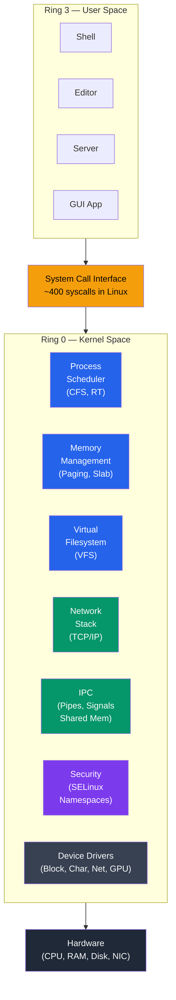
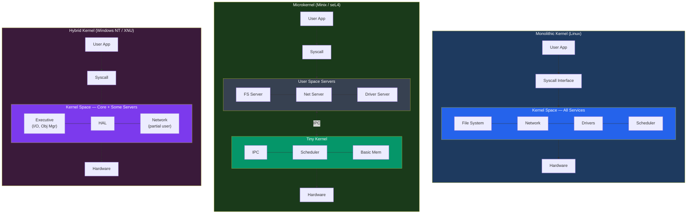

# Kernel Architecture

## What You'll Learn

- Kernel kya hota hai aur uski core responsibilities kya hain
- Monolithic kernel deep dive: Linux kernel subsystems, modules, /proc, /sys
- Microkernel deep dive: Minix, L4, QNX — IPC, reliability, aur design
- Hybrid kernel: Windows NT kernel aur macOS XNU/Darwin
- Exokernel concept: library operating systems
- Unikernel concept: single-purpose, single-address-space machines
- Sabhi kernel types ka detailed comparison with trade-offs
- Linux kernel architecture diagram aur source code layout

## Kernel Kya Hota Hai?

Socho tumne ek naya laptop kharida. Power button dabate hi bootloader chalta hai, aur uske turant baad jo sabse pehla "asli" program load hota hai — woh hai **kernel**. Yeh OS ka dil hai. Jab tak system on rehta hai, kernel memory mein resident rehta hai — kabhi unload nahi hota. Har application, har device driver, har user process — sab kuch is par depend karta hai.

Isko aise samjho — kernel ek building ka **security guard + facility manager** hai jo 24x7 duty pe hai. Building mein jo bhi log (applications) rehte hain, unhe electricity chahiye (CPU time), paani chahiye (memory), parking chahiye (disk space) — sab kuch is manager se hi milta hai. Koi bhi tenant directly building ke core infrastructure ko touch nahi kar sakta; sab kuch manager (kernel) ke through hi hota hai.

### Kyun Zaruri Hai Kernel?

Agar kernel na ho, toh har application ko khud CPU scheduling, memory allocation, disk read/write, network packets — sab kuch low-level hardware instructions se karna padega. Har app apna khud ka driver likhega, apna khud ka memory manager banayega. Result? Chaos. Do apps ek hi memory address use karne ki koshish karenge, ek app doosre ka CPU time chura lega, aur system crash ho jayega.

Kernel yeh sab centralize karta hai:

```
Kernel Responsibilities:
────────────────────────
1. Process management   → Create, schedule, terminate processes
2. Memory management    → Virtual memory, paging, allocation
3. Device management    → Drivers, interrupt handling
4. File systems         → VFS layer, specific FS implementations
5. Networking           → TCP/IP stack, socket interface
6. Security             → Access control, capabilities
7. IPC                  → Pipes, signals, shared memory, sockets
```

Zomato ke case mein socho — jab tum app kholte ho, order place karte ho, restaurant se chat karte ho — yeh sab "applications" hain jo background mein chal rahi hain. Lekin in sab ko CPU time chahiye, memory chahiye, network access chahiye. Yeh sab kaun manage karta hai? Underlying phone ka kernel (Android/iOS). Woh decide karta hai ki kis app ko kitna CPU milega, kaun sa app background mein suspend hoga, aur network packets kis order mein bhejenge jayenge.

### Kernel Ki Position System Mein

CPU mein "rings" ka concept hota hai — privilege levels. Ring 0 sabse powerful hai (full hardware access), Ring 3 sabse restricted (normal apps). Yeh separation security ke liye hai — agar Excel crash ho jaye, poora system crash nahi hona chahiye.

```
Kernel's Position in the System:
─────────────────────────────────

    ┌───────────────────────────┐
    │     User Applications     │  Ring 3 (unprivileged)
    ├───────────────────────────┤
    │   System Call Interface   │  ← boundary
    ├───────────────────────────┤
    │         KERNEL            │  Ring 0 (privileged)
    │  (runs with full access   │
    │   to CPU and memory)      │
    ├───────────────────────────┤
    │        Hardware           │
    └───────────────────────────┘
```

> [!info]
> Yeh Ring 0 vs Ring 3 wahi concept hai jo tumne pehle bhi dekha hoga — jab bhi tumhara Node.js app `fs.readFile()` call karta hai, woh internally ek **syscall** karta hai jo Ring 3 se Ring 0 mein jump karta hai. Yeh boundary crossing hi hai jisse security aur stability milti hai.

Neeche diagram mein Linux kernel ke andar ke major subsystems dikhaye gaye hain — scheduler, memory management, VFS, network stack, IPC, security, aur device drivers. Yeh sab ek hi "kernel space" mein baithe hain aur system call interface ke through user apps se connect hote hain.



Ab yeh samajhne ke baad ki kernel kya karta hai, sawaal yeh hai — kernel ko **design** kaise karein? Sab services ko ek hi jagah rakhein (monolithic), ya alag-alag chhote pieces mein todein (microkernel), ya bich ka raasta le (hybrid)? Aage yeh sab detail mein dekhte hain.

## 1. Monolithic Kernel — In Depth

**Kya hota hai?** Monolithic kernel mein OS ki saari services — scheduler, memory manager, file system, network stack, drivers — sab ek hi bade binary mein, ek hi address space mein, kernel mode mein chalte hain. Koi bhi component doosre component ko seedha function call kar sakta hai — koi message-passing ka overhead nahi.

Isko aise socho — Zomato ka ek **monolithic backend** jahan order management, payment, restaurant listing, delivery tracking — sab kuch ek hi codebase mein, ek hi process mein chal raha hai. Fast hai kyunki sab kuch same memory mein hai, function calls direct hain, koi network hop nahi. Lekin risk yeh hai — agar payment module mein koi bug crash karwa de, poora backend down ho sakta hai.

Linux exactly yehi approach follow karta hai. Yeh monolithic hai, lekin ismein loadable modules ka flexibility bhi hai (aage dekhenge).

### Linux Kernel Architecture

Neeche ka diagram Linux kernel ke andar ka real structure dikhata hai — kaise user space apps syscall interface ke through kernel ke subsystems (scheduler, memory, VFS, network, IPC, security) tak pahunchte hain, aur kaise yeh sab device drivers aur architecture-specific code ke through hardware tak jaate hain.

```
┌──────────────────────────────────────────────────────────────┐
│                        User Space                             │
│   ┌────────┐ ┌────────┐ ┌────────┐ ┌────────┐ ┌──────────┐  │
│   │ shell  │ │ editor │ │ server │ │ daemon │ │ GUI app  │  │
│   └───┬────┘ └───┬────┘ └───┬────┘ └───┬────┘ └────┬─────┘  │
├───────┼──────────┼──────────┼──────────┼───────────┼─────────┤
│       └──────────┴──────────┴──────────┴───────────┘         │
│                  System Call Interface                         │
│                  (≈400 syscalls in Linux)                     │
├──────────────────────────────────────────────────────────────┤
│                                                              │
│  ┌──────────────┐  ┌──────────────┐  ┌──────────────────┐   │
│  │   Process     │  │   Memory     │  │  Virtual File    │   │
│  │  Scheduler    │  │  Management  │  │  System (VFS)    │   │
│  │              │  │              │  │                  │   │
│  │ - CFS        │  │ - Page tables│  │ - inode/dentry   │   │
│  │ - RT sched   │  │ - Slab alloc │  │ - superblock     │   │
│  │ - Load bal.  │  │ - OOM killer │  │ - file ops       │   │
│  └──────────────┘  └──────────────┘  └──────────────────┘   │
│                                                              │
│  ┌──────────────┐  ┌──────────────┐  ┌──────────────────┐   │
│  │  Network     │  │   IPC        │  │  Security        │   │
│  │  Stack       │  │              │  │                  │   │
│  │              │  │ - Pipes      │  │ - SELinux        │   │
│  │ - TCP/IP     │  │ - Signals   │  │ - AppArmor       │   │
│  │ - Netfilter  │  │ - Sockets   │  │ - Capabilities   │   │
│  │ - Socket API │  │ - Shared mem│  │ - Namespaces     │   │
│  └──────────────┘  └──────────────┘  └──────────────────┘   │
│                                                              │
│  ┌──────────────────────────────────────────────────────┐    │
│  │              Device Drivers                           │    │
│  │  Block │ Char │ Network │ USB │ GPU │ Input │ Sound  │    │
│  └──────────────────────────────────────────────────────┘    │
│                                                              │
│  ┌──────────────────────────────────────────────────────┐    │
│  │     Architecture-Dependent Code (arch/)               │    │
│  │     x86, ARM, RISC-V, MIPS, PowerPC                  │    │
│  └──────────────────────────────────────────────────────┘    │
├──────────────────────────────────────────────────────────────┤
│                        Hardware                              │
└──────────────────────────────────────────────────────────────┘
```

Dekho — process scheduler, memory management, VFS, network stack, IPC, security — sab ek hi kernel binary ke andar rehte hain. Yeh isliye fast hai kyunki VFS ko agar block driver se baat karni hai, woh seedha ek function call karta hai — koi message serialize/deserialize nahi karna padta, koi context switch nahi hota beech mein.

### Linux Kernel Source Tree

Agar tum kabhi Linux kernel ka source code clone karoge (`git clone https://github.com/torvalds/linux`), toh yeh structure milega. Ismein `mm/` folder woh hai jahan saara memory management code hai, `fs/` mein file systems, `net/` mein poora TCP/IP stack, aur `drivers/` sabse bada folder hai (thousands of hardware drivers).

```
linux/
├── arch/          Architecture-specific code (x86, arm, riscv)
├── block/         Block I/O layer
├── crypto/        Cryptographic API
├── drivers/       Device drivers (largest directory)
│   ├── gpu/       Graphics drivers
│   ├── net/       Network drivers
│   ├── usb/       USB drivers
│   └── ...        Thousands of drivers
├── fs/            File systems (ext4, btrfs, xfs, nfs, proc)
├── include/       Header files
├── init/          Kernel initialization (main.c → start_kernel)
├── ipc/           Inter-process communication
├── kernel/        Core kernel (scheduler, signals, time)
├── lib/           Helper libraries
├── mm/            Memory management (paging, slab, vmalloc)
├── net/           Networking (TCP/IP, socket layer)
├── security/      Security frameworks (SELinux, AppArmor)
└── sound/         Audio subsystem (ALSA)
```

### Kernel Modules

**Sawaal:** Agar sab kuch ek hi monolithic binary mein hai, toh naya WiFi card plug karne pe poora kernel recompile karna padega kya?

**Jawaab:** Nahi — Linux ne isko solve kiya **Loadable Kernel Modules (LKMs)** se. Yeh essentially compiled `.ko` files hain jo running kernel mein dynamically insert aur remove ho sakte hain, bina reboot kiye. Socho isko Node.js ke `require()` jaisa — jab zarurat ho, module load karo; kaam khatam, unload kar do.

```c
/* chardev_module.c - A simple character device module */
#include <linux/init.h>
#include <linux/module.h>
#include <linux/fs.h>

#define DEVICE_NAME "mychardev"
static int major_num;

static int dev_open(struct inode *inodep, struct file *filep) {
    printk(KERN_INFO "mychardev: device opened\n");
    return 0;
}

static ssize_t dev_read(struct file *filep, char *buffer,
                        size_t len, loff_t *offset) {
    printk(KERN_INFO "mychardev: read requested\n");
    return 0;
}

static struct file_operations fops = {
    .open = dev_open,
    .read = dev_read,
};

static int __init chardev_init(void) {
    major_num = register_chrdev(0, DEVICE_NAME, &fops);
    printk(KERN_INFO "mychardev: registered with major %d\n",
           major_num);
    return 0;
}

static void __exit chardev_exit(void) {
    unregister_chrdev(major_num, DEVICE_NAME);
    printk(KERN_INFO "mychardev: unregistered\n");
}

module_init(chardev_init);
module_exit(chardev_exit);
MODULE_LICENSE("GPL");
```

Upar wala code ek simple character device module hai. `module_init` aur `module_exit` woh entry/exit points hain jaise tumhare Express app mein `app.listen()` aur graceful shutdown handler hote hain. `printk` basically kernel ka `console.log` hai — output `dmesg` mein dikhta hai, terminal pe nahi.

```bash
# Kernel module management
lsmod                              # List loaded modules
modinfo ext4                       # Module information
sudo insmod mymodule.ko            # Load module
sudo rmmod mymodule                # Remove module
sudo modprobe nvidia               # Load with dependencies
dmesg | tail -20                   # View kernel messages
```

> [!tip]
> `modprobe` aur `insmod` mein fark yeh hai — `insmod` sirf woh module load karega jo tum specify karo, agar uski dependency missing hai toh fail ho jayega. `modprobe` dependencies ko automatically resolve karke load karta hai — jaise `npm install` transitive dependencies khud handle karta hai, `insmod` jaise `node module.js` direct file run karna.

### /proc and /sys Filesystems

**Kya hota hai?** `/proc` aur `/sys` real filesystems nahi hain jo disk pe stored hain — yeh **virtual filesystems** hain jo kernel apni internal data structures ko files ki tarah expose karta hai. Jab tum `cat /proc/cpuinfo` karte ho, kernel real-time mein woh content generate karta hai — koi actual file disk pe nahi hoti.

Isko UPI ke transaction history jaisa socho — jab tum apni bank statement dekhte ho, woh "file" pehle se stored nahi hoti; bank ka system real-time mein tumhare liye generate karta hai based on current data. Waise hi `/proc/meminfo` request aane pe kernel apni current memory stats se ek "file" bana ke deta hai.

```bash
# /proc - Process and kernel information
cat /proc/cpuinfo              # CPU details
cat /proc/meminfo              # Memory statistics
cat /proc/version              # Kernel version
cat /proc/1/status             # Process 1 (init) status
cat /proc/sys/kernel/hostname  # Kernel parameters
ls /proc/$$                    # Current process info

# /sys - Kernel object model (sysfs)
ls /sys/class/net/             # Network interfaces
cat /sys/class/thermal/thermal_zone0/temp  # CPU temperature
ls /sys/block/                 # Block devices
cat /sys/devices/system/cpu/cpu0/cpufreq/scaling_cur_freq
```

`/proc` bahut purana hai aur organically grow hua hai — isliye content thoda mixed-bag hai (kabhi ek file mein multiple values, kabhi single value). `/sys` baad mein aaya aur zyada structured hai — generally ek file mein ek hi value hoti hai (jaise `scaling_cur_freq` file sirf ek number deta hai).

```
/proc vs /sys:
┌──────────────────────────┬────────────────────────────┐
│        /proc              │          /sys               │
├──────────────────────────┼────────────────────────────┤
│ Process information      │ Device/driver model        │
│ Kernel parameters        │ Hardware attributes        │
│ Legacy, grew organically │ Structured, well-organized │
│ Mixed content            │ One value per file (mostly)│
│ Read and write           │ Read and write             │
└──────────────────────────┴────────────────────────────┘
```

### Kernel Compilation Basics

Kabhi socha hai ki `uname -r` jo version number dikhata hai, woh kernel kaise ban ke aata hai? Neeche basic steps hain kernel source se compile karke apna khud ka kernel banane ke — bilkul waise jaise tum apne Node.js project ko source se build karte ho, bas yahan `make` hai `npm run build` ki jagah.

```bash
# Building the Linux kernel from source
# 1. Get source
wget https://cdn.kernel.org/pub/linux/kernel/v6.x/linux-6.x.tar.xz
tar xf linux-6.x.tar.xz && cd linux-6.x

# 2. Configure
make menuconfig          # Interactive menu configuration
# Or copy existing config
cp /boot/config-$(uname -r) .config
make olddefconfig

# 3. Build
make -j$(nproc)          # Compile kernel (parallel)

# 4. Install
sudo make modules_install
sudo make install

# 5. Update bootloader
sudo update-grub         # Debian/Ubuntu
sudo grub2-mkconfig -o /boot/grub2/grub.cfg  # RHEL/Fedora
```

> [!warning]
> Kernel compile karna time-consuming hai (kabhi kabhi ghanton lag jaate hain agar machine slow hai) aur `-j$(nproc)` flag zaruri hai taaki saare CPU cores parallel mein use ho — warna single core pe compile hona bahut slow hoga.

## 2. Microkernel — In Depth

**Kya hota hai?** Ab monolithic ka bilkul opposite approach dekhte hain. Microkernel mein sirf **bare minimum** cheezein kernel space mein rehti hain — IPC (inter-process communication), basic CPU scheduling, aur low-level memory management. Baaki sab kuch — file system, drivers, network stack — user-space "servers" ke roop mein chalta hai, normal processes ki tarah.

Isko Swiggy ke **microservices architecture** jaisa socho — order service alag, payment service alag, delivery-tracking service alag, sab apne-apne container mein chal rahe hain aur ek dusre se HTTP/gRPC calls (yaani "message passing") ke through baat karte hain. Agar payment service crash ho jaye, order service abhi bhi zinda rahegi. Yehi fault isolation microkernel ka core selling point hai.

### Microkernel Design

```
┌────────────────────────────────────────────────────────────┐
│                       User Space                            │
│                                                            │
│  ┌──────────┐ ┌──────────┐ ┌──────────┐ ┌──────────────┐  │
│  │  File    │ │  Device  │ │ Network  │ │  Process     │  │
│  │  System  │ │  Driver  │ │  Server  │ │  Manager     │  │
│  │  Server  │ │  Server  │ │          │ │  Server      │  │
│  └────┬─────┘ └────┬─────┘ └────┬─────┘ └──────┬───────┘  │
│       │            │            │               │          │
│       └────────────┴─────┬──────┴───────────────┘          │
│                          │                                 │
│                   IPC Messages                             │
│                          │                                 │
├──────────────────────────┼─────────────────────────────────┤
│                          ▼                                 │
│  ┌──────────────────────────────────────────────────────┐  │
│  │                   Microkernel                        │  │
│  │                                                      │  │
│  │   ┌───────────┐  ┌────────────┐  ┌───────────────┐  │  │
│  │   │    IPC    │  │  Basic     │  │  Low-level    │  │  │
│  │   │ (message  │  │  CPU       │  │  Memory       │  │  │
│  │   │  passing) │  │  Scheduling│  │  Management   │  │  │
│  │   └───────────┘  └────────────┘  └───────────────┘  │  │
│  │   ┌────────────────────────────────────────────┐     │  │
│  │   │   Interrupt Handling / Hardware Abstraction │     │  │
│  │   └────────────────────────────────────────────┘     │  │
│  └──────────────────────────────────────────────────────┘  │
├────────────────────────────────────────────────────────────┤
│                        Hardware                            │
└────────────────────────────────────────────────────────────┘
```

Dekho — File System Server, Device Driver Server, Network Server, Process Manager Server — sab alag-alag user-space processes hain jo microkernel se IPC messages ke through baat karte hain. Kernel khud sirf traffic-cop ka kaam karta hai.

### IPC Overhead — The Core Trade-off

**Kyun zaruri hai yeh samajhna?** Yeh microkernel ka sabse bada trade-off hai — reliability milti hai, lekin performance ki keemat pe. Ek simple file read operation dono architectures mein kaise chalta hai, yeh compare karte hain:

```
File read in monolithic kernel:
  App ──syscall──▶ Kernel (VFS → ext4 → block driver) ──▶ App
  Context switches: 2 (user→kernel, kernel→user)

File read in microkernel:
  App ──msg──▶ Kernel ──msg──▶ FS Server ──msg──▶ Kernel
  ──msg──▶ Disk Driver ──msg──▶ Kernel ──msg──▶ FS Server
  ──msg──▶ Kernel ──msg──▶ App
  Context switches: 8+ (each message = mode switch)

Performance cost:
  Each IPC message involves:
  1. Copy message from sender to kernel
  2. Context switch to receiver
  3. Copy message from kernel to receiver
  Total: ~2-10x slower for I/O-heavy operations
```

Yeh bilkul waisa hi hai jaise ek monolithic backend mein function call karna (nanoseconds) vs microservices mein network call karna (milliseconds — serialize, network hop, deserialize). Har IPC message ek "mode switch" trigger karta hai (user↔kernel), aur yeh cumulative overhead heavy I/O workloads mein clearly dikhta hai. Isi wajah se microkernels historically "slow" maane gaye — lekin reliability aur security ke liye yeh trade-off worth hai kuch use-cases mein (jaise safety-critical systems).

### Minix 3 — Self-Healing Microkernel

Minix 3 ek research-grade microkernel hai jiska sabse interesting feature hai **self-healing**. Socho agar tumhare Swiggy app mein delivery-tracking service crash ho jaye, aur ek "supervisor" process automatically usse restart kar de bina user ko kuch pata chale — order service, payment sab chalte rahein. Minix 3 mein yeh kaam karta hai **Reincarnation Server (RS)**.

```
Minix 3 Architecture:
┌──────────────────────────────────────┐
│          User Processes              │
├──────────────────────────────────────┤
│          Server Layer                │
│  ┌─────┐ ┌─────┐ ┌─────┐ ┌───────┐ │
│  │ VFS │ │ PM  │ │ RS  │ │ Net   │ │
│  │     │ │     │ │     │ │Server │ │
│  └─────┘ └─────┘ └─────┘ └───────┘ │
├──────────────────────────────────────┤
│          Driver Layer                │
│  ┌──────┐ ┌──────┐ ┌──────┐        │
│  │ Disk │ │ TTY  │ │ NIC  │  ...   │
│  │Driver│ │Driver│ │Driver│        │
│  └──────┘ └──────┘ └──────┘        │
├──────────────────────────────────────┤
│        Microkernel (~6000 LOC)       │
│   IPC, Scheduling, Interrupts       │
└──────────────────────────────────────┘

RS = Reincarnation Server
- Monitors all drivers and servers
- If a driver crashes, RS restarts it automatically
- System continues running (self-healing)
```

Sirf **~6000 lines of code** ka kernel hai yeh — compare karo Linux ke crores lines of code se. Chhota kernel matlab kam attack surface, aur kam jagah bugs chhupane ke liye.

### L4 Microkernel Family

L4 family ek aur important microkernel lineage hai jisne "IPC slow hota hai" wali dhaarna ko challenge kiya — inhone IPC ko itna optimize kiya ki woh monolithic ke close aa gaya.

```
L4 Design Principles:
- Minimal kernel: only IPC, address spaces, threads
- ~10,000 lines of code
- Extremely fast IPC (optimized message passing)
- Proven formally correct (seL4 variant)

seL4:
- First OS kernel with complete formal verification
- Mathematically proven to have no bugs (in specification)
- Used in military, aerospace, and automotive
- Approximately 10,000 lines of C code

L4 Variants:
- L4/Fiasco (TU Dresden) → used in Genode OS
- OKL4 (Open Kernel Labs) → used in billions of modems
- seL4 (UNSW/Data61) → formally verified
```

> [!tip]
> **seL4** sabse special isliye hai kyunki yeh duniya ka pehla OS kernel hai jiski correctness **mathematically prove** ki gayi hai — matlab kisi mathematician ne formally verify kiya ki iske specification mein (given assumptions ke andar) koi bug nahi hai. Yeh isliye critical systems mein use hota hai — jaise autonomous vehicles ya defense systems, jahan ek bug ki keemat jaan bhi ho sakti hai.

### QNX — Real-Time Microkernel

**Kya hota hai?** QNX ek commercial, real-time microkernel hai jo 1980s se production mein hai — matlab yeh sirf research paper nahi hai, balki decades se real duniya mein cars, medical devices, aur industrial systems chala raha hai. Iska core design principle Minix aur L4 jaisa hi hai — kernel sirf message passing, scheduling, aur basic memory management karta hai, baaki sab (file systems, network stack, drivers) user-space processes hote hain.

Isko IRCTC ke real-time booking counter jaisa socho — jab Tatkal booking khulta hai, system ko **guaranteed** response time chahiye, "eventually" response nahi chalega. QNX ka scheduler priority-based aur deterministic hai — matlab agar ek high-priority task ko 5ms mein respond karna hai, toh system yeh guarantee de sakta hai, chahe baaki system kitna bhi busy ho. Yehi wajah hai ki QNX **hard real-time** systems mein use hota hai — jahan deadline miss karna sirf "slow" nahi, balki **catastrophic** ho sakta hai (jaise car ka brake control system ya pacemaker).

```
QNX Neutrino Architecture:
┌────────────────────────────────────────────┐
│              User Processes                 │
│  ┌────────┐ ┌────────┐ ┌────────┐          │
│  │  Apps  │ │  File  │ │Network │  ...     │
│  │        │ │ System │ │ Stack  │          │
│  └────────┘ └────────┘ └────────┘          │
├────────────────────────────────────────────┤
│         Message Passing (IPC)              │
│   (synchronous, priority-driven)           │
├────────────────────────────────────────────┤
│           QNX Microkernel                   │
│   - Thread scheduling (priority-based,      │
│     preemptible)                            │
│   - Signal handling                         │
│   - Timers                                  │
│   - Basic IPC primitives                    │
└────────────────────────────────────────────┘

Used in: Cars (infotainment + safety systems),
medical devices, industrial robots, routers
(Cisco), nuclear plant control systems
```

Real duniya mein QNX bahut sunne mein nahi aata (kyunki yeh consumer-facing nahi hai) — lekin BMW, General Motors jaisi car companies apne infotainment aur safety-critical ECUs mein QNX use karti hain. Iski wajah simple hai — reliability aur predictability non-negotiable hai jab tumhari car ka braking system ya airbag control kernel pe depend karta ho.

> [!info]
> Real-time ka matlab "fast" nahi hota, matlab **predictable** hota hai. Ek hard real-time system 100ms mein bhi respond kar sakta hai, jab tak woh 100ms **guaranteed** hai har baar. Iske compare mein tumhara normal Linux laptop kabhi 1ms mein respond karega, kabhi 50ms — average fast hai lekin guarantee nahi hai. Yehi fark hai general-purpose OS aur real-time OS (RTOS) mein.

## 3. Hybrid Kernel

**Kya hota hai?** Ab tak humne dekha — monolithic (sab kuch ek jagah, fast lekin fragile) aur microkernel (sab kuch alag-alag, reliable lekin slow). Hybrid kernel dono ka best-of-both-worlds nikaalta hai: performance-critical services (scheduler, memory manager, I/O) kernel space mein rakho for speed, lekin design modular rakho — microkernel-inspired structure ke saath.

Yeh bilkul waisa hai jaise CRED ya Paytm apna backend design karte hain — critical, latency-sensitive paths (transaction processing) monolith-jaisa tightly coupled rakhte hain for speed, lekin baaki modules (notifications, analytics) ko cleanly separate rakhte hain modularity ke liye. Best of both duniya.

### Windows NT Kernel Architecture

Windows NT (jo aaj bhi Windows 10/11 ke andar chalta hai) is approach ka classic example hai.

```
┌──────────────────────────────────────────────────────┐
│                     User Mode                         │
│                                                      │
│  ┌──────────────┐  ┌──────────────┐  ┌────────────┐ │
│  │ Environment  │  │ Environment  │  │  System    │ │
│  │ Subsystem    │  │ Subsystem    │  │  Processes │ │
│  │ (Win32/WoW64)│  │ (WSL/POSIX) │  │ (services) │ │
│  └──────┬───────┘  └──────┬───────┘  └─────┬──────┘ │
├─────────┼─────────────────┼────────────────┼─────────┤
│         ▼     Kernel Mode  ▼                ▼        │
│  ┌───────────────────────────────────────────────┐   │
│  │              Executive Layer                  │   │
│  │  ┌──────┐ ┌──────┐ ┌──────┐ ┌──────┐         │   │
│  │  │  I/O │ │Object│ │ Proc │ │Memory│         │   │
│  │  │  Mgr │ │  Mgr │ │  Mgr │ │  Mgr │         │   │
│  │  └──────┘ └──────┘ └──────┘ └──────┘         │   │
│  │  ┌──────┐ ┌──────┐ ┌──────────────┐          │   │
│  │  │Cache │ │  Sec │ │ Plug & Play  │          │   │
│  │  │  Mgr │ │  Mgr │ │   Manager    │          │   │
│  │  └──────┘ └──────┘ └──────────────┘          │   │
│  ├───────────────────────────────────────────────┤   │
│  │            NT Kernel (ntoskrnl.exe)           │   │
│  │  Thread scheduling, interrupt dispatching,    │   │
│  │  exception handling, synchronization          │   │
│  ├───────────────────────────────────────────────┤   │
│  │   Hardware Abstraction Layer (hal.dll)        │   │
│  └───────────────────────────────────────────────┘   │
├──────────────────────────────────────────────────────┤
│                      Hardware                        │
└──────────────────────────────────────────────────────┘

Why "hybrid":
- Microkernel-inspired modular design (Executive layer)
- But Executive runs in kernel mode (like monolithic)
- HAL provides hardware abstraction (microkernel idea)
- Subsystem architecture allows multiple OS personalities
```

Interesting cheez yahan **Environment Subsystems** hai — Win32/WoW64 subsystem apps ke liye Windows API expose karta hai, aur WSL subsystem Linux/POSIX apps ke liye alag "personality" deta hai. Isi wajah se tum Windows pe WSL2 ke through Linux binaries chala pate ho — yeh subsystem-based flexibility hybrid design ka fayda hai.

`hal.dll` (Hardware Abstraction Layer) ek microkernel-jaisi idea hai — hardware-specific details ko abstract karke rakhna, taaki upar ka kernel code hardware-agnostic rahe. Isi wajah se Windows alag-alag CPU architectures pe portable hai.

### macOS XNU Kernel

macOS ka kernel, **XNU** ("X is Not Unix"), hybrid design ka doosra bada example hai — aur yeh sabse literal tareeke se "hybrid" hai kyunki isme do alag-alag kernel philosophies literally saath mein compile hoti hain.

```
XNU = "X is Not Unix"

┌──────────────────────────────────────────────────┐
│                   XNU Kernel                      │
│                                                  │
│  ┌─────────────────────┐  ┌───────────────────┐  │
│  │     Mach Layer       │  │    BSD Layer       │  │
│  │   (microkernel)      │  │  (monolithic)      │  │
│  │                     │  │                   │  │
│  │ - Task/thread mgmt  │  │ - POSIX API       │  │
│  │ - Virtual memory    │  │ - VFS             │  │
│  │ - IPC (Mach ports)  │  │ - Networking      │  │
│  │ - Scheduling        │  │ - File systems    │  │
│  │ - Memory objects    │  │ - Security (MAC)  │  │
│  └─────────────────────┘  └───────────────────┘  │
│                                                  │
│  ┌──────────────────────────────────────────┐    │
│  │              I/O Kit                      │    │
│  │  Object-oriented driver framework (C++)   │    │
│  │  Loadable kernel extensions (kexts)       │    │
│  └──────────────────────────────────────────┘    │
│                                                  │
│  ┌──────────────────────────────────────────┐    │
│  │       libkern / Platform Expert           │    │
│  │    (hardware abstraction)                 │    │
│  └──────────────────────────────────────────┘    │
└──────────────────────────────────────────────────┘

Key insight: XNU runs both Mach and BSD in kernel space.
It's a hybrid because it uses microkernel concepts (Mach IPC)
but runs everything in kernel mode for performance.
```

Yahan **Mach layer** originally ek pure microkernel tha (Carnegie Mellon University project), aur **BSD layer** ek classic monolithic Unix kernel se derived hai. Apple ne dono ko literally ek saath jod diya — Mach IPC ka concept use karte hain, lekin BSD layer ko bhi kernel mode mein hi rakha for performance, instead of separate user-space server ke roop mein. Isi wajah se yeh "hybrid" kehlaata hai — architecture microkernel-jaisi dikhti hai, lekin execution monolithic-jaisa fast hai.

## 4. Exokernel

**Kya hota hai?** Ab tak humne dekha — kernel apps ko hardware ka ek "abstraction" deta hai (files, sockets, virtual memory). Exokernel is idea ko ulta karta hai — yeh hardware ko **directly** apps ko expose karta hai, aur decide nahi karta ki resources kaise manage hon. Kernel sirf itna karta hai ki koi app kisi doosre app ka resource churaye nahi (protection), baaki policy app khud decide kare.

Isko IRCTC ke context mein socho — normal OS jaise Tatkal booking system khud decide karta hai kaunsi queue algorithm use karni hai, kis order mein requests process karni hain. Exokernel-jaisa approach hoga agar IRCTC har vendor (Ixigo, MakeMyTrip, Cleartrip) ko raw database access de de aur bole "tum khud decide karo kaise query optimize karni hai, hum bas itna ensure karenge ki tum ek dusre ka data corrupt na karo." Har vendor apna khud ka optimized "query engine" bana sakta hai apni specific need ke hisaab se.

```
Traditional OS:
  App → OS abstraction → Hardware
  (OS decides HOW to manage resources)

Exokernel:
  App → Library OS → Raw hardware access
  (App decides HOW to manage resources)
  (Exokernel only ensures PROTECTION)

┌──────────────────────────────────────────┐
│           Application 1 + LibOS A        │
│  (custom file system, memory allocator)  │
├──────────────────────────────────────────┤
│           Application 2 + LibOS B        │
│  (different file system, allocator)      │
├──────────────────────────────────────────┤
│              Exokernel                   │
│  (only multiplexes and protects          │
│   hardware resources — no abstractions)  │
├──────────────────────────────────────────┤
│              Hardware                    │
└──────────────────────────────────────────┘

The exokernel only:
- Tracks which app owns which resources
- Prevents unauthorized access
- Does NOT impose file systems, scheduling policies, etc.
```

Yahan **Library OS (LibOS)** ek key concept hai — traditionally jo cheezein kernel provide karta tha (file system implementation, memory allocator), woh ab application ke saath link hone wali ek library ban jaati hai. Har application apna khud ka LibOS choose kar sakta hai jo uske use-case ke liye optimize ho.

### Characteristics

```
Advantages:
+ Maximum flexibility for applications
+ Each app can optimize its own resource management
+ Very thin kernel — small attack surface
+ Can outperform traditional OS for specialized workloads

Disadvantages:
- Each application must include its own "library OS"
- Duplication of effort (every app reinvents the wheel)
- Primarily a research concept — few production systems
- Harder for general-purpose computing
```

Practical mein exokernel bahut kam production systems mein dikhta hai — mostly MIT ka research project (Exokernel/ExOS) isi idea ka origin hai. Lekin concept ne unikernels aur DPDK jaise "kernel-bypass" networking techniques ko inspire kiya, jo aaj high-performance systems mein real use hote hain.

## 5. Unikernel

**Kya hota hai?** Unikernel ek radically different approach leta hai — application aur usse zaruri OS components ko compile-time pe hi ek saath jod ke ek single machine image bana dete hain. Koi user-space/kernel-space separation nahi hai — sab kuch ek hi address space mein chalta hai.

Socho tumhara Node.js microservice deploy karna hai. Normal approach: full Linux OS boot karo (jisme hazaron unused packages, shell, cron, SSH server, sab kuch hai), fir usme apna app deploy karo. Unikernel approach: sirf woh minimal cheezein compile karo jo tumhare app ko chahiye (network stack, memory allocator) — aur poori OS ki zarurat hi nahi. Result: ek chhoti, fast-booting, single-purpose image jo sirf ek kaam karti hai.

```
Traditional OS:                    Unikernel:
┌─────────────┐                    ┌─────────────┐
│    App      │                    │             │
├─────────────┤                    │  App + OS   │
│  Libraries  │                    │  compiled   │
├─────────────┤          →         │  together   │
│   OS Kernel │                    │  into one   │
├─────────────┤                    │  image      │
│  Unused OS  │                    │             │
│  components │                    └─────────────┘
└─────────────┘                    Size: ~1-50 MB
Size: ~200 MB+
```

Yeh bilkul waisa hai jaise Docker image banate waqt tum `FROM scratch` use karo instead of `FROM ubuntu` — sirf woh binary include karo jo chahiye, baaki sab strip out. Unikernel yeh idea aur ek level aage le jaata hai — poore OS ko hi app-specific bana deta hai.

```
Unikernel characteristics:
- Single application per VM
- No shell, no users, no unnecessary services
- Boot in milliseconds
- Tiny attack surface
- Immutable — rebuild and redeploy to update
```

> [!tip]
> "Immutable — rebuild and redeploy to update" wala point bahut important hai. Unikernel mein tum SSH karke live server mein `vim` se file edit nahi karte — koi shell hi nahi hai! Update karna hai toh naya image build karo aur purane ko replace kar do. Yeh bilkul modern container/serverless deployment philosophy jaisa hai (immutable infrastructure) — bas ek level aur deep, poore OS tak extend kiya hua.

### Examples

```
MirageOS:
- Written in OCaml
- Compiles to Xen hypervisor images
- Used by Docker for networking components

IncludeOS:
- Written in C++
- Boots in ~300ms
- Used for microservices and network functions

Unik:
- Tool to build unikernels from Go, Python, Java, etc.
- Targets AWS, VirtualBox, QEMU
```

300ms boot time — compare karo full Linux VM ke 10-30 second boot time se. Yeh serverless/edge computing use-cases ke liye perfect hai jahan tumhe cold-start latency minimize karni hai.

## Kernel Architecture Comparison

Ab sabko ek saath dekhte hain — kaise same "user app → hardware" journey teeno major architectures mein different tareeke se hoti hai.



Neeche ka table sabhi paanch architectures ka side-by-side trade-off comparison hai — yeh interview mein bhi kaafi common sawaal hai ("monolithic vs microkernel, trade-offs batao"):

| Feature | Monolithic | Microkernel | Hybrid | Exokernel | Unikernel |
|---------|-----------|-------------|--------|-----------|-----------|
| **Kernel size** | Large (millions LOC) | Small (thousands LOC) | Medium | Minimal | N/A (merged) |
| **Performance** | Highest | Lower (IPC cost) | High | Potentially highest | Very high |
| **Reliability** | Lower (one bug crashes all) | Highest (fault isolation) | Medium-High | Varies | High (minimal code) |
| **Security** | Medium (large attack surface) | High (small surface) | Medium-High | App-dependent | High (tiny surface) |
| **Flexibility** | Medium (modules) | High (user-space servers) | Medium | Maximum | Low (single purpose) |
| **Complexity** | High | Medium | Very High | Low (kernel) / High (apps) | Low |
| **Use cases** | Servers, desktops | Safety-critical, embedded | Commercial desktop OS | Research | Cloud microservices |
| **Examples** | Linux, FreeBSD | Minix, seL4, L4, QNX | Windows NT, XNU | MIT Exokernel | MirageOS, IncludeOS |

## Practical Exploration

Chalo ab apne khud ke Linux system pe yeh sab concepts explore karte hain — theory se zyada practical experience zaruri hai:

```bash
# Explore your kernel
uname -r                           # Kernel version
uname -a                           # Full kernel info
cat /proc/version                  # How kernel was compiled

# Kernel configuration
cat /boot/config-$(uname -r) | grep CONFIG_PREEMPT
# CONFIG_PREEMPT_NONE, CONFIG_PREEMPT_VOLUNTARY, CONFIG_PREEMPT

# Check if kernel is monolithic with modules
cat /boot/config-$(uname -r) | grep CONFIG_MODULES
# CONFIG_MODULES=y  → loadable module support enabled

# Kernel memory usage
free -h                            # System memory overview
cat /proc/meminfo | head -5        # Detailed memory stats

# See kernel threads
ps -ef | grep "\[.*\]" | head -20  # Kernel threads in brackets

# Kernel log
dmesg | head -30                   # Boot and kernel messages
journalctl -k | tail -20           # Kernel journal (systemd)
```

> [!info]
> `ps -ef | grep "\[.*\]"` command interesting hai — Linux mein kernel threads ke naam brackets mein dikhte hain (jaise `[kworker/0:1]`, `[ksoftirqd/0]`) taaki unhe normal user processes se distinguish kiya ja sake. Yeh threads kernel ke andar hi chalte hain background tasks handle karne ke liye.

## Exercises

### Beginner
1. Run `uname -r` and `lsmod | wc -l` on a Linux system. What kernel version are you running and how many modules are loaded?
2. Explore `/proc` on a Linux system. Find your CPU model (`/proc/cpuinfo`), total memory (`/proc/meminfo`), and kernel version (`/proc/version`).
3. Apne shabdon mein, monolithic kernel aur microkernel ka fark explain karo ek restaurant analogy use karke (jaise, ek bada kitchen vs kai specialized food stalls).

### Intermediate
4. Ek simple Linux kernel module likho aur compile karo jo "Hello" log kare load hone par aur "Goodbye" unload hone par. `dmesg` se verify karo.
5. Linux ke `/proc` aur `/sys` filesystems compare karo. Dono se 5-5 useful files list karo aur explain karo woh kya information dete hain.
6. Research karo Windows NT kernel ka Hardware Abstraction Layer (HAL) kaise kaam karta hai. Microsoft ne isse kyun banaya, aur yeh Linux ke hardware abstraction approach se kaise different hai?

### Advanced
7. Minix 3 ka source code download karo aur Reincarnation Server identify karo. Explain karo yeh kaise crashed drivers ko monitor aur restart karta hai.
8. seL4 ki formal verification research karo. Kaunse properties prove kiye gaye the, proof effort kitna bada tha, aur yeh kya guarantees deta hai jo doosre kernels nahi de sakte?
9. IncludeOS ya MirageOS use karke ek unikernel build karo. QEMU pe deploy karo aur boot time aur memory footprint measure karo, compare karo ek full Linux VM se jo same application run kar rahi ho.

## Key Takeaways

- Kernel OS ka core hai — yeh saare hardware resources manage karta hai aur applications ko services deta hai
- Monolithic kernels (Linux) sab kuch kernel space mein rakhte hain maximum performance ke liye, aur modules se flexibility milti hai
- Microkernels (Minix, seL4, QNX) kernel code minimize karte hain reliability aur security ke liye, IPC overhead ki keemat pe
- Hybrid kernels (Windows NT, XNU) monolithic performance ko microkernel-inspired modularity ke saath combine karte hain
- Exokernels raw hardware apps ko expose karte hain, maximum flexibility dete hain lekin per-app OS libraries ki zarurat padti hai
- Unikernels app aur OS ko ek single image mein merge karte hain — cloud microservices ke liye ideal, minimal attack surface ke saath
- Linux ke /proc aur /sys kernel internals tak rich access dete hain user space se
- Kernel architecture ka choice fundamental trade-offs reflect karta hai — performance, reliability, aur security ke beech

---

[← Previous: OS Types](./04_os_types.md) | [Next: Boot Process →](./06_boot_process.md)
