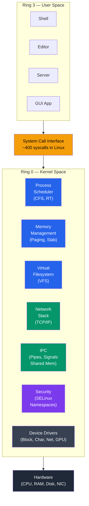
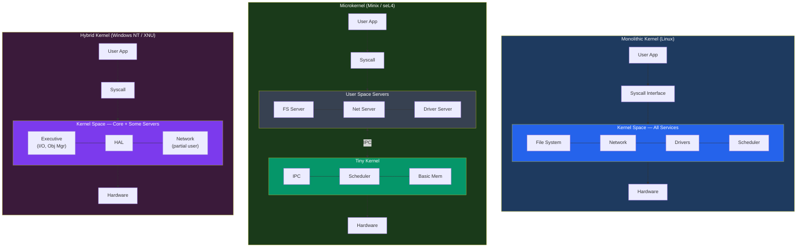

# Kernel Architecture

## What You'll Learn

- What a kernel is and its core responsibilities
- Monolithic kernel in depth: Linux kernel subsystems, modules, /proc, /sys
- Microkernel in depth: Minix, L4, QNX — IPC, reliability, and design
- Hybrid kernel: Windows NT kernel and macOS XNU/Darwin
- Exokernel concept: library operating systems
- Unikernel concept: single-purpose, single-address-space machines
- Detailed comparison of all kernel types with trade-offs
- Linux kernel architecture diagram and source code layout

## What is a Kernel?

The **kernel** is the core component of an operating system. It is the first program loaded after the bootloader, and it remains in memory for the entire uptime of the system. Every other part of the OS and every application depends on it.

```
Kernel Responsibilities:
────────────────────────
1. Process management   → Create, schedule, terminate processes
2. Memory management    → Virtual memory, paging, allocation
3. Device management    → Drivers, interrupt handling
4. File systems         → VFS layer, specific FS implementations
5. Networking           → TCP/IP stack, socket interface
6. Security             → Access control, capabilities
7. IPC                  → Pipes, signals, shared memory, sockets
```

```
Kernel's Position in the System:
─────────────────────────────────

    ┌───────────────────────────┐
    │     User Applications     │  Ring 3 (unprivileged)
    ├───────────────────────────┤
    │   System Call Interface   │  ← boundary
    ├───────────────────────────┤
    │         KERNEL            │  Ring 0 (privileged)
    │  (runs with full access   │
    │   to CPU and memory)      │
    ├───────────────────────────┤
    │        Hardware           │
    └───────────────────────────┘
```



## 1. Monolithic Kernel — In Depth

In a monolithic kernel, all OS services run in a single large binary in kernel space. All components can call each other directly via function calls — no message passing overhead.

### Linux Kernel Architecture

```
┌──────────────────────────────────────────────────────────────┐
│                        User Space                             │
│   ┌────────┐ ┌────────┐ ┌────────┐ ┌────────┐ ┌──────────┐  │
│   │ shell  │ │ editor │ │ server │ │ daemon │ │ GUI app  │  │
│   └───┬────┘ └───┬────┘ └───┬────┘ └───┬────┘ └────┬─────┘  │
├───────┼──────────┼──────────┼──────────┼───────────┼─────────┤
│       └──────────┴──────────┴──────────┴───────────┘         │
│                  System Call Interface                         │
│                  (≈400 syscalls in Linux)                     │
├──────────────────────────────────────────────────────────────┤
│                                                              │
│  ┌──────────────┐  ┌──────────────┐  ┌──────────────────┐   │
│  │   Process     │  │   Memory     │  │  Virtual File    │   │
│  │  Scheduler    │  │  Management  │  │  System (VFS)    │   │
│  │              │  │              │  │                  │   │
│  │ - CFS        │  │ - Page tables│  │ - inode/dentry   │   │
│  │ - RT sched   │  │ - Slab alloc │  │ - superblock     │   │
│  │ - Load bal.  │  │ - OOM killer │  │ - file ops       │   │
│  └──────────────┘  └──────────────┘  └──────────────────┘   │
│                                                              │
│  ┌──────────────┐  ┌──────────────┐  ┌──────────────────┐   │
│  │  Network     │  │   IPC        │  │  Security        │   │
│  │  Stack       │  │              │  │                  │   │
│  │              │  │ - Pipes      │  │ - SELinux        │   │
│  │ - TCP/IP     │  │ - Signals   │  │ - AppArmor       │   │
│  │ - Netfilter  │  │ - Sockets   │  │ - Capabilities   │   │
│  │ - Socket API │  │ - Shared mem│  │ - Namespaces     │   │
│  └──────────────┘  └──────────────┘  └──────────────────┘   │
│                                                              │
│  ┌──────────────────────────────────────────────────────┐    │
│  │              Device Drivers                           │    │
│  │  Block │ Char │ Network │ USB │ GPU │ Input │ Sound  │    │
│  └──────────────────────────────────────────────────────┘    │
│                                                              │
│  ┌──────────────────────────────────────────────────────┐    │
│  │     Architecture-Dependent Code (arch/)               │    │
│  │     x86, ARM, RISC-V, MIPS, PowerPC                  │    │
│  └──────────────────────────────────────────────────────┘    │
├──────────────────────────────────────────────────────────────┤
│                        Hardware                              │
└──────────────────────────────────────────────────────────────┘
```

### Linux Kernel Source Tree

```
linux/
├── arch/          Architecture-specific code (x86, arm, riscv)
├── block/         Block I/O layer
├── crypto/        Cryptographic API
├── drivers/       Device drivers (largest directory)
│   ├── gpu/       Graphics drivers
│   ├── net/       Network drivers
│   ├── usb/       USB drivers
│   └── ...        Thousands of drivers
├── fs/            File systems (ext4, btrfs, xfs, nfs, proc)
├── include/       Header files
├── init/          Kernel initialization (main.c → start_kernel)
├── ipc/           Inter-process communication
├── kernel/        Core kernel (scheduler, signals, time)
├── lib/           Helper libraries
├── mm/            Memory management (paging, slab, vmalloc)
├── net/           Networking (TCP/IP, socket layer)
├── security/      Security frameworks (SELinux, AppArmor)
└── sound/         Audio subsystem (ALSA)
```

### Kernel Modules

Linux achieves modularity within its monolithic design through loadable kernel modules (LKMs).

```c
/* chardev_module.c - A simple character device module */
#include <linux/init.h>
#include <linux/module.h>
#include <linux/fs.h>

#define DEVICE_NAME "mychardev"
static int major_num;

static int dev_open(struct inode *inodep, struct file *filep) {
    printk(KERN_INFO "mychardev: device opened\n");
    return 0;
}

static ssize_t dev_read(struct file *filep, char *buffer,
                        size_t len, loff_t *offset) {
    printk(KERN_INFO "mychardev: read requested\n");
    return 0;
}

static struct file_operations fops = {
    .open = dev_open,
    .read = dev_read,
};

static int __init chardev_init(void) {
    major_num = register_chrdev(0, DEVICE_NAME, &fops);
    printk(KERN_INFO "mychardev: registered with major %d\n",
           major_num);
    return 0;
}

static void __exit chardev_exit(void) {
    unregister_chrdev(major_num, DEVICE_NAME);
    printk(KERN_INFO "mychardev: unregistered\n");
}

module_init(chardev_init);
module_exit(chardev_exit);
MODULE_LICENSE("GPL");
```

```bash
# Kernel module management
lsmod                              # List loaded modules
modinfo ext4                       # Module information
sudo insmod mymodule.ko            # Load module
sudo rmmod mymodule                # Remove module
sudo modprobe nvidia               # Load with dependencies
dmesg | tail -20                   # View kernel messages
```

### /proc and /sys Filesystems

These virtual filesystems expose kernel data structures to user space.

```bash
# /proc - Process and kernel information
cat /proc/cpuinfo              # CPU details
cat /proc/meminfo              # Memory statistics
cat /proc/version              # Kernel version
cat /proc/1/status             # Process 1 (init) status
cat /proc/sys/kernel/hostname  # Kernel parameters
ls /proc/$$                    # Current process info

# /sys - Kernel object model (sysfs)
ls /sys/class/net/             # Network interfaces
cat /sys/class/thermal/thermal_zone0/temp  # CPU temperature
ls /sys/block/                 # Block devices
cat /sys/devices/system/cpu/cpu0/cpufreq/scaling_cur_freq
```

```
/proc vs /sys:
┌──────────────────────────┬────────────────────────────┐
│        /proc              │          /sys               │
├──────────────────────────┼────────────────────────────┤
│ Process information      │ Device/driver model        │
│ Kernel parameters        │ Hardware attributes        │
│ Legacy, grew organically │ Structured, well-organized │
│ Mixed content            │ One value per file (mostly)│
│ Read and write           │ Read and write             │
└──────────────────────────┴────────────────────────────┘
```

### Kernel Compilation Basics

```bash
# Building the Linux kernel from source
# 1. Get source
wget https://cdn.kernel.org/pub/linux/kernel/v6.x/linux-6.x.tar.xz
tar xf linux-6.x.tar.xz && cd linux-6.x

# 2. Configure
make menuconfig          # Interactive menu configuration
# Or copy existing config
cp /boot/config-$(uname -r) .config
make olddefconfig

# 3. Build
make -j$(nproc)          # Compile kernel (parallel)

# 4. Install
sudo make modules_install
sudo make install

# 5. Update bootloader
sudo update-grub         # Debian/Ubuntu
sudo grub2-mkconfig -o /boot/grub2/grub.cfg  # RHEL/Fedora
```

## 2. Microkernel — In Depth

A microkernel provides only the most essential services: IPC, basic scheduling, and low-level memory management. Everything else (file systems, drivers, networking) runs as user-space servers.

### Microkernel Design

```
┌────────────────────────────────────────────────────────────┐
│                       User Space                            │
│                                                            │
│  ┌──────────┐ ┌──────────┐ ┌──────────┐ ┌──────────────┐  │
│  │  File    │ │  Device  │ │ Network  │ │  Process     │  │
│  │  System  │ │  Driver  │ │  Server  │ │  Manager     │  │
│  │  Server  │ │  Server  │ │          │ │  Server      │  │
│  └────┬─────┘ └────┬─────┘ └────┬─────┘ └──────┬───────┘  │
│       │            │            │               │          │
│       └────────────┴─────┬──────┴───────────────┘          │
│                          │                                 │
│                   IPC Messages                             │
│                          │                                 │
├──────────────────────────┼─────────────────────────────────┤
│                          ▼                                 │
│  ┌──────────────────────────────────────────────────────┐  │
│  │                   Microkernel                        │  │
│  │                                                      │  │
│  │   ┌───────────┐  ┌────────────┐  ┌───────────────┐  │  │
│  │   │    IPC    │  │  Basic     │  │  Low-level    │  │  │
│  │   │ (message  │  │  CPU       │  │  Memory       │  │  │
│  │   │  passing) │  │  Scheduling│  │  Management   │  │  │
│  │   └───────────┘  └────────────┘  └───────────────┘  │  │
│  │   ┌────────────────────────────────────────────┐     │  │
│  │   │   Interrupt Handling / Hardware Abstraction │     │  │
│  │   └────────────────────────────────────────────┘     │  │
│  └──────────────────────────────────────────────────────┘  │
├────────────────────────────────────────────────────────────┤
│                        Hardware                            │
└────────────────────────────────────────────────────────────┘
```

### IPC Overhead — The Core Trade-off

```
File read in monolithic kernel:
  App ──syscall──▶ Kernel (VFS → ext4 → block driver) ──▶ App
  Context switches: 2 (user→kernel, kernel→user)

File read in microkernel:
  App ──msg──▶ Kernel ──msg──▶ FS Server ──msg──▶ Kernel
  ──msg──▶ Disk Driver ──msg──▶ Kernel ──msg──▶ FS Server
  ──msg──▶ Kernel ──msg──▶ App
  Context switches: 8+ (each message = mode switch)

Performance cost:
  Each IPC message involves:
  1. Copy message from sender to kernel
  2. Context switch to receiver
  3. Copy message from kernel to receiver
  Total: ~2-10x slower for I/O-heavy operations
```

### Minix 3 — Self-Healing Microkernel

```
Minix 3 Architecture:
┌──────────────────────────────────────┐
│          User Processes              │
├──────────────────────────────────────┤
│          Server Layer                │
│  ┌─────┐ ┌─────┐ ┌─────┐ ┌───────┐ │
│  │ VFS │ │ PM  │ │ RS  │ │ Net   │ │
│  │     │ │     │ │     │ │Server │ │
│  └─────┘ └─────┘ └─────┘ └───────┘ │
├──────────────────────────────────────┤
│          Driver Layer                │
│  ┌──────┐ ┌──────┐ ┌──────┐        │
│  │ Disk │ │ TTY  │ │ NIC  │  ...   │
│  │Driver│ │Driver│ │Driver│        │
│  └──────┘ └──────┘ └──────┘        │
├──────────────────────────────────────┤
│        Microkernel (~6000 LOC)       │
│   IPC, Scheduling, Interrupts       │
└──────────────────────────────────────┘

RS = Reincarnation Server
- Monitors all drivers and servers
- If a driver crashes, RS restarts it automatically
- System continues running (self-healing)
```

### L4 Microkernel Family

```
L4 Design Principles:
- Minimal kernel: only IPC, address spaces, threads
- ~10,000 lines of code
- Extremely fast IPC (optimized message passing)
- Proven formally correct (seL4 variant)

seL4:
- First OS kernel with complete formal verification
- Mathematically proven to have no bugs (in specification)
- Used in military, aerospace, and automotive
- Approximately 10,000 lines of C code

L4 Variants:
- L4/Fiasco (TU Dresden) → used in Genode OS
- OKL4 (Open Kernel Labs) → used in billions of modems
- seL4 (UNSW/Data61) → formally verified
```

## 3. Hybrid Kernel

Hybrid kernels take a pragmatic approach: keep performance-critical services in kernel space while maintaining a modular, microkernel-inspired design.

### Windows NT Kernel Architecture

```
┌──────────────────────────────────────────────────────┐
│                     User Mode                         │
│                                                      │
│  ┌──────────────┐  ┌──────────────┐  ┌────────────┐ │
│  │ Environment  │  │ Environment  │  │  System    │ │
│  │ Subsystem    │  │ Subsystem    │  │  Processes │ │
│  │ (Win32/WoW64)│  │ (WSL/POSIX) │  │ (services) │ │
│  └──────┬───────┘  └──────┬───────┘  └─────┬──────┘ │
├─────────┼─────────────────┼────────────────┼─────────┤
│         ▼     Kernel Mode  ▼                ▼        │
│  ┌───────────────────────────────────────────────┐   │
│  │              Executive Layer                  │   │
│  │  ┌──────┐ ┌──────┐ ┌──────┐ ┌──────┐         │   │
│  │  │  I/O │ │Object│ │ Proc │ │Memory│         │   │
│  │  │  Mgr │ │  Mgr │ │  Mgr │ │  Mgr │         │   │
│  │  └──────┘ └──────┘ └──────┘ └──────┘         │   │
│  │  ┌──────┐ ┌──────┐ ┌──────────────┐          │   │
│  │  │Cache │ │  Sec │ │ Plug & Play  │          │   │
│  │  │  Mgr │ │  Mgr │ │   Manager    │          │   │
│  │  └──────┘ └──────┘ └──────────────┘          │   │
│  ├───────────────────────────────────────────────┤   │
│  │            NT Kernel (ntoskrnl.exe)           │   │
│  │  Thread scheduling, interrupt dispatching,    │   │
│  │  exception handling, synchronization          │   │
│  ├───────────────────────────────────────────────┤   │
│  │   Hardware Abstraction Layer (hal.dll)        │   │
│  └───────────────────────────────────────────────┘   │
├──────────────────────────────────────────────────────┤
│                      Hardware                        │
└──────────────────────────────────────────────────────┘

Why "hybrid":
- Microkernel-inspired modular design (Executive layer)
- But Executive runs in kernel mode (like monolithic)
- HAL provides hardware abstraction (microkernel idea)
- Subsystem architecture allows multiple OS personalities
```

### macOS XNU Kernel

```
XNU = "X is Not Unix"

┌──────────────────────────────────────────────────┐
│                   XNU Kernel                      │
│                                                  │
│  ┌─────────────────────┐  ┌───────────────────┐  │
│  │     Mach Layer       │  │    BSD Layer       │  │
│  │   (microkernel)      │  │  (monolithic)      │  │
│  │                     │  │                   │  │
│  │ - Task/thread mgmt  │  │ - POSIX API       │  │
│  │ - Virtual memory    │  │ - VFS             │  │
│  │ - IPC (Mach ports)  │  │ - Networking      │  │
│  │ - Scheduling        │  │ - File systems    │  │
│  │ - Memory objects    │  │ - Security (MAC)  │  │
│  └─────────────────────┘  └───────────────────┘  │
│                                                  │
│  ┌──────────────────────────────────────────┐    │
│  │              I/O Kit                      │    │
│  │  Object-oriented driver framework (C++)   │    │
│  │  Loadable kernel extensions (kexts)       │    │
│  └──────────────────────────────────────────┘    │
│                                                  │
│  ┌──────────────────────────────────────────┐    │
│  │       libkern / Platform Expert           │    │
│  │    (hardware abstraction)                 │    │
│  └──────────────────────────────────────────┘    │
└──────────────────────────────────────────────────┘

Key insight: XNU runs both Mach and BSD in kernel space.
It's a hybrid because it uses microkernel concepts (Mach IPC)
but runs everything in kernel mode for performance.
```

## 4. Exokernel

An exokernel takes the opposite approach from a microkernel: instead of abstracting hardware, it exposes hardware resources directly to applications, letting them manage resources as they see fit.

```
Traditional OS:
  App → OS abstraction → Hardware
  (OS decides HOW to manage resources)

Exokernel:
  App → Library OS → Raw hardware access
  (App decides HOW to manage resources)
  (Exokernel only ensures PROTECTION)

┌──────────────────────────────────────────┐
│           Application 1 + LibOS A        │
│  (custom file system, memory allocator)  │
├──────────────────────────────────────────┤
│           Application 2 + LibOS B        │
│  (different file system, allocator)      │
├──────────────────────────────────────────┤
│              Exokernel                   │
│  (only multiplexes and protects          │
│   hardware resources — no abstractions)  │
├──────────────────────────────────────────┤
│              Hardware                    │
└──────────────────────────────────────────┘

The exokernel only:
- Tracks which app owns which resources
- Prevents unauthorized access
- Does NOT impose file systems, scheduling policies, etc.
```

### Characteristics

```
Advantages:
+ Maximum flexibility for applications
+ Each app can optimize its own resource management
+ Very thin kernel — small attack surface
+ Can outperform traditional OS for specialized workloads

Disadvantages:
- Each application must include its own "library OS"
- Duplication of effort (every app reinvents the wheel)
- Primarily a research concept — few production systems
- Harder for general-purpose computing
```

## 5. Unikernel

A unikernel compiles the application and only the needed OS components into a single-purpose, single-address-space machine image. There is no separation between kernel and user space.

```
Traditional OS:                    Unikernel:
┌─────────────┐                    ┌─────────────┐
│    App      │                    │             │
├─────────────┤                    │  App + OS   │
│  Libraries  │                    │  compiled   │
├─────────────┤          →         │  together   │
│   OS Kernel │                    │  into one   │
├─────────────┤                    │  image      │
│  Unused OS  │                    │             │
│  components │                    └─────────────┘
└─────────────┘                    Size: ~1-50 MB
Size: ~200 MB+

Unikernel characteristics:
- Single application per VM
- No shell, no users, no unnecessary services
- Boot in milliseconds
- Tiny attack surface
- Immutable — rebuild and redeploy to update
```

### Examples

```
MirageOS:
- Written in OCaml
- Compiles to Xen hypervisor images
- Used by Docker for networking components

IncludeOS:
- Written in C++
- Boots in ~300ms
- Used for microservices and network functions

Unik:
- Tool to build unikernels from Go, Python, Java, etc.
- Targets AWS, VirtualBox, QEMU
```

## Kernel Architecture Comparison



| Feature | Monolithic | Microkernel | Hybrid | Exokernel | Unikernel |
|---------|-----------|-------------|--------|-----------|-----------|
| **Kernel size** | Large (millions LOC) | Small (thousands LOC) | Medium | Minimal | N/A (merged) |
| **Performance** | Highest | Lower (IPC cost) | High | Potentially highest | Very high |
| **Reliability** | Lower (one bug crashes all) | Highest (fault isolation) | Medium-High | Varies | High (minimal code) |
| **Security** | Medium (large attack surface) | High (small surface) | Medium-High | App-dependent | High (tiny surface) |
| **Flexibility** | Medium (modules) | High (user-space servers) | Medium | Maximum | Low (single purpose) |
| **Complexity** | High | Medium | Very High | Low (kernel) / High (apps) | Low |
| **Use cases** | Servers, desktops | Safety-critical, embedded | Commercial desktop OS | Research | Cloud microservices |
| **Examples** | Linux, FreeBSD | Minix, seL4, QNX | Windows NT, XNU | MIT Exokernel | MirageOS, IncludeOS |

## Practical Exploration

```bash
# Explore your kernel
uname -r                           # Kernel version
uname -a                           # Full kernel info
cat /proc/version                  # How kernel was compiled

# Kernel configuration
cat /boot/config-$(uname -r) | grep CONFIG_PREEMPT
# CONFIG_PREEMPT_NONE, CONFIG_PREEMPT_VOLUNTARY, CONFIG_PREEMPT

# Check if kernel is monolithic with modules
cat /boot/config-$(uname -r) | grep CONFIG_MODULES
# CONFIG_MODULES=y  → loadable module support enabled

# Kernel memory usage
free -h                            # System memory overview
cat /proc/meminfo | head -5        # Detailed memory stats

# See kernel threads
ps -ef | grep "\[.*\]" | head -20  # Kernel threads in brackets

# Kernel log
dmesg | head -30                   # Boot and kernel messages
journalctl -k | tail -20           # Kernel journal (systemd)
```

## Exercises

### Beginner
1. Run `uname -r` and `lsmod | wc -l` on a Linux system. What kernel version are you running and how many modules are loaded?
2. Explore `/proc` on a Linux system. Find your CPU model (`/proc/cpuinfo`), total memory (`/proc/meminfo`), and kernel version (`/proc/version`).
3. In your own words, explain the difference between a monolithic kernel and a microkernel using a restaurant analogy (e.g., one big kitchen vs. many specialized food stalls).

### Intermediate
4. Write and compile a simple Linux kernel module that logs "Hello" when loaded and "Goodbye" when unloaded. Use `dmesg` to verify.
5. Compare the Linux kernel's `/proc` and `/sys` filesystems. List 5 useful files from each and explain what information they provide.
6. Research how the Windows NT kernel's Hardware Abstraction Layer (HAL) works. Why did Microsoft create it, and how does it differ from Linux's approach to hardware abstraction?

### Advanced
7. Download the Minix 3 source code and identify the Reincarnation Server. Explain how it monitors and restarts crashed drivers.
8. Research seL4's formal verification. What properties were proven, what was the proof effort, and what guarantees does it provide that other kernels cannot?
9. Build a unikernel using IncludeOS or MirageOS. Deploy it on QEMU and measure its boot time and memory footprint compared to a full Linux VM running the same application.

## Key Takeaways

- The kernel is the core of the OS — it manages all hardware resources and provides services to applications
- Monolithic kernels (Linux) put everything in kernel space for maximum performance, using modules for flexibility
- Microkernels (Minix, seL4, QNX) minimize kernel code for reliability and security at the cost of IPC overhead
- Hybrid kernels (Windows NT, XNU) combine monolithic performance with microkernel-inspired modularity
- Exokernels expose raw hardware to applications, maximizing flexibility but requiring per-app OS libraries
- Unikernels merge app and OS into a single image, ideal for cloud microservices with minimal attack surface
- Linux's /proc and /sys provide rich access to kernel internals from user space
- The choice of kernel architecture reflects fundamental trade-offs between performance, reliability, and security

---

[← Previous: OS Types](./04_os_types.md) | [Next: Boot Process →](./06_boot_process.md)
