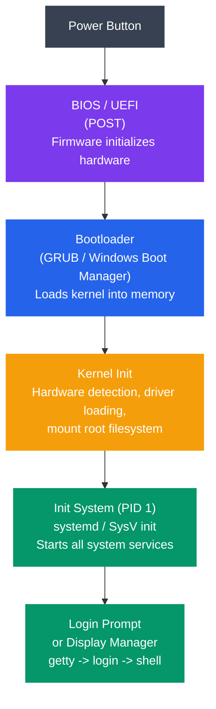
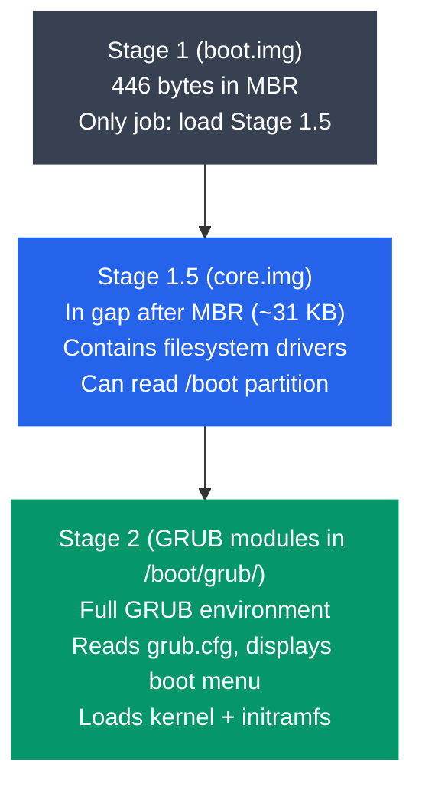

# Boot Process and System Initialization

## What You'll Learn

- The complete boot sequence from power button to login prompt
- POST (Power-On Self-Test) and hardware initialization
- BIOS vs UEFI firmware and their differences
- Bootloader operation (GRUB stages, Windows Boot Manager)
- Kernel loading, decompression, and initialization
- Init systems: SysV init (runlevels) vs systemd (units, targets)
- The login process (getty, login, shell)
- Using `dmesg` and `journalctl` to analyze the boot process

## Boot Process Overview

When you press the power button, a carefully orchestrated sequence brings the system from dead hardware to a fully running operating system. Every step depends on the previous one completing successfully.



```
Complete Boot Sequence:
═══════════════════════

  ┌────────────────┐
  │  Power Button  │
  └───────┬────────┘
          ▼
  ┌────────────────┐
  │  BIOS / UEFI   │  Firmware initializes hardware
  │  (POST)        │
  └───────┬────────┘
          ▼
  ┌────────────────┐
  │   Bootloader   │  GRUB / Windows Boot Manager
  │  (GRUB)        │  Loads kernel into memory
  └───────┬────────┘
          ▼
  ┌────────────────┐
  │  Kernel Init   │  Hardware detection, driver loading,
  │                │  mount root filesystem
  └───────┬────────┘
          ▼
  ┌────────────────┐
  │  Init System   │  systemd / SysV init
  │  (PID 1)       │  Starts all system services
  └───────┬────────┘
          ▼
  ┌────────────────┐
  │  Login Prompt  │  getty → login → shell
  │  or Display Mgr│  (or GUI login screen)
  └────────────────┘
```

## Step 1: Power On and POST

When the power button is pressed, the CPU begins executing instructions from a fixed memory address where the firmware (BIOS or UEFI) resides.

### Power-On Self-Test (POST)

```
POST Sequence:
──────────────

1. CPU Reset
   - CPU starts in real mode (16-bit, 1 MB address space)
   - Instruction pointer set to 0xFFFF0 (BIOS entry point)
   - CPU begins executing firmware code from ROM/flash

2. Hardware Checks
   ┌──────────────────────────────────────┐
   │  ✓ CPU registers and flags          │
   │  ✓ BIOS/UEFI ROM integrity (checksum)│
   │  ✓ System timer (PIT/HPET)          │
   │  ✓ DMA controller                   │
   │  ✓ Memory (RAM) test                │
   │  ✓ Keyboard controller              │
   │  ✓ Video adapter                    │
   └──────────────────────────────────────┘

3. Device Enumeration
   - PCI/PCIe bus scan
   - USB controller initialization
   - Storage controller detection (SATA, NVMe)
   - Network interface detection

4. Boot Device Selection
   - Check boot order (configured in BIOS/UEFI settings)
   - Try each device until bootable one is found
   - Read first sector (MBR) or EFI system partition

POST Beep Codes (BIOS):
  1 short beep  = Normal POST, system OK
  2 short beeps = POST error (check display)
  Continuous     = RAM error
  (varies by BIOS manufacturer)
```

## Step 2: BIOS vs UEFI

Two types of firmware exist in modern systems. UEFI has largely replaced BIOS.

### BIOS (Basic Input/Output System)

```
BIOS Boot Process:
──────────────────

1. BIOS loads first 512 bytes of boot device (MBR)
2. MBR contains:
   - Boot code (446 bytes) — tiny program
   - Partition table (64 bytes) — 4 partition entries
   - Boot signature (2 bytes) — 0x55AA

   ┌─────────────────────────────────────┐
   │  MBR Layout (512 bytes)             │
   │  ┌────────────────────────┐         │
   │  │  Bootstrap Code        │ 446 B   │
   │  │  (loads bootloader)    │         │
   │  ├────────────────────────┤         │
   │  │  Partition Entry 1     │ 16 B    │
   │  │  Partition Entry 2     │ 16 B    │
   │  │  Partition Entry 3     │ 16 B    │
   │  │  Partition Entry 4     │ 16 B    │
   │  ├────────────────────────┤         │
   │  │  Boot Signature 55 AA │ 2 B     │
   │  └────────────────────────┘         │
   └─────────────────────────────────────┘

3. Bootstrap code runs → loads the bootloader
```

### UEFI (Unified Extensible Firmware Interface)

```
UEFI Boot Process:
──────────────────

1. UEFI firmware initializes
2. Reads GPT (GUID Partition Table)
3. Locates EFI System Partition (ESP)
   - FAT32 formatted partition (typically 100-512 MB)
   - Contains .efi bootloader executables
4. Runs the configured EFI application (bootloader)

   ┌─────────────────────────────────────┐
   │  GPT Disk Layout                    │
   │  ┌────────────────────────┐         │
   │  │  Protective MBR        │         │
   │  ├────────────────────────┤         │
   │  │  GPT Header             │         │
   │  ├────────────────────────┤         │
   │  │  Partition Entries      │         │
   │  ├────────────────────────┤         │
   │  │  ESP (EFI System Part) │ ← UEFI  │
   │  │  /EFI/BOOT/bootx64.efi│   reads  │
   │  ├────────────────────────┤   this   │
   │  │  Linux Partition        │         │
   │  ├────────────────────────┤         │
   │  │  Swap Partition         │         │
   │  ├────────────────────────┤         │
   │  │  Backup GPT Header     │         │
   │  └────────────────────────┘         │
   └─────────────────────────────────────┘
```

### BIOS vs UEFI Comparison

| Feature | BIOS | UEFI |
|---------|------|------|
| **Year introduced** | 1981 | 2005+ |
| **CPU mode** | 16-bit real mode | 32/64-bit protected mode |
| **Partition scheme** | MBR (max 4 primary) | GPT (128+ partitions) |
| **Max disk size** | 2 TB | 9.4 ZB (zettabytes) |
| **Boot code location** | MBR (446 bytes) | EFI System Partition |
| **Secure Boot** | No | Yes |
| **Network boot** | PXE (limited) | Full HTTP/TLS support |
| **UI** | Text-only | Graphical possible |
| **Speed** | Slower | Faster (parallel init) |
| **Driver format** | 16-bit ASM | EFI byte code (portable) |

```bash
# Check if your system uses BIOS or UEFI
ls /sys/firmware/efi       # If exists → UEFI
# "No such file or directory" → BIOS (legacy)

# View UEFI boot entries
efibootmgr -v

# View partition table type
sudo fdisk -l /dev/sda     # Check for GPT or MBR (dos)
```

## Step 3: Bootloader

The bootloader's job is to load the OS kernel into memory and hand off control to it. GRUB (GRand Unified Bootloader) is the most common bootloader on Linux systems.

### GRUB Stages



```
GRUB Boot Stages:
─────────────────

Stage 1 (boot.img — 446 bytes in MBR):
┌──────────────────────────────────────┐
│  Tiny program in MBR                  │
│  Only job: load Stage 1.5             │
│  Knows disk geometry to find Stage 1.5│
└──────────────┬───────────────────────┘
               ▼
Stage 1.5 (core.img — in gap after MBR):
┌──────────────────────────────────────┐
│  Lives in first 63 sectors after MBR  │
│  (~31 KB of space)                    │
│  Contains filesystem drivers          │
│  Can read the /boot partition         │
│  Loads Stage 2                        │
└──────────────┬───────────────────────┘
               ▼
Stage 2 (GRUB modules in /boot/grub/):
┌──────────────────────────────────────┐
│  Full GRUB environment               │
│  Reads grub.cfg configuration        │
│  Displays boot menu                  │
│  Loads selected kernel + initramfs   │
│  Passes control to kernel            │
└──────────────────────────────────────┘
```

### GRUB Configuration

```bash
# GRUB configuration file
cat /boot/grub/grub.cfg    # Auto-generated — don't edit directly!

# Customization file
cat /etc/default/grub
# GRUB_TIMEOUT=5
# GRUB_DEFAULT=0
# GRUB_CMDLINE_LINUX="quiet splash"

# After editing /etc/default/grub, regenerate:
sudo update-grub           # Debian/Ubuntu
sudo grub2-mkconfig -o /boot/grub2/grub.cfg  # RHEL/Fedora
```

### What GRUB Loads

```
GRUB loads two files into memory:
─────────────────────────────────

1. Kernel Image: /boot/vmlinuz-<version>
   - Compressed Linux kernel
   - Contains core kernel code

2. Initial RAM Filesystem: /boot/initramfs-<version>.img
   (or /boot/initrd.img-<version>)
   - Temporary root filesystem loaded into RAM
   - Contains essential drivers (disk, filesystem, LVM, RAID)
   - Needed to mount the REAL root filesystem
   - After real root is mounted, initramfs is discarded

   Why initramfs?
   ┌─────────────────────────────────────────┐
   │ Problem: Kernel needs disk driver to    │
   │ read root filesystem, but disk driver   │
   │ might be a loadable module ON the       │
   │ root filesystem (chicken-and-egg).      │
   │                                         │
   │ Solution: initramfs bundles essential   │
   │ drivers so kernel can mount root.       │
   └─────────────────────────────────────────┘
```

### Windows Boot Manager

```
Windows Boot Sequence:
──────────────────────

1. UEFI loads Windows Boot Manager
   (EFI\Microsoft\Boot\bootmgfw.efi)

2. Boot Manager reads BCD (Boot Configuration Data)
   - Displays OS selection menu (if multiple OS)

3. Loads Windows Boot Loader (winload.efi)
   - Loads kernel: ntoskrnl.exe
   - Loads HAL: hal.dll
   - Loads boot-start drivers

4. Kernel initializes → Session Manager (smss.exe)
   → Windows Logon (winlogon.exe)

BCD store equivalent to GRUB's grub.cfg:
  bcdedit /enum           # View boot entries (Windows cmd)
```

## Step 4: Kernel Loading and Initialization

Once the bootloader hands off to the kernel, the kernel takes over and initializes the entire system.

```
Kernel Boot Sequence:
═════════════════════

1. Kernel Decompression
   - vmlinuz is compressed (gzip, bzip2, xz, or zstd)
   - Self-extracting: decompresses itself into memory
   - Prints: "Decompressing Linux... done, booting the kernel."

2. Architecture-Specific Setup
   - Set up page tables (virtual memory)
   - Initialize GDT/IDT (x86 descriptor tables)
   - Enable protected mode → long mode (64-bit)
   - Detect CPU features (SSE, AVX, etc.)

3. start_kernel() function (init/main.c)
   ┌────────────────────────────────────────┐
   │  setup_arch()          → CPU, memory   │
   │  trap_init()           → exceptions    │
   │  mm_init()             → memory mgmt   │
   │  sched_init()          → scheduler     │
   │  init_IRQ()            → interrupts    │
   │  time_init()           → system clock  │
   │  console_init()        → early console │
   │  vfs_caches_init()     → VFS setup     │
   │  page_cache_init()     → page cache    │
   │  rest_init()           → start PID 1   │
   └────────────────────────────────────────┘

4. Mount initramfs as temporary root (/)

5. Run /init from initramfs
   - Loads storage drivers
   - Finds real root filesystem
   - Mounts real root filesystem
   - pivot_root to switch from initramfs to real root

6. Execute /sbin/init (PID 1)
   - First user-space process
   - systemd or SysV init
   - Parent of all other processes
```

```bash
# View kernel boot parameters
cat /proc/cmdline
# Example output:
# BOOT_IMAGE=/vmlinuz-5.15.0 root=/dev/sda2 ro quiet splash

# View kernel initialization messages
dmesg | head -50
```

## Step 5: Init Systems

The init process (PID 1) is the first user-space process. It is responsible for starting all other system services. Two major init systems exist.

### SysV Init (Traditional)

```
SysV Init uses runlevels to define system states:
─────────────────────────────────────────────────

Runlevel  Description
────────  ──────────────────────────────────
   0      Halt (shutdown)
   1      Single-user mode (recovery)
   2      Multi-user, no networking
   3      Multi-user, with networking (text mode)
   4      Unused (user-defined)
   5      Multi-user, with networking + GUI
   6      Reboot

Boot sequence with SysV init:
┌──────────────────────────────────────────┐
│  Kernel executes /sbin/init               │
│       ↓                                  │
│  init reads /etc/inittab                 │
│       ↓                                  │
│  Determines default runlevel             │
│  (e.g., id:3:initdefault:)              │
│       ↓                                  │
│  Runs /etc/rc.d/rc3.d/ scripts           │
│  (S01 first, S02 second, ... in order)   │
│       ↓                                  │
│  S01syslog → S02network → S03sshd → ... │
│  (sequential — one at a time)            │
└──────────────────────────────────────────┘
```

```bash
# SysV init script structure
ls /etc/init.d/           # All service scripts
ls /etc/rc3.d/            # Runlevel 3 scripts

# Script naming convention:
# S20ssh  → Start SSH at position 20
# K80ssh  → Kill SSH at position 80

# Managing services (SysV)
sudo service sshd start
sudo service sshd stop
sudo service sshd status
sudo chkconfig sshd on    # Enable at boot (RHEL)
sudo update-rc.d ssh defaults  # Enable at boot (Debian)
```

### systemd (Modern)

systemd has replaced SysV init in most modern Linux distributions. It uses units and targets instead of scripts and runlevels.

```
systemd Architecture:
─────────────────────

┌───────────────────────────────────────────────────┐
│                   systemd (PID 1)                  │
│                                                   │
│  ┌─────────────────────────────────────────────┐  │
│  │              Target Units                   │  │
│  │  (equivalent to runlevels)                  │  │
│  │                                             │  │
│  │  multi-user.target ≈ runlevel 3             │  │
│  │  graphical.target  ≈ runlevel 5             │  │
│  │  rescue.target     ≈ runlevel 1             │  │
│  └─────────────────────────────────────────────┘  │
│                                                   │
│  ┌─────────────┐ ┌──────────┐ ┌──────────────┐   │
│  │   Service   │ │  Socket  │ │   Timer      │   │
│  │   Units     │ │  Units   │ │   Units      │   │
│  │  (.service) │ │ (.socket)│ │  (.timer)    │   │
│  └─────────────┘ └──────────┘ └──────────────┘   │
│  ┌─────────────┐ ┌──────────┐ ┌──────────────┐   │
│  │   Mount    │ │  Device  │ │   Path       │   │
│  │   Units    │ │  Units   │ │   Units      │   │
│  │  (.mount)  │ │ (.device)│ │  (.path)     │   │
│  └─────────────┘ └──────────┘ └──────────────┘   │
└───────────────────────────────────────────────────┘

Key advantage: systemd starts services in PARALLEL
based on dependency graph, not sequentially.
```

```bash
# systemd service management (systemctl)
systemctl status sshd              # Check service status
sudo systemctl start sshd          # Start a service
sudo systemctl stop sshd           # Stop a service
sudo systemctl restart sshd        # Restart a service
sudo systemctl enable sshd         # Enable at boot
sudo systemctl disable sshd        # Disable at boot

# View all running services
systemctl list-units --type=service --state=running

# View boot target (equivalent to runlevel)
systemctl get-default              # e.g., graphical.target

# Change target
sudo systemctl set-default multi-user.target  # Text mode boot
sudo systemctl set-default graphical.target   # GUI boot

# View unit file
systemctl cat sshd.service

# View dependency tree
systemctl list-dependencies multi-user.target
```

### Example systemd Unit File

```ini
# /etc/systemd/system/myapp.service
[Unit]
Description=My Application
After=network.target
Wants=network-online.target

[Service]
Type=simple
User=myapp
ExecStart=/usr/local/bin/myapp --config /etc/myapp.conf
Restart=on-failure
RestartSec=5

[Install]
WantedBy=multi-user.target
```

### SysV Init vs systemd Comparison

| Feature | SysV Init | systemd |
|---------|-----------|---------|
| **Startup order** | Sequential (slow) | Parallel (fast) |
| **Configuration** | Shell scripts | Declarative unit files |
| **Dependencies** | Manual (numbering) | Automatic (After=, Requires=) |
| **Service monitoring** | None (manual) | Automatic restart, watchdog |
| **Logging** | syslog (/var/log/) | journald (binary journal) |
| **Socket activation** | No | Yes (start service on demand) |
| **Cgroups** | No | Yes (resource control) |
| **Complexity** | Simple | Complex |
| **Portability** | Any Unix | Linux-specific |
| **Boot speed** | 30-60+ seconds | 5-15 seconds |

## Step 6: Login Process

After all services are started, the system presents a login interface.

```
Text Console Login:
───────────────────

systemd starts getty service for each virtual terminal:

  systemd → getty@tty1.service → /sbin/agetty
                                      │
                                      ▼
                              ┌──────────────┐
                              │   agetty     │
                              │  "login: "   │
                              └──────┬───────┘
                                     │ user types username
                                     ▼
                              ┌──────────────┐
                              │    login     │
                              │  "Password:" │
                              │  checks      │
                              │  /etc/passwd │
                              │  /etc/shadow │
                              └──────┬───────┘
                                     │ authenticated
                                     ▼
                              ┌──────────────┐
                              │    shell     │
                              │   /bin/bash  │
                              │  reads       │
                              │  ~/.bashrc   │
                              └──────────────┘

GUI Login:
──────────
  systemd → display-manager.service (gdm, lightdm, sddm)
             → Shows graphical login screen
             → Authenticates user (PAM)
             → Starts desktop session (GNOME, KDE, etc.)
```

## Analyzing the Boot Process

### dmesg — Kernel Ring Buffer

```bash
# View all kernel messages from boot
dmesg

# With timestamps
dmesg -T

# Filter by log level
dmesg --level=err       # Errors only
dmesg --level=warn      # Warnings

# Search for specific hardware
dmesg | grep -i "usb"
dmesg | grep -i "eth"
dmesg | grep -i "sda"

# Follow new messages in real time
dmesg -w
```

### journalctl — systemd Journal

```bash
# View complete boot log
journalctl -b                      # Current boot
journalctl -b -1                   # Previous boot
journalctl --list-boots             # List all recorded boots

# Kernel messages only
journalctl -k

# Boot time analysis
systemd-analyze                     # Total boot time
systemd-analyze blame               # Time per service
systemd-analyze critical-chain      # Critical path
systemd-analyze plot > boot.svg     # Visual timeline

# Example output of systemd-analyze blame:
#   3.204s NetworkManager.service
#   2.145s systemd-journal-flush.service
#   1.803s docker.service
#   1.204s accounts-daemon.service
#    923ms snapd.service
```

### Boot Time Breakdown Example

```
systemd-analyze output:
───────────────────────

Startup finished in:
  firmware:  4.523s    ← UEFI/BIOS POST
  loader:    2.102s    ← GRUB bootloader
  kernel:    3.847s    ← Kernel init + initramfs
  userspace: 8.234s    ← systemd services
  ──────────────────
  Total:    18.706s

Critical Chain:
  graphical.target @8.234s
  └─ display-manager.service @7.102s +1.132s
     └─ multi-user.target @7.098s
        └─ docker.service @5.295s +1.803s
           └─ network-online.target @5.290s
              └─ NetworkManager-wait-online.service @2.086s +3.204s
                 └─ NetworkManager.service @1.823s +263ms
                    └─ basic.target @1.815s
```

## Complete Boot Timeline

```
Time    Stage              What Happens
─────   ─────────────────  ──────────────────────────────────
0.0s    Power On           Voltage reaches CPU
0.1s    CPU Reset          Jumps to firmware entry point
0.1s    POST               Tests RAM, CPU, devices
4.5s    UEFI Init          Reads GPT, finds ESP
4.6s    Bootloader (GRUB)  Loads from ESP
6.7s    Kernel Loading     vmlinuz decompressed into RAM
7.0s    Kernel Init        start_kernel(), hardware setup
8.5s    initramfs          Loads storage drivers, finds root
10.5s   Init (systemd)     PID 1 starts, reads unit files
11.0s   Services Start     Parallel service startup begins
15.0s   Network Ready      NetworkManager connects
18.0s   Display Manager    Login screen appears
18.7s   System Ready       graphical.target reached
```

## Exercises

### Beginner
1. Check whether your system uses BIOS or UEFI:
   ```bash
   ls /sys/firmware/efi    # Exists = UEFI
   ```
2. Run `systemd-analyze` and `systemd-analyze blame` to see your boot time. Which service takes the longest?
3. Use `dmesg | head -30` to read the first kernel messages. Identify when the kernel starts and what hardware it detects first.

### Intermediate
4. Create a custom systemd service unit file that runs a simple script at boot. Enable it and verify it runs after reboot.
5. Compare the contents of `/boot/` on your system. Identify the kernel image, initramfs, and GRUB files. What is the size of each?
6. Use `journalctl --list-boots` to see past boots. Then use `journalctl -b -1` to examine a previous boot's logs. Were there any errors?

### Advanced
7. Modify GRUB to add a custom kernel boot parameter (e.g., `loglevel=7` for verbose output). Rebuild the GRUB config and reboot. Compare `dmesg` output before and after.
8. Extract the contents of your initramfs and examine what's inside:
   ```bash
   mkdir /tmp/initramfs && cd /tmp/initramfs
   zcat /boot/initramfs-$(uname -r).img | cpio -idmv
   # or for newer format:
   unmkinitramfs /boot/initrd.img-$(uname -r) /tmp/initramfs
   ```
   What drivers and scripts are included? Why are they needed before the root filesystem is mounted?
9. Research Secure Boot. How does UEFI Secure Boot verify the bootloader and kernel? What role do MOK (Machine Owner Keys) play for Linux distributions? Set up or examine your system's Secure Boot configuration.

## Key Takeaways

- The boot process is a chain: firmware (BIOS/UEFI) → bootloader (GRUB) → kernel → init system → login
- POST verifies hardware integrity before any software runs
- UEFI replaces BIOS with support for GPT, Secure Boot, larger disks, and faster initialization
- GRUB loads in stages: Stage 1 (MBR) → Stage 1.5 (filesystem aware) → Stage 2 (full environment)
- The kernel decompresses itself, initializes hardware, mounts initramfs, then switches to the real root filesystem
- PID 1 (init/systemd) is the ancestor of all user-space processes
- systemd replaced SysV init with parallel startup, dependency management, and integrated logging
- SysV init uses sequential scripts and runlevels; systemd uses declarative unit files and targets
- `dmesg`, `journalctl`, and `systemd-analyze` are essential tools for diagnosing boot issues

---

[← Previous: Kernel Architecture](./05_kernel_architecture.md) | [Next Section: Process Management →](../02_process_management/README.md)
