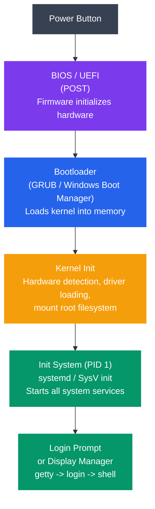
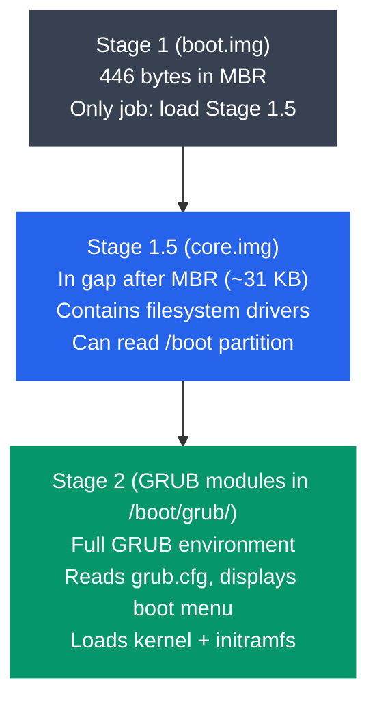

# Boot Process and System Initialization

## What You'll Learn

- The complete boot sequence from power button to login prompt
- POST (Power-On Self-Test) and hardware initialization
- BIOS vs UEFI firmware and their differences
- Bootloader operation (GRUB stages, Windows Boot Manager)
- Kernel loading, decompression, and initialization
- Init systems: SysV init (runlevels) vs systemd (units, targets)
- The login process (getty, login, shell)
- Using `dmesg` and `journalctl` to analyze the boot process

## Boot Process Overview

Socho zara — jab tum apna laptop ka power button dabate ho, uss ek click ke peeche ek pura orchestrated pipeline chalta hai. Bilkul waise hi jaise IRCTC pe ticket book karte time backend mein pehle authentication hota hai, phir seat availability check hoti hai, phir payment, phir confirmation — har step apne se pehle wale step ke successfully complete hone pe depend karta hai. Agar beech mein koi step fail ho jaye, poora flow atak jaata hai.

Boot process bhi bilkul aisa hi hai — "dead hardware" (bijli off, kuch bhi running nahi) se lekar "fully running OS jahan tum login kar sakte ho" tak ka safar, ek chain of custody hai jahan har layer agle layer ko control handover karti hai.



```
Complete Boot Sequence:
═══════════════════════

  ┌────────────────┐
  │  Power Button  │
  └───────┬────────┘
          ▼
  ┌────────────────┐
  │  BIOS / UEFI   │  Firmware initializes hardware
  │  (POST)        │
  └───────┬────────┘
          ▼
  ┌────────────────┐
  │   Bootloader   │  GRUB / Windows Boot Manager
  │  (GRUB)        │  Loads kernel into memory
  └───────┬────────┘
          ▼
  ┌────────────────┐
  │  Kernel Init   │  Hardware detection, driver loading,
  │                │  mount root filesystem
  └───────┬────────┘
          ▼
  ┌────────────────┐
  │  Init System   │  systemd / SysV init
  │  (PID 1)       │  Starts all system services
  └───────┬────────┘
          ▼
  ┌────────────────┐
  │  Login Prompt  │  getty → login → shell
  │  or Display Mgr│  (or GUI login screen)
  └────────────────┘
```

Yeh chain 6 major stages mein divide hoti hai, aur hum har ek ko detail mein dekhenge — kyunki DevOps engineer banne ke liye yeh samajhna zaruri hai ki server boot hone mein time kyun lagta hai, ya boot fail kyun hua, ya kaunsa service startup slow kar raha hai.

## Step 1: Power On and POST

Jab power button dabate ho, CPU ek fixed memory address se instructions execute karna start karta hai — waha pe firmware (BIOS ya UEFI) baitha hota hai, ready to run. Yeh bilkul waise hai jaise koi restaurant khulte hi manager sabse pehle kitchen check karta hai — gas connection theek hai kya, fridge chal raha hai kya, staff aa gaya kya — customer ko andar aane se pehle.

### Power-On Self-Test (POST)

**Kya hota hai POST mein?** POST basically ek health-checkup hai jo system boot hone se pehle khud pe karta hai. Kya hota hai isme? CPU apne aap ko reset karta hai, phir hardware ke har critical component ko test karta hai — RAM sahi hai kya, keyboard connect hai kya, video card kaam kar raha hai kya. Agar kuch galat mila, beep codes ke through error signal karta hai (kyunki abhi screen tak initialize nahi hui hoti, isliye sound hi ek tarika hai batane ka).

```
POST Sequence:
──────────────

1. CPU Reset
   - CPU starts in real mode (16-bit, 1 MB address space)
   - Instruction pointer set to 0xFFFF0 (BIOS entry point)
   - CPU begins executing firmware code from ROM/flash

2. Hardware Checks
   ┌──────────────────────────────────────┐
   │  ✓ CPU registers and flags          │
   │  ✓ BIOS/UEFI ROM integrity (checksum)│
   │  ✓ System timer (PIT/HPET)          │
   │  ✓ DMA controller                   │
   │  ✓ Memory (RAM) test                │
   │  ✓ Keyboard controller              │
   │  ✓ Video adapter                    │
   └──────────────────────────────────────┘

3. Device Enumeration
   - PCI/PCIe bus scan
   - USB controller initialization
   - Storage controller detection (SATA, NVMe)
   - Network interface detection

4. Boot Device Selection
   - Check boot order (configured in BIOS/UEFI settings)
   - Try each device until bootable one is found
   - Read first sector (MBR) or EFI system partition

POST Beep Codes (BIOS):
  1 short beep  = Normal POST, system OK
  2 short beeps = POST error (check display)
  Continuous     = RAM error
  (varies by BIOS manufacturer)
```

> [!info]
> Zaruri baat: CPU shuruaat mein "real mode" mein hota hai — sirf 16-bit, aur sirf 1 MB tak ki memory access kar sakta hai. Yeh 1980s ka legacy hai jo aaj bhi backward compatibility ke liye maintain kiya jaata hai. Aage jaake kernel isse "protected mode" aur phir "long mode" (64-bit) mein switch karega.

Device enumeration wala step interesting hai — yeh basically ek roll-call hai. PCI bus scan hota hai (jaise ek building manager har floor pe jaake check karta hai kaun-kaunsa room occupied hai), USB controllers initialize hote hain, aur storage devices (SATA/NVMe) detect kiye jaate hain. Iske baad system boot order check karta hai — "pehle USB try karo, nahi mila to hard disk try karo" — jo tumne BIOS settings mein configure kiya hota hai.

## Step 2: BIOS vs UEFI

Firmware ke do flavors hote hain — purana wala BIOS, aur naya wala UEFI. Aajkal ke almost saare modern systems UEFI use karte hain, lekin BIOS ko samajhna zaruri hai kyunki bahut saari terminology (jaise MBR) abhi bhi relevant hai.

### BIOS (Basic Input/Output System)

**BIOS kaam kaise karta hai?** BIOS ka approach seedha-saada hai — boot device ke pehle 512 bytes padho (jise MBR, ya Master Boot Record, kehte hain), aur usme jo tiny program hota hai use run karo. Socho MBR ko ek building ke reception desk jaisa — bahut chhota sa space (sirf 512 bytes!) hai, lekin usme itni info hoti hai ki visitor ko sahi floor tak bhej sake.

```
BIOS Boot Process:
──────────────────

1. BIOS loads first 512 bytes of boot device (MBR)
2. MBR contains:
   - Boot code (446 bytes) — tiny program
   - Partition table (64 bytes) — 4 partition entries
   - Boot signature (2 bytes) — 0x55AA

   ┌─────────────────────────────────────┐
   │  MBR Layout (512 bytes)             │
   │  ┌────────────────────────┐         │
   │  │  Bootstrap Code        │ 446 B   │
   │  │  (loads bootloader)    │         │
   │  ├────────────────────────┤         │
   │  │  Partition Entry 1     │ 16 B    │
   │  │  Partition Entry 2     │ 16 B    │
   │  │  Partition Entry 3     │ 16 B    │
   │  │  Partition Entry 4     │ 16 B    │
   │  ├────────────────────────┤         │
   │  │  Boot Signature 55 AA │ 2 B     │
   │  └────────────────────────┘         │
   └─────────────────────────────────────┘

3. Bootstrap code runs → loads the bootloader
```

Dhyan do — MBR mein sirf 4 partition entries fit hoti hain (16 bytes har ek ke liye). Isliye purane MBR-based disks pe max 4 primary partitions hi ban sakte the (ya 3 primary + 1 extended jisme aur logical partitions daal sakte the). Aur boot signature `0x55AA` ek magic number hai jo BIOS ko batata hai "haan yeh ek valid, bootable disk hai" — agar yeh signature match nahi hua, BIOS agla boot device try karta hai.

### UEFI (Unified Extensible Firmware Interface)

**UEFI ne kya improve kiya?** UEFI BIOS ka modern replacement hai — jaise Paytm ne cash-on-delivery ko replace kiya, waise hi UEFI ne BIOS ki limitations (2TB disk limit, sirf 4 partitions, slow boot) ko solve kiya. UEFI GPT (GUID Partition Table) use karta hai jo bahut zyada partitions support karta hai aur bade disks (zettabytes tak!) handle kar sakta hai.

```
UEFI Boot Process:
──────────────────

1. UEFI firmware initializes
2. Reads GPT (GUID Partition Table)
3. Locates EFI System Partition (ESP)
   - FAT32 formatted partition (typically 100-512 MB)
   - Contains .efi bootloader executables
4. Runs the configured EFI application (bootloader)

   ┌─────────────────────────────────────┐
   │  GPT Disk Layout                    │
   │  ┌────────────────────────┐         │
   │  │  Protective MBR        │         │
   │  ├────────────────────────┤         │
   │  │  GPT Header             │         │
   │  ├────────────────────────┤         │
   │  │  Partition Entries      │         │
   │  ├────────────────────────┤         │
   │  │  ESP (EFI System Part) │ ← UEFI  │
   │  │  /EFI/BOOT/bootx64.efi│   reads  │
   │  ├────────────────────────┤   this   │
   │  │  Linux Partition        │         │
   │  ├────────────────────────┤         │
   │  │  Swap Partition         │         │
   │  ├────────────────────────┤         │
   │  │  Backup GPT Header     │         │
   │  └────────────────────────┘         │
   └─────────────────────────────────────┘
```

ESP (EFI System Partition) basically ek dedicated FAT32 partition hai jahan `.efi` files (bootloader executables) rehte hain. UEFI seedha yeh files run kar sakta hai — no need for a tiny 446-byte bootstrap code jaisa BIOS mein tha. Isse boot flexible aur fast dono ho jaata hai.

> [!tip]
> UEFI mein ek "Protective MBR" bhi hota hai (disk ki shuru mein) — yeh purane, BIOS-only tools ko confuse hone se bachata hai taaki wo galti se disk ko "unformatted/empty" na samjhe aur overwrite na kar de.

### BIOS vs UEFI Comparison

| Feature | BIOS | UEFI |
|---------|------|------|
| **Year introduced** | 1981 | 2005+ |
| **CPU mode** | 16-bit real mode | 32/64-bit protected mode |
| **Partition scheme** | MBR (max 4 primary) | GPT (128+ partitions) |
| **Max disk size** | 2 TB | 9.4 ZB (zettabytes) |
| **Boot code location** | MBR (446 bytes) | EFI System Partition |
| **Secure Boot** | No | Yes |
| **Network boot** | PXE (limited) | Full HTTP/TLS support |
| **UI** | Text-only | Graphical possible |
| **Speed** | Slower | Faster (parallel init) |
| **Driver format** | 16-bit ASM | EFI byte code (portable) |

Secure Boot wala point especially DevOps/security context mein important hai — yeh feature verify karta hai ki bootloader aur kernel digitally signed hain, taaki koi malware boot process ko hijack na kar sake (rootkit attack se protection).

```bash
# Check if your system uses BIOS or UEFI
ls /sys/firmware/efi       # If exists → UEFI
# "No such file or directory" → BIOS (legacy)

# View UEFI boot entries
efibootmgr -v

# View partition table type
sudo fdisk -l /dev/sda     # Check for GPT or MBR (dos)
```

## Step 3: Bootloader

Ab firmware ka kaam khatam ho gaya — usne sirf itna kiya ki hardware check kiya aur bootable device dhoonda. Ab baton hand over hota hai bootloader ko, jiska ek hi kaam hai: OS kernel ko memory mein load karo aur usse control de do. Linux systems pe sabse popular bootloader hai GRUB (GRand Unified Bootloader).

Socho GRUB ko ek railway platform ke announcement system jaisa — jab tak train (kernel) platform pe nahi aati, GRUB hi decide karta hai konsi train chalani hai (agar dual-boot hai to OS selection menu dikhata hai), aur phir train ko sahi track pe bhej deta hai.

### GRUB Stages

**GRUB itne saare stages mein kyun load hota hai?** GRUB ek single program nahi hai — yeh multiple stages mein load hota hai, kyunki MBR mein sirf 446 bytes ki jagah hoti hai jo ek pura filesystem-aware bootloader fit karne ke liye kaafi nahi hai. Isliye GRUB apne aap ko incrementally load karta hai — pehle ek chhota sa loader, jo thoda bada loader load karta hai, jo phir poora GRUB environment load karta hai.



```
GRUB Boot Stages:
─────────────────

Stage 1 (boot.img — 446 bytes in MBR):
┌──────────────────────────────────────┐
│  Tiny program in MBR                  │
│  Only job: load Stage 1.5             │
│  Knows disk geometry to find Stage 1.5│
└──────────────┬───────────────────────┘
               ▼
Stage 1.5 (core.img — in gap after MBR):
┌──────────────────────────────────────┐
│  Lives in first 63 sectors after MBR  │
│  (~31 KB of space)                    │
│  Contains filesystem drivers          │
│  Can read the /boot partition         │
│  Loads Stage 2                        │
└──────────────┬───────────────────────┘
               ▼
Stage 2 (GRUB modules in /boot/grub/):
┌──────────────────────────────────────┐
│  Full GRUB environment               │
│  Reads grub.cfg configuration        │
│  Displays boot menu                  │
│  Loads selected kernel + initramfs   │
│  Passes control to kernel            │
└──────────────────────────────────────┘
```

Yeh bilkul relay race jaisa hai — Stage 1 baton pakadta hai (kyunki usko sirf itna pata hai ki agla runner (Stage 1.5) kaha khada hai), Stage 1.5 baton lekar thoda door tak daudta hai (kyunki isko filesystem drivers pata hain, so it can actually read files), aur phir Stage 2 ko baton deta hai jo asli race complete karta hai — poora GRUB environment load karke boot menu dikhata hai aur kernel ko load karta hai.

### GRUB Configuration

```bash
# GRUB configuration file
cat /boot/grub/grub.cfg    # Auto-generated — don't edit directly!

# Customization file
cat /etc/default/grub
# GRUB_TIMEOUT=5
# GRUB_DEFAULT=0
# GRUB_CMDLINE_LINUX="quiet splash"

# After editing /etc/default/grub, regenerate:
sudo update-grub           # Debian/Ubuntu
sudo grub2-mkconfig -o /boot/grub2/grub.cfg  # RHEL/Fedora
```

> [!warning]
> `grub.cfg` ko directly edit mat karo — yeh auto-generated file hai (`update-grub` command isse regenerate karta hai). Agar tumhe boot parameters change karne hain, `/etc/default/grub` edit karo aur phir `update-grub` chalao. Directly `grub.cfg` edit karoge to agli baar regenerate hone pe tumhare changes ud jayenge.

### What GRUB Loads

GRUB apna kaam khatam karne se pehle do important files ko RAM mein load karta hai:

```
GRUB loads two files into memory:
─────────────────────────────────

1. Kernel Image: /boot/vmlinuz-<version>
   - Compressed Linux kernel
   - Contains core kernel code

2. Initial RAM Filesystem: /boot/initramfs-<version>.img
   (or /boot/initrd.img-<version>)
   - Temporary root filesystem loaded into RAM
   - Contains essential drivers (disk, filesystem, LVM, RAID)
   - Needed to mount the REAL root filesystem
   - After real root is mounted, initramfs is discarded

   Why initramfs?
   ┌─────────────────────────────────────────┐
   │ Problem: Kernel needs disk driver to    │
   │ read root filesystem, but disk driver   │
   │ might be a loadable module ON the       │
   │ root filesystem (chicken-and-egg).      │
   │                                         │
   │ Solution: initramfs bundles essential   │
   │ drivers so kernel can mount root.       │
   └─────────────────────────────────────────┘
```

Yeh "chicken-and-egg problem" samajhna zaruri hai — kyunki interview mein bhi yeh common question hai. Kernel ko root filesystem (jaha tumhara `/`, `/home`, `/etc` sab hai) mount karna hai, lekin usse mount karne ke liye disk driver chahiye. Lekin agar wo disk driver khud root filesystem PE stored hai to kaise load karega? Bilkul waise jaise tumhe ghar ki chaabi chahiye, lekin chaabi ghar ke andar hi rakhi hai — lock hi khul nahi sakta!

initramfs isi problem ko solve karta hai — yeh ek mini temporary filesystem hai jo poora RAM mein load ho jaata hai aur usme essential drivers (disk controllers, LVM, RAID, filesystem drivers) pehle se hi bundled hote hain. Isse kernel real root filesystem ko dhoondh aur mount kar paata hai. Ek baar real root mount ho jaaye, initramfs discard kar diya jaata hai — jaise ek temporary staircase jo tumne building ki main entry banne tak use ki, phir hata di.

### Windows Boot Manager

Windows ka approach thoda alag hai lekin concept same hai — layers ke through control pass hota hai.

```
Windows Boot Sequence:
──────────────────────

1. UEFI loads Windows Boot Manager
   (EFI\Microsoft\Boot\bootmgfw.efi)

2. Boot Manager reads BCD (Boot Configuration Data)
   - Displays OS selection menu (if multiple OS)

3. Loads Windows Boot Loader (winload.efi)
   - Loads kernel: ntoskrnl.exe
   - Loads HAL: hal.dll
   - Loads boot-start drivers

4. Kernel initializes → Session Manager (smss.exe)
   → Windows Logon (winlogon.exe)

BCD store equivalent to GRUB's grub.cfg:
  bcdedit /enum           # View boot entries (Windows cmd)
```

BCD (Boot Configuration Data) Windows ki duniya mein wahi role play karta hai jo GRUB ke liye `grub.cfg` karta hai — boot entries, timeout settings, default OS, sab yahi define hota hai.

## Step 4: Kernel Loading and Initialization

Ab bootloader ne apna kaam khatam kar diya — kernel ko memory mein load kar diya aur control handover kar diya. Yahan se kernel poori tarah se system ka boss ban jaata hai.

```
Kernel Boot Sequence:
═════════════════════

1. Kernel Decompression
   - vmlinuz is compressed (gzip, bzip2, xz, or zstd)
   - Self-extracting: decompresses itself into memory
   - Prints: "Decompressing Linux... done, booting the kernel."

2. Architecture-Specific Setup
   - Set up page tables (virtual memory)
   - Initialize GDT/IDT (x86 descriptor tables)
   - Enable protected mode → long mode (64-bit)
   - Detect CPU features (SSE, AVX, etc.)

3. start_kernel() function (init/main.c)
   ┌────────────────────────────────────────┐
   │  setup_arch()          → CPU, memory   │
   │  trap_init()           → exceptions    │
   │  mm_init()             → memory mgmt   │
   │  sched_init()          → scheduler     │
   │  init_IRQ()            → interrupts    │
   │  time_init()           → system clock  │
   │  console_init()        → early console │
   │  vfs_caches_init()     → VFS setup     │
   │  page_cache_init()     → page cache    │
   │  rest_init()           → start PID 1   │
   └────────────────────────────────────────┘

4. Mount initramfs as temporary root (/)

5. Run /init from initramfs
   - Loads storage drivers
   - Finds real root filesystem
   - Mounts real root filesystem
   - pivot_root to switch from initramfs to real root

6. Execute /sbin/init (PID 1)
   - First user-space process
   - systemd or SysV init
   - Parent of all other processes
```

`vmlinuz` naam mein hi "z" hai jo batata hai ki yeh compressed hai (gzip ya kuch aur algorithm se). Kaafi log confuse ho jaate hain — "vmlinuz khud compressed hai to run kaise hota hai?" Answer simple hai: yeh self-extracting hai, matlab isme khud ek chota sa decompression program bhi bundled hai jo apne aap ko RAM mein unpack kar leta hai, phir asli kernel code run hota hai.

`start_kernel()` function Linux kernel ka "main()" jaisa hai — yeh sequentially har subsystem ko initialize karta hai: memory management, scheduler (jo decide karega kaunsa process kab CPU pe chalega), interrupt handling, system clock, aur bahut kuch. Socho isse ek naye office ki setup jaisa — pehle bijli connection (memory), phir security system (traps/exceptions), phir HR department (scheduler jo decide karega kaun kab kaam karega), phir reception (console), tab jaake office fully functional hota hai.

Sabse aakhri mein `rest_init()` chalta hai jo PID 1 ko spawn karta hai — yeh wahi process hai jo baad mein `/sbin/init` (systemd ya SysV init) ban jaata hai, aur isi se saare aage ke processes janam lenge.

`pivot_root` wala step bhi interesting hai — yeh basically "temporary staircase se permanent staircase pe switch karna" hai. initramfs (jo abhi tak temporary `/` ban ke baitha tha) ko drop kar diya jaata hai aur asli disk pe jo root filesystem hai, wo permanent `/` ban jaata hai.

```bash
# View kernel boot parameters
cat /proc/cmdline
# Example output:
# BOOT_IMAGE=/vmlinuz-5.15.0 root=/dev/sda2 ro quiet splash

# View kernel initialization messages
dmesg | head -50
```

## Step 5: Init Systems

Ab jo pehla user-space process spawn hota hai — usko PID 1 milta hai. Yeh process bahut special hai kyunki yeh saare doosre processes ka "ancestor" (poorvaj) ban jaata hai. Agar kisi process ka parent process crash ho jaaye, to woh orphan process PID 1 ko hi adopt kar leta hai — bilkul waise jaise koi joint family mein bade dada-dadi sabki responsibility le lete hain agar beech ka koi member na ho.

Do major init systems ki duniya hai — purana SysV init, aur naya systemd.

### SysV Init (Traditional)

**Runlevels kya hote hain?** SysV init purana tarika hai jisme system alag-alag "runlevels" mein hota hai — har runlevel ek particular state define karta hai (jaise single-user recovery mode, ya multi-user with GUI).

```
SysV Init uses runlevels to define system states:
─────────────────────────────────────────────────

Runlevel  Description
────────  ──────────────────────────────────
   0      Halt (shutdown)
   1      Single-user mode (recovery)
   2      Multi-user, no networking
   3      Multi-user, with networking (text mode)
   4      Unused (user-defined)
   5      Multi-user, with networking + GUI
   6      Reboot

Boot sequence with SysV init:
┌──────────────────────────────────────────┐
│  Kernel executes /sbin/init               │
│       ↓                                  │
│  init reads /etc/inittab                 │
│       ↓                                  │
│  Determines default runlevel             │
│  (e.g., id:3:initdefault:)              │
│       ↓                                  │
│  Runs /etc/rc.d/rc3.d/ scripts           │
│  (S01 first, S02 second, ... in order)   │
│       ↓                                  │
│  S01syslog → S02network → S03sshd → ... │
│  (sequential — one at a time)            │
└──────────────────────────────────────────┘
```

SysV init ka sabse bada limitation yeh hai ki yeh services ko **sequentially** start karta hai — ek ke baad ek, jaise ek single-counter wali sarkari office ki line, jaha next person ko tab tak wait karna padta hai jab tak pehla wala poora kaam khatam na kar le. Agar koi service slow hai (jaise network wait karna), poora boot process usi mein atak jaata hai.

```bash
# SysV init script structure
ls /etc/init.d/           # All service scripts
ls /etc/rc3.d/            # Runlevel 3 scripts

# Script naming convention:
# S20ssh  → Start SSH at position 20
# K80ssh  → Kill SSH at position 80

# Managing services (SysV)
sudo service sshd start
sudo service sshd stop
sudo service sshd status
sudo chkconfig sshd on    # Enable at boot (RHEL)
sudo update-rc.d ssh defaults  # Enable at boot (Debian)
```

`S20ssh` jaise naming convention mein "S" matlab Start, aur number (20) uska position/priority define karta hai — jitna chhota number, utni jaldi wo script chalegi.

### systemd (Modern)

**systemd, SysV se behtar kyun hai?** Aajkal ke saare major Linux distros (Ubuntu, Fedora, RHEL, Debian) systemd use karte hain. Yeh SysV init ki sequential problem ko solve karta hai — services ab **parallel** mein start hoti hain, dependency graph ke hisaab se. Bilkul jaise Swiggy order fulfillment mein restaurant food banata hai, delivery partner assign hota hai, aur payment process hota hai — sab kuch parallel mein chalta hai, sequential nahi, taaki total time bache.

```
systemd Architecture:
─────────────────────

┌───────────────────────────────────────────────────┐
│                   systemd (PID 1)                  │
│                                                   │
│  ┌─────────────────────────────────────────────┐  │
│  │              Target Units                   │  │
│  │  (equivalent to runlevels)                  │  │
│  │                                             │  │
│  │  multi-user.target ≈ runlevel 3             │  │
│  │  graphical.target  ≈ runlevel 5             │  │
│  │  rescue.target     ≈ runlevel 1             │  │
│  └─────────────────────────────────────────────┘  │
│                                                   │
│  ┌─────────────┐ ┌──────────┐ ┌──────────────┐   │
│  │   Service   │ │  Socket  │ │   Timer      │   │
│  │   Units     │ │  Units   │ │   Units      │   │
│  │  (.service) │ │ (.socket)│ │  (.timer)    │   │
│  └─────────────┘ └──────────┘ └──────────────┘   │
│  ┌─────────────┐ ┌──────────┐ ┌──────────────┐   │
│  │   Mount    │ │  Device  │ │   Path       │   │
│  │   Units    │ │  Units   │ │   Units      │   │
│  │  (.mount)  │ │ (.device)│ │  (.path)     │   │
│  └─────────────┘ └──────────┘ └──────────────┘   │
└───────────────────────────────────────────────────┘

Key advantage: systemd starts services in PARALLEL
based on dependency graph, not sequentially.
```

"Target" units basically runlevels ka modern naam hain — `multi-user.target` (text mode, jaise old runlevel 3), `graphical.target` (GUI wala, jaise old runlevel 5). Isके अलावा systemd mein bahut saare unit types hain — `.service` (ek daemon/program), `.socket` (network/IPC socket ke liye), `.timer` (cron jaisa scheduling), `.mount` (filesystem mounts).

> [!tip]
> Socket activation ek cool feature hai — systemd kisi service ko turant start nahi karta, balki uske liye socket create kar deta hai. Jab pehli connection request aati hai, tabhi service actually start hoti hai (lazy loading jaisa concept, jo Node.js developers ko familiar lagega).

```bash
# systemd service management (systemctl)
systemctl status sshd              # Check service status
sudo systemctl start sshd          # Start a service
sudo systemctl stop sshd           # Stop a service
sudo systemctl restart sshd        # Restart a service
sudo systemctl enable sshd         # Enable at boot
sudo systemctl disable sshd        # Disable at boot

# View all running services
systemctl list-units --type=service --state=running

# View boot target (equivalent to runlevel)
systemctl get-default              # e.g., graphical.target

# Change target
sudo systemctl set-default multi-user.target  # Text mode boot
sudo systemctl set-default graphical.target   # GUI boot

# View unit file
systemctl cat sshd.service

# View dependency tree
systemctl list-dependencies multi-user.target
```

### Example systemd Unit File

Agar tumne kabhi apna khud ka background service Linux server pe deploy kiya hai (jaise koi Node.js app jo hamesha chalti rahe), to tumne shayad aisi unit file banayi hogi:

```ini
# /etc/systemd/system/myapp.service
[Unit]
Description=My Application
After=network.target
Wants=network-online.target

[Service]
Type=simple
User=myapp
ExecStart=/usr/local/bin/myapp --config /etc/myapp.conf
Restart=on-failure
RestartSec=5

[Install]
WantedBy=multi-user.target
```

`After=network.target` batata hai ki yeh service tab tak start nahi hogi jab tak network ready na ho jaaye (declarative dependency — SysV mein tumhe yeh manually number karke enforce karna padta tha). `Restart=on-failure` matlab agar app crash ho jaaye, systemd usko khud restart kar dega — bilkul PM2 jaisa jo Node.js apps ke liye process management karta hai, bas yeh OS-level pe kaam karta hai.

### SysV Init vs systemd Comparison

| Feature | SysV Init | systemd |
|---------|-----------|---------|
| **Startup order** | Sequential (slow) | Parallel (fast) |
| **Configuration** | Shell scripts | Declarative unit files |
| **Dependencies** | Manual (numbering) | Automatic (After=, Requires=) |
| **Service monitoring** | None (manual) | Automatic restart, watchdog |
| **Logging** | syslog (/var/log/) | journald (binary journal) |
| **Socket activation** | No | Yes (start service on demand) |
| **Cgroups** | No | Yes (resource control) |
| **Complexity** | Simple | Complex |
| **Portability** | Any Unix | Linux-specific |
| **Boot speed** | 30-60+ seconds | 5-15 seconds |

Cgroups wala point Docker/Kubernetes samajhne walon ke liye especially relevant hai — systemd resource control ke liye cgroups use karta hai, aur containers bhi isi mechanism pe based hain (CPU limits, memory limits waghera).

## Step 6: Login Process

Ek baar saari services start ho jaayein, system ab tumhe andar aane deta hai — login interface dikhata hai.

```
Text Console Login:
───────────────────

systemd starts getty service for each virtual terminal:

  systemd → getty@tty1.service → /sbin/agetty
                                      │
                                      ▼
                              ┌──────────────┐
                              │   agetty     │
                              │  "login: "   │
                              └──────┬───────┘
                                     │ user types username
                                     ▼
                              ┌──────────────┐
                              │    login     │
                              │  "Password:" │
                              │  checks      │
                              │  /etc/passwd │
                              │  /etc/shadow │
                              └──────┬───────┘
                                     │ authenticated
                                     ▼
                              ┌──────────────┐
                              │    shell     │
                              │   /bin/bash  │
                              │  reads       │
                              │  ~/.bashrc   │
                              └──────────────┘

GUI Login:
──────────
  systemd → display-manager.service (gdm, lightdm, sddm)
             → Shows graphical login screen
             → Authenticates user (PAM)
             → Starts desktop session (GNOME, KDE, etc.)
```

Yeh flow ek security checkpoint jaisa hai — bilkul jaise airport mein pehle boarding pass check hota hai (username), phir ID proof (password), tabhi tumhe security gate ke andar jaane diya jaata hai (shell). `agetty` process tumhare virtual terminal pe "login:" prompt dikhata hai, phir `login` binary `/etc/shadow` file check karke password verify karta hai (haan, passwords ek separate `/etc/shadow` file mein encrypted/hashed store hote hain, `/etc/passwd` mein nahi — security ke liye), aur authenticate hone ke baad tumhe apna shell (jaise `/bin/bash`) mil jaata hai jo `~/.bashrc` read karke apna environment set up karta hai.

GUI wale flow mein bhi concept same hai, bas login screen graphical hoti hai aur PAM (Pluggable Authentication Modules) authentication handle karta hai, phir GNOME/KDE jaisa desktop session start hota hai.

## Analyzing the Boot Process

Ab jab tumhe pura flow samajh aa gaya, chalo dekhte hain ki agar boot mein kuch gadbad ho jaaye, to debug kaise karein. Yeh DevOps ke roz-marra ke kaam mein bahut kaam aata hai — production server restart hua aur koi service up nahi hui, to yahi tools use hote hain.

### dmesg — Kernel Ring Buffer

**Kyun zaruri hai `dmesg`?** `dmesg` kernel ke messages dikhata hai — yeh ek ring buffer se read karta hai jaha kernel apne saare boot-time aur runtime logs likhta rehta hai (hardware detect hua, driver load hua, koi error aaya, sab kuch).

```bash
# View all kernel messages from boot
dmesg

# With timestamps
dmesg -T

# Filter by log level
dmesg --level=err       # Errors only
dmesg --level=warn      # Warnings

# Search for specific hardware
dmesg | grep -i "usb"
dmesg | grep -i "eth"
dmesg | grep -i "sda"

# Follow new messages in real time
dmesg -w
```

### journalctl — systemd Journal

**`journalctl`, `dmesg` se alag kaise hai?** Agar tumhara system systemd use karta hai, to `journalctl` tumhara best friend hai boot debugging ke liye. Yeh binary format mein saare logs store karta hai (dmesg se zyada powerful — kyunki isme services ke logs bhi milte hain, sirf kernel ke nahi).

```bash
# View complete boot log
journalctl -b                      # Current boot
journalctl -b -1                   # Previous boot
journalctl --list-boots             # List all recorded boots

# Kernel messages only
journalctl -k

# Boot time analysis
systemd-analyze                     # Total boot time
systemd-analyze blame               # Time per service
systemd-analyze critical-chain      # Critical path
systemd-analyze plot > boot.svg     # Visual timeline

# Example output of systemd-analyze blame:
#   3.204s NetworkManager.service
#   2.145s systemd-journal-flush.service
#   1.803s docker.service
#   1.204s accounts-daemon.service
#    923ms snapd.service
```

`systemd-analyze blame` command bahut kaam ka hai — yeh batata hai kaunsi service boot mein sabse zyada time le rahi hai. Production servers pe boot time optimize karna ho (jaise auto-scaling groups mein jahan naye instances jaldi ready hone chahiye), to sabse pehle yahi command chalao.

### Boot Time Breakdown Example

```
systemd-analyze output:
───────────────────────

Startup finished in:
  firmware:  4.523s    ← UEFI/BIOS POST
  loader:    2.102s    ← GRUB bootloader
  kernel:    3.847s    ← Kernel init + initramfs
  userspace: 8.234s    ← systemd services
  ──────────────────
  Total:    18.706s

Critical Chain:
  graphical.target @8.234s
  └─ display-manager.service @7.102s +1.132s
     └─ multi-user.target @7.098s
        └─ docker.service @5.295s +1.803s
           └─ network-online.target @5.290s
              └─ NetworkManager-wait-online.service @2.086s +3.204s
                 └─ NetworkManager.service @1.823s +263ms
                    └─ basic.target @1.815s
```

`critical-chain` output se pata chalta hai konsa "dependency path" sabse zyada time le raha hai — yahan dekh sakte ho ki `NetworkManager-wait-online.service` 3.2 seconds le raha hai, jo poore boot ka sabse bada bottleneck hai. Agar network ki zarurat na ho boot ke turant baad, to is service ko disable karke boot time kaafi kam kiya ja sakta hai.

## Complete Boot Timeline

Chalo pura flow ek real-world jaisi timeline mein dekhte hain, taaki tumhe andaza mile ki kaunsa step kitna time leta hai:

```
Time    Stage              What Happens
─────   ─────────────────  ──────────────────────────────────
0.0s    Power On           Voltage reaches CPU
0.1s    CPU Reset          Jumps to firmware entry point
0.1s    POST               Tests RAM, CPU, devices
4.5s    UEFI Init          Reads GPT, finds ESP
4.6s    Bootloader (GRUB)  Loads from ESP
6.7s    Kernel Loading     vmlinuz decompressed into RAM
7.0s    Kernel Init        start_kernel(), hardware setup
8.5s    initramfs          Loads storage drivers, finds root
10.5s   Init (systemd)     PID 1 starts, reads unit files
11.0s   Services Start     Parallel service startup begins
15.0s   Network Ready      NetworkManager connects
18.0s   Display Manager    Login screen appears
18.7s   System Ready       graphical.target reached
```

## Exercises

### Beginner
1. Check whether your system uses BIOS or UEFI:
   ```bash
   ls /sys/firmware/efi    # Exists = UEFI
   ```
2. Run `systemd-analyze` and `systemd-analyze blame` to see your boot time. Which service takes the longest?
3. Use `dmesg | head -30` to read the first kernel messages. Identify when the kernel starts and what hardware it detects first.

### Intermediate
4. Create a custom systemd service unit file that runs a simple script at boot. Enable it and verify it runs after reboot.
5. Compare the contents of `/boot/` on your system. Identify the kernel image, initramfs, and GRUB files. What is the size of each?
6. Use `journalctl --list-boots` to see past boots. Then use `journalctl -b -1` to examine a previous boot's logs. Were there any errors?

### Advanced
7. Modify GRUB to add a custom kernel boot parameter (e.g., `loglevel=7` for verbose output). Rebuild the GRUB config and reboot. Compare `dmesg` output before and after.
8. Extract the contents of your initramfs and examine what's inside:
   ```bash
   mkdir /tmp/initramfs && cd /tmp/initramfs
   zcat /boot/initramfs-$(uname -r).img | cpio -idmv
   # or for newer format:
   unmkinitramfs /boot/initrd.img-$(uname -r) /tmp/initramfs
   ```
   What drivers and scripts are included? Why are they needed before the root filesystem is mounted?
9. Research Secure Boot. How does UEFI Secure Boot verify the bootloader and kernel? What role do MOK (Machine Owner Keys) play for Linux distributions? Set up or examine your system's Secure Boot configuration.

## Key Takeaways

- Boot process ek chain hai: firmware (BIOS/UEFI) → bootloader (GRUB) → kernel → init system → login — har step apne se pehle wale pe depend karta hai
- POST hardware ki health-check karta hai, koi bhi software chalne se pehle
- UEFI ne BIOS ko replace kar diya hai — GPT support, Secure Boot, bade disks, aur faster initialization ke saath
- GRUB stages mein load hota hai: Stage 1 (MBR, sirf 446 bytes) → Stage 1.5 (filesystem aware) → Stage 2 (full environment, boot menu)
- Kernel khud ko decompress karta hai, hardware initialize karta hai, initramfs mount karta hai, phir `pivot_root` se real root filesystem pe switch karta hai
- initramfs ka poora point yeh hai ki disk driver load karne ka chicken-and-egg problem solve ho jaaye
- PID 1 (init/systemd) sabhi user-space processes ka ancestor hai
- systemd ne SysV init ko replace kiya — parallel startup, dependency management, aur integrated logging (journald) ke saath
- SysV init sequential scripts aur runlevels use karta hai; systemd declarative unit files aur targets use karta hai
- `dmesg`, `journalctl`, aur `systemd-analyze` boot issues diagnose karne ke liye must-know tools hain

---

[← Previous: Kernel Architecture](./05_kernel_architecture.md) | [Next Section: Process Management →](../02_process_management/README.md)
