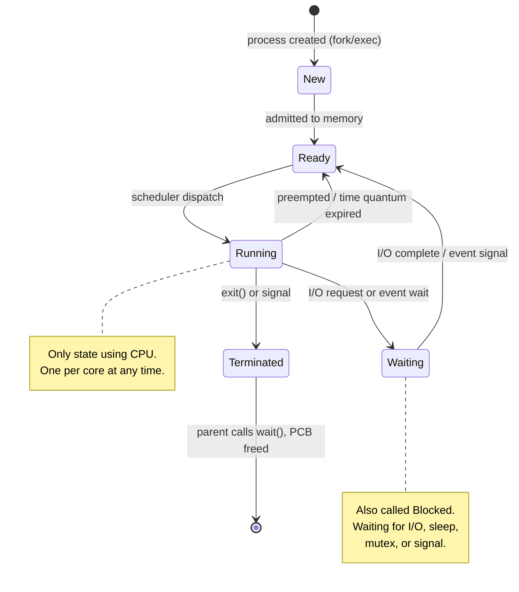

# Processes and Threads

Chalo aaj OS ki sabse fundamental cheez samajhte hain — **process**. Jab bhi tum koi bhi program run karte ho, chahe woh `node server.js` ho ya IRCTC ki tatkal booking waala backend, andar OS process hi spawn kar raha hota hai. Jab tum WhatsApp open karte ho, ek process banta hai. Jab tumhara VS Code ek naya terminal kholta hai, ek naya process banta hai. Jab CRED app background mein tumhara transaction sync karta hai, woh bhi ek process (ya thread) hi hai jo kaam kar rahi hai. Iske baad jo bhi scheduling, memory management, IPC seekhoge — sab isi foundation pe khada hai. Toh isko dhang se samajh lo, baaki sab easy ho jayega.

## Kya Kya Seekhenge Is File Mein

- Program aur process mein exact fark kya hai
- OS process ko represent kaise karta hai — Process Control Block (PCB)
- Process apni life mein kaunse 5 states se guzarta hai
- Thread kya hote hain aur kyun banaye gaye
- Thread models: user-level, kernel-level, aur hybrid approach
- POSIX pthreads use karke C mein threads kaise banate hain
- Linux pe process inspect karne ke practical commands

---

## Process Kya Hota Hai?

Socho ek **program** ek recipe card hai — bas kaagaz pe likha hua hai ki kya karna hai, khud kuch nahi kar raha. Woh disk pe pada hua ek passive file hai (`.exe`, `.out`, jo bhi).

Ab jab koi cook (yaani CPU) us recipe ko follow karna start karta hai — bartan nikaalta hai, gas jalata hai, ingredients daalta hai — tab woh recipe ek **active cooking process** ban jaata hai. Yehi fark hai program aur process mein: program = passive instructions, process = program jo actually execute ho raha hai, apne program counter, stack, allocated memory, aur kernel resources ke saath.

Jab tum `./myprogram` chalate ho, OS ek process create karta hai:

```
Program (disk)                 Process (memory)
┌──────────────┐              ┌──────────────────────┐
│  Executable  │   load       │  Text (code)         │
│  file        │ ──────────>  │  Data (globals)      │
│  (.out/.exe) │              │  Heap (dynamic alloc) │
│              │              │  Stack (local vars)   │
└──────────────┘              │  PCB (kernel)         │
                              └──────────────────────┘
```

> [!tip]
> Ek hi program se multiple processes ban sakte hain. Jaise tumne do terminal windows khole aur dono mein `bash` chalaya — dono alag-alag processes hain, apni-apni memory, apna-apna PID ke saath. Bilkul aisa hi jaise Zomato app tumhare phone pe aur tumhare dost ke phone pe alag-alag chal rahi hai — same "program" (APK), do independent "processes/instances".

### Process Memory Layout

Har process ko OS ek address space deta hai jisme alag-alag sections hote hain — har section ka apna kaam hai:

```
High Address ┌────────────────────┐
             │   Command-line     │
             │   args & env vars  │
             ├────────────────────┤
             │      Stack         │  ← grows downward
             │   (local vars,     │
             │    return addrs)   │
             ├─ ─ ─ ─ ─ ─ ─ ─ ─ ┤
             │        ↓           │
             │   (free space)     │
             │        ↑           │
             ├─ ─ ─ ─ ─ ─ ─ ─ ─ ┤
             │      Heap          │  ← grows upward
             │   (malloc, new)    │
             ├────────────────────┤
             │   Uninitialized    │
             │   Data (BSS)       │
             ├────────────────────┤
             │   Initialized      │
             │   Data             │
             ├────────────────────┤
             │   Text (Code)      │  ← read-only
Low Address  └────────────────────┘
```

Isko aise samjho:

- **Text (Code)** — sabse neeche, read-only. Yeh tumhara compiled code hai. Read-only isliye ki galti se bhi koi bug apne hi program ke instructions ko overwrite na kar de.
- **Initialized Data** — global/static variables jinki value tumne khud di hai (`int count = 5;`).
- **BSS (Uninitialized Data)** — global/static variables jinko value nahi di (`int total;`) — OS inko zero se fill karta hai.
- **Heap** — dynamic memory (`malloc`, `new`). Yeh upar ki taraf grow karta hai jaise-jaise tum aur memory maangte ho.
- **Stack** — function calls, local variables, return addresses. Neeche ki taraf grow karta hai. Har function call ek naya "stack frame" push karta hai, function return hote hi pop ho jaata hai.
- Heap aur Stack ek doosre ki taraf grow karte hain (opposite directions se) — beech mein free space hota hai. Agar dono itna badh jaayen ki takra jaayen, tab hi tumhe "stack overflow" jaisi problems milti hain.

> [!info]
> Yeh process kaise banta hai (jaise `fork()` + `exec()` ka combo Linux pe) uski detail agli file mein — [Process Creation and Termination](./02_process_lifecycle.md). Abhi ke liye bas itna samajh lo ki jab process bant hai, uske paas apna khud ka poora address space ready mil jaata hai jaisa upar diagram mein dikhaya.

---

## Process Control Block (PCB)

**Kya hota hai?** Jab tum Swiggy pe order place karte ho, restaurant ek ticket banata hai — order ID, tumhara address, kya order kiya, kitna time laga, status (preparing/out-for-delivery/delivered). Bina is ticket ke restaurant track hi nahi kar payega ki kaunsa order kaha pahuncha.

OS bhi bilkul yehi karta hai har process ke liye — ek **Process Control Block (PCB)** banata hai (Linux mein isse "task struct" kehte hain). Isme woh sab kuch hota hai jo OS ko us process ko manage karne ke liye chahiye.

```
┌──────────────────────────────────┐
│     Process Control Block (PCB)  │
├──────────────────────────────────┤
│  Process ID (PID)                │
│  Process State                   │
│  Program Counter (PC)            │
│  CPU Registers                   │
│  CPU Scheduling Info (priority)  │
│  Memory Management Info          │
│    (page tables, segment tables) │
│  I/O Status (open files, devices)│
│  Accounting Info (CPU time used) │
│  Parent PID, Child PIDs          │
│  Signal Handling Info            │
└──────────────────────────────────┘
```

**Kyun zaruri hai?** Jab CPU ek process se hatke doosre process pe switch karta hai (context switch), toh usko purane process ki poori state kahin save karni padti hai — taaki baad mein wapas aakar exactly wahi se resume kar sake jaha chhoda tha. PCB hi woh jagah hai jaha yeh sab save hota hai:

- **PID** — unique identifier, jaise tumhara Aadhaar number
- **State** — abhi process kya kar raha hai (Running/Waiting/etc — neeche dekhenge)
- **Program Counter** — agla kaunsa instruction execute karna hai, uska address
- **CPU Registers** — jab process CPU chhodta hai, register values yaha save hoti hain
- **Scheduling Info** — priority, kab tak CPU mila, kitna wait kiya
- **Memory Info** — page tables, kaha kaha memory allocate hui hai
- **I/O Status** — kaunse files khule hain, kaunse sockets open hain
- **Accounting** — kitna CPU time use kiya (`top`/`ps` isi se data leke dikhate hain)
- **Parent/Child PIDs** — process tree maintain karne ke liye (jaise `fork()` se bane child processes)
- **Signal Handling** — kaunse signals (SIGKILL, SIGTERM) ka process kya response dega. Jaise agar tum terminal mein `Ctrl+C` dabate ho, OS us process ko `SIGINT` signal bhejta hai — PCB mein hi likha hota hai ki process ne is signal ke liye custom handler register kiya hai ya default behavior (terminate) follow karega.

Linux mein PCB `struct task_struct` ke naam se implement hota hai kernel source mein (`include/linux/sched.h`). Yeh kernel ke sabse bade structs mein se ek hai — literally sau se zyada fields hain isme.

> [!info]
> Jab tumhara laptop 200 tabs waala Chrome chala raha hai aur ek saath 8-core CPU pe sab kuch smoothly chal raha lagta hai, toh yeh magic PCB aur scheduler ke combo se hi ho raha hai — CPU milliseconds (actually microseconds!) mein process switch kar raha hai, aur har baar PCB se state restore kar raha hai. Ek typical context switch modern hardware pe roughly 1-10 microseconds leta hai — chhota lagta hai, lekin agar system per second hazaaron context switches kare (high load waale server pe hota hai), toh yeh overhead add hone lagta hai. Isi wajah se "context switch overhead" performance tuning mein ek real concern hota hai.

---

## Process States

Process apni poori life mein ek fixed set of states se guzarta hai — bilkul jaise ek Swiggy order "Placed" se "Preparing" se "Out for Delivery" se "Delivered" tak jaata hai. Beech mein agar restaurant busy hai toh order "waiting" mein pada rehta hai.



| State | Kya matlab hai |
|-------|-------------|
| **New** | Process abhi create ho raha hai (jaise order abhi place hua) |
| **Ready** | Process CPU milne ka wait kar raha hai (kitchen ready hai but chef busy hai) |
| **Running** | Instructions actually execute ho rahe hain (chef khaana bana raha hai) |
| **Waiting** | Process kisi event ka wait kar raha hai — I/O complete hona, signal aana (order "waiting for delivery partner") |
| **Terminated** | Process khatam ho gaya (order delivered) |

Kuch important baatein jo log miss kar jaate hain:

- Ek CPU core pe ek time pe sirf **ek hi** process **Running** state mein ho sakta hai. Agar tumhare paas 8 cores hain, toh max 8 processes ek saath "Running" ho sakte hain — baaki sab Ready ya Waiting mein khade hain.
- **Ready aur Waiting mein fark**: Ready waala process CPU milte hi turant chal sakta hai. Waiting waala process CPU mile bhi toh kuch nahi kar payega jab tak uska I/O ya event complete na ho jaaye — jaise disk se data aana, network response, ya `sleep()`.
- **Terminated** ka matlab process khatam nahi hota turant — pehle "zombie" state mein rehta hai jab tak parent process `wait()` call karke uska exit status collect nahi kar leta. Tabhi PCB free hota hai. Agar parent kabhi `wait()` nahi karta, toh zombie processes accumulate ho jaate hain (`ps aux` mein `<defunct>` dikhte hain). Yeh production mein real problem ban sakta hai — agar tumhara Node.js process bahut saare child processes spawn karta hai (jaise `child_process.exec()` se) aur unka exit status kabhi collect nahi karta, toh zombie processes dheere-dheere system ke PID table ko bhar sakte hain.
- Iska ek doosra cousin hai **orphan process** — jab parent process khud child se pehle mar jaaye. Aisi situation mein OS (Linux pe `init`/`systemd`, PID 1) us orphan child ko "adopt" kar leta hai, taaki uska `wait()` phir bhi ho sake aur woh zombie na bane. Bilkul aisa jaise Zomato ka delivery partner order deliver kar raha ho aur beech mein restaurant band ho jaaye — tab bhi Zomato (parent OS) uss delivery ko complete karwata hai.

---

## Thread Kya Hota Hai?

Ab yaha thoda interesting hota hai. Ek process ko socho ek **restaurant** ki tarah — usme kitchen (memory), staff, inventory (files, resources) sab shared hain. Ab us restaurant mein multiple **chefs** kaam kar rahe hain ek saath — sab ek hi kitchen (shared memory) use kar rahe hain, ek hi inventory (shared files) se ingredients utha rahe hain, lekin har chef apna khud ka kaam independently kar raha hai, apna khud ka chaaku (registers), apna khud ka current step (program counter), apna khud ka working counter space (stack).

Yeh chefs hi **threads** hain.

**Thread** process ke andar CPU execution ki sabse chhoti unit hai. Har process mein kam se kam ek thread hota hai (main thread — jaise restaurant ka head chef). Ek hi process ke multiple threads same address space share karte hain, lekin har thread ka apna:

- Program counter (kaunsa instruction chal raha hai)
- Register set
- Stack (apni local variables)

hota hai.

```
Single-threaded Process          Multi-threaded Process
┌───────────────────┐           ┌───────────────────────────┐
│  Code             │           │  Code (shared)            │
│  Data             │           │  Data (shared)            │
│  Files            │           │  Files (shared)           │
│                   │           │                           │
│  ┌─────────────┐  │           │  ┌───────┐ ┌───────┐ ┌───────┐
│  │ Registers   │  │           │  │Regist.│ │Regist.│ │Regist.│
│  │ Stack       │  │           │  │Stack  │ │Stack  │ │Stack  │
│  │ PC          │  │           │  │PC     │ │PC     │ │PC     │
│  └─────────────┘  │           │  └───────┘ └───────┘ └───────┘
│   (1 thread)      │           │  Thread 1  Thread 2  Thread 3│
└───────────────────┘           └───────────────────────────────┘
```

> [!warning]
> Chunki threads **memory share** karte hain, agar ek thread ne kisi shared variable ko galat tareeke se modify kar diya (bina lock liye), toh doosre threads ko corrupted data mil sakta hai. Isko **race condition** kehte hain — aage kisi file mein mutex/semaphore detail se padhoge, but abhi itna yaad rakho: shared state = careful rehna padta hai.

Tum Node.js developer ho toh yeh interesting hoga: Node.js single-threaded event loop use karta hai for JS execution (isliye tumhe race conditions kam dikhte hain apne JS code mein), lekin internally libuv thread pool use karta hai file I/O, DNS lookups (`getaddrinfo`), crypto (`crypto.pbkdf2`), aur compression jaise blocking operations ke liye. Yeh thread pool default 4 threads ka hota hai — `UV_THREADPOOL_SIZE` environment variable se badha sakte ho. Toh Node "single-threaded" hai matlab tumhara JS code ek hi thread pe chalta hai, but process ke andar multiple OS threads chal rahe hote hain background mein heavy-lifting karne ke liye. Agar kabhi socha hai ki `fs.readFile` async kyun hai lekin `fs.readFileSync` poora event loop block kar deta hai — ab samajh aa gaya hoga: async version kaam libuv thread pool ko de deta hai, sync version main thread pe hi karta hai.

### Multithreading Ke Fayde

1. **Responsiveness** — jaise Swiggy app mein UI thread smooth scroll karta rehta hai jab background thread order status fetch kar raha ho. Agar sab kuch ek hi thread pe hota, toh network call ke time poora app freeze ho jaata.
2. **Resource sharing** — threads memory directly share karte hain, isliye do processes ke beech IPC (pipes, sockets) setup karne se kahi zyada cheap hai.
3. **Economy** — thread create karna aur switch karna process ke comparison mein bahut sasta hai — na page tables copy karni padti hai, na naya address space banana padta hai.
4. **Scalability** — multicore CPU pe threads parallel chal sakte hain. Jaise ek video encoding app 8 cores pe 8 threads chala kar encoding 8x fast kar sakta hai.

---

## User-Level vs Kernel-Level Threads

**Kya fark hai?** Sawaal yeh hai ki thread ko kaun manage kar raha hai — tumhari application ki apni library, ya khud OS kernel?

| Feature | User-Level Threads | Kernel-Level Threads |
|---------|--------------------|----------------------|
| Kaun manage karta hai | User-space thread library | Operating system kernel |
| Kernel ko pata hai kya? | Kernel ko sirf ek thread dikhta hai | Kernel ko saare threads dikhte hain |
| Context switch speed | Fast (kernel trap nahi lagta) | Slow (kernel mode mein jaana padta hai) |
| Blocking behavior | Ek block hua toh sab block | Ek block ho, baaki chalte rahenge |
| Multicore use | Nahi kar sakta | Kar sakta hai (alag cores pe run) |
| Examples | GNU Pth, Green threads | Linux pthreads, Windows threads |

Socho user-level threads ek chhote dhaba jaisa hai jaha ek hi counter pe sab order manage ho rahe hain internally — bahar (kernel) ko lagta hai bas ek hi bandaa kaam kar raha hai. Agar internal koi order atak gaya (blocking call), toh poora dhaba ruk jaata hai kyunki kernel ko pata hi nahi ki andar multiple "virtual" workers hain.

Kernel-level threads mein OS khud har thread ko individually track karta hai — jaise ek bade restaurant chain mein har chef ka apna registered employee ID hai HR (kernel) ke paas. Isliye agar ek chef chhutti pe chala jaaye (blocked), baaki chefs kaam karte rehte hain.

---

## Thread Models

### Many-to-One

Bahut saare user threads ek hi kernel thread pe map hote hain. Thread management user space mein hota hai aur fast hai, lekin problem yeh hai ki agar koi ek thread blocking call kare (jaise file read), toh **poora process** block ho jaata hai — kyunki kernel ke pass sirf ek hi kernel thread hai handle karne ke liye.

```
User Threads        Kernel Thread
  T1 ──┐
  T2 ──┼──────────>  KT1
  T3 ──┘
```

### One-to-One

Har user thread apne khud ke kernel thread pe map hota hai. Yeh true parallelism deta hai (multiple cores pe actually parallel chal sakte hain), lekin har thread create karne mein kernel overhead lagta hai — kernel ko naya kernel-level object banana padta hai.

```
User Threads        Kernel Threads
  T1 ──────────────>  KT1
  T2 ──────────────>  KT2
  T3 ──────────────>  KT3
```

Use karte hain: Linux (NPTL — Native POSIX Thread Library), Windows

> [!tip]
> Yehi model hai jo aajkal ke saare mainstream OS use karte hain, kyunki modern hardware mein multicore CPUs common hain aur log true parallelism chahte hain. Tradeoff (kernel overhead per thread) worth it lagta hai.

### Many-to-Many

Bahut saare user threads kam ya barabar kernel threads pe map hote hain. Concurrency aur overhead ke beech balance banata hai — best of both worlds try karta hai.

```
User Threads        Kernel Threads
  T1 ──┐
  T2 ──┼──────────>  KT1
  T3 ──┘
  T4 ──┐
  T5 ──┼──────────>  KT2
```

Isko aise socho jaise ek cab aggregator (Ola/Uber) apne 1000 drivers (user threads) ko dynamically 50 zones (kernel threads) mein assign karta hai — zaroorat ke hisaab se re-map karta rehta hai, na 1000 zones banata hai (bahut overhead), na sab ko ek hi zone mein daal deta hai (bottleneck).

Historically Solaris jaise OS ne many-to-many model implement kiya tha, lekin practically yeh implement karna kaafi complex nikla (scheduler ke andar hi ek doosra scheduler chahiye — "two-level scheduling"). Isi wajah se aaj ke mainstream OS (Linux, Windows, macOS) simple one-to-one model pe settle ho gaye — hardware itna capable ho gaya hai ki per-thread kernel overhead affordable lagta hai.

---

## Process vs Thread — Comparison

| Aspect | Process | Thread |
|--------|---------|--------|
| Address space | Separate | Process ke andar shared |
| Creation cost | High (fork, page tables copy) | Low (bas stack + registers) |
| Context switch cost | High (TLB flush, cache invalidate) | Kam (address space shared hai) |
| Communication | IPC chahiye (pipes, sockets) | Shared memory directly |
| Isolation | Strong (ek crash = sirf woh process) | Weak (crash poore process ko le doob sakta hai) |
| Resource ownership | Khud ke files, memory, etc. | Process ke resources share karta hai |
| Overhead | Zyada | Kam |

**Practical takeaway**: Agar tumhe strong isolation chahiye (ek component crash ho toh doosra affect na ho), processes use karo — jaise Chrome ka har tab apna alag process hai (isliye ek tab crash hone se poora browser nahi girta). Agar tumhe speed aur shared state chahiye aur crash isolation itna critical nahi hai, threads use karo.

---

## POSIX Threads (pthreads) — Basic Example

Chalo ab code mein dekhte hain. Yeh example 4 threads banata hai, har ek apna "Hello" print karta hai:

```c
#include <stdio.h>
#include <stdlib.h>
#include <pthread.h>

#define NUM_THREADS 4

/* Function executed by each thread */
void *print_hello(void *arg) {
    int tid = *(int *)arg;
    printf("Hello from thread %d (pthread_id: %lu)\n",
           tid, (unsigned long)pthread_self());
    pthread_exit(NULL);
}

int main(void) {
    pthread_t threads[NUM_THREADS];
    int thread_ids[NUM_THREADS];
    int rc;

    for (int i = 0; i < NUM_THREADS; i++) {
        thread_ids[i] = i;
        rc = pthread_create(&threads[i], NULL, print_hello, &thread_ids[i]);
        if (rc) {
            fprintf(stderr, "Error: pthread_create returned %d\n", rc);
            exit(EXIT_FAILURE);
        }
    }

    /* Wait for all threads to complete */
    for (int i = 0; i < NUM_THREADS; i++) {
        pthread_join(threads[i], NULL);
    }

    printf("All threads completed.\n");
    return 0;
}
```

Compile aur run karo:

```bash
gcc -o threads threads.c -lpthread
./threads
```

Kuch cheezein notice karo:

- `pthread_create` ek naya thread launch karta hai aur usko `print_hello` function diya jaata hai run karne ke liye, saath mein ek argument (`&thread_ids[i]`).
- `pthread_join` main thread ko block karta hai jab tak specified thread khatam na ho jaaye — bilkul `await` jaisa concept hai jo tum JS mein use karte ho, bas yeh thread ke complete hone ka wait karta hai.
- Output ka order **guaranteed nahi hai** — har run mein thread output ka order badal sakta hai, kyunki OS scheduler decide karta hai kaunsa thread pehle CPU pe chalega. Yeh exactly wahi cheez hai jo race conditions ko tricky banati hai — determinism ki koi guarantee nahi.
- `-lpthread` flag zaroori hai compile time pe, warna linker ko `pthread_create` jaise functions nahi milenge.

> [!warning]
> Agar `pthread_join` bhool jaao, toh main thread turant `return 0` kar sakta hai aur poora process exit ho jaayega — chahe baaki threads apna kaam khatam kar chuke ho ya nahi. Yeh ek common beginner mistake hai: "mera thread ka print statement kabhi dikhta hi nahi" — kyunki main thread ne wait hi nahi kiya.

---

## Linux Pe Processes Inspect Karna

Ab dekhte hain ki practically Linux machine pe processes ko kaise dekh/debug kar sakte ho. Yeh commands production debugging mein bahut kaam aate hain — jaise agar tumhara Node server high CPU use kar raha hai, ya memory leak ho raha hai.

### ps — current processes ka snapshot

```bash
# All processes with full details
ps aux

# Process tree
ps -ejH

# Specific process info
ps -p 1234 -o pid,ppid,state,cmd

# Show threads of a process
ps -T -p 1234
```

`ps aux` output mein `%CPU`, `%MEM`, `STAT` (process state — R=running, S=sleeping, Z=zombie) columns dhyan se dekho, yeh debugging mein sabse zyada useful hote hain.

### top / htop — real-time monitoring

```bash
# Basic real-time view
top

# Show individual threads (press H inside top)
top -H

# htop (more user-friendly, install if needed)
htop
```

`top` chalate hi live dikhta hai kaunsa process sabse zyada CPU/memory kha raha hai — bilkul task manager jaisa hai but terminal mein. `htop` zyada readable hai, colors aur scrollable interface ke saath — agar available ho toh isko prefer karo.

### /proc filesystem

Linux mein `/proc` ek special filesystem hai jo actually disk pe nahi hota — yeh kernel dynamically generate karta hai, aur isme har running process ke baare mein live information hoti hai.

```bash
# Process status
cat /proc/1234/status

# Memory map
cat /proc/1234/maps

# Number of threads
cat /proc/1234/status | grep Threads

# File descriptors
ls -l /proc/1234/fd/
```

`/proc/1234/fd/` particularly useful hai jab tum debug kar rahe ho ki tumhara process kitne file descriptors use kar raha hai — production mein "too many open files" error aana common hai jab koi process file/socket handles close karna bhool jaata hai.

### Bonus: kuch aur useful commands

- `kill -SIGTERM 1234` — process ko gracefully terminate karne ka request bhejta hai (process chahe toh cleanup kar sakta hai). `kill -9 1234` (`SIGKILL`) force kill karta hai — process ko koi chance nahi milta cleanup ka.
- `nice` / `renice` — process ki scheduling priority set/change karte hain. Lower "niceness" value = higher priority.
- `strace -p 1234` — process ke saare system calls live trace karta hai. Debugging ke liye gold hai jab samajhna ho ki process actually kernel se kya maang raha hai.
- `lsof -p 1234` — process ne kaunse files/sockets khole hain, poori list deta hai (`/proc/1234/fd/` ka hi friendlier version).

---

## Exercises

### Beginner

1. `ps aux` use karke saare running processes list karo. Apne shell process ka PID, PPID, aur state identify karo.
2. Upar diya gaya pthreads example compile karke run karo. Thread output ka order observe karo — kya yeh har run mein consistent hai? Kyun ya kyun nahi?
3. Process state diagram yaad se draw karo aur har transition pe woh event label karo jo usse trigger karta hai.

### Intermediate

4. pthreads example ko modify karo taaki har thread 1 se N tak numbers ka sum compute kare (N argument se pass hoga) aur result `pthread_exit` se return kare. `pthread_join` se results collect karo.
5. Ek program likho jo ek process banaye (`fork()`) aur ek thread banaye (`pthread_create`), aur dono se PID aur TID print kare. `clock_gettime()` use karke creation time compare karo.
6. `/proc/[pid]/status` use karke kisi running process ke threads ki count, voluntary context switches, aur nonvoluntary context switches find karo.

### Advanced

7. `setjmp`/`longjmp` use karke ek simple user-level thread library implement karo jo 3 "threads" ke beech cooperative multitasking support kare. Har thread ek message print kare aur agle ko yield kare.
8. 10,000 iterations ke liye thread creation vs process creation (fork) benchmark karo. Wall-clock time measure karo aur ratio report karo.
9. Linux kernel source mein `task_struct` definition padho. 10 fields list karo aur explain karo har ek kya store karta hai.

---

## Key Takeaways

- Process ek program hai jo execution mein hai — apna address space, PCB, aur OS resources ke saath.
- PCB mein woh sab kuch store hota hai jo OS ko process manage karne ke liye chahiye: PID, state, registers, memory info, open files.
- Process apni life mein 5 states se guzarta hai: New, Ready, Running, Waiting, Terminated.
- Threads process ka address space share karte hain lekin apna khud ka stack aur registers rakhte hain.
- One-to-one thread model (Linux aur Windows use karte hain) true parallelism deta hai, lekin har thread ke liye kernel overhead ki keemat pe.
- Multithreading responsiveness, resource sharing, aur scalability improve karta hai.
- Linux pe processes aur threads inspect karne ke liye `ps`, `top`, `htop`, aur `/proc` use karo.

---

## Navigation

- **Next**: [Process Creation and Termination](./02_process_lifecycle.md)
- **Section home**: [Process Management](./README.md)
