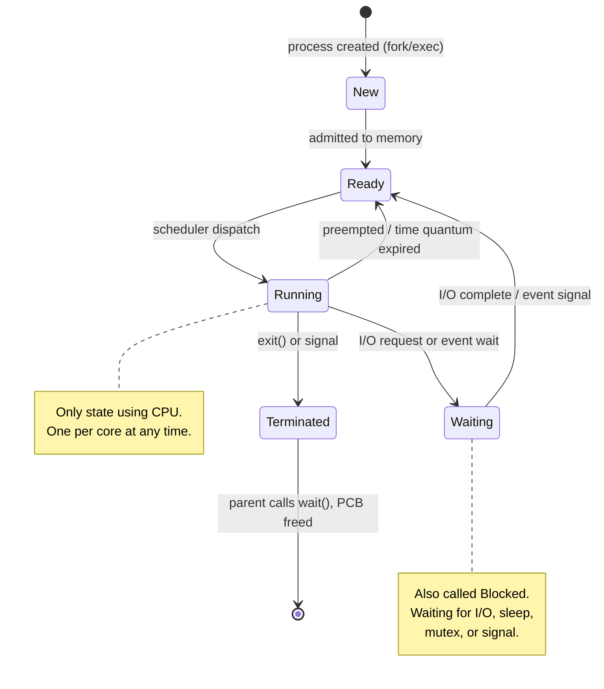

# Processes and Threads

A **process** is the fundamental unit of work in an operating system. Understanding how processes and threads are structured, represented, and managed is the foundation for everything else in process management.

## What You'll Learn

- The difference between a program and a process
- How the OS represents a process using the Process Control Block (PCB)
- The five states a process transitions through during its lifetime
- What threads are and why they exist
- Thread models: user-level, kernel-level, and hybrid approaches
- How to create threads using POSIX pthreads in C
- Practical commands for inspecting processes on Linux

---

## What Is a Process?

A **program** is a passive entity -- a file on disk containing instructions. A **process** is that program in execution: an active entity with a program counter, a stack, allocated memory, and associated kernel resources.

When you run `./myprogram`, the OS creates a process:

```
Program (disk)                 Process (memory)
┌──────────────┐              ┌──────────────────────┐
│  Executable  │   load       │  Text (code)         │
│  file        │ ──────────>  │  Data (globals)      │
│  (.out/.exe) │              │  Heap (dynamic alloc) │
│              │              │  Stack (local vars)   │
└──────────────┘              │  PCB (kernel)         │
                              └──────────────────────┘
```

A single program can have multiple processes (e.g., opening two terminal windows running `bash` creates two separate processes).

### Process Memory Layout

```
High Address ┌────────────────────┐
             │   Command-line     │
             │   args & env vars  │
             ├────────────────────┤
             │      Stack         │  ← grows downward
             │   (local vars,     │
             │    return addrs)   │
             ├─ ─ ─ ─ ─ ─ ─ ─ ─ ┤
             │        ↓           │
             │   (free space)     │
             │        ↑           │
             ├─ ─ ─ ─ ─ ─ ─ ─ ─ ┤
             │      Heap          │  ← grows upward
             │   (malloc, new)    │
             ├────────────────────┤
             │   Uninitialized    │
             │   Data (BSS)       │
             ├────────────────────┤
             │   Initialized      │
             │   Data             │
             ├────────────────────┤
             │   Text (Code)      │  ← read-only
Low Address  └────────────────────┘
```

---

## Process Control Block (PCB)

The OS maintains a **Process Control Block** (also called a task struct in Linux) for every process. It contains all the information the OS needs to manage that process.

```
┌──────────────────────────────────┐
│     Process Control Block (PCB)  │
├──────────────────────────────────┤
│  Process ID (PID)                │
│  Process State                   │
│  Program Counter (PC)            │
│  CPU Registers                   │
│  CPU Scheduling Info (priority)  │
│  Memory Management Info          │
│    (page tables, segment tables) │
│  I/O Status (open files, devices)│
│  Accounting Info (CPU time used) │
│  Parent PID, Child PIDs          │
│  Signal Handling Info            │
└──────────────────────────────────┘
```

In Linux, the PCB is implemented as `struct task_struct` in the kernel source (`include/linux/sched.h`). It is one of the largest structs in the kernel.

---

## Process States

A process moves through well-defined states during its lifetime:



| State | Description |
|-------|-------------|
| **New** | Process is being created |
| **Ready** | Process is waiting to be assigned to a CPU |
| **Running** | Instructions are being executed |
| **Waiting** | Process is waiting for an event (I/O completion, signal) |
| **Terminated** | Process has finished execution |

---

## What Is a Thread?

A **thread** is the smallest unit of CPU execution within a process. A process has at least one thread (the main thread). Multiple threads within the same process share the same address space but each has its own:

- Program counter
- Register set
- Stack

```
Single-threaded Process          Multi-threaded Process
┌───────────────────┐           ┌───────────────────────────┐
│  Code             │           │  Code (shared)            │
│  Data             │           │  Data (shared)            │
│  Files            │           │  Files (shared)           │
│                   │           │                           │
│  ┌─────────────┐  │           │  ┌───────┐ ┌───────┐ ┌───────┐
│  │ Registers   │  │           │  │Regist.│ │Regist.│ │Regist.│
│  │ Stack       │  │           │  │Stack  │ │Stack  │ │Stack  │
│  │ PC          │  │           │  │PC     │ │PC     │ │PC     │
│  └─────────────┘  │           │  └───────┘ └───────┘ └───────┘
│   (1 thread)      │           │  Thread 1  Thread 2  Thread 3│
└───────────────────┘           └───────────────────────────────┘
```

### Benefits of Multithreading

1. **Responsiveness** -- a UI thread stays interactive while a worker thread does computation
2. **Resource sharing** -- threads share memory, cheaper than IPC between processes
3. **Economy** -- creating/switching threads is faster than processes
4. **Scalability** -- threads can run in parallel on multicore CPUs

---

## User-Level vs Kernel-Level Threads

| Feature | User-Level Threads | Kernel-Level Threads |
|---------|--------------------|----------------------|
| Managed by | User-space thread library | Operating system kernel |
| Kernel awareness | Kernel sees one thread | Kernel sees all threads |
| Context switch speed | Fast (no kernel trap) | Slower (requires kernel mode) |
| Blocking behavior | One blocks, all block | One blocks, others continue |
| Multicore utilization | Cannot use multiple cores | Can run on separate cores |
| Examples | GNU Pth, Green threads | Linux pthreads, Windows threads |

---

## Thread Models

### Many-to-One

Many user threads map to a single kernel thread. Thread management is in user space and efficient, but a blocking call blocks the entire process.

```
User Threads        Kernel Thread
  T1 ──┐
  T2 ──┼──────────>  KT1
  T3 ──┘
```

### One-to-One

Each user thread maps to a kernel thread. Provides true parallelism but creating a thread requires kernel overhead.

```
User Threads        Kernel Threads
  T1 ──────────────>  KT1
  T2 ──────────────>  KT2
  T3 ──────────────>  KT3
```

Used by: Linux (NPTL), Windows

### Many-to-Many

Many user threads map to a smaller or equal number of kernel threads. Balances concurrency with overhead.

```
User Threads        Kernel Threads
  T1 ──┐
  T2 ──┼──────────>  KT1
  T3 ──┘
  T4 ──┐
  T5 ──┼──────────>  KT2
```

---

## Process vs Thread Comparison

| Aspect | Process | Thread |
|--------|---------|--------|
| Address space | Separate | Shared within process |
| Creation cost | High (fork, copy page tables) | Low (just stack + registers) |
| Context switch cost | High (TLB flush, cache) | Lower (shared address space) |
| Communication | IPC required (pipes, sockets) | Shared memory directly |
| Isolation | Strong (crash = one process) | Weak (crash can kill process) |
| Resource ownership | Owns files, memory, etc. | Shares process resources |
| Overhead | Higher | Lower |

---

## POSIX Threads (pthreads) -- Basic Example

```c
#include <stdio.h>
#include <stdlib.h>
#include <pthread.h>

#define NUM_THREADS 4

/* Function executed by each thread */
void *print_hello(void *arg) {
    int tid = *(int *)arg;
    printf("Hello from thread %d (pthread_id: %lu)\n",
           tid, (unsigned long)pthread_self());
    pthread_exit(NULL);
}

int main(void) {
    pthread_t threads[NUM_THREADS];
    int thread_ids[NUM_THREADS];
    int rc;

    for (int i = 0; i < NUM_THREADS; i++) {
        thread_ids[i] = i;
        rc = pthread_create(&threads[i], NULL, print_hello, &thread_ids[i]);
        if (rc) {
            fprintf(stderr, "Error: pthread_create returned %d\n", rc);
            exit(EXIT_FAILURE);
        }
    }

    /* Wait for all threads to complete */
    for (int i = 0; i < NUM_THREADS; i++) {
        pthread_join(threads[i], NULL);
    }

    printf("All threads completed.\n");
    return 0;
}
```

Compile and run:

```bash
gcc -o threads threads.c -lpthread
./threads
```

---

## Inspecting Processes on Linux

### ps -- snapshot of current processes

```bash
# All processes with full details
ps aux

# Process tree
ps -ejH

# Specific process info
ps -p 1234 -o pid,ppid,state,cmd

# Show threads of a process
ps -T -p 1234
```

### top / htop -- real-time monitoring

```bash
# Basic real-time view
top

# Show individual threads (press H inside top)
top -H

# htop (more user-friendly, install if needed)
htop
```

### /proc filesystem

```bash
# Process status
cat /proc/1234/status

# Memory map
cat /proc/1234/maps

# Number of threads
cat /proc/1234/status | grep Threads

# File descriptors
ls -l /proc/1234/fd/
```

---

## Exercises

### Beginner

1. Use `ps aux` to list all running processes. Identify the PID, PPID, and state of your shell process.
2. Compile and run the pthreads example above. Observe the order of thread output -- is it consistent across runs? Why or why not?
3. Draw the process state diagram from memory and label each transition with the event that causes it.

### Intermediate

4. Modify the pthreads example so each thread computes the sum of numbers from 1 to N (where N is passed as an argument) and returns the result via `pthread_exit`. Collect results with `pthread_join`.
5. Write a program that creates a process (`fork()`) and a thread (`pthread_create`) and prints the PID and TID from each. Compare creation time using `clock_gettime()`.
6. Use `/proc/[pid]/status` to find the number of threads, voluntary context switches, and nonvoluntary context switches for a running process.

### Advanced

7. Implement a simple user-level thread library with `setjmp`/`longjmp` that supports cooperative multitasking between 3 "threads." Each thread prints a message and yields to the next.
8. Benchmark thread creation vs process creation (fork) for 10,000 iterations. Measure wall-clock time and report the ratio.
9. Read the `task_struct` definition in the Linux kernel source. List 10 fields and explain what each one stores.

---

## Key Takeaways

- A process is a program in execution with its own address space, PCB, and OS resources.
- The PCB stores everything the OS needs to manage a process: PID, state, registers, memory info, open files.
- Processes cycle through five states: New, Ready, Running, Waiting, Terminated.
- Threads share a process's address space but have their own stack and registers.
- The one-to-one thread model (used by Linux and Windows) provides true parallelism at the cost of kernel overhead per thread.
- Multithreading improves responsiveness, resource sharing, and scalability.
- Use `ps`, `top`, `htop`, and `/proc` to inspect processes and threads on Linux.

---

## Navigation

- **Next**: [Process Creation and Termination](./02_process_lifecycle.md)
- **Section home**: [Process Management](./README.md)
