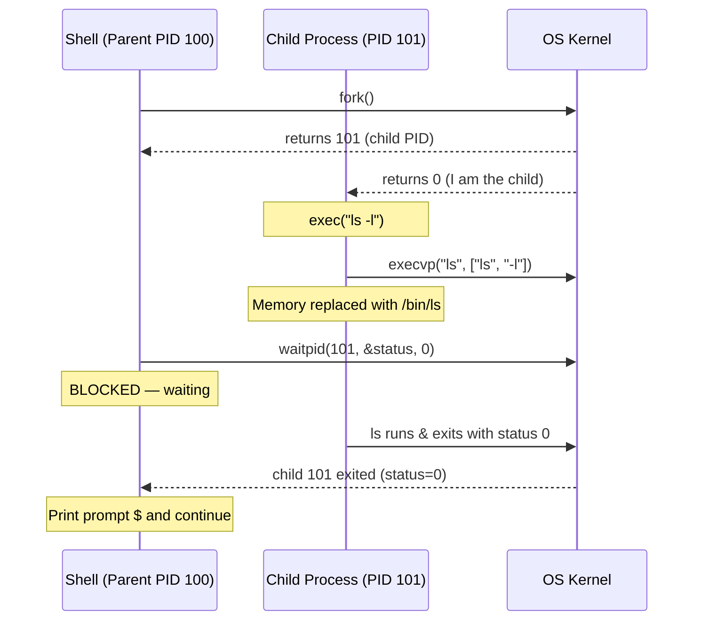

# Process Creation and Termination

Every process has a lifecycle: it is created, it executes, and it terminates. In Unix/Linux, process creation relies on a small set of powerful system calls -- `fork()`, `exec()`, `wait()`, and `exit()` -- whose interactions define the process hierarchy and govern resource cleanup.

## What You'll Learn

- How `fork()` creates a new process by duplicating the parent
- How the `exec()` family replaces a process's memory image with a new program
- The fork-exec pattern used by shells
- Parent-child relationships and the process tree
- What orphan and zombie processes are and how to handle them
- How processes terminate and how parents collect exit status
- Copy-on-Write (COW) optimization for efficient forking

---

## Process Creation with fork()

The `fork()` system call creates a **new process** (child) that is a near-exact copy of the calling process (parent).

```
Before fork()                After fork()
┌─────────────┐             ┌─────────────┐   ┌─────────────┐
│   Parent     │             │   Parent     │   │   Child      │
│   PID: 100   │    fork()   │   PID: 100   │   │   PID: 101   │
│              │  ────────>  │   fork()=101 │   │   fork()=0   │
│   Code       │             │   Code       │   │   Code       │
│   Data       │             │   Data       │   │   Data (copy)│
│   Stack      │             │   Stack      │   │   Stack(copy)│
└─────────────┘             └─────────────┘   └─────────────┘
```

Key facts about `fork()`:
- Returns **child's PID** to the parent
- Returns **0** to the child
- Returns **-1** on failure
- The child gets a copy of the parent's address space, file descriptors, and signal handlers

### Basic fork() Example

```c
#include <stdio.h>
#include <stdlib.h>
#include <unistd.h>

int main(void) {
    pid_t pid;
    int x = 10;

    pid = fork();

    if (pid < 0) {
        perror("fork failed");
        exit(EXIT_FAILURE);
    } else if (pid == 0) {
        /* Child process */
        x += 10;
        printf("Child:  PID=%d, PPID=%d, x=%d\n", getpid(), getppid(), x);
    } else {
        /* Parent process */
        x -= 5;
        printf("Parent: PID=%d, Child PID=%d, x=%d\n", getpid(), pid, x);
    }

    return 0;
}
```

Output (order may vary):

```
Parent: PID=1000, Child PID=1001, x=5
Child:  PID=1001, PPID=1000, x=20
```

Notice that `x` is independent in each process -- changes in one do not affect the other.

---

## The exec() Family

`exec()` replaces the current process's memory image with a new program. The PID stays the same; only the code, data, and stack are replaced.

```
Before exec()               After exec("/bin/ls")
┌─────────────┐             ┌─────────────┐
│  PID: 101   │             │  PID: 101   │
│  my_program │   exec()    │  /bin/ls    │
│  code/data  │  ────────>  │  code/data  │
│  stack      │             │  stack      │
└─────────────┘             └─────────────┘
```

| Function | Description |
|----------|-------------|
| `execl()` | List of arguments |
| `execlp()` | List + search PATH |
| `execle()` | List + environment |
| `execv()` | Array of arguments |
| `execvp()` | Array + search PATH |
| `execve()` | Array + environment (raw syscall) |

The naming convention: `l` = list, `v` = vector (array), `p` = PATH search, `e` = environment.

```c
#include <stdio.h>
#include <unistd.h>

int main(void) {
    printf("Before exec\n");

    /* Replace this process with /bin/ls */
    execlp("ls", "ls", "-l", NULL);

    /* This line only runs if exec fails */
    perror("exec failed");
    return 1;
}
```

---

## The fork() + exec() Pattern

Shells use this pattern to run commands: fork a child, then exec the desired program in the child while the parent waits.



### Complete fork-exec-wait Example

```c
#include <stdio.h>
#include <stdlib.h>
#include <unistd.h>
#include <sys/wait.h>

int main(void) {
    pid_t pid = fork();

    if (pid < 0) {
        perror("fork");
        exit(EXIT_FAILURE);
    }

    if (pid == 0) {
        /* Child: execute "ls -la" */
        printf("Child (PID %d): about to exec ls\n", getpid());
        execlp("ls", "ls", "-la", NULL);
        perror("exec failed");  /* only reached on error */
        exit(EXIT_FAILURE);
    }

    /* Parent: wait for child to finish */
    int status;
    pid_t waited = waitpid(pid, &status, 0);

    if (WIFEXITED(status)) {
        printf("Parent: child %d exited with status %d\n",
               waited, WEXITSTATUS(status));
    } else if (WIFSIGNALED(status)) {
        printf("Parent: child %d killed by signal %d\n",
               waited, WTERMSIG(status));
    }

    return 0;
}
```

---

## Process Hierarchy (Process Tree)

In Unix/Linux, every process (except PID 1, `init`/`systemd`) has a parent. This forms a tree:

```
systemd (PID 1)
├── sshd (PID 500)
│   └── bash (PID 1200)
│       ├── vim (PID 1350)
│       └── gcc (PID 1351)
├── cron (PID 501)
├── nginx (PID 502)
│   ├── nginx worker (PID 510)
│   └── nginx worker (PID 511)
└── dockerd (PID 503)
```

View it with:

```bash
pstree -p          # show PIDs
pstree -p -s 1350  # show ancestors of PID 1350
```

---

## Zombie Processes

A **zombie** (defunct) process has terminated but its parent has not yet called `wait()` to collect its exit status. The process entry remains in the process table.

```
Timeline:
1. Child calls exit()       → child becomes zombie
2. Parent calls wait()      → zombie entry removed
    (or parent never calls wait → zombie persists)
```

```
$ ps aux | grep Z
USER  PID  STAT  COMMAND
john  1234  Z+   [myprog] <defunct>
```

Zombies consume a PID and a slot in the process table but no memory or CPU. Too many zombies can exhaust the PID space.

### Creating a Zombie (demonstration)

```c
#include <stdio.h>
#include <stdlib.h>
#include <unistd.h>

int main(void) {
    pid_t pid = fork();

    if (pid == 0) {
        /* Child exits immediately */
        printf("Child (PID %d) exiting.\n", getpid());
        exit(0);
    }

    /* Parent sleeps without calling wait() */
    printf("Parent sleeping. Check 'ps aux | grep Z'.\n");
    sleep(60);

    return 0;
}
```

---

## Orphan Processes

An **orphan** process is a child whose parent has terminated. The OS re-parents orphans to `init` (PID 1), which periodically calls `wait()` to clean them up.

```
Before parent exits:         After parent exits:
  Parent (100)                 init (1)
    └── Child (101)              └── Child (101)  ← re-parented
```

### Creating an Orphan (demonstration)

```c
#include <stdio.h>
#include <stdlib.h>
#include <unistd.h>

int main(void) {
    pid_t pid = fork();

    if (pid == 0) {
        /* Child: sleep to outlive parent */
        sleep(5);
        printf("Child: my PPID is now %d (should be 1 or init)\n", getppid());
        exit(0);
    }

    /* Parent exits immediately */
    printf("Parent (PID %d) exiting. Child = %d\n", getpid(), pid);
    exit(0);
}
```

---

## Process Termination

Processes terminate by calling `exit()` or by receiving an unhandled signal.

| Method | Description |
|--------|-------------|
| `exit(status)` | Normal termination, flushes stdio buffers |
| `_exit(status)` | Immediate termination, no cleanup |
| `return` from `main()` | Equivalent to `exit(return_value)` |
| Signal (SIGKILL, SIGTERM) | Abnormal termination |

### Sending Signals

```bash
kill -SIGTERM 1234    # polite termination request
kill -SIGKILL 1234    # forceful kill (cannot be caught)
kill -9 1234          # same as SIGKILL
killall myprogram     # kill by name
```

---

## wait() and waitpid()

Parents use `wait()` or `waitpid()` to:
1. Block until a child terminates
2. Collect the child's exit status
3. Free the child's process table entry (reap the zombie)

```c
#include <sys/wait.h>

pid_t wait(int *status);               /* wait for any child */
pid_t waitpid(pid_t pid, int *status, int options);  /* wait for specific child */
```

Status inspection macros:

| Macro | Returns |
|-------|---------|
| `WIFEXITED(status)` | True if child exited normally |
| `WEXITSTATUS(status)` | Exit code (0-255) |
| `WIFSIGNALED(status)` | True if killed by signal |
| `WTERMSIG(status)` | Signal number that killed child |

Options for `waitpid`:
- `WNOHANG` -- return immediately if no child has exited (non-blocking)

---

## Copy-on-Write (COW)

Naively, `fork()` would duplicate the entire address space of the parent. Modern kernels use **Copy-on-Write**: parent and child initially share the same physical pages (marked read-only). A page is copied only when either process tries to write to it.

```
After fork() with COW:
┌────────────┐          Physical Memory
│  Parent     │  page A ──┐
│  Page Table │  page B ──┼──> ┌───────────────┐
└────────────┘  page C ──┤    │ Shared Pages   │
                          │    │ (read-only)    │
┌────────────┐           │    └───────────────┘
│  Child      │  page A ──┤
│  Page Table │  page B ──┤
└────────────┘  page C ──┘

After child writes to page B:
                              ┌─────────────────┐
Parent page B ───────────────>│ Original page B  │
                              └─────────────────┘
                              ┌─────────────────┐
Child  page B ───────────────>│ Copied page B    │  ← new copy
                              └─────────────────┘
```

COW makes `fork()` very fast because no memory is actually copied until needed. This is especially beneficial in the fork-exec pattern where the child immediately calls `exec()` and never uses the parent's pages.

---

## Practical: pstree Command

```bash
# Show full process tree with PIDs
pstree -p

# Show tree for current user
pstree -u $USER

# Show ancestors of a specific PID
pstree -s -p 1234

# Show command-line arguments
pstree -a
```

---

## Exercises

### Beginner

1. Write a C program that calls `fork()` and prints the PID and PPID from both parent and child. Run it multiple times and note how PIDs change.
2. Use `pstree -p` to find the parent chain from your shell process back to PID 1. Write down each process name and PID.
3. Explain in your own words why `fork()` returns different values to parent and child. Why is this design useful?

### Intermediate

4. Write a program that creates 5 child processes in a loop. Each child prints its PID and exits with a status equal to its index (0-4). The parent waits for all children and prints each child's exit status.
5. Create a zombie process as shown above. Use `ps aux | grep Z` to observe it. Then modify the parent to call `wait()` after a delay and verify the zombie is reaped.
6. Write a mini-shell that reads commands from stdin, forks a child, and uses `execlp()` to run them. Support single-word commands like `ls`, `pwd`, `date`.

### Advanced

7. Implement a program that forks a child, and the child forks a grandchild. The original parent should wait for the child, and the child should wait for the grandchild. Print the process tree using `pstree` from within the program (hint: use `sprintf` to build the command string with PIDs).
8. Write a program that demonstrates COW: fork, then write to a large array in the child. Use `/proc/[pid]/status` (specifically `VmRSS`) before and after the write to observe the memory usage change.
9. Implement a signal handler using `SIGCHLD` to automatically reap zombie children without blocking on `wait()`. Test by creating and terminating 10 children.

---

## Key Takeaways

- `fork()` creates a child process that is a copy of the parent; it returns 0 to the child and the child's PID to the parent.
- `exec()` replaces the current process image with a new program without changing the PID.
- Shells use the fork-exec-wait pattern to run commands.
- A zombie is a terminated child whose parent has not called `wait()`. An orphan is a child whose parent has died (re-parented to init).
- Always call `wait()`/`waitpid()` to reap children and prevent zombie accumulation.
- Copy-on-Write makes `fork()` efficient by deferring memory copying until a write actually occurs.
- The process tree is rooted at PID 1 (`init`/`systemd`); every other process has a parent.

---

## Navigation

- **Previous**: [Processes and Threads](./01_processes_and_threads.md)
- **Next**: [CPU Scheduling Algorithms](./03_cpu_scheduling.md)
- **Section home**: [Process Management](./README.md)
